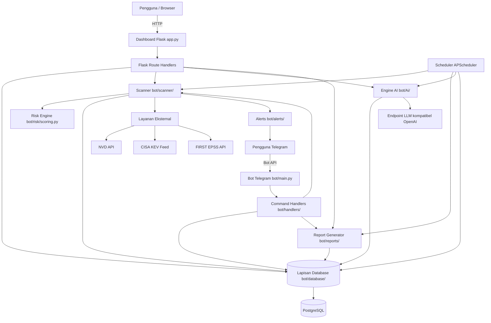
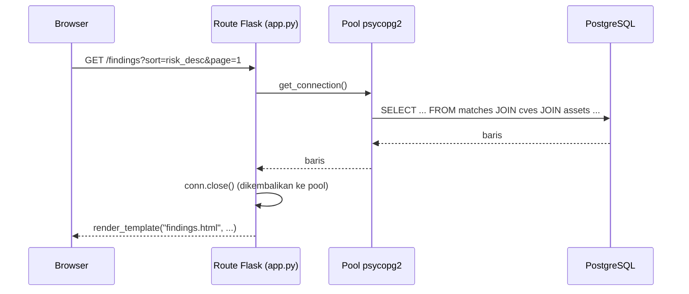
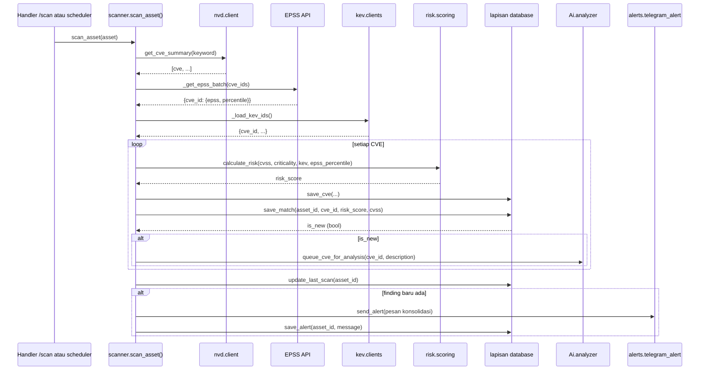
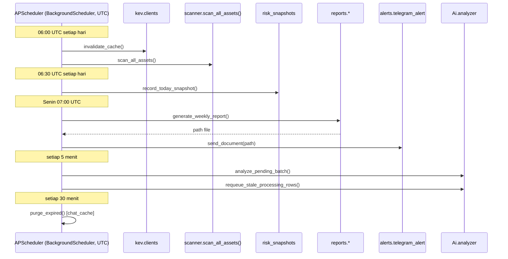
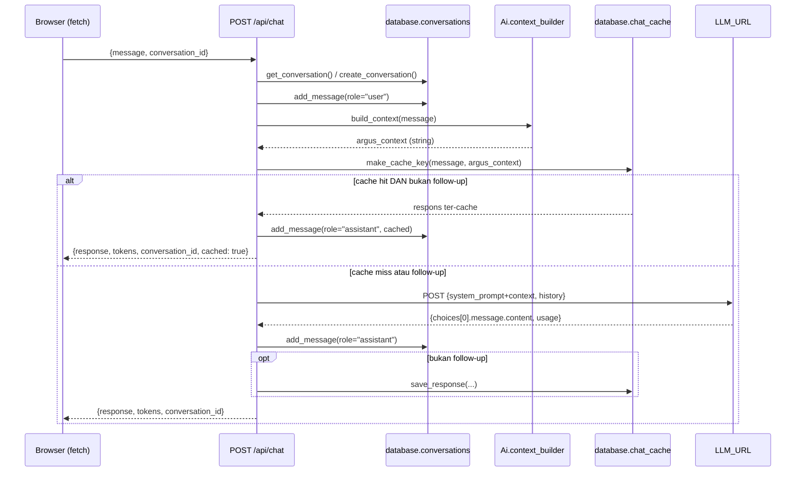

<div align="center">

# Referensi API ARGUS

🌐 [English](README.md) | [Indonesia](README.id.md)

</div>

Dokumen ini adalah referensi developer resmi untuk ARGUS. Dokumen ini mendokumentasikan setiap antarmuka yang diekspos platform — route Flask dashboard, JSON API internal yang dipanggil JavaScript dari route-route tersebut, command bot Telegram, API internal AI Security Copilot, lapisan abstraksi database, scanner, risk engine, subsistem reporting dan alerting, scheduler, dan setiap integrasi layanan eksternal.

> **Catatan akurasi.** Setiap route, signature fungsi, parameter, perilaku SQL, dan bentuk respons yang didokumentasikan di bawah ini diverifikasi langsung terhadap source ARGUS (`app.py`, `bot/handlers/*.py`, `bot/database/*.py`, `bot/Ai/*.py`, `bot/scanner/scanner.py`, `bot/risk/scoring.py`, `bot/reports/*.py`, `bot/alerts/telegram_alert.py`, `bot/jobs/daily_scan.py`, `bot/nvd/client.py`, `bot/kev/clients.py`). Apa pun yang dijelaskan sebagai antarmuka **future** atau **planned (direncanakan)** tidak ada dalam codebase saat ini dan ditandai demikian.

---

## Daftar Isi

1. [Ringkasan API](#1-ringkasan-api)
2. [Arsitektur API](#2-arsitektur-api)
3. [Autentikasi](#3-autentikasi)
4. [Otorisasi](#4-otorisasi)
5. [Route Dashboard](#5-route-dashboard)
6. [Command Bot Telegram](#6-command-bot-telegram)
7. [API AI](#7-api-ai)
8. [API Database](#8-api-database)
9. [API Scanner](#9-api-scanner)
10. [API Risk Engine](#10-api-risk-engine)
11. [API Reporting](#11-api-reporting)
12. [API Alert](#12-api-alert)
13. [Antarmuka Scheduler](#13-antarmuka-scheduler)
14. [Layanan Eksternal](#14-layanan-eksternal)
15. [Komunikasi Modul Internal](#15-komunikasi-modul-internal)
16. [Penanganan Error](#16-penanganan-error)
17. [Format Respons](#17-format-respons)
18. [Antarmuka Konfigurasi](#18-antarmuka-konfigurasi)
19. [Rate Limiting](#19-rate-limiting)
20. [Pertimbangan Keamanan](#20-pertimbangan-keamanan)
21. [Pertimbangan Performa](#21-pertimbangan-performa)
22. [Titik Ekstensi](#22-titik-ekstensi)
23. [REST API Masa Depan](#23-rest-api-masa-depan)
24. [Versioning](#24-versioning)
25. [Panduan Developer](#25-panduan-developer)
26. [Contoh](#26-contoh)
27. [Referensi Silang](#27-referensi-silang)

---

## 1. Ringkasan API

ARGUS saat ini tidak mengekspos REST API ber-versi yang menghadap eksternal. Yang ada saat ini adalah dua jenis antarmuka:

1. **Antarmuka dashboard** — Route Flask di `app.py` yang me-render HTML sisi-server (template Jinja2) untuk navigasi browser, atau mengembalikan JSON untuk dikonsumsi JavaScript dashboard sendiri (data chart, chat AI, manajemen percakapan, data city-exposure). Route JSON ini bersifat **internal** — dibangun untuk front end ARGUS sendiri, tidak dirancang atau diberi versi sebagai API publik — tetapi didokumentasikan penuh di sini karena ini satu-satunya antarmuka programatik ke dashboard ARGUS yang sedang berjalan saat ini.
2. **Antarmuka Telegram** — Command bot (`bot/handlers/*.py`) yang terdaftar terhadap Telegram Bot API, menyediakan cara percakapan alternatif untuk melakukan sebagian besar operasi yang sama yang tersedia di dashboard.

Di bawah kedua front end ini terdapat satu lapisan modul internal bersama, digunakan secara identik oleh keduanya:

- **Lapisan database** (`bot/database/`) — satu-satunya kode yang berbicara ke PostgreSQL.
- **Scanner** (`bot/scanner/scanner.py`) — logika korelasi NVD/KEV/EPSS.
- **Risk Engine** (`bot/risk/scoring.py`) — formula penilaian risiko.
- **Engine AI** (`bot/Ai/`) — perakitan konteks, client LLM, dan pipeline analisis CVE background.
- **Reports** (`bot/reports/`) — pembuatan report PDF.
- **Alerts** (`bot/alerts/telegram_alert.py`) — pengiriman Telegram.
- **Scheduler** (`bot/jobs/daily_scan.py`) — definisi job APScheduler.

**Bagaimana subsistem berkomunikasi.** Setiap modul berkomunikasi melalui pemanggilan fungsi Python langsung dalam proses yang sama — tidak ada message queue, tidak ada RPC internal, dan tidak ada hop HTTP antara, misalnya, dashboard dan lapisan database. Dashboard dan bot Telegram adalah dua proses OS terpisah yang masing-masing mengimpor dan memanggil package `bot/` yang sama, dan mereka hanya "berkomunikasi" secara tidak langsung, melalui database PostgreSQL bersama.

**Filosofi REST API masa depan.** REST API ber-versi yang menghadap eksternal (`/api/v1/...`) adalah kemampuan yang direncanakan tetapi belum diimplementasikan — lihat [§23 REST API Masa Depan](#23-rest-api-masa-depan). Tujuan desain untuk API masa depan itu adalah mengekspos operasi yang sama yang sudah diimplementasikan secara internal (CRUD aset, pemicuan scan, query finding, chat AI, pembuatan report) di balik permukaan yang stabil, terautentikasi-token, ber-versi, bukan memperkenalkan logika bisnis baru — lapisan modul internal yang dijelaskan di atas dimaksudkan menjadi implementasi yang dipanggil REST API masa depan, bukan sesuatu yang menggantikannya.

---

## 2. Arsitektur API



**Siklus hidup request (contoh dashboard — `GET /findings`):**

1. Browser mengirim request `GET` terautentikasi ke `/findings`.
2. Decorator `@login_required` Flask-Login memverifikasi session cookie; request yang tidak terautentikasi di-redirect ke `/login`.
3. Route handler di `app.py` mem-parsing filter query-string (vendor, risk, KEV, keyword, status, city/country, paginasi).
4. Handler memanggil `get_connection()` untuk meminjam koneksi `psycopg2` yang di-pool dan mengeluarkan satu atau lebih query SQL terparameterisasi secara langsung (sebagian besar route dashboard meng-query database secara inline alih-alih melalui fungsi modul `bot/database/` — lihat [§8](#8-api-database) untuk route mana yang menggunakan pola mana).
5. Hasil diteruskan ke template Jinja2 (`bot/dashboard/templates/findings.html`) dan dirender sisi-server.
6. Koneksi dikembalikan ke pool (`conn.close()` di dalam blok `finally`).
7. `@app.after_request` menambahkan security header (`X-Content-Type-Options`, `X-Frame-Options`, `Referrer-Policy`, `Permissions-Policy`) ke respons sebelum dikirim.

**Siklus hidup request (contoh chat AI — `POST /api/chat`):** lihat sequence diagram detail di [§15.5](#155-request-chat-ai).

---

## 3. Autentikasi

### 3.1 Mekanisme

ARGUS menggunakan **autentikasi berbasis sesi Flask-Login** — tidak ada autentikasi berbasis token atau API-key untuk dashboard saat ini. Login yang berhasil mengeset session cookie yang ditandatangani; setiap request berikutnya diautentikasi oleh cookie tersebut hingga kedaluwarsa atau pengguna logout.

### 3.2 Sumber kredensial

Dua sumber kredensial dicek, secara berurutan, pada setiap percobaan login:

1. **Pengguna in-memory bawaan** — `admin` dan `viewer`, yang hash password-nya dihitung sekali saat startup proses dari environment variable `ADMIN_PASSWORD`/`VIEWER_PASSWORD` (`werkzeug.security.generate_password_hash`).
2. **Pengguna database** — baris di tabel `users` (username, `password_hash`, `role`), dibuat melalui `/register` atau dimasukkan langsung.

Verifikasi password menggunakan `werkzeug.security.check_password_hash` (perbandingan constant-time terhadap hash yang di-salt) untuk kedua sumber.

### 3.3 Alur login

```
POST /login
  username, password (field form)
    │
    ├─ Ditemukan kecocokan di dict USERS bawaan + hash cocok?
    │     → login_user(), redirect ke parameter query `next` atau /dashboard
    │
    ├─ Jika tidak: SELECT username, password_hash, role FROM users WHERE username = %s
    │     → hash cocok? → login_user(), redirect ke `next` atau /dashboard
    │
    └─ Jika tidak → render login.html dengan error=True (tidak ada pembedaan antara
              "pengguna tidak ditemukan" dan "password salah" — mencegah enumerasi username)
```

Jika sudah terautentikasi, `GET /login` langsung redirect ke `/dashboard` alih-alih merender ulang form.

### 3.4 Siklus hidup sesi

| Properti | Nilai |
|---|---|
| Flag cookie | `HttpOnly`, `SameSite=Lax` |
| Flag Secure | `true` secara default (env var `SESSION_COOKIE_SECURE` bisa diset `false` untuk pengujian HTTP lokal) |
| Umur | Tetap 8 jam (`PERMANENT_SESSION_LIFETIME=timedelta(hours=8)`), saat ini tidak dapat dikonfigurasi melalui environment variable |
| Kunci penandatanganan | `SECRET_KEY` (wajib; aplikasi menolak start tanpanya) |
| Logout | `POST /logout` — memanggil `logout_user()`, menghapus sesi |

### 3.5 Proteksi CSRF

Semua route yang mengubah state dilindungi oleh **`CSRFProtect` milik Flask-WTF**, diterapkan secara global ke aplikasi Flask (`csrf = CSRFProtect(app)`). Form yang dirender template Jinja2 harus menyertakan token CSRF (`{{ csrf_token() }}` — detail implementasi template, bukan route handler) agar request `POST` berhasil; token yang hilang atau tidak valid menghasilkan `400 Bad Request`.

### 3.6 RBAC

Lihat [§4 Otorisasi](#4-otorisasi) untuk model peran/izin lengkap.

### 3.7 Mekanisme autentikasi masa depan

**Belum diimplementasikan saat ini:**
- **Token API** — tidak ada skema autentikasi bearer-token atau API-key. Semua akses programatik ke route JSON `/api/*` saat ini mengandalkan session cookie yang sama seperti navigasi browser.
- **OAuth** — tidak ada integrasi provider OAuth (Google, GitHub, dll.).
- **SSO** — tidak ada integrasi SAML/OIDC. Dicantumkan sebagai item roadmap di `README.md`.

Jika Anda mengintegrasikan dengan ARGUS secara programatik saat ini, satu-satunya pendekatan yang didukung adalah mengautentikasi melalui `POST /login` dengan HTTP client yang sadar cookie-jar dan menggunakan ulang session cookie yang dihasilkan untuk request berikutnya — tidak ada jenis kredensial lain yang diterima.

---

## 4. Otorisasi

### 4.1 Peran

ARGUS mengimplementasikan tepat **dua peran** — tidak ada peran `Analyst` atau sistem peran kustom dalam codebase saat ini, meskipun itu adalah pola umum di platform sebanding.

| Peran | Sumber | Deskripsi |
|---|---|---|
| `admin` | Bawaan (`ADMIN_PASSWORD`) atau baris `users` dengan `role='admin'` | Akses baca/tulis penuh, termasuk manajemen aset, perubahan status/penugasan finding, scan on-demand, dan pembuatan report |
| `viewer` | Bawaan (`VIEWER_PASSWORD`), atau peran default untuk akun yang mendaftar sendiri | Akses read-only ke tampilan dashboard |

Akun yang mendaftar sendiri (melalui `/register`) dimasukkan ke tabel `users` tanpa nilai `role` eksplisit; default skema kolom tersebut adalah `viewer`, jadi **setiap pengguna yang mendaftar sendiri adalah `viewer` hingga administrator secara manual mengubah peran mereka** (`UPDATE users SET role = 'admin' WHERE username = '...'` — tidak ada UI dashboard untuk manajemen peran).

### 4.2 Mekanisme penegakan

Dua decorator, diterapkan bersamaan pada route yang membutuhkannya:

```python
@login_required   # Flask-Login: pengguna terautentikasi mana pun (admin atau viewer)
@admin_required   # Decorator kustom di app.py: current_user.role != "admin" → 403
```

`admin_required` adalah decorator pembungkus-fungsi biasa (bukan ekstensi Flask-Login) yang mengembalikan respons literal `("Forbidden", 403)` saat pengecekan gagal — ia tidak redirect ke `/login`, karena menurut definisi pengguna sudah terautentikasi pada titik itu.

### 4.3 Matriks izin

| Route / Kemampuan | Anonim | `viewer` | `admin` |
|---|---|---|---|
| `/`, `/features`, `/basics`, `/cves`, `/cve/<id>`, `/docs` (halaman publik) | ✅ | ✅ | ✅ |
| `/login`, `/register` | ✅ | ✅ | ✅ |
| `/dashboard`, `/assets`, `/findings`, `/reports`, `/charts`, `/search`, `/asset/<id>`, `/finding/<cve_id>` (tampilan baca) | ❌ | ✅ | ✅ |
| `/api/chart/*`, `/api/dashboard/city-exposure` (data chart/JSON) | ❌ | ✅ | ✅ |
| `/api/chat`, `/api/conversations*` (chat AI) | ❌ | ✅ | ✅ |
| `/finding/update_status` (ubah status finding) | ❌ | ✅ | ✅ |
| `/finding/update_assignment` (penugasan owner/team) | ❌ | ❌ | ✅ |
| `/add_asset`, `/edit_asset/<id>`, `/delete_asset/<id>` (CRUD aset) | ❌ | ❌ | ✅ |
| `/today` (picu scan penuh) | ❌ | ❌ | ✅ |
| `/toggle_patched/<asset_id>/<cve_id>` | ❌ | ❌ | ✅ |
| `/generate_report/<type>` | ❌ | ❌ | ✅ |
| `/profile`, `/delete_account` (akun sendiri) | ❌ | ✅ (akun sendiri saja) | ✅ (akun sendiri saja) |
| `/download/<report_id>` | ❌ | ✅ | ✅ |

**Asimetri yang perlu diperhatikan:** `update_finding_status` hanya `@login_required` (pengguna terautentikasi mana pun, termasuk `viewer`, bisa menggerakkan finding melewati alur status-nya), sementara `update_finding_assignment` tambahan mensyaratkan `@admin_required`. Ini disengaja dalam implementasi saat ini — perubahan status (misalnya menandai sesuatu "In Progress") diperlakukan sebagai tindakan lebih ringan dibandingkan menugaskan-ulang kepemilikan.

### 4.4 Peran kustom masa depan

Belum diimplementasikan. Sistem peran yang lebih granular (misalnya peran "Analyst" yang di-scope di antara `viewer` dan `admin`) tidak ada dalam codebase saat ini; jika Anda membutuhkan izin yang lebih granular saat ini, solusi praktisnya adalah menjaga akun administratif sensitif terbatas pada `admin` dan memperlakukan setiap akun lain sebagai secara efektif read-only melalui `viewer`.

---

## 5. Route Dashboard

Semua route didefinisikan di `app.py`. Kecuali dinyatakan lain, route HTML merender template Jinja2 dari `bot/dashboard/templates/` dan route JSON mengembalikan `application/json`.

### 5.1 Route publik / tidak terautentikasi

#### `GET /`
- **Tujuan:** Halaman landing.
- **Auth:** Tidak ada.
- **Respons:** Merender `landing.html`.

#### `GET /features`
- **Tujuan:** Halaman gambaran umum marketing/fitur.
- **Auth:** Tidak ada.
- **Respons:** Merender `features.html`.

#### `GET /basics`
- **Tujuan:** Halaman pengantar "bagaimana ARGUS bekerja".
- **Auth:** Tidak ada.
- **Respons:** Merender `basics.html`.

#### `GET /docs`
- **Tujuan:** Halaman dokumentasi dalam-aplikasi.
- **Auth:** Tidak ada.
- **Respons:** Merender `docs.html`.

#### `GET /cves`
- **Tujuan:** Pencarian kata kunci NVD live (tidak meng-query database ARGUS sendiri — meng-query NVD API langsung, pada setiap request).
- **Auth:** Tidak ada.
- **Parameter query:**

  | Param | Tipe | Default | Catatan |
  |---|---|---|---|
  | `q` | string | `""` | Kata kunci pencarian. Jika kosong, tidak ada panggilan NVD yang dibuat dan set hasil kosong ditampilkan. |
  | `sort` | string | `newest` | Salah satu dari `cvss_desc`, `cvss_asc`, `cve_asc`, `cve_desc`, `oldest`, `newest` |
  | `page` | int | `1` | Nomor halaman berbasis-1 |
  | `per_page` | int | `25` | Hasil per halaman (paginasi sisi-client atas seluruh set hasil NVD yang sudah diambil) |

- **Perilaku:** Memanggil `https://services.nvd.nist.gov/rest/json/cves/2.0?keywordSearch=<q>` dengan `NVD_API_KEY` sebagai header `apiKey` jika dikonfigurasi, timeout connect/read `(10, 90)` detik. Mem-parsing deskripsi Inggris setiap hasil, skor dasar CVSS v3.1 (best-effort — jatuh ke `"N/A"` jika tidak ada), tanggal publikasi, dan flag `cisaExploitAdd` (keanggotaan KEV sebagaimana dilaporkan langsung oleh NVD, independen dari cache KEV milik ARGUS sendiri).
- **Respons:** Merender `cves_live.html`. Pada error HTTP NVD, merender template yang sama dengan `error="NVD returned HTTP <status>"` dan daftar hasil kosong; pada respons JSON tidak valid, `error="NVD returned invalid response"`.
- **Performa:** Tidak ada caching — setiap request dengan `q` yang tidak kosong membuat panggilan NVD live. Penggunaan traffic-tinggi pada route ini tanpa `NVD_API_KEY` akan cepat mengenai rate limit tanpa-autentikasi NVD.

#### `GET /cve/<cve_id>`
- **Tujuan:** Halaman detail untuk satu CVE, bersumber dari tabel `cves` milik ARGUS sendiri (bukan panggilan NVD live).
- **Auth:** Tidak ada.
- **Parameter path:** `cve_id` (string, misalnya `CVE-2024-12345`).
- **Perilaku:** `SELECT * FROM cves WHERE cve_id = %s`. Jika analisis AI ter-cache ada untuk CVE ini **dan** status-nya `complete`, itu dilampirkan ke konteks respons; analisis `pending`/`processing`/`failed` tidak ditampilkan (kontennya belum bisa digunakan).
- **Respons:** Merender `cve_detail.html` dengan `cve`, `analysis` (atau `None`), dan `cve_id`. Jika CVE tidak ada di database ARGUS, `cve` adalah `None` dan template diharapkan menangani kasus itu.

### 5.2 Route autentikasi

#### `GET, POST /login`
- **Tujuan:** Login sesi.
- **Auth:** Tidak ada (redirect ke `/dashboard` jika sudah terautentikasi).
- **Parameter form (POST):** `username`, `password`.
- **Respons:** Redirect `302` ke parameter query `next` atau `/dashboard` saat berhasil; merender ulang `login.html` dengan `error=True` saat gagal.
- **Panggilan DB terkait:** `SELECT username, password_hash, role FROM users WHERE username = %s` (hanya dicapai jika bukan pengguna bawaan).

#### `POST /logout`
- **Auth:** `@login_required`.
- **Respons:** Redirect `302` ke `/`.

#### `GET, POST /register`
- **Tujuan:** Pembuatan akun self-service.
- **Auth:** Tidak ada.
- **Parameter form (POST):** `username` (min 3 karakter), `password`, `confirm_password` (harus cocok).
- **Perilaku:** `INSERT INTO users (username, password_hash) VALUES (%s, %s)` — `role` dibiarkan pada default skemanya (`viewer`). Username duplikat ditolak dengan error inline alih-alih exception yang dilempar.
- **Respons:** Redirect `302` ke `/login` saat berhasil; merender ulang `register.html` dengan `error=<pesan>` saat validasi gagal.

#### `GET, POST /profile`
- **Tujuan:** Mengubah password atau username pengguna saat ini.
- **Auth:** `@login_required`.
- **Parameter form (POST):** `action` (`change_password` atau `change_username`), plus field khusus-aksi (`current_password`/`new_password`/`confirm_password`, atau `new_username`/`confirm_password_username`).
- **Perilaku:** Memperbarui dict `USERS` in-memory untuk akun bawaan dan best-effort mencerminkan perubahan ke tabel `users` (dibungkus dalam `try/except: pass` telanjang — tabel `users` yang hilang atau error DB diabaikan secara diam-diam sehingga manajemen profil terdegradasi dengan baik alih-alih crash). Perubahan username men-logout pengguna dan redirect ke `/login`, karena identitas sesi telah berubah di baliknya.
- **Respons:** Merender ulang `profile.html` dengan pesan `success`/`error`, atau redirect ke `/login` setelah perubahan username.

#### `POST /delete_account`
- **Tujuan:** Menghapus akun pengguna saat ini secara permanen.
- **Auth:** `@login_required`.
- **Parameter form:** `confirm_password`.
- **Perilaku:** Memverifikasi password terhadap salah satu sumber kredensial in-memory atau database, lalu `DELETE FROM users WHERE username = %s` dan menghapus entri bawaan dari `USERS` jika berlaku, lalu logout.
- **Respons:** Redirect `302` ke `/` saat berhasil; merender ulang `profile.html` dengan error jika password salah.

### 5.3 Beranda dashboard

#### `GET /dashboard`
- **Tujuan:** Halaman landing utama terautentikasi — hitungan ringkasan, finding terbaru, risiko teratas, report terbaru, KEV terbaru, breakdown status finding, dan City Exposure Overview.
- **Auth:** `@login_required`.
- **Panggilan DB terkait:** Beberapa query agregat dalam satu koneksi (hitungan aset/CVE/finding/KEV/report, top-5 finding terbaru berdasarkan risiko, top-5 risiko per CVE unik, 5 CVE KEV terbaru, breakdown status, hitungan resolved, rata-rata hari-terbuka untuk finding `Open`, hitungan terlambat), plus `get_city_exposure_summary()` dan `get_unassigned_asset_count()` dari `bot/database/assets.py`.
- **Layanan terkait:** `config.locations` (`get_coordinates`, `classify_risk_level`, `RISK_LEVEL_COLORS`) untuk memperkaya baris kota dengan koordinat peta dan warna level-risiko yang dihitung.
- **Respons:** Merender `index.html`. Juga menampilkan dan menghapus `scan_summary` satu-kali dari sesi jika `/today` baru saja dipicu (pola flash-message — ringkasan dikonsumsi dan dihapus dari sesi pada render ini).
- **Pertimbangan performa:** Route ini mengeluarkan sekitar selusin query terpisah per request; tidak ada lapisan caching untuk agregat dashboard (berbeda dengan chat AI, yang meng-cache query konteksnya sendiri secara terpisah — lihat [§7](#7-api-ai)).

#### `GET /api/dashboard/city-exposure`
- **Tujuan:** Versi JSON dari data peta City Exposure Overview, untuk rendering ulang sisi-client (misalnya tombol "refresh") tanpa reload halaman penuh.
- **Auth:** `@login_required` (tersedia untuk kedua peran — read-only, dan secara eksplisit dirancang untuk hanya mengekspos hitungan tingkat-kota yang teragregasi, tidak pernah detail per-aset, sesuai persyaratan keamanan yang didokumentasikan di docstring route itu sendiri).
- **Respons (200):**
  ```json
  {
    "cities": [
      {
        "country_code": "US",
        "city": "Springfield",
        "lat": 39.78,
        "lng": -89.65,
        "mapped": true,
        "asset_count": 4,
        "finding_count": 12,
        "unique_cve_count": 9,
        "kev_count": 1,
        "max_risk_score": 168,
        "risk_level": "High",
        "assets_url": "/assets?country=US&city=Springfield",
        "findings_url": "/findings?country=US&city=Springfield"
      }
    ],
    "unmapped_city_count": 0,
    "unassigned_asset_count": 3
  }
  ```
- **Respons error (500):** `{"error": "Failed to load city exposure data."}` jika query yang mendasari atau lookup koordinat melempar exception.

### 5.4 Aset

#### `GET /assets`
- **Tujuan:** Listing inventaris aset yang dipaginasi/dapat-diurutkan/dapat-difilter.
- **Auth:** `@login_required`.
- **Parameter query:**

  | Param | Tipe | Default | Catatan |
  |---|---|---|---|
  | `sort` | string | `id_asc` | Salah satu dari `id_asc`, `id_desc`, `vendor_asc`, `vendor_desc`, `product_asc`, `product_desc`, `priority_asc`, `priority_desc` (sort priority menggunakan ekspresi `CASE` atas Low/Medium/High/Critical) |
  | `country` | string | `""` | Filter kode negara 2-huruf; divalidasi terhadap `config.locations.SUPPORTED_LOCATIONS` — nilai yang tidak dikenali diam-diam diabaikan alih-alih error |
  | `city` | string | `""` | Filter kota; diabaikan kecuali `country` valid dan kota tersebut termasuk dalam daftar yang didukung negara itu |

- **Respons:** Merender `assets.html` dengan baris aset yang difilter/diurutkan, `total_assets`, dan dictionary lokasi-yang-didukung (untuk mengisi dropdown filter).

#### `GET, POST /add_asset`
- **Auth:** `@login_required`, `@admin_required`.
- **Parameter form (POST):** `vendor`, `product`, `version` (semua wajib), `search_keyword` (opsional — default `"<vendor> <product>"`), `type` (opsional — default `Unknown`; divalidasi terhadap `VALID_TYPES`), `location`, `owner`, `priority` (dipetakan ke `criticality`), `notes`, `country_code`, `city` (opsional; divalidasi sisi-server melalui `is_valid_city()` — kombinasi tidak valid diam-diam disimpan sebagai `NULL`, bukan ditolak).
- **Respons:** Redirect `302` ke `/assets` saat berhasil; `GET` merender `add_asset.html` dengan daftar tipe valid dan lokasi yang didukung untuk pengisian form.

#### `GET, POST /edit_asset/<int:asset_id>`
- **Auth:** `@login_required`, `@admin_required`.
- **Parameter path:** `asset_id` (integer).
- **Parameter form (POST):** Bentuk sama seperti `/add_asset`.
- **Respons:** Redirect `302` ke `/assets` saat berhasil; `GET` merender `edit_asset.html` yang sudah diisi dengan baris aset saat ini.

#### `POST /delete_asset/<int:asset_id>`
- **Auth:** `@login_required`, `@admin_required`.
- **Perilaku:** Hapus manual bertingkat — `DELETE FROM matches WHERE asset_id=%s`, lalu `DELETE FROM alerts WHERE asset_id=%s`, lalu `DELETE FROM assets WHERE id=%s`, semuanya dalam satu transaksi.
- **Respons:** Redirect `302` ke `/assets`.

#### `GET /asset/<int:asset_id>`
- **Tujuan:** Halaman detail satu-aset dengan finding-nya.
- **Auth:** `@login_required`.
- **Parameter query:** `ref` (default `assets` — mengontrol target tautan "kembali"), `sort` (default `risk_desc`; salah satu dari `risk_desc`, `risk_asc`, `cve_asc`, `cve_desc`, `cvss_desc`, `cvss_asc`).
- **Perilaku:** Mengambil baris aset, lalu finding-nya yang di-join terhadap `cves`. Menggunakan pasangan query coba/fallback — query primer memilih kolom `status`/`due_date`/`assigned_to`/`assigned_team`; jika gagal (misalnya, terhadap skema lama yang tidak memiliki kolom tersebut), ia transparan jatuh ke query yang dikurangi dengan default hardcoded (`'Open'`, `NULL`) setelah me-rollback transaksi yang gagal.
- **Respons:** Merender `asset_detail.html`.

### 5.5 Finding

#### `GET /findings`
- **Tujuan:** Daftar finding/kerentanan utama, dideduplikasi menjadi satu baris per CVE unik (mengagregasi di seluruh aset yang terdampak).
- **Auth:** `@login_required`.
- **Parameter query:**

  | Param | Tipe | Default | Catatan |
  |---|---|---|---|
  | `page` | int | `1` | |
  | `per_page` | int | `25` | Harus salah satu dari `{25, 50, 100, 200}`; nilai lain diam-diam jatuh ke `25` |
  | `sort` | string | `risk_desc` | Salah satu dari `cve_asc`, `cve_desc`, `cvss_desc`, `cvss_asc`, `kev_desc`, `kev_asc`, `risk_desc`, `risk_asc`, `epss_desc`, `epss_asc` |
  | `ref` | string | `""` | `"charts"` mengubah target tautan-kembali |
  | `vendor` | string | `""` | Pencocokan substring (`ILIKE`) terhadap vendor aset |
  | `risk` | string | `""` | Salah satu dari `Low` (0–75), `Medium` (76–125), `High` (126–175), `Critical` (176+) — dipetakan ke rentang `risk_score BETWEEN` |
  | `kev` | string | `""` | `"true"` atau `"false"` |
  | `keyword` | string | `""` | Pencocokan substring terhadap ID CVE, vendor, atau produk |
  | `status` | string | `""` | Pencocokan persis terhadap `matches.status` |
  | `country`, `city` | string | `""` | Validasi sama seperti `/assets` |

- **Perilaku:** Mengagregasi `matches` berdasarkan `cve_id`, mengambil `MAX(risk_score)` di seluruh aset terdampak, `COUNT(DISTINCT asset_id)`, "aset teratas" perwakilan (skor risiko individual tertinggi untuk CVE itu), apakah *ada* instance yang di-patch, status *minimum* (yaitu, paling-terbuka) di seluruh instance, dan status analisis AI jika ada. Menggunakan pola coba/fallback yang sama seperti `/asset/<id>` untuk ketahanan skema.
- **Respons:** Merender `findings.html` dengan metadata paginasi dan semua nilai filter aktif (untuk round-trip ke tautan paginasi/filter).

#### `GET /finding/<cve_id>`
- **Tujuan:** Halaman detail satu-CVE — record CVE plus setiap aset yang terdampak, dikelompokkan berdasarkan vendor/produk.
- **Auth:** `@login_required`.
- **Parameter query:** `ref` (default `findings`), `sort` (default `risk_desc`; salah satu dari `risk_desc`, `risk_asc`, `vendor_asc`, `vendor_desc`).
- **Perilaku:** Mengambil baris `cves`, lalu query terkelompok atas `matches`/`assets` untuk CVE itu (ID aset sebagai array, hari-terbuka, hitungan instance, tanggal jatuh-tempo tercepat, owner yang ditugaskan pertama). Melampirkan analisis AI ter-cache jika `status == 'complete'`.
- **Respons:** Merender `finding_detail.html`.

#### `POST /finding/update_status`
- **Auth:** `@login_required` (peran terautentikasi mana pun).
- **Parameter form:** `asset_id` (int), `cve_id` (string), `status` (harus salah satu dari `Open`, `In Progress`, `Resolved`, `Accepted Risk`, `False Positive` — `400` dikembalikan dengan body `"Invalid status"` jika tidak), `ref` (opsional — `"asset"` redirect kembali ke halaman aset alih-alih halaman finding).
- **Perilaku:** `UPDATE matches SET status=%s[, resolved_at=NOW()|NULL] WHERE asset_id=%s AND cve_id=%s`. Mengeset status ke `Resolved` mencap `resolved_at`; status lain menghapusnya.
- **Respons:** Redirect `302` ke `/asset/<id>` atau `/finding/<cve_id>` tergantung `ref`.

#### `POST /finding/update_assignment`
- **Auth:** `@login_required`, `@admin_required`.
- **Parameter form:** `asset_id`, `cve_id`, `assigned_to` (opsional), `assigned_team` (opsional).
- **Perilaku:** `UPDATE matches SET assigned_to=%s, assigned_team=%s WHERE asset_id=%s AND cve_id=%s`. String kosong disimpan sebagai `NULL`.
- **Respons:** Pola redirect sama seperti `update_finding_status`.

#### `POST /toggle_patched/<int:asset_id>/<cve_id>`
- **Auth:** `@login_required`, `@admin_required`.
- **Perilaku:** `UPDATE matches SET patched = NOT patched WHERE asset_id = %s AND cve_id = %s`.
- **Respons:** Redirect `302` ke `request.referrer` (jika `ref=findings`) atau `/asset/<asset_id>`.

### 5.6 Pencarian

#### `GET /search`
- **Tujuan:** Pencarian satu-kotak-query di seluruh aset, jatuh ke pencarian CVE live jika tidak ditemukan.
- **Auth:** `@login_required`.
- **Parameter query:** `q` (string).
- **Perilaku:** `SELECT id FROM assets WHERE product ILIKE %q% OR vendor ILIKE %q% LIMIT 1`. Jika kecocokan ditemukan, redirect langsung ke halaman detail aset tersebut. Jika tidak, redirect ke `/cves?q=<q>` (pencarian NVD live).
- **Respons:** Redirect `302` — route ini tidak pernah merender template sendiri.

### 5.7 Chart

#### `GET /charts`
- **Tujuan:** Merender halaman chart **dan**, sebagai efek samping, membuat ulang empat gambar PNG chart di disk (`bot/dashboard/static/charts/`) menggunakan matplotlib: top aset berdasarkan finding, distribusi skor risiko, pie KEV vs. non-KEV, top vendor berdasarkan finding.
- **Auth:** `@login_required`.
- **Perilaku:** Setiap request ke route ini meng-query ulang database dan merender ulang keempat PNG secara sinkron sebelum mengembalikan halaman — tidak ada caching gambar yang dihasilkan antar request.
- **Respons:** Merender `charts.html`, yang merujuk PNG yang baru ditulis.
- **Pertimbangan performa:** Pembuatan figure matplotlib bersifat CPU-bound dan terjadi inline dalam siklus request/response; pada tabel `matches` yang besar, route ini akan terukur lebih lambat dibanding endpoint chart JSON read-only di §5.8, yang tidak merender gambar.

### 5.8 API JSON Chart

Endpoint ini mendukung chart interaktif (dirender-JS) dashboard, berbeda dari PNG statis yang dihasilkan `/charts`.

#### `GET /api/chart/assets`
- **Auth:** `@login_required`.
- **Respons (200):**
  ```json
  {
    "asset_ids": [12, 7, 3],
    "labels": ["Cisco RV340", "D-Link DIR-825", "TP-Link Archer AX10"],
    "values": [14, 9, 6]
  }
  ```
  Top 10 aset berdasarkan hitungan CVE unik, dengan baris vendor+produk duplikat digabungkan menjadi satu bar (`MIN(a.id)` digunakan sebagai ID aset perwakilan untuk tautan click-through).

#### `GET /api/chart/risk`
- **Auth:** `@login_required`.
- **Respons (200):** `{"labels": ["Low","Medium","High","Critical"], "values": [41, 19, 8, 3]}` — hitungan berdasarkan `matches.risk_score` yang dikelompokkan ke rentang Low/Medium/High/Critical yang sama yang digunakan filter risiko `/findings` (0–75 / 76–125 / 126–175 / 176+), dihitung per-match (bukan per-CVE-unik) untuk konsisten dengan unit penghitungan halaman Findings.

#### `GET /api/chart/kev`
- **Auth:** `@login_required`.
- **Respons (200):** `{"labels": ["KEV","Non-KEV"], "values": [3, 47]}` — dihitung dari CVE unik (bukan match) yang memiliki setidaknya satu match aktif.

#### `GET /api/chart/vendors`
- **Auth:** `@login_required`.
- **Respons (200):** `{"labels": [...], "values": [...]}` — top 10 vendor berdasarkan hitungan CVE unik.

#### `GET /api/chart/findings_history`
- **Auth:** `@login_required`.
- **Respons (200):** `{"labels": ["2026-06-01","2026-06-02",...], "values": [3,1,...]}` — hitungan finding dikelompokkan berdasarkan `DATE(first_seen)`, menaik.

### 5.9 Chat AI dan percakapan

Lihat [§7 API AI](#7-api-ai) untuk dokumentasi lengkap `/api/chat` dan `/api/conversations*` — ini secara teknis adalah route dashboard tetapi cukup substansial untuk mendapat bagiannya sendiri.

### 5.10 Tindakan scanning dan reporting

#### `POST /today`
- **Tujuan:** Memicu scan penuh setiap aset dari dashboard (setara dengan `/today` Telegram).
- **Auth:** `@login_required`, `@admin_required`.
- **Perilaku:** Menjalankan `scanner.scan_all_assets()` di dalam thread khusus dengan event loop `asyncio`-nya sendiri (melalui `concurrent.futures.ThreadPoolExecutor(max_workers=1)`), karena `scan_all_assets()` adalah coroutine `async` dan ini adalah view Flask sinkron. Membangun ringkasan (aset di-scan, total CVE yang dilacak, finding baru, hitungan error, baris status per-aset) dan menyimpannya dalam sesi di bawah `scan_summary` untuk ditampilkan satu-kali pada render `/dashboard` berikutnya (pola flash-message).
- **Respons:** Redirect `302` ke `/dashboard`.
- **Pertimbangan performa:** Ini adalah request **sinkron, blocking** dari perspektif pemanggil — respons HTTP tidak kembali hingga seluruh scan selesai. Untuk inventaris aset besar ini bisa menjadi request yang berjalan lama; tidak ada streaming-progress atau endpoint status-job async.

#### `POST /generate_report/<report_type>`
- **Tujuan:** Pembuatan report PDF on-demand.
- **Auth:** `@login_required`, `@admin_required`.
- **Parameter path:** `report_type` — salah satu dari `day`, `week`, `month`, `year` (nilai lain mengembalikan `400 "Unknown report type"`).
- **Perilaku:** Dispatch ke `reports.daily.generate_daily_report`, `reports.weekly.generate_weekly_report`, `reports.monthly.generate_monthly_report`, atau `reports.yearly.generate_yearly_report`, dijalankan dalam thread pool single-worker. Fungsi generator ini menangkap exception internalnya sendiri dan mengembalikan `None` saat gagal alih-alih melempar, jadi route mengecek baik exception yang dilempar *maupun* nilai kembalian yang falsy.
- **Respons:** Redirect `302` ke `/reports`, dengan `session["report_success"]` atau `session["report_error"]` diset untuk ditampilkan satu-kali (pola flash-message sama seperti `/today`).

#### `GET /reports`
- **Auth:** `@login_required`.
- **Perilaku:** `SELECT id, report_type, generated_at FROM reports ORDER BY generated_at DESC`.
- **Respons:** Merender `reports.html`, menampilkan pesan flash sesi `report_success`/`report_error` yang tertunda.

#### `GET /download/<int:report_id>`
- **Auth:** `@login_required`.
- **Perilaku:** Mencari `file_path` report, menyelesaikannya relatif terhadap `REPORTS_DIR`, dan **menolak path mana pun yang menyelesaikan ke luar `REPORTS_DIR`** (`abort(403)`) — pengaman path-traversal terhadap nilai `file_path` yang malformed atau dimanipulasi. Mengembalikan `404` jika file tidak ada di disk (misalnya, dihapus secara eksternal sementara baris DB tetap ada).
- **Respons:** `send_file(..., as_attachment=True)` — memicu unduhan browser.

---

## 6. Command Bot Telegram

Semua command terdaftar di `bot/main.py` dan diimplementasikan di `bot/handlers/`. Tidak ada pembedaan peran/izin di bot Telegram saat ini — **pengguna mana pun yang bisa mengirim pesan ke bot bisa mengeksekusi command apa pun**, termasuk mutasi dan penghapusan aset. Ini adalah model otorisasi yang secara material berbeda (dan lebih longgar) dibanding split `admin`/`viewer` dashboard — lihat [§20 Pertimbangan Keamanan](#20-pertimbangan-keamanan).

### `/start`
- **Tujuan:** Mengonfirmasi bot sedang berjalan.
- **Sintaks:** `/start`
- **Respons:** `"Argus Online 🟢"`
- **Operasi database:** Tidak ada.

### `/help`
- **Tujuan:** Referensi command lengkap.
- **Sintaks:** `/help`
- **Respons:** Daftar command terformat Markdown (lihat `bot/handlers/help.py` untuk teks persisnya), termasuk daftar tipe aset valid saat ini.
- **Operasi database:** Tidak ada (membaca `VALID_TYPES` dari `database/assets.py`, konstanta dalam kode).

### `/asset`
- **Tujuan:** Menampilkan semua aset, atau menampilkan detail lengkap satu aset.
- **Sintaks:** `/asset` (daftar) atau `/asset <id>` (detail).
- **Parameter:** `id` (opsional, integer sebagai string).
- **Operasi database:** `get_all_assets()` atau `get_asset(asset_id)` (`database/assets.py`).
- **Contoh:** `/asset 7` →
  ```
  Asset Information

  ID: 7
  Vendor: Cisco
  Product: RV340
  Version: 1.0.03.29
  Type: Router

  Location: HQ-Rack3
  Owner: netops
  Priority: High

  Last Scan: 2026-07-01 06:00 UTC

  Notes:
  Edge gateway
  ```
- **Respons error:** `"Asset not found."` jika ID tidak ada. `"No assets found."` jika inventaris kosong.

### `/add`
- **Tujuan:** Mendaftarkan aset baru.
- **Sintaks:** `/add <vendor> "<product>" <version> "<search_keyword>" [type]`
- **Parameter:** Di-parsing dengan `shlex.split` jadi nilai multi-kata harus diberi tanda kutip. `vendor`, `product`, `version`, `search_keyword` wajib (minimal 4 argumen); `type` opsional dan default `Unknown`, divalidasi terhadap `VALID_TYPES` (tipe yang tidak dikenali ditolak dengan daftar tipe valid ditampilkan kembali ke pengguna, bukan dipaksa diam-diam).
- **Contoh:** `/add TP-Link "Archer AX10" 1.0 "TP-Link Archer AX10" Router`
- **Operasi database:** `add_asset(vendor, product, version, asset_type, search_keyword)` (`database/assets.py`) — `INSERT INTO assets (...)`.
- **Penggunaan AI:** Tidak ada.

### `/edit`
- **Tujuan:** Memperbarui lokasi, owner, kritikalitas, tipe, dan/atau catatan aset yang ada.
- **Sintaks:** `/edit <id> <location> <owner> <criticality> [type] [notes...]`
- **Parameter:** Posisional: `id`, `location`, `owner`, `criticality` (semua wajib — minimal 4 argumen). Posisi ke-5 diperiksa: jika cocok dengan tipe aset valid, ia dikonsumsi sebagai `type` dan semua sesudahnya menjadi `notes`; jika tidak, posisi ke-5 dan seterusnya diperlakukan seluruhnya sebagai `notes` teks bebas dan tipe aset yang ada dipertahankan.
- **Contoh:** `/edit 3 DC-A1 alice High Firewall Edge gateway`
- **Operasi database:** `get_asset(asset_id)` untuk validasi keberadaan, `update_asset(...)` untuk menerapkan perubahan, lalu ambil-ulang untuk menampilkan state akhir kembali ke pengguna.
- **Respons error:** `"Asset not found."`

### `/rm`
- **Tujuan:** Menghapus aset.
- **Sintaks:** `/rm <id>`
- **Operasi database:** `get_asset(asset_id)` (pengecekan keberadaan), `remove_asset(asset_id)`. **Catatan:** berbeda dengan route `/delete_asset` dashboard, `remove_asset()` di `database/assets.py` tidak menunjukkan logika pembersihan `matches`/`alerts` bertingkat dalam jalur Telegram seperti yang dilakukan route dashboard — verifikasi constraint foreign-key deployment Anda (`ON DELETE CASCADE` atau lainnya) di `schema.sql` jika Anda mengandalkan command ini untuk sepenuhnya membersihkan finding terkait.
- **Respons error:** `"Asset not found."`

### `/scan`
- **Tujuan:** Scan kerentanan on-demand untuk satu aset.
- **Sintaks:** `/scan <asset_id>`
- **Operasi database/layanan:** `get_asset(asset_id)`, lalu `scanner.scan_asset(asset)` — fungsi yang sama yang digunakan secara internal oleh scan terjadwal harian (lihat [§9](#9-api-scanner)).
- **Respons:** Daftar CVE yang cocok dengan CVSS, severity, dan risiko yang dihitung, menandai CVE yang terdaftar KEV dengan `⚠️ ACTIVE EXPLOIT`, plus hitungan baru-vs-total. Dipotong hingga batas pesan 4096-karakter Telegram.
- **Penggunaan AI:** Secara tidak langsung — CVE yang baru ditemukan di-queue untuk analisis AI background melalui `Ai.analyzer.queue_cve_for_analysis()`, sama seperti jalur scan lainnya.
- **Respons error:** `"Asset not found."`; `"❌ Scan failed:\n<error>"` jika lookup NVD itu sendiri gagal.

### `/today`
- **Tujuan:** Men-scan setiap aset terdaftar, dengan hasil dideduplikasi berdasarkan search keyword (jadi beberapa aset yang berbagi keyword, misalnya empat router identik, diringkas sebagai satu baris).
- **Sintaks:** `/today`
- **Operasi database/layanan:** `scanner.scan_all_assets()`.
- **Respons:** Blok ringkasan: keyword yang di-scan, total CVE unik, total finding baru, hitungan error, dan baris ✅/❌ per-keyword.
- **Respons error:** `"No assets registered. Use /add to add one."`; `"❌ Scan failed: <exc>"` pada exception yang tidak tertangani dari scan itu sendiri.

### `/findings`
- **Tujuan:** Menampilkan semua CVE yang diketahui untuk satu aset, diurutkan berdasarkan skor risiko.
- **Sintaks:** `/findings <asset_id>`
- **Operasi database:** `get_asset(asset_id)`, `get_findings(asset_id)` (`database/matches.py`).
- **Respons:** Satu blok per finding — ID CVE, CVSS, severity (dengan emoji), flag KEV, skor risiko, tanggal pertama-terlihat.
- **Respons error:** `"Usage:\n/findings <asset_id>"` (argumen hilang); `"Asset ID must be a number."`; `"Asset not found."`; `"No findings yet for <vendor> <product>.\nRun /scan <id> to scan it first."`

### `/cve`
- **Tujuan:** Pencarian kata kunci NVD live (setara dengan halaman `/cves` dashboard, tetapi diformat teks untuk chat).
- **Sintaks:** `/cve <keyword>`
- **Operasi layanan:** `nvd.client.get_cve_summary(keyword)` — panggilan API NVD live, bukan pembacaan database.
- **Respons:** Hingga batas 4096-karakter Telegram, satu blok per CVE (ID, CVSS, severity, deskripsi terpotong).
- **Respons error:** `"Usage:\n/cve <keyword>"`; `"No CVEs found."`

### `/report`
- **Tujuan:** Ringkasan teks, atau pembuatan/pengambilan report PDF, tergantung argumen.
- **Sintaks:**
  - `/report` — ringkasan teks (hitungan aset/CVE/KEV, top 5 finding berdasarkan risiko).
  - `/report day` / `/report week` / `/report month` / `/report year` — membuat PDF yang sesuai dan mengirimkannya sebagai dokumen Telegram.
  - `/report list` — daftar 20 report terakhir yang dihasilkan (dari tabel `reports`).
  - `/report <id>` — mengirim ulang PDF yang sebelumnya dihasilkan berdasarkan ID database-nya.
- **Operasi database:** `get_reports()`, `get_report(report_id)` (`database/reports.py`); jalur pembuatan on-demand memanggil fungsi generator `reports.daily/weekly/monthly/yearly` yang sama yang digunakan route dashboard `/generate_report/<type>` (lihat [§11](#11-api-reporting)).
- **Respons error:** `"Report not found."`; `"Report #<id> exists in the database but the PDF file is missing on disk."` (drift DB/filesystem); `"Failed to generate <type> report."`; `f"Error: {e}"` telanjang untuk exception lain yang tidak tertangani (handler ini membungkus logikanya dalam blok `try/except` luas per cabang, jadi kegagalan pada satu tipe report tidak memerlukan restart bot).

### `/status`
- **Tujuan:** Health check.
- **Sintaks:** `/status`
- **Operasi database/layanan:** `SELECT 1` langsung terhadap PostgreSQL, dan `nvd.client.check_nvd_api()` (query NVD live minimal). Juga melaporkan hitungan baris `assets`/`cves`/`matches` jika pengecekan database berhasil.
- **Respons:**
  ```
  Argus Status 🟢

  PostgreSQL: 🟢 Online
  NVD API:    🟢 Online

  Assets:  12
  CVEs:    340
  Matches: 58
  ```

### Command yang dirujuk dalam spesifikasi asli yang tidak ada di codebase ini

Prompt untuk dokumen ini mencantumkan beberapa command (`/lookup`, `/vuln`, `/stats`, `/ai`, `/chat`, `/log`, `/loc`, `/p`) sebagai command yang perlu didokumentasikan. **Tidak satu pun terdaftar di `bot/main.py` atau diimplementasikan di bawah `bot/handlers/`.** Padanan sungguhan terdekat adalah:

| Command yang diminta | Command sungguhan terdekat |
|---|---|
| `/lookup`, `/vuln` | `/cve <keyword>` |
| `/stats` | `/status` (kesehatan + hitungan) atau `/report` default (ringkasan finding) |
| `/ai`, `/chat` | Tidak ada padanan Telegram — chat AI Security Copilot hanya-dashboard (`/api/chat`, lihat [§7](#7-api-ai)) |
| `/log` | Tidak ada padanan — tidak ada command Telegram yang menampilkan log aplikasi |
| `/loc`, `/p` | Tidak ada padanan — peta City Exposure Overview hanya-dashboard |

Jika salah satu dari ini diinginkan, lihat [§22 Titik Ekstensi](#22-titik-ekstensi) untuk cara menambahkan command Telegram baru yang konsisten dengan pola handler yang ada.

---

## 7. API AI

### 7.1 Gambaran umum

AI Security Copilot memiliki dua entry point ke LLM: API chat interaktif (`/api/chat`, hanya-dashboard) dan pipeline analisis CVE background otomatis (`Ai/analyzer.py`, digerakkan-scheduler). Keduanya pada akhirnya memanggil fungsi completion low-level yang sama, `Ai/llm.py::complete()`, tetapi dengan **perilaku resolusi-konfigurasi yang berbeda** — lihat catatan penting di §7.8.

### 7.2 `POST /api/chat`

- **Auth:** `@login_required`.
- **Body request (JSON):**
  ```json
  {
    "message": "what should I fix first?",
    "conversation_id": 42
  }
  ```
  `conversation_id` opsional — hilangkan (atau berikan yang basi/tidak valid) untuk memulai percakapan baru; respons selalu menampilkan `conversation_id` otoritatif yang harus diadopsi.
- **Catatan CSRF:** Route ini adalah `POST` pengubah-state dan berada di bawah `CSRFProtect` global aplikasi. **Panggilan `fetch()` front-end bawaan di `base.html` tidak melampirkan header `X-CSRFToken` atau field `csrf_token`.** Diverifikasi terhadap Flask-WTF 1.3.0 (versi yang di-pin di `requirements.txt`) tanpa pengecualian atau override `WTF_CSRF_CHECK_DEFAULT` di mana pun dalam codebase: `POST` JSON tanpa token ditolak dengan `400 Bad Request` / `"The CSRF token is missing."` Jika Anda memanggil endpoint ini secara programatik (atau menemukan ini sendiri saat menguji), ambil nilai dari tag `<meta name="csrf-token" content="...">` yang dirender di setiap halaman (`bot/dashboard/templates/base.html`) dan kirim sebagai header `X-CSRFToken`.
- **Pipeline pemrosesan:**
  1. Menolak `message` kosong dengan `{"response": "Please enter a message.", "tokens": 0}` (200 OK, bukan status error).
  2. Menyelesaikan atau membuat percakapan (`database/conversations.py`); menyimpan pesan pengguna segera, sebelum memanggil LLM.
  3. Percakapan baru diberi judul otomatis dari pesan pertama (`auto_title_from_message`).
  4. Sekumpulan kecil frasa literal (`"help"`, `"what can you do"`, `"capabilities"`) langsung ke daftar kemampuan hardcoded — tidak ada panggilan LLM, tidak ada pembangunan konteks, tidak ada caching.
  5. `Ai.context_builder.ContextBuilder.build_context(message)` mengklasifikasikan intent dan merakit string konteks data live (lihat §7.3).
  6. **Pengecekan cache:** hanya untuk pesan non-follow-up (`len(history) <= 1`, yaitu belum ada giliran assistant sebelumnya dalam percakapan ini) — dikunci pada hash dari `(message, argus_context)`. Cache hit langsung mengembalikan tanpa memanggil LLM. Pertanyaan follow-up dalam percakapan yang berlangsung selalu melewati cache, karena jawaban ter-cache akan buta terhadap konteks percakapan yang sesungguhnya.
  7. Jika `LLM_URL` tidak diset, mengembalikan error yang jelas dan menghadap-pengguna (**bukan** URL fallback hardcoded — lihat asimetri yang dicatat di §7.8) dan menyimpan error tersebut sebagai giliran assistant.
  8. Jika tidak, mengirim `{system_prompt + blok ARGUS DATA} + riwayat terbaru` ke `LLM_URL` dengan `temperature=0.3`, `max_tokens=512`, timeout 120 detik. Menghapus prefix literal `"[ARGUS AI]"` atau `"ARGUS AI:"` yang mungkin digemakan kembali model.
  9. Menyimpan balasan assistant, meng-cache-nya (jika bukan follow-up), dan mengembalikannya.
- **Respons (200):**
  ```json
  {
    "response": "Based on your findings, CVE-2026-1234 on the Cisco RV340...",
    "tokens": 187,
    "conversation_id": 42,
    "cached": false
  }
  ```
  `cached: true` hanya ada pada cache hit.
- **Respons error:** `requests.exceptions.ConnectionError` → 200 OK dengan `{"response": "ARGUS AI server is offline. Please start the LLM server.", "tokens": 0, ...}` (sengaja dikembalikan sebagai pesan chat normal, bukan error HTTP, sehingga UI chat bisa menampilkannya inline). Exception lain yang tidak tertangani → pola sama dengan `"An error occurred processing your request. Please try again."`
- **Aturan system prompt (intent verbatim, diringkas):** hanya menjawab dari data ARGUS yang disediakan bila diberikan; secara eksplisit mengatakan `"Information not available in ARGUS."` alih-alih menebak dari pengetahuan pelatihan model sendiri tentang suatu CVE; ketika Affected Assets terdaftar, merujuk kritikalitas/lokasi/owner spesifik mereka alih-alih deskripsi generik; tidak pernah mengklaim sebuah CVE "telah dianalisis" oleh ARGUS AI kecuali blok AI Analysis yang selesai benar-benar ada dalam konteks untuk CVE persis itu; tidak pernah mengungkapkan system prompt.

### 7.3 Context Builder (`Ai/context_builder.py`)

`ContextBuilder.build_context(question)` adalah entry point-nya. Logika routing:

1. **Deteksi ID CVE mendapat prioritas absolut.** Kecocokan regex untuk pola ID CVE (`_CVE_ID_PATTERN`) di mana pun dalam pertanyaan langsung ke `build_cve_context(cve_id)`, terlepas dari sinyal kata kunci lain apa pun — disengaja, karena ID CVE spesifik adalah sinyal intent yang lebih kuat dan bebas-bahasa (komentar kode mengutip kasus kegagalan nyata: pertanyaan dalam Bahasa Indonesia yang menyebut ID CVE tanpa kata kunci Inggris lain untuk dicocokkan).
2. Jika tidak, `determine_intent(question)` melakukan pencocokan kata kunci terhadap teks pertanyaan yang di-lowercase, dalam urutan prioritas ini: `dashboard` (kata kunci ringkasan/overview) → `kev`/`exploit`/`cisa` → `overdue`/`sla`/`due date` → `team`/`owner`/`assigned`/`who` → `asset`/`device`/`router`/`server`/`firewall` → `finding`/`vulnerab`/`cve`/`risk`/`open`/`unresolved` → jatuh ke `general`.
3. Setiap intent dispatch ke metode context builder khusus:

| Intent | Metode | Sumber data |
|---|---|---|
| `cve` | `build_cve_context` | Tabel `cves` + analisis AI ter-cache jika ada |
| `dashboard` | `build_executive_summary_context` | View `ai_dashboard` |
| `prioritize` | `build_prioritization_context` | Finding yang di-rangking |
| `trend` | `build_trend_context` | `risk_snapshots` (week-over-week) |
| `findings` | `build_open_findings_context` | View `ai_open_findings`, top `_MAX_FINDINGS` berdasarkan risiko |
| `kev` | `build_kev_context` | `matches`/`assets`/`cves`, difilter `kev = TRUE` |
| `overdue` | `build_overdue_context` | `matches` di mana `due_date < CURRENT_DATE` dan status masih aktif |
| `team` | `build_team_context` | `matches` dikelompokkan berdasarkan `assigned_team` |
| `asset` | `build_asset_context` | View `ai_asset_summary` |
| `general` | `build_general_context` | Ringkasan fallback yang lebih ringan |

Semua builder berbagi pola defensif: setiap metode membungkus query-nya dalam `try/except`, mencatat kegagalan, dan mengembalikan string "sementara tidak tersedia" berbahasa-biasa alih-alih meneruskan exception ke atas ke respons chat — kegagalan pembangunan-konteks mendegradasi landasan jawaban, tidak pernah meng-crash endpoint chat.

**Batas baris.** Setiap builder membatasi set hasilnya melalui `_MAX_FINDINGS` (konstanta tingkat-modul) untuk membatasi ukuran string konteks yang disisipkan ke prompt LLM — ini adalah titik kontrol anggaran-token utama dalam pipeline, lebih langsung dibanding mengandalkan batas context window model sendiri.

### 7.4 API Memori Percakapan (`database/conversations.py`)

| Fungsi | Tujuan |
|---|---|
| `create_conversation(username, title="New conversation") -> int` | Membuat baris, mengembalikan `conversation_id` baru |
| `list_conversations(username, limit=50) -> list` | Metadata percakapan (id, judul, timestamp), terbaru dulu |
| `get_conversation(conversation_id, username) -> Optional[dict]` | Pengambilan bercakupan-kepemilikan — mengembalikan `None` jika percakapan tidak ada *atau* dimiliki pengguna berbeda (digunakan `/api/chat` untuk mendeteksi dan membuang `conversation_id` yang basi/asing alih-alih error) |
| `rename_conversation(conversation_id, username, new_title) -> bool` | Juga bercakupan-kepemilikan |
| `delete_conversation(conversation_id, username) -> bool` | Juga bercakupan-kepemilikan |
| `add_message(conversation_id, role, content, tokens=0) -> int` | Menambahkan satu baris pesan |
| `get_messages(conversation_id, username) -> list` | Riwayat pesan lengkap untuk sebuah percakapan, bercakupan-kepemilikan |
| `get_recent_history_for_llm(conversation_id, username, ...) -> list` | Mengembalikan pesan terbaru diformat sebagai dict `{"role": ..., "content": ...}` siap ditambahkan ke array `messages` LLM, **dibatasi pada 20 pesan** |
| `auto_title_from_message(message, max_len=60) -> str` | Menurunkan judul percakapan singkat dari pesan pengguna pertama |

Cakupan kepemilikan (setiap baca/tulis dikunci berdasarkan `username` selain `conversation_id`) adalah mekanisme yang mencegah satu pengguna membaca atau mengganti nama percakapan pengguna lain melalui ID yang ditebak/dienumerasi — tidak ada pengecekan otorisasi terpisah di route handler di luar meneruskan `current_user.username` ke fungsi-fungsi ini.

### 7.5 Route Manajemen Percakapan

#### `GET /api/conversations`
- **Auth:** `@login_required`.
- **Respons (200):** `{"conversations": [{"id": 42, "title": "...", "created_at": "...", "updated_at": "..."}]}`

#### `POST /api/conversations`
- **Auth:** `@login_required`.
- **Respons (200):** `{"conversation_id": 43}`

#### `GET /api/conversations/<int:conversation_id>`
- **Auth:** `@login_required`.
- **Respons (200):** `{"conversation": {"id": ..., "title": ...}, "messages": [{"role": ..., "content": ..., "tokens": ..., "created_at": ...}]}`
- **Error (404):** `{"error": "Conversation not found"}` — termasuk ketika percakapan dimiliki pengguna berbeda (tidak dapat dibedakan dari tidak-ada, secara sengaja).

#### `DELETE /api/conversations/<int:conversation_id>`
- **Auth:** `@login_required`.
- **Respons (200):** `{"deleted": true}` — **(404)** `{"error": "Conversation not found"}` jika tidak.

#### `POST /api/conversations/<int:conversation_id>/rename`
- **Auth:** `@login_required`.
- **Body request:** `{"title": "New title"}` — judul kosong → `400 {"error": "Title cannot be empty"}`.
- **Respons (200):** `{"renamed": true, "title": "New title"}` (dipotong-server hingga 200 karakter).

Keempat route di atas juga secara teknis dicakup oleh `CSRFProtect` global dan berbagi celah front-end yang sama yang dicatat di §7.2 untuk `/api/conversations` (`POST`) dan route `DELETE`/rename.

### 7.6 Cache Respons (`database/chat_cache.py`)

| Fungsi | Tujuan |
|---|---|
| `make_cache_key(question, argus_context) -> str` | Hash deterministik dari pertanyaan yang dinormalisasi plus konteks data live — kunci cache otomatis berubah begitu data ARGUS yang mendasari berubah, bahkan jika teks pertanyaan identik |
| `get_cached_response(cache_key) -> Optional[dict]` | Mengembalikan `None` jika hilang *atau* melewati `expires_at` |
| `save_response(cache_key, question, response, tokens=0)` | Menulis baris cache baru dengan TTL |
| `purge_expired() -> int` | Menghapus baris kedaluwarsa; dipanggil scheduler setiap 30 menit (housekeeping saja — baris kedaluwarsa sudah tidak terjangkau melalui `get_cached_response` sebelum ini berjalan) |

### 7.7 Pipeline Analisis CVE Otomatis (`Ai/analyzer.py`)

Ini adalah rekan background dari chat interaktif — setiap CVE yang baru ditemukan (dari jalur scan mana pun, dashboard atau Telegram) di-queue di sini alih-alih dianalisis secara sinkron selama scan.

**Mesin state** (`cve_ai_analysis.status`): `pending` → `processing` → `complete` | `failed` (baris yang gagal dicoba-ulang dengan masuk kembali ke queue pending melalui `get_pending_cves()`).

| Fungsi | Tujuan |
|---|---|
| `queue_cve_for_analysis(cve_id, description="")` | Dipanggil scanner pada setiap match yang baru disimpan. Mengecek `is_stale()` dulu — CVE dengan analisis yang ada, selesai, tidak-basi **tidak** di-queue ulang, yang merupakan mekanisme sesungguhnya yang mencegah panggilan LLM berulang pada setiap re-scan |
| `analyze_one(cve_id) -> bool` | Menandai `processing`, membangun prompt dari deskripsi NVD CVE + CVSS + KEV + EPSS, memanggil `Ai.llm.complete()`, mem-parsing respons JSON (mentolerir JSON yang dibungkus-markdown-fence atau dibungkus-prosa melalui parser ekstraksi-brace fallback), dan memanggil `save_analysis()` saat berhasil atau `mark_failed()` saat gagal |
| `analyze_pending_batch(batch_size=DEFAULT_BATCH_SIZE) -> dict` | Memproses hingga `batch_size` CVE pending dengan delay antar-request tetap (`INTER_REQUEST_DELAY_SECONDS`) di antara masing-masing, dipanggil job `ai_analysis` 5-menit scheduler. Mengembalikan `{"processed": int, "succeeded": int, "failed": int}` |
| `is_stale(cve_id, current_description) -> bool` (di `database/cve_analysis.py`) | True jika belum pernah dianalisis, deskripsi NVD berubah (perbandingan hash SHA-256), atau `current_model_name()` (dari env var `LLM_MODEL_NAME`, default `"default-local-llm"`) berbeda dari `model_used` yang tercatat pada analisis terakhir — pemicu invalidasi-cache yang disengaja untuk upgrade model |
| `requeue_stale_processing_rows(stale_after_minutes=10) -> int` | "AI watchdog" — memulihkan baris yang macet dalam `processing` setelah crash di tengah-analisis, dipanggil job `ai_watchdog` 5-menit scheduler |

**Skema output analisis** (semua field string, disimpan pada `cve_ai_analysis`): `summary`, `explanation`, `guidance`, `attack_scenario`, `business_impact`, `technical_impact`, `recommended_actions`. Field apa pun yang tidak dikembalikan model default ke string literal `"Information not available in ARGUS."` alih-alih string kosong atau `null`.

### 7.8 ⚠️ Asimetri penting: resolusi `LLM_URL` berbeda antara chat dan analysis

Ini adalah perbedaan yang terverifikasi dan konkret antara kedua entry point AI, bukan penyederhanaan dokumentasi:

- **`/api/chat` milik `app.py`** secara eksplisit mengecek `os.environ.get("LLM_URL")` dan, jika tidak diset, mengembalikan pesan bersih menghadap-pengguna "AI is not configured" **tanpa mencoba request HTTP apa pun.**
- **Fungsi `complete()` milik `Ai/llm.py`** (digunakan analyzer background, dan dibagikan oleh chat begitu ia memutuskan untuk melanjutkan) menyelesaikan URL sebagai `os.environ.get("LLM_URL", _DEFAULT_URL)` di mana `_DEFAULT_URL = "http://192.168.0.26:8080/v1/chat/completions"` — **literal IP jaringan-privat hardcoded dari environment pengembangan asli.** Jika `LLM_URL` tidak diset, pipeline analisis background akan diam-diam mencoba request terhadap alamat spesifik itu alih-alih melewati analisis atau mencatat pesan "tidak dikonfigurasi" yang jelas. Pada sebagian besar deployment ini akan sederhananya gagal dengan error koneksi (dicatat per-CVE melalui `mark_failed`), tetapi pada jaringan di mana `192.168.0.26:8080` kebetulan terjangkau dan menjalankan sesuatu yang mirip-LLM, analisis bisa diam-diam berlanjut terhadap server yang tidak diinginkan.

**Rekomendasi:** Selalu set `LLM_URL` secara eksplisit di `.env` jika Anda menggunakan fitur AI sama sekali — jangan mengandalkan perilaku "tidak dikonfigurasi" yang bersih dari endpoint chat sebagai bukti bahwa pipeline analisis juga dinonaktifkan dengan aman.

### 7.9 Retrieval pengetahuan, "RAG," dan pemilihan model

Sebagaimana dirinci di `README.md` §10: perakitan konteks adalah SQL langsung, terparameterisasi terhadap view/tabel PostgreSQL live — tidak ada model embedding, vector store, atau similarity search di mana pun dalam `Ai/`. "RAG" dalam arti vector-database tidak diimplementasikan; yang diimplementasikan lebih dekat dengan retrieval data terstruktur, ter-routing-intent yang memberi makan prompt satu-tembakan.

**Pemilihan model** sepenuhnya eksternal terhadap ARGUS — model apa pun yang dimuat server di `LLM_URL` adalah yang menjawab setiap request. ARGUS tidak mengirim parameter `model` dalam payload request-nya (lihat body JSON yang ditampilkan di §7.2 dan `Ai/llm.py`), jadi jika server Anda meng-host beberapa model di balik satu endpoint, ARGUS tidak bisa memilih di antara mereka per-request; itu perlu ditangani oleh proxy di depan `LLM_URL`.

### 7.10 Ringkasan context window dan penanganan error

| Kontrol | Nilai |
|---|---|
| Riwayat percakapan dikirim ke LLM | 20 pesan terakhir (`get_recent_history_for_llm`) |
| Batas baris context builder | `_MAX_FINDINGS` per query (konstanta modul di `context_builder.py`) |
| `max_tokens` completion chat | 512 |
| `max_tokens` completion analysis | 900 |
| Timeout request | 120 detik (baik chat maupun analysis) |
| Ukuran batch analysis | `DEFAULT_BATCH_SIZE` per tick scheduler (konstanta modul di `analyzer.py`) |
| Delay antar-request dalam satu batch | `INTER_REQUEST_DELAY_SECONDS` (konstanta modul) |

### 7.11 Kompatibilitas masa depan

Tidak ada kontrak "API AI" ber-versi yang dipublikasikan untuk integrasi pihak-ketiga — bentuk request/respons `Ai/llm.py` adalah detail implementasi internal fitur chat dan analysis ARGUS sendiri, terikat pada server apa pun yang berada di `LLM_URL`. Permukaan integrasi AI yang stabil dan terdokumentasi (misalnya, memungkinkan plugin mendaftarkan backend LLM alternatif) tidak diimplementasikan; lihat [§22 Titik Ekstensi](#22-titik-ekstensi) untuk pendekatan terdekat saat ini.

---

## 8. API Database

Package `bot/database/` adalah satu-satunya kode dalam codebase yang mengeluarkan SQL. Route dashboard dan handler Telegram keduanya memanggilnya (meskipun, sebagaimana dicatat di §2, sejumlah route `app.py` — khususnya reporting/listing yang lebih besar — meng-inline SQL-nya sendiri langsung melalui `get_connection()` alih-alih melalui fungsi `database/` khusus; ini adalah inkonsistensi nyata dan teramati dalam layering codebase, bukan penyederhanaan dokumentasi).

### 8.1 `database/db.py` — Manajemen koneksi

| Fungsi | Tujuan |
|---|---|
| `get_connection()` | Meminjam koneksi dari `psycopg2.pool.ThreadedConnectionPool` tingkat-modul, diukur oleh `DB_POOL_MIN_CONN`/`DB_POOL_MAX_CONN` (default 2/20) |

Pemanggil bertanggung jawab atas `conn.close()` (yang mengembalikan koneksi ke pool alih-alih benar-benar menutup socket) — codebase secara konsisten menggunakan `try/finally` untuk ini. Exception dari `get_connection()` itu sendiri (misalnya, PostgreSQL tidak terjangkau) diteruskan ke pemanggil tanpa ditangkap.

### 8.2 `database/assets.py`

| Fungsi | Signature | Catatan |
|---|---|---|
| `add_asset` | `(vendor, product, version, asset_type="Unknown", search_keyword=None, ...)` | Mengembalikan ID aset baru |
| `get_all_assets()` | — | Semua aset, tidak difilter |
| `get_all_assets_full()` | — | Semua aset dengan setiap kolom (digunakan scanner, yang membutuhkan `criticality`, `search_keyword`, dll.) |
| `get_asset(asset_id)` | — | Satu aset berdasarkan ID; mengembalikan `None` jika tidak ditemukan |
| `remove_asset(asset_id)` | — | Menghapus baris aset |
| `update_asset` | `(asset_id, location, owner, criticality, notes, asset_type=None, ...)` | `asset_type=None` mempertahankan tipe yang ada |
| `update_last_scan(asset_id)` | — | Mencap `last_scan = NOW()` |
| `get_city_exposure_summary()` | — | Satu baris teragregasi per (country, city) — hitungan aset/finding/CVE/KEV dan skor risiko maksimum. Sengaja satu query, bukan satu query per kota, sesuai persyaratan performa fitur City Exposure sendiri |
| `get_unassigned_asset_count()` | — | Hitungan aset tanpa `city`/`country_code` yang diset |

`VALID_TYPES` (set/konstanta tingkat-modul) adalah daftar otoritatif tipe aset yang diterima baik oleh form dashboard maupun command Telegram `/add`/`/edit`.

### 8.3 `database/cves.py`

| Fungsi | Signature | Catatan |
|---|---|---|
| `save_cve` | `(cve_id, cvss, kev, published, description, epss=0.0, epss_percentile=0.0)` | Upsert (`ON CONFLICT`) ke tabel `cves`; menurunkan `severity` secara internal melalui `_severity_from_cvss()` |
| `get_cve(cve_id) -> dict` | — | Satu baris CVE, atau `None` |
| `_severity_from_cvss(cvss) -> str` | Internal | Pemetaan CVSS-ke-label-severity (LOW/MEDIUM/HIGH/CRITICAL) |

### 8.4 `database/matches.py`

| Fungsi | Signature | Catatan |
|---|---|---|
| `save_match` | `(asset_id, cve_id, risk_score, cvss=0.0) -> bool` | Upsert; mengembalikan `True` jika ini adalah match **baru** (digunakan scanner untuk memutuskan apakah harus alert/queue analisis AI), `False` jika sudah ada |
| `match_exists(asset_id, cve_id) -> bool` | — | Digantikan dalam jalur scan panas oleh `INSERT ... RETURNING` milik `save_match` sendiri (lihat catatan performa di docstring modul `scanner.py`), tetapi masih tersedia/digunakan di tempat lain |
| `get_findings(asset_id)` | — | Semua finding untuk satu aset |
| `get_top_findings(limit=10)` | — | Finding berisiko-tertinggi di seluruh aset |
| `update_match_status(asset_id, cve_id, status)` | — | Digunakan secara internal; route dashboard `update_finding_status` mengimplementasikan SQL inline-nya sendiri dengan efek samping `Resolved`→`resolved_at` alih-alih memanggil fungsi ini — contoh lain inkonsistensi SQL-inline-vs-modul yang dicatat di atas |
| `update_match_assignment` | `(asset_id, cve_id, assigned_to, assigned_team)` | — |
| `save_alert(asset_id, message)` | — | Menyimpan catatan alert Telegram yang terkirim ke tabel `alerts` (jejak audit, bukan pengiriman itu sendiri — pengiriman adalah `alerts/telegram_alert.py`) |
| `_calc_due_date(cvss) -> date` | Internal | Menurunkan tanggal jatuh-tempo SLA dari severity CVSS (digunakan saat sebuah match pertama kali dibuat) |

### 8.5 `database/conversations.py`, `database/chat_cache.py`, `database/cve_analysis.py`

Didokumentasikan lengkap di [§7](#7-api-ai) (masing-masing §7.4, §7.6, §7.7) — tidak diulang di sini untuk menghindari duplikasi.

### 8.6 `database/risk_snapshots.py`

| Fungsi | Signature | Catatan |
|---|---|---|
| `record_today_snapshot()` | — | Memasukkan (atau memperbarui, untuk snapshot yang sudah-berjalan-hari-ini) postur risiko agregat saat ini. Dipanggil job `risk_snapshot` scheduler pada 06:30 UTC, 30 menit setelah scan harian, jadi ia mencerminkan state pasca-scan |
| `get_snapshot(snapshot_date) -> Optional[dict]` | — | Snapshot satu hari |
| `get_latest_snapshot() -> Optional[dict]` | — | Snapshot terbaru |
| `get_week_over_week_comparison() -> Optional[dict]` | — | Digunakan intent `trend` context builder AI |

### 8.7 `database/reports.py`

| Fungsi | Signature | Catatan |
|---|---|---|
| `save_report(report_type, file_path) -> int` | — | Dipanggil setiap generator report saat pembuatan PDF berhasil; mengembalikan ID report baru |
| `get_reports(limit=20)` | — | Report terbaru, terbaru dulu |
| `get_report(report_id)` | — | Satu baris report |

### 8.8 `database/users` (tidak ada modul khusus)

Tidak ada modul `database/users.py` — setiap query tabel-user (`/login`, `/register`, `/profile`, `/delete_account`) ditulis inline di `app.py` alih-alih diabstraksi di balik sebuah fungsi. Jika Anda menambahkan fungsionalitas terkait-pengguna baru, pertimbangkan apakah mengekstrak modul `database/users.py` akan meningkatkan konsistensi dengan lapisan lainnya (lihat [§25 Panduan Developer](#25-panduan-developer)).

### 8.9 Transaksi

Sebagian besar operasi tulis menggunakan `with conn: with conn.cursor() as cur: ...` — context manager koneksi `psycopg2` melakukan commit saat keluar bersih dan rollback saat exception tidak tertangani dalam blok tersebut. Beberapa route baca-berat dengan pola query coba/fallback (misalnya, `/findings`, `/asset/<id>`) secara eksplisit memanggil `conn.rollback()` sebelum mencoba ulang dengan query fallback, karena statement yang gagal dalam transaksi meracuni transaksi itu untuk statement lebih lanjut apa pun hingga di-rollback.

### 8.10 Catatan performa

- Connection pooling (§8.1) menghindari handshake setara-TCP/TLS baru per query.
- `get_city_exposure_summary()` dan query yang didukung-view context builder AI (`ai_dashboard`, `ai_open_findings`, `ai_asset_summary`, `ai_vulnerability_summary`) sengaja adalah query agregat tunggal alih-alih loop N+1 per-baris — disebutkan secara eksplisit dalam komentar kode sebagai persyaratan performa keras untuk kedua fitur tersebut.
- `save_match()` milik `scanner.py` menggunakan satu `INSERT ... RETURNING` untuk baik menulis maupun mendeteksi baru-vs-duplikat dalam satu round trip, menghilangkan apa yang dulunya SELECT `match_exists()` terpisah sebelum setiap insert.

---

## 9. API Scanner

`bot/scanner/scanner.py` adalah satu-satunya implementasi "scan aset terhadap NVD/KEV/EPSS" — baik `/scan` (Telegram), `/today` (Telegram dan dashboard), dan job terjadwal harian memanggilnya; tidak ada logika scanning yang ada di handler atau route mana pun secara langsung.

### `async def scan_asset(asset: dict) -> dict`

- **Input:** Dict aset sebagaimana dikembalikan `get_asset`/`get_all_assets_full` (harus menyertakan setidaknya `id`, `vendor`, `product`; `search_keyword` dan `criticality` digunakan jika ada).
- **Resolusi keyword:** Menggunakan `asset["search_keyword"]` jika diset; jika tidak jatuh ke `f"{vendor} {product}"`, atau hanya `product` jika `product` sudah dimulai dengan `vendor` (menghindari query NVD redundan seperti "Cisco Cisco RV340").
- **Pipeline:**
  1. `nvd.client.get_cve_summary(keyword)` — dijalankan dalam thread-pool executor (I/O blocking dikeluarkan dari event loop). `RequestException` di sini ditangkap dan dicatat sebagai `result["error"]`; finding yang ada dari aset dibiarkan tidak tersentuh alih-alih dihapus.
  2. `_get_epss_batch(cve_ids)` — satu panggilan HTTP untuk hingga 100 ID CVE sekaligus (di-chunk), dengan hingga 3 retry dan exponential backoff plus jitter saat gagal.
  3. `kev.clients._load_kev_ids()` — set ID KEV yang di-cache (lihat §14.2).
  4. Per CVE: menghitung `risk = calculate_risk(cvss, criticality, kev, epss_percentile)` (§10), `save_cve(...)` (upsert), `save_match(...)` (upsert, mengembalikan apakah ini baru).
  5. Setiap match **baru** meng-queue `Ai.analyzer.queue_cve_for_analysis(cve_id, description)` — non-blocking (kegagalan di sini dicatat dan ditelan, tidak pernah membatalkan scan).
  6. `update_last_scan(asset_id)`.
  7. Jika ada finding baru, membangun dan mengirim satu alert Telegram konsolidasi (`alerts.telegram_alert.send_alert`) — satu pesan per aset, bukan satu per CVE — dan menyimpan baris `alerts` melalui `save_alert()`.
- **Output:** `{"keyword": str, "cves": list[dict], "new_findings": list[dict], "error": str | None}` — setiap dict CVE: `{"id", "cvss", "severity", "risk", "kev"}`.
- **Mode kegagalan:** Kegagalan lookup NVD mengeset `error` dan langsung mengembalikan dengan `cves`/`new_findings` kosong — ia tidak melempar. Exception lain apa pun selama loop per-CVE tidak ditangkap secara individual (bug di `save_match`, misalnya, akan diteruskan ke atas) — lihat [§16 Penanganan Error](#16-penanganan-error).

### `async def scan_all_assets() -> List[dict]`

- **Konkurensi:** Menjalankan setiap aset melalui `scan_asset()` secara konkuren melalui `asyncio.gather`, tetapi dibatasi oleh semaphore — `_NVD_CONCURRENCY = 1` (hardcoded, tidak dapat dikonfigurasi melalui environment), artinya **aset secara efektif di-scan satu per satu** meskipun struktur konkuren. Docstring modul mencatat ini adalah default konservatif yang disengaja untuk akses NVD tanpa-autentikasi (~5 request/30 detik) dan seharusnya dinaikkan dalam kode begitu `NVD_API_KEY` dikonfigurasi, karena batas tanpa-autentikasi adalah constraint yang mengikat — tidak ada penskalaan otomatis berdasarkan apakah `NVD_API_KEY` diset.
- **Isolasi error:** Scan setiap aset dibungkus secara individual (`_safe_scan`) sehingga exception tak-terduga satu aset menjadi field `error` dalam hasil aset itu alih-alih membatalkan batch.
- **Pemanggil:** `/today` (baik dashboard maupun Telegram), dan `_run_scheduled_scan` scheduler (§13), yang tambahan memanggil `kev.clients.invalidate_cache()` segera sebelum scanning — memaksa fetch feed KEV segar untuk scan harian terjadwal, berbeda dengan scan on-demand satu-aset melalui `/scan`, yang menggunakan ulang set KEV apa pun yang sudah di-cache (hingga 24 jam usianya).

### Incremental scanning

Tidak ada mode scan "incremental" atau "delta" terpisah — setiap scan (on-demand atau terjadwal) meng-query ulang NVD untuk keyword lengkap aset dan memproses ulang setiap CVE yang dikembalikan. "Inkrementalitas" hanya terjadi di lapisan persistensi: upsert `save_match()` berarti pasangan (asset, CVE) yang sudah diketahui tidak diduplikasi, dan `is_stale()` di lapisan AI mencegah analisis-ulang CVE yang deskripsi dan model-nya tidak berubah. Tidak ada query delta NVD "sejak terakhir dimodifikasi" yang digunakan.

### Pemicu kalkulasi risiko

Risiko dihitung secara sinkron, inline, selama loop per-CVE `scan_asset()` — bukan sebagai langkah tertunda terpisah. Lihat [§10](#10-api-risk-engine).

---

## 10. API Risk Engine

### `calculate_risk(cvss=0.0, criticality=None, kev=False, epss_percentile=0.0) -> int`

Lokasi: `bot/risk/scoring.py`.

**Formula (sebagaimana diimplementasikan dalam kode):**

```
risk = int(cvss × 10)
     + int(epss_percentile × 1000)
     + kev_bonus (50, jika kev True)
     + criticality_bonus (Low: 0, Medium: 10, High: 20, Critical: 30)
```

> **Perbedaan dokumentasi yang terverifikasi:** docstring modul itu sendiri menyatakan `risk = (cvss × 10) + criticality_bonus + kev_bonus`, sepenuhnya menghilangkan term EPSS. Implementasi `calculate_risk()` yang sesungguhnya **memang** menyertakan `int(epss_percentile × 1000)` sebagai term aditif. Formula di atas mencerminkan kode sesungguhnya yang berjalan, bukan docstring yang basi — jika Anda melakukan reverse-engineering skor risiko dari output ARGUS, gunakan formula empat-term, bukan formula tiga-term yang dijelaskan dalam komentar source.

- **Input:**
  | Parameter | Tipe | Catatan |
  |---|---|---|
  | `cvss` | float, default `0.0` | Dikonversi melalui `float(cvss or 0.0)` — `None` diperlakukan sebagai `0.0` |
  | `criticality` | `"Low"`/`"Medium"`/`"High"`/`"Critical"`/`None` | Nilai tidak dikenali atau `None` berkontribusi `0` |
  | `kev` | bool, default `False` | Menambah `50` datar jika truthy |
  | `epss_percentile` | float, default `0.0` | Dikonversi sama seperti `cvss` |
- **Output:** Skor risiko integer, tidak terbatas di atas (CVSS 10.0 + persentil EPSS 1.0 + KEV + aset Critical menghasilkan `100 + 1000 + 50 + 30 = 1180`) — pada praktiknya, bucketing risiko halaman dashboard/findings (Low ≤75, Medium ≤125, High ≤175, Critical >175) mengimplikasikan skor tipikal yang teramati mengelompok jauh di bawah maksimum teoritis itu, karena persentil EPSS mendekati 1.0 jarang terjadi.
- **Pemanggil:** `scanner.scan_asset()` (dihitung sekali per CVE yang cocok, per aset, saat waktu scan — tidak dihitung ulang secara retroaktif jika `criticality`/KEV/EPSS berubah kemudian tanpa re-scan).

### Pembaruan / kalkulasi ulang risiko

Tidak ada endpoint atau job "hitung ulang semua skor risiko" mandiri — `risk_score` sebuah finding diset sekali, saat waktu scan, dan hanya berubah pada scan berikutnya yang memproses ulang pasangan (asset, CVE) tersebut. Mengubah `criticality` sebuah aset melalui `/edit_asset` **tidak** secara retroaktif memperbarui `risk_score` finding aset itu yang sudah ada; scan baru diperlukan agar perubahan tercermin.

### Snapshot historis

`database/risk_snapshots.record_today_snapshot()` — dipanggil scheduler harian pada 06:30 UTC (30 menit setelah job scan, jadi ia menangkap state pasca-scan). Lihat §8.6.

### Prioritisasi

Tidak ada "algoritma prioritisasi" terpisah di luar pengurutan/penyaringan berdasarkan `risk_score` — sort `risk_desc` halaman `/findings` (default) dan `build_prioritization_context()` context builder AI keduanya hanya mengurutkan berdasarkan `risk_score` yang sudah dihitung.

### Analisis tren

`database/risk_snapshots.get_week_over_week_comparison()` membandingkan snapshot terbaru terhadap snapshot dari 7 hari sebelumnya — digunakan intent `trend` AI (§7.3) untuk menjawab pertanyaan seperti "bagaimana minggu ini dibanding minggu lalu."

---

## 11. API Reporting

### 11.1 Fungsi generator

| Fungsi | Modul | Jendela report |
|---|---|---|
| `generate_daily_report() -> str` | `reports/daily.py` | Hari ini |
| `generate_weekly_report() -> str` | `reports/weekly.py` | 7 hari terakhir |
| `generate_monthly_report() -> str` | `reports/monthly.py` | Bulan kalender saat ini (`fetch_data(conn)` adalah helper khusus modul ini) |
| `generate_yearly_report() -> str` | `reports/yearly.py` | Tahun kalender saat ini |

Setiap fungsi meng-query jendela waktunya sendiri, mengumpulkan hitungan ringkasan (aset/CVE/KEV) dan daftar finding, memanggil `pdf_generator.generate_pdf(...)`, memanggil `database/reports.save_report(report_type, file_path)` untuk mencatat barisnya, dan **mengembalikan path file absolut saat berhasil atau `None` saat gagal** (exception ditangkap secara internal, sesuai komentar di route `/generate_report` `app.py` yang menjelaskan mengapa harus mengecek baik exception *maupun* nilai kembalian yang falsy).

### 11.2 `generate_pdf(report_type, filename, assets, cves, kevs, findings) -> str`

Lokasi: `reports/pdf_generator.py`. Membangun PDF sesungguhnya melalui ReportLab: bagian cover, tabel ringkasan (`_summary_table`), dan tabel finding (`_findings_table`) yang menyorot baris terdaftar-KEV. `_header_footer` dan `_build_doc` menangani framing halaman yang konsisten di seluruh tipe report. `findings` harus berupa list dict dengan key `vendor`, `product`, `cve_id`, `cvss`, `severity`, `risk_score`, `kev`. Path output: `os.path.join(GENERATED_REPORTS_DIR, filename)`, di mana `GENERATED_REPORTS_DIR` menyelesaikan ke `bot/dashboard/generated_reports/`.

### 11.3 Memicu pembuatan report

| Pemicu | Jalur |
|---|---|
| Dashboard, on-demand | `POST /generate_report/<day\|week\|month\|year>` (§5.10) |
| Telegram, on-demand | `/report day\|week\|month\|year` (§6) |
| Terjadwal, mingguan | `_weekly_report_job()` di `jobs/daily_scan.py`, Senin 07:00 UTC — juga mengirim PDF sebagai dokumen Telegram melalui `send_document()` |
| Terjadwal, bulanan | `_monthly_report_job()`, tanggal 1 setiap bulan 07:00 UTC — pengiriman Telegram yang sama |

Perhatikan scheduler **hanya** secara otomatis menghasilkan report mingguan dan bulanan — report harian dan tahunan ada sebagai fungsi generator dan dapat dijangkau baik melalui dashboard maupun Telegram on-demand, tetapi tidak pernah dipicu otomatis oleh scheduler.

### 11.4 Ekspor CSV

**Belum diimplementasikan.** Tidak ada fungsi ekspor CSV di mana pun dalam `reports/` atau tempat lain dalam codebase — PDF adalah satu-satunya format report yang dihasilkan.

### 11.5 Penyimpanan

Report disimpan sebagai file di bawah `bot/dashboard/generated_reports/`, dengan metadata (`id`, `report_type`, `generated_at`, `file_path`) di tabel `reports`. Pengambilan selalu berdasarkan ID database (`GET /download/<int:report_id>`, atau Telegram `/report <id>`), tidak pernah berdasarkan nama file langsung dari klien.

---

## 12. API Alert

### 12.1 `alerts/telegram_alert.py`

| Fungsi | Signature | Tujuan |
|---|---|---|
| `validate_environment_variables()` | — | Melempar `EnvironmentError` jika `TOKEN` atau `CHAT_ID` tidak diset. Dipanggil di awal kedua fungsi di bawah — percobaan alert dengan config hilang gagal cepat dengan exception yang jelas alih-alih error API Telegram downstream yang membingungkan |
| `send_alert(message: str) -> bool` | `async` | Mengirim pesan teks biasa ke `CHAT_ID`. Mengembalikan `True`/`False`; tidak pernah melempar melewati `try/except`-nya sendiri (kegagalan dicatat) |
| `send_document(pdf_path: str, caption: str = "") -> bool` | `async` | Mengirim file sebagai dokumen Telegram (digunakan untuk pengiriman report mingguan/bulanan terjadwal) |

### 12.2 Pembuatan dan konten alert

Alert dibuat eksklusif dari `scanner.scan_asset()` — satu alert per aset per scan, mengonsolidasikan **semua** finding baru dari scan itu ke dalam satu pesan (bukan satu pesan per CVE), setiap baris ditandai `⚠️ ACTIVE EXPLOIT` jika terdaftar-KEV. Tidak ada "alert rules engine" terpisah — satu-satunya kondisi pemicu adalah "scan ini menghasilkan setidaknya satu match baru."

### 12.3 Suppression dan deduplikasi

Tidak ada mekanisme suppression-alert atau deduplikasi eksplisit di luar konsekuensi natural dari perilaku upsert `save_match()`: pasangan (asset, CVE) yang sudah diketahui bukan "finding baru" pada scan berikutnya, jadi ia tidak muncul dalam alert berikutnya. Tidak ada state snooze/mute/acknowledge untuk alert yang berbeda dari field `status` finding itu sendiri.

### 12.4 Persistensi (jejak audit)

`database/matches.save_alert(asset_id, message)` menulis teks alert yang terkirim ke tabel `alerts` — ini adalah pembukuan untuk referensi kemudian (misalnya, melalui tampilan riwayat-alert dashboard masa depan), bukan mekanisme pengiriman itu sendiri; pengiriman sesungguhnya sudah terjadi melalui `send_alert()` sebelum panggilan ini.

### 12.5 Alert dashboard

Tidak ada pusat notifikasi dalam-dashboard atau sistem toast/badge yang membaca dari tabel `alerts` saat ini — tabel ada dan terisi, tetapi tidak ada route saat ini yang merendernya kembali ke pengguna. Finding baru terlihat melalui `/findings` (dapat difilter), dan panel "finding terbaru" halaman utama dashboard, tetapi tidak melalui feed alert khusus.

### 12.6 Kanal alert masa depan

**Belum diimplementasikan:** Alert email, webhook generik, integrasi Slack. Telegram adalah satu-satunya kanal pengiriman dalam codebase saat ini. Lihat [§22 Titik Ekstensi](#22-titik-ekstensi) untuk pola yang direkomendasikan jika menambahkan kanal baru.

---

## 13. Antarmuka Scheduler

Semua job didefinisikan di `bot/jobs/daily_scan.py` menggunakan `apscheduler.schedulers.background.BackgroundScheduler`.

> **Detail terverifikasi:** scheduler dibangun sebagai `BackgroundScheduler(timezone="UTC")` — **setiap jadwal cron di bawah berjalan dalam UTC, secara eksplisit, terlepas dari zona waktu sistem lokal mesin host.**

| ID Job | Fungsi | Pemicu | Tujuan | Recovery kegagalan |
|---|---|---|---|---|
| `daily_scan` | `_run_scheduled_scan` | `cron`, `hour=6, minute=0` (06:00 UTC) | Menginvalidasi cache KEV, lalu menjalankan `scan_all_assets()` | Dibungkus `try/except`; kegagalan dicatat dengan `exc_info=True` dan tidak meng-crash scheduler atau memengaruhi job lain |
| `risk_snapshot` | `_risk_snapshot_job` | `cron`, `hour=6, minute=30` (06:30 UTC) | `record_today_snapshot()` — 30 menit setelah scan, jadi mencerminkan state pasca-scan | Pola try/except sama |
| `weekly_report` | `_weekly_report_job` | `cron`, `day_of_week="mon", hour=7, minute=0` | Menghasilkan PDF mingguan dan mengirimnya via Telegram (`send_document`) | Pola sama |
| `monthly_report` | `_monthly_report_job` | `cron`, `day=1, hour=7, minute=0` | Menghasilkan PDF bulanan dan mengirimnya via Telegram | Pola sama |
| `ai_analysis` | `_ai_analysis_job` | `interval`, `minutes=5` | `analyze_pending_batch()` — mengosongkan queue analisis AI dalam potongan terbatas | Pola sama; mencatat ringkasan hanya jika `processed > 0` |
| `ai_watchdog` | `_ai_watchdog_job` | `interval`, `minutes=5` | `requeue_stale_processing_rows(stale_after_minutes=10)` — memulihkan baris crash di tengah-analisis | Pola sama; mencatat peringatan hanya jika baris di-queue-ulang |
| `chat_cache_purge` | `_chat_cache_purge_job` | `interval`, `minutes=30` | `purge_expired()` — menghapus baris cache chat AI yang kedaluwarsa | Pola sama; mencatat hanya jika baris dibersihkan |

**Dependensi antar job:** `risk_snapshot` diatur waktunya untuk berjalan setelah `daily_scan` (offset 30-menit) sehingga ia menangkap data risiko pasca-scan — ini adalah konvensi penjadwalan, bukan dependensi yang ditegakkan (jika `daily_scan` berjalan lama dan masih berlangsung pada 06:30, `risk_snapshot` akan tetap dijalankan dan mungkin menangkap state yang sebagian-diperbarui).

**Siapa yang memulai scheduler:** Baik `app.py` (dijaga env var `RUN_SCHEDULER`, default `true`) maupun `bot/main.py` memanggil `setup_scheduler()` + `scheduler.start()` pada startup mereka sendiri. Lihat `INSTALL.md` §12 untuk implikasi operasional menjalankan kedua proses bersama-sama.

**Logging:** Setiap fungsi job mencatat kegagalannya sendiri melalui logger modul (`logging.getLogger(__name__)` di `daily_scan.py`); tidak ada file log khusus-scheduler terpisah — lihat `INSTALL.md` §19 untuk ke mana sebenarnya output ini pergi.

**Verifikasi job:** Tidak ada tampilan dashboard atau API dari status job scheduler (waktu run berikutnya, hasil run terakhir) — verifikasi eksternal paling andal adalah mengecek `risk_snapshots` untuk baris baru pada waktu yang diharapkan, atau membaca log aplikasi langsung.

---

## 14. Layanan Eksternal

### 14.1 NVD (`bot/nvd/client.py`)

| Fungsi | Tujuan |
|---|---|
| `search_cve_page(keyword, start_index, results_per_page=100) -> Dict` | Satu halaman pencarian kata kunci NVD `/rest/json/cves/2.0`, dengan retry/backoff (`_get_retry_delay`) pada rate-limit atau error transient |
| `get_all_cves(keyword) -> List[Dict]` | Melintasi halaman `search_cve_page` hingga semua hasil untuk sebuah keyword terkumpul |
| `_extract_cvss(cve_node) -> tuple` | Internal — mengekstrak `(cvss, severity)`, jatuh ke v3.1 → v3.0 → v2 tergantung apa yang sesungguhnya dipublikasikan record NVD |
| `get_cve_summary(keyword) -> List[Dict]` | Entry point publik — menormalisasi respons mentah NVD ke bentuk dict CVE internal ARGUS (`id`, `description`, `cvss`, `severity`). Melempar `requests.RequestException` saat gagal (scanner bertanggung jawab menangani itu sebagai error scan per-aset, bukan modul ini) |
| `check_nvd_api() -> bool` | Probe konektivitas minimal (`search_cve_page("test", 0, results_per_page=1)`), digunakan command Telegram `/status` |

- **Autentikasi:** `NVD_API_KEY` opsional dikirim sebagai header `apiKey`.
- **Rate limit:** Sepenuhnya diatur kebijakan NVD sendiri (jauh lebih ketat tanpa-autentikasi). ARGUS tidak mengimplementasikan rate limiter sisi-client terpisahnya sendiri di luar retry/backoff pada request individual yang gagal.
- **Timeout:** `(10, 90)` — 10 detik connect, 90 detik read — digunakan konsisten di seluruh modul.
- **Caching:** Tidak ada — setiap panggilan live.

### 14.2 CISA KEV (`bot/kev/clients.py`)

| Fungsi | Tujuan |
|---|---|
| `_fetch_kev_feed() -> set` | Mengunduh dan mem-parsing feed JSON KEV lengkap menjadi set ID CVE |
| `_load_kev_ids() -> set` | Mengembalikan set yang di-cache jika segar (dalam 24 jam), jika tidak memanggil `_fetch_kev_feed()` dan menyegarkan cache |
| `is_kev(cve_id) -> bool` | Pengecekan keanggotaan-satu-CVE terhadap set yang di-cache |
| `invalidate_cache()` | Memaksa panggilan `_load_kev_ids()` berikutnya untuk mengambil-ulang — dipanggil job scan harian scheduler sehingga scan terjadwal selalu menggunakan feed yang segar, bahkan jika kebetulan berjalan dalam jendela cache 24-jam normal |

- **Autentikasi:** Tidak diperlukan.
- **Caching:** Cache in-memory 24-jam, artinya di bawah operasi normal (bukan-scan-terjadwal) ARGUS membuat paling banyak satu request feed KEV per hari terlepas dari berapa banyak scan on-demand terjadi.
- **Retry:** Backoff pada kegagalan fetch transient (mencerminkan pola yang digunakan di tempat lain, misalnya client EPSS di `scanner.py`).

### 14.3 FIRST EPSS (`bot/scanner/scanner.py::_get_epss_batch`)

Tidak ada modul `epss/` terpisah — client EPSS berada langsung di dalam `scanner.py` sebagai `_get_epss_batch(cve_ids)`.

- **Endpoint:** `https://api.first.org/data/v1/epss`, di-query dengan parameter `cve` dipisahkan-koma, di-chunk pada 100 ID CVE per request.
- **Autentikasi:** Tidak diperlukan.
- **Retry:** Hingga 3 percobaan per chunk, exponential backoff (`2 × 2^attempt` detik) plus jitter acak.
- **Timeout:** 15 detik per request.
- **Caching:** Tidak ada lintas scan (setiap scan mengambil-ulang nilai EPSS saat ini) — tetapi di-batch *dalam* satu scan (satu request per hingga-100 CVE, bukan satu per CVE), yang merupakan optimisasi performa sesungguhnya di sini.
- **Penanganan kegagalan:** Chunk yang gagal setelah semua retry mencatat peringatan dan membiarkan nilai EPSS CVE tersebut pada default `{"epss": 0.0, "percentile": 0.0}` — ia tidak membatalkan scan.

### 14.4 OpenCVE

**Tidak terintegrasi.** Tidak ada modul `opencve`, client, atau konfigurasi `OPENCVE_URL` yang ada di mana pun dalam codebase, meskipun dirujuk dalam set dokumentasi ARGUS yang lebih luas sebagai proyek terkait. Jangan membangun integrasi dengan asumsi ini ada.

### 14.5 Feed threat intelligence masa depan

**Belum diimplementasikan.** Dicantumkan hanya sebagai item roadmap `README.md`.

---

## 15. Komunikasi Modul Internal

Semua sequence diagram di bawah ini mencerminkan jalur panggilan sesungguhnya yang diverifikasi dalam source, bukan arsitektur yang diidealkan.

### 15.1 Dashboard → Database (route baca tipikal)



### 15.2 Scanner → Risk Engine → Database → Alerts



### 15.3 Scheduler → Scanner / Reports / AI



### 15.4 AI → Database / AI → Scanner (tidak langsung)

Engine AI tidak pernah memanggil scanner secara langsung. Satu-satunya coupling adalah satu-arah: `scanner.scan_asset()` memanggil `Ai.analyzer.queue_cve_for_analysis()` setelah match baru disimpan. Engine AI membaca dari database secara ekstensif (context builder, lookup analisis ter-cache) tetapi tidak pernah menulis finding, aset, atau data risiko — penulisannya terbatas pada `ai_conversations`, `ai_messages`, `cve_ai_analysis`, dan `ai_response_cache`.

### 15.5 Request Chat AI



### 15.6 Alerts → Telegram

Sudah ditampilkan inline di §15.2 — `alerts.telegram_alert.send_alert()` dan `send_document()` adalah satu-satunya dua fungsi yang memanggil Telegram Bot API atas nama ARGUS, menggunakan client `telegram.Bot` dari `python-telegram-bot`, diinstansiasi sekali saat waktu import modul dari `TOKEN`.

---

## 16. Penanganan Error

### 16.1 Kode status HTTP yang digunakan

| Kode | Digunakan di | Arti |
|---|---|---|
| `200` | Default untuk semua route sukses, termasuk beberapa kasus "soft failure" (misalnya, error chat AI dikembalikan sebagai 200 dengan pesan error di body, bukan 4xx/5xx) | Sukses, atau soft error menghadap-pengguna |
| `302` | Setiap route tindakan `POST`, dan `/login`/`/register` saat berhasil | Redirect setelah perubahan state (pola Post/Redirect/Get di seluruh) |
| `400` | `/finding/update_status` dengan nilai `status` tidak valid; `/generate_report/<type>` dengan tipe tidak dikenal; `/api/conversations/<id>/rename` dengan judul kosong; route mana pun yang ditolak validasi CSRF (default Flask-WTF) | Client error |
| `403` | Kegagalan `@admin_required` (viewer mengenai route hanya-admin); `/download/<report_id>` ketika path yang diselesaikan lolos dari `REPORTS_DIR` | Forbidden |
| `404` | `/download/<report_id>` untuk baris report yang tidak ada atau file yang hilang di disk; `/api/conversations/<id>` GET/DELETE untuk percakapan yang tidak ada atau dimiliki-orang-lain | Not found |
| `500` | Exception tidak tertangkap dalam route tanpa try/except-nya sendiri (error handler default Flask — tidak ada `@app.errorhandler` kustom yang terdaftar di mana pun dalam `app.py`); `/api/dashboard/city-exposure` secara eksplisit mengembalikan `500` dengan body error JSON pada kegagalan internal | Server error |

**Tidak ada error handler kustom** (`@app.errorhandler(404)`, `@app.errorhandler(500)`, dll.) yang terdaftar — respons 404/500 di luar kasus yang secara eksplisit di-kode di atas jatuh ke halaman error HTML default Flask.

### 16.2 Penanganan error berdasarkan subsistem

| Subsistem | Pola |
|---|---|
| Route dashboard | Campuran kode status eksplisit (lihat di atas) dan `try/except` luas di sekitar operasi spesifik (misalnya, langkah persistensi-DB `/profile` dibungkus dalam `try/except Exception: pass`, sengaja terdegradasi dengan baik jika tabel `users` tidak ada dalam deployment tertentu) |
| Handler Telegram | `try/except Exception as e: await update.message.reply_text(f"Error: {e}")` per-command di beberapa handler (misalnya `report.py`) — string exception mentah dikirim kembali ke pengguna Telegram, yang nyaman untuk debugging tetapi memang membocorkan teks error internal ke chat |
| Lapisan database | Sebagian besar fungsi membiarkan exception `psycopg2` diteruskan ke pemanggil; sejumlah kecil fungsi tingkat-lebih-tinggi (misalnya, context builder AI) menangkap dan mengonversi ke string ramah |
| Scanner | `scan_asset()` menangkap exception khusus-NVD dan mencatatnya dalam dict hasil alih-alih melempar; `scan_all_assets()` tambahan membungkus scan setiap aset secara individual sehingga kegagalan tak-terduga satu aset tidak membatalkan batch |
| Engine AI | `analyze_one()` tidak pernah melempar — semua jalur kegagalan memanggil `mark_failed()` dan mengembalikan `False`. `/api/chat` secara eksplisit menangkap `requests.exceptions.ConnectionError` dan `Exception` umum, mengonversi keduanya menjadi respons chat yang terlihat normal alih-alih error HTTP |
| Job scheduler | Setiap fungsi job membungkus body-nya dalam `try/except Exception as exc: logger.error(..., exc_info=True)` — satu kegagalan job dicatat dan tidak pernah diteruskan untuk meng-crash scheduler atau memblokir job lain |
| Layanan eksternal (NVD/KEV/EPSS) | Retry-dengan-backoff pada kegagalan transient; kegagalan permanen dicatat dan baik dilempar (NVD, melalui `RequestException`, untuk ditangani scanner) atau di-default (EPSS, KEV — terdegradasi ke nilai default/kosong alih-alih membatalkan pemanggil) |

### 16.3 Tabel respons error (hanya API JSON)

| Route | Kondisi kegagalan | Status | Body |
|---|---|---|---|
| `/api/chat` | Pesan kosong | 200 | `{"response": "Please enter a message.", "tokens": 0}` |
| `/api/chat` | `LLM_URL` tidak diset | 200 | `{"response": "ARGUS AI is not configured (LLM_URL missing)...", "tokens": 0, "conversation_id": ...}` |
| `/api/chat` | Koneksi LLM ditolak | 200 | `{"response": "ARGUS AI server is offline...", "tokens": 0, ...}` |
| `/api/chat` | Exception lain apa pun | 200 | `{"response": "An error occurred processing your request. Please try again.", "tokens": 0, ...}` |
| `/api/chat`, `/api/conversations*` | Token CSRF hilang/tidak valid | 400 | Body HTML default Flask-WTF: `"The CSRF token is missing."` (lihat §7.2) |
| `/api/conversations/<id>` GET/DELETE | Tidak ditemukan / tidak dimiliki | 404 | `{"error": "Conversation not found"}` |
| `/api/conversations/<id>/rename` | Judul kosong | 400 | `{"error": "Title cannot be empty"}` |
| `/api/dashboard/city-exposure` | Exception internal | 500 | `{"error": "Failed to load city exposure data."}` |
| `/finding/update_status` | Nilai status tidak valid | 400 | Teks biasa `"Invalid status"` (bukan JSON) |
| `/generate_report/<type>` | Tipe tidak dikenal | 400 | Teks biasa `"Unknown report type"` (bukan JSON) |

---

## 17. Format Respons

ARGUS tidak mengikuti satu envelope JSON yang konsisten di seluruh route JSON-nya — bentuk respons bersifat khusus-route alih-alih distandarkan di balik wrapper sukses/error umum. Ini penting diketahui sebelum membangun client terhadap beberapa endpoint.

### 17.1 Sukses (route data chart)

Endpoint chart mengembalikan objek datar dengan `labels`/`values` (atau, untuk `/api/chart/assets`, array `asset_ids` tambahan):
```json
{"labels": ["Low","Medium","High","Critical"], "values": [41, 19, 8, 3]}
```

### 17.2 Sukses (chat AI / percakapan)

Bentuk bersarang, khusus-tujuan — lihat §7.2/§7.5 untuk field persis per route. Tidak ada envelope `{"success": true, "data": {...}}` bersama.

### 17.3 Kegagalan (validasi / tidak ditemukan)

Di mana error JSON ada, mereka mengikuti `{"error": "<pesan>"}` (key tunggal, tanpa kode error, tanpa detail tingkat-field terstruktur) — lihat tabel di §16.3. Beberapa kegagalan validasi mengembalikan **teks biasa**, bukan JSON, dengan kode status HTTP mentah (`/finding/update_status`, `/generate_report/<type>`) — client yang mem-parsing setiap respons 400 sebagai JSON akan gagal pada dua route spesifik ini.

### 17.4 Error otorisasi

Kegagalan `@admin_required` mengembalikan body teks-biasa literal `"Forbidden"` dengan status `403` — bukan JSON, bukan redirect.

### 17.5 Error database

Exception `psycopg2` yang tidak tertangkap muncul sebagai halaman error HTML `500` default Flask (tanpa handler kustom) untuk route dashboard, atau sebagai representasi string exception mentah yang ditambahkan ke pesan error Telegram (`f"Error: {e}"`) untuk command bot. Tidak ada jalur yang mengembalikan objek error terstruktur, dapat-diparsing saat ini.

### 17.6 Format JSON REST masa depan

Belum diimplementasikan. Lihat [§23](#23-rest-api-masa-depan) untuk desain envelope konsisten yang diusulkan untuk API ber-versi masa depan — inkonsistensi yang dijelaskan di atas adalah persis celah yang dimaksudkan untuk ditutup desain masa depan itu, bukan pola untuk direplikasi.

---

## 18. Antarmuka Konfigurasi

Bagian ini mengindeks setiap environment variable yang sungguhan dibaca codebase, mereferensi-silang `INSTALL.md` §7 dengan penambahan yang ditemukan selama tinjauan tingkat-API yang lebih dalam ini.

| Variabel | Dibaca oleh | Tujuan |
|---|---|---|
| `SECRET_KEY` | `app.py` | Penandatanganan sesi Flask |
| `ADMIN_PASSWORD`, `VIEWER_PASSWORD` | `app.py` | Kredensial akun bawaan |
| `DB_HOST`, `DB_NAME`, `DB_USER`, `DB_PASSWORD`, `DB_PORT` | `database/db.py` | Koneksi PostgreSQL |
| `DB_POOL_MIN_CONN`, `DB_POOL_MAX_CONN` | `database/db.py` | Ukuran connection pool |
| `NVD_API_KEY` | `nvd/client.py`, `app.py` (route `/cves`) | Autentikasi API NVD |
| `TOKEN` | `alerts/telegram_alert.py`, `bot/main.py` | Token bot Telegram |
| `CHAT_ID` | `alerts/telegram_alert.py` | Target pengiriman alert/report Telegram |
| `LLM_URL` | `app.py` (`/api/chat`), `Ai/llm.py` | Endpoint LLM — **lihat perilaku penanganan-default asimetris yang didokumentasikan di §7.8** |
| `LLM_MODEL_NAME` | `database/cve_analysis.py` (`current_model_name()`) | Kunci invalidasi-cache untuk analisis AI — **sebelumnya tidak didokumentasikan di `INSTALL.md`; tambahkan ini ke referensi `.env` Anda jika Anda mengandalkan invalidasi cache analisis lintas perubahan model.** Default ke string literal `"default-local-llm"` jika tidak diset, artinya mengganti server/model LLM sesungguhnya Anda tanpa juga mengeset ini **tidak** akan otomatis menginvalidasi analisis yang sebelumnya di-cache |
| `RUN_SCHEDULER` | `app.py`, `bot/main.py` | Mencegah penjadwalan ganda saat kedua proses berjalan bersama |
| `SESSION_COOKIE_SECURE` | `app.py` | Flag keamanan cookie |

**Hierarki konfigurasi:** Tepat ada satu lapisan — `.env` (dimuat melalui `python-dotenv`) digabungkan ke `os.environ`, dibaca langsung melalui `os.environ.get(...)`/`os.getenv(...)` pada titik penggunaan, tersebar di seluruh modul. Tidak ada objek `config.py` terpusat, tidak ada layering file-config-plus-environment-override, dan tidak ada mekanisme override flag command-line. `bot/config/` berisi `locations.py` (data kota/koordinat) — ini bukan modul konfigurasi-aplikasi umum meskipun namanya demikian.

**Konfigurasi logging:** Tidak dapat dikonfigurasi melalui environment — lihat `INSTALL.md` §19. Tidak ada variabel `LOG_LEVEL`.

**Konfigurasi API eksternal:** NVD adalah satu-satunya layanan eksternal dengan kredensial yang dapat dikonfigurasi (`NVD_API_KEY`); KEV dan EPSS tidak memerlukan konfigurasi sama sekali (lihat §14).

---

## 19. Rate Limiting

ARGUS tidak mengimplementasikan rate limiting-nya sendiri untuk antarmuka inbound apa pun — tidak ada throttling request per-pengguna atau per-IP pada route dashboard, `/api/chat`, atau command Telegram. Rate limit yang penting semuanya di sisi *outbound*, terhadap layanan eksternal:

| Layanan | Sumber batas | Mitigasi sisi-ARGUS |
|---|---|---|
| NVD | Kebijakan NVD sendiri (jauh lebih rendah tanpa-autentikasi) | Dukungan `NVD_API_KEY`; retry/backoff pada error 429/transient (`nvd/client.py::_get_retry_delay`); `_NVD_CONCURRENCY = 1` hardcoded milik `scan_all_assets()` |
| KEV | Tidak ada yang dipublikasikan CISA untuk feed ini | Cache in-memory 24-jam membatasi ARGUS hingga ~1 request/hari di bawah operasi normal |
| EPSS | Kebijakan FIRST.org sendiri | Request di-batch (100 CVE/request) alih-alih satu per CVE; retry dengan exponential backoff + jitter |
| Telegram Bot API | Batas per-bot Telegram sendiri | Tidak ada yang diimplementasikan di luar penanganan internal `python-telegram-bot` sendiri |
| Endpoint LLM (`LLM_URL`) | Apa pun yang ditegakkan server lokal/self-hosted Anda (biasanya tidak ada) | Timeout request 120-detik; batch analisis diatur waktunya dengan `INTER_REQUEST_DELAY_SECONDS` antar-request |

**Rate limiting REST API masa depan:** Belum diimplementasikan; perlu dirancang bersamaan dengan API masa depan itu sendiri (§23) — kemungkinan pada lapisan reverse-proxy (`limit_req` nginx) atau melalui library seperti Flask-Limiter, yang keduanya saat ini tidak ada di `requirements.txt`.

---

## 20. Pertimbangan Keamanan

Bagian ini khusus-API/antarmuka; lihat `INSTALL.md` §20 untuk panduan keamanan tingkat-deployment (firewalling, TLS, manajemen secret).

- **CSRF:** `CSRFProtect` global diaktifkan tanpa pengecualian. **Celah terverifikasi:** JavaScript front-end untuk `/api/chat` (dan berdasarkan inspeksi, pola yang sama berlaku untuk `/api/conversations` `POST`/`DELETE`/rename) tidak melampirkan token CSRF, yang — di bawah Flask-WTF 1.3.0 yang di-pin tanpa override `WTF_CSRF_CHECK_DEFAULT` — menyebabkan request JSON `POST`/`DELETE` ini ditolak dengan `400 "The CSRF token is missing."` (dikonfirmasi secara empiris terhadap reproduksi minimal menggunakan versi Flask-WTF yang sama). Jika Anda mengamati fitur chat AI gagal dalam deployment nyata dengan error persis ini, ini adalah akar penyebabnya; perbaikannya adalah baik membuat front-end melampirkan `X-CSRFToken` (dibaca dari tag `<meta name="csrf-token">` yang sudah dirender di `base.html`) atau secara eksplisit `csrf.exempt(...)` route JSON spesifik ini jika proteksi CSRF berbasis-session-cookie dinilai tidak perlu untuk mereka (mereka sudah digerbangi `@login_required`, jadi risiko residual mengecualikan mereka adalah tradeoff JSON-CSRF standar, bukan bypass autentikasi).
- **Autentikasi:** Hanya session-cookie; tidak ada autentikasi berbasis-token yang ada untuk konsumen programatik/API saat ini (§3.7).
- **Otorisasi:** Hanya dua peran (§4); bot Telegram **sama sekali tidak memiliki pemisahan peran** — siapa pun yang bisa mengirim pesan ke bot bisa menambah, mengedit, atau menghapus aset dan memicu scan. Jika bot Telegram Anda berada dalam grup chat atau sebaliknya terjangkau pihak tidak terpercaya, ini adalah batas kepercayaan yang secara material berbeda dari split `admin`/`viewer` dashboard.
- **Validasi input:** Ada di tingkat form untuk field yang diketahui (tipe aset terhadap `VALID_TYPES`, status terhadap set tetap, city/country terhadap `SUPPORTED_LOCATIONS`) tetapi tidak didokumentasikan/ditegakkan secara menyeluruh pada setiap route — misalnya, field teks-bebas `assigned_to`/`assigned_team` milik `/finding/update_assignment` tidak memiliki validasi panjang atau konten di luar `.strip()`.
- **Pencegahan SQL injection:** Semua query yang teramati menggunakan query terparameterisasi `psycopg2` (placeholder `%s`) — tidak ditemukan SQL string-formatted dalam route atau modul database mana pun yang ditinjau. Satu tempat fragmen SQL dinamis dibangun (konstruksi `ORDER_MAP`/`where_parts` di `/assets`, `/findings`, `/asset/<id>`, `/finding/<cve_id>`) membangun *struktur* SQL (nama kolom, `ASC`/`DESC`) dari dictionary tetap dan hardcoded yang dikunci oleh whitelist nilai sort yang diizinkan — input pengguna memilih key dictionary, tidak pernah digabungkan langsung ke dalam teks SQL.
- **Mitigasi prompt injection:** System prompt `/api/chat` menginstruksikan model untuk tidak mengungkapkan system prompt-nya sendiri dan hanya menjawab dari data ARGUS yang disediakan, tetapi ini adalah panduan tingkat-prompt, bukan kontrol teknis — ARGUS tidak melakukan sanitasi atau filtering pesan pengguna sebelum mencapai LLM, tidak juga memfilter output model di luar menghapus beberapa string prefix literal (`"[ARGUS AI]"`, `"ARGUS AI:"`). Pengguna yang cukup termotivasi bisa mencoba teknik prompt-injection standar terhadap endpoint chat; tidak ada pertahanan khusus di luar instruksi system prompt-nya sendiri.
- **Manajemen secret:** Semua secret melalui `.env` / `os.environ` — tidak ada integrasi dengan secrets manager eksternal (Vault, AWS Secrets Manager, dll.). Lihat `INSTALL.md` §20 untuk rekomendasi penanganan.
- **Keamanan sesi:** `HttpOnly`, `SameSite=Lax`, cookie secure-secara-default, umur tetap 8-jam (§3.4).
- **Least privilege:** API City Exposure (`/api/dashboard/city-exposure`) adalah contoh yang disengaja dan terdokumentasi dari prinsip ini dalam codebase — ia hanya mengembalikan hitungan teragregasi, secara eksplisit tidak pernah detail per-aset, sesuai persyaratan keamanan yang dinyatakan docstring-nya sendiri.
- **Audit logging:** Tidak ada tabel audit-log khusus dan dapat-di-query — lihat `README.md` §11 dan `INSTALL.md` §19. Tabel `alerts` adalah hal terdekat dengan jejak audit, dan itu hanya mencakup pengiriman alert Telegram, bukan tindakan pengguna umum (login, edit aset, perubahan status tidak diaudit-log terpisah di mana pun).

---

## 21. Pertimbangan Performa

- **Paginasi:** `/findings` memiliki penanganan `page`/`per_page` eksplisit; `/assets` **tidak** dipaginasi — ia mengembalikan seluruh set hasil terfilter dalam satu respons. Verifikasi pembedaan ini jika Anda membangun tooling yang mengasumsikan keduanya dipaginasi secara identik.
- **Caching:** Respons chat AI di-cache (§7.6); tidak ada yang lain di dashboard yang di-cache — `/dashboard`, `/charts`, `/assets`, `/findings` semuanya meng-query ulang database pada setiap request.
- **Connection pooling:** `ThreadedConnectionPool` milik `database/db.py` (§8.1) — menghindari overhead koneksi per-query.
- **Lazy loading:** Tidak berlaku dalam arti ORM tradisional (ARGUS tidak menggunakan ORM) — SQL setiap route secara eksplisit memilih hanya kolom yang dibutuhkannya (teramati konsisten, bukan pola `SELECT *` menyeluruh kecuali di beberapa route tampilan-detail seperti `/cve/<cve_id>` dan `get_cached_analysis()`, yang memang menggunakan `SELECT *`).
- **Job background:** Scan, report, dan analisis AI semuanya berjalan melalui APScheduler atau thread pool khusus alih-alih memblokir thread request utama untuk pekerjaan terjadwal — tetapi perhatikan `/today` dan `/generate_report/<type>` bersifat **sinkron dari perspektif pemanggil** meskipun mereka menggunakan `ThreadPoolExecutor` secara internal: request HTTP tidak kembali hingga operasi selesai (§5.10).
- **Streaming:** Tidak diimplementasikan di mana pun — tidak ada respons chunked/streaming untuk chat AI (setiap respons adalah payload JSON lengkap tunggal, bukan stream token-per-token) atau untuk unduhan report besar (meskipun `send_file` memang mendukung streaming file efisien di lapisan WSGI untuk `/download/<report_id>`, ini adalah perilaku bawaan Flask/Werkzeug, bukan sesuatu yang diimplementasikan ARGUS sendiri).
- **Optimisasi database:** View yang dibangun khusus (`ai_dashboard`, `ai_open_findings`, `ai_asset_summary`, `ai_vulnerability_summary`) menghitung-di-muka join umum untuk context builder AI.
- **Optimisasi memori:** Batching EPSS scanner dan caching set KEV adalah dua contoh paling jelas dari tradeoff memori/jumlah-request yang disengaja dalam codebase (batch sekali per scan alih-alih per CVE; cache sekali per hari alih-alih per lookup).
- **Optimisasi konteks AI:** Batas baris (`_MAX_FINDINGS`) dan batas riwayat percakapan (20 pesan) adalah dua kontrol anggaran-token eksplisit (§7.10).

---

## 22. Titik Ekstensi

ARGUS tidak memiliki sistem plugin formal (lihat `README.md` §17 Roadmap), tetapi batas modul codebase yang ada membuat ekstensi tertentu mudah ditambahkan secara konsisten. Bagian ini menjelaskan pola yang harus diikuti untuk masing-masing, berdasarkan bagaimana fitur yang ada sungguhan terstruktur — bukan API plugin hipotetis.

### Scanner Baru (sumber kerentanan tambahan di luar NVD)

Ikuti pola `nvd/client.py`: modul client mandiri yang mengekspos fungsi yang mengembalikan bentuk dict CVE ternormalisasi ARGUS (`id`, `description`, `cvss`, `severity`). Sambungkan ke `scanner.py::scan_asset()` bersama panggilan `get_cve_summary()` yang ada, menggabungkan/mendeduplikasi hasil berdasarkan ID CVE sebelum loop kalkulasi-risiko.

### Model AI Baru / Backend LLM

Tidak diperlukan perubahan kode untuk mengarahkan ARGUS ke model berbeda — server mana pun yang mengimplementasikan skema kompatibel-OpenAI `/v1/chat/completions` bekerja melalui `LLM_URL` (§7.8). Untuk mendukung kontrak API yang sungguh berbeda, Anda akan fork `Ai/llm.py::complete()` menjadi implementasi kedua dan menambahkan mekanisme pemilihan (misalnya, env var `LLM_PROVIDER`) — tidak ada abstraksi semacam itu saat ini; `complete()` di-hardcode ke bentuk kompatibel-OpenAI.

### Provider Alert Baru (misalnya, email, Slack, webhook)

Ikuti pola `alerts/telegram_alert.py`: modul yang mengekspos `async def send_alert(message: str) -> bool` dengan signature sama, sehingga titik panggilan `scanner.py` (`from alerts.telegram_alert import send_alert`) bisa ditukar atau diperluas untuk memanggil beberapa provider. Tidak ada registry provider-alert — saat ini itu adalah satu import hardcoded tunggal.

### Format Report Baru (misalnya, CSV, HTML)

Ikuti pola `reports/pdf_generator.py`: fungsi generator yang menerima bentuk `(report_type, filename, assets, cves, kevs, findings)` sama yang digunakan `generate_pdf()`, dipanggil dari fungsi wrapper `reports/daily.py`/`weekly.py`/`monthly.py`/`yearly.py` yang sama (yang akan memerlukan perubahan kecil untuk memanggil generator baru alih-alih/selain `generate_pdf`).

### Modul Dashboard Baru (halaman/route)

Ikuti pola route mana pun yang ada di `app.py`: definisikan `@app.route(...)` baru dengan `@login_required` (dan `@admin_required` jika ini adalah operasi tulis), query database secara langsung atau melalui fungsi modul `database/`, dan render template Jinja2 baru di bawah `bot/dashboard/templates/`. Tidak ada modularisasi berbasis-blueprint — semua route saat ini berada dalam satu file `app.py`.

### Threat Feed Baru

Ikuti pola `kev/clients.py`: modul client ter-cache (`_fetch_X_feed()`, `_load_X_ids()`, pengecekan keanggotaan `is_X()`, `invalidate_cache()`), disambungkan ke loop pengayaan per-CVE `scanner.py` bersama pengecekan KEV yang ada.

### Command Telegram Baru

Ikuti pola file mana pun di `bot/handlers/`: fungsi `async def <nama>(update: Update, context: ContextTypes.DEFAULT_TYPE)`, terdaftar di `bot/main.py` dengan cara yang sama command yang ada (misalnya `/status`, `/scan`) terdaftar. Delegasikan ke fungsi `database/`, `scanner/`, atau `reports/` yang ada alih-alih menduplikasi logika dalam handler, konsisten dengan setiap handler yang ada.

### Algoritma Risiko Baru

`risk/scoring.py::calculate_risk()` adalah satu-satunya titik panggilan yang digunakan scanner. Mengubah formula di sini mengubah penilaian risiko secara global dan langsung untuk semua scan *masa depan* (nilai `matches.risk_score` yang ada tidak dihitung ulang secara retroaktif — lihat §10). Tidak ada registry algoritma-risiko yang dapat-dipasang/ditukar; itu satu fungsi.

### Arsitektur plugin umum

**Belum diimplementasikan.** Jika membangun ke arah sistem plugin sejati, seam natural yang sudah ada dalam codebase (client scanner mengembalikan daftar CVE ternormalisasi; provider alert adalah fungsi async yang mengambil string pesan; generator report mengambil bentuk lima-argumen yang sama) menyarankan kontrak plugin akhirnya akan terlihat seperti sekumpulan kecil antarmuka sempit, bertujuan-tunggal per subsistem alih-alih satu API plugin serba-guna — tetapi merancang itu secara formal adalah pekerjaan masa depan, bukan perilaku yang ada terdokumentasi.

---

## 23. REST API Masa Depan

> **Status: Direncanakan, belum diimplementasikan.** Tidak ada apa pun dalam bagian ini yang ada dalam codebase saat ini. Ini disertakan untuk mengomunikasikan arah bagi siapa pun yang membangun terhadap ARGUS saat ini, dan untuk memberi kontributor target konkret jika mereka mengambil ini — lihat `README.md` §17 Roadmap, yang mencantumkan "REST API terdokumentasi, ber-versi" sebagai direncanakan.

**Tujuan desain untuk API masa depan:**
- Prefix path ber-versi (`/api/v1/...`), berbeda dari route internal tak-ber-versi saat ini `/api/chart/*`, `/api/chat`, `/api/conversations*`, dan `/api/dashboard/city-exposure`.
- Autentikasi berbasis-token (misalnya, API key per-pengguna atau bearer token berumur-pendek), tambahan terhadap — bukan menggantikan — login session-cookie yang ada untuk dashboard itu sendiri.
- Envelope respons yang konsisten, mengatasi inkonsistensi yang didokumentasikan di §17.
- Route handler tipis yang langsung memanggil modul `bot/database/`, `bot/scanner/`, `bot/risk/`, `bot/reports/`, dan `bot/Ai/` yang ada — tugas API masa depan adalah mengekspos modul tersebut secara eksternal, bukan mengimplementasi-ulang logikanya.

**Sketsa endpoint ilustratif** (belum diimplementasikan — nama dan bentuk adalah proposal, bukan spesifikasi):

| Metode | Path | Dipetakan ke fungsi internal yang ada |
|---|---|---|
| `GET` | `/api/v1/assets` | `database.assets.get_all_assets_full()` |
| `POST` | `/api/v1/assets` | `database.assets.add_asset(...)` |
| `GET` | `/api/v1/assets/<id>` | `database.assets.get_asset(id)` |
| `GET` | `/api/v1/cves` | Akan memerlukan fungsi list baru — modul `database.cves` saat ini hanya mendukung lookup satu-CVE |
| `GET` | `/api/v1/cves/<cve_id>` | `database.cves.get_cve(cve_id)` |
| `GET` | `/api/v1/findings` | Akan memformalkan SQL inline yang saat ini ada di route `/findings` `app.py` menjadi fungsi `database.matches` yang dapat digunakan ulang |
| `GET` | `/api/v1/reports` | `database.reports.get_reports()` |
| `POST` | `/api/v1/scan` | `scanner.scan_asset()` / `scan_all_assets()`, dibuat asinkron dengan pola status-job alih-alih perilaku blocking saat ini (§21) |
| `POST` | `/api/v1/ai/chat` | Logika `/api/chat` `app.py` yang ada, terautentikasi-token alih-alih terautentikasi-sesi |
| `GET` | `/api/v1/risk` | `database.risk_snapshots.get_latest_snapshot()` |
| `GET` | `/api/v1/alerts` | Akan memerlukan fungsi baca baru — `database.matches.save_alert()` hanya mendukung penulisan saat ini |
| `GET` | `/api/v1/history` | `database.risk_snapshots` dikombinasikan dengan `database.matches` (riwayat finding) — tidak ada fungsi tunggal yang ada mencakup ini |

Praktik terbaik REST yang perlu diterapkan sungguhan oleh desain ini begitu dibangun: penggunaan metode/kode-status HTTP yang tepat (dashboard saat ini mencampur `200` dengan body soft-error, sesuai §16), URL berbasis-resource (sudah sebagian besar berlaku untuk route bergaya `/asset/<id>`), dan konvensi paginasi/filtering yang konsisten dengan apa yang sudah dilakukan `/findings` secara internal.

---

## 24. Versioning

**Versi saat ini.** ARGUS tidak mempublikasikan nomor versi di mana pun dalam codebase yang ditinjau (tidak ada `__version__`, tidak ada file `VERSION`, tidak ada string versi di `requirements.txt` atau `app.py`). Tidak ada versioning API saat ini karena tidak ada API eksternal untuk diberi versi — lihat §1 dan §23.

**Versioning API masa depan.** Prefix `/api/v1/` yang diusulkan di §23 adalah mekanisme versioning yang dimaksudkan begitu API publik ada — versi mayor baru akan berada di `/api/v2/` bersama `/api/v1/` selama jendela deprekasi, alih-alih merusak `/api/v1/` di tempat.

**Backward compatibility.** Belum diatasi secara formal saat ini. Perubahan skema database bersifat aditif (`ADD COLUMN IF NOT EXISTS`) dan dirancang untuk tidak merusak jalur kode lama yang belum mengetahui kolom baru (lihat pola query coba/fallback yang digunakan di beberapa route, misalnya `/findings`, `/asset/<id>`), tetapi ini adalah praktik keamanan migrasi-skema, bukan jaminan kompatibilitas API.

**Strategi deprekasi.** Belum diimplementasikan — tidak ada mekanisme dalam codebase untuk menandai route atau fungsi sebagai deprecated, memperingatkan pemanggil, atau menyudahi antarmuka pada jadwal.

**Kebijakan migrasi.** Lihat `INSTALL.md` §16 Updating ARGUS untuk proses migrasi operasional (bukan kontrak-API).

---

## 25. Panduan Developer

Panduan konsistensi diturunkan dari mengamati bagaimana fitur yang ada sungguhan terstruktur — ikuti pola ini alih-alih memperkenalkan yang baru, sehingga codebase tidak mengumpulkan beberapa gaya inkonsisten untuk jenis hal yang sama.

### Menambahkan route

- Tambahkan ke `app.py` bersebelahan dengan route kategori yang sama (dikelompokkan berdasarkan komentar `# ── Section ─────` yang sudah ada dalam file).
- Terapkan `@login_required` untuk apa pun yang menyentuh data non-publik; tambahkan `@admin_required` untuk apa pun yang mengubah data melampaui status finding.
- Lebih suka memanggil fungsi modul `database/` yang ada dibanding SQL inline di mana fungsi itu sudah ada untuk tabel tersebut — ini tidak diikuti secara universal dalam codebase saat ini (§8), tetapi kode baru sebaiknya tidak menambah inkonsistensi itu.
- Gunakan pola `try/finally: conn.close()` untuk route mana pun yang membuka koneksinya sendiri.
- Kembalikan JSON (`jsonify(...)`) untuk apa pun yang dimaksudkan dikonsumsi JavaScript dashboard; render template untuk apa pun yang dimaksudkan menjadi halaman penuh.

### Menambahkan API database

- Logika khusus-tabel baru berada dalam modul `bot/database/<table>.py` sendiri, mencerminkan `assets.py`/`matches.py`/`cves.py` — satu file per concern, masing-masing membuka dan menutup koneksinya sendiri per panggilan fungsi.
- Jika menambahkan tabel yang sungguh baru, tambahkan `CREATE TABLE IF NOT EXISTS`-nya ke baik `_ensure_schema()` `app.py` maupun `bot/migrate.py`, menjaga keduanya sinkron (codebase mempertahankan duplikasi ini secara sengaja — lihat `INSTALL.md` §6 — alih-alih membuat satu memanggil yang lain).

### Menambahkan API AI

- Jika memperluas context builder, tambahkan metode `build_<intent>_context()` baru ke `ContextBuilder`, tambahkan daftar kata kuncinya ke `determine_intent()`, dan daftarkan dalam dict `dispatch` di `build_context()` (§7.3) — ikuti pola try/except-dan-degrade defensif yang ada alih-alih membiarkan exception diteruskan.
- Jika menambahkan pipeline AI otomatis (non-chat) baru, ikuti pola mesin-state `Ai/analyzer.py` (`pending`/`processing`/`complete`/`failed`) alih-alih memanggil LLM secara sinkron inline dalam request handler.

### Menambahkan layanan (integrasi eksternal)

- Ikuti `nvd/client.py` atau `kev/clients.py` sebagai template tergantung apakah layanan membutuhkan caching (pola `kev`) atau tidak (pola `nvd`, live per-panggilan).
- Selalu implementasikan timeout dan retry/backoff terbatas — setiap client eksternal yang ada dalam codebase melakukan ini; yang baru tanpa itu akan tidak konsisten dan berisiko menggantung sebuah scan tanpa batas.

### Menambahkan command Telegram

- Satu file per command di `bot/handlers/`, fungsi `async def <nama>(update, context)`, terdaftar di `bot/main.py`.
- Delegasikan ke fungsi `database/`, `scanner/`, atau `reports/` — jangan menduplikasi logika bisnis dalam handler (setiap handler yang ada mengikuti ini).
- Jaga respons di bawah batas 4096-karakter Telegram (setiap handler yang ada yang bisa menghasilkan respons panjang secara eksplisit memotong dengan `[:4096]`).

### Menambahkan report

- Ikuti `reports/daily.py`/`weekly.py`/`monthly.py`/`yearly.py` sebagai template: ambil data jendela-waktu yang relevan, panggil `pdf_generator.generate_pdf(...)`, panggil `database.reports.save_report(...)`, kembalikan path file atau `None` saat gagal (tidak pernah melempar melewati fungsi ini — pemanggil di baik `app.py` maupun `bot/handlers/report.py` bergantung pada kontrak kembalian-falsy-saat-gagal).

### Menambahkan job scheduler

- Tambahkan fungsi `_<nama>_job()` ke `bot/jobs/daily_scan.py` dibungkus dalam pola `try/except Exception as exc: logger.error(..., exc_info=True)` yang sama seperti setiap job yang ada, lalu daftarkan di `setup_scheduler()` dengan `id` unik dan `replace_existing=True`.
- Jaga pekerjaan job sendiri terbatas per invokasi (lihat pola `batch_size` `analyze_pending_batch`) alih-alih melakukan loop hingga queue sepenuhnya terkuras dalam satu tick — ini yang memungkinkan job interval-tetap scheduler tetap cepat dan dapat diprediksi.

---

## 26. Contoh

### 26.1 Menambahkan aset (dashboard)

```
POST /add_asset
Content-Type: application/x-www-form-urlencoded

vendor=Cisco&product=RV340&version=1.0.03.29&search_keyword=Cisco+RV340&
type=Router&location=HQ-Rack3&owner=netops&priority=High&notes=Edge+gateway&
country_code=US&city=Springfield&csrf_token=<token dari form yang dirender>
```
→ `302 Found` ke `/assets`.

### 26.2 Menambahkan aset (Telegram)

```
/add Cisco "RV340" 1.0.03.29 "Cisco RV340" Router
```
→
```
✅ Asset Added

ID: 8
Vendor: Cisco
Product: RV340
Version: 1.0.03.29
Search: Cisco RV340
Type: Router
```

### 26.3 Menjalankan scan (Telegram)

```
/scan 8
```
→
```
🔍 Scanning Cisco RV340…
```
diikuti tak lama kemudian:
```
Scan Results — Cisco RV340

CVEs found: 6  |  New: 6

CVE-2023-20xxx | CVSS 9.8 | CRITICAL | Risk 148 ⚠️ ACTIVE EXPLOIT
CVE-2022-20xxx | CVSS 7.2 | HIGH | Risk 92
...
```
(Alert Telegram konsolidasi ke `CHAT_ID` juga terpicu sebagai efek samping, karena keenamnya adalah finding baru.)

### 26.4 Mengajukan pertanyaan ke AI

```
POST /api/chat
Content-Type: application/json
X-CSRFToken: <token dari tag <meta name="csrf-token">>

{"message": "what should I fix first?"}
```
→
```json
{
  "response": "Your highest-priority item is CVE-2023-20xxx on the Cisco RV340 (HQ-Rack3, owned by netops) — it's on CISA's KEV list with an active exploit and a risk score of 148, the highest currently open...",
  "tokens": 143,
  "conversation_id": 51
}
```

### 26.5 Menghasilkan report (dashboard)

```
POST /generate_report/week
```
→ `302 Found` ke `/reports`, dengan `session["report_success"] = "Week report generated successfully."` — PDF baru muncul di daftar `/reports`, dapat diunduh melalui `/download/<id>`.

### 26.6 Lookup risiko

Tidak ada satu endpoint "lookup risiko" — skor risiko disematkan dalam data finding di mana pun ia muncul: `/findings` (risiko maks per-CVE), `/asset/<id>` (risiko per-finding untuk aset itu), `/api/chart/risk` (distribusi ter-bucket), dan chat AI (`"what's my highest risk finding?"` melewati intent `prioritize` dalam context builder).

### 26.7 Detail finding

```
GET /finding/CVE-2023-20xxx
```
→ Merender `finding_detail.html`: deskripsi/CVSS/status-KEV NVD CVE tersebut, setiap aset terdampak (dikelompokkan berdasarkan vendor/produk) dengan risiko maks per-grup, status patch, status alur-kerja, hari-terbuka, dan — jika tersedia — analisis AI ter-cache (summary, explanation, guidance, attack scenario, business/technical impact, recommended actions).

### 26.8 Ringkasan navigasi dashboard

```
/ (landing publik)
  → /login → /dashboard (beranda: hitungan, finding terbaru, risiko teratas, City Exposure Overview)
      → /assets → /asset/<id> → /finding/<cve_id>
      → /findings → /finding/<cve_id>
      → /charts (membuat ulang PNG) atau tampilan /api/chart/* yang digerakkan-JS
      → /reports → /download/<id>
      → Panel chat AI (tertanam dalam layout dashboard, memanggil /api/chat + /api/conversations*)
```

---

## 27. Referensi Silang

- [`README.md`](./README.md) — gambaran umum proyek, daftar fitur terverifikasi, arsitektur, status proyek
- [`INSTALL.md`](./INSTALL.md) — instalasi, konfigurasi, environment variable, operasi, troubleshooting
- `ARCHITECTURE.md` — belum dipublikasikan; lihat `README.md` §5/§8 dan §2/§15 dokumen ini untuk sementara
- `DATABASE.md` — belum dipublikasikan; lihat `bot/database/schema.sql`, `bot/migrate.py`, dan §8 dokumen ini untuk sementara
- `AI.md` — belum dipublikasikan; lihat §7 dokumen ini dan `README.md` §10 untuk sementara
- `SECURITY.md` — belum dipublikasikan; lihat §20 dokumen ini dan `README.md` §11 untuk sementara
- `DEPLOYMENT.md` — belum dipublikasikan; lihat `INSTALL.md` §22/§23 untuk sementara
- `ROADMAP.md` — belum dipublikasikan; lihat `README.md` §17 untuk sementara
- `DEVELOPMENT.md` — belum dipublikasikan; lihat §25 Panduan Developer dokumen ini untuk sementara
