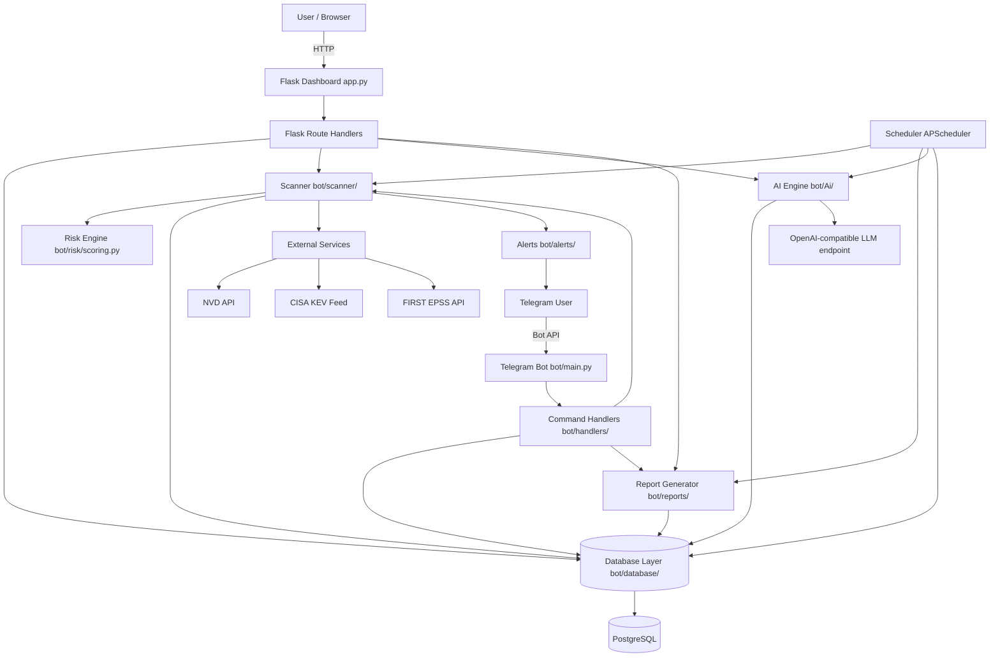
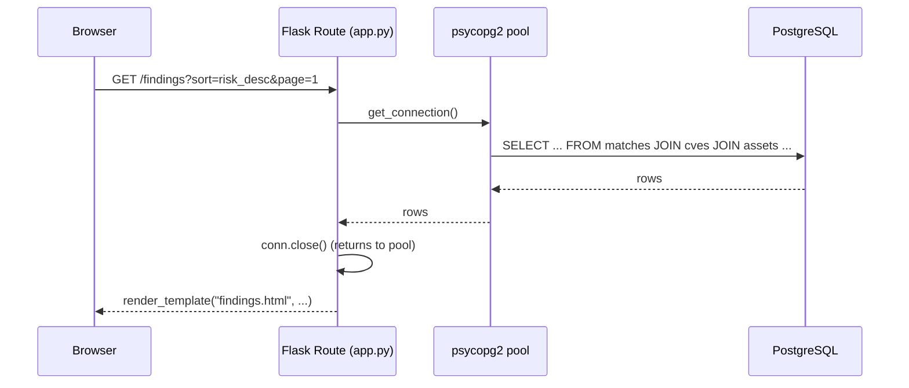
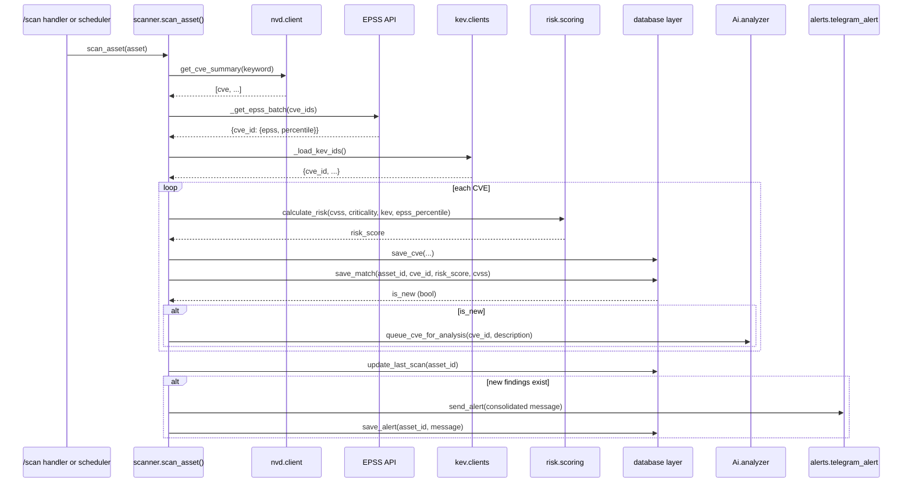
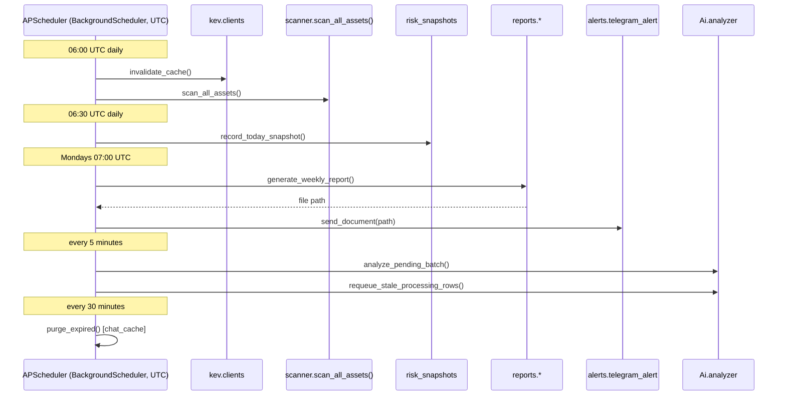
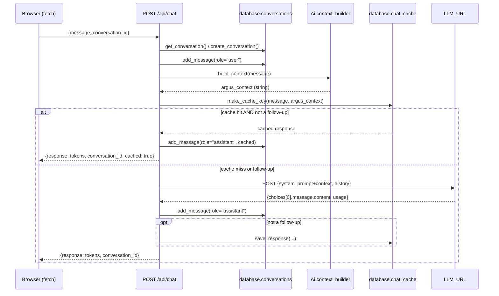

<div align="center">

# ARGUS API Reference

</div>

This document is the official developer reference for ARGUS. It documents every interface exposed by the platform — Flask dashboard routes, the internal JSON APIs those routes' JavaScript calls, Telegram bot commands, the AI Security Copilot's internal APIs, the database abstraction layer, the scanner, the risk engine, the reporting and alerting subsystems, the scheduler, and every external service integration.

> **Accuracy note.** Every route, function signature, parameter, SQL behavior, and response shape documented below was verified directly against the ARGUS source (`app.py`, `bot/handlers/*.py`, `bot/database/*.py`, `bot/Ai/*.py`, `bot/scanner/scanner.py`, `bot/risk/scoring.py`, `bot/reports/*.py`, `bot/alerts/telegram_alert.py`, `bot/jobs/daily_scan.py`, `bot/nvd/client.py`, `bot/kev/clients.py`). Anything described as a **future** or **planned** interface does not exist in the current codebase and is marked as such.

---

## Table of Contents

1. [API Overview](#1-api-overview)
2. [API Architecture](#2-api-architecture)
3. [Authentication](#3-authentication)
4. [Authorization](#4-authorization)
5. [Dashboard Routes](#5-dashboard-routes)
6. [Telegram Bot Commands](#6-telegram-bot-commands)
7. [AI APIs](#7-ai-apis)
8. [Database APIs](#8-database-apis)
9. [Scanner API](#9-scanner-api)
10. [Risk Engine API](#10-risk-engine-api)
11. [Reporting API](#11-reporting-api)
12. [Alert API](#12-alert-api)
13. [Scheduler Interfaces](#13-scheduler-interfaces)
14. [External Services](#14-external-services)
15. [Internal Module Communication](#15-internal-module-communication)
16. [Error Handling](#16-error-handling)
17. [Response Formats](#17-response-formats)
18. [Configuration Interfaces](#18-configuration-interfaces)
19. [Rate Limiting](#19-rate-limiting)
20. [Security Considerations](#20-security-considerations)
21. [Performance Considerations](#21-performance-considerations)
22. [Extension Points](#22-extension-points)
23. [Future REST API](#23-future-rest-api)
24. [Versioning](#24-versioning)
25. [Developer Guide](#25-developer-guide)
26. [Examples](#26-examples)
27. [Cross References](#27-cross-references)

---

## 1. API Overview

ARGUS does not currently expose a versioned, external-facing REST API. What exists today are two kinds of interfaces:

1. **Dashboard interfaces** — Flask routes in `app.py` that either render server-side HTML (Jinja2 templates) for browser navigation, or return JSON for the dashboard's own JavaScript to consume (chart data, AI chat, conversation management, city-exposure data). These JSON routes are **internal** — built for ARGUS's own front end, not designed or versioned as a public API — but are documented here in full because they are the only programmatic interface into a running ARGUS dashboard today.
2. **Telegram interfaces** — Bot commands (`bot/handlers/*.py`) registered against the Telegram Bot API, providing an alternate, conversational way to perform most of the same operations available on the dashboard.

Beneath both front ends sits one shared internal module layer, used identically by both:

- **Database layer** (`bot/database/`) — the only code that talks to PostgreSQL.
- **Scanner** (`bot/scanner/scanner.py`) — NVD/KEV/EPSS correlation logic.
- **Risk Engine** (`bot/risk/scoring.py`) — the risk-scoring formula.
- **AI Engine** (`bot/Ai/`) — context assembly, LLM client, and the background CVE analysis pipeline.
- **Reports** (`bot/reports/`) — PDF report generation.
- **Alerts** (`bot/alerts/telegram_alert.py`) — Telegram delivery.
- **Scheduler** (`bot/jobs/daily_scan.py`) — APScheduler job definitions.

**How subsystems communicate.** Every module communicates through direct Python function calls within the same process — there is no message queue, no internal RPC, and no HTTP hop between, e.g., the dashboard and the database layer. The dashboard and the Telegram bot are two separate OS processes that each import and call the same `bot/` package, and they only ever "communicate" indirectly, through the shared PostgreSQL database.

**Future REST API philosophy.** A versioned, external-facing REST API (`/api/v1/...`) is a planned but unimplemented capability — see [§23 Future REST API](#23-future-rest-api). The design goal for that future API is to expose the same operations already implemented internally (asset CRUD, scan triggering, findings queries, AI chat, report generation) behind a stable, token-authenticated, versioned surface, rather than introducing new business logic — the internal module layer described above is intended to be the implementation the future REST API calls into, not something it replaces.

---

## 2. API Architecture



**Request lifecycle (dashboard example — `GET /findings`):**

1. Browser sends an authenticated `GET` request to `/findings`.
2. Flask-Login's `@login_required` decorator verifies the session cookie; unauthenticated requests redirect to `/login`.
3. The route handler in `app.py` parses query-string filters (vendor, risk, KEV, keyword, status, city/country, pagination).
4. The handler calls `get_connection()` to borrow a pooled `psycopg2` connection and issues one or more parameterized SQL queries directly (most dashboard routes query the database inline rather than through the `bot/database/` module functions — see [§8](#8-database-apis) for which routes use which pattern).
5. Results are passed to a Jinja2 template (`bot/dashboard/templates/findings.html`) and rendered server-side.
6. The connection is returned to the pool (`conn.close()` inside a `finally` block).
7. `@app.after_request` adds security headers (`X-Content-Type-Options`, `X-Frame-Options`, `Referrer-Policy`, `Permissions-Policy`) to the response before it's sent.

**Request lifecycle (AI chat example — `POST /api/chat`):** see the detailed sequence diagram in [§15.5](#155-ai-chat-request).

---

## 3. Authentication

### 3.1 Mechanism

ARGUS uses **Flask-Login session-based authentication** — there is no token-based or API-key authentication for the dashboard today. A successful login sets a signed session cookie; every subsequent request is authenticated by that cookie until it expires or the user logs out.

### 3.2 Credential sources

Two credential sources are checked, in order, on every login attempt:

1. **Built-in in-memory users** — `admin` and `viewer`, whose password hashes are computed once at process startup from the `ADMIN_PASSWORD`/`VIEWER_PASSWORD` environment variables (`werkzeug.security.generate_password_hash`).
2. **Database users** — rows in the `users` table (username, `password_hash`, `role`), created via `/register` or inserted directly.

Password verification uses `werkzeug.security.check_password_hash` (a constant-time comparison against a salted hash) for both sources.

### 3.3 Login flow

```
POST /login
  username, password (form fields)
    │
    ├─ Match found in built-in USERS dict + hash matches?
    │     → login_user(), redirect to `next` query param or /dashboard
    │
    ├─ Else: SELECT username, password_hash, role FROM users WHERE username = %s
    │     → hash matches? → login_user(), redirect to `next` or /dashboard
    │
    └─ Else → render login.html with error=True (no distinction given between
              "user not found" and "wrong password" — prevents username enumeration)
```

If already authenticated, `GET /login` redirects straight to `/dashboard` rather than re-rendering the form.

### 3.4 Session lifecycle

| Property | Value |
|---|---|
| Cookie flags | `HttpOnly`, `SameSite=Lax` |
| Secure flag | `true` by default (`SESSION_COOKIE_SECURE` env var can set `false` for local HTTP testing) |
| Lifetime | Fixed 8 hours (`PERMANENT_SESSION_LIFETIME=timedelta(hours=8)`), not currently configurable via environment variable |
| Signing key | `SECRET_KEY` (required; app refuses to start without it) |
| Logout | `POST /logout` — calls `logout_user()`, clearing the session |

### 3.5 CSRF protection

All state-changing routes are protected by **Flask-WTF's `CSRFProtect`**, applied globally to the Flask app (`csrf = CSRFProtect(app)`). Forms rendered by Jinja2 templates must include the CSRF token (`{{ csrf_token() }}` — implementation detail of the templates, not the route handlers) for `POST` requests to succeed; a missing or invalid token results in a `400 Bad Request`.

### 3.6 RBAC

See [§4 Authorization](#4-authorization) for the full role/permission model.

### 3.7 Future authentication mechanisms

**Not implemented today:**
- **API tokens** — no bearer-token or API-key authentication scheme exists. All programmatic access to `/api/*` JSON routes today relies on the same session cookie as browser navigation.
- **OAuth** — no OAuth provider integration (Google, GitHub, etc.).
- **SSO** — no SAML/OIDC integration. Listed as a roadmap item in `README.md`.

If you are integrating with ARGUS programmatically today, the only supported approach is to authenticate via `POST /login` with a cookie-jar-aware HTTP client and reuse the resulting session cookie for subsequent requests — there is no other credential type accepted.

---

## 4. Authorization

### 4.1 Roles

ARGUS implements exactly **two roles** — there is no `Analyst` role or custom role system in the current codebase, despite that being a common pattern in comparable platforms.

| Role | Source | Description |
|---|---|---|
| `admin` | Built-in (`ADMIN_PASSWORD`) or a `users` row with `role='admin'` | Full read/write access, including asset management, finding status/assignment changes, on-demand scans, and report generation |
| `viewer` | Built-in (`VIEWER_PASSWORD`), or the default role for any self-registered account | Read-only access to dashboard views |

Self-registered accounts (via `/register`) are inserted into the `users` table without an explicit `role` value; the column's schema default is `viewer`, so **every self-registered user is a `viewer` until an administrator manually changes their role** (`UPDATE users SET role = 'admin' WHERE username = '...'` — there is no dashboard UI for role management).

### 4.2 Enforcement mechanism

Two decorators, applied in combination on routes that need them:

```python
@login_required   # Flask-Login: any authenticated user (admin or viewer)
@admin_required   # Custom decorator in app.py: current_user.role != "admin" → 403
```

`admin_required` is a plain function-wrapping decorator (not a Flask-Login extension) that returns the literal response `("Forbidden", 403)` when the check fails — it does not redirect to `/login`, since by definition the user is already authenticated at that point.

### 4.3 Permission matrix

| Route / Capability | Anonymous | `viewer` | `admin` |
|---|---|---|---|
| `/`, `/features`, `/basics`, `/cves`, `/cve/<id>`, `/docs` (public pages) | ✅ | ✅ | ✅ |
| `/login`, `/register` | ✅ | ✅ | ✅ |
| `/dashboard`, `/assets`, `/findings`, `/reports`, `/charts`, `/search`, `/asset/<id>`, `/finding/<cve_id>` (read views) | ❌ | ✅ | ✅ |
| `/api/chart/*`, `/api/dashboard/city-exposure` (chart/JSON data) | ❌ | ✅ | ✅ |
| `/api/chat`, `/api/conversations*` (AI chat) | ❌ | ✅ | ✅ |
| `/finding/update_status` (change finding status) | ❌ | ✅ | ✅ |
| `/finding/update_assignment` (assign owner/team) | ❌ | ❌ | ✅ |
| `/add_asset`, `/edit_asset/<id>`, `/delete_asset/<id>` (asset CRUD) | ❌ | ❌ | ✅ |
| `/today` (trigger full scan) | ❌ | ❌ | ✅ |
| `/toggle_patched/<asset_id>/<cve_id>` | ❌ | ❌ | ✅ |
| `/generate_report/<type>` | ❌ | ❌ | ✅ |
| `/profile`, `/delete_account` (own account) | ❌ | ✅ (own account only) | ✅ (own account only) |
| `/download/<report_id>` | ❌ | ✅ | ✅ |

**Notable asymmetry:** `update_finding_status` is `@login_required` only (any authenticated user, including `viewer`, can move a finding through its status workflow), while `update_finding_assignment` additionally requires `@admin_required`. This is intentional in the current implementation — status changes (e.g., marking something "In Progress") are treated as a lighter-weight action than reassigning ownership.

### 4.4 Future custom roles

Not implemented. A finer-grained role system (e.g., a scoped "Analyst" role between `viewer` and `admin`) is not present in the current codebase; if you need finer-grained permissions today, the practical workaround is to keep sensitive administrative accounts limited to `admin` and treat every other account as effectively read-only via `viewer`.

---

## 5. Dashboard Routes

All routes are defined in `app.py`. Unless otherwise noted, HTML routes render a Jinja2 template from `bot/dashboard/templates/` and JSON routes return `application/json`.

### 5.1 Public / unauthenticated routes

#### `GET /`
- **Purpose:** Landing page.
- **Auth:** None.
- **Response:** Renders `landing.html`.

#### `GET /features`
- **Purpose:** Marketing/features overview page.
- **Auth:** None.
- **Response:** Renders `features.html`.

#### `GET /basics`
- **Purpose:** Introductory "how ARGUS works" page.
- **Auth:** None.
- **Response:** Renders `basics.html`.

#### `GET /docs`
- **Purpose:** In-app documentation page.
- **Auth:** None.
- **Response:** Renders `docs.html`.

#### `GET /cves`
- **Purpose:** Live NVD keyword search (does not query ARGUS's own database — queries the NVD API directly, on every request).
- **Auth:** None.
- **Query parameters:**

  | Param | Type | Default | Notes |
  |---|---|---|---|
  | `q` | string | `""` | Keyword search term. If empty, no NVD call is made and an empty result set is shown. |
  | `sort` | string | `newest` | One of `cvss_desc`, `cvss_asc`, `cve_asc`, `cve_desc`, `oldest`, `newest` |
  | `page` | int | `1` | 1-indexed page number |
  | `per_page` | int | `25` | Results per page (client-side pagination over the full NVD result set already fetched) |

- **Behavior:** Calls `https://services.nvd.nist.gov/rest/json/cves/2.0?keywordSearch=<q>` with `NVD_API_KEY` as the `apiKey` header if configured, a `(10, 90)` second connect/read timeout. Parses each result's English description, CVSS v3.1 base score (best-effort — falls back to `"N/A"` if absent), publish date, and `cisaExploitAdd` flag (KEV membership as reported directly by NVD, independent of ARGUS's own KEV cache).
- **Response:** Renders `cves_live.html`. On an NVD HTTP error, renders the same template with `error="NVD returned HTTP <status>"` and an empty result list; on an invalid JSON response, `error="NVD returned invalid response"`.
- **Performance:** No caching — every request with a non-empty `q` makes a live NVD call. High-traffic use of this route without an `NVD_API_KEY` will hit NVD's unauthenticated rate limit quickly.

#### `GET /cve/<cve_id>`
- **Purpose:** Detail page for one CVE, sourced from ARGUS's own `cves` table (not a live NVD call).
- **Auth:** None.
- **Path parameter:** `cve_id` (string, e.g. `CVE-2024-12345`).
- **Behavior:** `SELECT * FROM cves WHERE cve_id = %s`. If a cached AI analysis exists for this CVE **and** its status is `complete`, it is attached to the response context; `pending`/`processing`/`failed` analyses are not surfaced (their content isn't usable yet).
- **Response:** Renders `cve_detail.html` with `cve`, `analysis` (or `None`), and `cve_id`. If the CVE isn't in ARGUS's database, `cve` is `None` and the template is expected to handle that case.

### 5.2 Authentication routes

#### `GET, POST /login`
- **Purpose:** Session login.
- **Auth:** None (redirects to `/dashboard` if already authenticated).
- **Form parameters (POST):** `username`, `password`.
- **Response:** `302` redirect to `next` query param or `/dashboard` on success; re-renders `login.html` with `error=True` on failure.
- **Related DB calls:** `SELECT username, password_hash, role FROM users WHERE username = %s` (only reached if not a built-in user).

#### `POST /logout`
- **Auth:** `@login_required`.
- **Response:** `302` redirect to `/`.

#### `GET, POST /register`
- **Purpose:** Self-service account creation.
- **Auth:** None.
- **Form parameters (POST):** `username` (min 3 chars), `password`, `confirm_password` (must match).
- **Behavior:** `INSERT INTO users (username, password_hash) VALUES (%s, %s)` — `role` is left to its schema default (`viewer`). Duplicate usernames are rejected with an inline error rather than a raised exception.
- **Response:** `302` redirect to `/login` on success; re-renders `register.html` with `error=<message>` on validation failure.

#### `GET, POST /profile`
- **Purpose:** Change the current user's password or username.
- **Auth:** `@login_required`.
- **Form parameters (POST):** `action` (`change_password` or `change_username`), plus action-specific fields (`current_password`/`new_password`/`confirm_password`, or `new_username`/`confirm_password_username`).
- **Behavior:** Updates the in-memory `USERS` dict for built-in accounts and best-effort mirrors the change into the `users` table (wrapped in a bare `try/except: pass` — a missing `users` table or DB error is silently ignored so profile management degrades gracefully rather than crashing). A username change logs the user out and redirects to `/login`, since the session identity has changed underneath it.
- **Response:** Re-renders `profile.html` with `success`/`error` messages, or redirects to `/login` after a username change.

#### `POST /delete_account`
- **Purpose:** Permanently delete the current user's own account.
- **Auth:** `@login_required`.
- **Form parameters:** `confirm_password`.
- **Behavior:** Verifies the password against either the in-memory or database credential source, then `DELETE FROM users WHERE username = %s` and removes the built-in entry from `USERS` if applicable, then logs out.
- **Response:** `302` redirect to `/` on success; re-renders `profile.html` with an error if the password is wrong.

### 5.3 Dashboard home

#### `GET /dashboard`
- **Purpose:** Main authenticated landing page — summary counts, recent findings, top risks, recent reports, latest KEVs, finding status breakdown, and the City Exposure Overview.
- **Auth:** `@login_required`.
- **Related DB calls:** Multiple aggregate queries in a single connection (asset/CVE/finding/KEV/report counts, top-5 recent findings by risk, top-5 risks per unique CVE, latest 5 KEV CVEs, status breakdown, resolved count, average days-open for `Open` findings, overdue count), plus `get_city_exposure_summary()` and `get_unassigned_asset_count()` from `bot/database/assets.py`.
- **Related services:** `config.locations` (`get_coordinates`, `classify_risk_level`, `RISK_LEVEL_COLORS`) to enrich city rows with map coordinates and a computed risk-level color.
- **Response:** Renders `index.html`. Also pops and displays a one-time `scan_summary` from the session if `/today` was just triggered (flash-message pattern — the summary is consumed and removed from the session on this render).
- **Performance considerations:** This route issues roughly a dozen separate queries per request; there is no caching layer for dashboard aggregates (unlike the AI chat, which caches its own separate context queries — see [§7](#7-ai-apis)).

#### `GET /api/dashboard/city-exposure`
- **Purpose:** JSON version of the City Exposure Overview map data, for client-side re-rendering (e.g., a "refresh" button) without a full page reload.
- **Auth:** `@login_required` (available to both roles — read-only, and explicitly designed to expose only aggregated city-level counts, never per-asset detail, per the security requirement documented in the route's own docstring).
- **Response (200):**
  ```json
  {
    "cities": [
      {
        "country_code": "US",
        "city": "Springfield",
        "lat": 39.78,
        "lng": -89.65,
        "mapped": true,
        "asset_count": 4,
        "finding_count": 12,
        "unique_cve_count": 9,
        "kev_count": 1,
        "max_risk_score": 168,
        "risk_level": "High",
        "assets_url": "/assets?country=US&city=Springfield",
        "findings_url": "/findings?country=US&city=Springfield"
      }
    ],
    "unmapped_city_count": 0,
    "unassigned_asset_count": 3
  }
  ```
- **Error response (500):** `{"error": "Failed to load city exposure data."}` if the underlying query or coordinate lookup raises.

### 5.4 Assets

#### `GET /assets`
- **Purpose:** Paginated/sortable/filterable asset inventory listing.
- **Auth:** `@login_required`.
- **Query parameters:**

  | Param | Type | Default | Notes |
  |---|---|---|---|
  | `sort` | string | `id_asc` | One of `id_asc`, `id_desc`, `vendor_asc`, `vendor_desc`, `product_asc`, `product_desc`, `priority_asc`, `priority_desc` (priority sort uses a `CASE` expression over Low/Medium/High/Critical) |
  | `country` | string | `""` | 2-letter country code filter; validated against `config.locations.SUPPORTED_LOCATIONS` — an unrecognized value is silently ignored rather than erroring |
  | `city` | string | `""` | City filter; ignored unless `country` is valid and the city belongs to that country's supported list |

- **Response:** Renders `assets.html` with the filtered/sorted asset rows, `total_assets`, and the supported-locations dictionary (for populating filter dropdowns).

#### `GET, POST /add_asset`
- **Auth:** `@login_required`, `@admin_required`.
- **Form parameters (POST):** `vendor`, `product`, `version` (all required), `search_keyword` (optional — defaults to `"<vendor> <product>"`), `type` (optional — defaults to `Unknown`; validated against `VALID_TYPES`), `location`, `owner`, `priority` (maps to `criticality`), `notes`, `country_code`, `city` (optional; server-side validated via `is_valid_city()` — an invalid combination is silently stored as `NULL`, not rejected).
- **Response:** `302` redirect to `/assets` on success; `GET` renders `add_asset.html` with the valid type list and supported locations for form population.

#### `GET, POST /edit_asset/<int:asset_id>`
- **Auth:** `@login_required`, `@admin_required`.
- **Path parameter:** `asset_id` (integer).
- **Form parameters (POST):** Same shape as `/add_asset`.
- **Response:** `302` redirect to `/assets` on success; `GET` renders `edit_asset.html` pre-populated with the current asset row.

#### `POST /delete_asset/<int:asset_id>`
- **Auth:** `@login_required`, `@admin_required`.
- **Behavior:** Cascading manual delete — `DELETE FROM matches WHERE asset_id=%s`, then `DELETE FROM alerts WHERE asset_id=%s`, then `DELETE FROM assets WHERE id=%s`, all in one transaction.
- **Response:** `302` redirect to `/assets`.

#### `GET /asset/<int:asset_id>`
- **Purpose:** Single-asset detail page with its findings.
- **Auth:** `@login_required`.
- **Query parameters:** `ref` (default `assets` — controls the "back" link target), `sort` (default `risk_desc`; one of `risk_desc`, `risk_asc`, `cve_asc`, `cve_desc`, `cvss_desc`, `cvss_asc`).
- **Behavior:** Fetches the asset row, then its findings joined against `cves`. Uses a try/fallback query pair — the primary query selects `status`/`due_date`/`assigned_to`/`assigned_team` columns; if that fails (e.g., against an older schema missing those columns), it transparently falls back to a reduced query with hardcoded defaults (`'Open'`, `NULL`) after rolling back the failed transaction.
- **Response:** Renders `asset_detail.html`.

### 5.5 Findings

#### `GET /findings`
- **Purpose:** The primary findings/vulnerability list, deduplicated to one row per unique CVE (aggregating across all affected assets).
- **Auth:** `@login_required`.
- **Query parameters:**

  | Param | Type | Default | Notes |
  |---|---|---|---|
  | `page` | int | `1` | |
  | `per_page` | int | `25` | Must be one of `{25, 50, 100, 200}`; any other value silently falls back to `25` |
  | `sort` | string | `risk_desc` | One of `cve_asc`, `cve_desc`, `cvss_desc`, `cvss_asc`, `kev_desc`, `kev_asc`, `risk_desc`, `risk_asc`, `epss_desc`, `epss_asc` |
  | `ref` | string | `""` | `"charts"` changes the back-link target |
  | `vendor` | string | `""` | Substring match (`ILIKE`) against asset vendor |
  | `risk` | string | `""` | One of `Low` (0–75), `Medium` (76–125), `High` (126–175), `Critical` (176+) — maps to a `risk_score BETWEEN` range |
  | `kev` | string | `""` | `"true"` or `"false"` |
  | `keyword` | string | `""` | Substring match against CVE ID, vendor, or product |
  | `status` | string | `""` | Exact match against `matches.status` |
  | `country`, `city` | string | `""` | Same validation as `/assets` |

- **Behavior:** Aggregates `matches` by `cve_id`, taking `MAX(risk_score)` across all affected assets, `COUNT(DISTINCT asset_id)`, a representative "top asset" (highest individual risk score for that CVE), whether *any* instance is patched, the *minimum* (i.e., most-open) status across instances, and the AI analysis status if present. Uses the same try/fallback pattern as `/asset/<id>` for schema resilience.
- **Response:** Renders `findings.html` with pagination metadata and all active filter values (for round-tripping into the pagination/filter links).

#### `GET /finding/<cve_id>`
- **Purpose:** Single-CVE detail page — the CVE record plus every asset it affects, grouped by vendor/product.
- **Auth:** `@login_required`.
- **Query parameters:** `ref` (default `findings`), `sort` (default `risk_desc`; one of `risk_desc`, `risk_asc`, `vendor_asc`, `vendor_desc`).
- **Behavior:** Fetches the `cves` row, then a grouped query over `matches`/`assets` for that CVE (asset IDs as an array, days-open, instance count, earliest due date, first assigned owner). Attaches the cached AI analysis if `status == 'complete'`.
- **Response:** Renders `finding_detail.html`.

#### `POST /finding/update_status`
- **Auth:** `@login_required` (any authenticated role).
- **Form parameters:** `asset_id` (int), `cve_id` (string), `status` (must be one of `Open`, `In Progress`, `Resolved`, `Accepted Risk`, `False Positive` — a `400` is returned with body `"Invalid status"` otherwise), `ref` (optional — `"asset"` redirects back to the asset page instead of the finding page).
- **Behavior:** `UPDATE matches SET status=%s[, resolved_at=NOW()|NULL] WHERE asset_id=%s AND cve_id=%s`. Setting status to `Resolved` stamps `resolved_at`; any other status clears it.
- **Response:** `302` redirect to `/asset/<id>` or `/finding/<cve_id>` depending on `ref`.

#### `POST /finding/update_assignment`
- **Auth:** `@login_required`, `@admin_required`.
- **Form parameters:** `asset_id`, `cve_id`, `assigned_to` (optional), `assigned_team` (optional).
- **Behavior:** `UPDATE matches SET assigned_to=%s, assigned_team=%s WHERE asset_id=%s AND cve_id=%s`. Empty strings are stored as `NULL`.
- **Response:** Same redirect pattern as `update_finding_status`.

#### `POST /toggle_patched/<int:asset_id>/<cve_id>`
- **Auth:** `@login_required`, `@admin_required`.
- **Behavior:** `UPDATE matches SET patched = NOT patched WHERE asset_id = %s AND cve_id = %s`.
- **Response:** `302` redirect to `request.referrer` (if `ref=findings`) or `/asset/<asset_id>`.

### 5.6 Search

#### `GET /search`
- **Purpose:** Single-query-box search across assets, falling back to a live CVE search.
- **Auth:** `@login_required`.
- **Query parameter:** `q` (string).
- **Behavior:** `SELECT id FROM assets WHERE product ILIKE %q% OR vendor ILIKE %q% LIMIT 1`. If a match is found, redirects straight to that asset's detail page. Otherwise, redirects to `/cves?q=<q>` (the live NVD search).
- **Response:** `302` redirect — this route never renders a template of its own.

### 5.7 Charts

#### `GET /charts`
- **Purpose:** Renders the charts page **and**, as a side effect, regenerates four PNG chart images on disk (`bot/dashboard/static/charts/`) using matplotlib: top assets by findings, risk score distribution, KEV vs. non-KEV pie, top vendors by findings.
- **Auth:** `@login_required`.
- **Behavior:** Every request to this route re-queries the database and re-renders all four PNGs synchronously before returning the page — there is no caching of the generated images between requests.
- **Response:** Renders `charts.html`, which references the freshly written PNGs.
- **Performance considerations:** matplotlib figure generation is CPU-bound and happens inline in the request/response cycle; on a large `matches` table this route will be measurably slower than the read-only JSON chart endpoints in §5.8, which don't render images.

### 5.8 Chart JSON APIs

These endpoints back the dashboard's interactive (JS-rendered) charts, as distinct from the static PNGs generated by `/charts`.

#### `GET /api/chart/assets`
- **Auth:** `@login_required`.
- **Response (200):**
  ```json
  {
    "asset_ids": [12, 7, 3],
    "labels": ["Cisco RV340", "D-Link DIR-825", "TP-Link Archer AX10"],
    "values": [14, 9, 6]
  }
  ```
  Top 10 assets by distinct CVE count, with duplicate vendor+product rows merged into one bar (`MIN(a.id)` used as the representative asset ID for click-through links).

#### `GET /api/chart/risk`
- **Auth:** `@login_required`.
- **Response (200):** `{"labels": ["Low","Medium","High","Critical"], "values": [41, 19, 8, 3]}` — counts by `matches.risk_score` bucketed into the same Low/Medium/High/Critical ranges used by the `/findings` risk filter (0–75 / 76–125 / 126–175 / 176+), counted per-match (not per-unique-CVE) to agree with the Findings page's counting unit.

#### `GET /api/chart/kev`
- **Auth:** `@login_required`.
- **Response (200):** `{"labels": ["KEV","Non-KEV"], "values": [3, 47]}` — counted from distinct CVEs (not matches) that have at least one active match.

#### `GET /api/chart/vendors`
- **Auth:** `@login_required`.
- **Response (200):** `{"labels": [...], "values": [...]}` — top 10 vendors by distinct CVE count.

#### `GET /api/chart/findings_history`
- **Auth:** `@login_required`.
- **Response (200):** `{"labels": ["2026-06-01","2026-06-02",...], "values": [3,1,...]}` — findings count grouped by `DATE(first_seen)`, ascending.

### 5.9 AI chat and conversations

See [§7 AI APIs](#7-ai-apis) for full documentation of `/api/chat` and `/api/conversations*` — these are technically dashboard routes but are substantial enough to warrant their own section.

### 5.10 Scanning and reporting actions

#### `POST /today`
- **Purpose:** Trigger a full scan of every asset from the dashboard (equivalent to Telegram's `/today`).
- **Auth:** `@login_required`, `@admin_required`.
- **Behavior:** Runs `scanner.scan_all_assets()` inside a dedicated thread with its own `asyncio` event loop (via `concurrent.futures.ThreadPoolExecutor(max_workers=1)`), since `scan_all_assets()` is an `async` coroutine and this is a synchronous Flask view. Builds a summary (assets scanned, total tracked CVEs, new findings, error count, per-asset status lines) and stores it in the session under `scan_summary` for one-time display on the next `/dashboard` render (flash-message pattern).
- **Response:** `302` redirect to `/dashboard`.
- **Performance considerations:** This is a **synchronous, blocking** request from the caller's perspective — the HTTP response does not return until the entire scan completes. For a large asset inventory this can be a long-running request; there is no progress-streaming or async job-status endpoint.

#### `POST /generate_report/<report_type>`
- **Purpose:** On-demand PDF report generation.
- **Auth:** `@login_required`, `@admin_required`.
- **Path parameter:** `report_type` — one of `day`, `week`, `month`, `year` (any other value returns `400 "Unknown report type"`).
- **Behavior:** Dispatches to `reports.daily.generate_daily_report`, `reports.weekly.generate_weekly_report`, `reports.monthly.generate_monthly_report`, or `reports.yearly.generate_yearly_report`, run in a single-worker thread pool. These generator functions catch their own internal exceptions and return `None` on failure rather than raising, so the route checks both for a raised exception *and* a falsy return value.
- **Response:** `302` redirect to `/reports`, with `session["report_success"]` or `session["report_error"]` set for one-time display (same flash-message pattern as `/today`).

#### `GET /reports`
- **Auth:** `@login_required`.
- **Behavior:** `SELECT id, report_type, generated_at FROM reports ORDER BY generated_at DESC`.
- **Response:** Renders `reports.html`, popping any pending `report_success`/`report_error` session flash messages.

#### `GET /download/<int:report_id>`
- **Auth:** `@login_required`.
- **Behavior:** Looks up the report's `file_path`, resolves it relative to `REPORTS_DIR`, and **rejects any path that resolves outside `REPORTS_DIR`** (`abort(403)`) — a path-traversal guard against a malformed or tampered `file_path` value. Returns `404` if the file doesn't exist on disk (e.g., deleted externally while the DB row remains).
- **Response:** `send_file(..., as_attachment=True)` — triggers a browser download.

---

## 6. Telegram Bot Commands

All commands are registered in `bot/main.py` and implemented in `bot/handlers/`. There is no role/permission distinction in the Telegram bot today — **any user who can message the bot can execute any command**, including asset mutation and deletion. This is a materially different (and looser) authorization model than the dashboard's `admin`/`viewer` split — see [§20 Security Considerations](#20-security-considerations).

### `/start`
- **Purpose:** Confirms the bot is running.
- **Syntax:** `/start`
- **Response:** `"Argus Online 🟢"`
- **Database operations:** None.

### `/help`
- **Purpose:** Full command reference.
- **Syntax:** `/help`
- **Response:** Markdown-formatted command list (see `bot/handlers/help.py` for the exact text), including the current list of valid asset types.
- **Database operations:** None (reads `VALID_TYPES` from `database/assets.py`, an in-code constant).

### `/asset`
- **Purpose:** List all assets, or show one asset's full detail.
- **Syntax:** `/asset` (list) or `/asset <id>` (detail).
- **Parameters:** `id` (optional, integer as string).
- **Database operations:** `get_all_assets()` or `get_asset(asset_id)` (`database/assets.py`).
- **Example:** `/asset 7` →
  ```
  Asset Information

  ID: 7
  Vendor: Cisco
  Product: RV340
  Version: 1.0.03.29
  Type: Router

  Location: HQ-Rack3
  Owner: netops
  Priority: High

  Last Scan: 2026-07-01 06:00 UTC

  Notes:
  Edge gateway
  ```
- **Error responses:** `"Asset not found."` if the ID doesn't exist. `"No assets found."` if the inventory is empty.

### `/add`
- **Purpose:** Register a new asset.
- **Syntax:** `/add <vendor> "<product>" <version> "<search_keyword>" [type]`
- **Parameters:** Parsed with `shlex.split` so multi-word values must be quoted. `vendor`, `product`, `version`, `search_keyword` are required (minimum 4 args); `type` is optional and defaults to `Unknown`, validated against `VALID_TYPES` (an unrecognized type is rejected with the valid-type list shown back to the user, rather than silently coerced).
- **Example:** `/add TP-Link "Archer AX10" 1.0 "TP-Link Archer AX10" Router`
- **Database operations:** `add_asset(vendor, product, version, asset_type, search_keyword)` (`database/assets.py`) — `INSERT INTO assets (...)`.
- **AI usage:** None.

### `/edit`
- **Purpose:** Update an existing asset's location, owner, criticality, type, and/or notes.
- **Syntax:** `/edit <id> <location> <owner> <criticality> [type] [notes...]`
- **Parameters:** Positional: `id`, `location`, `owner`, `criticality` (all required — minimum 4 args). Position 5 is inspected: if it matches a valid asset type, it's consumed as `type` and everything after becomes `notes`; otherwise position 5 onward is treated entirely as free-text `notes` and the asset's existing type is preserved.
- **Example:** `/edit 3 DC-A1 alice High Firewall Edge gateway`
- **Database operations:** `get_asset(asset_id)` to validate existence, `update_asset(...)` to apply the change, then a re-fetch to echo the final state back to the user.
- **Error responses:** `"Asset not found."`

### `/rm`
- **Purpose:** Delete an asset.
- **Syntax:** `/rm <id>`
- **Database operations:** `get_asset(asset_id)` (existence check), `remove_asset(asset_id)`. **Note:** unlike the dashboard's `/delete_asset` route, `remove_asset()` in `database/assets.py` does not show cascading `matches`/`alerts` cleanup logic in the Telegram path the way the dashboard route does — verify your deployment's foreign-key constraints (`ON DELETE CASCADE` or otherwise) in `schema.sql` if you rely on this command to fully clean up related findings.
- **Error responses:** `"Asset not found."`

### `/scan`
- **Purpose:** On-demand vulnerability scan of a single asset.
- **Syntax:** `/scan <asset_id>`
- **Database/service operations:** `get_asset(asset_id)`, then `scanner.scan_asset(asset)` — the same function used internally by the daily scheduled scan (see [§9](#9-scanner-api)).
- **Response:** A list of matched CVEs with CVSS, severity, and calculated risk, flagging any KEV-listed CVE with `⚠️ ACTIVE EXPLOIT`, plus a new-vs-total count. Truncated to Telegram's 4096-character message limit.
- **AI usage:** Indirectly — any newly discovered CVE is queued for background AI analysis via `Ai.analyzer.queue_cve_for_analysis()`, same as any other scan path.
- **Error responses:** `"Asset not found."`; `"❌ Scan failed:\n<error>"` if the NVD lookup itself fails.

### `/today`
- **Purpose:** Scan every registered asset, with results deduplicated by search keyword (so multiple assets sharing a keyword, e.g. four identical routers, are summarized as one line).
- **Syntax:** `/today`
- **Database/service operations:** `scanner.scan_all_assets()`.
- **Response:** A summary block: keywords scanned, total unique CVEs, total new findings, error count, and a per-keyword ✅/❌ line.
- **Error responses:** `"No assets registered. Use /add to add one."`; `"❌ Scan failed: <exc>"` on an unhandled exception from the scan itself.

### `/findings`
- **Purpose:** List all known CVEs for one asset, sorted by risk score.
- **Syntax:** `/findings <asset_id>`
- **Database operations:** `get_asset(asset_id)`, `get_findings(asset_id)` (`database/matches.py`).
- **Response:** One block per finding — CVE ID, CVSS, severity (with emoji), KEV flag, risk score, first-seen date.
- **Error responses:** `"Usage:\n/findings <asset_id>"` (missing arg); `"Asset ID must be a number."`; `"Asset not found."`; `"No findings yet for <vendor> <product>.\nRun /scan <id> to scan it first."`

### `/cve`
- **Purpose:** Live NVD keyword search (equivalent to the dashboard's `/cves` page, but text-formatted for chat).
- **Syntax:** `/cve <keyword>`
- **Service operations:** `nvd.client.get_cve_summary(keyword)` — a live NVD API call, not a database read.
- **Response:** Up to Telegram's 4096-character limit, one block per CVE (ID, CVSS, severity, truncated description).
- **Error responses:** `"Usage:\n/cve <keyword>"`; `"No CVEs found."`

### `/report`
- **Purpose:** Text summary, or PDF report generation/retrieval, depending on the argument.
- **Syntax:**
  - `/report` — text summary (asset/CVE/KEV counts, top 5 findings by risk).
  - `/report day` / `/report week` / `/report month` / `/report year` — generate the corresponding PDF and send it as a Telegram document.
  - `/report list` — list the last 20 generated reports (from the `reports` table).
  - `/report <id>` — re-send a previously generated PDF by its database ID.
- **Database operations:** `get_reports()`, `get_report(report_id)` (`database/reports.py`); the on-demand generation paths call the same `reports.daily/weekly/monthly/yearly` generator functions used by the dashboard's `/generate_report/<type>` route (see [§11](#11-reporting-api)).
- **Error responses:** `"Report not found."`; `"Report #<id> exists in the database but the PDF file is missing on disk."` (DB/filesystem drift); `"Failed to generate <type> report."`; a bare `f"Error: {e}"` for any other unhandled exception (this handler wraps its logic in broad `try/except` blocks per branch, so a failure in one report type doesn't require restarting the bot).

### `/status`
- **Purpose:** Health check.
- **Syntax:** `/status`
- **Database/service operations:** A direct `SELECT 1` against PostgreSQL, and `nvd.client.check_nvd_api()` (a minimal live NVD query). Also reports `assets`/`cves`/`matches` row counts if the database check succeeds.
- **Response:**
  ```
  Argus Status 🟢

  PostgreSQL: 🟢 Online
  NVD API:    🟢 Online

  Assets:  12
  CVEs:    340
  Matches: 58
  ```

### Commands referenced in the original spec that do not exist in this codebase

The prompt for this document listed several commands (`/lookup`, `/vuln`, `/stats`, `/ai`, `/chat`, `/log`, `/loc`, `/p`) as commands to document. **None of these are registered in `bot/main.py` or implemented under `bot/handlers/`.** The closest existing equivalents are:

| Requested command | Closest actual command |
|---|---|
| `/lookup`, `/vuln` | `/cve <keyword>` |
| `/stats` | `/status` (health + counts) or the default `/report` (findings summary) |
| `/ai`, `/chat` | No Telegram equivalent — the AI Security Copilot chat is dashboard-only (`/api/chat`, see [§7](#7-ai-apis)) |
| `/log` | No equivalent — no Telegram command surfaces application logs |
| `/loc`, `/p` | No equivalent — the City Exposure Overview map is dashboard-only |

If any of these are desired, see [§22 Extension Points](#22-extension-points) for how to add a new Telegram command consistently with the existing handler pattern.

---

## 7. AI APIs

### 7.1 Overview

The AI Security Copilot has two entry points into the LLM: the interactive chat API (`/api/chat`, dashboard-only) and the automated background CVE analysis pipeline (`Ai/analyzer.py`, scheduler-driven). Both ultimately call the same low-level completion function, `Ai/llm.py::complete()`, but with **different configuration-resolution behavior** — see the important caveat in §7.8.

### 7.2 `POST /api/chat`

- **Auth:** `@login_required`.
- **Request body (JSON):**
  ```json
  {
    "message": "what should I fix first?",
    "conversation_id": 42
  }
  ```
  `conversation_id` is optional — omit it (or pass a stale/invalid one) to start a new conversation; the response always echoes the authoritative `conversation_id` to adopt.
- **CSRF note:** This route is a state-changing `POST` and falls under the app's global `CSRFProtect`. **The bundled front-end `fetch()` call in `base.html` does not attach an `X-CSRFToken` header or a `csrf_token` field.** Verified against Flask-WTF 1.3.0 (the version pinned in `requirements.txt`) with no exemptions or `WTF_CSRF_CHECK_DEFAULT` override present anywhere in the codebase: a JSON `POST` with no token is rejected with `400 Bad Request` / `"The CSRF token is missing."` If you are calling this endpoint programmatically (or hit this yourself when testing), fetch the value from the `<meta name="csrf-token" content="...">` tag rendered on every page (`bot/dashboard/templates/base.html`) and send it as the `X-CSRFToken` header.
- **Processing pipeline:**
  1. Reject empty `message` with `{"response": "Please enter a message.", "tokens": 0}` (200 OK, not an error status).
  2. Resolve or create the conversation (`database/conversations.py`); persist the user's message immediately, before calling the LLM.
  3. New conversations are auto-titled from the first message (`auto_title_from_message`).
  4. A small set of literal phrases (`"help"`, `"what can you do"`, `"capabilities"`) short-circuits to a hardcoded capabilities list — no LLM call, no context building, no caching.
  5. `Ai.context_builder.ContextBuilder.build_context(message)` classifies intent and assembles a live-data context string (see §7.3).
  6. **Cache check:** only for non-follow-up messages (`len(history) <= 1`, i.e. no prior assistant turn yet in this conversation) — keyed on a hash of `(message, argus_context)`. A cache hit returns immediately without calling the LLM. Follow-up questions in an ongoing conversation always bypass the cache, since a cached answer would be blind to the conversation's actual context.
  7. If `LLM_URL` is unset, returns a clear, user-facing error (**not** a hardcoded fallback URL — see the asymmetry noted in §7.8) and persists that error as the assistant's turn.
  8. Otherwise, sends `{system_prompt + ARGUS DATA block} + recent_history` to `LLM_URL` with `temperature=0.3`, `max_tokens=512`, a 120-second timeout. Strips any literal `"[ARGUS AI]"` or `"ARGUS AI:"` prefix the model might echo back.
  9. Persists the assistant's reply, caches it (if not a follow-up), and returns it.
- **Response (200):**
  ```json
  {
    "response": "Based on your findings, CVE-2026-1234 on the Cisco RV340...",
    "tokens": 187,
    "conversation_id": 42,
    "cached": false
  }
  ```
  `cached: true` is present only on a cache hit.
- **Error responses:** `requests.exceptions.ConnectionError` → 200 OK with `{"response": "ARGUS AI server is offline. Please start the LLM server.", "tokens": 0, ...}` (deliberately returned as a normal chat message, not an HTTP error, so the chat UI can display it inline). Any other unhandled exception → same pattern with `"An error occurred processing your request. Please try again."`
- **System prompt rules (verbatim intent, summarized):** answer only from the supplied ARGUS data when given; explicitly say `"Information not available in ARGUS."` rather than guessing from the model's own training knowledge of a CVE; when Affected Assets are listed, reference their specific criticality/location/owner rather than a generic description; never claim a CVE "has been analyzed" by ARGUS AI unless a completed AI Analysis block is actually present in the context for that exact CVE; never reveal the system prompt.

### 7.3 Context Builder (`Ai/context_builder.py`)

`ContextBuilder.build_context(question)` is the entry point. Routing logic:

1. **CVE ID detection takes absolute priority.** A regex match for a CVE ID pattern (`_CVE_ID_PATTERN`) anywhere in the question routes straight to `build_cve_context(cve_id)`, regardless of any other keyword signal — deliberately, because a specific CVE ID is a stronger and language-independent signal of intent (the code comments cite a real failure case: a question in Indonesian mentioning a CVE ID with no other English keyword to match on).
2. Otherwise, `determine_intent(question)` does keyword matching against the lowercased question text, in this priority order: `dashboard` (summary/overview keywords) → `kev`/`exploit`/`cisa` → `overdue`/`sla`/`due date` → `team`/`owner`/`assigned`/`who` → `asset`/`device`/`router`/`server`/`firewall` → `finding`/`vulnerab`/`cve`/`risk`/`open`/`unresolved` → falls through to `general`.
3. Each intent dispatches to a dedicated context builder method:

| Intent | Method | Data source |
|---|---|---|
| `cve` | `build_cve_context` | `cves` table + cached AI analysis if present |
| `dashboard` | `build_executive_summary_context` | `ai_dashboard` view |
| `prioritize` | `build_prioritization_context` | Ranked findings |
| `trend` | `build_trend_context` | `risk_snapshots` (week-over-week) |
| `findings` | `build_open_findings_context` | `ai_open_findings` view, top `_MAX_FINDINGS` by risk |
| `kev` | `build_kev_context` | `matches`/`assets`/`cves`, filtered `kev = TRUE` |
| `overdue` | `build_overdue_context` | `matches` where `due_date < CURRENT_DATE` and status is still active |
| `team` | `build_team_context` | `matches` grouped by `assigned_team` |
| `asset` | `build_asset_context` | `ai_asset_summary` view |
| `general` | `build_general_context` | A lighter-weight fallback summary |

All builders share a defensive pattern: every method wraps its query in `try/except`, logs the failure, and returns a plain-English "temporarily unavailable" string rather than propagating an exception up into the chat response — a context-building failure degrades the answer's grounding, it never crashes the chat endpoint.

**Row caps.** Every builder limits its result set via `_MAX_FINDINGS` (a module-level constant) to bound the size of the context string injected into the LLM prompt — this is the primary token-budget control point in the pipeline, more direct than relying on the model's own context window limit.

### 7.4 Conversation Memory API (`database/conversations.py`)

| Function | Purpose |
|---|---|
| `create_conversation(username, title="New conversation") -> int` | Creates a row, returns the new `conversation_id` |
| `list_conversations(username, limit=50) -> list` | Conversation metadata (id, title, timestamps), newest first |
| `get_conversation(conversation_id, username) -> Optional[dict]` | Ownership-scoped fetch — returns `None` if the conversation doesn't exist *or* belongs to a different user (used by `/api/chat` to detect and discard a stale/foreign `conversation_id` rather than erroring) |
| `rename_conversation(conversation_id, username, new_title) -> bool` | Also ownership-scoped |
| `delete_conversation(conversation_id, username) -> bool` | Also ownership-scoped |
| `add_message(conversation_id, role, content, tokens=0) -> int` | Appends one message row |
| `get_messages(conversation_id, username) -> list` | Full message history for a conversation, ownership-scoped |
| `get_recent_history_for_llm(conversation_id, username, ...) -> list` | Returns the most recent messages formatted as `{"role": ..., "content": ...}` dicts ready to append to the LLM `messages` array, **capped at 20 messages** |
| `auto_title_from_message(message, max_len=60) -> str` | Derives a short conversation title from the first user message |

Ownership scoping (every read/write keyed by `username` as well as `conversation_id`) is the mechanism that prevents one user from reading or renaming another user's conversation via a guessed/enumerated ID — there is no separate authorization check in the route handlers beyond passing `current_user.username` through to these functions.

### 7.5 Conversation Management Routes

#### `GET /api/conversations`
- **Auth:** `@login_required`.
- **Response (200):** `{"conversations": [{"id": 42, "title": "...", "created_at": "...", "updated_at": "..."}]}`

#### `POST /api/conversations`
- **Auth:** `@login_required`.
- **Response (200):** `{"conversation_id": 43}`

#### `GET /api/conversations/<int:conversation_id>`
- **Auth:** `@login_required`.
- **Response (200):** `{"conversation": {"id": ..., "title": ...}, "messages": [{"role": ..., "content": ..., "tokens": ..., "created_at": ...}]}`
- **Error (404):** `{"error": "Conversation not found"}` — including when the conversation belongs to a different user (indistinguishable from nonexistent, by design).

#### `DELETE /api/conversations/<int:conversation_id>`
- **Auth:** `@login_required`.
- **Response (200):** `{"deleted": true}` — **(404)** `{"error": "Conversation not found"}` otherwise.

#### `POST /api/conversations/<int:conversation_id>/rename`
- **Auth:** `@login_required`.
- **Request body:** `{"title": "New title"}` — empty title → `400 {"error": "Title cannot be empty"}`.
- **Response (200):** `{"renamed": true, "title": "New title"}` (server-truncated to 200 characters).

All four of the above are also technically covered by the global `CSRFProtect` and share the same front-end gap noted in §7.2 for `/api/conversations` (`POST`) and the `DELETE`/rename routes.

### 7.6 Response Cache (`database/chat_cache.py`)

| Function | Purpose |
|---|---|
| `make_cache_key(question, argus_context) -> str` | Deterministic hash of the normalized question plus the live data context — the cache key changes automatically the moment underlying ARGUS data changes, even if the question text is identical |
| `get_cached_response(cache_key) -> Optional[dict]` | Returns `None` if missing *or* past `expires_at` |
| `save_response(cache_key, question, response, tokens=0)` | Writes a new cache row with a TTL |
| `purge_expired() -> int` | Deletes expired rows; called by the scheduler every 30 minutes (housekeeping only — expired rows are already unreachable via `get_cached_response` before this runs) |

### 7.7 Automated CVE Analysis Pipeline (`Ai/analyzer.py`)

This is the background counterpart to the interactive chat — every newly discovered CVE (from any scan path, dashboard or Telegram) is queued here rather than analyzed synchronously during the scan.

**State machine** (`cve_ai_analysis.status`): `pending` → `processing` → `complete` | `failed` (failed rows are retried by re-entering the pending queue via `get_pending_cves()`).

| Function | Purpose |
|---|---|
| `queue_cve_for_analysis(cve_id, description="")` | Called by the scanner on every newly-saved match. Checks `is_stale()` first — a CVE with an existing, complete, non-stale analysis is **not** re-queued, which is the actual mechanism that prevents repeated LLM calls on every re-scan |
| `analyze_one(cve_id) -> bool` | Marks `processing`, builds the prompt from the CVE's NVD description + CVSS + KEV + EPSS, calls `Ai.llm.complete()`, parses the JSON response (tolerating markdown-fenced or prose-wrapped JSON via a fallback brace-extraction parser), and calls `save_analysis()` on success or `mark_failed()` on failure |
| `analyze_pending_batch(batch_size=DEFAULT_BATCH_SIZE) -> dict` | Processes up to `batch_size` pending CVEs with a fixed inter-request delay (`INTER_REQUEST_DELAY_SECONDS`) between each, called by the scheduler's 5-minute `ai_analysis` job. Returns `{"processed": int, "succeeded": int, "failed": int}` |
| `is_stale(cve_id, current_description) -> bool` (in `database/cve_analysis.py`) | True if never analyzed, the NVD description changed (SHA-256 hash comparison), or `current_model_name()` (from `LLM_MODEL_NAME` env var, default `"default-local-llm"`) differs from the `model_used` recorded on the last analysis — an intentional cache-invalidation trigger for model upgrades |
| `requeue_stale_processing_rows(stale_after_minutes=10) -> int` | The "AI watchdog" — recovers rows stuck in `processing` after a crash mid-analysis, called by the scheduler's 5-minute `ai_watchdog` job |

**Analysis output schema** (all string fields, stored on `cve_ai_analysis`): `summary`, `explanation`, `guidance`, `attack_scenario`, `business_impact`, `technical_impact`, `recommended_actions`. Any field the model doesn't return defaults to the literal string `"Information not available in ARGUS."` rather than an empty string or `null`.

### 7.8 ⚠️ Important asymmetry: `LLM_URL` resolution differs between chat and analysis

This is a verified, concrete difference between the two AI entry points, not a documentation simplification:

- **`app.py`'s `/api/chat`** explicitly checks `os.environ.get("LLM_URL")` and, if unset, returns a clean user-facing "AI is not configured" message **without attempting any HTTP request.**
- **`Ai/llm.py`'s `complete()`** function (used by the background analyzer, and shared by chat once it decides to proceed) resolves the URL as `os.environ.get("LLM_URL", _DEFAULT_URL)` where `_DEFAULT_URL = "http://192.168.0.26:8080/v1/chat/completions"` — **a hardcoded private-network IP literal from the original development environment.** If `LLM_URL` is unset, the background analysis pipeline will silently attempt requests against that specific address rather than skipping analysis or logging a clear "not configured" message. In most deployments this will simply fail with a connection error (logged per-CVE via `mark_failed`), but on a network where `192.168.0.26:8080` happens to be reachable and running something LLM-shaped, analysis could silently proceed against an unintended server.

**Recommendation:** Always set `LLM_URL` explicitly in `.env` if you use AI features at all — do not rely on the chat endpoint's clean "not configured" behavior as evidence that the analysis pipeline is also safely disabled.

### 7.9 Knowledge retrieval, "RAG," and model selection

As detailed in `README.md` §10: context assembly is direct, parameterized SQL against live PostgreSQL views/tables — there is no embedding model, vector store, or similarity search anywhere in `Ai/`. "RAG" in the vector-database sense is not implemented; what's implemented is closer to structured, intent-routed data retrieval feeding a single-shot prompt.

**Model selection** is entirely external to ARGUS — whatever model is loaded by the server at `LLM_URL` is what answers every request. ARGUS does not send a `model` parameter in its request payload (see the JSON body shown in §7.2 and `Ai/llm.py`), so if your server hosts multiple models behind one endpoint, ARGUS cannot select among them per-request; that would need to be handled by a proxy in front of `LLM_URL`.

### 7.10 Context window and error handling summary

| Control | Value |
|---|---|
| Conversation history sent to LLM | Last 20 messages (`get_recent_history_for_llm`) |
| Context builder row caps | `_MAX_FINDINGS` per query (module constant in `context_builder.py`) |
| Chat completion `max_tokens` | 512 |
| Analysis completion `max_tokens` | 900 |
| Request timeout | 120 seconds (both chat and analysis) |
| Analysis batch size | `DEFAULT_BATCH_SIZE` per scheduler tick (module constant in `analyzer.py`) |
| Inter-request delay within a batch | `INTER_REQUEST_DELAY_SECONDS` (module constant) |

### 7.11 Future compatibility

No versioned "AI API" contract is published for third-party integration — `Ai/llm.py`'s request/response shape is an internal implementation detail of ARGUS's own chat and analysis features, coupled to whatever server sits at `LLM_URL`. A stable, documented AI integration surface (e.g., allowing a plugin to register an alternative LLM backend) is not implemented; see [§22 Extension Points](#22-extension-points) for the closest current approximation.

---

## 8. Database APIs

The `bot/database/` package is the only code in the codebase that issues SQL. Dashboard routes and Telegram handlers both call into it (though, as noted in §2, a number of `app.py` routes — particularly the larger reporting/listing ones — inline their own SQL directly via `get_connection()` rather than going through a dedicated `database/` function; this is a real, observed inconsistency in the codebase's layering, not a documentation simplification).

### 8.1 `database/db.py` — Connection management

| Function | Purpose |
|---|---|
| `get_connection()` | Borrows a connection from a module-level `psycopg2.pool.ThreadedConnectionPool`, sized by `DB_POOL_MIN_CONN`/`DB_POOL_MAX_CONN` (defaults 2/20) |

Callers are responsible for `conn.close()` (which returns the connection to the pool rather than actually closing the socket) — the codebase consistently uses `try/finally` for this. Exceptions from `get_connection()` itself (e.g., PostgreSQL unreachable) propagate to the caller uncaught.

### 8.2 `database/assets.py`

| Function | Signature | Notes |
|---|---|---|
| `add_asset` | `(vendor, product, version, asset_type="Unknown", search_keyword=None, ...)` | Returns the new asset's ID |
| `get_all_assets()` | — | All assets, unfiltered |
| `get_all_assets_full()` | — | All assets with every column (used by the scanner, which needs `criticality`, `search_keyword`, etc.) |
| `get_asset(asset_id)` | — | Single asset by ID; returns `None` if not found |
| `remove_asset(asset_id)` | — | Deletes the asset row |
| `update_asset` | `(asset_id, location, owner, criticality, notes, asset_type=None, ...)` | `asset_type=None` preserves the existing type |
| `update_last_scan(asset_id)` | — | Stamps `last_scan = NOW()` |
| `get_city_exposure_summary()` | — | One aggregated row per (country, city) — asset/finding/CVE/KEV counts and max risk score. Deliberately a single query, not one query per city, per the City Exposure feature's own performance requirement |
| `get_unassigned_asset_count()` | — | Count of assets with no `city`/`country_code` set |

`VALID_TYPES` (a module-level set/constant) is the authoritative list of asset types accepted by both the dashboard forms and the Telegram `/add`/`/edit` commands.

### 8.3 `database/cves.py`

| Function | Signature | Notes |
|---|---|---|
| `save_cve` | `(cve_id, cvss, kev, published, description, epss=0.0, epss_percentile=0.0)` | Upsert (`ON CONFLICT`) into the `cves` table; derives `severity` internally via `_severity_from_cvss()` |
| `get_cve(cve_id) -> dict` | — | Single CVE row, or `None` |
| `_severity_from_cvss(cvss) -> str` | Internal | CVSS-to-severity-label mapping (LOW/MEDIUM/HIGH/CRITICAL) |

### 8.4 `database/matches.py`

| Function | Signature | Notes |
|---|---|---|
| `save_match` | `(asset_id, cve_id, risk_score, cvss=0.0) -> bool` | Upsert; returns `True` if this was a **new** match (used by the scanner to decide whether to alert/queue AI analysis), `False` if it already existed |
| `match_exists(asset_id, cve_id) -> bool` | — | Superseded in the hot scan path by `save_match`'s own `INSERT ... RETURNING` (see the performance note in `scanner.py`'s module docstring), but still available/used elsewhere |
| `get_findings(asset_id)` | — | All findings for one asset |
| `get_top_findings(limit=10)` | — | Highest-risk findings across all assets |
| `update_match_status(asset_id, cve_id, status)` | — | Used internally; the dashboard route `update_finding_status` implements its own inline SQL with the `Resolved`→`resolved_at` side effect rather than calling this function — another example of the inline-SQL-vs-module inconsistency noted above |
| `update_match_assignment` | `(asset_id, cve_id, assigned_to, assigned_team)` | — |
| `save_alert(asset_id, message)` | — | Persists a record of a sent Telegram alert to the `alerts` table (audit trail, not the send itself — sending is `alerts/telegram_alert.py`) |
| `_calc_due_date(cvss) -> date` | Internal | Derives an SLA due date from CVSS severity (used when a match is first created) |

### 8.5 `database/conversations.py`, `database/chat_cache.py`, `database/cve_analysis.py`

Fully documented in [§7](#7-ai-apis) (§7.4, §7.6, §7.7 respectively) — not repeated here to avoid duplication.

### 8.6 `database/risk_snapshots.py`

| Function | Signature | Notes |
|---|---|---|
| `record_today_snapshot()` | — | Inserts (or updates, for an already-run-today snapshot) the current aggregate risk posture. Called by the scheduler's `risk_snapshot` job at 06:30 UTC, 30 minutes after the daily scan, so it reflects post-scan state |
| `get_snapshot(snapshot_date) -> Optional[dict]` | — | One day's snapshot |
| `get_latest_snapshot() -> Optional[dict]` | — | Most recent snapshot |
| `get_week_over_week_comparison() -> Optional[dict]` | — | Used by the AI context builder's `trend` intent |

### 8.7 `database/reports.py`

| Function | Signature | Notes |
|---|---|---|
| `save_report(report_type, file_path) -> int` | — | Called by every report generator on successful PDF creation; returns the new report ID |
| `get_reports(limit=20)` | — | Most recent reports, newest first |
| `get_report(report_id)` | — | Single report row |

### 8.8 `database/users` (no dedicated module)

There is no `database/users.py` module — every user-table query (`/login`, `/register`, `/profile`, `/delete_account`) is written inline in `app.py` rather than abstracted behind a function. If you add new user-related functionality, consider whether extracting a `database/users.py` module would improve consistency with the rest of the layer (see [§25 Developer Guide](#25-developer-guide)).

### 8.9 Transactions

Most write operations use `with conn: with conn.cursor() as cur: ...` — `psycopg2`'s connection context manager commits on clean exit and rolls back on an unhandled exception within the block. Several read-heavy routes with a try/fallback query pattern (e.g., `/findings`, `/asset/<id>`) explicitly call `conn.rollback()` before retrying with the fallback query, since a failed statement inside a transaction poisons that transaction for any further statements until rolled back.

### 8.10 Performance notes

- Connection pooling (§8.1) avoids a fresh TCP/TLS-equivalent handshake per query.
- `get_city_exposure_summary()` and the AI context builder's view-backed queries (`ai_dashboard`, `ai_open_findings`, `ai_asset_summary`, `ai_vulnerability_summary`) are deliberately single aggregate queries rather than N+1 per-row loops — called out explicitly in code comments as a hard performance requirement for those two features.
- `scanner.py`'s `save_match()` uses a single `INSERT ... RETURNING` to both write and detect new-vs-duplicate in one round trip, removing what used to be a separate `match_exists()` SELECT before every insert.

---

## 9. Scanner API

`bot/scanner/scanner.py` is the single implementation of "scan an asset against NVD/KEV/EPSS" — both `/scan` (Telegram), `/today` (Telegram and dashboard), and the daily scheduled job call into it; no scanning logic exists in any handler or route directly.

### `async def scan_asset(asset: dict) -> dict`

- **Input:** An asset dict as returned by `get_asset`/`get_all_assets_full` (must include at least `id`, `vendor`, `product`; `search_keyword` and `criticality` are used if present).
- **Keyword resolution:** Uses `asset["search_keyword"]` if set; otherwise falls back to `f"{vendor} {product}"`, or just `product` if `product` already starts with `vendor` (avoids redundant NVD queries like "Cisco Cisco RV340").
- **Pipeline:**
  1. `nvd.client.get_cve_summary(keyword)` — run in a thread-pool executor (blocking I/O off the event loop). A `RequestException` here is caught and recorded as `result["error"]`; the asset's existing findings are left untouched rather than cleared.
  2. `_get_epss_batch(cve_ids)` — one HTTP call for up to 100 CVE IDs at a time (chunked), with up to 3 retries and exponential backoff plus jitter on failure.
  3. `kev.clients._load_kev_ids()` — the cached KEV ID set (see §14.2).
  4. Per CVE: compute `risk = calculate_risk(cvss, criticality, kev, epss_percentile)` (§10), `save_cve(...)` (upsert), `save_match(...)` (upsert, returns whether this is new).
  5. Every **new** match queues `Ai.analyzer.queue_cve_for_analysis(cve_id, description)` — non-blocking (failures here are logged and swallowed, never abort the scan).
  6. `update_last_scan(asset_id)`.
  7. If there are new findings, builds and sends one consolidated Telegram alert (`alerts.telegram_alert.send_alert`) — one message per asset, not one per CVE — and persists an `alerts` row via `save_alert()`.
- **Output:** `{"keyword": str, "cves": list[dict], "new_findings": list[dict], "error": str | None}` — each CVE dict: `{"id", "cvss", "severity", "risk", "kev"}`.
- **Failure modes:** An NVD lookup failure sets `error` and returns immediately with empty `cves`/`new_findings` — it does not raise. Any other exception during the per-CVE loop is not caught individually (a bug in `save_match`, for example, would propagate up) — see [§16 Error Handling](#16-error-handling).

### `async def scan_all_assets() -> List[dict]`

- **Concurrency:** Runs every asset through `scan_asset()` concurrently via `asyncio.gather`, but bounded by a semaphore — `_NVD_CONCURRENCY = 1` (hardcoded, not environment-configurable), meaning **assets are effectively scanned one at a time** despite the concurrent structure. The module docstring notes this is a deliberate, conservative default for unauthenticated NVD access (~5 requests/30s) and should be raised in code once an `NVD_API_KEY` is configured, since the unauthenticated limit is the binding constraint — there is no automatic scaling based on whether `NVD_API_KEY` is set.
- **Error isolation:** Each asset's scan is wrapped individually (`_safe_scan`) so one asset's unexpected exception becomes an `error` field in that asset's result rather than aborting the batch.
- **Callers:** `/today` (both dashboard and Telegram), and the scheduler's `_run_scheduled_scan` (§13), which additionally calls `kev.clients.invalidate_cache()` immediately before scanning — forcing a fresh KEV feed fetch for the scheduled daily scan, unlike on-demand single-asset scans via `/scan`, which reuse whatever KEV set is already cached (up to 24 hours old).

### Incremental scanning

There is no separate "incremental" or "delta" scan mode — every scan (on-demand or scheduled) re-queries NVD for the asset's full keyword and re-processes every returned CVE. "Incrementality" only happens at the persistence layer: `save_match()`'s upsert means an already-known (asset, CVE) pair is not duplicated, and `is_stale()` in the AI layer prevents re-analysis of CVEs whose description and model haven't changed. There is no NVD "since last modified" delta query in use.

### Risk calculation trigger

Risk is calculated synchronously, inline, during `scan_asset()`'s per-CVE loop — not as a separate deferred step. See [§10](#10-risk-engine-api).

---

## 10. Risk Engine API

### `calculate_risk(cvss=0.0, criticality=None, kev=False, epss_percentile=0.0) -> int`

Location: `bot/risk/scoring.py`.

**Formula (as implemented in code):**

```
risk = int(cvss × 10)
     + int(epss_percentile × 1000)
     + kev_bonus (50, if kev is True)
     + criticality_bonus (Low: 0, Medium: 10, High: 20, Critical: 30)
```

> **Verified documentation discrepancy:** the module's own docstring states `risk = (cvss × 10) + criticality_bonus + kev_bonus`, omitting the EPSS term entirely. The actual `calculate_risk()` implementation **does** include `int(epss_percentile × 1000)` as an additive term. The formula above reflects the real, executing code, not the stale docstring — if you're reverse-engineering risk scores from ARGUS's output, use the four-term formula, not the three-term one described in the source comment.

- **Inputs:**
  | Parameter | Type | Notes |
  |---|---|---|
  | `cvss` | float, default `0.0` | Coerced via `float(cvss or 0.0)` — `None` is treated as `0.0` |
  | `criticality` | `"Low"`/`"Medium"`/`"High"`/`"Critical"`/`None` | Unrecognized or `None` values contribute `0` |
  | `kev` | bool, default `False` | Adds a flat `50` if truthy |
  | `epss_percentile` | float, default `0.0` | Coerced the same way as `cvss` |
- **Output:** An integer risk score, unbounded above (a CVSS 10.0 + EPSS percentile 1.0 + KEV + Critical asset yields `100 + 1000 + 50 + 30 = 1180`) — in practice, dashboard/findings-page risk bucketing (Low ≤75, Medium ≤125, High ≤175, Critical >175) implies typical observed scores cluster well below that theoretical maximum, since EPSS percentiles near 1.0 are rare.
- **Callers:** `scanner.scan_asset()` (computed once per matched CVE, per asset, at scan time — not recalculated retroactively if `criticality`/KEV/EPSS change later without a re-scan).

### Risk update / recalculation

There is no standalone "recalculate all risk scores" endpoint or job — a finding's `risk_score` is set once, at scan time, and only changes on a subsequent scan that re-processes that (asset, CVE) pair. Changing an asset's `criticality` via `/edit_asset` does **not** retroactively update the `risk_score` of that asset's existing findings; a new scan is required for the change to be reflected.

### Historical snapshot

`database/risk_snapshots.record_today_snapshot()` — called by the scheduler daily at 06:30 UTC (30 minutes after the scan job, so it captures post-scan state). See §8.6.

### Prioritization

There is no separate "prioritization algorithm" beyond sorting/filtering by `risk_score` — the `/findings` page's `risk_desc` sort (the default) and the AI context builder's `build_prioritization_context()` both simply order by the already-computed `risk_score`.

### Trend analysis

`database/risk_snapshots.get_week_over_week_comparison()` compares the latest snapshot against the one from 7 days prior — used by the AI `trend` intent (§7.3) to answer questions like "how does this week compare to last week."

---

## 11. Reporting API

### 11.1 Generator functions

| Function | Module | Report window |
|---|---|---|
| `generate_daily_report() -> str` | `reports/daily.py` | Today |
| `generate_weekly_report() -> str` | `reports/weekly.py` | Last 7 days |
| `generate_monthly_report() -> str` | `reports/monthly.py` | Current calendar month (`fetch_data(conn)` is a helper specific to this module) |
| `generate_yearly_report() -> str` | `reports/yearly.py` | Current calendar year |

Each function queries its own time window, gathers summary counts (assets/CVEs/KEVs) and a findings list, calls `pdf_generator.generate_pdf(...)`, calls `database/reports.save_report(report_type, file_path)` to record the row, and **returns the absolute file path on success or `None` on failure** (exceptions are caught internally, per the comment in `app.py`'s `/generate_report` route explaining why it must check both for an exception *and* a falsy return value).

### 11.2 `generate_pdf(report_type, filename, assets, cves, kevs, findings) -> str`

Location: `reports/pdf_generator.py`. Builds the actual PDF via ReportLab: a cover section, a summary table (`_summary_table`), and a findings table (`_findings_table`) that highlights KEV-listed rows. `_header_footer` and `_build_doc` handle consistent page framing across report types. `findings` must be a list of dicts with keys `vendor`, `product`, `cve_id`, `cvss`, `severity`, `risk_score`, `kev`. Output path: `os.path.join(GENERATED_REPORTS_DIR, filename)`, where `GENERATED_REPORTS_DIR` resolves to `bot/dashboard/generated_reports/`.

### 11.3 Triggering report generation

| Trigger | Path |
|---|---|
| Dashboard, on-demand | `POST /generate_report/<day\|week\|month\|year>` (§5.10) |
| Telegram, on-demand | `/report day\|week\|month\|year` (§6) |
| Scheduled, weekly | `_weekly_report_job()` in `jobs/daily_scan.py`, Mondays 07:00 UTC — also sends the PDF as a Telegram document via `send_document()` |
| Scheduled, monthly | `_monthly_report_job()`, 1st of month 07:00 UTC — same Telegram delivery |

Note the scheduler **only** auto-generates weekly and monthly reports — daily and yearly reports exist as generator functions and are reachable via both the dashboard and Telegram on demand, but are never triggered automatically by the scheduler.

### 11.4 CSV export

**Not implemented.** There is no CSV export function anywhere in `reports/` or elsewhere in the codebase — PDF is the only generated report format.

### 11.5 Storage

Reports are stored as files under `bot/dashboard/generated_reports/`, with metadata (`id`, `report_type`, `generated_at`, `file_path`) in the `reports` table. Retrieval is always by database ID (`GET /download/<int:report_id>`, or Telegram `/report <id>`), never by filename directly from the client.

---

## 12. Alert API

### 12.1 `alerts/telegram_alert.py`

| Function | Signature | Purpose |
|---|---|---|
| `validate_environment_variables()` | — | Raises `EnvironmentError` if `TOKEN` or `CHAT_ID` is unset. Called at the top of both functions below — an alert attempt with missing config fails fast with a clear exception rather than a confusing downstream Telegram API error |
| `send_alert(message: str) -> bool` | `async` | Sends a plain text message to `CHAT_ID`. Returns `True`/`False`; never raises past its own `try/except` (failures are logged) |
| `send_document(pdf_path: str, caption: str = "") -> bool` | `async` | Sends a file as a Telegram document (used for scheduled weekly/monthly report delivery) |

### 12.2 Alert creation and content

Alerts are created exclusively from `scanner.scan_asset()` — one alert per asset per scan, consolidating **all** new findings from that scan into a single message (not one message per CVE), each line flagged with `⚠️ ACTIVE EXPLOIT` if KEV-listed. There is no separate "alert rules engine" — the only trigger condition is "this scan produced at least one new match."

### 12.3 Suppression and deduplication

There is no explicit alert-suppression or deduplication mechanism beyond the natural consequence of `save_match()`'s upsert behavior: an already-known (asset, CVE) pair is not a "new finding" on a subsequent scan, so it does not appear in a subsequent alert. There is no snooze/mute/acknowledge state for alerts distinct from a finding's own `status` field.

### 12.4 Persistence (audit trail)

`database/matches.save_alert(asset_id, message)` writes the sent alert's text to the `alerts` table — this is bookkeeping for later reference (e.g., via a future dashboard alert-history view), not a delivery mechanism in itself; the actual send already happened via `send_alert()` before this call.

### 12.5 Dashboard alerts

There is no in-dashboard notification center or toast/badge system reading from the `alerts` table today — the table exists and is populated, but no current route renders it back to the user. New findings are visible via `/findings` (filterable), and the dashboard home page's "recent findings" panel, but not via a dedicated alerts feed.

### 12.6 Future alert channels

**Not implemented:** Email alerts, generic webhooks, Slack integration. Telegram is the only delivery channel in the current codebase. See [§22 Extension Points](#22-extension-points) for the recommended pattern if adding a new channel.

---

## 13. Scheduler Interfaces

All jobs are defined in `bot/jobs/daily_scan.py` using `apscheduler.schedulers.background.BackgroundScheduler`.

> **Verified detail:** the scheduler is constructed as `BackgroundScheduler(timezone="UTC")` — **every cron schedule below runs in UTC, explicitly, regardless of the host machine's local system timezone.**

| Job ID | Function | Trigger | Purpose | Failure recovery |
|---|---|---|---|---|
| `daily_scan` | `_run_scheduled_scan` | `cron`, `hour=6, minute=0` (06:00 UTC) | Invalidates the KEV cache, then runs `scan_all_assets()` | Wrapped in `try/except`; a failure is logged with `exc_info=True` and does not crash the scheduler or affect other jobs |
| `risk_snapshot` | `_risk_snapshot_job` | `cron`, `hour=6, minute=30` (06:30 UTC) | `record_today_snapshot()` — 30 minutes after the scan, so it reflects post-scan state | Same try/except pattern |
| `weekly_report` | `_weekly_report_job` | `cron`, `day_of_week="mon", hour=7, minute=0` | Generates the weekly PDF and sends it via Telegram (`send_document`) | Same pattern |
| `monthly_report` | `_monthly_report_job` | `cron`, `day=1, hour=7, minute=0` | Generates the monthly PDF and sends it via Telegram | Same pattern |
| `ai_analysis` | `_ai_analysis_job` | `interval`, `minutes=5` | `analyze_pending_batch()` — drains the AI analysis queue in bounded chunks | Same pattern; logs a summary only if `processed > 0` |
| `ai_watchdog` | `_ai_watchdog_job` | `interval`, `minutes=5` | `requeue_stale_processing_rows(stale_after_minutes=10)` — recovers crashed mid-analysis rows | Same pattern; logs a warning only if rows were requeued |
| `chat_cache_purge` | `_chat_cache_purge_job` | `interval`, `minutes=30` | `purge_expired()` — deletes expired AI chat cache rows | Same pattern; logs only if rows were purged |

**Dependencies between jobs:** `risk_snapshot` is timed to run after `daily_scan` (30-minute offset) so it captures post-scan risk data — this is a scheduling convention, not an enforced dependency (if `daily_scan` runs long and is still in progress at 06:30, `risk_snapshot` will still fire and may capture a partially-updated state).

**Who starts the scheduler:** Both `app.py` (guarded by the `RUN_SCHEDULER` env var, default `true`) and `bot/main.py` call `setup_scheduler()` + `scheduler.start()` on their own startup. See `INSTALL.md` §12 for the operational implications of running both processes together.

**Logging:** Every job function logs its own failures via the module logger (`logging.getLogger(__name__)` in `daily_scan.py`); there is no separate scheduler-specific log file — see `INSTALL.md` §19 for where this output actually goes.

**Job verification:** There is no dashboard or API view of scheduler job status (next run time, last run result) — the most reliable external verification is checking `risk_snapshots` for a new row at the expected time, or reading application logs directly.

---

## 14. External Services

### 14.1 NVD (`bot/nvd/client.py`)

| Function | Purpose |
|---|---|
| `search_cve_page(keyword, start_index, results_per_page=100) -> Dict` | One page of the NVD `/rest/json/cves/2.0` keyword search, with retry/backoff (`_get_retry_delay`) on rate-limit or transient errors |
| `get_all_cves(keyword) -> List[Dict]` | Pages through `search_cve_page` until all results for a keyword are collected |
| `_extract_cvss(cve_node) -> tuple` | Internal — extracts `(cvss, severity)`, falling back v3.1 → v3.0 → v2 depending on what the NVD record actually publishes |
| `get_cve_summary(keyword) -> List[Dict]` | Public entry point — normalizes NVD's raw response into ARGUS's internal CVE dict shape (`id`, `description`, `cvss`, `severity`). Raises `requests.RequestException` on failure (the scanner is responsible for handling that as a per-asset scan error, not this module) |
| `check_nvd_api() -> bool` | Minimal connectivity probe (`search_cve_page("test", 0, results_per_page=1)`), used by the Telegram `/status` command |

- **Authentication:** Optional `NVD_API_KEY` sent as the `apiKey` header.
- **Rate limits:** Governed entirely by NVD's own policy (much stricter unauthenticated). ARGUS does not implement its own separate client-side rate limiter beyond the retry/backoff on individual failed requests.
- **Timeouts:** `(10, 90)` — 10s connect, 90s read — used consistently across the module.
- **Caching:** None — every call is live.

### 14.2 CISA KEV (`bot/kev/clients.py`)

| Function | Purpose |
|---|---|
| `_fetch_kev_feed() -> set` | Downloads and parses the full KEV JSON feed into a set of CVE IDs |
| `_load_kev_ids() -> set` | Returns the cached set if fresh (within 24 hours), otherwise calls `_fetch_kev_feed()` and refreshes the cache |
| `is_kev(cve_id) -> bool` | Single-CVE membership check against the cached set |
| `invalidate_cache()` | Forces the next `_load_kev_ids()` call to re-fetch — called by the scheduler's daily scan job so the scheduled scan always uses a fresh feed, even if it happens to run within the normal 24-hour cache window |

- **Authentication:** None required.
- **Caching:** 24-hour in-memory cache, meaning under normal (non-scheduled-scan) operation ARGUS makes at most one KEV feed request per day regardless of how many on-demand scans occur.
- **Retries:** Backoff on transient fetch failures (mirroring the pattern used elsewhere, e.g. the EPSS client in `scanner.py`).

### 14.3 FIRST EPSS (`bot/scanner/scanner.py::_get_epss_batch`)

There is no separate `epss/` module — the EPSS client lives directly inside `scanner.py` as `_get_epss_batch(cve_ids)`.

- **Endpoint:** `https://api.first.org/data/v1/epss`, queried with a comma-separated `cve` parameter, chunked at 100 CVE IDs per request.
- **Authentication:** None required.
- **Retries:** Up to 3 attempts per chunk, exponential backoff (`2 × 2^attempt` seconds) plus random jitter.
- **Timeouts:** 15 seconds per request.
- **Caching:** None across scans (each scan re-fetches current EPSS values) — but batched *within* a single scan (one request per up-to-100 CVEs, not one per CVE), which is the actual performance optimization here.
- **Failure handling:** A failed chunk after all retries logs a warning and leaves those CVEs' EPSS values at the default `{"epss": 0.0, "percentile": 0.0}` — it does not abort the scan.

### 14.4 OpenCVE

**Not integrated.** No `opencve` module, client, or `OPENCVE_URL` configuration exists anywhere in the codebase, despite being referenced in the broader ARGUS documentation set as a related project. Do not build integrations assuming this exists.

### 14.5 Future threat intelligence feeds

**Not implemented.** Listed as a `README.md` roadmap item only.

---

## 15. Internal Module Communication

All sequence diagrams below reflect actual call paths verified in the source, not idealized architecture.

### 15.1 Dashboard → Database (typical read route)



### 15.2 Scanner → Risk Engine → Database → Alerts



### 15.3 Scheduler → Scanner / Reports / AI



### 15.4 AI → Database / AI → Scanner (indirect)

The AI engine never calls the scanner directly. The only coupling is one-directional: `scanner.scan_asset()` calls `Ai.analyzer.queue_cve_for_analysis()` after a new match is saved. The AI engine reads from the database extensively (context builders, cached analysis lookups) but never writes findings, assets, or risk data — its writes are confined to `ai_conversations`, `ai_messages`, `cve_ai_analysis`, and `ai_response_cache`.

### 15.5 AI Chat Request



### 15.6 Alerts → Telegram

Already shown inline in §15.2 — `alerts.telegram_alert.send_alert()` and `send_document()` are the only two functions that call the Telegram Bot API on ARGUS's behalf, using the `telegram.Bot` client from `python-telegram-bot`, instantiated once at module import time from `TOKEN`.

---

## 16. Error Handling

### 16.1 HTTP status codes in use

| Code | Where used | Meaning |
|---|---|---|
| `200` | Default for all successful routes, including several "soft failure" cases (e.g., AI chat errors are returned as 200 with an error message in the body, not a 4xx/5xx) | Success, or a user-facing soft error |
| `302` | Every `POST` action route, and `/login`/`/register` on success | Redirect after a state change (Post/Redirect/Get pattern throughout) |
| `400` | `/finding/update_status` with an invalid `status` value; `/generate_report/<type>` with an unknown type; `/api/conversations/<id>/rename` with an empty title; any route rejected by CSRF validation (Flask-WTF default) | Client error |
| `403` | `@admin_required` failure (viewer hitting an admin-only route); `/download/<report_id>` when the resolved path escapes `REPORTS_DIR` | Forbidden |
| `404` | `/download/<report_id>` for a nonexistent report row or a missing file on disk; `/api/conversations/<id>` GET/DELETE for a nonexistent or foreign-owned conversation | Not found |
| `500` | Uncaught exceptions in routes without their own try/except (Flask's default error handler — no custom `@app.errorhandler` is registered anywhere in `app.py`); `/api/dashboard/city-exposure` explicitly returns a `500` with a JSON error body on internal failure | Server error |

There are **no custom error handlers** (`@app.errorhandler(404)`, `@app.errorhandler(500)`, etc.) registered — 404/500 responses outside the explicitly-coded cases above fall through to Flask's default HTML error pages.

### 16.2 Error handling by subsystem

| Subsystem | Pattern |
|---|---|
| Dashboard routes | Mix of explicit status codes (see above) and broad `try/except` around specific operations (e.g., `/profile`'s DB-persistence steps are wrapped in `try/except Exception: pass`, intentionally degrading gracefully if the `users` table doesn't exist in a given deployment) |
| Telegram handlers | Per-command `try/except Exception as e: await update.message.reply_text(f"Error: {e}")` in several handlers (e.g. `report.py`) — the raw exception string is sent back to the Telegram user, which is convenient for debugging but does leak internal error text into chat |
| Database layer | Most functions let `psycopg2` exceptions propagate to the caller; a small number of higher-level functions (e.g., the AI context builders) catch and convert to a friendly string |
| Scanner | `scan_asset()` catches NVD-specific exceptions and records them in the result dict rather than raising; `scan_all_assets()` additionally wraps each asset's scan individually so one asset's unexpected failure doesn't abort the batch |
| AI engine | `analyze_one()` never raises — all failure paths call `mark_failed()` and return `False`. `/api/chat` explicitly catches `requests.exceptions.ConnectionError` and a general `Exception`, converting both into a normal-looking chat response rather than an HTTP error |
| Scheduler jobs | Every job function wraps its body in `try/except Exception as exc: logger.error(..., exc_info=True)` — a single job failure is logged and never propagates to crash the scheduler or block other jobs |
| External services (NVD/KEV/EPSS) | Retry-with-backoff on transient failures; permanent failures are logged and either raised (NVD, via `RequestException`, to be handled by the scanner) or defaulted (EPSS, KEV — degrade to a default/empty value rather than aborting the caller) |

### 16.3 Error response table (JSON APIs only)

| Route | Failure condition | Status | Body |
|---|---|---|---|
| `/api/chat` | Empty message | 200 | `{"response": "Please enter a message.", "tokens": 0}` |
| `/api/chat` | `LLM_URL` unset | 200 | `{"response": "ARGUS AI is not configured (LLM_URL missing)...", "tokens": 0, "conversation_id": ...}` |
| `/api/chat` | LLM connection refused | 200 | `{"response": "ARGUS AI server is offline...", "tokens": 0, ...}` |
| `/api/chat` | Any other exception | 200 | `{"response": "An error occurred processing your request. Please try again.", "tokens": 0, ...}` |
| `/api/chat`, `/api/conversations*` | Missing/invalid CSRF token | 400 | Flask-WTF default HTML body: `"The CSRF token is missing."` (see §7.2) |
| `/api/conversations/<id>` GET/DELETE | Not found / not owned | 404 | `{"error": "Conversation not found"}` |
| `/api/conversations/<id>/rename` | Empty title | 400 | `{"error": "Title cannot be empty"}` |
| `/api/dashboard/city-exposure` | Internal exception | 500 | `{"error": "Failed to load city exposure data."}` |
| `/finding/update_status` | Invalid status value | 400 | Plain text `"Invalid status"` (not JSON) |
| `/generate_report/<type>` | Unknown type | 400 | Plain text `"Unknown report type"` (not JSON) |

---

## 17. Response Formats

ARGUS does not follow a single, consistent JSON envelope across its JSON routes — response shape is route-specific rather than standardized behind a common success/error wrapper. This is worth knowing before building a client against multiple endpoints.

### 17.1 Success (chart data routes)

Chart endpoints return a flat object with `labels`/`values` (or, for `/api/chart/assets`, an additional `asset_ids` array):
```json
{"labels": ["Low","Medium","High","Critical"], "values": [41, 19, 8, 3]}
```

### 17.2 Success (AI chat / conversations)

Nested, purpose-specific shapes — see §7.2/§7.5 for the exact fields per route. There is no shared `{"success": true, "data": {...}}` envelope.

### 17.3 Failure (validation / not found)

Where JSON errors exist, they follow `{"error": "<message>"}` (singular key, no error code, no structured field-level detail) — see the table in §16.3. Several validation failures return **plain text**, not JSON, with a raw HTTP status code (`/finding/update_status`, `/generate_report/<type>`) — a client parsing every 400 response as JSON will fail on these two routes specifically.

### 17.4 Authorization errors

`@admin_required` failures return the literal plain-text body `"Forbidden"` with status `403` — not JSON, not a redirect.

### 17.5 Database errors

Uncaught `psycopg2` exceptions surface as Flask's default `500` HTML error page (no custom handler) for dashboard routes, or as the raw exception's string representation appended to a Telegram error message (`f"Error: {e}"`) for bot commands. Neither path returns a structured, parseable error object today.

### 17.6 Future REST JSON format

Not implemented. See [§23](#23-future-rest-api) for a proposed, consistent envelope design for a future versioned API — the inconsistency described above is exactly the gap that future design is meant to close, not a pattern to replicate.

---

## 18. Configuration Interfaces

This section indexes every environment variable actually read by the codebase, cross-referencing `INSTALL.md` §7 with additions found during this deeper API-level review.

| Variable | Read by | Purpose |
|---|---|---|
| `SECRET_KEY` | `app.py` | Flask session signing |
| `ADMIN_PASSWORD`, `VIEWER_PASSWORD` | `app.py` | Built-in account credentials |
| `DB_HOST`, `DB_NAME`, `DB_USER`, `DB_PASSWORD`, `DB_PORT` | `database/db.py` | PostgreSQL connection |
| `DB_POOL_MIN_CONN`, `DB_POOL_MAX_CONN` | `database/db.py` | Connection pool sizing |
| `NVD_API_KEY` | `nvd/client.py`, `app.py` (`/cves` route) | NVD API authentication |
| `TOKEN` | `alerts/telegram_alert.py`, `bot/main.py` | Telegram bot token |
| `CHAT_ID` | `alerts/telegram_alert.py` | Telegram alert/report delivery target |
| `LLM_URL` | `app.py` (`/api/chat`), `Ai/llm.py` | LLM endpoint — **see the asymmetric default-handling behavior documented in §7.8** |
| `LLM_MODEL_NAME` | `database/cve_analysis.py` (`current_model_name()`) | Cache-invalidation key for AI analysis — **not previously documented in `INSTALL.md`; add this to your `.env` reference if you rely on analysis cache invalidation across model changes.** Defaults to the literal string `"default-local-llm"` if unset, meaning switching your actual LLM server/model without also setting this will **not** automatically invalidate previously-cached analyses |
| `RUN_SCHEDULER` | `app.py`, `bot/main.py` | Prevents double-scheduling when both processes run together |
| `SESSION_COOKIE_SECURE` | `app.py` | Cookie security flag |

**Configuration hierarchy:** There is exactly one layer — `.env` (loaded via `python-dotenv`) merged into `os.environ`, read directly via `os.environ.get(...)`/`os.getenv(...)` at the point of use, scattered across modules. There is no central `config.py` object, no config-file-plus-environment-override layering, and no command-line-flag override mechanism. `bot/config/` contains `locations.py` (city/coordinate data) — it is not a general application-configuration module despite the name.

**Logging configuration:** Not environment-configurable — see `INSTALL.md` §19. No `LOG_LEVEL` variable exists.

**External API configuration:** NVD is the only external service with a configurable credential (`NVD_API_KEY`); KEV and EPSS require no configuration at all (see §14).

---

## 19. Rate Limiting

ARGUS does not implement its own rate limiting for any inbound interface — there is no per-user or per-IP request throttling on dashboard routes, `/api/chat`, or Telegram commands. The rate limits that matter are all on the *outbound* side, against external services:

| Service | Limit source | ARGUS-side mitigation |
|---|---|---|
| NVD | NVD's own policy (much lower unauthenticated) | `NVD_API_KEY` support; retry/backoff on 429/transient errors (`nvd/client.py::_get_retry_delay`); `scan_all_assets()`'s hardcoded `_NVD_CONCURRENCY = 1` |
| KEV | None published by CISA for this feed | 24-hour in-memory cache limits ARGUS to ~1 request/day under normal operation |
| EPSS | FIRST.org's own policy | Batched requests (100 CVEs/request) rather than one per CVE; retry with exponential backoff + jitter |
| Telegram Bot API | Telegram's own per-bot limits | None implemented beyond `python-telegram-bot`'s own internal handling |
| LLM endpoint (`LLM_URL`) | Whatever your local/self-hosted server enforces (typically none) | 120-second request timeout; analysis batches are paced with `INTER_REQUEST_DELAY_SECONDS` between requests |

**Future REST API rate limiting:** Not implemented; would need to be designed alongside the future API itself (§23) — likely at a reverse-proxy layer (nginx `limit_req`) or via a library like Flask-Limiter, neither of which is currently in `requirements.txt`.

---

## 20. Security Considerations

This section is API/interface-specific; see `INSTALL.md` §20 for deployment-level security guidance (firewalling, TLS, secrets management).

- **CSRF:** Global `CSRFProtect` is enabled with no exemptions. **Verified gap:** the front-end JavaScript for `/api/chat` (and by inspection, the same pattern applies to `/api/conversations` `POST`/`DELETE`/rename) does not attach a CSRF token, which — under the pinned Flask-WTF 1.3.0 with no `WTF_CSRF_CHECK_DEFAULT` override — causes these JSON `POST`/`DELETE` requests to be rejected with `400 "The CSRF token is missing."` (empirically confirmed against a minimal reproduction using the same Flask-WTF version). If you observe the AI chat feature failing in a real deployment with this exact error, this is the root cause; the fix is either to have the front-end attach `X-CSRFToken` (read from the `<meta name="csrf-token">` tag already rendered in `base.html`) or to explicitly `csrf.exempt(...)` these specific JSON routes if session-cookie-based CSRF protection is judged unnecessary for them (they're already gated by `@login_required`, so the residual risk of exempting them is the standard JSON-CSRF tradeoff, not an authentication bypass).
- **Authentication:** Session-cookie only; no token-based auth exists for programmatic/API consumers today (§3.7).
- **Authorization:** Two roles only (§4); the Telegram bot has **no role separation at all** — anyone who can message the bot can add, edit, or delete assets and trigger scans. If your Telegram bot is in a group chat or otherwise reachable by untrusted users, this is a materially different trust boundary than the dashboard's `admin`/`viewer` split.
- **Input validation:** Present at the form level for known fields (asset type against `VALID_TYPES`, status against a fixed set, city/country against `SUPPORTED_LOCATIONS`) but not exhaustively documented/enforced at every route — e.g., `/finding/update_assignment`'s `assigned_to`/`assigned_team` free-text fields have no length or content validation beyond `.strip()`.
- **SQL injection prevention:** All observed queries use `psycopg2` parameterized queries (`%s` placeholders) — no string-formatted SQL was found in any route or database module reviewed. The one place dynamic SQL fragments are built (`ORDER_MAP`/`where_parts` construction in `/assets`, `/findings`, `/asset/<id>`, `/finding/<cve_id>`) builds the SQL *structure* (column names, `ASC`/`DESC`) from a fixed, hardcoded dictionary keyed by a whitelist of allowed sort values — user input selects a dictionary key, it is never concatenated directly into SQL text.
- **Prompt injection mitigation:** The `/api/chat` system prompt instructs the model not to reveal its own system prompt and to answer only from supplied ARGUS data, but this is prompt-level guidance, not a technical control — ARGUS does not sanitize or filter the user's message before it reaches the LLM, nor does it filter the model's output beyond stripping a couple of literal prefix strings (`"[ARGUS AI]"`, `"ARGUS AI:"`). A sufficiently motivated user could attempt standard prompt-injection techniques against the chat endpoint; there is no dedicated defense beyond the system prompt's own instructions.
- **Secrets management:** All secrets via `.env` / `os.environ` — no integration with an external secrets manager (Vault, AWS Secrets Manager, etc.). See `INSTALL.md` §20 for handling recommendations.
- **Session security:** `HttpOnly`, `SameSite=Lax`, secure-by-default cookies, 8-hour fixed lifetime (§3.4).
- **Least privilege:** The City Exposure API (`/api/dashboard/city-exposure`) is a deliberate, documented example of this principle in the codebase — it returns only aggregated counts, explicitly never per-asset detail, per its own docstring's stated security requirement.
- **Audit logging:** No dedicated, queryable audit log table — see `README.md` §11 and `INSTALL.md` §19. The `alerts` table is the closest thing to an audit trail, and it only covers Telegram alert sends, not general user actions (logins, asset edits, status changes are not separately audit-logged anywhere).

---

## 21. Performance Considerations

- **Pagination:** `/findings` has explicit `page`/`per_page` handling; `/assets` does **not** paginate — it returns the full filtered result set in one response. Verify this distinction if you're building tooling that assumes both are paginated identically.
- **Caching:** AI chat responses are cached (§7.6); nothing else in the dashboard is cached — `/dashboard`, `/charts`, `/assets`, `/findings` all re-query the database on every request.
- **Connection pooling:** `database/db.py`'s `ThreadedConnectionPool` (§8.1) — avoids per-query connection overhead.
- **Lazy loading:** Not applicable in the traditional ORM sense (ARGUS doesn't use an ORM) — every route's SQL explicitly selects only the columns it needs (observed consistently, not a blanket `SELECT *` pattern except in a few detail-view routes like `/cve/<cve_id>` and `get_cached_analysis()`, which do use `SELECT *`).
- **Background jobs:** Scans, reports, and AI analysis all run via APScheduler or a dedicated thread pool rather than blocking the main request thread for scheduled work — but note `/today` and `/generate_report/<type>` are **synchronous from the caller's perspective** even though they use a `ThreadPoolExecutor` internally: the HTTP request does not return until the operation completes (§5.10).
- **Streaming:** Not implemented anywhere — no chunked/streaming responses for the AI chat (each response is a single complete JSON payload, not a token-by-token stream) or for large report downloads (though `send_file` does support efficient file streaming at the WSGI layer for `/download/<report_id>`, this is Flask/Werkzeug's built-in behavior, not something ARGUS implements itself).
- **Database optimization:** Purpose-built views (`ai_dashboard`, `ai_open_findings`, `ai_asset_summary`, `ai_vulnerability_summary`) precompute common joins for the AI context builder.
- **Memory optimization:** The scanner's EPSS batching and KEV set caching are the two clearest examples of deliberate memory/request-count tradeoffs in the codebase (batch once per scan rather than per CVE; cache once per day rather than per lookup).
- **AI context optimization:** Row caps (`_MAX_FINDINGS`) and conversation history caps (20 messages) are the two explicit token-budget controls (§7.10).

---

## 22. Extension Points

ARGUS has no formal plugin system (see `README.md` §17 Roadmap), but the codebase's existing module boundaries make certain extensions straightforward to add consistently. This section describes the pattern to follow for each, based on how existing features are actually structured — not a hypothetical plugin API.

### New Scanner (additional vulnerability source beyond NVD)

Follow the pattern of `nvd/client.py`: a self-contained client module exposing a function that returns ARGUS's normalized CVE dict shape (`id`, `description`, `cvss`, `severity`). Wire it into `scanner.py::scan_asset()` alongside the existing `get_cve_summary()` call, merging/deduplicating results by CVE ID before the risk-calculation loop.

### New AI Model / LLM backend

No code change is needed to point ARGUS at a different model — any server implementing the OpenAI-compatible `/v1/chat/completions` schema works via `LLM_URL` (§7.8). To support a genuinely different API contract, you would fork `Ai/llm.py::complete()` into a second implementation and add a selection mechanism (e.g., an `LLM_PROVIDER` env var) — no such abstraction exists today; `complete()` is hardcoded to the OpenAI-compatible shape.

### New Alert Provider (e.g., email, Slack, webhook)

Follow the pattern of `alerts/telegram_alert.py`: a module exposing an `async def send_alert(message: str) -> bool` with the same signature, so `scanner.py`'s call site (`from alerts.telegram_alert import send_alert`) can be swapped or extended to call multiple providers. There is no alert-provider registry — today it's a single hardcoded import.

### New Report Format (e.g., CSV, HTML)

Follow the pattern of `reports/pdf_generator.py`: a generator function accepting the same `(report_type, filename, assets, cves, kevs, findings)` shape used by `generate_pdf()`, called from the same `reports/daily.py`/`weekly.py`/`monthly.py`/`yearly.py` wrapper functions (which would need a small change to call the new generator instead of / in addition to `generate_pdf`).

### New Dashboard Module (page/route)

Follow the pattern of any existing route in `app.py`: define a new `@app.route(...)` with `@login_required` (and `@admin_required` if it's a write operation), query the database directly or via a `database/` module function, and render a new Jinja2 template under `bot/dashboard/templates/`. There is no blueprint-based modularization — all routes live in the single `app.py` file today.

### New Threat Feed

Follow the pattern of `kev/clients.py`: a cached client module (`_fetch_X_feed()`, `_load_X_ids()`, an `is_X()` membership check, an `invalidate_cache()`), wired into `scanner.py`'s per-CVE enrichment loop alongside the existing KEV check.

### New Telegram Command

Follow the pattern of any file in `bot/handlers/`: an `async def <name>(update: Update, context: ContextTypes.DEFAULT_TYPE)` function, registered in `bot/main.py` the same way the existing commands (e.g. `/status`, `/scan`) are registered. Delegate to existing `database/`, `scanner/`, or `reports/` functions rather than duplicating logic in the handler, consistent with every existing handler.

### New Risk Algorithm

`risk/scoring.py::calculate_risk()` is the single call site used by the scanner. Changing the formula here changes risk scoring globally and immediately for all *future* scans (existing `matches.risk_score` values are not retroactively recalculated — see §10). There is no pluggable/swappable risk-algorithm registry; it's one function.

### General plugin architecture

**Not implemented.** If building toward a true plugin system, the natural seams already present in the codebase (a scanner client returns a normalized CVE list; an alert provider is an async function taking a message string; a report generator takes the same five-argument shape) suggest the eventual plugin contract would look like a small set of narrow, single-purpose interfaces per subsystem rather than one general-purpose plugin API — but designing that formally is future work, not documented existing behavior.

---

## 23. Future REST API

> **Status: Planned, not implemented.** Nothing in this section exists in the current codebase. It is included to communicate direction for anyone building against ARGUS today, and to give contributors a concrete target if they pick this up — see `README.md` §17 Roadmap, which lists "a documented, versioned REST API" as planned.

**Design goals for the future API:**
- Versioned path prefix (`/api/v1/...`), distinct from today's unversioned internal `/api/chart/*`, `/api/chat`, `/api/conversations*`, and `/api/dashboard/city-exposure` routes.
- Token-based authentication (e.g., a per-user API key or short-lived bearer token), additive to — not replacing — the existing session-cookie login for the dashboard itself.
- A consistent response envelope, addressing the inconsistency documented in §17.
- Thin route handlers that call directly into the existing `bot/database/`, `bot/scanner/`, `bot/risk/`, `bot/reports/`, and `bot/Ai/` modules — the future API's job would be to expose those modules externally, not reimplement their logic.

**Illustrative endpoint sketch** (not implemented — names and shapes are proposals, not specifications):

| Method | Path | Maps to existing internal function |
|---|---|---|
| `GET` | `/api/v1/assets` | `database.assets.get_all_assets_full()` |
| `POST` | `/api/v1/assets` | `database.assets.add_asset(...)` |
| `GET` | `/api/v1/assets/<id>` | `database.assets.get_asset(id)` |
| `GET` | `/api/v1/cves` | Would need a new list function — today's `database.cves` module only supports single-CVE lookup |
| `GET` | `/api/v1/cves/<cve_id>` | `database.cves.get_cve(cve_id)` |
| `GET` | `/api/v1/findings` | Would formalize the inline SQL currently in `app.py`'s `/findings` route into a reusable `database.matches` function |
| `GET` | `/api/v1/reports` | `database.reports.get_reports()` |
| `POST` | `/api/v1/scan` | `scanner.scan_asset()` / `scan_all_assets()`, made asynchronous with a job-status pattern rather than the current blocking behavior (§21) |
| `POST` | `/api/v1/ai/chat` | `app.py`'s existing `/api/chat` logic, token-authenticated instead of session-authenticated |
| `GET` | `/api/v1/risk` | `database.risk_snapshots.get_latest_snapshot()` |
| `GET` | `/api/v1/alerts` | Would require a new read function — `database.matches.save_alert()` only supports writing today |
| `GET` | `/api/v1/history` | `database.risk_snapshots` combined with `database.matches` (finding history) — no single existing function covers this |

REST best practices this design would need to actually apply once built: proper use of HTTP methods/status codes (today's dashboard mixes `200` with soft-error bodies, per §16), resource-based URLs (already mostly the case for `/asset/<id>`-style routes), and pagination/filtering conventions consistent with what `/findings` already does internally.

---

## 24. Versioning

**Current version.** ARGUS does not publish a version number anywhere in the codebase reviewed (no `__version__`, no `VERSION` file, no version string in `requirements.txt` or `app.py`). There is no API versioning today because there is no external API to version — see §1 and §23.

**Future API versioning.** The proposed `/api/v1/` prefix in §23 is the intended versioning mechanism once a public API exists — a new major version would live at `/api/v2/` alongside `/api/v1/` during a deprecation window, rather than breaking `/api/v1/` in place.

**Backward compatibility.** Not formally addressed today. Database schema changes are additive (`ADD COLUMN IF NOT EXISTS`) and designed not to break older code paths that don't yet know about a new column (see the try/fallback query pattern used in several routes, e.g. `/findings`, `/asset/<id>`), but this is a schema-migration safety practice, not an API compatibility guarantee.

**Deprecation strategy.** Not implemented — there is no mechanism in the codebase for marking a route or function deprecated, warning callers, or sunsetting an interface on a schedule.

**Migration policy.** See `INSTALL.md` §16 Updating ARGUS for the operational (not API-contract) migration process.

---

## 25. Developer Guide

Consistency guidance derived from observing how existing features are actually structured — follow these patterns rather than introducing new ones, so the codebase doesn't accumulate multiple inconsistent styles for the same kind of thing.

### Adding a route

- Add it to `app.py` alongside routes of the same category (grouped by `# ── Section ─────` comments already present in the file).
- Apply `@login_required` for anything touching non-public data; add `@admin_required` for anything that mutates data beyond a finding's status.
- Prefer calling an existing `database/` module function over inline SQL where one already exists for that table — this is not universally followed in the current codebase (§8), but new code should not add to that inconsistency.
- Use the `try/finally: conn.close()` pattern for any route that opens its own connection.
- Return JSON (`jsonify(...)`) for anything meant to be consumed by dashboard JavaScript; render a template for anything meant to be a full page.

### Adding a database API

- New table-specific logic belongs in its own `bot/database/<table>.py` module, mirroring `assets.py`/`matches.py`/`cves.py` — one file per concern, each opening and closing its own connection per function call.
- If adding a genuinely new table, add its `CREATE TABLE IF NOT EXISTS` to both `app.py`'s `_ensure_schema()` and `bot/migrate.py`, keeping them in sync (the codebase maintains this duplication deliberately — see `INSTALL.md` §6 — rather than having one call the other).

### Adding an AI API

- If extending the context builder, add a new `build_<intent>_context()` method to `ContextBuilder`, add its keyword list to `determine_intent()`, and register it in the `dispatch` dict in `build_context()` (§7.3) — follow the existing defensive try/except-and-degrade pattern rather than letting an exception propagate.
- If adding a new automated (non-chat) AI pipeline, follow `Ai/analyzer.py`'s state-machine pattern (`pending`/`processing`/`complete`/`failed`) rather than calling the LLM synchronously inline in a request handler.

### Adding a service (external integration)

- Follow `nvd/client.py` or `kev/clients.py` as templates depending on whether the service needs caching (`kev` pattern) or not (`nvd` pattern, live per-call).
- Always implement a timeout and a bounded retry/backoff — every existing external client in the codebase does this; a new one without it would be inconsistent and risk hanging a scan indefinitely.

### Adding a Telegram command

- One file per command in `bot/handlers/`, an `async def <name>(update, context)` function, registered in `bot/main.py`.
- Delegate to `database/`, `scanner/`, or `reports/` functions — do not duplicate business logic in the handler (every existing handler follows this).
- Keep responses under Telegram's 4096-character limit (every existing handler that could produce a long response explicitly truncates with `[:4096]`).

### Adding a report

- Follow `reports/daily.py`/`weekly.py`/`monthly.py`/`yearly.py` as templates: fetch the relevant time window's data, call `pdf_generator.generate_pdf(...)`, call `database.reports.save_report(...)`, return the file path or `None` on failure (never raise past this function — callers in both `app.py` and `bot/handlers/report.py` depend on the falsy-return-on-failure contract).

### Adding a scheduler job

- Add a `_<name>_job()` function to `bot/jobs/daily_scan.py` wrapped in the same `try/except Exception as exc: logger.error(..., exc_info=True)` pattern as every existing job, then register it in `setup_scheduler()` with a unique `id` and `replace_existing=True`.
- Keep the job's own work bounded per invocation (see `analyze_pending_batch`'s `batch_size` pattern) rather than looping until a queue is fully drained in one tick — this is what allows the scheduler's fixed-interval jobs to stay fast and predictable.

---

## 26. Examples

### 26.1 Adding an asset (dashboard)

```
POST /add_asset
Content-Type: application/x-www-form-urlencoded

vendor=Cisco&product=RV340&version=1.0.03.29&search_keyword=Cisco+RV340&
type=Router&location=HQ-Rack3&owner=netops&priority=High&notes=Edge+gateway&
country_code=US&city=Springfield&csrf_token=<token from the rendered form>
```
→ `302 Found` to `/assets`.

### 26.2 Adding an asset (Telegram)

```
/add Cisco "RV340" 1.0.03.29 "Cisco RV340" Router
```
→
```
✅ Asset Added

ID: 8
Vendor: Cisco
Product: RV340
Version: 1.0.03.29
Search: Cisco RV340
Type: Router
```

### 26.3 Running a scan (Telegram)

```
/scan 8
```
→
```
🔍 Scanning Cisco RV340…
```
followed shortly by:
```
Scan Results — Cisco RV340

CVEs found: 6  |  New: 6

CVE-2023-20xxx | CVSS 9.8 | CRITICAL | Risk 148 ⚠️ ACTIVE EXPLOIT
CVE-2022-20xxx | CVSS 7.2 | HIGH | Risk 92
...
```
(A consolidated Telegram alert to `CHAT_ID` also fires as a side effect, since all 6 are new findings.)

### 26.4 Asking the AI a question

```
POST /api/chat
Content-Type: application/json
X-CSRFToken: <token from the <meta name="csrf-token"> tag>

{"message": "what should I fix first?"}
```
→
```json
{
  "response": "Your highest-priority item is CVE-2023-20xxx on the Cisco RV340 (HQ-Rack3, owned by netops) — it's on CISA's KEV list with an active exploit and a risk score of 148, the highest currently open...",
  "tokens": 143,
  "conversation_id": 51
}
```

### 26.5 Generating a report (dashboard)

```
POST /generate_report/week
```
→ `302 Found` to `/reports`, with `session["report_success"] = "Week report generated successfully."` — the new PDF appears in the `/reports` list, downloadable via `/download/<id>`.

### 26.6 Risk lookup

There is no single "risk lookup" endpoint — risk scores are embedded in finding data everywhere they appear: `/findings` (per-CVE max risk), `/asset/<id>` (per-finding risk for that asset), `/api/chart/risk` (bucketed distribution), and the AI chat (`"what's my highest risk finding?"` routes through the `prioritize` intent in the context builder).

### 26.7 Finding details

```
GET /finding/CVE-2023-20xxx
```
→ Renders `finding_detail.html`: the CVE's NVD description/CVSS/KEV status, every affected asset (grouped by vendor/product) with per-group max risk, patch status, workflow status, days-open, and — if available — the cached AI analysis (summary, explanation, guidance, attack scenario, business/technical impact, recommended actions).

### 26.8 Dashboard navigation summary

```
/ (public landing)
  → /login → /dashboard (home: counts, recent findings, top risks, City Exposure Overview)
      → /assets → /asset/<id> → /finding/<cve_id>
      → /findings → /finding/<cve_id>
      → /charts (regenerates PNGs) or the JS-driven /api/chart/* views
      → /reports → /download/<id>
      → AI chat panel (embedded in the dashboard layout, calls /api/chat + /api/conversations*)
```

---

## 27. Cross References

- [`README.md`](./README.md) — project overview, verified feature list, architecture, project status
- [`INSTALL.md`](./INSTALL.md) — installation, configuration, environment variables, operations, troubleshooting
- `ARCHITECTURE.md` — not yet published; see `README.md` §5/§8 and this document's §2/§15 in the meantime
- `DATABASE.md` — not yet published; see `bot/database/schema.sql`, `bot/migrate.py`, and this document's §8 in the meantime
- `AI.md` — not yet published; see this document's §7 and `README.md` §10 in the meantime
- `SECURITY.md` — not yet published; see this document's §20 and `README.md` §11 in the meantime
- `DEPLOYMENT.md` — not yet published; see `INSTALL.md` §22/§23 in the meantime
- `ROADMAP.md` — not yet published; see `README.md` §17 in the meantime
- `DEVELOPMENT.md` — not yet published; see this document's §25 Developer Guide in the meantime
