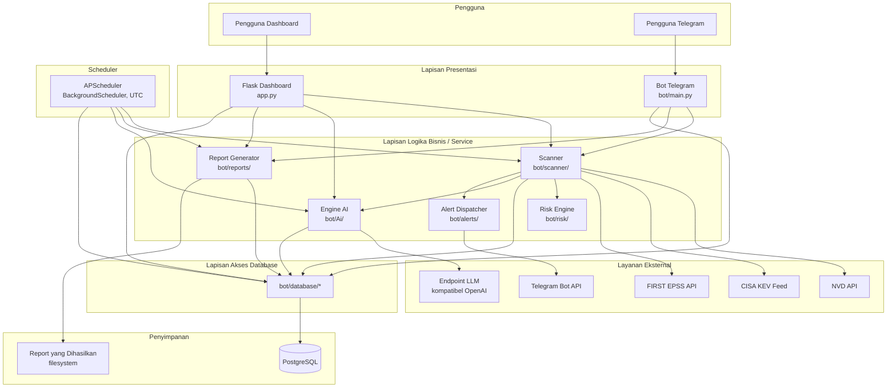
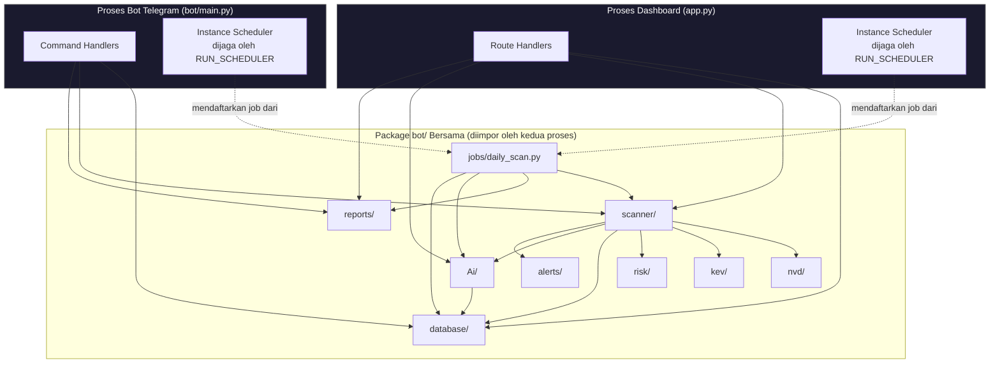
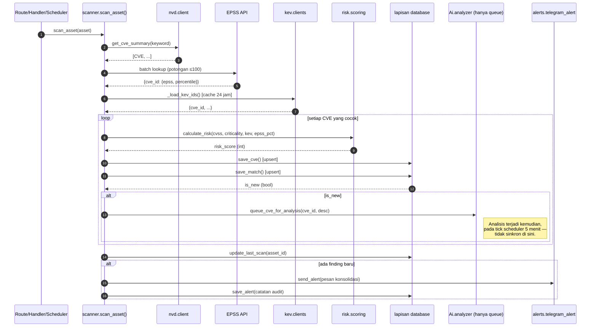
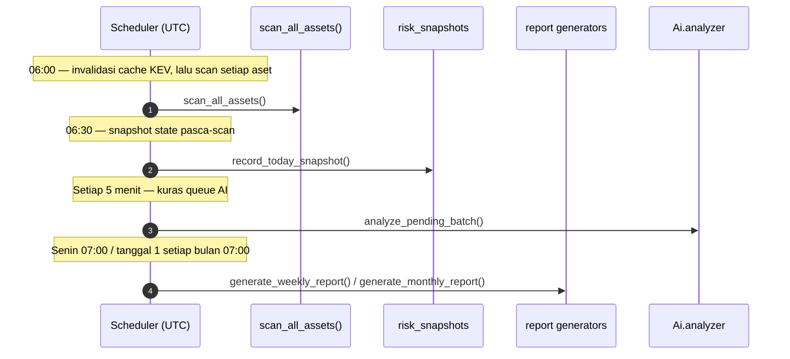
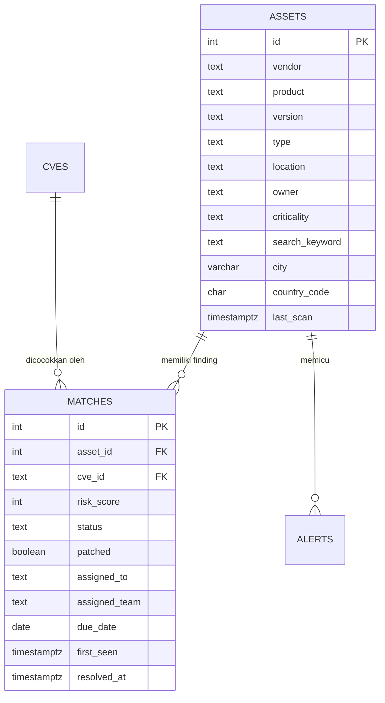
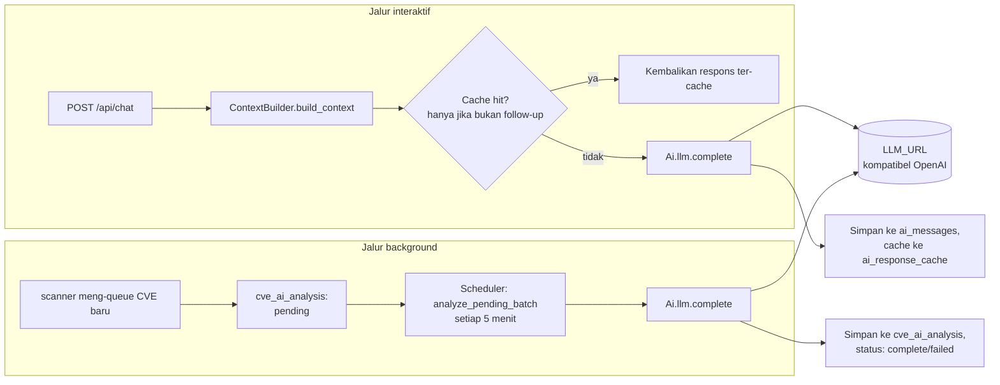
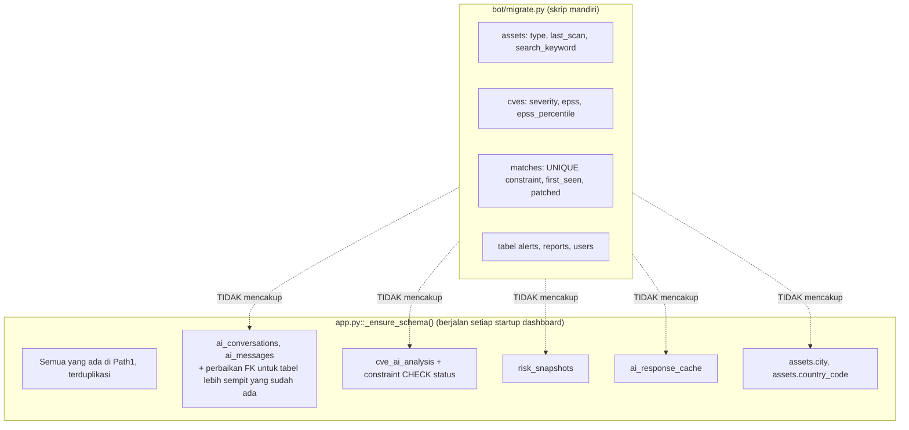
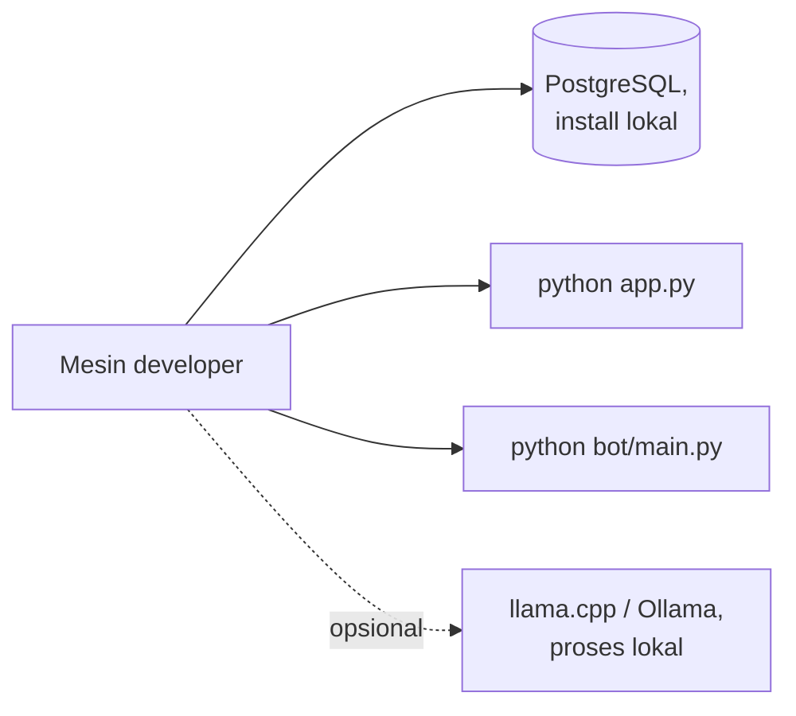
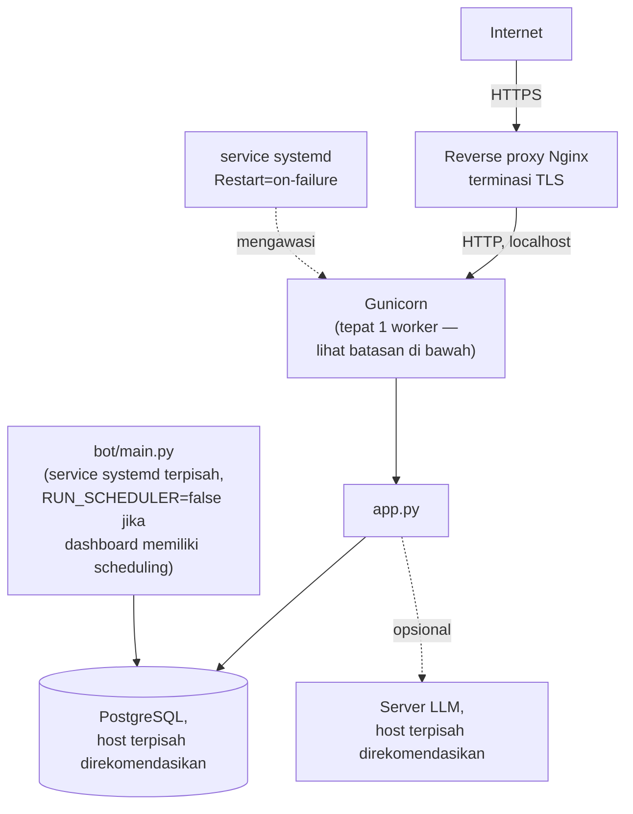

# Arsitektur Sistem ARGUS

Dokumen ini adalah cetak biru teknis ARGUS: mengapa sistem ini dirancang seperti sekarang, bagaimana subsistem-subsistemnya saling berinteraksi, bagaimana data mengalir melalui platform, dan bagaimana arsitektur saat ini perlu berevolusi untuk mendukung skala dan kemampuan yang dijelaskan pada roadmap. Dokumen ini ditulis untuk arsitek, maintainer, kontributor, peninjau keamanan, dan siapa pun yang mengevaluasi ARGUS untuk deployment.

> **Catatan akurasi.** Setiap komponen, alur data, dan klaim arsitektural dalam dokumen ini diverifikasi terhadap source code ARGUS yang sebenarnya (`app.py`, `bot/`, `bot/database/schema.sql`, `bot/migrate.py`). Bagian yang menjelaskan kemampuan di masa depan secara eksplisit ditandai **Planned (Direncanakan)** dan merupakan rekomendasi arsitektural, bukan deskripsi kode yang sudah ada. Dokumen ini tidak mengarang-ngarang kemampuan agar arsitektur tampak lebih matang dari kenyataannya — bila implementasi saat ini adalah sistem single-process, single-database, non-distributed, hal itu dinyatakan secara terus terang, bersama dengan apa yang perlu diubah untuk mencapai target skala pada §21.

---

## Daftar Isi

1. [Pendahuluan](#1-pendahuluan)
2. [Filosofi Arsitektur](#2-filosofi-arsitektur)
3. [Arsitektur Sistem Tingkat Tinggi](#3-arsitektur-sistem-tingkat-tinggi)
4. [Lapisan Sistem](#4-lapisan-sistem)
5. [Arsitektur Komponen](#5-arsitektur-komponen)
6. [Diagram Komponen Detail](#6-diagram-komponen-detail)
7. [Alur Data](#7-alur-data)
8. [Arsitektur Manajemen Aset](#8-arsitektur-manajemen-aset)
9. [Arsitektur Manajemen Kerentanan](#9-arsitektur-manajemen-kerentanan)
10. [Arsitektur AI](#10-arsitektur-ai)
11. [Arsitektur Database](#11-arsitektur-database)
12. [Arsitektur Scanner](#12-arsitektur-scanner)
13. [Arsitektur Risk Engine](#13-arsitektur-risk-engine)
14. [Arsitektur Reporting](#14-arsitektur-reporting)
15. [Arsitektur Alert](#15-arsitektur-alert)
16. [Arsitektur Scheduler](#16-arsitektur-scheduler)
17. [Arsitektur Dashboard](#17-arsitektur-dashboard)
18. [Arsitektur Bot Telegram](#18-arsitektur-bot-telegram)
19. [Arsitektur Keamanan](#19-arsitektur-keamanan)
20. [Arsitektur Performa](#20-arsitektur-performa)
21. [Strategi Skalabilitas](#21-strategi-skalabilitas)
22. [Arsitektur Reliabilitas](#22-arsitektur-reliabilitas)
23. [Arsitektur Deployment](#23-arsitektur-deployment)
24. [Dependensi Modul](#24-dependensi-modul)
25. [Arsitektur Konfigurasi](#25-arsitektur-konfigurasi)
26. [Logging & Observability](#26-logging--observability)
27. [Arsitektur Ekstensi](#27-arsitektur-ekstensi)
28. [Roadmap Arsitektur Masa Depan](#28-roadmap-arsitektur-masa-depan)
29. [Keputusan Arsitektural (ADR)](#29-keputusan-arsitektural-adr)
30. [Model Ancaman Keamanan](#30-model-ancaman-keamanan)
31. [Referensi Silang](#31-referensi-silang)

---

## 1. Pendahuluan

### Tujuan

ARGUS ada untuk menutup celah tertentu: sebuah inventaris aset yang terdefinisi, dikorelasikan secara terus-menerus dan otomatis terhadap intelijen kerentanan publik (NVD, CISA KEV, FIRST EPSS), diberi skor dengan formula yang konsisten, dan bisa ditanyakan dalam bahasa alami. Ini bukan vulnerability scanner dalam arti pemindaian jaringan — ARGUS tidak melakukan port-scan atau fingerprint terhadap host yang hidup. ARGUS adalah **platform korelasi dan prioritisasi**: diberi inventaris vendor/produk/versi yang dikelola sendiri, ARGUS memberitahu Anda apa yang rentan, seberapa mendesak, dan — melalui lapisan AI — memungkinkan Anda bertanya tentang data tersebut secara percakapan alih-alih menulis SQL atau menyilangkan spreadsheet.

### Tujuan sistem

1. Mempertahankan inventaris aset yang akurat dan memiliki atribusi kepemilikan.
2. Mengorelasikan inventaris tersebut terhadap NVD secara terus-menerus, diperkaya dengan status eksploitasi KEV dan probabilitas eksploitasi EPSS.
3. Menghasilkan satu skor risiko yang deterministik dan dapat dijelaskan per temuan.
4. Mengekspos data tersebut melalui dua front end independen (dashboard web, Telegram) yang didukung oleh satu lapisan data dan logika bersama.
5. Memungkinkan operator mengajukan pertanyaan bahasa alami tentang data, dengan jawaban yang berlandaskan pada apa yang benar-benar ada di database — bukan pengetahuan pelatihan umum model tentang suatu CVE tertentu.
6. Melakukan semua hal di atas sebagai sistem yang **dapat di-deploy oleh satu operator** — satu instance PostgreSQL, satu atau dua proses Python, tanpa ketergantungan infrastruktur eksternal selain server LLM lokal yang opsional.

### Filosofi desain

ARGUS dibangun di atas tiga komitmen inti, yang terlihat di seluruh codebase, bukan hanya dinyatakan sekali lalu ditinggalkan:

- **Self-healing schema, bukan upacara migrasi manual.** Kedua proses entry-point (`app.py`, `bot/main.py`) menjalankan perbaikan skema idempoten miliknya sendiri pada setiap startup (`_ensure_schema()` / `migrate.py`), sehingga database menyatu ke bentuk yang diharapkan terlepas dari versi skema mana yang menjadi titik awalnya. Ini menukar sedikit latensi startup dengan hilangnya satu kelas insiden produksi "lupa migrasi".
- **Kegagalan eksplisit, bukan default yang tidak aman.** `SECRET_KEY`, `ADMIN_PASSWORD`, dan `VIEWER_PASSWORD` tidak memiliki nilai fallback — aplikasi menolak untuk start alih-alih berjalan dengan default yang mudah ditebak. Ini adalah sikap fail-closed yang disengaja, namun diterapkan secara tidak konsisten di bagian lain codebase (lihat §29 untuk di mana prinsip ini dijalankan penuh dan di mana tidak).
- **AI yang berlandaskan data, bukan halusinasi percaya diri.** Konteks lapisan AI dirangkai dari SQL langsung dan terparameterisasi terhadap data operator yang sesungguhnya, dan system prompt secara eksplisit menginstruksikan model untuk mengatakan "Information not available in ARGUS" alih-alih menjawab dari pengetahuan pelatihannya sendiri tentang suatu CVE. Ini adalah keputusan arsitektural paling konsekuensial di lapisan AI — lihat §10 dan §29.

### Target pengguna

Analis keamanan individu, tim SOC/CERT kecil, dan operator self-hosted/homelab yang mengelola inventaris aset yang terbatas dan diketahui (lihat `README.md` §1 untuk deskripsi audiens lengkap). Arsitektur saat ini — satu instance PostgreSQL, tanpa horizontal scaling, tanpa multi-tenancy — dirancang untuk audiens ini, bukan untuk SaaS multi-tenant atau inventaris aset skala nasional (§21 membahas apa yang perlu diubah untuk mencapai itu).

### Tujuan enterprise dan visi open-source

Ambisi ARGUS yang dinyatakan (sesuai `README.md`) adalah mencapai kematangan dokumentasi dan operasional setara platform keamanan open-source yang mapan. Secara arsitektural, itu berarti codebase perlu berkembang menuju: disiplin layering yang benar-benar ditegakkan (§4, §24 mendokumentasikan pelanggaran nyata dan saat ini terhadap layering yang dimaksud), kontrak ekstensi/plugin formal (§27), dan primitif skalabilitas pada §21 — tidak satu pun ada saat ini, dan dokumen ini tidak berpura-pura bahwa itu sudah ada.

### Mengapa AI diintegrasikan ke dalam manajemen kerentanan

Data kerentanan bervolume tinggi tapi rendah narasi — satu record CVE, vektor CVSS, dan angka float EPSS tidak memberi tahu analis *apa yang sebenarnya harus dilakukan*. Lapisan AI ARGUS ada untuk menerjemahkan data terstruktur bervolume tinggi menjadi jawaban bahasa alami atas dua pertanyaan yang sebenarnya diajukan analis: "apa artinya ini bagi saya" dan "apa yang harus saya lakukan lebih dulu." Taruhan arsitekturalnya adalah bahwa dengan mengakar-kan model pada data live operator sendiri (§10), terjemahan ini menjadi cukup dapat dipercaya untuk ditindaklanjuti, tanpa mengharuskan model pernah melihat CVE spesifik tersebut selama pelatihan — kemampuan yang berarti untuk CVE yang dipublikasikan setelah training cutoff model mana pun.

---

## 2. Filosofi Arsitektur

| Prinsip | Bagaimana diterapkan di ARGUS | Mengapa |
|---|---|---|
| **Arsitektur modular** | Package tingkat atas yang berbeda per concern: `database/`, `scanner/`, `Ai/`, `risk/`, `reports/`, `alerts/`, `jobs/`, `nvd/`, `kev/`, `handlers/` | Setiap subsistem bisa dipahami, diuji, dan dimodifikasi secara terisolasi; perubahan pada report generation tidak bisa tidak sengaja merusak scanning |
| **Separation of concerns** | Scanner tidak pernah merender HTML; dashboard tidak pernah bicara langsung ke NVD; engine AI tidak pernah menulis findings | Mencegah aplikasi single-file yang kusut, di mana setiap perubahan berisiko regresi yang tidak terkait |
| **Desain berlapis** | Presentasi (routes/handlers) → logika bisnis (scanner/risk/AI) → akses data (`database/`) → PostgreSQL | Setiap lapisan hanya memanggil lapisan di bawahnya — dengan pengecualian nyata dan terdokumentasi pada codebase saat ini (lihat §4, §24) |
| **Security by default** | Tidak ada fallback tidak aman untuk `SECRET_KEY`/`ADMIN_PASSWORD`/`VIEWER_PASSWORD`; SQL terparameterisasi di seluruh; proteksi CSRF diaktifkan secara global | Kesalahan konfigurasi harus gagal dengan keras saat startup, bukan diam-diam menghasilkan sistem berjalan yang tidak aman |
| **Least privilege** | API City Exposure hanya mengembalikan hitungan agregat, tidak pernah detail per-aset, berdasarkan desain eksplisit (didokumentasikan di docstring route itu sendiri) | Contoh konkret tingkat kode dari meminimalkan apa yang diekspos oleh sebuah antarmuka, bukan sekadar pernyataan kebijakan |
| **AI-assisted decision support, bukan AI-driven automation** | Lapisan AI menjawab pertanyaan dan menghasilkan analisis; ia tidak pernah mengubah data, tidak pernah mengubah status finding, tidak pernah memicu scan atau tindakan remediasi atas inisiatifnya sendiri | Menjaga manusia dalam loop untuk setiap tindakan yang mengubah state — AI bersifat advisory, bukan otonom (lihat §28 untuk pembahasan "Planned: Agentic AI" tentang apa yang akan mengubah ini) |
| **AI yang mampu bekerja offline** | Lapisan AI berbicara ke endpoint lokal, self-hosted, yang kompatibel OpenAI secara default (diuji terhadap `llama.cpp`) alih-alih mengharuskan API cloud | Menjaga data kerentanan/aset — yang sensitif secara alami — tidak keluar dari infrastruktur operator sendiri kecuali mereka secara eksplisit mengarahkan `LLM_URL` ke layanan eksternal |
| **Desain berpusat database** | PostgreSQL adalah satu-satunya sumber kebenaran dan *satu-satunya* titik integrasi antara proses dashboard dan proses bot — keduanya tidak pernah saling memanggil langsung | Menyederhanakan model sistem secara signifikan (tanpa RPC antar-proses, tanpa service discovery) dengan mengorbankan skalabilitas horizontal (§21) |
| **Skalabilitas (aspirasional, belum terwujud)** | Connection pooling, panggilan API eksternal yang di-batch, query hot-path yang di-index | Ini adalah optimisasi nyata dan ada saat ini, tetapi menskalakan sistem single-instance lebih jauh, bukan ke skala multi-node, multi-tenant yang dijelaskan pada target §21 — itu memerlukan arsitektur baru yang substansial |
| **Maintainability** | Pola konsisten per-modul (modul client memiliki fetch + cache + invalidate; report generator mengembalikan path atau `None`; job scheduler membungkus dirinya sendiri dalam try/except) | Kontributor baru dapat memperluas sistem dengan menemukan dan menyalin pola analog terdekat (§27) alih-alih menciptakan yang baru setiap kali |

---

## 3. Arsitektur Sistem Tingkat Tinggi



Diagram ini merefleksikan call graph **aktual** saat ini, bukan target yang diidealkan — khususnya, `DASH --> DBMOD` mencakup jumlah SQL inline yang cukup besar yang dikeluarkan langsung dari route handler `app.py`, bukan secara eksklusif melalui fungsi modul `bot/database/` (§4, §24 mendokumentasikan ini secara presisi). Proses dashboard dan bot tidak pernah berkomunikasi langsung satu sama lain; PostgreSQL adalah satu-satunya state bersama di antara keduanya.

---

## 4. Lapisan Sistem

### 4.1 Lapisan Presentasi

**Tanggung jawab:** Penanganan request/response, penegakan sesi/auth, parsing form, rendering template, parsing/formatting pesan Telegram.
**Komponen:** `app.py` (seluruh route Flask), `bot/handlers/*.py` (seluruh command Telegram).
**Dependensi:** Lapisan logika bisnis (scanner, AI, reports) dan, pada praktiknya, lapisan akses data secara langsung untuk banyak route.
**Komunikasi:** Hanya pemanggilan fungsi in-process — tidak ada HTTP atau RPC hop antara lapisan ini dan lapisan di bawahnya, karena semuanya berjalan pada proses Python yang sama per entry point.
**Manfaat:** Dua front end independen dan dapat dipertukarkan di atas satu backend bersama; front end baru (misalnya REST API di masa depan, sesuai `API.md` §23) akan masuk di lapisan ini tanpa menyentuh logika bisnis.

**Pelanggaran layering yang terdokumentasi:** Sebagian besar route `app.py` (misalnya `/findings`, `/assets`, `/dashboard`, `/asset/<id>`) mengeluarkan SQL langsung terhadap koneksi yang di-pool alih-alih memanggil fungsi modul `bot/database/`. Ini adalah karakteristik nyata codebase saat ini, bukan penyederhanaan dokumentasi — lihat `API.md` §2 dan §8 untuk route spesifik yang terpengaruh. Secara arsitektural, ini berarti lapisan presentasi dan lapisan akses data tidak dipisahkan secara bersih di mana-mana; lapisan presentasi kedua yang hipotetis (misalnya REST API di masa depan) tidak bisa sepenuhnya menggunakan ulang "query dashboard" hanya dengan memanggil fungsi bersama — ia perlu menduplikasi SQL tersebut atau SQL tersebut perlu direfaktor ke dalam `bot/database/` terlebih dahulu.

### 4.2 Lapisan Logika Bisnis

**Tanggung jawab:** Korelasi kerentanan (scanner), penilaian risiko (risk engine), perakitan konteks AI dan completion (AI engine), pembuatan report, dispatch alert.
**Komponen:** `bot/scanner/scanner.py`, `bot/risk/scoring.py`, `bot/Ai/`, `bot/reports/`, `bot/alerts/telegram_alert.py`.
**Dependensi:** Lapisan akses data, lapisan integrasi eksternal.
**Komunikasi:** Pemanggilan in-process; scanner adalah orkestrator sentral lapisan ini, memanggil risk engine, engine AI (queuing, bukan analisis sinkron), lapisan akses data, dan alert dispatcher, semuanya dalam satu invokasi `scan_asset()` (lihat sequence diagram di §7.2).
**Manfaat:** Setiap concern dapat diuji secara independen dan dapat digunakan ulang secara independen di kedua front end — `scan_asset()` dipanggil secara identik baik dipicu dari route `/today` dashboard, command Telegram `/scan`, atau scheduler.

### 4.3 Lapisan Service (integrasi eksternal)

Dibedakan dari "Logika Bisnis" karena tugas satu-satunya modul-modul ini adalah berbicara dengan sesuatu di luar batas proses, tanpa logika scoring/korelasi sendiri.
**Komponen:** `bot/nvd/client.py`, `bot/kev/clients.py`, client EPSS yang tertanam dalam `scanner.py`, `bot/Ai/llm.py` (client HTTP LLM, berbeda dari logika *engine* AI di `analyzer.py`/`context_builder.py`).
**Dependensi:** Tidak ada dependensi internal — ini adalah daun-daun (leaves) dari graf dependensi (§24).
**Komunikasi:** Hanya HTTPS/HTTP outbound.
**Manfaat:** Setiap dependensi eksternal diisolasi di balik antarmuka yang sempit (fungsi yang mengembalikan data ternormalisasi), artinya penggantian di masa depan (misalnya mengganti server LLM) hanya menyentuh satu file.

### 4.4 Lapisan AI

Diperlakukan sebagai lapisannya sendiri, terpisah dari logika bisnis umum, karena bentuk alur datanya yang khas (perakitan konteks → panggilan LLM eksternal → respons terstruktur atau teks bebas) dan dua entry point independennya (chat interaktif vs. analisis background). Lihat §10 untuk detail lengkap.
**Komponen:** `bot/Ai/context_builder.py`, `bot/Ai/analyzer.py`, `bot/Ai/llm.py`.
**Dependensi:** Lapisan akses data (read-heavy — perakitan konteks; write-narrow — hanya empat tabel miliknya sendiri), lapisan service LLM.
**Komunikasi:** In-process untuk perakitan konteks dan akses database; HTTP outbound untuk panggilan completion sesungguhnya.

### 4.5 Lapisan Database (Akses Data)

**Tanggung jawab:** Seluruh SQL, connection pooling, self-healing skema.
**Komponen:** `bot/database/*.py`, `bot/database/schema.sql`, `bot/migrate.py`, dan logika perbaikan skema yang tertanam di `app.py::_ensure_schema()`.
**Dependensi:** Hanya PostgreSQL.
**Komunikasi:** `psycopg2` melalui koneksi TCP yang di-pool.
**Manfaat, dan catatan jujurnya:** Lapisan ini dimaksudkan menjadi *satu-satunya* kode yang mengeluarkan SQL — pada praktiknya (sesuai §4.1), ini adalah satu-satunya kode yang mengeluarkan SQL untuk handler bot Telegram dan untuk sebagian route dashboard, tetapi tidak untuk setiap route dashboard. Perlakukan "lapisan database" sebagai niat arsitektural yang sebagian, bukan sepenuhnya, ditegakkan oleh codebase saat ini.

### 4.6 Lapisan Integrasi

Mencakup baik Lapisan Service (§4.3, outbound ke API eksternal) maupun permukaan integrasi inbound — mekanisme webhook/polling Telegram Bot API (ditangani oleh `python-telegram-bot`, bukan kode ARGUS kustom) dan, di masa depan, REST API (`API.md` §23).

### 4.7 Lapisan Infrastruktur

**Tanggung jawab:** Supervisi proses, server PostgreSQL itu sendiri, server LLM opsional, terminasi TLS, reverse proxying.
**Komponen:** Bukan bagian dari codebase ARGUS — ini adalah infrastruktur deployment, dibahas di `INSTALL.md` dan §23 dokumen ini. ARGUS tidak memiliki process supervisor bawaan, tidak ada penanganan TLS bawaan, dan (saat ini) tidak ada containerization — lihat §23.

---

## 5. Arsitektur Komponen

| Komponen | Lokasi | Tanggung jawab | Batas eksplisit (apa yang *tidak* dilakukan) |
|---|---|---|---|
| **Dashboard** | `app.py` | Penanganan request HTTP, session auth, rendering HTML, JSON API untuk JS dashboard | Tidak pernah memanggil NVD/KEV/EPSS langsung (mendelegasikan ke `scanner`); tidak pernah memanggil LLM langsung (mendelegasikan ke `Ai/`) |
| **Bot Telegram** | `bot/main.py`, `bot/handlers/` | Parsing command, formatting pesan Telegram | Batas sama seperti dashboard — ini adalah lapisan presentasi kedua di atas logika bisnis yang identik |
| **Scanner** | `bot/scanner/scanner.py` | Mengorkestrasi lookup NVD/KEV/EPSS, kalkulasi risiko, persistensi, queuing AI, dan alerting untuk satu operasi scan | Tidak pernah memutuskan *kapan* melakukan scan (itu tugas scheduler atau route/handler); tidak pernah mengirim pesan Telegram sendiri selain mendelegasikan ke `alerts/` |
| **Engine AI** | `bot/Ai/` | Perakitan konteks, completion LLM, analisis CVE background | Tidak pernah mengubah data finding/aset/risiko; tidak pernah memicu scan |
| **Database** | `bot/database/` | Connection pooling, seluruh state persisten | Tidak berisi logika bisnis (formula risiko, prompt AI) — akses data murni |
| **Scheduler** | `bot/jobs/daily_scan.py` | Pemicu berbasis waktu untuk scanner, risk snapshot, report, pemrosesan batch AI, cache purging | Tidak berisi logika bisnis sendiri — setiap fungsi job adalah wrapper tipis yang memanggil lapisan lain |
| **Risk Engine** | `bot/risk/scoring.py` | Satu fungsi murni: input (CVSS, criticality, KEV, EPSS) → skor risiko | Tidak ada I/O jenis apa pun — satu-satunya modul bebas efek samping dalam codebase |
| **Reporting Engine** | `bot/reports/` | Agregasi data dengan jendela waktu → rendering PDF → persistensi | Tidak pernah mengirim PDF ke mana pun sendiri (itu tugas pemanggil — route, handler, atau job scheduler) |
| **Alert Engine** | `bot/alerts/telegram_alert.py` | Pengiriman pesan/dokumen Telegram | Tidak berisi *logika* alerting (threshold, deduplikasi) — itu ada di scanner, yang memutuskan *apakah* memanggil modul ini |
| **Threat Intelligence** | `bot/nvd/`, `bot/kev/` | Logika client NVD dan KEV (EPSS tertanam di `scanner.py`, bukan modul terpisah — inkonsistensi nyata, bukan idealisasi) | Tidak ada *keputusan* caching di luar yang sudah dibangun ke setiap client — NVD selalu live, KEV di-cache 24 jam, EPSS di-batch per scan |
| **Konfigurasi** | `.env` / `os.environ`, `bot/config/locations.py` | Konfigurasi runtime berbasis environment variable; data referensi kota/koordinat statis | Tidak ada objek config terpusat — lihat §25 |
| **Autentikasi** | `app.py` (dict `USERS` bawaan + tabel `users`), Flask-Login | Login berbasis sesi hanya untuk dashboard | Bot Telegram tidak memiliki autentikasi sendiri — siapa pun yang bisa mengirim pesan ke bot secara implisit "terautentikasi" (lihat §19) |
| **Otorisasi** | Decorator `@login_required`, `@admin_required` di `app.py` | RBAC dua peran untuk dashboard | Tidak ada model otorisasi sama sekali untuk bot Telegram |
| **Logging** | Modul `logging` Python, logger per-modul | Output diagnostik, `basicConfig` di `bot/main.py` | Tidak ada logging terstruktur/JSON, tidak ada agregasi log terpusat, tidak ada logging berbasis file secara default — lihat §26 |
| **Monitoring** | Hanya command Telegram `/status` | Satu probe kesehatan yang dipicu secara manual (PostgreSQL `SELECT 1` + ping NVD live) | Tidak ada endpoint health-check otomatis, tidak ada ekspor metrik, tidak ada alerting-atas-kesehatan-ARGUS-sendiri — lihat §26, §28 |

---

## 6. Diagram Komponen Detail



**Fakta arsitektural kunci yang dijelaskan diagram ini:** `bot/` bukan sebuah service — ini adalah package Python yang diimpor oleh dua proses OS terpisah. Tidak ada IPC antara Proses Dashboard dan Proses Bot; `Shared_Modules` adalah *kode* bersama, bukan instance yang berjalan bersama. Setiap proses mendapatkan salinannya sendiri dari, misalnya, connection pool di `database/db.py` — artinya `DB_POOL_MAX_CONN` (default 20) berlaku **per proses**, sehingga menjalankan dashboard dan bot bersamaan berarti hingga 40 koneksi yang di-pool terhadap PostgreSQL secara default, bukan 20 yang dibagi.

---

## 7. Alur Data

### 7.1 Siklus hidup end-to-end (naratif)

1. **Aset dibuat** — melalui form dashboard atau `/add` Telegram → `database/assets.py::add_asset()` → baris tabel `assets`.
2. **Scan dipicu** — on-demand (route/handler) atau terjadwal (§16) → `scanner.scan_asset()` atau `scan_all_assets()`.
3. **Pencocokan CVE** — `scanner.py` memanggil `nvd/client.py::get_cve_summary()` dengan kata kunci pencarian aset tersebut.
4. **Pengayaan (Enrichment)** — lookup batch EPSS dan pengecekan set cache KEV, keduanya di dalam `scanner.py`.
5. **Risk Engine** — `risk/scoring.py::calculate_risk()` dipanggil per CVE yang cocok.
6. **Persistensi** — `database/cves.py::save_cve()` (upsert) dan `database/matches.py::save_match()` (upsert, mengembalikan status baru-atau-tidak).
7. **Analisis AI (di-queue, bukan sinkron)** — setiap match yang *baru* memanggil `Ai/analyzer.py::queue_cve_for_analysis()`; panggilan LLM sesungguhnya terjadi kemudian, pada job scheduler `ai_analysis` 5 menit, bukan inline dalam scan.
8. **Penyimpanan Historis** — job `risk_snapshot` scheduler yang terpisah (06:30 UTC) mengagregasi state saat ini ke dalam `risk_snapshots`, independen dari scan individual mana pun.
9. **Dashboard** — membaca state saat ini secara live dari PostgreSQL pada setiap request; tidak ada lapisan caching antara dashboard dan database untuk data finding/aset.
10. **Report** — dihasilkan on-demand atau oleh scheduler, membaca query berjendela-waktu atas `matches`/`cves`/`assets` pada saat pembuatan.
11. **Alert** — dikirim secara sinkron, inline, di akhir `scan_asset()`, hanya jika scan tersebut menghasilkan setidaknya satu finding baru.
12. **Telegram** — kanal pengiriman untuk baik alert (langkah 11) maupun dokumen report terjadwal (mingguan/bulanan).

### 7.2 Sequence diagram — siklus hidup lengkap scan-ke-alert



### 7.3 Sequence diagram — alur data historis/terjadwal



---

## 8. Arsitektur Manajemen Aset

### Siklus hidup aset

`Dibuat` (via `add_asset`) → `Di-scan` (`last_scan` dicap pada setiap scan, apakah menemukan sesuatu yang baru atau tidak) → `Diedit` (location/owner/criticality/notes/type dapat diubah kapan saja) → `Dihapus` (jalur dashboard men-cascade `matches`/`alerts` secara eksplisit dalam kode aplikasi; jalur `/rm` Telegram mengandalkan `ON DELETE CASCADE` bawaan database pada `matches.asset_id` — lihat `schema.sql`, jadi kedua jalur tetap konsisten pada akhirnya, tetapi melalui mekanisme berbeda: cascade tingkat aplikasi pada satu jalur, `ON DELETE CASCADE` tingkat database pada yang lain).

### Kepemilikan, lokasi, kritikalitas

Dimodelkan sebagai kolom biasa pada `assets` (`owner TEXT`, `location TEXT`, `criticality TEXT`, ditambah `city VARCHAR(120)`/`country_code CHAR(2)` yang ditambahkan kemudian untuk fitur City Exposure) — bukan tabel "teams" atau "locations" yang ternormalisasi. `owner` dan `location` adalah teks bebas tanpa integritas referensial ke tabel lain mana pun; `criticality` hanya divalidasi di lapisan form aplikasi (bukan constraint `CHECK` database), dan `city`/`country_code` divalidasi terhadap `bot/config/locations.py::SUPPORTED_LOCATIONS` saat penulisan (juga di lapisan aplikasi, bukan lapisan database).

### Versi dan firmware

`assets.version` adalah satu kolom teks bebas. Tidak ada pembedaan terpisah antara versi firmware vs. software, tidak ada tabel riwayat versi, dan tidak ada logika perbandingan versi terstruktur (misalnya rentang semantic version) — string `version` diteruskan langsung ke konstruksi kata kunci pencarian NVD dan selain itu diperlakukan sebagai label opaque.

### Relasi



### Pelacakan historis

Tidak ada tabel history/audit tingkat aset — sebuah edit pada `owner`/`criticality`/`location` menimpa nilai sebelumnya tanpa catatan apa nilainya sebelumnya atau kapan berubah. Satu-satunya dimensi historis yang dilacak di tingkat aset adalah `last_scan` (satu timestamp, ditimpa pada setiap scan) dan, secara tidak langsung, `matches.first_seen` per finding (yang memang menyimpan *kapan sebuah CVE tertentu pertama kali dicocokkan ke aset ini*, meskipun baris aset itu sendiri tidak memiliki riwayat perubahan).

### Ekspansi masa depan (Planned)

Pemodelan relasi aset (misalnya parent/child untuk aset yang divirtualisasi atau di-container-kan), pelacakan versi firmware terstruktur dengan operator perbandingan, dan riwayat audit tingkat aset tidak ada dalam skema saat ini dan juga tidak ada pada roadmap `README.md` yang dipublikasikan — dicatat di sini sebagai celah arsitektural, bukan arah masa depan yang dinyatakan.

---

## 9. Arsitektur Manajemen Kerentanan

### Sinkronisasi NVD

Bukan "sinkronisasi" dalam arti penarikan penuh database secara periodik — ARGUS tidak pernah mengunduh atau mem-mirror korpus CVE NVD. Setiap lookup adalah pencarian kata kunci live, on-demand terhadap `services.nvd.nist.gov` pada saat scan (`nvd/client.py::get_cve_summary()`). Ini adalah pilihan arsitektural yang disengaja: menukar kemampuan lookup CVE offline/air-gapped demi overhead penyimpanan nol dan data NVD yang selalu terkini, dengan biaya membuat setiap scan bergantung pada ketersediaan dan rate limit NVD.

### OpenCVE

**Tidak terintegrasi.** Tidak ada client, tidak ada konfigurasi, tidak ada jalur kode — lihat `API.md` §14.4. Diagram atau dokumen arsitektur mana pun yang menyebut OpenCVE sebagai integrasi aktif sedang menjelaskan aspirasi, bukan sistem saat ini.

### KEV

Disinkronkan secara berbeda dari NVD: seluruh feed JSON CISA KEV diambil dan di-cache in-memory selama 24 jam (`kev/clients.py`), lalu dicek sebagai lookup keanggotaan-set lokal per CVE — satu-satunya dataset eksternal yang benar-benar "disinkronkan" (di-cache, disegarkan secara periodik) dalam sistem.

### EPSS

Tidak live-per-lookup (seperti NVD) maupun cached-and-refreshed (seperti KEV) — EPSS diambil segar pada setiap scan, tetapi *di-batch* hingga 100 CVE ID per request HTTP dalam scan tersebut, tertanam langsung di `scanner.py` alih-alih memiliki modul client sendiri (inkonsistensi arsitektural yang perlu disebutkan: NVD dan KEV masing-masing memiliki package khusus; EPSS tidak).

### Penyimpanan, normalisasi, deduplikasi CVE

Tabel `cves` adalah representasi ternormalisasi milik ARGUS sendiri — satu baris per CVE ID, menyimpan CVSS (sebagai satu nilai numerik, bukan string vektor CVSS lengkap), label `severity` turunan, boolean `kev`, `epss`/`epss_percentile`, tanggal `published`, dan `description`. `save_cve()` adalah upsert (`ON CONFLICT`), jadi menemukan kembali sebuah CVE di beberapa aset atau beberapa scan tidak menciptakan baris duplikat — deduplikasi terjadi secara alami di tingkat skema melalui `cve_id` sebagai primary key, bukan melalui logika pengecekan duplikat di tingkat aplikasi.

### Pencocokan (Matching)

"Matching" di ARGUS berarti: pencarian kata kunci NVD sendiri mengembalikan CVE apa pun yang NVD kaitkan dengan string pencarian yang dibangun dari vendor/produk aset (atau `search_keyword` eksplisit). Tidak ada pencocokan terstruktur berbasis CPE, tidak ada evaluasi rentang versi (misalnya "versi terdampak < 2.3.1") yang dilakukan oleh ARGUS sendiri — presisi pencocokan sepenuhnya merupakan fungsi dari relevansi pencarian kata kunci NVD dan seberapa baik `search_keyword` aset dipilih. Ini adalah keterbatasan arsitektural yang berarti: dua aset dengan `search_keyword` yang berkata-kata identik namun rentang versi terdampak yang sungguh berbeda (dan tidak tumpang tindih) akan menerima set kecocokan CVE yang identik dari ARGUS.

### Pembaruan historis

Jika record NVD sebuah CVE berubah setelah ingest pertama (misalnya skor CVSS direvisi, atau deskripsi diperbarui), ARGUS hanya menangkapnya pada scan berikutnya dari aset yang pencarian kata kuncinya kebetulan mengembalikan CVE tersebut lagi — upsert `save_cve()` kemudian menimpa baris yang tersimpan. Tidak ada job "re-sync CVE yang sudah ada" terpisah yang independen dari asset scanning.

### Ringkasan strategi caching

| Dataset | Perilaku cache |
|---|---|
| NVD | Tidak ada — selalu live |
| KEV | Cache in-memory 24 jam, secara eksplisit di-invalidasi sebelum scan terjadwal harian |
| EPSS | Tidak ada lintas scan; di-batch (bukan per-CVE) dalam satu scan |

---

## 10. Arsitektur AI

### 10.1 Dua entry point independen, satu fungsi completion bersama



Kedua jalur bertemu di `Ai/llm.py::complete()`, tetapi — seperti didokumentasikan secara detail di `API.md` §7.8 — keduanya menyelesaikan `LLM_URL` secara berbeda: jalur chat mengecek secara eksplisit dan gagal dengan bersih jika tidak diset; `complete()` sendiri jatuh ke IP literal pengembangan yang di-hardcode jika `LLM_URL` tidak diset, yang diwarisi jalur background karena ia tidak pernah melakukan pre-check-nya sendiri. Ini adalah asimetri arsitektural nyata antara dua entry point, bukan penyederhanaan.

### 10.2 Context Builder — bagian "retrieval" dari sistem

`ContextBuilder` adalah **router intent di atas SQL terparameterisasi**, bukan sistem retrieval-augmented-generation dalam arti vektor/embedding. Tidak ada model embedding di mana pun dalam codebase, tidak ada vector store, tidak ada similarity search. Arsitekturnya adalah:

```
pertanyaan → cocok regex CVE-ID? ──ya──→ build_cve_context(cve_id)
              │tidak
              ▼
       determine_intent(pertanyaan)  [pencocokan kata kunci, daftar terprioritaskan]
              │
              ▼
       dispatch ke salah satu dari 9 metode build_<intent>_context()
              │
              ▼
       setiap metode meng-query view yang dibangun khusus (ai_dashboard, ai_open_findings,
       ai_asset_summary, ai_vulnerability_summary) atau query tabel langsung,
       dibatasi baris pada _MAX_FINDINGS
              │
              ▼
       string konteks yang diformat, disisipkan ke system/user prompt LLM
```

Ini secara sengaja disebut "structured retrieval," bukan "RAG," di dokumen ini dan di `API.md`/`README.md` — menggunakan istilah "RAG" tanpa kualifikasi akan melebih-lebihkan arsitektur relatif terhadap apa yang diimplementasikan.

### 10.3 Konstruksi prompt

System prompt (dibangun di handler `/api/chat` `app.py` untuk chat, dan secara terpisah di `Ai/analyzer.py` untuk analisis background) adalah template statis dengan string konteks yang dirakit disisipkan ke dalamnya. Tidak ada engine prompt-templating, tidak ada injeksi contoh few-shot, tidak ada pemilihan prompt dinamis berdasarkan kompleksitas pertanyaan — satu system prompt tetap per entry point (chat vs. analysis), masing-masing dengan instruksi berbeda yang disesuaikan untuk bentuk output yang berbeda (jawaban percakapan teks bebas vs. field JSON terstruktur).

### 10.4 Conversation manager dan memori

`database/conversations.py` mengimplementasikan memori percakapan sebagai baris relasional biasa (`ai_conversations`, `ai_messages`), diberi lingkup kepemilikan berdasarkan `username`. "Memori" dalam arti arsitektural bersifat terbatas dan eksplisit: `get_recent_history_for_llm()` mengembalikan paling banyak 20 pesan terakhir, diformat ke dalam array `messages` yang dikirim ke LLM pada setiap request — tidak ada peringkasan riwayat lama, tidak ada distilasi memori jangka panjang, dan tidak ada memori lintas-percakapan (konteks setiap percakapan terisolasi dari setiap percakapan lain yang dimiliki pengguna yang sama).

### 10.5 Integrasi LLM lokal

`LLM_URL` menunjuk ke server mana pun yang mengimplementasikan `/v1/chat/completions`. Secara arsitektural, ARGUS memperlakukan LLM sebagai **dependensi eksternal yang stateless dan dapat dipertukarkan** di balik tepat satu antarmuka sempit (`complete(messages, ...) -> str`) — tidak ada dependensi SDK vendor, tidak ada jalur kode khusus model. Ini disengaja: artinya ARGUS agnostik terhadap apakah operator menjalankan `llama.cpp`, Ollama (melalui permukaan kompatibel OpenAI-nya), atau layanan hosted, dengan biaya tidak bisa menggunakan fitur khusus provider apa pun (function calling, mode output terstruktur, dll.) di luar apa yang didukung oleh skema chat completions kompatibel OpenAI itu sendiri.

### 10.6 Strategi embedding / retrieval semantik

**Tidak diimplementasikan.** Tidak ada pembuatan embedding, tidak ada vector index, dan tidak ada pencarian kemiripan semantik di mana pun dalam ARGUS. RAG-dalam-arti-vector-database masa depan akan menjadi arsitektur baru, bukan perluasan dari pipeline embedding yang ada (yang tidak ada) — lihat §28.

### 10.7 Manajemen context window

| Kontrol | Mekanisme |
|---|---|
| Riwayat percakapan | Batas keras 20 pesan (`get_recent_history_for_llm`) |
| Volume data yang diambil | Batas baris per-intent (konstanta `_MAX_FINDINGS`) |
| Panjang output | `max_tokens` — 512 untuk chat, 900 untuk analysis |
| Durasi request | Timeout 120 detik, kedua jalur |

Tidak ada penyesuaian ukuran konteks dinamis/adaptif berdasarkan context window aktual model target — batas-batas di atas adalah konstanta tetap, bukan diturunkan dari panjang konteks yang dilaporkan model (yang tidak ada cara bagi ARGUS untuk mengetahuinya, karena ia tidak pernah meng-query server LLM untuk kemampuannya).

### 10.8 Mitigasi knowledge-cutoff

System prompt secara eksplisit menginstruksikan model untuk memperlakukan data deskripsi/CVSS/KEV/EPSS NVD yang *disediakan* sebagai otoritatif dan untuk mengatakannya dengan terus terang jika informasi tidak ada dalam konteks yang disediakan tersebut, alih-alih mengisi celah dari data pelatihannya sendiri tentang suatu CVE — mekanisme arsitektural di sini adalah **instruksi tingkat prompt**, bukan jaminan teknis (tidak ada langkah verifikasi output yang mengecek apakah model benar-benar mematuhi). Ini adalah strategi mitigasi knowledge-cutoff utama, dan satu-satunya, dalam sistem.

### 10.9 Pembuatan respons dan caching

Respons chat di-cache (`ai_response_cache`) dengan kunci berupa hash dari `(question, live_context)` — artinya cache otomatis di-invalidasi begitu data yang mendasarinya berubah, tanpa logika invalidasi cache eksplisit apa pun yang dipicu oleh scan atau pembaruan finding; ini terjadi secara implisit karena string konteks yang mengisi hash tersebut berubah. Ini adalah arsitektur caching yang elegan dan hemat perawatan, layak disebutkan sebagai pilihan desain yang disengaja alih-alih kebetulan: tidak ada hook eksplisit "invalidasi cache saat data berubah" di mana pun, karena tidak diperlukan mengingat bagaimana kunci diturunkan.

### 10.10 Dukungan multi-model masa depan (Planned)

Tidak diimplementasikan — `complete()` tidak mengirim field `model` dan tidak memiliki konsep routing pertanyaan berbeda ke model berbeda. Arsitektur multi-model masa depan akan memerlukan lapisan pemilihan model di atas `complete()`, kemungkinan berdasarkan kunci intent (misalnya model yang lebih kecil/cepat untuk lookup sederhana, model yang lebih besar untuk analisis terbuka) — ini adalah titik ekstensi yang masuk akal, bukan kemampuan yang sudah ada.

### 10.11 Agentic AI masa depan (Planned)

Tidak diimplementasikan — lihat catatan §2 tentang "AI-assisted, bukan AI-driven." Lapisan AI saat ini memiliki nol kemampuan tool-calling/function-calling dan tidak dapat mengambil tindakan apa pun di luar menghasilkan teks. Arsitektur agentic (AI memutuskan untuk memicu scan, memperbarui status finding, atau meng-query sistem eksternal atas inisiatifnya sendiri) akan memerlukan: registry tool/function, lapisan safety/approval mengingat sifat tindakan-tindakan yang mengubah state tersebut, dan model kepercayaan yang fundamental berbeda dari desain read-only-context, text-out saat ini. `README.md` §17 mencantumkan ini sebagai item roadmap; dokumen ini mencatat bahwa ini secara arsitektural adalah langkah besar, bukan langkah bertahap, dari desain saat ini.

---

## 11. Arsitektur Database

### 11.1 Filosofi skema

Additive-only, self-healing, dan — yang penting — **dibangun melalui dua jalur migrasi independen yang sebagian tumpang tindih** alih-alih satu sumber kebenaran kanonik:



**Ini adalah celah yang terverifikasi dan material, bukan penyederhanaan:** `bot/migrate.py` **tidak** membuat tabel AI (`ai_conversations`, `ai_messages`, `cve_ai_analysis`, `risk_snapshots`, `ai_response_cache`) atau kolom `assets.city`/`assets.country_code` — hanya `app.py::_ensure_schema()` yang melakukannya. Sebuah deployment yang hanya pernah menjalankan `python migrate.py` dan tidak pernah menjalankan `app.py` (misalnya hanya menjalankan bot Telegram dalam deployment hipotetis tanpa dashboard) akan sepenuhnya kehilangan setiap tabel AI dan kolom City Exposure, karena `bot/main.py` juga tidak membuatnya. **Ini mengoreksi sebuah pernyataan di `INSTALL.md` §6**, yang menjelaskan `migrate.py` sebagai menerapkan "set migrasi idempoten yang sama" seperti `app.py` — itu tidak akurat untuk penambahan skema AI/city; `INSTALL.md` harus dibaca sebagai hanya berlaku untuk skema dasar (assets/cves/matches/alerts/reports/users), dan dokumen ini adalah pernyataan otoritatif dari perbedaan tersebut. Pada praktiknya ini jarang muncul sebagai masalah dunia nyata, karena deployment tipikal memang menjalankan `app.py` (dashboard) setidaknya sekali, yang memperbaiki skema penuh terlepas dari apakah `migrate.py` juga dijalankan — tetapi ini adalah inkonsistensi arsitektural yang nyata dalam bagaimana kedua jalur migrasi dibangun, tampaknya pada titik berbeda dalam sejarah proyek (komentar kode di `app.py` di sekitar blok `ai_conversations` secara eksplisit merujuk "setup ad-hoc sebelumnya" yang mendahului bentuk skema saat ini, mengonfirmasi bahwa ini berkembang secara organik alih-alih dirancang sebagai dua jalur migrasi yang disinkronkan sejak awal).

### 11.2 Diagram entity-relationship (konseptual, skema lengkap)

```mermaid
erDiagram
    ASSETS ||--o{ MATCHES : "memiliki finding"
    CVES ||--o{ MATCHES : "dicocokkan oleh"
    CVES ||--o| CVE_AI_ANALYSIS : "dianalisis sebagai"
    ASSETS ||--o{ ALERTS : "memicu"
    AI_CONVERSATIONS ||--o{ AI_MESSAGES : berisi
    USERS ||--o{ AI_CONVERSATIONS : "memiliki (berdasarkan username, bukan FK)"

    ASSETS {
        int id PK
        text vendor
        text product
        text version
        text type
        text criticality
        varchar city
        char country_code
    }
    CVES {
        text cve_id PK
        numeric cvss
        text severity
        boolean kev
        numeric epss
        numeric epss_percentile
    }
    MATCHES {
        int id PK
        int asset_id FK
        text cve_id FK
        int risk_score
        text status
        boolean patched
    }
    CVE_AI_ANALYSIS {
        text cve_id PK_FK
        text summary
        text status
        int retry_count
        text description_hash
    }
    AI_CONVERSATIONS {
        int id PK
        text username
        text title
        boolean archived
    }
    AI_MESSAGES {
        int id PK
        int conversation_id FK
        text role
        text content
        int tokens
    }
    AI_RESPONSE_CACHE {
        text cache_key PK
        text question
        text response
        timestamptz expires_at
    }
    RISK_SNAPSHOTS {
        int id PK
        date snapshot_date UK
        int total_findings
        int open_findings
        numeric avg_risk_score
    }
    USERS {
        int id PK
        text username UK
        text password_hash
        text role
    }
    REPORTS {
        int id PK
        varchar report_type
        text file_path
    }
    ALERTS {
        int id PK
        int asset_id FK
        text message
    }
```

**Non-relasi yang perlu diperhatikan:** `AI_CONVERSATIONS.username` adalah kolom `TEXT` biasa, bukan foreign key ke `USERS.username` — pembatasan lingkup kepemilikan (§7.4 di `API.md`) ditegakkan sepenuhnya di lapisan query aplikasi (`WHERE username = %s`), bukan oleh constraint tingkat database. Sebuah percakapan bisa merujuk ke username yang tidak lagi ada di `users` (misalnya akun bawaan `admin`/`viewer`, yang sama sekali tidak memiliki baris `users`) tanpa error.

### 11.3 Normalisasi

Tabel inti (`assets`, `cves`, `matches`) berada dalam bentuk 3NF yang wajar untuk tujuannya — `matches` adalah tabel junction yang tepat antara `assets` dan `cves` dengan atributnya sendiri (status, risk_score, penugasan). View AI (`ai_dashboard`, `ai_open_findings`, `ai_asset_summary`, `ai_vulnerability_summary`) secara sengaja adalah **model baca ternormalisasi-parsial (denormalized)** — dimaterialisasi sebagai view (bukan *tabel* materialized, jadi selalu live, tidak basi) yang dibangun khusus untuk menghindari context builder AI perlu menulis join ad-hoc per query.

### 11.4 Index

| Index | Tabel/kolom | Tujuan |
|---|---|---|
| `idx_matches_asset_id` | `matches(asset_id)` | Lookup finding per-aset (`/asset/<id>`, scan `/findings`) |
| `idx_matches_cve_id` | `matches(cve_id)` | Lookup per-CVE (`/finding/<cve_id>`) |
| `idx_matches_risk` | `matches(risk_score DESC)` | Listing findings terurut risiko |
| `idx_matches_status` | `matches(status)` | Filtering status |
| `idx_matches_due_date` | `matches(due_date)` | Query finding yang terlambat (intent AI `overdue`, pelacakan SLA) |
| `idx_matches_risk` (hanya `migrate.py`) | `matches(risk_score DESC)` | Listing findings terurut risiko |
| `idx_assets_type` (hanya `migrate.py`) | `assets(type)` | Filtering tipe aset |
| `idx_assets_city_country` | `assets(country_code, city)` | Agregasi City Exposure |
| `idx_ai_conversations_username` (komposit) | `ai_conversations(username, updated_at DESC)` | Listing percakapan per pengguna, terbaru dulu |
| `idx_ai_messages_conversation` (komposit) | `ai_messages(conversation_id, created_at)` | Pengambilan pesan terurut per percakapan |
| `idx_cve_ai_analysis_status` | `cve_ai_analysis(status)` | Lookup baris `pending` queue analisis background |
| `idx_risk_snapshots_date` | `risk_snapshots(snapshot_date DESC)` | Query snapshot terbaru dan tren |
| `idx_ai_response_cache_expires` | `ai_response_cache(expires_at)` | Scan baris kedaluwarsa job pembersih cache |

**Celah terverifikasi:** tidak ada index pada `cves(cvss)` atau `cves(kev)` di mana pun dalam `schema.sql`, `migrate.py`, atau `app.py::_ensure_schema()`. Kedua kolom sangat sering difilter dan diurutkan — pencarian `/cves` yang live, filter KEV `/findings`, dan intent `kev` context builder AI semuanya melakukannya — sehingga pada volume tabel CVE yang besar (lihat target skala §21), sequential scan adalah rencana query aktual saat ini untuk query yang difilter KEV atau CVSS terhadap `cves`, karena tidak ada index yang mendukungnya. Ini adalah celah skalabilitas yang genuine dan saat ini belum ditangani dalam skema, bukan keputusan desain yang dijelaskan di mana pun dalam kode — dicatat di sini sebagai temuan arsitektural, belum diperbaiki.

### 11.5 Tabel historis

`risk_snapshots` adalah satu-satunya tabel historis/time-series yang dibangun khusus — satu baris per hari, mencatat hitungan agregat dan skor. Tidak ada tabel historis untuk transisi state finding individual (misalnya tidak ada baris audit "status finding berubah dari Open ke In Progress pada waktu T") — `matches` sendiri diubah in-place, dengan hanya `resolved_at` yang menyimpan satu timestamp transisi state tertentu.

### 11.6 Tabel percakapan, risk snapshot, report, analysis, caching

Dibahas secara detail di diagram ER §11.2 dan `API.md` §7/§8 — tidak diulang di sini.

### 11.7 Performa

Connection pooling (`ThreadedConnectionPool`, §4 di `INSTALL.md`), denormalisasi berbasis view di §11.3, dan index di §11.4 adalah tiga mekanisme performa konkret yang ada saat ini. Tidak ada caching hasil query di lapisan database itu sendiri (caching hanya ada di lapisan respons AI, §10.9) dan tidak ada pemisahan read/write.

### 11.8 Skalabilitas (batas saat ini dan arah masa depan — Planned)

Arsitektur saat ini adalah **satu instance PostgreSQL, hanya diskalakan secara vertikal.** Tidak ada partitioning (`matches` dan `cves` adalah tabel tanpa partisi — pada skala "5 juta CVE / 100 juta match" yang disebutkan sebagai target §21 dokumen ini, `matches` akan sangat diuntungkan dari partitioning berdasarkan tanggal `first_seen` atau rentang `asset_id`) dan tidak ada read replica (setiap query — pembacaan dashboard, pembacaan konteks AI, dan penulisan scan — bersaing untuk I/O dan connection pool instance tunggal yang sama). §21 membahas perubahan apa yang diperlukan; tidak satu pun ada dalam codebase saat ini.

---

## 12. Arsitektur Scanner

### Siklus hidup scanner

`scan_asset()` adalah fungsi single-pass, stateless-per-invocation — ia tidak menyimpan state antar panggilan di luar apa yang dibaca dan ditulis ke PostgreSQL. Siklus hidupnya dalam satu panggilan: resolve keyword → lookup NVD → lookup batch EPSS → pengecekan set cache KEV → kalkulasi risiko dan persistensi per-CVE → queuing AI (hanya match baru) → dispatch alert (jika ada finding baru) → update `last_scan`. Lihat sequence diagram lengkap di §7.2.

### Matching engine

Seperti dijelaskan di §9, "matching" sepenuhnya didelegasikan ke relevansi pencarian kata kunci NVD sendiri — ARGUS tidak melakukan resolusi CPE independen atau evaluasi rentang versi. Tugas sesungguhnya matching engine, secara arsitektural, adalah orkestrasi dan pengayaan (melampirkan data EPSS/KEV/risiko ke apa pun yang dikembalikan NVD), bukan logika pencocokan kerentanan dalam arti kamus-CPE yang akan diimplementasikan oleh alat seperti true CPE-based scanner.

### Incremental scanning

Tidak diimplementasikan sebagai mode terpisah — lihat `API.md` §9. Setiap scan adalah re-query penuh; "inkrementalitas" adalah properti emergen dari semantik upsert `save_match()` (pasangan yang sudah diketahui tidak diduplikasi) dan `is_stale()` di lapisan AI (CVE yang tidak berubah tidak dianalisis ulang), bukan arsitektur incremental-scan yang dirancang (misalnya tidak ada timestamp "sejak scan terakhir" yang dilewatkan ke NVD).

### Background scanning

Dua jalur bertemu pada fungsi `scan_asset()`/`scan_all_assets()` yang sama: on-demand (`/today` dashboard, `/scan`/`/today` Telegram) dan terjadwal (job harian 06:00 UTC). Keduanya berjalan di proses yang sama yang memicunya — scan dashboard on-demand berjalan di dalam thread pool single-worker khusus untuk menjaga fungsi scanner async agar tidak menghalangi jalur penanganan request sinkron Flask (§17), sementara scan terjadwal berjalan langsung di dalam thread background APScheduler sendiri.

### Performa

Konkurensi `scan_all_assets()` secara struktural adalah `asyncio.gather` (terlihat konkuren) tetapi dibatasi oleh `asyncio.Semaphore(_NVD_CONCURRENCY)` dengan `_NVD_CONCURRENCY = 1` yang di-hardcode — artinya, pada praktiknya, aset di-scan secara **serial**, satu lookup NVD berjalan pada satu waktu, terlepas dari berapa banyak aset yang ada. Ini adalah default yang disengaja dan konservatif mengingat batas NVD tanpa autentikasi sekitar 5-request-per-30-detik, tetapi ini juga merupakan bottleneck arsitektural terbesar untuk throughput scan pada skala (§21) — men-scan 500 aset secara serial, bahkan dengan ~2 detik per round trip NVD yang cukup longgar, memakan sekitar 17 menit waktu nyata untuk satu scan inventaris penuh, selama itu proses scanning sebagian besar idle menunggu I/O jaringan yang bisa saja diparalelkan seandainya `_NVD_CONCURRENCY` dinaikkan (yang menurut komentar kode sendiri seharusnya dilakukan begitu `NVD_API_KEY` dikonfigurasi, tetapi tidak dilakukan secara otomatis).

### Penjadwalan

Dibahas lengkap di §16. Scanner sendiri tidak memiliki logika penjadwalan — ia murni reaktif terhadap apa pun yang memanggilnya.

### Distributed scanning masa depan (Planned)

Tidak diimplementasikan. Scanner terdistribusi (sesuai "Distributed or horizontally scaled scanning" `README.md` §17) akan memerlukan, minimal: work-queue (aset untuk di-scan) yang bisa ditarik oleh beberapa proses worker scanner tanpa memproses ganda aset yang sama, anggaran rate-limit bersama yang dikoordinasikan lintas worker (`_NVD_CONCURRENCY` saat ini adalah per-proses, dan akan menghitung ganda terhadap batas NVD jika dua proses scanner berjalan bersamaan tanpa koordinasi), dan mekanisme untuk mengagregasi hasil scan per-aset kembali ke perilaku alert-per-aset yang terkonsolidasi seperti dijelaskan di §7.2. Tidak satu pun dari ini ada saat ini; arsitektur saat ini mengasumsikan tepat satu proses scanning yang berjalan terhadap sebuah API key/IP NVD tertentu pada satu waktu.

---

## 13. Arsitektur Risk Engine

### Kalkulasi risiko

Satu fungsi murni (`risk/scoring.py::calculate_risk()`) — tanpa I/O, tanpa akses database, tanpa panggilan eksternal. Ini penting secara arsitektural: artinya penilaian risiko dapat dinalar, diuji, dan dimodifikasi secara terisolasi penuh dari setiap subsistem lain, dan ini adalah satu-satunya tempat dalam codebase dengan nol efek samping.

### Pembobotan (sebagaimana diimplementasikan)

```
risk = int(cvss × 10) + int(epss_percentile × 1000) + kev_bonus(50 jika KEV) + criticality_bonus(0/10/20/30)
```

Lihat `API.md` §10 untuk rincian lengkap, termasuk perbedaan yang telah diverifikasi antara formula ini dan docstring modul itu sendiri (yang basi), yang menghilangkan term EPSS.

### CVSS, EPSS, KEV, kritikalitas aset sebagai input

Masing-masing dari empat input adalah kontribusi linear/datar sederhana — tidak ada term interaksi di antara mereka (misalnya tidak ada perkalian silang "bonus KEV lebih besar untuk aset Critical") dan tidak ada normalisasi skor gabungan ke dalam rentang terbatas (misalnya 0–100). Arsitektur ini lebih memilih kesederhanaan dan keterjelasan (analis bisa merekonstruksi secara mental mengapa sebuah skor adalah apa adanya dari keempat input) daripada ketelitian statistik (tidak ada bukti bahwa bobot spesifik — ×10, ×1000, 50, 0/10/20/30 — diturunkan dari latihan kalibrasi apa pun; mereka terbaca sebagai konstanta yang masuk akal dan dipilih tangan).

### Konteks bisnis

"Konteks bisnis" masuk ke dalam formula hanya melalui `criticality`, sebuah enum tingkat aset tunggal (Low/Medium/High/Critical) yang diset saat pembuatan/edit aset. Tidak ada pemodelan dampak bisnis yang lebih luas (misalnya sensitivitas data, cakupan regulasi, pembobotan kepemilikan business-unit) yang memasukkan input ke risiko saat ini.

### Tren historis

Ditangani sepenuhnya di luar risk engine itu sendiri, di `risk_snapshots` (§11.5) dan `database/risk_snapshots.py::get_week_over_week_comparison()` — risk engine menghitung skor pada satu titik waktu; analisis tren adalah agregasi terpisah atas banyak skor titik-waktu tersebut yang dicatat oleh scheduler.

### Mengapa kalkulasi risiko modular

Mengisolasi `calculate_risk()` sebagai satu fungsi tunggal dan bebas dependensi adalah yang membuat titik ekstensi "New Risk Algorithm" pada §27 sepele untuk dijelaskan dan diimplementasikan — kontributor dapat mengganti seluruh metodologi scoring dengan mengubah isi satu fungsi, dengan satu titik panggilan (`scanner.py`) sama sekali tidak memerlukan perubahan selama signature `(cvss, criticality, kev, epss_percentile) -> int` dipertahankan.

### Predictive risk masa depan (Planned)

Tidak diimplementasikan. `README.md` §17 mencantumkan "predictive risk analysis" (memprediksi risiko masa depan alih-alih memberi skor pada finding saat ini) sebagai item roadmap. Secara arsitektural, ini akan menjadi jenis komponen yang secara material berbeda dari risk engine saat ini — kemungkinan model time-series yang dilatih terhadap riwayat `risk_snapshots`, menghasilkan output berupa *forecast* alih-alih *kalkulasi deterministik titik-waktu* engine saat ini. Ini tidak akan menggantikan `calculate_risk()`; ini akan menjadi komponen baru dan tambahan yang mengonsumsi output historisnya.

---

## 14. Arsitektur Reporting

### Pembuatan PDF

`reports/pdf_generator.py::generate_pdf()` adalah satu-satunya implementasi rendering (ReportLab), dipanggil oleh keempat wrapper generator spesifik-periode (`daily.py`/`weekly.py`/`monthly.py`/`yearly.py`). Tugas satu-satunya setiap wrapper adalah merakit data berjendela-waktu yang tepat dan menyerahkannya ke renderer bersama — tidak ada logika rendering per-tipe-periode yang terduplikasi di keempat file tersebut.

### Report historis, eksekutif, teknis

Tidak ada pembedaan dalam arsitektur saat ini antara format report "eksekutif" dan "teknis" — setiap PDF yang dihasilkan mengikuti struktur yang sama (cover, tabel ringkasan, tabel finding yang disorot-KEV). Format report eksekutif-saja yang terpisah (detail teknis lebih sedikit, framing tingkat lebih tinggi) tidak diimplementasikan; daftar fitur `README.md` menyebutkan "executive reports" sebagai kategori, tetapi secara arsitektural ini memetakan ke pipeline rendering yang sama seperti report periode lainnya, bukan format terpisah.

### Caching

Tidak ada — setiap pembuatan report meng-query database secara live pada saat pembuatan. Tidak ada caching template report atau caching hasil parsial antar pembuatan report.

### Pembuatan background

Report mingguan dan bulanan dihasilkan oleh job scheduler (§16); report harian dan tahunan ada sebagai fungsi generator yang sama tetapi hanya dapat dijangkau on-demand (route dashboard atau command Telegram) — scheduler tidak pernah memanggil `generate_daily_report()` atau `generate_yearly_report()` secara otomatis. Ini adalah asimetri nyata yang terverifikasi, bukan penyederhanaan dokumentasi.

### Penyimpanan

File flat pada filesystem lokal (`bot/dashboard/generated_reports/`), dengan baris metadata di `reports` yang menunjuk ke path file. Tidak ada integrasi object storage (kompatibel S3 atau lainnya) — report yang dihasilkan pada satu mesin hanya dapat diambil dari filesystem mesin yang sama, yang memiliki implikasi langsung untuk deployment multi-node masa depan mana pun (§21): penyimpanan report perlu berpindah ke shared/object storage sebelum pembuatan report dapat didistribusikan dengan aman di seluruh node.

### Interactive report masa depan (Planned)

Tidak diimplementasikan — setiap report adalah PDF statis. "Interactive report" (misalnya report yang dirender web, dapat difilter/di-drill alih-alih snapshot PDF tetap) akan menjadi komponen baru, kemungkinan menggunakan ulang fungsi agregasi data dasar yang sama di `reports/*.py` tetapi merender ke HTML/JS alih-alih kanvas PDF ReportLab.

---

## 15. Arsitektur Alert

### Siklus hidup alert

```
scan menghasilkan finding baru
        │
        ▼
scanner.py membangun satu pesan konsolidasi
per aset (bukan per CVE)
        │
        ▼
alerts.telegram_alert.send_alert(message)
        │
        ▼
database.matches.save_alert() — hanya catatan audit,
setelah pengiriman sudah terjadi
```

Tidak ada "state alert" terpisah (belum-diakui/diakui/ditunda) yang berbeda dari kolom `status` finding yang mendasarinya sendiri — sebuah "alert" dalam arsitektur ARGUS adalah peristiwa notifikasi sekali-jalan, bukan objek persisten dan dapat ditindaklanjuti dengan siklus hidupnya sendiri.

### Deduplikasi

Emergen, bukan dirancang: karena upsert `save_match()` berarti pasangan (asset, CVE) yang sudah diketahui tidak pernah terdaftar sebagai "baru" pada scan berikutnya, ia secara struktural dikecualikan dari alert berikutnya. Tidak ada *jendela* deduplikasi eksplisit (misalnya "jangan alert ulang pada CVE yang sama dalam 24 jam bahkan jika entah bagaimana ditandai ulang sebagai baru") — arsitektur ini tidak memerlukannya, mengingat bagaimana "baru" didefinisikan di lapisan persistensi.

### Prioritas / eskalasi

Tidak diimplementasikan sebagai konsep terpisah — setiap alert finding-baru dikirim dengan prioritas yang sama dan melalui kanal tunggal yang sama, terlepas dari severity atau risk score finding yang dikandungnya (meskipun teks pesan itu sendiri memang menandai CVE yang terdaftar KEV secara inline dengan `⚠️ ACTIVE EXPLOIT`). Tidak ada jalur eskalasi (misalnya "beri notifikasi ulang ke kanal berbeda jika tidak diakui setelah N jam").

### Telegram (diimplementasikan) / Dashboard (sebagian diimplementasikan)

Telegram adalah kanal pengiriman penuh (`send_alert`, `send_document`). Dashboard memiliki data yang mendasarinya (tabel `alerts` terisi) tetapi, seperti dicatat di `API.md` §12.5, tidak ada route saat ini yang mengekposnya sebagai feed alert terpisah — "alert dashboard" saat ini berarti "finding terlihat di `/findings` dan halaman utama dashboard," bukan pusat notifikasi khusus yang membaca dari tabel `alerts`.

### Kanal masa depan (Planned)

Email, Slack, Microsoft Teams, dan integrasi SIEM semuanya belum diimplementasikan. Secara arsitektural, antarmuka sempit `send_alert(message: str) -> bool` / `send_document(path, caption) -> bool` milik `alerts/telegram_alert.py` adalah template yang akan diikuti oleh kanal baru (§27) — tetapi saat ini tidak ada **registry/abstraksi alert-provider** yang akan memungkinkan satu panggilan `scan_asset()` menyebar ke beberapa kanal tanpa kode tambahan; titik panggilan saat ini mengimpor `telegram_alert` langsung dan memanggilnya sebagai satu-satunya kanal.

---

## 16. Arsitektur Scheduler

### APScheduler sebagai satu-satunya mekanisme penjadwalan

`bot/jobs/daily_scan.py` membangun satu instance `BackgroundScheduler(timezone="UTC")`, diisi dengan tujuh job (§13 di `API.md` memiliki tabel lengkap: `daily_scan`, `risk_snapshot`, `weekly_report`, `monthly_report`, `ai_analysis`, `ai_watchdog`, `chat_cache_purge`). Tidak ada job queue eksternal (Celery, RQ, dll.) dan tidak ada job store yang persisten — job store in-memory APScheduler digunakan, artinya **state job terjadwal tidak bertahan melewati restart proses** kecuali yang didaftarkan ulang pada startup berikutnya (job yang terlewat selama downtime hanya dilewati, tidak di-queue untuk berjalan saat recovery, karena perilaku default `misfire_grace_time` APScheduler dan konfigurasi codebase ini tidak teramati mencakup logika catch-up/backfill eksplisit apa pun).

### Registrasi job

Baik `app.py` maupun `bot/main.py` secara independen memanggil `setup_scheduler()` yang sama (atau logika registrasi yang setara) pada startup mereka masing-masing, masing-masing menghasilkan instance `BackgroundScheduler` mereka sendiri dalam proses mereka masing-masing. `RUN_SCHEDULER` adalah satu-satunya mekanisme yang mencegah keduanya menjalankan set job penuh secara bersamaan — tidak ada mekanisme leader-election atau distributed-lock; ini adalah environment variable manual yang diset operator (§18 di `INSTALL.md`).

### Eksekusi job dan strategi retry

Setiap fungsi job mengikuti pola yang identik: `try: <lakukan pekerjaan> except Exception as exc: logger.error(..., exc_info=True)`. **Tidak ada retry otomatis** dari job terjadwal yang gagal — kegagalan dicatat dan job hanya menunggu invokasi terjadwal berikutnya (5 menit kemudian untuk job AI, 24 jam kemudian untuk scan harian, dll.). Ini adalah sikap reliabilitas yang secara material berbeda dari logika retry internal pipeline analisis AI sendiri (retry per-CVE `analyze_one()` melalui `retry_count`, §22) — penanganan *scheduler* terhadap job run yang gagal adalah "catat dan tunggu tick berikutnya," bukan "coba ulang run yang sama."

### Recovery kegagalan

Job `ai_watchdog` adalah satu-satunya instance dalam arsitektur scheduler yang secara eksplisit dirancang untuk recovery kegagalan — ia ada khusus untuk membebaskan baris `cve_ai_analysis` yang tertinggal dalam `processing` setelah crash di tengah analisis. Tidak ada watchdog setara yang ada untuk scan yang crash di tengah loop-aset (meskipun isolasi error per-aset `scan_all_assets()`, §12, membatasi radius dampak crash semacam itu ke satu aset yang sedang diproses saat itu terjadi) atau untuk pembuatan report yang crash di tengah render (pembuatan report yang gagal tidak meninggalkan baris `reports` parsial, karena `save_report()` hanya dipanggil setelah pembuatan PDF berhasil — jadi kegagalan di sini setidaknya bersih, meskipun tidak dipulihkan).

### Sistem queue masa depan / distributed workers (Planned)

Tidak diimplementasikan. Berpindah dari model single-process, in-memory APScheduler ke task queue terdistribusi (Celery+Redis/RabbitMQ, atau sejenisnya) akan diperlukan sebelum job terjadwal dapat berjalan dengan andal di seluruh beberapa instance ARGUS (§21) — saat ini, menjalankan dua proses dashboard dengan `RUN_SCHEDULER=true` pada keduanya akan mengeksekusi ganda setiap job terjadwal, karena tidak ada primitif koordinasi yang mencegahnya.

---

## 17. Arsitektur Dashboard

### Flask sebagai monolit, bukan blueprints

Semua route berada dalam satu file `app.py` — tidak ada modularisasi Flask blueprint (objek `Blueprint()` yang mendaftarkan grup route). Ini adalah karakteristik arsitektural genuine yang perlu disebutkan secara eksplisit: pada jumlah route saat ini (puluhan route lintas auth, aset, finding, chart, chat AI, report), struktur single-file masih dapat dinavigasi, tetapi ini adalah hal pertama yang perlu diubah jika jumlah route dashboard tumbuh secara substansial — lihat panduan "New Dashboard Module" §27, yang saat ini hanya mengatakan "tambahkan `@app.route` lain ke `app.py`" karena tidak adanya alternatif yang lebih termodularisasi.

### Route, template, aset statis

Route merender template Jinja2 dari `bot/dashboard/templates/` atau mengembalikan JSON untuk JavaScript sisi klien dashboard sendiri (data chart, chat AI, manajemen percakapan). Aset statis (CSS/JS, dan PNG chart yang dibuat ulang secara dinamis) berada di bawah `bot/dashboard/static/`. Tidak ada pipeline build frontend (tidak ada bundler, tidak ada pipeline aset berbasis npm) — template dan JS statis disajikan sebagaimana ditulis, langsung oleh Flask.

### Autentikasi / otorisasi

Session cookie Flask-Login; RBAC dua peran melalui `@login_required`/`@admin_required` (§19; detail lengkap di `API.md` §3–§4).

### Paginasi

Diimplementasikan untuk `/findings` (`page`/`per_page` eksplisit, divalidasi terhadap set ukuran halaman yang diizinkan) tetapi **tidak** untuk `/assets`, yang mengembalikan seluruh hasil terfilter dalam satu respons (`API.md` §21) — inkonsistensi nyata dan terverifikasi dalam arsitektur paginasi dashboard sendiri, tidak seragam di semua tampilan list.

### Chart

Dua arsitektur charting paralel hidup berdampingan: (1) `/charts`, yang secara sinkron membuat ulang empat PNG matplotlib di sisi server pada setiap request dan menyajikannya sebagai gambar statis, dan (2) `/api/chart/*`, satu set endpoint JSON yang diduga dikonsumsi oleh charting JS sisi klien (meskipun library charting sebenarnya yang digunakan front end tidak diverifikasi ulang secara independen dalam dokumen ini di luar mengonfirmasi keberadaan dan bentuk endpoint JSON di `API.md` §5.8). Kedua sistem ini tidak disatukan — request ke `/charts` tidak menggunakan endpoint `/api/chart/*` secara internal; keduanya adalah dua pipeline visualisasi yang diimplementasikan secara independen menjawab pertanyaan yang tumpang tindih.

### Pencarian

Satu route `/search` teks bebas yang pertama mencoba pencocokan substring nama-aset, jatuh ke redirect pencarian kata kunci NVD live jika tidak ada aset yang cocok — bukan indeks pencarian terpadu di seluruh aset, finding, dan CVE secara bersamaan.

### Caching

Tidak ada di tingkat HTTP/route (tidak ada strategi `Cache-Control` di luar default Flask/Werkzeug, tidak ada caching halaman sisi server) — satu-satunya caching di seluruh dashboard adalah cache respons chat AI (§10.9), yang khusus untuk fitur tersebut saja.

### WebSockets masa depan (Planned)

Tidak diimplementasikan — setiap interaksi dashboard adalah siklus HTTP request/response standar; tidak ada push real-time (misalnya hitungan finding yang diperbarui live saat scan berjalan, atau streaming token chat live). `README.md` §17 mencantumkan "real-time dashboard updates" sebagai item roadmap; mencapainya akan memerlukan pengenalan lapisan WebSocket (misalnya Flask-SocketIO) berdampingan dengan arsitektur route sinkron yang ada, dan akan menjadi kemampuan yang benar-benar baru, bukan perubahan konfigurasi pada dashboard yang ada.

---

## 18. Arsitektur Bot Telegram

### Command router

Mekanisme registrasi `Application`/`CommandHandler` bawaan `python-telegram-bot` (di `bot/main.py`) memetakan setiap `/command` ke fungsi handler-nya di `bot/handlers/`. Tidak ada lapisan command-routing kustom yang dibangun di atas library — ARGUS menggunakan model registrasi library secara langsung.

### Izin (Permissions)

**Tidak ada.** Ini adalah perbedaan arsitektural paling signifikan antara kedua lapisan presentasi: dashboard memiliki model RBAC dua peran; bot Telegram memiliki nol pengecekan otorisasi pada command apa pun. Siapa pun yang bisa mengirim pesan ke bot (atau yang menjadi anggota grup tempat bot berada, tergantung pengaturan privasi Telegram) dapat menambah, mengedit, atau menghapus aset dan memicu scan — lihat §19 dan §30 untuk implikasi keamanannya.

### Alur percakapan

Setiap command bersifat stateless dan mandiri — tidak ada mesin state percakapan Telegram multi-turn (misalnya tidak ada alur "bot mengajukan pertanyaan lanjutan dan mengingat di mana Anda berhenti"). Seluruh set argumen setiap command harus diberikan dalam satu pesan; command yang memerlukan beberapa informasi (seperti `/add`) mem-parsing semuanya dari satu pesan melalui `shlex.split`, alih-alih menanyakan secara interaktif di beberapa pesan.

### Integrasi AI

**Tidak ada.** Bot Telegram tidak memiliki setara dari `/api/chat` dashboard — tidak ada command `/ai` atau `/chat`, dan tidak ada jalur kode yang menghubungkan handler Telegram mana pun ke `Ai/context_builder.py` atau `Ai/llm.py`. AI Security Copilot bersifat eksklusif-dashboard dalam arsitektur saat ini.

### Operasi background

`/scan` dan `/today` keduanya memanggil langsung fungsi scanner `async` yang sama yang digunakan dashboard, tetapi karena fungsi handler `python-telegram-bot` sendiri bersifat `async`, tidak diperlukan workaround thread-pool-bridging dashboard (§17) — event loop bot dapat meng-`await` coroutine scanner secara native.

### Notifikasi

Hanya outbound, dari perspektif bot — alert dan dokumen report terjadwal didorong ke `CHAT_ID` melalui modul `alerts/telegram_alert.py` yang sama yang digunakan scanner; tidak ada arsitektur "notifikasi yang diinisiasi bot" terpisah yang berbeda dari yang didokumentasikan di §15.

### Plugin command masa depan (Planned)

Tidak diimplementasikan — lihat panduan ekstensi "New Telegram Command" §27, yang saat ini berarti "tambahkan file baru ke `bot/handlers/` dan daftarkan di `bot/main.py`," bukan arsitektur plugin yang dapat dimuat secara dinamis. Sistem plugin sejati akan memerlukan registry command yang bisa memuat modul handler tanpa memodifikasi `bot/main.py` secara langsung — tidak ada saat ini.

---

## 19. Arsitektur Keamanan

### Autentikasi, RBAC, manajemen sesi, password hashing, CSRF, secure cookie

Dibahas lengkap di `API.md` §3–§4 dan §20; diringkas secara arsitektural di sini alih-alih diulang verbatim. Model kepercayaan dashboard adalah: autentikasi session-cookie, dua peran (`admin`/`viewer`), form yang dilindungi CSRF, password yang di-hash, cookie aman-secara-default. **Bot Telegram tidak memiliki satu pun dari ini** — secara arsitektural, ia adalah antarmuka administratif kedua yang tidak terautentikasi ke dalam data yang sama yang dilindungi dashboard dengan RBAC, dibedakan hanya oleh "apakah orang ini bisa mengirim pesan ke bot" alih-alih pengecekan kredensial apa pun.

### Environment variable / manajemen secret

Satu lapisan datar — `.env` digabungkan ke `os.environ`, dibaca ad hoc di seluruh codebase (`API.md` §18). Tidak ada integrasi secrets-manager, tidak ada enkripsi-at-rest untuk `.env` itu sendiri di luar izin file OS, dan tidak ada mekanisme rotasi secret runtime.

### Keamanan database

SQL terparameterisasi di seluruh (tidak ada SQL string-interpolated yang teramati); bagian "dinamis" dari klausa `ORDER BY` beberapa route dibangun dari dictionary nama kolom yang tetap dan whitelist, tidak pernah dari input pengguna mentah yang digabungkan ke dalam teks SQL (`API.md` §20).

### Validasi input

Ada di lapisan aplikasi untuk enumerasi yang diketahui (tipe aset, status finding, kota/negara) tetapi tidak diterapkan secara menyeluruh pada setiap field teks bebas (`API.md` §20) — tidak ada library validasi skema (misalnya Marshmallow, Pydantic) yang digunakan di mana pun dalam jalur penanganan request; validasi ditulis tangan, per-field, per-route.

### Proteksi prompt injection

Hanya instruksi tingkat prompt (system prompt memberi tahu model untuk tidak mengungkapkan dirinya dan tetap berlandaskan pada data yang disediakan) — tidak ada filtering teknis terhadap input pengguna sebelum mencapai LLM, dan tidak ada filtering sisi-output di luar menghapus dua string prefix literal spesifik. Ini adalah celah arsitektural yang nyata dan diakui, bukan mitigasi yang diklaim (`API.md` §20).

### Audit logging

Tidak ada tabel audit-log khusus. Tabel `alerts` adalah analog terdekat, dan itu hanya mencakup alert Telegram yang terkirim — login, edit aset, perubahan status finding, dan pembuatan report tidak diaudit-log secara terpisah di mana pun dalam skema atau kode aplikasi.

### Diagram batas kepercayaan (trust boundary)

```mermaid
flowchart TB
    subgraph Untrusted["Tidak Terpercaya / Eksternal"]
        BrowserUser[Pengguna Dashboard\n(browser)]
        TGUser[Pengguna Telegram\n(akun mana pun yang bisa mengirim pesan ke bot)]
        NVD_ext[NVD API]
        KEV_ext[CISA KEV Feed]
        EPSS_ext[FIRST EPSS API]
        LLM_ext[Endpoint LLM_URL]
    end

    subgraph TB1["Batas Kepercayaan 1: Session Auth (hanya dashboard)"]
        direction TB
        FlaskLogin[Pengecekan session Flask-Login]
        RBAC[RBAC admin/viewer]
    end

    subgraph TB2["Batas Kepercayaan 2: TIDAK ADA (bot Telegram)"]
        direction TB
        NoAuth["Tidak ada autentikasi atau otorisasi —\nsetiap pesan diperlakukan sebagai terotorisasi"]
    end

    subgraph Trusted["Terpercaya (proses aplikasi)"]
        AppLogic[Route handler / command handler]
        BizLogic[Scanner, Risk Engine, AI Engine, Reports, Alerts]
        DBLayer[lapisan database/]
    end

    subgraph DataStore["Penyimpanan data terpercaya"]
        PG[(PostgreSQL)]
    end

    BrowserUser -->|HTTPS + session cookie| FlaskLogin
    FlaskLogin --> RBAC
    RBAC --> AppLogic

    TGUser -->|Telegram Bot API| NoAuth
    NoAuth --> AppLogic

    AppLogic --> BizLogic
    BizLogic --> DBLayer
    DBLayer --> PG

    BizLogic -->|hanya outbound| NVD_ext
    BizLogic -->|hanya outbound| KEV_ext
    BizLogic -->|hanya outbound| EPSS_ext
    BizLogic -->|outbound, menyertakan data\nARGUS live dalam prompt| LLM_ext

    classDef untrusted fill:#3a1a1a,stroke:#a33,color:#fff;
    classDef notrust fill:#3a1a1a,stroke:#f55,color:#fff,stroke-width:3px;
    class Untrusted untrusted;
    class TB2 notrust;
```

**Fakta arsitektural paling penting yang disampaikan diagram ini:** Batas Kepercayaan 2 (Telegram) sama sekali tidak memiliki gerbang — pesan apa pun yang diterima diperlakukan sebagai sepenuhnya terotorisasi untuk mengubah aset, memicu scan, dan membaca semua finding. Ini bukan bug di satu command; ini adalah keseluruhan model kepercayaan bot Telegram. Jika akses `TOKEN`/bot itu sendiri tidak dikontrol dengan ketat (hanya chat privat, bukan grup publik atau besar), ini secara arsitektural setara dengan API admin tanpa autentikasi yang berdampingan dengan API dashboard yang terautentikasi.

**Persilangan batas lain yang perlu diperhatikan:** endpoint LLM (`LLM_URL`) menerima data ARGUS live (konteks yang dirakit — finding, detail aset, deskripsi CVE) sebagai bagian dari setiap prompt chat/analysis. Jika `LLM_URL` menunjuk ke layanan pihak-ketiga/cloud alih-alih server lokal, ini adalah persilangan batas data-egress yang genuine yang tidak digerbangi, difilter, atau diperingatkan oleh arsitektur pada titik konfigurasi — menjadi tanggung jawab operator untuk memahami apa yang keluar dari batas kepercayaan tergantung ke mana mereka mengarahkan `LLM_URL` (lihat FAQ `API.md` §25 tentang poin persis ini).

### SSO / MFA masa depan (Planned)

Tidak diimplementasikan — lihat §3.7 di `API.md`. Keduanya akan memperluas Batas Kepercayaan 1 (dashboard) saja; tidak satu pun mengatasi ketiadaan autentikasi Batas Kepercayaan 2 (Telegram) sepenuhnya, yang akan memerlukan desain yang sama sekali terpisah (misalnya allowlist ID pengguna Telegram, dicek dalam decorator yang membungkus setiap handler) — bukan sekadar "tambahkan SSO ke sistem auth yang ada," karena bot Telegram sama sekali tidak berpartisipasi dalam sistem itu saat ini.

---

## 20. Arsitektur Performa

### Strategi caching

Tepat satu cache ada di seluruh sistem: cache respons chat AI (§10.9), dengan kunci hash `(question, live_context)` dan TTL, dibersihkan setiap 30 menit oleh scheduler. Setiap subsistem lain — pembacaan dashboard, pembuatan chart, pembuatan report — meng-query PostgreSQL secara live pada setiap request.

### Lazy loading

Tidak berlaku dalam arti ORM (tidak ada ORM yang digunakan); analog terdekat adalah bahwa SQL kebanyakan route secara eksplisit memilih hanya kolom yang dibutuhkan alih-alih `SELECT *` (beberapa route detail-view adalah pengecualian, sesuai `API.md` §21).

### Paginasi

Diimplementasikan untuk `/findings`; tidak diimplementasikan untuk `/assets` (§17, §21 di `API.md`) — inkonsistensi, bukan strategi yang seragam.

### Connection pooling

`ThreadedConnectionPool` per proses (`DB_POOL_MIN_CONN`/`MAX_CONN`, default 2/20) — perhatikan dari §6 bahwa ini **per-proses**, jadi deployment gabungan dashboard+bot secara efektif menggandakan anggaran koneksi nyata terhadap PostgreSQL relatif terhadap apa yang akan disarankan oleh satu nilai `DB_POOL_MAX_CONN` secara terisolasi.

### Job background

APScheduler menghilangkan pekerjaan scan/report/AI-analysis dari siklus request/response apa pun untuk invokasi *terjadwal* — tetapi tindakan dashboard on-demand (`/today`, `/generate_report/<type>`) masih sinkron dari perspektif browser yang memanggil (blocking pada thread pool single-worker secara internal), keterbatasan arsitektural nyata untuk inventaris besar (§21, §12).

### Streaming

Tidak diimplementasikan di mana pun — chat AI mengembalikan satu respons JSON lengkap, bukan yang di-stream per-token; unduhan report menggunakan streaming `send_file` bawaan Flask/Werkzeug (kemampuan framework, bukan sesuatu yang diimplementasikan ARGUS).

### Optimisasi konteks AI

Batas baris (`_MAX_FINDINGS`) dan batas riwayat percakapan (20 pesan) adalah dua kontrol anggaran-token eksplisit tingkat kode (§10.7).

### Optimisasi database

View yang menghadap-AI (§11.3) dan set index (§11.4) adalah dua optimisasi tingkat-database konkret yang ada.

### Optimisasi report

Tidak ada di luar efisiensi bawaan dari satu query agregasi per report — tidak ada pembuatan report incremental/delta (setiap report mengagregasi ulang jendela waktu penuhnya dari awal setiap saat).

### Optimisasi memori

Batching EPSS (≤100 CVE/request) dan cache 24-jam KEV adalah dua tradeoff memori/jumlah-request yang disengaja dan paling jelas dalam sistem (§9).

### Redis / vector database masa depan (Planned)

Tidak diimplementasikan. Lapisan Redis (atau serupa) akan menjadi langkah alami berikutnya untuk cache respons AI (memindahkannya keluar dari PostgreSQL ke dalam penyimpanan cache yang dibangun khusus) dan untuk penyimpanan sesi jika dashboard pernah di-load-balance di beberapa proses (mekanisme sesi default Flask berbasis cookie dan stateless di sisi server, jadi ini kurang mendesak dibandingkan untuk arsitektur session sisi-server, tetapi cache bersama tetap akan menguntungkan caching respons AI pada skala). Vector database hanya akan relevan jika arsitektur AI berpindah dari retrieval SQL terstruktur (§10.2) ke RAG berbasis-embedding sejati — perubahan arsitektural yang substansial, bukan bertahap.

---

## 21. Strategi Skalabilitas

### Target skala yang dinyatakan (dari brief dokumen ini)

5 juta CVE, 500.000 aset, 100 juta match kerentanan, ribuan pengguna konkuren, jutaan percakapan AI.

### Penilaian jujur terhadap arsitektur saat ini

Arsitektur saat ini — satu instance PostgreSQL, satu proses dashboard (Gunicorn dibatasi tepat satu worker sesuai `INSTALL.md` §23, karena efek samping scheduler/skema saat import), scanning serial `_NVD_CONCURRENCY = 1`, tanpa partitioning, tanpa caching selain respons chat AI — **tidak** dirancang untuk target ini saat ini, dan mencapainya akan memerlukan arsitektur baru yang substansial, bukan penyesuaian konfigurasi. Bagian ini menjelaskan apa yang perlu diubah, secara eksplisit sebagai analisis-celah, bukan deskripsi kemampuan yang ada.

| Dimensi target | Batas saat ini | Apa yang perlu diubah |
|---|---|---|
| **Horizontal scaling (dashboard)** | Tepat satu worker Gunicorn (§23 di `INSTALL.md`) karena efek samping migrasi-skema dan scheduler saat import time | Refaktor ke pola application-factory yang memisahkan efek samping saat import dari penanganan request; pindahkan kepemilikan scheduler ke satu proses khusus, bukan setiap web worker |
| **Vertical scaling** | Bekerja saat ini, dibatasi oleh hardware satu instance PostgreSQL | Cukup untuk audiens target kecil-hingga-menengah saat ini (`README.md` §1); tidak cukup sendiri untuk target 5M-CVE/100M-match yang dinyatakan |
| **Database scaling** | Instance tunggal, tanpa partitioning, tanpa read replica (§11.8) | Table partitioning pada `matches` (berdasarkan tanggal atau rentang aset) dan `cves` minimal; read replica untuk memisahkan beban baca konteks-AI/dashboard dari beban tulis scan |
| **Background workers** | APScheduler, in-memory, single-process, tanpa koordinasi terdistribusi (§16) | Task queue terdistribusi sungguhan (Celery/RQ + Redis atau sejenisnya) dengan jaminan idempotensi per-job, sehingga beberapa proses worker dapat berbagi beban kerja scan/report/AI-analysis dengan aman |
| **Kesiapan microservices** | Package `bot/` monolitik yang diimpor oleh dua proses; batas modul internal cukup bersih (§5) tetapi belum dipisahkan oleh batas jaringan | Batas modul yang ada (scanner, AI, reports, risk) adalah dekomposisi awal yang masuk akal *jika* microservices dikejar — tetapi lihat ADR di §29 tentang mengapa ini belum dilakukan, dan tidak seharusnya, tanpa justifikasi yang jelas |
| **AI terdistribusi** | Satu `LLM_URL`, tanpa load balancing di seluruh beberapa server LLM, tanpa routing per-model | Lapisan load-balancing/routing di depan beberapa instance server LLM, plus (sesuai §10.10) lapisan pemilihan model jika model berbeda melayani intent berbeda |
| **Scanner terdistribusi** | `_NVD_CONCURRENCY = 1`, single process (§12) | Anggaran rate-limit yang terkoordinasi di seluruh worker scanner (token bucket bersama, misalnya di Redis) sehingga proses scanner paralel tidak secara kolektif melebihi rate limit NVD |
| **Kubernetes** | Tidak ada containerization sama sekali (`README.md` §22, ditandai Planned) | `Dockerfile`/Helm chart adalah prasyarat sebelum deployment Kubernetes bahkan menjadi percakapan yang valid — ini dua langkah roadmap lagi, bukan satu |
| **Message queue** | Tidak ada — setiap "hand-off" internal (misalnya scan→AI-queue) adalah perubahan state baris database (`cve_ai_analysis.status`), bukan message broker | Message queue sungguhan (RabbitMQ/Kafka) akan mendekopel producer/consumer lebih kokoh pada skala dibandingkan polling kolom `status='pending'` setiap 5 menit, yang merupakan mekanisme saat ini dan tidak menskalakan dengan baik ke jutaan analisis yang di-queue (interval polling 5 menit × pertumbuhan backlog tak terbatas jika throughput analysis tidak bisa mengikuti laju penemuan) |

### Kisah skalabilitas jangka pendek yang realistis

Untuk audiens yang benar-benar dituju ARGUS saat ini (`README.md` §1 — analis individu, tim SOC/CERT kecil), batas arsitektur saat ini kemungkinan memadai untuk puluhan-ribu aset rendah dan match jutaan rendah pada hardware PostgreSQL yang diprovisikan cukup, *dengan syarat* celah indexing `cves(kev)`/`cves(cvss)` (§11.4) diatasi dan `_NVD_CONCURRENCY` dinaikkan begitu `NVD_API_KEY` dikonfigurasi. Target 5M/500K/100M yang dinyatakan pada brief dokumen ini merepresentasikan evolusi arsitektural multi-generasi dari desain instance-tunggal saat ini, bukan latihan tuning.

---

## 22. Arsitektur Reliabilitas

### Penanganan error

Pola konsisten per-subsistem didokumentasikan lengkap di `API.md` §16 — diringkas secara arsitektural di sini: scanner mengisolasi kegagalan per-aset (`_safe_scan`), pipeline AI tidak pernah melempar melewati batas mesin-state-nya sendiri (`mark_failed()` sebagai gantinya), dan job scheduler tidak pernah meneruskan kegagalan hingga meng-crash scheduler itu sendiri. Namun demikian, **tidak ada filosofi penanganan error yang terpadu di seluruh sistem** — route dashboard mengembalikan campuran body error JSON, body error teks-biasa, dan halaman error HTML default Flask tergantung route mana yang Anda kunjungi (`API.md` §16.1–§17), yang merupakan inkonsistensi nyata yang akan ditandai oleh tinjauan reliabilitas enterprise.

### Kebijakan retry

| Komponen | Perilaku retry |
|---|---|
| Client NVD | Retry/backoff pada error transient/rate-limit dalam satu panggilan |
| Client EPSS | Hingga 3 percobaan per potongan, exponential backoff + jitter |
| Client KEV | Backoff pada kegagalan fetch transient |
| Pipeline analisis AI | `retry_count` dilacak per CVE; baris yang gagal masuk kembali ke pending queue (retry terbatas — batas pastinya ditegakkan oleh query kelayakan-retry `get_pending_cves()`, bukan konstanta global tetap yang ditinjau lengkap di sini) |
| Job scheduler | **Tidak ada** — run job yang gagal dicatat dan hanya menunggu tick terjadwal berikutnya; tanpa retry pada run yang sama |
| Request dashboard | **Tidak ada** — request yang gagal mengembalikan respons error; tidak ada retry otomatis, misalnya, dari chat completion AI yang gagal dalam request yang sama |

### Recovery

Job `ai_watchdog` (§16) adalah satu-satunya mekanisme recovery yang dibangun khusus dalam sistem, khusus untuk baris analisis AI yang tersangkut dalam `processing`. Tidak ada watchdog setara yang ada untuk state "tersangkut" subsistem lain mana pun — tidak ada, misalnya, mekanisme untuk mendeteksi atau memulihkan scan yang tidak pernah selesai karena crash proses di tengah loop (aset yang terdampak hanya akan mempertahankan timestamp `last_scan` lamanya dan di-scan ulang pada pemicu terjadwal atau on-demand berikutnya, yang merupakan bentuk recovery implisit, tetapi bukan yang dirancang).

### Health check

Tepat satu: command Telegram `/status`, yang merupakan pengecekan konektivitas PostgreSQL dan keterjangkauan NVD yang dipicu secara manual. **Tidak ada endpoint health-check otomatis** (tidak ada route HTTP `/health` atau `/healthz`), tidak ada pembedaan liveness/readiness, dan tidak ada health check yang mencakup keterjangkauan endpoint LLM — deployment di belakang load balancer atau orchestrator yang mengharapkan URL health-check standar perlu membangunnya sendiri, karena ARGUS tidak mengekspos satu pun saat ini.

### Graceful shutdown

Tidak diimplementasikan secara eksplisit — tidak ada handler `SIGTERM` yang teramati yang, misalnya, menunggu scan yang sedang berjalan selesai atau mengosongkan queue job APScheduler sebelum keluar. Proses yang dimatikan di tengah scan atau di tengah analisis AI akan meninggalkan state apa pun yang ada pada saat itu (insert `matches` parsial yang sudah di-commit per-CVE dalam loop aman, karena masing-masing adalah commit transaksinya sendiri — tetapi scan secara keseluruhan hanya akan berhenti, tidak roll back atau resume).

### Isolasi kegagalan

Nyata dan spesifik, bukan umum: isolasi per-aset `_safe_scan()` (§12), mesin state per-CVE pipeline AI (§10), dan blok try/except independen setiap job scheduler (§16) adalah batas isolasi kegagalan yang konkret dan terverifikasi. Yang **tidak** terisolasi: outage PostgreSQL memengaruhi setiap subsistem secara bersamaan (tidak ada subsistem yang degradasi dengan baik tanpa database — bahkan fast-path "tidak dikonfigurasi" chat AI untuk `LLM_URL` yang hilang tetap memerlukan database untuk menyimpan pesan percakapan).

### Monitoring, logging

Dibahas lengkap di §26 — diringkas di sini: tidak ada ekspor metrik, tidak ada tracing, tidak ada agregasi log terpusat, hanya logging stdout/stderr.

### Backup

Tidak diotomatisasi oleh ARGUS sendiri — prosedur `pg_dump`/`pg_restore` didokumentasikan secara operasional di `INSTALL.md` §17, tetapi tidak ada penjadwalan, verifikasi, atau kebijakan retensi backup di dalam aplikasi.

### Disaster recovery

Tidak ada arsitektur DR yang terdokumentasi atau diimplementasikan (tidak ada database standby, tidak ada failover otomatis, tidak ada replikasi lintas-region) — peristiwa kehilangan data PostgreSQL hanya dapat dipulihkan hingga `pg_dump` terjadwal eksternal yang paling terakhir, dan tidak ada mekanisme native ARGUS yang memastikan backup semacam itu ada atau teruji.

### High availability masa depan (Planned)

Tidak diimplementasikan. Deployment ARGUS yang benar-benar HA akan memerlukan, minimal: replikasi streaming PostgreSQL dengan failover otomatis (misalnya Patroni atau setara yang dikelola), dashboard berjalan di belakang load balancer di beberapa instance aplikasi stateless (memerlukan keterbatasan single-Gunicorn-worker di §21 diselesaikan terlebih dahulu), dan mekanisme koordinasi scheduler terdistribusi (§16) sehingga job terjadwal dieksekusi tepat satu kali di seluruh berapa pun instance aplikasi yang berjalan. Tidak satu pun dari ini ada dalam codebase atau panduan deployment saat ini.

---

## 23. Arsitektur Deployment

### Instalasi lokal



Satu mesin, eksekusi proses langsung (`python app.py`), sebagaimana didokumentasikan lengkap di `INSTALL.md` §4–§13. Tidak ada process supervisor, tidak ada reverse proxy — server bawaan Flask, ter-bind ke `0.0.0.0:5000`.

### Deployment enterprise / produksi (sebagaimana didokumentasikan di `INSTALL.md`, bukan implementasi terpisah)



**Batasan satu-worker-Gunicorn adalah keterbatasan arsitektural nyata, bukan preferensi konfigurasi:** `app.py` melakukan migrasi skema dan memulai scheduler pada saat import modul (§16), dan model worker default Gunicorn meng-impor ulang modul aplikasi sekali per proses worker. Menjalankan lebih dari satu worker akan menjalankan ulang migrasi skema secara redundan (tidak berbahaya, karena idempoten) tetapi juga akan memulai scheduler sekali per worker — artinya setiap job terjadwal (scan harian, report mingguan/bulanan, batch analisis AI) akan berjalan sekali per worker, bukan sekali total. Ini didokumentasikan secara operasional di `INSTALL.md` §23; secara arsitektural, ini adalah konsekuensi langsung dan tak terhindarkan dari "pelanggaran layering" §4 di mana efek samping saat import tidak dipisahkan dari kode penanganan request — menyelesaikannya akan memerlukan refaktor ke pola application-factory (menunda startup scheduler ke panggilan eksplisit satu-invokasi alih-alih kode tingkat modul).

### Penempatan database, server AI

Keduanya didokumentasikan sebagai kandidat untuk host terpisah pada skala "organisasi menengah"/"enterprise" (panduan hardware `README.md` §1, `INSTALL.md` §1) — tetapi tidak ada keterikatan arsitektural yang mengharuskan ko-lokasi; `DB_HOST`/`LLM_URL` keduanya hanyalah alamat jaringan, jadi penempatan jarak jauh sudah didukung oleh permukaan konfigurasi yang ada, bukan kemampuan masa depan.

### Docker masa depan (Planned)

**Tidak diimplementasikan** — direktori `docker/` dalam repository adalah placeholder kosong (`README.md` §17, `INSTALL.md` §22). Bentuk masa depan yang dimaksud (service `postgres`, service `argus-dashboard` di belakang Gunicorn, service `argus-bot` opsional, service LLM lokal opsional, semuanya melalui Compose) dijelaskan di `INSTALL.md` §22 sebagai target desain, bukan tooling yang sudah ada.

### Kubernetes masa depan (Planned)

Tidak diimplementasikan, dan — sesuai §21 — satu generasi penuh pekerjaan arsitektural (containerization, penyelesaian batasan single-worker, penjadwalan terdistribusi) jauhnya dari menjadi target yang masuk akal. Deployment Kubernetes dari codebase saat ini apa adanya akan mewarisi setiap keterbatasan single-instance yang dijelaskan di §21 tanpa mendapatkan apa pun dari lapisan orkestrasi selain perilaku restart-on-crash, yang sudah disediakan systemd saat ini (`INSTALL.md` §23).

### Cloud deployment masa depan (Planned)

Tidak ada panduan deployment khusus cloud-provider, template Terraform/CloudFormation, atau integrasi managed-service (misalnya RDS untuk PostgreSQL, Redis terkelola) yang ada dalam codebase atau set dokumentasi saat ini. Arsitektur ini agnostik-cloud karena kelalaian (ia hanyalah aplikasi Python dan database PostgreSQL, dapat di-deploy di mana pun keduanya berjalan) bukan karena desain portabilitas-cloud yang disengaja.

---

## 24. Dependensi Modul

```mermaid
flowchart TD
    subgraph Entry["Entry point"]
        AppPy[app.py]
        MainPy[bot/main.py]
    end

    subgraph Presentation2["Presentasi"]
        Handlers[bot/handlers/*]
    end

    subgraph Business["Logika bisnis"]
        Scanner[bot/scanner/scanner.py]
        Risk[bot/risk/scoring.py]
        AiCtx[bot/Ai/context_builder.py]
        AiAnalyzer[bot/Ai/analyzer.py]
        AiLlm[bot/Ai/llm.py]
        Reports[bot/reports/*]
        Alerts[bot/alerts/telegram_alert.py]
        Jobs[bot/jobs/daily_scan.py]
    end

    subgraph ServiceLayer["Lapisan service (eksternal)"]
        Nvd[bot/nvd/client.py]
        Kev[bot/kev/clients.py]
    end

    subgraph DataAccess["Akses data"]
        DbCore[bot/database/db.py]
        DbAssets[bot/database/assets.py]
        DbCves[bot/database/cves.py]
        DbMatches[bot/database/matches.py]
        DbConv[bot/database/conversations.py]
        DbCache[bot/database/chat_cache.py]
        DbAnalysis[bot/database/cve_analysis.py]
        DbSnap[bot/database/risk_snapshots.py]
        DbReports[bot/database/reports.py]
    end

    subgraph ConfigMod["Config / data referensi"]
        Locations[bot/config/locations.py]
    end

    AppPy --> Scanner
    AppPy --> AiCtx
    AppPy --> AiAnalyzer
    AppPy --> Reports
    AppPy --> Jobs
    AppPy --> DbCore
    AppPy --> DbAssets
    AppPy --> DbMatches
    AppPy --> DbConv
    AppPy --> DbCache
    AppPy --> DbAnalysis
    AppPy --> DbReports
    AppPy --> Locations
    AppPy -.SQL inline, melewati\nDbAssets/DbMatches.-> DbCore

    MainPy --> Handlers
    MainPy --> Jobs
    Handlers --> Scanner
    Handlers --> DbAssets
    Handlers --> DbMatches
    Handlers --> DbReports
    Handlers --> Nvd

    Jobs --> Scanner
    Jobs --> Reports
    Jobs --> AiAnalyzer
    Jobs --> DbSnap
    Jobs --> DbCache
    Jobs --> Kev

    Scanner --> Nvd
    Scanner --> Kev
    Scanner --> Risk
    Scanner --> DbCves
    Scanner --> DbMatches
    Scanner --> DbAssets
    Scanner --> AiAnalyzer
    Scanner --> Alerts

    AiCtx --> DbConv
    AiCtx --> DbAnalysis
    AiCtx --> DbSnap
    AiAnalyzer --> AiLlm
    AiAnalyzer --> DbAnalysis
    AiAnalyzer --> DbCves

    Reports --> DbReports

    DbAssets --> DbCore
    DbCves --> DbCore
    DbMatches --> DbCore
    DbConv --> DbCore
    DbCache --> DbCore
    DbAnalysis --> DbCore
    DbSnap --> DbCore
    DbReports --> DbCore
```



### Tidak ada dependensi sirkular (terverifikasi melalui inspeksi arah import)

Setiap panah dalam diagram di atas menunjuk secara ketat menuju `bot/database/db.py` atau client layanan eksternal — tidak ada siklus di mana, misalnya, `bot/database/matches.py` mengimpor dari `bot/scanner/scanner.py`. Satu relasi yang perlu ditandai secara eksplisit adalah **`Scanner → AiAnalyzer`**: scanner (logika bisnis) memanggil engine AI (juga logika bisnis) untuk meng-queue analisis, yang merupakan dependensi lapisan-yang-sama alih-alih relasi lapisan-atas-memanggil-lapisan-bawah yang ketat — dapat diterima secara arsitektural (ini panggilan satu-arah, bukan siklus: `AiAnalyzer` tidak pernah memanggil balik ke `Scanner`), tetapi perlu disebutkan sebagai satu-satunya tempat dua komponen "logika bisnis" saling memanggil alih-alih keduanya secara independen hanya memanggil lapisan akses-data di bawah mereka.

### Satu pelanggaran layering yang nyata

`AppPy -.SQL inline...` dalam diagram merepresentasikan fakta yang sama yang didokumentasikan di §4.1 dan `API.md` §2/§8: sejumlah route dashboard mengeluarkan SQL langsung terhadap connection pool `DbCore` alih-alih melalui `DbAssets`/`DbMatches`/dll. Ini adalah satu inkonsistensi graf-dependensi yang layak mendapat perhatian kontributor saat melakukan refaktor — lihat §27 untuk arah yang direkomendasikan (kode baru sebaiknya melalui fungsi modul `database/`, meskipun kode yang ada tidak melakukannya secara seragam).

---

## 25. Arsitektur Konfigurasi

### Arsitektur saat ini: satu lapisan datar

```mermaid
flowchart LR
    EnvFile[file .env] -->|python-dotenv,\ndimuat saat proses start| OSEnviron[os.environ]
    OSEnviron -->|os.environ.get\() / os.getenv\(), tersebar\ndi setiap modul pada titik penggunaan| Modules[Setiap modul yang\nmembutuhkan nilai config]
```

Tidak ada format file konfigurasi selain `.env` (tidak ada config YAML/TOML/JSON, tidak ada file config per-lingkungan), tidak ada objek `Config` terpusat atau dataclass yang mengagregasi semua pengaturan di satu tempat, dan tidak ada lapisan override flag command-line. Setiap modul membaca apa yang dibutuhkannya langsung dari `os.environ` pada titik penggunaan — artinya set lengkap variabel konfigurasi yang menjadi ketergantungan sebuah instance ARGUS yang berjalan tidak dapat didaftar dari satu file mana pun; itu adalah gabungan dari setiap panggilan `os.environ.get(...)` yang tersebar di seluruh codebase (yang justru mengapa `API.md` §18 ada sebagai indeks referensi-silang alih-alih menunjuk ke satu modul config).

### Feature flag

Tidak diimplementasikan sebagai mekanisme umum. `RUN_SCHEDULER` adalah hal terdekat dengan feature flag dalam codebase (environment variable boolean yang menggerbangi aktivasi seluruh subsistem), tetapi tidak ada framework feature-flag, tidak ada penargetan flag per-pengguna atau per-tenant, dan tidak ada pengalihan flag runtime tanpa restart proses (`.env` dibaca sekali, saat proses start, melalui `python-dotenv` — mengubahnya memerlukan restart proses agar berlaku).

### Konfigurasi runtime

Tidak ada — setiap nilai konfigurasi tetap sepanjang umur proses. Tidak ada UI admin atau API untuk mengubah konfigurasi saat runtime; satu-satunya cara mengubah, misalnya, `LLM_URL` atau `NVD_API_KEY` adalah mengedit `.env` dan restart.

### Konfigurasi logging

Tidak dapat dikonfigurasi melalui environment (§26) — celah nyata relatif terhadap arsitektur konfigurasi enterprise tipikal, di mana level/format/tujuan log biasanya dapat disesuaikan melalui environment.

### Layanan konfigurasi masa depan (Planned)

Tidak diimplementasikan. Layanan konfigurasi terpusat (atau bahkan sekadar satu dataclass `Config` yang divalidasi saat startup) akan menjadi peningkatan arsitektural yang substansial dan berharga dibandingkan pola `os.environ.get()` yang tersebar saat ini — ini akan membuat seluruh permukaan konfigurasi dapat didaftar di satu tempat, memungkinkan validasi seluruh set konfigurasi saat startup (saat ini, `LLM_MODEL_NAME` yang hilang atau `DB_POOL_MAX_CONN` yang malformed hanya ditemukan ketika jalur kode spesifik yang membacanya pertama kali dijalankan, bukan saat startup), dan menyediakan titik ekstensi alami untuk sistem feature-flag masa depan.

---

## 26. Logging & Observability

### Logging

Modul `logging` standar Python, logger per-modul (`logging.getLogger(__name__)`), dengan `bot/main.py` memanggil `logging.basicConfig(level=logging.INFO, format=...)` sekali saat startup bot. `app.py` tidak memanggil `basicConfig`-nya sendiri, artinya konfigurasi logging efektifnya bergantung pada apa pun konfigurasi root logger default proses tersebut (logging request Flask/Werkzeug sendiri terpisah dari panggilan `logger.info(...)`/`logger.error(...)` tingkat aplikasi ARGUS). **Tidak ada logging berbasis file secara default** — output pergi ke stdout/stderr, dan direktori `logs/` dalam repository adalah placeholder yang tidak digunakan (`INSTALL.md` §19).

### Metrik

**Tidak diimplementasikan.** Tidak ada library metrik (`prometheus_client` atau setara) yang diimpor di mana pun dalam codebase, dan tidak ada endpoint metrik yang ada. Tidak ada counter untuk scan yang dilakukan, finding yang ditemukan, request AI yang dibuat, atau metrik operasional lain apa pun di luar apa yang bisa diturunkan secara manual dengan meng-query database langsung (misalnya `SELECT COUNT(*) FROM matches` sebagai proxy untuk "total finding," yang merupakan apa yang dilakukan hitungan ringkasan dashboard sendiri — tetapi ini adalah data aplikasi, bukan metrik observability dalam arti Prometheus/Grafana).

### Tracing

**Tidak diimplementasikan.** Tidak ada library distributed tracing (OpenTelemetry atau setara), tidak ada propagasi trace-ID di seluruh rantai panggilan dashboard→scanner→AI→database. Men-debug request yang lambat atau gagal saat ini berarti membaca log aplikasi dan mengorelasikan berdasarkan timestamp/konteks secara manual, bukan mengikuti sebuah trace.

### Audit log

Dibahas di §19 — tabel `alerts` adalah analog terdekat, dan itu sempit cakupannya (hanya pengiriman alert Telegram).

### Performance monitoring

**Tidak diimplementasikan.** Tidak ada histogram latensi request, tidak ada logging slow-query yang dikonfigurasi di tingkat aplikasi (`log_min_duration_statement` PostgreSQL sendiri bisa dikonfigurasi di tingkat server-database sesuai `INSTALL.md` §21, tetapi ARGUS sendiri tidak menginstrumentasi atau melaporkan ini).

### Scheduler monitoring

Satu-satunya "monitoring" adalah baris log yang dikeluarkan setiap fungsi job saat berhasil/gagal (§16, §22). Tidak ada tampilan dashboard atau API untuk status job scheduler, waktu run berikutnya, atau riwayat keberhasilan/kegagalan run — verifikasi adalah "baca log" atau "cek `risk_snapshots` untuk baris baru pada waktu yang diharapkan" (`INSTALL.md` §12).

### Database monitoring

Tidak ada dari sisi ARGUS — kehabisan connection pool, query lambat, atau replication lag (seandainya replica ada) perlu dimonitor melalui tooling PostgreSQL sendiri (`pg_stat_activity`, agen monitoring eksternal), bukan apa pun yang diekspos ARGUS.

### AI monitoring

Tidak ada di luar kolom `cve_ai_analysis.status`/`retry_count`, yang merupakan state yang bisa di-query tetapi bukan sistem monitoring/alerting — tidak ada alert otomatis jika queue analisis AI menumpuk (misalnya jumlah pending tumbuh tak terbatas), tidak ada pelacakan latensi untuk completion LLM di luar apa yang bisa diketahui secara implisit dari timeout request yang terpicu.

### Prometheus / Grafana masa depan (Planned)

Tidak diimplementasikan. Memperkenalkan metrik gaya-Prometheus akan memerlukan instrumentasi setiap subsistem dengan counter/histogram (durasi scan, latensi completion AI, kedalaman queue, metrik request HTTP) dan mengekspos endpoint `/metrics` — penambahan yang tidak sepele tetapi dipahami dengan baik; dashboard Grafana kemudian akan mengonsumsi endpoint tersebut. Tidak satu pun ada saat ini, dan tidak satu pun dirujuk di mana pun dalam codebase saat ini.

---

## 27. Arsitektur Ekstensi

Bagian ini adalah framing arsitektural untuk panduan konkret tingkat-kode yang sudah diberikan di `API.md` §22 (Extension Points) dan §25 (Developer Guide) — diulang di sini pada tingkat *mengapa* ini adalah seam yang tepat, bukan mendaftar ulang setiap langkah mekanis.

| Ekstensi | Seam arsitektural yang memungkinkannya | Batasan yang harus dihormati |
|---|---|---|
| **Scanner baru (sumber CVE tambahan)** | `scanner.py` memperlakukan NVD sebagai satu panggilan fungsi penghasil-daftar-CVE di antara beberapa langkah pengayaan lain (EPSS, KEV) — sumber kedua secara arsitektural hanyalah panggilan fungsi lain yang digabungkan ke dalam loop per-CVE yang sama | Harus mengembalikan bentuk CVE ternormalisasi milik ARGUS (`id`, `description`, `cvss`, `severity`); harus mengimplementasikan timeout/retry-nya sendiri, karena tidak ada yang di atasnya menyediakan itu untuknya |
| **Threat feed baru** | Pola cache-fetch-invalidate `kev/clients.py` adalah template, bukan mekanisme khusus-KEV yang di-hardcode | Client feed baru adalah modul baru, bukan modifikasi ke `kev/clients.py` itu sendiri — kode khusus KEV tidak seharusnya menjadi logika kondisional "KEV-atau-X" |
| **Model AI baru** | `LLM_URL` + skema kompatibel OpenAI adalah keseluruhan permukaan keterikatan antara ARGUS dan backend LLM mana pun | API yang benar-benar tidak kompatibel (tidak mengimplementasikan `/v1/chat/completions`) akan memerlukan implementasi `complete()` baru, bukan perubahan config |
| **Provider alert baru** | Signature fungsi async sempit `alerts/telegram_alert.py` adalah template | Tidak ada *registry* provider saat ini — menambahkan kanal kedua berarti titik panggilan scanner perlu memanggil dua fungsi, bukan satu; pola registry akan menjadi prasyarat untuk mendukung jumlah kanal sembarang tanpa memodifikasi `scanner.py` per kanal baru |
| **Halaman dashboard baru** | `@app.route` baru mana pun di `app.py` | Belum ada modularisasi blueprint — jumlah halaman baru yang besar akan membebani struktur single-file sebelum batas teknis mana pun tercapai |
| **Format report baru** | Bentuk lima-argumen `pdf_generator.py` (`report_type, filename, assets, cves, kevs, findings`) adalah template untuk renderer baru | Keempat file wrapper periode (`daily.py` dll.) masing-masing perlu perubahan kecil untuk memanggil renderer baru, karena saat ini mereka memanggil `generate_pdf` langsung alih-alih melalui abstraksi pemilihan-format |
| **Command Telegram baru** | Satu file per command di `bot/handlers/`, didaftarkan di `bot/main.py` | Tidak ada model peran/izin untuk menggerbangi command baru secara berbeda dari command lain — setiap command sama-sama "tidak terautentikasi" oleh arsitektur saat ini (§18, §19) |
| **Job scheduler baru** | Pola try/except-per-job `daily_scan.py` | Harus didaftarkan secara konsisten di *kedua* setup scheduler `app.py` dan `bot/main.py` jika harus berjalan terlepas dari proses mana yang aktif, atau secara eksplisit digerbangi untuk berjalan hanya di satu, mengikuti preseden `RUN_SCHEDULER` |
| **Algoritma risiko baru** | Desain fungsi-murni, satu-titik-panggilan `risk/scoring.py::calculate_risk()` | Mengubahnya hanya mengubah scoring untuk scan masa depan saja — tidak ada kalkulasi ulang retroaktif yang ada (§13) |
| **Plugin baru (umum)** | Tidak ada sistem plugin formal yang ada — lihat `README.md` §17, `API.md` §22 | Antarmuka sempit dan bertujuan-tunggal yang sudah ada per subsistem (satu signature fungsi per titik ekstensi, terdaftar di atas) adalah hal terdekat dengan kontrak plugin; memformalkannya menjadi sistem plugin-dapat-dimuat sungguhan (penemuan dinamis, antarmuka versi, registry plugin) adalah pekerjaan yang belum dimulai |

---

## 28. Roadmap Arsitektur Masa Depan

Setiap item di bawah secara eksplisit **Planned** — tidak satu pun ada dalam codebase saat ini. Dikelompokkan berdasarkan pekerjaan arsitektural yang diperlukan, bukan sekadar deskripsi fitur, karena inti bagian ini adalah pengurutan yang jujur, bukan daftar keinginan fitur.

| Kemampuan yang direncanakan | Prasyarat arsitektural yang belum ada |
|---|---|
| **Agentic AI** | Lapisan tool/function-calling untuk client LLM; gerbang safety/approval untuk tindakan pengubah-state apa pun yang mungkin diinisiasi AI, karena AI saat ini bersifat strictly read/advisory (§10.11, §2) |
| **Sistem multi-agent** | Agentic AI (di atas) terlebih dahulu; lalu lapisan koordinasi/orkestrasi antar agent — belum ada tool-calling single-agent, jadi multi-agent masih dua langkah lagi |
| **Vector database / true RAG** | Langkah pembuatan embedding (tidak ada — §10.6) dan komponen vector index/similarity search; akan berdampingan dengan, bukan menggantikan, retrieval SQL terstruktur saat ini |
| **REST API** | Autentikasi berbasis token (tidak ada — `API.md` §3.7); envelope respons yang konsisten (route saat ini tidak konsisten — `API.md` §17); idealnya, penyelesaian celah layering SQL-inline (§4, §24) sehingga API bisa memanggil fungsi `database/` secara bersih alih-alih menduplikasi logika route dashboard |
| **GraphQL** | REST API atau API akses-data setara terlebih dahulu, atau skema GraphQL dari-nol di atas lapisan `database/` yang ada |
| **Plugin marketplace** | Sistem plugin/ekstensi formal (§27) terlebih dahulu — tidak ada mekanisme pemuatan plugin untuk marketplace mendistribusikan plugin |
| **Enterprise SSO** | Lapisan integrasi identity-provider (library SAML/OIDC, misalnya `python3-saml` atau client OIDC) — hanya memperluas Batas Kepercayaan 1, sesuai §19; tidak mengatasi ketiadaan autentikasi Telegram |
| **MFA** | Dibangun di atas SSO atau langkah faktor-kedua independen dalam alur Flask-Login yang ada — tidak ada library atau jalur kode MFA saat ini |
| **Scanner terdistribusi** | Anggaran rate-limit terkoordinasi di seluruh worker (§12, §21); work-queue alih-alih model implisit saat ini "siapa pun yang memanggil `scan_all_assets()` melakukan semua pekerjaan secara serial" |
| **AI terdistribusi** | Load-balancing/routing di seluruh beberapa instance server LLM; routing multi-model (§10.10) jika model berbeda melayani intent berbeda |
| **Dashboard real-time** | Lapisan WebSocket (misalnya Flask-SocketIO) berdampingan dengan arsitektur route sinkron yang ada (§17, §20) |
| **Integrasi MITRE ATT&CK** | Sumber data/tabel pemetaan baru (CVE → teknik ATT&CK) dan baik client lookup live atau tabel pemetaan lokal yang disinkronkan secara periodik, mengikuti pola cache client KEV sebagai template yang lebih skalabel |
| **Framework kepatuhan (compliance)** | Model data pemetaan-framework (misalnya ID kontrol → kriteria finding/aset) yang dilapiskan di atas data finding yang ada; belum ada model semacam itu saat ini |
| **Agregasi threat intelligence** | Client feed tambahan mengikuti pola KEV (§27), plus lapisan normalisasi/deduplikasi jika beberapa feed melaporkan intelijen tumpang tindih pada CVE yang sama |
| **Peta risiko aset (granular, per-aset)** | Fitur City Exposure (§8, sudah diimplementasikan) adalah pendahulu agregat; peta granular akan memerlukan koordinat presisi per-aset (`city`/`country_code` saat ini hanya level-kota, berdasarkan desain eksplisit untuk privasi — §19) dan keputusan tentang apakah/bagaimana mengekspos data lokasi yang lebih presisi mengingat rasionale privasi yang sama |
| **Cloud deployment** | Docker (di bawah) sebagai prasyarat; lalu artefak deployment khusus cloud-provider |
| **Kubernetes** | Docker (di bawah) sebagai prasyarat keras; lalu penyelesaian batasan single-Gunicorn-worker (§21, §23) sebelum horizontal pod scaling bahkan aman dilakukan |
| **Docker** | Tidak ada prasyarat di luar pekerjaan engineering itu sendiri — ini adalah item paling segera-dapat-ditindaklanjuti dalam daftar ini, dan `INSTALL.md` §22 sudah menyketsa bentuk yang dimaksud |
| **Dukungan multi-tenant** | Dimensi tenant-scoping ditambahkan ke hampir setiap tabel (`assets`, `matches`, `cves` perlu menjadi tenant-scoped atau katalog CVE tetap tenant-agnostic sementara yang lain di-scope); model RBAC dua-peran (§19) akan memerlukan konsep tenant-admin yang berbeda dari peran `admin` global tunggal saat ini |
| **API Gateway** | REST API (di atas) untuk digerbangi di depannya, plus concern autentikasi/rate-limiting yang belum ada di lapisan mana pun (§19 di `API.md`) |
| **Message queue** | Dibahas di §16, §21 — dibutuhkan untuk penjadwalan terdistribusi/scaling queue analisis-AI, tidak dibutuhkan pada skala single-instance saat ini |
| **Microservices (hanya jika terjustifikasi)** | Sesuai ADR di §29: batas modul monolit saat ini cukup bersih sehingga ini adalah jalur masa depan yang nyata dan viabel *jika* penskalaan independen dari, misalnya, engine AI versus scanner menjadi bottleneck yang terbukti — bukan rekomendasi default tanpa bukti tersebut |

---

## 29. Keputusan Arsitektural (ADR)

### ADR-1: Mengapa PostgreSQL

**Keputusan:** PostgreSQL adalah satu-satunya datastore; tidak ada dukungan untuk RDBMS atau penyimpanan NoSQL lain apa pun.
**Rasional:** Upsert `ON CONFLICT` (digunakan secara ekstensif — `save_cve`, `save_match`), `TIMESTAMPTZ` untuk data historis yang benar-timezone, dan model baca berbasis-view (§11.3) semuanya diandalkan secara langsung oleh skema dan lapisan query. FAQ `API.md` §25 mencatat ini secara eksplisit: mengganti engine "would require rewriting" seluruh lapisan database, bukan perubahan konfigurasi.
**Alternatif yang dipertimbangkan (disimpulkan dari apa yang bergantung pada skema, bukan dari diskusi yang tercatat):** SQLite akan menghindari dependensi server database terpisah untuk deployment terkecil, dengan biaya semantik concurrent-write dan `ON CONFLICT` yang diandalkan codebase di seluruh, plus tidak ada jalur realistis ke kisah scaling read-replica di §21.
**Trade-off yang diterima:** Memerlukan server PostgreSQL yang berjalan bahkan untuk deployment single-analyst terkecil — tidak ada opsi database embedded/zero-install.

### ADR-2: Mengapa Flask

**Keputusan:** Flask, bukan Django atau FastAPI, untuk dashboard.
**Rasional (disimpulkan dari bentuk codebase):** Minimalisme Flask cocok dengan preferensi codebase sendiri untuk kode langsung dan eksplisit (SQL inline di mana nyaman, route berbasis fungsi yang langsung, tanpa ORM) — framework "batteries included" gaya Django akan mendorong ke arah ORM dan menjauh dari penggunaan `psycopg2` langsung yang terlihat di seluruh.
**Trade-off yang diterima:** Tidak ada antarmuka admin bawaan (Django akan menyediakannya untuk CRUD dasar), tidak ada penanganan request async-native (fungsi `scan_asset()`/`scan_all_assets()` yang bersifat `async` memerlukan workaround thread-pool-bridging eksplisit di route `/today` dan `/generate_report` `app.py`, §17, §20 — dashboard berbasis FastAPI bisa saja meng-`await` ini secara native).

### ADR-3: Mengapa Telegram (bukan Slack/Discord/webhook generik)

**Keputusan:** Telegram Bot API sebagai satu-satunya antarmuka non-dashboard.
**Rasional (disimpulkan):** Bot API Telegram gratis, tidak memerlukan proses persetujuan organisasi (tidak seperti instalasi app Slack di workspace korporat), dan mendukung baik command teks maupun pengiriman dokumen (digunakan untuk pengiriman report PDF, §14) dalam satu API.
**Trade-off yang diterima:** Tidak ada model autentikasi/otorisasi yang ada untuk Telegram (§18, §19, §30) — ini adalah trade-off paling konsekuensial dalam ADR ini, dan codebase tampaknya belum mengompensasi ini dengan kontrol akses khusus-Telegram apa pun (tidak ditemukan allowlist ID pengguna Telegram yang terotorisasi di `bot/handlers/` atau `bot/main.py`).

### ADR-4: Mengapa AI lokal (bukan cloud LLM yang diwajibkan)

**Keputusan:** `LLM_URL` default ke tanpa dependensi cloud; fitur AI sepenuhnya opsional dan, jika digunakan, menunjuk secara default ke endpoint self-hosted yang kompatibel OpenAI.
**Rasional:** Data kerentanan dan aset sensitif secara alami (menjelaskan eksposur suatu organisasi); mewajibkan panggilan LLM cloud untuk setiap pesan chat atau analisis CVE akan berarti data tersebut keluar dari infrastruktur operator secara default. AI local-first menghindari ini secara default sambil tetap mengizinkan endpoint cloud jika operator secara eksplisit memilihnya (FAQ `API.md` §25).
**Trade-off yang diterima:** Kualitas respons dan latensi sepenuhnya bergantung pada apa yang bisa dijalankan operator secara lokal — tidak ada layanan LLM terkelola yang di-hosting atau direkomendasikan ARGUS; beban menjalankan infrastruktur AI yang memadai sepenuhnya jatuh pada operator.

### ADR-5: Mengapa "Ollama" dirujuk tetapi tidak benar-benar diintegrasikan

**Keputusan (sebagaimana teramati dalam kode, kemungkinan bukan keputusan yang disengaja melainkan lebih ke state yang berkembang):** `Ai/llm.py` mengimplementasikan skema chat completions kompatibel OpenAI secara generik, diuji terhadap `llama.cpp`, tanpa jalur kode khusus-Ollama — meskipun Ollama disebutkan dalam framing permintaan-fitur asli `README.md` dan dalam brief dokumen ini sendiri.
**Rasional:** Karena Ollama dapat mengekspos endpoint kompatibel-OpenAI-nya sendiri, client generik bekerja untuk keduanya tanpa kode khusus-Ollama — ini adalah hasil arsitektural yang masuk akal meskipun belum tentu merupakan rencana yang dinyatakan awalnya, dan ini didokumentasikan secara terus terang alih-alih ditutup-tutupi (§10.5, `README.md` §3, `API.md` §7.8).
**Trade-off yang diterima:** Tidak ada penggunaan fitur khusus-Ollama apa pun (misalnya API manajemen-model-nya untuk menarik/mengganti model secara programatik) — ARGUS tidak bisa, misalnya, memberi tahu Ollama untuk menarik model baru sendiri; itu tetap menjadi tindakan operator di luar ARGUS sepenuhnya.

### ADR-6: Mengapa APScheduler (bukan Celery/message queue)

**Keputusan:** `BackgroundScheduler` in-process, in-memory, bukan task queue terdistribusi.
**Rasional:** Untuk deployment single-instance (audiens target saat ini, §1), APScheduler tidak memerlukan infrastruktur tambahan apa pun (tidak ada broker Redis/RabbitMQ untuk dijalankan dan dioperasikan) — kemenangan kesederhanaan yang berarti untuk audiens analis-individu/tim-kecil yang menjadi tujuan sistem ini saat ini.
**Trade-off yang diterima:** Tidak ada koordinasi terdistribusi (§16, §21) — menjalankan lebih dari satu proses pemilik-scheduler memerlukan flag `RUN_SCHEDULER` manual alih-alih sistem yang mengoordinasikan dirinya sendiri dengan aman, dan state job terjadwal tidak bertahan melewati restart proses.

### ADR-7: Mengapa package `bot/` modular alih-alih satu skrip flat

**Keputusan:** Sub-package berbeda per concern (`database/`, `scanner/`, `Ai/`, `risk/`, `reports/`, `alerts/`, `jobs/`, `nvd/`, `kev/`, `handlers/`), diimpor oleh dua proses entry-point terpisah.
**Rasional:** Memungkinkan arsitektur "satu lapisan logika bersama, dua front end" (§3) yang bisa dibilang merupakan keputusan arsitektural paling sukses ARGUS — `scan_asset()`, `calculate_risk()`, dan report generator sungguh-sungguh identik baik dipanggil dari dashboard maupun Telegram, dengan nol duplikasi logika antara kedua front end.
**Trade-off yang diterima:** Modularitas ini tidak sepenuhnya dihormati oleh `app.py` sendiri (§4.1, observasi SQL-inline §24) — keputusan untuk modularisasi dieksekusi dengan baik dalam package `bot/` tetapi tidak sepenuhnya dijalankan dalam route handler dashboard sendiri.

### ADR-8: Mengapa RAG-sebagai-retrieval-SQL-terstruktur alih-alih RAG berbasis-embedding

**Keputusan:** Context builder AI mengambil data melalui SQL terparameterisasi terhadap view yang dibangun khusus, bukan melalui embedding/similarity search vektor.
**Rasional:** Data yang mendasari ARGUS (finding, aset, CVE) sudah berupa data relasional yang sepenuhnya terstruktur — tidak ada korpus dokumen tidak terstruktur (tidak ada PDF, tidak ada buletin keamanan teks-bebas) yang akan diuntungkan dari retrieval semantik/berbasis-embedding. Retrieval SQL terstruktur adalah arsitektur yang lebih cocok dan lebih rendah-kompleksitas untuk bentuk data spesifik ini dibandingkan membangun pipeline embedding dan vector store.
**Trade-off yang diterima:** Arsitektur ini tidak akan tergeneralisasi dengan baik jika ARGUS kelak ingin mengakar-kan jawaban AI pada konten tidak terstruktur (misalnya meng-ingest advisory keamanan teks-bebas atau runbook internal) — itu akan menjadi arsitektur retrieval yang benar-benar baru, bukan perluasan dari desain intent-router-di-atas-SQL saat ini (§10.2, §28).

### ADR-9: Mengapa analisis AI di-queue di background alih-alih analisis inline sinkron selama scan

**Keputusan:** CVE baru di-queue (`cve_ai_analysis.status = 'pending'`) selama scan dan dianalisis kemudian oleh job scheduler, bukan dianalisis inline sebelum scan kembali.
**Rasional:** Latensi completion LLM (hingga timeout 120 detik) tidak sesuai dengan menjaga scan — yang sudah serial dan berpotensi lambat karena `_NVD_CONCURRENCY = 1` (§12) — tetap cukup cepat; mendekopel analisis dari jalur kritis scan sendiri menjaga latensi `scan_asset()` dibatasi hanya oleh round trip NVD/EPSS/KEV.
**Trade-off yang diterima:** Analisis AI sebuah CVE yang baru tidak tersedia segera setelah scan selesai — ada delay hingga 5 menit (interval job `ai_analysis`) sebelum analisis muncul pada halaman detail finding/CVE, yang harus ditoleransi UI dengan baik (dan memang demikian — §7.5.1 di `API.md` mencatat `/cve/<cve_id>` hanya menampilkan analisis dengan `status == 'complete'`, menampilkan tidak ada apa-apa alih-alih state basi/salah).

---

## 30. Model Ancaman Keamanan

Ini adalah model ancaman tingkat-tinggi, menggunakan STRIDE sebagai lensa pengorganisasian longgar di mana itu memperjelas alih-alih sebagai checklist yang kaku — merujuk pada framework yang diakui tanpa mengklaim ARGUS telah dinilai secara formal terhadapnya.

### Aset (dalam arti threat-modeling — apa yang layak dilindungi)

- Database aset/finding/risiko itu sendiri (mengungkapkan eksposur kerentanan pasti sebuah organisasi — target bernilai tinggi bagi penyerang yang merencanakan intrusi).
- Kredensial (`ADMIN_PASSWORD`, `VIEWER_PASSWORD`, kredensial database, `TOKEN` Telegram).
- `SECRET_KEY` (risiko pemalsuan sesi jika terkompromi).
- Report PDF yang dihasilkan (mengandung data eksposur sensitif yang sama seperti database, at rest di filesystem).
- Data apa pun yang dikirim ke `LLM_URL` (jika diarahkan ke layanan pihak-ketiga — aset egress-data yang berbeda).

### Batas kepercayaan (lihat diagram di §19)

1. Pengguna dashboard ↔ batas sesi Flask-Login (memiliki gerbang sungguhan).
2. Pengguna Telegram ↔ command handler bot (**tidak** memiliki gerbang — §18, §19).
3. ARGUS ↔ layanan eksternal (NVD/KEV/EPSS/LLM) — hanya outbound, tetapi batas LLM secara unik membawa data sensitif ARGUS sendiri *keluar*.
4. Proses aplikasi ↔ PostgreSQL (dilindungi oleh penempatan jaringan/firewalling sesuai `INSTALL.md` §20, bukan oleh apa pun di lapisan aplikasi selain koneksi berkredensial).

### Permukaan serangan

| Permukaan | Eksposur |
|---|---|
| Route HTTP dashboard | Menghadap publik jika di-deploy tanpa firewall/VPN di depannya (sesuai rekomendasi `INSTALL.md` §20 untuk membatasi ini) |
| Bot Telegram | Dapat dijangkau siapa pun yang bisa mengirim pesan ke bot atau menjadi anggota grup tempat bot ditambahkan — **sama sekali tidak ada gerbang autentikasi** (§18) |
| `/api/chat`, `/api/conversations*` | Rentan CSRF di bawah perilaku default Flask-WTF karena token front-end yang hilang (terverifikasi — `API.md` §7.2, §20) |
| PostgreSQL | Hanya dilindungi oleh penempatan jaringan dan kredensial — tidak ada pertahanan tingkat-aplikasi jika akses jaringan salah konfigurasi |
| `LLM_URL` | Apa pun yang dikirim ARGUS hanya seaman tujuan server tersebut; ARGUS tidak melakukan filtering konten apa pun sebelum mengirim finding/konteks aset live |
| File `.env` | Secret teks-biasa at rest; hanya dilindungi izin file OS (`INSTALL.md` §20) |

### Aktor ancaman (ilustratif, tidak lengkap)

- Penyerang eksternal dengan akses jaringan ke dashboard, mencoba credential stuffing terhadap `/login` (tidak ada rate limiting yang ada — `API.md` §19 — jadi ini tidak dimitigasi di tingkat aplikasi).
- Orang dalam atau siapa pun dengan akses Telegram ke bot, mengingat ketiadaan otorisasi sisi-bot sepenuhnya (§18) — aktor ini tidak memerlukan privilese khusus di luar "bisa mengirim pesan ke bot."
- Pihak jahat atau terkompromi yang membuat payload prompt-injection terhadap `/api/chat`, mencoba memanipulasi AI untuk mengungkapkan system prompt-nya atau menghasilkan panduan keamanan yang menyesatkan (hanya dimitigasi di tingkat instruksi-prompt, tidak ditegakkan secara teknis — §19).
- Penyerang yang mendapatkan akses filesystem ke instance yang di-deploy, menargetkan `.env` (secret teks-biasa) atau report PDF yang dihasilkan (data eksposur sensitif at rest).

### Kategori ancaman (STRIDE, diterapkan secara longgar)

| Kategori | Pertimbangan khusus-ARGUS yang relevan |
|---|---|
| **Spoofing** | Tidak ada MFA; session cookie adalah satu-satunya bukti identitas untuk dashboard; Telegram sama sekali tidak memiliki verifikasi identitas di luar "bisa menjangkau bot" |
| **Tampering** | Query terparameterisasi di seluruh memitigasi SQL injection (terverifikasi §19); celah CSRF (§19, `API.md` §7.2) adalah risiko terkait-tampering paling jelas yang terverifikasi — request lintas-situs bisa memicu tindakan pengubah-state dashboard jika browser pengguna terautentikasi ditipu untuk mengeluarkan satu, *kecuali* untuk route spesifik di mana celah token-hilang sesungguhnya menyebabkan kegagalan keras alih-alih bypass diam-diam (celah di sini adalah pemutusan availability/fungsionalitas di bawah konfigurasi default, bukan bypass keamanan — lihat nuansa di `API.md` §7.2) |
| **Repudiation** | Tidak ada audit log di luar tabel `alerts` yang sempit (§19, §26) — edit aset atau perubahan status finding oleh admin tidak bisa diatribusikan/dibuktikan setelah fakta dari dalam ARGUS sendiri |
| **Information disclosure** | Desain aggregation-only yang disengaja pada API City Exposure (§19) adalah contoh-tandingan positif; titik egress-data LLM (§19, Aset §30) adalah risiko disclosure yang paling jelas jika `LLM_URL` menunjuk eksternal; pembatasan lingkup kepemilikan percakapan (`API.md` §7.4) secara benar mencegah kebocoran data lintas-pengguna dalam dashboard |
| **Denial of service** | Tidak ada rate limiting di mana pun (`API.md` §19) — banjir terskrip percobaan `/login`, request `/api/chat` (masing-masing berpotensi memicu panggilan LLM yang lambat), atau command Telegram tidak memiliki throttle tingkat-aplikasi; `_NVD_CONCURRENCY = 1` (§12) juga berarti satu respons NVD yang lambat/bermasalah bisa menyumbat seluruh queue scan |
| **Elevation of privilege** | Pengecekan biner decorator `@admin_required` adalah satu-satunya batas privilese; bot Telegram tidak memiliki level privilese untuk dieskalasi *dari*-nya — setiap command sudah berjalan pada privilese efektif maksimum untuk pengguna mana pun yang bisa menjangkaunya |

### Mitigasi yang sudah ada (rekap, tidak diulang lengkap)

SQL terparameterisasi, password hashing, CSRF (dengan celah yang dicatat), cookie secure/HttpOnly, startup fail-closed untuk secret yang hilang, percakapan AI dengan lingkup kepemilikan, data City Exposure aggregation-only.

### Perbaikan yang direkomendasikan (penilaian dokumen ini sendiri, bukan komitmen roadmap yang diklaim)

1. Perbaiki atau secara formal terima celah token CSRF/front-end pada route POST JSON (§19, `API.md` §7.2, §20).
2. Tambahkan gerbang otorisasi *apa pun* ke bot Telegram (bahkan allowlist sederhana ID pengguna yang terotorisasi) sebelum men-deploy-nya dalam konteks apa pun di mana bot mungkin dijangkau pihak yang tidak terpercaya.
3. Tambahkan rate limiting dasar ke `/login` minimal, mengingat ketiadaan mitigasi brute-force apa pun sepenuhnya saat ini.
4. Tambahkan tabel audit log yang mencakup, minimal, peristiwa autentikasi dan mutasi aset/finding — tabel `alerts` saat ini tidak mencakup ini.
5. Tambahkan peringatan/konfirmasi eksplisit yang menghadap-operator saat `LLM_URL` dikonfigurasi menunjuk ke alamat non-localhost/non-private, mengingat implikasi egress-data.

---

## 31. Referensi Silang

- [`README.md`](./README.md) — gambaran umum proyek, daftar fitur terverifikasi, status proyek
- [`INSTALL.md`](./INSTALL.md) — instalasi, konfigurasi, operasi, troubleshooting
- [`API.md`](./API.md) — referensi antarmuka lengkap: route, command, API internal, penanganan error, titik ekstensi
- `DATABASE.md` — belum dipublikasikan; lihat §11 dokumen ini dan `bot/database/schema.sql`/`bot/migrate.py` untuk sementara
- `AI.md` — belum dipublikasikan; lihat §10 dokumen ini dan `API.md` §7 untuk sementara
- `SECURITY.md` — belum dipublikasikan; lihat §19, §30 dokumen ini dan `API.md` §20 untuk sementara
- `DEPLOYMENT.md` — belum dipublikasikan; lihat §23 dokumen ini dan `INSTALL.md` §22–§23 untuk sementara
- `ROADMAP.md` — belum dipublikasikan; lihat §28 dokumen ini dan `README.md` §17 untuk sementara
- `DEVELOPMENT.md` — belum dipublikasikan; lihat §27 dokumen ini dan `API.md` §25 untuk sementara
- `CONTRIBUTING.md` — belum dipublikasikan; lihat `README.md` §18 untuk sementara
