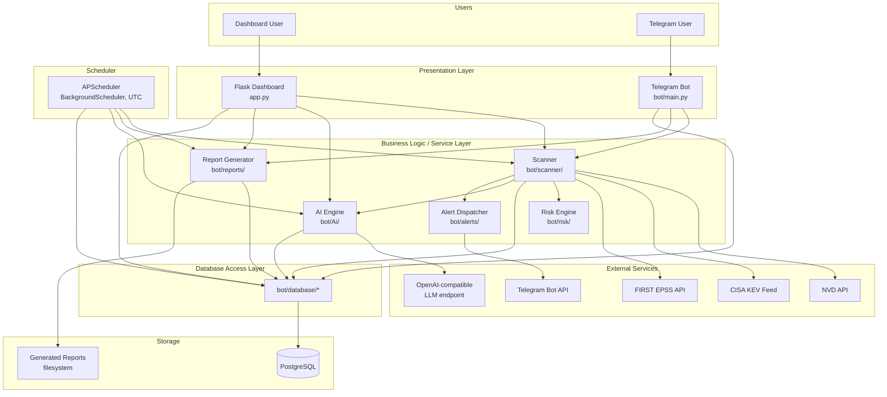
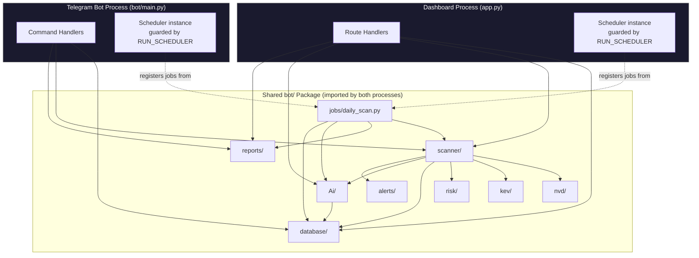
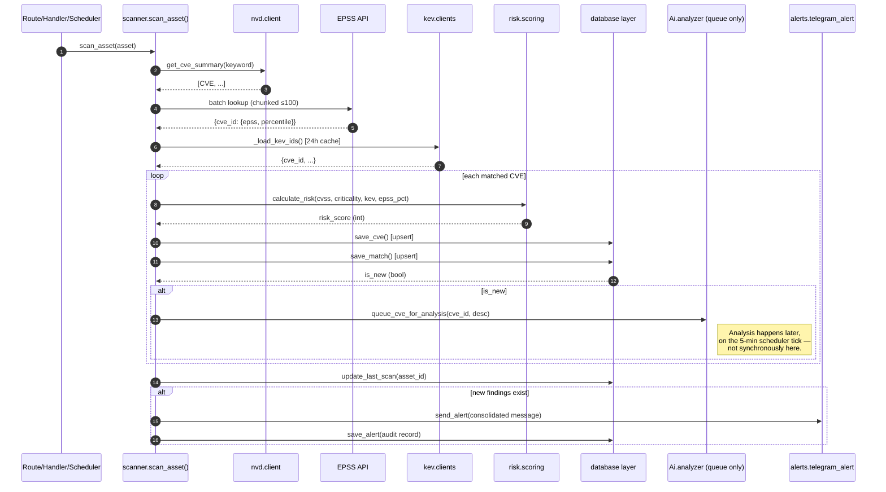
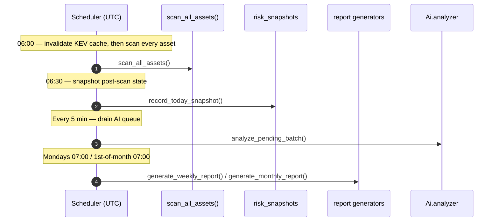
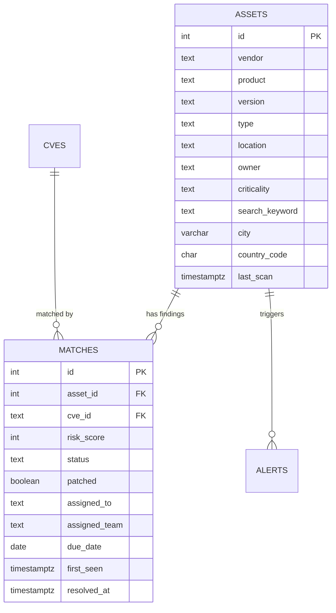
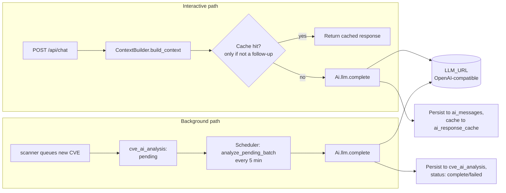
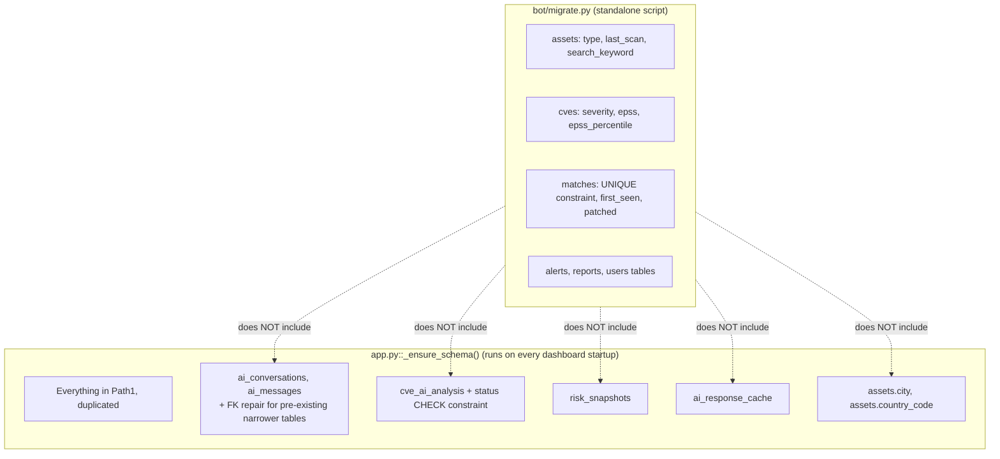
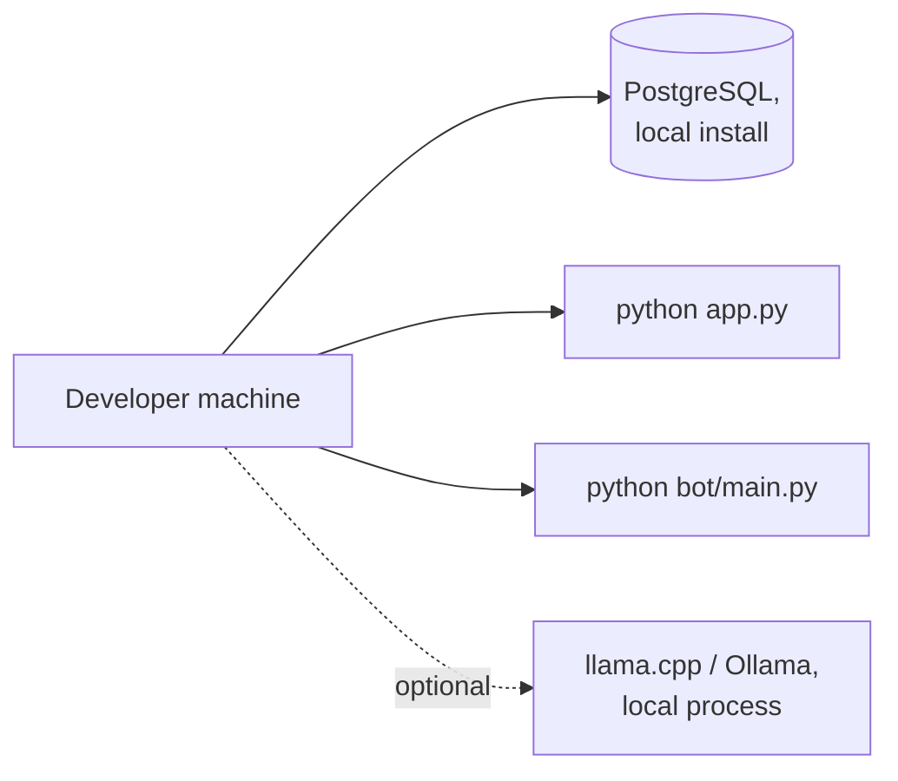
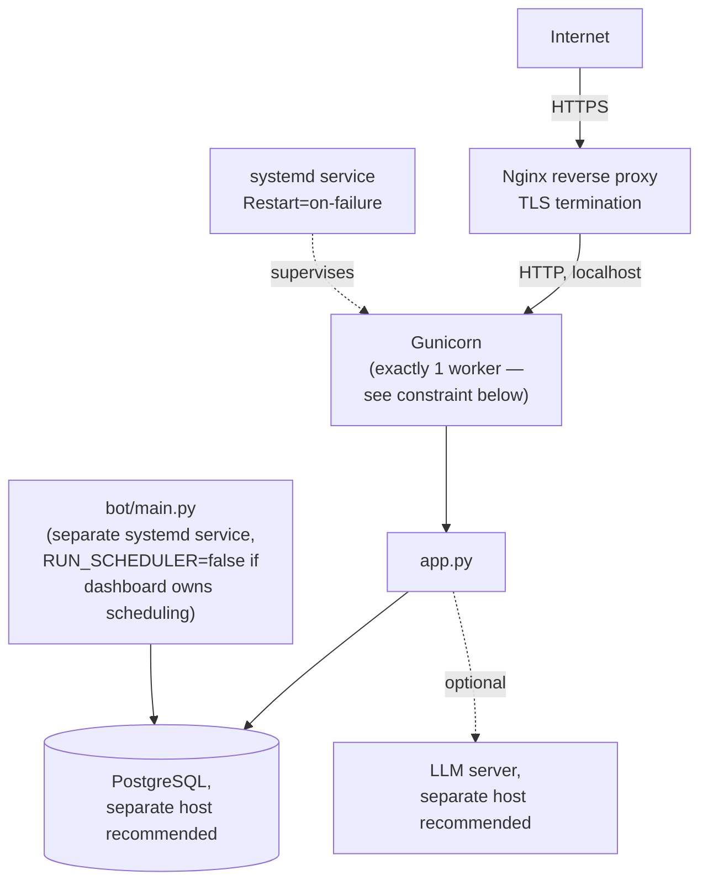

<div align="center">

# ARGUS System Architecture

</div>

This document is the technical blueprint of ARGUS: why it is designed the way it is, how its subsystems interact, how data flows through the platform, and how the current architecture would need to evolve to support the scale and capabilities described in the roadmap. It is written for architects, maintainers, contributors, security reviewers, and anyone evaluating ARGUS for deployment.

> **Accuracy note.** Every component, data flow, and architectural claim in this document is verified against the actual ARGUS source (`app.py`, `bot/`, `bot/database/schema.sql`, `bot/migrate.py`). Sections describing future capabilities are explicitly marked **Planned** and are architectural recommendations, not descriptions of existing code. This document does not invent capabilities to make the architecture appear more mature than it is — where the current implementation is a single-process, single-database, non-distributed system, that is stated plainly, alongside what would need to change to get to the scale target in §21.

---

## Table of Contents

1. [Introduction](#1-introduction)
2. [Architecture Philosophy](#2-architecture-philosophy)
3. [High-Level System Architecture](#3-high-level-system-architecture)
4. [System Layers](#4-system-layers)
5. [Component Architecture](#5-component-architecture)
6. [Detailed Component Diagrams](#6-detailed-component-diagrams)
7. [Data Flow](#7-data-flow)
8. [Asset Management Architecture](#8-asset-management-architecture)
9. [Vulnerability Management Architecture](#9-vulnerability-management-architecture)
10. [AI Architecture](#10-ai-architecture)
11. [Database Architecture](#11-database-architecture)
12. [Scanner Architecture](#12-scanner-architecture)
13. [Risk Engine Architecture](#13-risk-engine-architecture)
14. [Reporting Architecture](#14-reporting-architecture)
15. [Alert Architecture](#15-alert-architecture)
16. [Scheduler Architecture](#16-scheduler-architecture)
17. [Dashboard Architecture](#17-dashboard-architecture)
18. [Telegram Bot Architecture](#18-telegram-bot-architecture)
19. [Security Architecture](#19-security-architecture)
20. [Performance Architecture](#20-performance-architecture)
21. [Scalability Strategy](#21-scalability-strategy)
22. [Reliability Architecture](#22-reliability-architecture)
23. [Deployment Architecture](#23-deployment-architecture)
24. [Module Dependencies](#24-module-dependencies)
25. [Configuration Architecture](#25-configuration-architecture)
26. [Logging & Observability](#26-logging--observability)
27. [Extension Architecture](#27-extension-architecture)
28. [Future Architecture Roadmap](#28-future-architecture-roadmap)
29. [Architectural Decisions (ADR)](#29-architectural-decisions-adr)
30. [Security Threat Model](#30-security-threat-model)
31. [Cross References](#31-cross-references)

---

## 1. Introduction

### Purpose

ARGUS exists to close a specific gap: a defined asset inventory, correlated continuously and automatically against public vulnerability intelligence (NVD, CISA KEV, FIRST EPSS), scored by a consistent formula, and made queryable in natural language. It is not a vulnerability scanner in the network-probing sense — it does not port-scan or fingerprint live hosts. It is a **correlation and prioritization platform**: given a self-maintained inventory of vendor/product/version records, it tells you what's vulnerable, how urgently, and — via the AI layer — lets you ask about that data conversationally instead of writing SQL or cross-referencing spreadsheets.

### System objectives

1. Maintain an accurate, ownership-attributed asset inventory.
2. Correlate that inventory against NVD continuously, enriched with KEV exploitation status and EPSS exploitation-probability.
3. Produce a single, deterministic, explainable risk score per finding.
4. Expose that data through two independent front ends (web dashboard, Telegram) backed by one shared data and logic layer.
5. Let an operator ask natural-language questions about the data, with answers grounded in what's actually in the database — not the model's general training knowledge of a given CVE.
6. Do all of the above as a **single-operator-deployable** system — one PostgreSQL instance, one or two Python processes, no external infrastructure dependency beyond an optional local LLM server.

### Design philosophy

ARGUS is built around three core commitments, evident throughout the codebase rather than stated once and abandoned:

- **Self-healing schema over manual migration ceremony.** Both entry-point processes (`app.py`, `bot/main.py`) apply their own idempotent schema repair on every startup (`_ensure_schema()` / `migrate.py`), so the database converges to the expected shape regardless of which version of the schema it started from. This trades a small amount of startup latency for the elimination of an entire class of "forgot to migrate" production incidents.
- **Explicit failure over insecure defaults.** `SECRET_KEY`, `ADMIN_PASSWORD`, and `VIEWER_PASSWORD` have no fallback values — the application refuses to start rather than run with a guessable default. This is a deliberate fail-closed posture applied inconsistently elsewhere in the codebase (see §29 for where this principle is and isn't fully carried through).
- **Grounded AI over confident hallucination.** The AI layer's context is assembled from live, parameterized SQL against the operator's actual data, and the system prompt explicitly instructs the model to say "Information not available in ARGUS" rather than answer from its own training knowledge of a CVE. This is the single most consequential architectural decision in the AI layer — see §10 and §29.

### Target users

Individual security analysts, small SOC/CERT teams, and self-hosted/homelab operators managing a bounded, known asset inventory (see `README.md` §1 for the full audience description). The current architecture — single PostgreSQL instance, no horizontal scaling, no multi-tenancy — is sized for this audience, not for a multi-tenant SaaS or nation-scale asset inventory (§21 discusses what would need to change to get there).

### Enterprise goals and open-source vision

ARGUS's stated ambition (per `README.md`) is to reach the documentation and operational maturity of established open-source security platforms. Architecturally, that means the codebase needs to grow toward: layering discipline that's actually enforced (§4, §24 document real, current violations of the intended layering), a formal extension/plugin contract (§27), and the scalability primitives in §21 — none of which exist today, and none of which this document pretends already exist.

### Why AI is integrated into vulnerability management

Vulnerability data is high-volume and low-narrative — a CVE record, a CVSS vector, and an EPSS float don't tell an analyst *what to actually do*. ARGUS's AI layer exists to translate structured, high-volume data into a natural-language answer to the two questions an analyst actually asks: "what does this mean for me" and "what should I do first." The architectural bet is that grounding the model in the operator's own live data (§10) makes this translation trustworthy enough to act on, without requiring the model to have ever seen the specific CVE during training — a meaningful capability for CVEs published after any given model's training cutoff.

---

## 2. Architecture Philosophy

| Principle | How it's applied in ARGUS | Why |
|---|---|---|
| **Modular architecture** | Distinct top-level packages per concern: `database/`, `scanner/`, `Ai/`, `risk/`, `reports/`, `alerts/`, `jobs/`, `nvd/`, `kev/`, `handlers/` | Each subsystem can be understood, tested, and modified in isolation; a change to report generation cannot accidentally break scanning |
| **Separation of concerns** | The scanner never renders HTML; the dashboard never speaks to NVD directly; the AI engine never writes findings | Prevents the kind of tangled, single-file application where every change risks an unrelated regression |
| **Layered design** | Presentation (routes/handlers) → business logic (scanner/risk/AI) → data access (`database/`) → PostgreSQL | Each layer only calls the layer beneath it — with real, documented exceptions in the current codebase (see §4, §24) |
| **Security by default** | No insecure fallback for `SECRET_KEY`/`ADMIN_PASSWORD`/`VIEWER_PASSWORD`; parameterized SQL throughout; CSRF protection enabled globally | Misconfiguration should fail loudly at startup, not silently produce an insecure running system |
| **Least privilege** | The City Exposure API returns only aggregated counts, never per-asset detail, by explicit design (documented in the route's own docstring) | A concrete, code-level example of minimizing what any given interface exposes, not just a policy statement |
| **AI-assisted decision support, not AI-driven automation** | The AI layer answers questions and produces analysis; it never mutates data, never changes a finding's status, never triggers a scan or a remediation action on its own | Keeps a human in the loop for every state-changing action — the AI is advisory, not autonomous (see §28 for the "Planned: Agentic AI" discussion of what would change this) |
| **Offline-capable AI** | The AI layer talks to a local, self-hosted, OpenAI-compatible endpoint by default (evaluated against `llama.cpp`) rather than requiring a cloud API | Keeps vulnerability/asset data — which is sensitive by nature — from leaving the operator's own infrastructure unless they explicitly point `LLM_URL` at an external service |
| **Database-centric design** | PostgreSQL is the single source of truth and the *only* integration point between the dashboard process and the bot process — they never call each other directly | Simplifies the system model considerably (no inter-process RPC, no service discovery) at the cost of horizontal scalability (§21) |
| **Scalability (aspirational, not yet realized)** | Connection pooling, batched external API calls, indexed hot-path queries | These are real, present optimizations, but they scale a single-instance system further, not to the multi-node, multi-tenant scale described in §21's target — that would require substantial new architecture |
| **Maintainability** | Consistent per-module patterns (a client module has fetch + cache + invalidate; a report generator returns a path or `None`; a scheduler job wraps itself in try/except) | New contributors can extend the system by finding and copying the nearest analogous pattern (§27) rather than inventing a new one each time |

---

## 3. High-Level System Architecture



This diagram reflects the **actual** current call graph, not an idealized target — notably, `DASH --> DBMOD` includes a substantial amount of inline SQL issued directly from `app.py` route handlers rather than exclusively through `bot/database/` module functions (§4, §24 document this precisely). The dashboard and bot processes never communicate with each other directly; PostgreSQL is the only shared state between them.

---

## 4. System Layers

### 4.1 Presentation Layer

**Responsibilities:** Request/response handling, session/auth enforcement, form parsing, template rendering, Telegram message parsing/formatting.
**Components:** `app.py` (all Flask routes), `bot/handlers/*.py` (all Telegram commands).
**Dependencies:** Business logic layer (scanner, AI, reports) and, in practice, the data access layer directly for many routes.
**Communication:** In-process function calls only — no HTTP or RPC hop between this layer and the layers beneath it, since everything runs in the same Python process per entry point.
**Benefits:** Two independent, swappable front ends over one shared backend; a new front end (e.g., a future REST API, per `API.md` §23) would slot in at this layer without touching business logic.

**Documented layering violation:** A materially large fraction of `app.py`'s routes (e.g., `/findings`, `/assets`, `/dashboard`, `/asset/<id>`) issue SQL directly against a pooled connection rather than calling a `bot/database/` module function. This is a real characteristic of the current codebase, not a documentation simplification — see `API.md` §2 and §8 for the specific routes affected. Architecturally, this means the presentation layer and the data-access layer are not cleanly separated everywhere; a hypothetical second presentation layer (e.g., the future REST API) cannot fully reuse "the dashboard's queries" as a matter of calling a shared function — it would need to either duplicate that SQL or the SQL would need to be refactored into `bot/database/` first.

### 4.2 Business Logic Layer

**Responsibilities:** Vulnerability correlation (scanner), risk scoring (risk engine), AI context assembly and completion (AI engine), report generation, alert dispatch.
**Components:** `bot/scanner/scanner.py`, `bot/risk/scoring.py`, `bot/Ai/`, `bot/reports/`, `bot/alerts/telegram_alert.py`.
**Dependencies:** Data access layer, external integration layer.
**Communication:** In-process calls; the scanner is the layer's central orchestrator, calling into the risk engine, the AI engine (queuing, not synchronous analysis), the data access layer, and the alert dispatcher, all within one `scan_asset()` invocation (see the sequence diagram in §7.2).
**Benefits:** Each concern is independently testable and independently reusable across both front ends — `scan_asset()` is called identically whether triggered from the dashboard's `/today` route, a Telegram `/scan` command, or the scheduler.

### 4.3 Service Layer (external integration)

Distinguished from "Business Logic" because these modules' sole job is talking to something outside the process boundary, with no scoring/correlation logic of their own.
**Components:** `bot/nvd/client.py`, `bot/kev/clients.py`, the EPSS client embedded in `scanner.py`, `bot/Ai/llm.py` (the LLM HTTP client, distinct from the AI *engine* logic in `analyzer.py`/`context_builder.py`).
**Dependencies:** None internal — these are the leaves of the dependency graph (§24).
**Communication:** Outbound HTTPS/HTTP only.
**Benefits:** Each external dependency is isolated behind a narrow interface (a function returning normalized data), meaning a future replacement (e.g., swapping the LLM server) touches one file.

### 4.4 AI Layer

Treated as its own layer, distinct from general business logic, because of its distinct data-flow shape (context assembly → external LLM call → structured or free-text response) and its two independent entry points (interactive chat vs. background analysis). See §10 for full detail.
**Components:** `bot/Ai/context_builder.py`, `bot/Ai/analyzer.py`, `bot/Ai/llm.py`.
**Dependencies:** Data access layer (read-heavy — context assembly; write-narrow — only its own four tables), the LLM service layer.
**Communication:** In-process for context assembly and database access; outbound HTTP for the actual completion call.

### 4.5 Database (Data Access) Layer

**Responsibilities:** All SQL, connection pooling, schema self-healing.
**Components:** `bot/database/*.py`, `bot/database/schema.sql`, `bot/migrate.py`, and the schema-repair logic embedded in `app.py::_ensure_schema()`.
**Dependencies:** PostgreSQL only.
**Communication:** `psycopg2` over a pooled TCP connection.
**Benefits, and the honest caveat:** This layer is intended to be the *only* code that issues SQL — in practice (per §4.1), it is the only code that issues SQL for the Telegram bot's handlers and for a subset of dashboard routes, but not for every dashboard route. Treat "the database layer" as an architectural intent partially, not fully, enforced by the current codebase.

### 4.6 Integration Layer

Encompasses both the Service Layer (§4.3, outbound to external APIs) and the inbound integration surface — the Telegram Bot API's webhook/polling mechanism (handled by `python-telegram-bot`, not custom ARGUS code) and, in the future, a REST API (`API.md` §23).

### 4.7 Infrastructure Layer

**Responsibilities:** Process supervision, the PostgreSQL server itself, the optional LLM server, TLS termination, reverse proxying.
**Components:** Not part of the ARGUS codebase — this is deployment infrastructure, covered in `INSTALL.md` and §23 of this document. ARGUS has no built-in process supervisor, no built-in TLS handling, and (currently) no containerization — see §23.

---

## 5. Component Architecture

| Component | Location | Responsibility | Explicit boundary (what it does *not* do) |
|---|---|---|---|
| **Dashboard** | `app.py` | HTTP request handling, session auth, HTML rendering, JSON APIs for dashboard JS | Never calls NVD/KEV/EPSS directly (delegates to `scanner`); never calls the LLM directly (delegates to `Ai/`) |
| **Telegram Bot** | `bot/main.py`, `bot/handlers/` | Command parsing, Telegram message formatting | Same boundaries as the dashboard — it is a second presentation layer over the identical business logic |
| **Scanner** | `bot/scanner/scanner.py` | Orchestrates NVD/KEV/EPSS lookups, risk calculation, persistence, AI queuing, and alerting for a single scan operation | Never decides *when* to scan (that's the scheduler's or a route/handler's job); never itself sends Telegram messages beyond delegating to `alerts/` |
| **AI Engine** | `bot/Ai/` | Context assembly, LLM completion, background CVE analysis | Never mutates findings/assets/risk data; never triggers a scan |
| **Database** | `bot/database/` | Connection pooling, all persistent state | Contains no business logic (risk formulas, AI prompts) — pure data access |
| **Scheduler** | `bot/jobs/daily_scan.py` | Time-based triggering of scanner, risk snapshot, reports, AI batch processing, cache purging | Contains no business logic of its own — every job function is a thin wrapper calling into another layer |
| **Risk Engine** | `bot/risk/scoring.py` | One pure function: inputs (CVSS, criticality, KEV, EPSS) → risk score | No I/O of any kind — the only side-effect-free module in the codebase |
| **Reporting Engine** | `bot/reports/` | Time-windowed data aggregation → PDF rendering → persistence | Never sends the PDF anywhere itself (that's the caller's job — a route, a handler, or a scheduler job) |
| **Alert Engine** | `bot/alerts/telegram_alert.py` | Telegram message/document delivery | Contains no alerting *logic* (thresholds, deduplication) — that lives in the scanner, which decides *whether* to call this module |
| **Threat Intelligence** | `bot/nvd/`, `bot/kev/` | NVD and KEV client logic (EPSS is embedded in `scanner.py`, not a separate module — a real inconsistency, not an idealization) | No caching *decisions* beyond what's built into each client — NVD is always live, KEV is cached 24h, EPSS is per-scan-batched |
| **Configuration** | `.env` / `os.environ`, `bot/config/locations.py` | Environment-variable-based runtime configuration; static city/coordinate reference data | No central config object — see §25 |
| **Authentication** | `app.py` (built-in `USERS` dict + `users` table), Flask-Login | Session-based login for the dashboard only | The Telegram bot has no authentication of its own — anyone who can message the bot is implicitly "authenticated" (see §19) |
| **Authorization** | `@login_required`, `@admin_required` decorators in `app.py` | Two-role RBAC for the dashboard | No authorization model exists for the Telegram bot at all |
| **Logging** | Python `logging` module, per-module loggers | Diagnostic output, `bot/main.py`'s `basicConfig` | No structured/JSON logging, no centralized log aggregation, no file-based logging by default — see §26 |
| **Monitoring** | Telegram `/status` command only | A single, manually-invoked health probe (PostgreSQL `SELECT 1` + a live NVD ping) | No automated health-check endpoint, no metrics export, no alerting-on-ARGUS's-own-health — see §26, §28 |

---

## 6. Detailed Component Diagrams



**Key architectural fact this diagram makes explicit:** `bot/` is not a service — it's a Python package imported by two separate OS processes. There is no IPC between the Dashboard Process and the Bot Process; `Shared_Modules` is shared *code*, not a shared running instance. Each process gets its own copy of, e.g., the connection pool in `database/db.py` — meaning `DB_POOL_MAX_CONN` (default 20) applies **per process**, so running both the dashboard and the bot means up to 40 pooled connections against PostgreSQL by default, not 20 shared.

---

## 7. Data Flow

### 7.1 End-to-end lifecycle (narrative)

1. **Asset created** — via dashboard form or Telegram `/add` → `database/assets.py::add_asset()` → `assets` table row.
2. **Scan triggered** — on-demand (route/handler) or scheduled (§16) → `scanner.scan_asset()` or `scan_all_assets()`.
3. **CVE matching** — `scanner.py` calls `nvd/client.py::get_cve_summary()` with the asset's search keyword.
4. **Enrichment** — EPSS batch lookup and KEV cached-set check, both within `scanner.py`.
5. **Risk Engine** — `risk/scoring.py::calculate_risk()` invoked per matched CVE.
6. **Persistence** — `database/cves.py::save_cve()` (upsert) and `database/matches.py::save_match()` (upsert, returns is-new).
7. **AI Analysis (queued, not synchronous)** — every *new* match calls `Ai/analyzer.py::queue_cve_for_analysis()`; the actual LLM call happens later, on the scheduler's 5-minute `ai_analysis` job, not inline in the scan.
8. **Historical Storage** — the scheduler's separate `risk_snapshot` job (06:30 UTC) aggregates current state into `risk_snapshots`, independent of any individual scan.
9. **Dashboard** — reads current state live from PostgreSQL on every request; no caching layer sits between the dashboard and the database for findings/asset data.
10. **Reports** — generated on demand or by the scheduler, reading a time-windowed query over `matches`/`cves`/`assets` at generation time.
11. **Alerts** — sent synchronously, inline, at the end of `scan_asset()`, only if that scan produced at least one new finding.
12. **Telegram** — the delivery channel for both alerts (step 11) and scheduled report documents (weekly/monthly).

### 7.2 Sequence diagram — full scan-to-alert lifecycle



### 7.3 Sequence diagram — historical/scheduled data flow



---

## 8. Asset Management Architecture

### Asset lifecycle

`Created` (via `add_asset`) → `Scanned` (`last_scan` stamped on every scan, whether or not it finds anything new) → `Edited` (location/owner/criticality/notes/type mutable at any time) → `Deleted` (dashboard path cascades `matches`/`alerts` explicitly in application code; the Telegram `/rm` path relies on the database's own `ON DELETE CASCADE` on `matches.asset_id` — see `schema.sql`, so both paths do end up consistent, but via different mechanisms: application-level cascade on one path, database-level `ON DELETE CASCADE` on the other).

### Ownership, location, criticality

Modeled as plain columns on `assets` (`owner TEXT`, `location TEXT`, `criticality TEXT`, plus `city VARCHAR(120)`/`country_code CHAR(2)` added later for the City Exposure feature) — not a normalized "teams" or "locations" table. `owner` and `location` are free text with no referential integrity to any other table; `criticality` is validated only at the application form layer (not a database `CHECK` constraint), and `city`/`country_code` are validated against `bot/config/locations.py::SUPPORTED_LOCATIONS` at write time (also application-layer, not database-layer).

### Versions and firmware

`assets.version` is a single free-text column. There is no separate firmware-vs-software-version distinction, no version-history table, and no structured version-comparison logic (e.g., semantic version ranges) — the `version` string is passed straight through into the NVD search keyword construction and otherwise treated as an opaque label.

### Relationships



### Historical tracking

There is no asset-level history/audit table — an edit to `owner`/`criticality`/`location` overwrites the previous value with no record of what it was before or when it changed. The only historical dimension tracked at the asset level is `last_scan` (a single timestamp, overwritten on each scan) and, indirectly, `matches.first_seen` per finding (which does preserve *when a given CVE was first matched to this asset*, even though the asset row itself has no change history).

### Future expansion (Planned)

Asset relationship modeling (e.g., parent/child for virtualized or containerized assets), structured firmware version tracking with comparison operators, and asset-level audit history are not present in the current schema and are not on the published `README.md` roadmap either — noted here as an architectural gap rather than a stated future direction.

---

## 9. Vulnerability Management Architecture

### NVD synchronization

Not a "synchronization" in the sense of a periodic full-database pull — ARGUS never downloads or mirrors NVD's CVE corpus. Every lookup is a live, on-demand keyword search against `services.nvd.nist.gov` at scan time (`nvd/client.py::get_cve_summary()`). This is a deliberate architectural choice: it trades away offline/air-gapped CVE lookup capability for zero storage overhead and always-current NVD data, at the cost of making every scan dependent on NVD's availability and rate limits.

### OpenCVE

**Not integrated.** No client, no configuration, no code path — see `API.md` §14.4. Any architecture diagram or document referencing OpenCVE as an active integration is describing an aspiration, not the current system.

### KEV

Synchronized differently from NVD: the full CISA KEV JSON feed is fetched and cached in-memory for 24 hours (`kev/clients.py`), then checked as a local set-membership lookup per CVE — the only genuinely "synchronized" (cached, periodically refreshed) external dataset in the system.

### EPSS

Neither live-per-lookup (like NVD) nor cached-and-refreshed (like KEV) — EPSS is fetched fresh on every scan, but *batched* across up to 100 CVE IDs per HTTP request within that scan, embedded directly in `scanner.py` rather than living in its own client module (an architectural inconsistency worth calling out: NVD and KEV each get a dedicated package; EPSS does not).

### CVE storage, normalization, deduplication

The `cves` table is ARGUS's own normalized representation — one row per CVE ID, storing CVSS (as a single numeric value, not the full CVSS vector string), a derived `severity` label, `kev` boolean, `epss`/`epss_percentile`, `published` date, and `description`. `save_cve()` is an upsert (`ON CONFLICT`), so re-encountering a CVE across multiple assets or multiple scans does not create duplicate rows — deduplication happens naturally at the schema level via `cve_id` as the primary key, not via application-level duplicate-checking logic.

### Matching

"Matching" in ARGUS means: NVD's own keyword search returns whatever CVEs NVD associates with the search string built from the asset's vendor/product (or explicit `search_keyword`). There is no CPE-based structured matching, no version-range evaluation (e.g., "affected versions < 2.3.1") performed by ARGUS itself — matching precision is entirely a function of NVD's keyword search relevance and how well the asset's `search_keyword` is chosen. This is a meaningful architectural limitation: two assets with an identically-worded `search_keyword` but genuinely different (and non-overlapping) affected-version ranges would receive identical CVE match sets from ARGUS.

### Historical updates

If a CVE's NVD record changes after first ingestion (e.g., a CVSS score is revised, or a description is updated), ARGUS only picks that up on a subsequent scan of an asset whose keyword search happens to return that CVE again — `save_cve()`'s upsert then overwrites the stored row. There is no separate "re-sync existing CVEs" job independent of asset scanning.

### Caching strategy summary

| Dataset | Cache behavior |
|---|---|
| NVD | None — always live |
| KEV | 24-hour in-memory cache, explicitly invalidated before the daily scheduled scan |
| EPSS | None across scans; batched (not per-CVE) within a single scan |

---

## 10. AI Architecture

### 10.1 Two independent entry points, one shared completion function



Both paths converge on `Ai/llm.py::complete()`, but — as documented in detail in `API.md` §7.8 — they resolve `LLM_URL` differently: the chat path checks explicitly and fails cleanly if unset; `complete()` itself falls back to a hardcoded development IP literal if `LLM_URL` is unset, which the background path inherits since it never performs its own pre-check. This is a real architectural asymmetry between the two entry points, not a simplification.

### 10.2 Context Builder — the "retrieval" half of the system

`ContextBuilder` is an **intent router over parameterized SQL**, not a retrieval-augmented-generation system in the vector/embedding sense. There is no embedding model anywhere in the codebase, no vector store, no similarity search. The architecture is:

```
question → CVE-ID regex match? ──yes──→ build_cve_context(cve_id)
              │no
              ▼
       determine_intent(question)  [keyword matching, prioritized list]
              │
              ▼
       dispatch to one of 9 build_<intent>_context() methods
              │
              ▼
       each queries a purpose-built view (ai_dashboard, ai_open_findings,
       ai_asset_summary, ai_vulnerability_summary) or a direct table query,
       row-capped at _MAX_FINDINGS
              │
              ▼
       formatted context string, injected into the LLM system/user prompt
```

This is intentionally called "structured retrieval," not "RAG," in this document and in `API.md`/`README.md` — using the term "RAG" without qualification would overstate the architecture relative to what's implemented.

### 10.3 Prompt construction

The system prompt (built in `app.py`'s `/api/chat` handler for chat, and separately in `Ai/analyzer.py` for background analysis) is a static template with the assembled context string interpolated in. There is no prompt-templating engine, no few-shot example injection, no dynamic prompt selection based on question complexity — one fixed system prompt per entry point (chat vs. analysis), each with different instructions tuned to their different output shapes (free-text conversational answer vs. structured JSON fields).

### 10.4 Conversation manager and memory

`database/conversations.py` implements conversation memory as ordinary relational rows (`ai_conversations`, `ai_messages`), ownership-scoped by `username`. "Memory" in the architectural sense is bounded and explicit: `get_recent_history_for_llm()` returns at most the last 20 messages, formatted into the `messages` array sent to the LLM on each request — there is no summarization of older history, no long-term memory distillation, and no cross-conversation memory (each conversation's context is isolated from every other conversation the same user has had).

### 10.5 Local LLM integration

`LLM_URL` points at any server implementing `/v1/chat/completions`. Architecturally, ARGUS treats the LLM as a **stateless, swappable external dependency** behind exactly one narrow interface (`complete(messages, ...) -> str`) — there is no vendor SDK dependency, no model-specific code path. This is deliberate: it means ARGUS is agnostic to whether the operator runs `llama.cpp`, Ollama (via its OpenAI-compatible surface), or a hosted service, at the cost of not being able to use any provider-specific features (function calling, structured output modes, etc.) beyond what the OpenAI-compatible chat completions schema itself supports.

### 10.6 Embedding strategy / semantic retrieval

**Not implemented.** There is no embedding generation, no vector index, and no semantic similarity search anywhere in ARGUS. Any future RAG-in-the-vector-database sense would be new architecture, not an extension of an existing (nonexistent) embedding pipeline — see §28.

### 10.7 Context window management

| Control | Mechanism |
|---|---|
| Conversation history | Hard cap at 20 messages (`get_recent_history_for_llm`) |
| Retrieved data volume | Per-intent row caps (`_MAX_FINDINGS` constant) |
| Output length | `max_tokens` — 512 for chat, 900 for analysis |
| Request duration | 120-second timeout, both paths |

There is no dynamic/adaptive context sizing based on the target model's actual context window — the caps above are fixed constants, not derived from a model's reported context length (which ARGUS has no way to know, since it never queries the LLM server for its capabilities).

### 10.8 Knowledge-cutoff mitigation

The system prompt explicitly instructs the model to treat the *supplied* NVD description/CVSS/KEV/EPSS data as authoritative and to say so plainly if information isn't in that supplied context, rather than fill gaps from its own training data about a CVE — the architectural mechanism here is **prompt-level instruction**, not a technical guarantee (there is no output-verification step that checks whether the model actually complied). This is the primary, and only, knowledge-cutoff mitigation strategy in the system.

### 10.9 Response generation and caching

Chat responses are cached (`ai_response_cache`) keyed on a hash of `(question, live_context)` — meaning the cache is automatically invalidated the moment the underlying data changes, without any explicit cache-invalidation logic being triggered by a scan or a finding update; it happens implicitly because the context string that feeds the hash changes. This is an elegant, low-maintenance caching architecture, worth calling out as a deliberate design choice rather than an accident: no explicit "invalidate cache on data change" hook exists anywhere, because none is needed given how the key is derived.

### 10.10 Future multi-model support (Planned)

Not implemented — `complete()` sends no `model` field and has no concept of routing different questions to different models. A future multi-model architecture would need a model-selection layer above `complete()`, likely keyed by intent (e.g., a smaller/faster model for simple lookups, a larger model for open-ended analysis) — this is a plausible extension point, not existing capability.

### 10.11 Future agentic AI (Planned)

Not implemented — see §2's note on "AI-assisted, not AI-driven." The AI layer today has zero tool-calling/function-calling capability and cannot take any action beyond producing text. An agentic architecture (the AI deciding to trigger a scan, update a finding's status, or query external systems on its own initiative) would require: a tool/function registry, a safety/approval layer given the state-changing nature of those actions, and a fundamentally different trust model than today's read-only-context, text-out design. `README.md` §17 lists this as a roadmap item; this document notes that it is architecturally a large step, not an incremental one, from the current design.

---

## 11. Database Architecture

### 11.1 Schema philosophy

Additive-only, self-healing, and — importantly — **built via two independent, partially-overlapping migration paths** rather than one canonical source of truth:



**This is a verified, material gap, not a simplification:** `bot/migrate.py` does **not** create the AI tables (`ai_conversations`, `ai_messages`, `cve_ai_analysis`, `risk_snapshots`, `ai_response_cache`) or the `assets.city`/`assets.country_code` columns — only `app.py::_ensure_schema()` does. A deployment that only ever runs `python migrate.py` and never starts `app.py` (e.g., running only the Telegram bot in a hypothetical dashboard-less deployment) would be missing every AI table and the City Exposure columns entirely, since `bot/main.py` also does not create them. **This corrects a statement in `INSTALL.md` §6**, which describes `migrate.py` as applying "the same set of idempotent migrations" as `app.py` — that is not accurate for the AI/city schema additions; `INSTALL.md` should be read as applying only to the base schema (assets/cves/matches/alerts/reports/users), and this document is the authoritative statement of that discrepancy. In practice this rarely surfaces as a real-world problem, since a typical deployment does run `app.py` (the dashboard) at least once, which repairs the full schema regardless of whether `migrate.py` was also run — but it is a genuine architectural inconsistency in how the two migration paths were built, evidently at different points in the project's history (the code comments in `app.py` around the `ai_conversations` block explicitly reference "an earlier ad-hoc setup" that pre-dates the current schema shape, confirming this evolved organically rather than being designed as two synchronized migration paths from the start).

### 11.2 Entity-relationship diagram (conceptual, full schema)

```mermaid
erDiagram
    ASSETS ||--o{ MATCHES : "has findings"
    CVES ||--o{ MATCHES : "matched by"
    CVES ||--o| CVE_AI_ANALYSIS : "analyzed as"
    ASSETS ||--o{ ALERTS : "triggers"
    AI_CONVERSATIONS ||--o{ AI_MESSAGES : contains
    USERS ||--o{ AI_CONVERSATIONS : "owns (by username, not FK)"

    ASSETS {
        int id PK
        text vendor
        text product
        text version
        text type
        text criticality
        varchar city
        char country_code
    }
    CVES {
        text cve_id PK
        numeric cvss
        text severity
        boolean kev
        numeric epss
        numeric epss_percentile
    }
    MATCHES {
        int id PK
        int asset_id FK
        text cve_id FK
        int risk_score
        text status
        boolean patched
    }
    CVE_AI_ANALYSIS {
        text cve_id PK_FK
        text summary
        text status
        int retry_count
        text description_hash
    }
    AI_CONVERSATIONS {
        int id PK
        text username
        text title
        boolean archived
    }
    AI_MESSAGES {
        int id PK
        int conversation_id FK
        text role
        text content
        int tokens
    }
    AI_RESPONSE_CACHE {
        text cache_key PK
        text question
        text response
        timestamptz expires_at
    }
    RISK_SNAPSHOTS {
        int id PK
        date snapshot_date UK
        int total_findings
        int open_findings
        numeric avg_risk_score
    }
    USERS {
        int id PK
        text username UK
        text password_hash
        text role
    }
    REPORTS {
        int id PK
        varchar report_type
        text file_path
    }
    ALERTS {
        int id PK
        int asset_id FK
        text message
    }
```

**Notable non-relationship:** `AI_CONVERSATIONS.username` is a plain `TEXT` column, not a foreign key to `USERS.username` — ownership scoping (§7.4 in `API.md`) is enforced entirely at the application query layer (`WHERE username = %s`), not by a database-level constraint. A conversation can reference a username that no longer exists in `users` (e.g., a built-in `admin`/`viewer` account, which has no `users` row at all) without error.

### 11.3 Normalization

The core tables (`assets`, `cves`, `matches`) are in a reasonable 3NF shape for their purpose — `matches` is a proper junction table between `assets` and `cves` with its own attributes (status, risk_score, assignment). The AI views (`ai_dashboard`, `ai_open_findings`, `ai_asset_summary`, `ai_vulnerability_summary`) are deliberately **denormalized read models** — materialized as views (not materialized *tables*, so they're always live, not stale) purpose-built to avoid the AI context builder needing to write ad-hoc joins per query.

### 11.4 Indexes

| Index | Table/columns | Purpose |
|---|---|---|
| `idx_matches_asset_id` | `matches(asset_id)` | Per-asset finding lookups (`/asset/<id>`, `/findings` scan) |
| `idx_matches_cve_id` | `matches(cve_id)` | Per-CVE lookups (`/finding/<cve_id>`) |
| `idx_matches_risk` | `matches(risk_score DESC)` | Risk-sorted findings listings |
| `idx_matches_status` | `matches(status)` | Status filtering |
| `idx_matches_due_date` | `matches(due_date)` | Overdue-findings queries (AI `overdue` intent, SLA tracking) |
| `idx_matches_risk` (`migrate.py` only) | `matches(risk_score DESC)` | Risk-sorted findings listings |
| `idx_assets_type` (`migrate.py` only) | `assets(type)` | Asset-type filtering |
| `idx_assets_city_country` | `assets(country_code, city)` | City Exposure aggregation |
| `idx_ai_conversations_username` (composite) | `ai_conversations(username, updated_at DESC)` | Per-user conversation listing, newest first |
| `idx_ai_messages_conversation` (composite) | `ai_messages(conversation_id, created_at)` | Ordered message retrieval per conversation |
| `idx_cve_ai_analysis_status` | `cve_ai_analysis(status)` | The background analysis queue's `pending`-row lookup |
| `idx_risk_snapshots_date` | `risk_snapshots(snapshot_date DESC)` | Latest-snapshot and trend queries |
| `idx_ai_response_cache_expires` | `ai_response_cache(expires_at)` | The cache-purge job's expired-row scan |

**Verified gap:** there is no index on `cves(cvss)` or `cves(kev)` anywhere in `schema.sql`, `migrate.py`, or `app.py::_ensure_schema()`. Both columns are filtered and sorted on heavily — the live `/cves` search, `/findings`' KEV filter, and the AI context builder's `kev` intent all do so — so at large CVE-table volumes (see §21's stated scale target), a sequential scan is the actual query plan today for any KEV- or CVSS-filtered query against `cves`, since no index supports it. This is a genuine, currently-unaddressed scalability gap in the schema, not a design decision explained anywhere in code — noted here as an architectural finding, not fixed.

### 11.5 Historical tables

`risk_snapshots` is the only purpose-built historical/time-series table — one row per day, recording aggregate counts and scores. There is no historical table for individual finding state transitions (e.g., no "finding status changed from Open to In Progress at time T" audit row) — `matches` itself is mutated in place, with only `resolved_at` preserving one specific state-transition timestamp.

### 11.6 Conversation tables, risk snapshots, reports, analysis, caching

Covered in detail in §11.2's ER diagram and `API.md` §7/§8 — not repeated here.

### 11.7 Performance

Connection pooling (`ThreadedConnectionPool`, §4 in `INSTALL.md`), the view-based denormalization in §11.3, and the indexes in §11.4 are the three concrete performance mechanisms present today. There is no query result caching at the database layer itself (caching exists only at the AI response layer, §10.9) and no read/write splitting.

### 11.8 Scalability (current ceiling and future direction — Planned)

The current architecture is a **single PostgreSQL instance, vertically scaled only.** There is no partitioning (`matches` and `cves` are unpartitioned tables — at the "5 million CVEs / 100 million matches" scale cited in this document's target §21, `matches` would benefit substantially from partitioning by `first_seen` date or by `asset_id` range) and no read replicas (every query — dashboard reads, AI context reads, and scan writes — competes for the same single instance's I/O and connection pool). §21 discusses what changes would be required; none of them exist in the current codebase.

---

## 12. Scanner Architecture

### Scanner lifecycle

`scan_asset()` is a single-pass, stateless-per-invocation function — it holds no state between calls beyond what it reads from and writes to PostgreSQL. Its lifecycle within one call: resolve keyword → NVD lookup → EPSS batch lookup → KEV cached-set check → per-CVE risk calculation and persistence → AI queuing (new matches only) → alert dispatch (if new findings exist) → `last_scan` update. See the full sequence diagram in §7.2.

### Matching engine

As described in §9, "matching" is delegated entirely to NVD's own keyword search relevance — ARGUS performs no independent CPE resolution or version-range evaluation. The matching engine's actual job, architecturally, is orchestration and enrichment (attaching EPSS/KEV/risk data to whatever NVD returns), not vulnerability matching logic in the CPE-dictionary sense that a tool like a true CPE-based scanner would implement.

### Incremental scanning

Not implemented as a distinct mode — see `API.md` §9. Every scan is a full re-query; "incrementality" is an emergent property of `save_match()`'s upsert semantics (already-known pairs aren't duplicated) and `is_stale()` in the AI layer (unchanged CVEs aren't re-analyzed), not a designed incremental-scan architecture (e.g., there is no "since last scan" timestamp passed to NVD).

### Background scanning

Two paths converge on the same `scan_asset()`/`scan_all_assets()` functions: on-demand (dashboard `/today`, Telegram `/scan`/`/today`) and scheduled (the 06:00 UTC daily job). Both run in the same process that triggered them — on-demand dashboard scans run inside a dedicated single-worker thread pool to keep the async scanner functions off Flask's synchronous request-handling path (§17), while scheduled scans run directly inside APScheduler's own background thread.

### Performance

`scan_all_assets()`'s concurrency is structurally `asyncio.gather` (looks concurrent) but is bounded by `asyncio.Semaphore(_NVD_CONCURRENCY)` with `_NVD_CONCURRENCY = 1` hardcoded — meaning, in practice, assets are scanned **serially**, one NVD lookup in flight at a time, regardless of how many assets exist. This is a deliberate, conservative default given unauthenticated NVD's roughly 5-requests-per-30-seconds limit, but it is also the single largest architectural bottleneck for scan throughput at scale (§21) — scanning 500 assets serially, even at a generous ~2 seconds per NVD round trip, is roughly 17 minutes of wall-clock time for one full inventory scan, during which the scanning process is otherwise idle waiting on network I/O it could have parallelized had `_NVD_CONCURRENCY` been raised (which the code's own comment acknowledges should happen once `NVD_API_KEY` is configured, but does not do automatically).

### Scheduling

Covered fully in §16. The scanner itself has no scheduling logic — it is purely reactive to whatever calls it.

### Future distributed scanning (Planned)

Not implemented. A distributed scanner (per `README.md` §17's "Distributed or horizontally scaled scanning") would require, at minimum: a work-queue (assets to scan) that multiple scanner worker processes could pull from without double-processing the same asset, a shared rate-limit budget coordinated across workers (today's `_NVD_CONCURRENCY` is per-process, and would double-count against NVD's limit if two scanner processes ran simultaneously without coordination), and a mechanism for aggregating per-asset scan results back into the consolidated alert-per-asset behavior described in §7.2. None of this exists today; the current architecture assumes exactly one scanning process is ever running against a given NVD API key/IP at a time.

---

## 13. Risk Engine Architecture

### Risk calculation

A single pure function (`risk/scoring.py::calculate_risk()`) — no I/O, no database access, no external calls. This is architecturally significant: it means risk scoring can be reasoned about, tested, and modified in complete isolation from every other subsystem, and it is the one place in the codebase with zero side effects.

### Weighting (as implemented)

```
risk = int(cvss × 10) + int(epss_percentile × 1000) + kev_bonus(50 if KEV) + criticality_bonus(0/10/20/30)
```

See `API.md` §10 for the full breakdown, including the verified discrepancy between this formula and the module's own (stale) docstring, which omits the EPSS term.

### CVSS, EPSS, KEV, asset criticality as inputs

Each of the four inputs is a simple linear/flat contribution — there is no interaction term between them (e.g., no "KEV bonus is larger for Critical assets" cross-multiplication) and no normalization of the combined score into a bounded range (e.g., 0–100). The architecture favors simplicity and explainability (an analyst can mentally reconstruct why a score is what it is from the four inputs) over statistical rigor (there is no evidence the specific weights — ×10, ×1000, 50, 0/10/20/30 — were derived from any calibration exercise; they read as reasonable, hand-chosen constants).

### Business context

"Business context" enters the formula only via `criticality`, a single asset-level enum (Low/Medium/High/Critical) set at asset-creation/edit time. There is no broader business-impact modeling (e.g., data sensitivity, regulatory scope, business-unit ownership weighting) feeding into risk today.

### Historical trends

Handled entirely outside the risk engine itself, in `risk_snapshots` (§11.5) and `database/risk_snapshots.py::get_week_over_week_comparison()` — the risk engine computes a score at a point in time; trend analysis is a separate aggregation over many such point-in-time scores recorded by the scheduler.

### Why risk calculation is modular

Isolating `calculate_risk()` as a single, dependency-free function is what makes §27's "New Risk Algorithm" extension point trivial to describe and implement — a contributor can replace the entire scoring methodology by changing one function's internals, with the single call site (`scanner.py`) requiring no change at all as long as the `(cvss, criticality, kev, epss_percentile) -> int` signature is preserved.

### Future predictive risk (Planned)

Not implemented. `README.md` §17 lists "predictive risk analysis" (forecasting future risk rather than scoring current findings) as a roadmap item. Architecturally, this would be a materially different kind of component than the current risk engine — likely a time-series model trained against `risk_snapshots` history, output as a *forecast* rather than the current engine's *point-in-time deterministic calculation*. It would not replace `calculate_risk()`; it would be a new, additional component consuming its historical output.

---

## 14. Reporting Architecture

### PDF generation

`reports/pdf_generator.py::generate_pdf()` is the single rendering implementation (ReportLab), called by all four period-specific generator wrappers (`daily.py`/`weekly.py`/`monthly.py`/`yearly.py`). Each wrapper's sole job is to assemble the right time-windowed data and hand it to the shared renderer — there is no per-period-type rendering logic duplicated across the four files.

### Historical, executive, technical reports

There is no distinction in the current architecture between an "executive" and a "technical" report format — every generated PDF follows the same structure (cover, summary table, KEV-highlighted findings table). A separate executive-summary-only report format (fewer technical details, higher-level framing) is not implemented; `README.md`'s feature list mentions "executive reports" as a category, but architecturally this maps to the same rendering pipeline as any other period report, not a distinct format.

### Caching

None — every report generation re-queries the database live at generation time. There is no report-template caching or partial-result caching between report generations.

### Background generation

Weekly and monthly reports are generated by scheduler jobs (§16); daily and yearly reports exist as the same generator functions but are only reachable on-demand (dashboard route or Telegram command) — the scheduler never calls `generate_daily_report()` or `generate_yearly_report()` automatically. This is a real, verified asymmetry, not a documentation simplification.

### Storage

Flat files on the local filesystem (`bot/dashboard/generated_reports/`), with metadata rows in `reports` pointing at the file path. There is no object storage integration (S3-compatible or otherwise) — a report generated on one machine is only retrievable from that same machine's filesystem, which has direct implications for any future multi-node deployment (§21): report storage would need to move to shared/object storage before report generation could be safely distributed across nodes.

### Future interactive reports (Planned)

Not implemented — every report is a static PDF. An "interactive report" (e.g., a web-rendered, filterable/drillable report rather than a fixed PDF snapshot) would be a new component, likely reusing the same underlying data-aggregation functions in `reports/*.py` but rendering to HTML/JS instead of ReportLab's PDF canvas.

---

## 15. Alert Architecture

### Alert lifecycle

```
scan produces new finding(s)
        │
        ▼
scanner.py builds one consolidated message
per asset (not per CVE)
        │
        ▼
alerts.telegram_alert.send_alert(message)
        │
        ▼
database.matches.save_alert() — audit record only,
after the send already happened
```

There is no separate "alert state" (unacknowledged/acknowledged/snoozed) distinct from the underlying finding's own `status` column — an "alert" in ARGUS's architecture is a one-time notification event, not a persistent, actionable object with its own lifecycle.

### Deduplication

Emergent, not designed: because `save_match()`'s upsert means an already-known (asset, CVE) pair never registers as "new" on a subsequent scan, it is structurally excluded from a subsequent alert. There is no explicit deduplication *window* (e.g., "don't re-alert on the same CVE within 24 hours even if somehow re-flagged as new") — the architecture doesn't need one, given how "new" is defined at the persistence layer.

### Priority / escalation

Not implemented as a distinct concept — every new-findings alert is sent with the same priority and through the same single channel, regardless of the severity or risk score of the findings it contains (though the message text itself does flag KEV-listed CVEs inline with `⚠️ ACTIVE EXPLOIT`). There is no escalation path (e.g., "re-notify a different channel if unacknowledged after N hours").

### Telegram (implemented) / Dashboard (partially implemented)

Telegram is a full delivery channel (`send_alert`, `send_document`). The dashboard has the underlying data (`alerts` table is populated) but, as noted in `API.md` §12.5, no current route surfaces it as a distinct alerts feed — "dashboard alerts" today means "findings are visible on `/findings` and the dashboard home page," not a dedicated notification center reading from the `alerts` table.

### Future channels (Planned)

Email, Slack, Microsoft Teams, and SIEM integration are all unimplemented. Architecturally, `alerts/telegram_alert.py`'s narrow `send_alert(message: str) -> bool` / `send_document(path, caption) -> bool` interface is the template a new channel would follow (§27) — but there is currently no **alert-provider abstraction/registry** that would let a single `scan_asset()` call fan out to multiple channels without additional code; today's call site imports `telegram_alert` directly and calls it as the only channel.

---

## 16. Scheduler Architecture

### APScheduler as the sole scheduling mechanism

`bot/jobs/daily_scan.py` constructs one `BackgroundScheduler(timezone="UTC")` instance, populated with seven jobs (§13 in `API.md` has the full table: `daily_scan`, `risk_snapshot`, `weekly_report`, `monthly_report`, `ai_analysis`, `ai_watchdog`, `chat_cache_purge`). There is no external job queue (Celery, RQ, etc.) and no persistent job store — APScheduler's in-memory job store is used, meaning **scheduled job state does not survive a process restart** beyond what's re-registered at the next startup (a missed job during downtime is simply skipped, not queued to run on recovery, since APScheduler's default `misfire_grace_time` behavior and this codebase's configuration were not observed to include any explicit catch-up/backfill logic).

### Job registration

Both `app.py` and `bot/main.py` independently call the same `setup_scheduler()` (or equivalent registration logic) on their own startup, each producing their own `BackgroundScheduler` instance within their own process. `RUN_SCHEDULER` is the only mechanism preventing both from running the full job set simultaneously — there is no leader-election or distributed-lock mechanism; it is a manual, operator-set environment variable (§18 in `INSTALL.md`).

### Job execution and retry strategy

Every job function follows an identical pattern: `try: <do work> except Exception as exc: logger.error(..., exc_info=True)`. There is **no automatic retry** of a failed scheduled job — a failure is logged and the job simply waits for its next scheduled invocation (5 minutes later for the AI jobs, 24 hours later for the daily scan, etc.). This is a materially different reliability posture than the AI analysis pipeline's own internal retry logic (`analyze_one()`'s per-CVE retry via `retry_count`, §22) — the *scheduler's* handling of a failed job run is "log and wait for next tick," not "retry the same run."

### Failure recovery

The `ai_watchdog` job is the one instance of the scheduler architecture explicitly designing for failure recovery — it exists specifically to un-stick `cve_ai_analysis` rows left in `processing` after a crash mid-analysis. No equivalent watchdog exists for a scan that crashes mid-asset-loop (though `scan_all_assets()`'s per-asset error isolation, §12, limits the blast radius of such a crash to the one asset being processed when it occurred) or for a report generation that crashes mid-render (a failed report generation leaves no partial `reports` row, since `save_report()` is only called after successful PDF generation — so failure here is at least clean, if unrecovered).

### Future queue systems / distributed workers (Planned)

Not implemented. Moving from APScheduler's single-process, in-memory model to a distributed task queue (Celery+Redis/RabbitMQ, or similar) would be required before scheduled jobs could run reliably across multiple ARGUS instances (§21) — today, running two dashboard processes with `RUN_SCHEDULER=true` on both would double-execute every scheduled job, since there is no coordination primitive preventing it.

---

## 17. Dashboard Architecture

### Flask as a monolith, not blueprints

All routes live in one `app.py` file — there is no Flask blueprint modularization (`Blueprint()` objects registering route groups). This is a genuine architectural characteristic worth naming explicitly: at the current route count (dozens of routes across auth, assets, findings, charts, AI chat, reports), the single-file structure is still navigable, but it is the first thing that would need to change if the dashboard's route count grew substantially — see §27's "New Dashboard Module" guidance, which currently just says "add another `@app.route` to `app.py`" for lack of a better-modularized alternative.

### Routes, templates, static assets

Routes render Jinja2 templates from `bot/dashboard/templates/` or return JSON for the dashboard's own client-side JavaScript (chart data, AI chat, conversation management). Static assets (CSS/JS, and the dynamically-regenerated chart PNGs) live under `bot/dashboard/static/`. There is no frontend build pipeline (no bundler, no npm-based asset pipeline) — templates and static JS are served as authored, directly by Flask.

### Authentication / authorization

Flask-Login session cookies; two-role RBAC via `@login_required`/`@admin_required` (§19; full detail in `API.md` §3–§4).

### Pagination

Implemented for `/findings` (explicit `page`/`per_page`, validated against a fixed set of allowed page sizes) but **not** for `/assets`, which returns its full filtered result set in one response (`API.md` §21) — a real, verified inconsistency in the dashboard's own pagination architecture, not uniform across all list views.

### Charts

Two parallel charting architectures coexist: (1) `/charts`, which synchronously regenerates four matplotlib PNGs server-side on every request and serves them as static images, and (2) `/api/chart/*`, a set of JSON endpoints presumably consumed by client-side JS charting (though the actual charting library used by the front end was not independently re-verified in this document beyond confirming the JSON endpoints' existence and shape in `API.md` §5.8). These two systems are not unified — a request to `/charts` does not use the `/api/chart/*` endpoints internally; they are two independently-implemented visualization pipelines answering overlapping questions.

### Search

A single free-text `/search` route that attempts an asset-name substring match first, falling back to a live NVD keyword search redirect if no asset matches — not a unified search index across assets, findings, and CVEs simultaneously.

### Caching

None at the HTTP/route level (no `Cache-Control` strategy beyond Flask/Werkzeug defaults, no server-side page caching) — the only caching in the entire dashboard is the AI chat response cache (§10.9), which is specific to that one feature.

### Future WebSockets (Planned)

Not implemented — every dashboard interaction is a standard request/response HTTP cycle; there is no real-time push (e.g., a live-updating findings count as a scan runs, or live chat token streaming). `README.md` §17 lists "real-time dashboard updates" as a roadmap item; achieving it would require introducing a WebSocket layer (e.g., Flask-SocketIO) alongside the existing synchronous route architecture, and would be a genuinely new capability, not a configuration change to the existing dashboard.

---

## 18. Telegram Bot Architecture

### Command router

`python-telegram-bot`'s own `Application`/`CommandHandler` registration mechanism (in `bot/main.py`) maps each `/command` to its handler function in `bot/handlers/`. There is no custom command-routing layer built on top of the library — ARGUS uses the library's registration model directly.

### Permissions

**None.** This is the most significant architectural difference between the two presentation layers: the dashboard has a two-role RBAC model; the Telegram bot has zero authorization checks on any command. Anyone who can message the bot (or who is a member of a group the bot is in, depending on Telegram privacy settings) can add, edit, or delete assets and trigger scans — see §19 and §30 for the security implications.

### Conversation flow

Each command is stateless and self-contained — there is no multi-turn Telegram conversation state machine (e.g., no "the bot asks a follow-up question and remembers where you left off" flow). Every command's full argument set must be provided in a single message; commands that need multiple pieces of information (like `/add`) parse them all from one message via `shlex.split`, rather than prompting interactively across several messages.

### AI integration

**None.** The Telegram bot has no equivalent of the dashboard's `/api/chat` — there is no `/ai` or `/chat` command, and no code path connects any Telegram handler to `Ai/context_builder.py` or `Ai/llm.py`. The AI Security Copilot is dashboard-exclusive in the current architecture.

### Background operations

`/scan` and `/today` both call directly into the same `async` scanner functions used by the dashboard, but since `python-telegram-bot`'s handler functions are themselves `async`, there's no need for the dashboard's thread-pool-bridging workaround (§17) — the bot's event loop can `await` the scanner coroutines natively.

### Notifications

Outbound-only, from the bot's perspective — alerts and scheduled report documents are pushed to `CHAT_ID` via the same `alerts/telegram_alert.py` module used by the scanner; there's no separate "bot-initiated notification" architecture distinct from what's documented in §15.

### Future plugin commands (Planned)

Not implemented — see §27's "New Telegram Command" extension guidance, which today means "add a new file to `bot/handlers/` and register it in `bot/main.py`," not a dynamically-loadable plugin architecture. A true plugin system would require a command registry that could load handler modules without modifying `bot/main.py` directly — not present today.

---

## 19. Security Architecture

### Authentication, RBAC, session management, password hashing, CSRF, secure cookies

Fully detailed in `API.md` §3–§4 and §20; summarized architecturally here rather than repeated verbatim. The dashboard's trust model is: session-cookie authentication, two roles (`admin`/`viewer`), CSRF-protected forms, hashed passwords, secure-by-default cookies. **The Telegram bot has none of this** — it is, architecturally, a second, unauthenticated administrative interface into the same data the dashboard protects with RBAC, distinguished only by "can this person message the bot" rather than any credential check.

### Environment variables / secrets management

A single flat layer — `.env` merged into `os.environ`, read ad hoc throughout the codebase (`API.md` §18). There is no secrets-manager integration, no encryption-at-rest for `.env` itself beyond OS file permissions, and no runtime secret rotation mechanism.

### Database security

Parameterized queries throughout (no observed string-interpolated SQL); the "dynamic" parts of a few routes' `ORDER BY` clauses are built from a fixed, whitelisted dictionary of column names, never from raw user input concatenated into SQL text (`API.md` §20).

### Input validation

Present at the application layer for known enumerations (asset type, finding status, city/country) but not exhaustively applied to every free-text field (`API.md` §20) — there is no schema-validation library (e.g., Marshmallow, Pydantic) used anywhere in the request-handling path; validation is hand-written, per-field, per-route.

### Prompt injection protection

Prompt-level instruction only (the system prompt tells the model not to reveal itself and to stay grounded in supplied data) — there is no technical filtering of user input before it reaches the LLM, and no output-side filtering beyond stripping two specific literal prefix strings. This is a real, acknowledged architectural gap, not a claimed mitigation (`API.md` §20).

### Audit logging

No dedicated audit-log table. The `alerts` table is the closest analog, and it only covers sent Telegram alerts — logins, asset edits, finding status changes, and report generations are not separately audit-logged anywhere in the schema or application code.

### Trust boundary diagram

```mermaid
flowchart TB
    subgraph Untrusted["Untrusted / External"]
        BrowserUser[Dashboard User\n(browser)]
        TGUser[Telegram User\n(any account that can message the bot)]
        NVD_ext[NVD API]
        KEV_ext[CISA KEV Feed]
        EPSS_ext[FIRST EPSS API]
        LLM_ext[LLM_URL endpoint]
    end

    subgraph TB1["Trust Boundary 1: Session Auth (dashboard only)"]
        direction TB
        FlaskLogin[Flask-Login session check]
        RBAC[admin/viewer RBAC]
    end

    subgraph TB2["Trust Boundary 2: NONE (Telegram bot)"]
        direction TB
        NoAuth["No authentication or authorization —\nany message is treated as authorized"]
    end

    subgraph Trusted["Trusted (application process)"]
        AppLogic[Route handlers / command handlers]
        BizLogic[Scanner, Risk Engine, AI Engine, Reports, Alerts]
        DBLayer[database/ layer]
    end

    subgraph DataStore["Trusted data store"]
        PG[(PostgreSQL)]
    end

    BrowserUser -->|HTTPS + session cookie| FlaskLogin
    FlaskLogin --> RBAC
    RBAC --> AppLogic

    TGUser -->|Telegram Bot API| NoAuth
    NoAuth --> AppLogic

    AppLogic --> BizLogic
    BizLogic --> DBLayer
    DBLayer --> PG

    BizLogic -->|outbound only| NVD_ext
    BizLogic -->|outbound only| KEV_ext
    BizLogic -->|outbound only| EPSS_ext
    BizLogic -->|outbound, includes live ARGUS\ndata in the prompt| LLM_ext

    classDef untrusted fill:#3a1a1a,stroke:#a33,color:#fff;
    classDef notrust fill:#3a1a1a,stroke:#f55,color:#fff,stroke-width:3px;
    class Untrusted untrusted;
    class TB2 notrust;
```

**The single most important architectural fact this diagram conveys:** Trust Boundary 2 (Telegram) has no gate at all — any message received is treated as fully authorized to mutate assets, trigger scans, and read all findings. This is not a bug in one command; it is the entire Telegram bot's trust model. If `TOKEN`/bot access is not itself tightly controlled (private chat only, not a public or large group), this is architecturally equivalent to an unauthenticated admin API sitting alongside the dashboard's authenticated one.

**Another notable boundary crossing:** the LLM endpoint (`LLM_URL`) receives live ARGUS data (assembled context — findings, asset details, CVE descriptions) as part of every chat/analysis prompt. If `LLM_URL` points at a third-party/cloud service rather than a local server, this is a genuine data-egress boundary crossing that the architecture does not gate, filter, or warn about at the point of configuration — it is the operator's responsibility to understand what leaves the trust boundary depending on where they point `LLM_URL` (see `API.md` §25 FAQ on this exact point).

### Future SSO / MFA (Planned)

Not implemented — see §3.7 in `API.md`. Both would extend Trust Boundary 1 (dashboard) only; neither addresses Trust Boundary 2 (Telegram)'s complete absence of authentication, which would require an entirely separate design (e.g., an allowlist of Telegram user IDs, checked in a decorator wrapping every handler) — not merely "add SSO to the existing auth system," since the Telegram bot doesn't participate in that system at all today.

---

## 20. Performance Architecture

### Caching strategy

Exactly one cache exists in the whole system: the AI chat response cache (§10.9), keyed on `(question, live_context)` hash with a TTL, purged every 30 minutes by the scheduler. Every other subsystem — dashboard reads, chart generation, report generation — queries PostgreSQL live on every request.

### Lazy loading

Not applicable in the ORM sense (no ORM is used); the closest analog is that most routes' SQL explicitly selects only needed columns rather than `SELECT *` (a few detail-view routes are exceptions, per `API.md` §21).

### Pagination

Implemented for `/findings`; not implemented for `/assets` (§17, §21 in `API.md`) — an inconsistency, not a uniform strategy.

### Connection pooling

`ThreadedConnectionPool` per process (`DB_POOL_MIN_CONN`/`MAX_CONN`, defaults 2/20) — note from §6 that this is **per-process**, so a combined dashboard+bot deployment effectively doubles the real connection budget against PostgreSQL relative to what a single `DB_POOL_MAX_CONN` value would suggest in isolation.

### Background jobs

APScheduler removes scan/report/AI-analysis work from any request/response cycle for *scheduled* invocations — but on-demand dashboard actions (`/today`, `/generate_report/<type>`) are still synchronous from the calling browser's perspective (blocking on a single-worker thread pool internally), a real architectural limitation for large inventories (§21, §12).

### Streaming

Not implemented anywhere — the AI chat returns one complete JSON response, not a token-streamed one; report downloads use Flask/Werkzeug's built-in `send_file` streaming (a framework capability, not something ARGUS implements).

### AI context optimization

Row caps (`_MAX_FINDINGS`) and conversation-history caps (20 messages) are the two explicit, code-level token-budget controls (§10.7).

### Database optimization

The AI-facing views (§11.3) and the index set (§11.4) are the two concrete database-level optimizations present.

### Report optimization

None beyond the inherent efficiency of a single aggregation query per report — there is no incremental/delta report generation (each report re-aggregates its full time window from scratch every time).

### Memory optimization

EPSS batching (≤100 CVEs/request) and KEV's 24-hour cache are the two clearest deliberate memory/request-count tradeoffs in the system (§9).

### Future Redis / vector database (Planned)

Not implemented. A Redis layer (or similar) would be the natural next step for the AI response cache (moving it out of PostgreSQL into a purpose-built cache store) and for session storage if the dashboard were ever load-balanced across multiple processes (Flask's default session mechanism is cookie-based and stateless server-side, so this is less urgent than it would be for a server-side-session architecture, but a shared cache would still benefit AI response caching at scale). A vector database would only become relevant if the AI architecture moves from structured SQL retrieval (§10.2) to genuine embedding-based RAG — a substantial, not incremental, architectural change.

---

## 21. Scalability Strategy

### Stated target scale (from this document's brief)

5 million CVEs, 500,000 assets, 100 million vulnerability matches, thousands of concurrent users, millions of AI conversations.

### Honest assessment against the current architecture

The current architecture — single PostgreSQL instance, single dashboard process (Gunicorn constrained to exactly one worker per `INSTALL.md` §23, due to import-time scheduler/schema side effects), `_NVD_CONCURRENCY = 1` serial scanning, no partitioning, no caching beyond AI chat responses — is **not** sized for this target today, and reaching it would require substantial new architecture, not configuration tuning. This section describes what would need to change, explicitly as a gap-analysis, not a description of existing capability.

| Target dimension | Current ceiling | What would need to change |
|---|---|---|
| **Horizontal scaling (dashboard)** | Exactly one Gunicorn worker (§23 in `INSTALL.md`) due to schema-migration and scheduler side effects at import time | Refactor to an application-factory pattern separating import-time side effects from request handling; move scheduler ownership to a single dedicated process, not every web worker |
| **Vertical scaling** | Works today, bounded by a single PostgreSQL instance's hardware | Sufficient for the current small-to-medium target audience (`README.md` §1); insufficient alone for the stated 5M-CVE/100M-match target |
| **Database scaling** | Single instance, no partitioning, no read replicas (§11.8) | Table partitioning on `matches` (by date or asset range) and `cves` at minimum; read replicas to separate AI-context/dashboard read load from scan-write load |
| **Background workers** | APScheduler, in-memory, single-process, no distributed coordination (§16) | A real distributed task queue (Celery/RQ + Redis or similar) with per-job idempotency guarantees, so multiple worker processes could safely share the scan/report/AI-analysis workload |
| **Microservices readiness** | Monolithic `bot/` package imported by two processes; internal module boundaries are reasonably clean (§5) but not yet separated by network boundary | The existing module boundaries (scanner, AI, reports, risk) are a plausible starting decomposition *if* microservices were pursued — but see the ADR in §29 on why this hasn't been done, and shouldn't be, without clear justification |
| **Distributed AI** | Single `LLM_URL`, no load balancing across multiple LLM servers, no per-model routing | A load-balancing/routing layer in front of multiple LLM server instances, plus (per §10.10) a model-selection layer if different models serve different intents |
| **Distributed scanner** | `_NVD_CONCURRENCY = 1`, single process (§12) | A coordinated rate-limit budget across scanner workers (shared token bucket, e.g., in Redis) so parallel scanner processes don't collectively exceed NVD's rate limit |
| **Kubernetes** | No containerization exists at all (`README.md` §22, marked Planned) | A `Dockerfile`/Helm chart is a prerequisite before Kubernetes deployment is even a valid conversation — this is two roadmap steps away, not one |
| **Message queue** | None — every internal "hand-off" (scan→AI-queue, for example) is a database row-state change (`cve_ai_analysis.status`), not a message broker | A real message queue (RabbitMQ/Kafka) would decouple producers/consumers more robustly at scale than polling a `status='pending'` column every 5 minutes, which is the current mechanism and does not scale gracefully to millions of queued analyses (5-minute polling interval × unbounded backlog growth if analysis throughput can't keep pace with discovery rate) |

### The realistic near-term scaling story

For the audience ARGUS is actually built for today (`README.md` §1 — individual analysts, small SOC/CERT teams), the current architecture's ceiling is likely adequate for low-tens-of-thousands of assets and low-millions of matches on reasonably-provisioned PostgreSQL hardware, *provided* the `cves(kev)`/`cves(cvss)` indexing gap (§11.4) is addressed and `_NVD_CONCURRENCY` is raised once an `NVD_API_KEY` is configured. The stated 5M/500K/100M target in this document's brief represents a multi-generational architectural evolution from the current single-instance design, not a tuning exercise.

---

## 22. Reliability Architecture

### Error handling

Consistent per-subsystem patterns are documented in full in `API.md` §16 — summarized here architecturally: the scanner isolates failure per-asset (`_safe_scan`), the AI pipeline never raises past its own state-machine boundaries (`mark_failed()` instead), and scheduler jobs never propagate a failure to crash the scheduler itself. There is, however, **no unified error-handling philosophy across the whole system** — dashboard routes return a mix of JSON error bodies, plain-text error bodies, and Flask's default HTML error pages depending on which route you hit (`API.md` §16.1–§17), which is a real inconsistency an enterprise reliability review would flag.

### Retry policies

| Component | Retry behavior |
|---|---|
| NVD client | Retry/backoff on transient/rate-limit errors within a single call |
| EPSS client | Up to 3 attempts per chunk, exponential backoff + jitter |
| KEV client | Backoff on transient fetch failures |
| AI analysis pipeline | `retry_count` tracked per CVE; failed rows re-enter the pending queue (bounded retry — the exact cap is enforced by `get_pending_cves()`'s retry-eligibility query, not a fixed global constant reviewed in full here) |
| Scheduler jobs | **None** — a failed job run is logged and simply waits for its next scheduled tick; no same-run retry |
| Dashboard requests | **None** — a failed request returns an error response; there's no automatic retry of, e.g., a failed AI chat completion within the same request |

### Recovery

The `ai_watchdog` job (§16) is the one purpose-built recovery mechanism in the system, specifically for AI analysis rows stuck in `processing`. No equivalent watchdog exists for any other subsystem's "stuck" state — there is, for instance, no mechanism to detect or recover a scan that never completed due to a process crash mid-loop (the affected asset would simply retain its old `last_scan` timestamp and be re-scanned at the next scheduled or on-demand trigger, which is a form of implicit recovery, but not a designed one).

### Health checks

Exactly one: the Telegram `/status` command, which is a manually-invoked check of PostgreSQL connectivity and NVD reachability. **There is no automated health-check endpoint** (no `/health` or `/healthz` HTTP route), no liveness/readiness distinction, and no health check that covers the LLM endpoint's reachability — a deployment behind a load balancer or orchestrator expecting a standard health-check URL would need to build one, since ARGUS doesn't expose one today.

### Graceful shutdown

Not explicitly implemented — there is no observed `SIGTERM` handler that, e.g., waits for an in-flight scan to complete or drains the APScheduler job queue before exiting. A process killed mid-scan or mid-AI-analysis would leave whatever state existed at that instant (partial `matches` inserts already committed per-CVE within the loop are safe, since each is its own transaction commit — but the scan as a whole would simply stop, not roll back or resume).

### Fault isolation

Real and specific, not general: `_safe_scan()`'s per-asset isolation (§12), the AI pipeline's per-CVE state machine (§10), and every scheduler job's independent try/except block (§16) are concrete, verified fault-isolation boundaries. What's **not** isolated: a PostgreSQL outage affects every subsystem simultaneously (there's no subsystem that degrades gracefully without the database — even the AI chat's "not configured" fast-path for a missing `LLM_URL` still needs the database to persist the conversation's messages).

### Monitoring, logging

Covered in full in §26 — summarized here: no metrics export, no tracing, no centralized log aggregation, stdout/stderr logging only.

### Backups

Not automated by ARGUS itself — `pg_dump`/`pg_restore` procedures are documented operationally in `INSTALL.md` §17, but there is no in-application backup scheduling, verification, or retention policy.

### Disaster recovery

No documented or implemented DR architecture (no standby database, no automated failover, no cross-region replication) — a PostgreSQL data-loss event is recoverable only to the most recent externally-scheduled `pg_dump`, and there is no ARGUS-native mechanism ensuring such backups exist or are tested.

### Future high availability (Planned)

Not implemented. A genuinely HA ARGUS deployment would need, at minimum: PostgreSQL streaming replication with automated failover (e.g., Patroni or a managed equivalent), the dashboard running behind a load balancer across multiple stateless application instances (requiring the single-Gunicorn-worker constraint in §21 to be resolved first), and a distributed scheduler coordination mechanism (§16) so scheduled jobs execute exactly once across however many application instances are running. None of these exist in the current codebase or deployment guidance.

---

## 23. Deployment Architecture

### Local installation



Single machine, direct process execution (`python app.py`), as documented fully in `INSTALL.md` §4–§13. No process supervisor, no reverse proxy — Flask's built-in server, bound to `0.0.0.0:5000`.

### Enterprise / production deployment (as documented in `INSTALL.md`, not a separate implementation)



**The single-Gunicorn-worker constraint is a real architectural limitation, not a configuration preference:** `app.py` performs schema migration and starts the scheduler at module import time (§16), and Gunicorn's default worker model re-imports the application module once per worker process. Running more than one worker would re-run schema migration redundantly (harmless, since it's idempotent) but would also start the scheduler once per worker — meaning every scheduled job (daily scan, weekly/monthly reports, AI analysis batches) would fire once per worker, not once total. This is documented operationally in `INSTALL.md` §23; architecturally, it is the direct, unavoidable consequence of §4's "layering violation" where import-time side effects are not separated from request-handling code — resolving it would require refactoring to an application-factory pattern (deferring scheduler startup to an explicit, single-invocation call rather than module-level code).

### Database, AI server placement

Both are documented as candidates for separate hosts at "medium organization"/"enterprise" scale (`README.md` §1 hardware guidance, `INSTALL.md` §1) — but there is no architectural coupling requiring co-location; `DB_HOST`/`LLM_URL` are both just network addresses, so remote placement is already supported by the existing configuration surface, not a future capability.

### Future Docker (Planned)

**Not implemented** — the `docker/` directory in the repository is an empty placeholder (`README.md` §17, `INSTALL.md` §22). The intended future shape (a `postgres` service, an `argus-dashboard` service behind Gunicorn, an optional `argus-bot` service, an optional local-LLM service, all via Compose) is described in `INSTALL.md` §22 as a design target, not existing tooling.

### Future Kubernetes (Planned)

Not implemented, and — per §21 — a full generation of architectural work (containerization, the single-worker constraint resolution, distributed scheduling) away from being a reasonable target. A Kubernetes deployment of the current codebase as-is would inherit every single-instance limitation described in §21 without gaining anything from the orchestration layer beyond restart-on-crash behavior, which systemd already provides today (`INSTALL.md` §23).

### Future cloud deployment (Planned)

No cloud-provider-specific deployment guidance, Terraform/CloudFormation templates, or managed-service integration (e.g., RDS for PostgreSQL, a managed Redis) exists in the current codebase or documentation set. The architecture is cloud-agnostic by omission (it's just a Python application and a PostgreSQL database, deployable anywhere either runs) rather than by deliberate cloud-portability design.

---

## 24. Module Dependencies

```mermaid
flowchart TD
    subgraph Entry["Entry points"]
        AppPy[app.py]
        MainPy[bot/main.py]
    end

    subgraph Presentation2["Presentation"]
        Handlers[bot/handlers/*]
    end

    subgraph Business["Business logic"]
        Scanner[bot/scanner/scanner.py]
        Risk[bot/risk/scoring.py]
        AiCtx[bot/Ai/context_builder.py]
        AiAnalyzer[bot/Ai/analyzer.py]
        AiLlm[bot/Ai/llm.py]
        Reports[bot/reports/*]
        Alerts[bot/alerts/telegram_alert.py]
        Jobs[bot/jobs/daily_scan.py]
    end

    subgraph ServiceLayer["Service (external) layer"]
        Nvd[bot/nvd/client.py]
        Kev[bot/kev/clients.py]
    end

    subgraph DataAccess["Data access"]
        DbCore[bot/database/db.py]
        DbAssets[bot/database/assets.py]
        DbCves[bot/database/cves.py]
        DbMatches[bot/database/matches.py]
        DbConv[bot/database/conversations.py]
        DbCache[bot/database/chat_cache.py]
        DbAnalysis[bot/database/cve_analysis.py]
        DbSnap[bot/database/risk_snapshots.py]
        DbReports[bot/database/reports.py]
    end

    subgraph ConfigMod["Config / reference data"]
        Locations[bot/config/locations.py]
    end

    AppPy --> Scanner
    AppPy --> AiCtx
    AppPy --> AiAnalyzer
    AppPy --> Reports
    AppPy --> Jobs
    AppPy --> DbCore
    AppPy --> DbAssets
    AppPy --> DbMatches
    AppPy --> DbConv
    AppPy --> DbCache
    AppPy --> DbAnalysis
    AppPy --> DbReports
    AppPy --> Locations
    AppPy -.inline SQL, bypassing\nDbAssets/DbMatches.-> DbCore

    MainPy --> Handlers
    MainPy --> Jobs
    Handlers --> Scanner
    Handlers --> DbAssets
    Handlers --> DbMatches
    Handlers --> DbReports
    Handlers --> Nvd

    Jobs --> Scanner
    Jobs --> Reports
    Jobs --> AiAnalyzer
    Jobs --> DbSnap
    Jobs --> DbCache
    Jobs --> Kev

    Scanner --> Nvd
    Scanner --> Kev
    Scanner --> Risk
    Scanner --> DbCves
    Scanner --> DbMatches
    Scanner --> DbAssets
    Scanner --> AiAnalyzer
    Scanner --> Alerts

    AiCtx --> DbConv
    AiCtx --> DbAnalysis
    AiCtx --> DbSnap
    AiAnalyzer --> AiLlm
    AiAnalyzer --> DbAnalysis
    AiAnalyzer --> DbCves

    Reports --> DbReports

    DbAssets --> DbCore
    DbCves --> DbCore
    DbMatches --> DbCore
    DbConv --> DbCore
    DbCache --> DbCore
    DbAnalysis --> DbCore
    DbSnap --> DbCore
    DbReports --> DbCore
```



### No circular dependencies (verified by inspection of import direction)

Every arrow in the diagram above points strictly toward `bot/database/db.py` or an external service client — there is no cycle where, e.g., `bot/database/matches.py` imports from `bot/scanner/scanner.py`. The one relationship worth flagging explicitly is **`Scanner → AiAnalyzer`**: the scanner (business logic) calls into the AI engine (also business logic) to queue analysis, which is a same-layer dependency rather than a strict layer-above-calls-layer-below relationship — architecturally acceptable (it's a one-directional call, not a cycle: `AiAnalyzer` never calls back into `Scanner`), but worth naming as the one place two "business logic" components call each other rather than both independently calling only the data-access layer beneath them.

### The one real layering violation

`AppPy -.inline SQL...` in the diagram represents the same fact documented in §4.1 and `API.md` §2/§8: a number of dashboard routes issue SQL directly against `DbCore`'s connection pool rather than going through `DbAssets`/`DbMatches`/etc. This is the one dependency-graph inconsistency worth a contributor's attention when refactoring — see §27 for the recommended direction (new code should go through the `database/` module functions, even though existing code doesn't uniformly do so).

---

## 25. Configuration Architecture

### Current architecture: one flat layer

```mermaid
flowchart LR
    EnvFile[.env file] -->|python-dotenv,\nloaded at process start| OSEnviron[os.environ]
    OSEnviron -->|os.environ.get\() / os.getenv\(), scattered\nacross every module at point of use| Modules[Every module that\nneeds a config value]
```

There is no configuration file format beyond `.env` (no YAML/TOML/JSON config, no per-environment config files), no centralized `Config` object or dataclass aggregating all settings in one place, and no command-line-flag override layer. Every module reads what it needs directly from `os.environ` at the point of use — meaning the full set of configuration variables a running ARGUS instance depends on is not enumerable from any single file; it's the union of every `os.environ.get(...)` call scattered across the codebase (which is precisely why `API.md` §18 exists as a cross-referenced index rather than pointing at one config module).

### Feature flags

Not implemented as a general mechanism. `RUN_SCHEDULER` is the closest thing to a feature flag in the codebase (a boolean environment variable gating a whole subsystem's activation), but there is no feature-flag framework, no per-user or per-tenant flag targeting, and no runtime flag toggling without a process restart (`.env` is read once, at process start, via `python-dotenv` — changing it requires restarting the process to take effect).

### Runtime configuration

None — every configuration value is fixed for the lifetime of the process. There is no admin UI or API for changing configuration at runtime; the only way to change, e.g., `LLM_URL` or `NVD_API_KEY` is to edit `.env` and restart.

### Logging configuration

Not environment-configurable (§26) — a genuine gap relative to a typical enterprise configuration architecture, where log level/format/destination would usually be environment-tunable.

### Future configuration service (Planned)

Not implemented. A centralized configuration service (or even just a single `Config` dataclass validated at startup) would be a substantial and valuable architectural improvement over today's scattered `os.environ.get()` pattern — it would make the full configuration surface enumerable in one place, allow startup-time validation of the entire configuration set (today, a missing `LLM_MODEL_NAME` or malformed `DB_POOL_MAX_CONN` is only discovered when the specific code path that reads it is first exercised, not at startup), and provide a natural extension point for a future feature-flag system.

---

## 26. Logging & Observability

### Logging

Python's standard `logging` module, per-module loggers (`logging.getLogger(__name__)`), with `bot/main.py` calling `logging.basicConfig(level=logging.INFO, format=...)` once at bot startup. `app.py` does not call its own `basicConfig`, meaning its effective logging configuration depends on whatever the process's default root logger configuration is (Flask/Werkzeug's own request logging is separate from ARGUS's application-level `logger.info(...)`/`logger.error(...)` calls). **There is no file-based logging by default** — output goes to stdout/stderr, and the `logs/` directory in the repository is an unused placeholder (`INSTALL.md` §19).

### Metrics

**Not implemented.** No metrics library (`prometheus_client` or equivalent) is imported anywhere in the codebase, and no metrics endpoint exists. There is no counter for scans performed, findings discovered, AI requests made, or any other operational metric beyond what could be manually derived by querying the database directly (e.g., `SELECT COUNT(*) FROM matches` as a proxy for "total findings," which is what the dashboard's own summary counts do — but this is application data, not an observability metric in the Prometheus/Grafana sense).

### Tracing

**Not implemented.** No distributed tracing library (OpenTelemetry or equivalent), no trace-ID propagation across the dashboard→scanner→AI→database call chain. Debugging a slow or failed request today means reading application logs and correlating by timestamp/context manually, not following a trace.

### Audit logs

Covered in §19 — the `alerts` table is the closest analog, and it is narrow in scope (Telegram alert sends only).

### Performance monitoring

**Not implemented.** No request-latency histograms, no slow-query logging configured at the application level (PostgreSQL's own `log_min_duration_statement` could be configured at the database-server level per `INSTALL.md` §21, but ARGUS itself does not instrument or report on this).

### Scheduler monitoring

The only "monitoring" is the log line each job function emits on success/failure (§16, §22). There is no dashboard view or API for scheduler job status, next-run time, or historical run success/failure — verification is either "read the logs" or "check `risk_snapshots` for a new row at the expected time" (`INSTALL.md` §12).

### Database monitoring

None from ARGUS's side — connection pool exhaustion, slow queries, or replication lag (were replicas to exist) would need to be monitored via PostgreSQL's own tooling (`pg_stat_activity`, external monitoring agents), not anything ARGUS exposes.

### AI monitoring

None beyond the `cve_ai_analysis.status`/`retry_count` columns, which are queryable state but not a monitoring/alerting system — there is no automated alert if the AI analysis queue backs up (e.g., pending count growing unboundedly), no latency tracking for LLM completions beyond what's implicitly knowable from request timeouts firing.

### Future Prometheus / Grafana (Planned)

Not implemented. Introducing Prometheus-style metrics would require instrumenting each subsystem with counters/histograms (scan duration, AI completion latency, queue depth, HTTP request metrics) and exposing a `/metrics` endpoint — a nontrivial but well-understood addition; Grafana dashboards would then consume that endpoint. Neither exists today, and neither is referenced anywhere in the current codebase.

---

## 27. Extension Architecture

This section is architectural framing for the concrete, code-level guidance already given in `API.md` §22 (Extension Points) and §25 (Developer Guide) — repeated here at the level of *why* these are the right seams, not re-listing every mechanical step.

| Extension | Architectural seam that makes it possible | Constraint to respect |
|---|---|---|
| **New Scanner (additional CVE source)** | `scanner.py` treats NVD as one CVE-list-producing function call among several enrichment steps (EPSS, KEV) — a second source is architecturally just another function call merged into the same per-CVE loop | Must return ARGUS's normalized CVE shape (`id`, `description`, `cvss`, `severity`); must implement its own timeout/retry, since nothing upstream provides one for it |
| **New Threat Feed** | `kev/clients.py`'s cache-fetch-invalidate pattern is a template, not a hardcoded KEV-specific mechanism | A new feed client is a new module, not a modification to `kev/clients.py` itself — KEV-specific code should not become "KEV-or-X" conditional logic |
| **New AI Model** | `LLM_URL` + the OpenAI-compatible schema is the entire coupling surface between ARGUS and any LLM backend | A genuinely incompatible API (not implementing `/v1/chat/completions`) would require a new `complete()` implementation, not a config change |
| **New Alert Provider** | `alerts/telegram_alert.py`'s narrow async function signature is the template | There is no provider *registry* today — adding a second channel means the scanner's call site needs to call two functions, not one; a registry pattern would be a prerequisite for supporting an arbitrary number of channels without modifying `scanner.py` per new channel |
| **New Dashboard Page** | Any new `@app.route` in `app.py` | No blueprint modularization exists yet — a large number of new pages would strain the single-file structure before any technical limit is hit |
| **New Report Format** | `pdf_generator.py`'s five-argument shape (`report_type, filename, assets, cves, kevs, findings`) is the template for a new renderer | The four period-wrapper files (`daily.py` etc.) would each need a small change to call the new renderer, since they currently call `generate_pdf` directly rather than through a format-selection abstraction |
| **New Telegram Command** | One file per command in `bot/handlers/`, registered in `bot/main.py` | No role/permission model exists to gate a new command differently from any other — every command is equally "unauthenticated" by the current architecture (§18, §19) |
| **New Scheduler Job** | `daily_scan.py`'s try/except-per-job pattern | Must be registered on *both* `app.py`'s and `bot/main.py`'s scheduler setup consistently if it should run regardless of which process is up, or explicitly gated to run on only one, following the `RUN_SCHEDULER` precedent |
| **New Risk Algorithm** | `risk/scoring.py::calculate_risk()`'s pure-function, single-call-site design | Changing it changes scoring for all future scans only — no retroactive recalculation exists (§13) |
| **New Plugin (general)** | No formal plugin system exists — see `README.md` §17, `API.md` §22 | The narrow, single-purpose interfaces already present per subsystem (a function signature per extension point, listed above) are the closest thing to a plugin contract; formalizing them into an actual loadable-plugin system (dynamic discovery, versioned interfaces, a plugin registry) is unstarted work |

---

## 28. Future Architecture Roadmap

Every item below is explicitly **Planned** — none exist in the current codebase. Grouped by the architectural work required, not just feature description, since the point of this section is honest sequencing, not a feature wishlist.

| Planned capability | Architectural prerequisite(s) not yet in place |
|---|---|
| **Agentic AI** | A tool/function-calling layer for the LLM client; a safety/approval gate for any state-changing action the AI might initiate, since today's AI is strictly read/advisory (§10.11, §2) |
| **Multi-agent systems** | Agentic AI (above) first; then a coordination/orchestration layer between agents — no single-agent tool-calling exists yet, so multi-agent is two steps away |
| **Vector database / true RAG** | An embedding generation step (none exists — §10.6) and a vector index/similarity search component; would sit alongside, not replace, today's structured SQL retrieval |
| **REST API** | Token-based authentication (none exists — `API.md` §3.7); a consistent response envelope (today's routes are inconsistent — `API.md` §17); ideally, resolution of the inline-SQL layering gap (§4, §24) so the API can cleanly call `database/` functions rather than duplicating dashboard route logic |
| **GraphQL** | A REST API or equivalent data-access API first, or a from-scratch GraphQL schema over the existing `database/` layer |
| **Plugin marketplace** | A formal plugin/extension system (§27) first — no plugin loading mechanism exists to have a marketplace distribute plugins for |
| **Enterprise SSO** | An identity-provider integration layer (SAML/OIDC library, e.g., `python3-saml` or an OIDC client) — extends Trust Boundary 1 only, per §19; does not address Telegram's lack of authentication |
| **MFA** | Builds on SSO or an independent second-factor step in the existing Flask-Login flow — no MFA library or code path exists today |
| **Distributed scanner** | Coordinated rate-limit budget across workers (§12, §21); a work-queue rather than the current implicit "whoever calls `scan_all_assets()` does all the work serially" model |
| **Distributed AI** | Load-balancing/routing across multiple LLM server instances; multi-model routing (§10.10) if different models serve different intents |
| **Real-time dashboard** | A WebSocket layer (e.g., Flask-SocketIO) alongside the existing synchronous route architecture (§17, §20) |
| **MITRE ATT&CK integration** | A new data source/mapping table (CVE → ATT&CK technique) and either a live lookup client or a periodically-synced local mapping table, following the KEV client's cache pattern as the more scalable template |
| **Compliance frameworks** | A framework-mapping data model (e.g., control ID → finding/asset criteria) layered on top of existing findings data; no such model exists today |
| **Threat intelligence aggregation** | Additional feed clients following the KEV pattern (§27), plus a normalization/deduplication layer if multiple feeds report overlapping intelligence on the same CVE |
| **Asset risk maps (granular, per-asset)** | The City Exposure feature (§8, already implemented) is the aggregated precursor; a granular map would need precise per-asset coordinates (today's `city`/`country_code` are city-level only, by explicit design for privacy — §19) and a decision about whether/how to expose more precise location data given that same privacy rationale |
| **Cloud deployment** | Docker (below) as a prerequisite; then cloud-provider-specific deployment artifacts |
| **Kubernetes** | Docker (below) as a hard prerequisite; then resolution of the single-Gunicorn-worker constraint (§21, §23) before horizontal pod scaling would even be safe |
| **Docker** | No prerequisite beyond the engineering work itself — this is the most immediately actionable item on this list, and `INSTALL.md` §22 already sketches the intended shape |
| **Multi-tenant support** | A tenant-scoping dimension added to essentially every table (`assets`, `matches`, `cves` would need to become tenant-scoped or the CVE catalogue kept tenant-agnostic while everything else is scoped); the two-role RBAC model (§19) would need a tenant-admin concept distinct from today's single global `admin` role |
| **API Gateway** | A REST API (above) to gateway in front of, plus authentication/rate-limiting concerns that don't exist yet at any layer (§19 in `API.md`) |
| **Message queue** | Discussed in §16, §21 — needed for distributed scheduling/AI-analysis-queue scaling, not needed at the current single-instance scale |
| **Microservices (only if justified)** | Per the ADR in §29: the current monolith's module boundaries are clean enough that this is a real, viable future path *if* independent scaling of, e.g., the AI engine versus the scanner becomes a demonstrated bottleneck — not a default recommendation absent that evidence |

---

## 29. Architectural Decisions (ADR)

### ADR-1: Why PostgreSQL

**Decision:** PostgreSQL is the sole datastore; no support for any other RDBMS or NoSQL store.
**Rationale:** `ON CONFLICT` upserts (used extensively — `save_cve`, `save_match`), `TIMESTAMPTZ` for timezone-correct historical data, and view-based read models (§11.3) are all leaned on directly by the schema and query layer. `API.md` §25 FAQ notes this explicitly: switching engines "would require rewriting" the entire database layer, not a configuration change.
**Alternatives considered (inferred from what the schema depends on, not from any recorded discussion):** SQLite would have avoided a separate database server dependency for the smallest deployments, at the cost of the concurrent-write and `ON CONFLICT` semantics the codebase relies on throughout, plus no realistic path to the read-replica scaling story in §21.
**Trade-off accepted:** Requires a running PostgreSQL server even for the smallest single-analyst deployment — there is no embedded/zero-install database option.

### ADR-2: Why Flask

**Decision:** Flask, not Django or FastAPI, for the dashboard.
**Rationale (inferred from the codebase's shape):** Flask's minimalism matches the codebase's own preference for direct, explicit code (inline SQL where convenient, straightforward function-based routes, no ORM) — a Django-style "batteries included" framework would have pushed toward an ORM and away from the direct `psycopg2` usage seen throughout.
**Trade-off accepted:** No built-in admin interface (Django would have provided one for basic CRUD), no async-native request handling (`scan_asset()`/`scan_all_assets()` being `async` functions required the explicit thread-pool-bridging workaround in `app.py`'s `/today` and `/generate_report` routes, §17, §20 — a FastAPI-based dashboard could have awaited these natively).

### ADR-3: Why Telegram (not Slack/Discord/a generic webhook)

**Decision:** Telegram Bot API as the sole non-dashboard interface.
**Rationale (inferred):** Telegram's Bot API is free, requires no organizational approval process (unlike Slack app installation in a corporate workspace), and supports both text commands and document delivery (used for PDF report delivery, §14) in one API.
**Trade-off accepted:** No authentication/authorization model exists for Telegram (§18, §19, §30) — this is the most consequential trade-off in this ADR, and the codebase does not appear to have compensated for it with any Telegram-specific access control (no allowlist of authorized Telegram user IDs was found in `bot/handlers/` or `bot/main.py`).

### ADR-4: Why local AI (not a mandated cloud LLM)

**Decision:** `LLM_URL` defaults to no cloud dependency; AI features are fully optional and, when used, point at a self-hosted OpenAI-compatible endpoint by default.
**Rationale:** Vulnerability and asset data is sensitive by nature (it describes an organization's exposure); requiring a cloud LLM call for every chat message or CVE analysis would mean that data leaves the operator's infrastructure by default. Local-first AI avoids this by default while still permitting a cloud endpoint if the operator explicitly chooses one (`API.md` §25 FAQ).
**Trade-off accepted:** Response quality and latency depend entirely on what the operator can run locally — there is no ARGUS-hosted or ARGUS-recommended managed LLM service; the burden of running adequate AI infrastructure falls entirely on the operator.

### ADR-5: Why "Ollama" is referenced but not actually integrated

**Decision (as observed in the code, likely not a deliberate decision so much as an evolved state):** `Ai/llm.py` implements the OpenAI-compatible chat completions schema generically, evaluated against `llama.cpp`, with no Ollama-specific code path — despite Ollama being named in `README.md`'s original feature-request framing and in this document's own prompt.
**Rationale:** Because Ollama can expose an OpenAI-compatible endpoint itself, a generic client works for both without Ollama-specific code — this is a reasonable architectural outcome even if it wasn't necessarily the originally-stated plan, and it is documented plainly rather than papered over (§10.5, `README.md` §3, `API.md` §7.8).
**Trade-off accepted:** No use of any Ollama-specific feature (e.g., its model-management API for pulling/switching models programmatically) — ARGUS cannot, for instance, tell Ollama to pull a new model on its own; that remains an operator action outside ARGUS entirely.

### ADR-6: Why APScheduler (not Celery/a message queue)

**Decision:** In-process, in-memory `BackgroundScheduler`, not a distributed task queue.
**Rationale:** For a single-instance deployment (the current target audience, §1), APScheduler requires zero additional infrastructure (no Redis/RabbitMQ broker to run and operate) — a meaningful simplicity win for the individual-analyst/small-team audience this system is built for today.
**Trade-off accepted:** No distributed coordination (§16, §21) — running more than one scheduler-owning process requires the manual `RUN_SCHEDULER` flag rather than the system safely coordinating itself, and scheduled job state does not survive a process restart.

### ADR-7: Why a modular `bot/` package rather than one flat script

**Decision:** Distinct sub-packages per concern (`database/`, `scanner/`, `Ai/`, `risk/`, `reports/`, `alerts/`, `jobs/`, `nvd/`, `kev/`, `handlers/`), imported by two separate entry-point processes.
**Rationale:** Enables the "one shared logic layer, two front ends" architecture (§3) that is arguably ARGUS's most successful architectural decision — `scan_asset()`, `calculate_risk()`, and the report generators are genuinely identical whether invoked from the dashboard or Telegram, with zero logic duplication between the two front ends.
**Trade-off accepted:** The modularity is not fully honored by `app.py` itself (§4.1, §24's inline-SQL observation) — the decision to modularize was well-executed in the `bot/` package but incompletely carried through in the dashboard's own route handlers.

### ADR-8: Why RAG-as-structured-SQL-retrieval rather than embedding-based RAG

**Decision:** The AI context builder retrieves via parameterized SQL against purpose-built views, not via embeddings/vector similarity search.
**Rationale:** ARGUS's underlying data (findings, assets, CVEs) is already fully structured relational data — there is no unstructured document corpus (no PDFs, no free-text security bulletins) that would benefit from semantic/embedding-based retrieval. Structured SQL retrieval is a better-fit, lower-complexity architecture for this specific data shape than standing up an embedding pipeline and vector store would have been.
**Trade-off accepted:** This architecture would not generalize well if ARGUS later wanted to ground AI answers in unstructured content (e.g., ingesting free-text security advisories or internal runbooks) — that would be a genuinely new retrieval architecture, not an extension of the current intent-router-over-SQL design (§10.2, §28).

### ADR-9: Why background-queued AI analysis rather than synchronous inline analysis during scans

**Decision:** New CVEs are queued (`cve_ai_analysis.status = 'pending'`) during a scan and analyzed later by a scheduler job, not analyzed inline before the scan returns.
**Rationale:** LLM completion latency (up to the 120-second timeout) is incompatible with keeping a scan — already serial and potentially slow due to `_NVD_CONCURRENCY = 1` (§12) — reasonably fast; decoupling analysis from the scan's own critical path keeps `scan_asset()`'s latency bounded by NVD/EPSS/KEV round trips only.
**Trade-off accepted:** A brand-new CVE's AI analysis is not available immediately after a scan completes — there is a delay of up to 5 minutes (the `ai_analysis` job's interval) before analysis appears on the finding/CVE detail page, which the UI must tolerate gracefully (and does — §7.5.1 in `API.md` notes `/cve/<cve_id>` only surfaces analysis with `status == 'complete'`, showing nothing rather than a stale/wrong state otherwise).

---

## 30. Security Threat Model

This is a high-level threat model, using STRIDE as a loose organizing lens where it clarifies rather than as a rigid checklist — it references recognized frameworks without claiming ARGUS has been formally assessed against them.

### Assets (in the threat-modeling sense — what's worth protecting)

- The asset/finding/risk database itself (reveals an organization's exact vulnerability exposure — a high-value target for an attacker planning an intrusion).
- Credentials (`ADMIN_PASSWORD`, `VIEWER_PASSWORD`, database credentials, the Telegram `TOKEN`).
- The `SECRET_KEY` (session-forgery risk if compromised).
- Generated PDF reports (contain the same sensitive exposure data as the database, at rest on the filesystem).
- Whatever data is sent to `LLM_URL` (if pointed at a third-party service — a distinct data-egress asset).

### Trust boundaries (see the diagram in §19)

1. Dashboard user ↔ Flask-Login session boundary (has a real gate).
2. Telegram user ↔ bot command handlers (has **no** gate — §18, §19).
3. ARGUS ↔ external services (NVD/KEV/EPSS/LLM) — outbound only, but the LLM boundary uniquely carries ARGUS's own sensitive data *outward*.
4. Application process ↔ PostgreSQL (protected by network placement/firewalling per `INSTALL.md` §20, not by anything in the application layer beyond credentialed connection).

### Attack surfaces

| Surface | Exposure |
|---|---|
| Dashboard HTTP routes | Public-facing if deployed without a firewall/VPN in front (per `INSTALL.md` §20's recommendation to restrict this) |
| Telegram bot | Reachable by anyone who can message the bot or is in a group it's added to — **no authentication gate at all** (§18) |
| `/api/chat`, `/api/conversations*` | CSRF-vulnerable under default Flask-WTF behavior due to a missing front-end token (verified — `API.md` §7.2, §20) |
| PostgreSQL | Protected only by network placement and credentials — no application-layer defense if network access is misconfigured |
| `LLM_URL` | Whatever ARGUS sends is only as safe as the destination server; ARGUS performs no content filtering before sending live findings/asset context |
| `.env` file | Plaintext secrets at rest; protected only by OS file permissions (`INSTALL.md` §20) |

### Threat actors (illustrative, not exhaustive)

- An external attacker with network access to the dashboard, attempting credential stuffing against `/login` (no rate limiting exists — `API.md` §19 — so this is unmitigated at the application layer).
- An insider or anyone with Telegram access to the bot, given the complete absence of bot-side authorization (§18) — this actor requires no special privilege beyond "can send the bot a message."
- A malicious or compromised party crafting a prompt-injection payload against `/api/chat`, attempting to manipulate the AI into revealing its system prompt or producing misleading security guidance (mitigated only at the prompt-instruction level, not technically enforced — §19).
- An attacker who gains filesystem access to a deployed instance, targeting `.env` (plaintext secrets) or the generated PDF reports (sensitive exposure data at rest).

### Threat categories (STRIDE, applied loosely)

| Category | Relevant ARGUS-specific consideration |
|---|---|
| **Spoofing** | No MFA; session cookies are the sole proof of identity for the dashboard; Telegram has no identity verification at all beyond "can reach the bot" |
| **Tampering** | Parameterized SQL throughout mitigates SQL injection (§19 verified); the CSRF gap (§19, `API.md` §7.2) is the clearest verified tampering-adjacent risk — a cross-site request could invoke state-changing dashboard actions if an authenticated user's browser is tricked into issuing one, *except* for the specific routes where the missing-token gap actually causes a hard failure rather than a silent bypass (the gap here is availability/functionality-breaking under default config, not a security bypass — see the nuance in `API.md` §7.2) |
| **Repudiation** | No audit log beyond the narrow `alerts` table (§19, §26) — an admin's asset edit or finding-status change cannot be attributed/proven after the fact from within ARGUS itself |
| **Information disclosure** | The City Exposure API's deliberate aggregation-only design (§19) is a positive counter-example; the LLM data-egress point (§19, §30 Assets) is the clearest disclosure risk if `LLM_URL` points externally; conversation ownership-scoping (`API.md` §7.4) correctly prevents cross-user data leakage within the dashboard |
| **Denial of service** | No rate limiting anywhere (`API.md` §19) — a scripted flood of `/login` attempts, `/api/chat` requests (each potentially triggering a slow LLM call), or Telegram commands has no application-layer throttle; `_NVD_CONCURRENCY = 1` (§12) also means a single misbehaving/slow NVD response can stall the entire scan queue |
| **Elevation of privilege** | The `@admin_required` decorator's binary check is the only privilege boundary; the Telegram bot has no privilege levels to elevate *from* — every command already runs at maximum effective privilege for any user who can reach it |

### Mitigations already in place (recap, not repeated in full)

Parameterized SQL, password hashing, CSRF (with the noted gap), secure/HttpOnly cookies, fail-closed startup for missing secrets, ownership-scoped AI conversations, aggregation-only City Exposure data.

### Recommended improvements (this document's own assessment, not a claimed roadmap commitment)

1. Fix or formally accept the CSRF/front-end token gap on JSON POST routes (§19, `API.md` §7.2, §20).
2. Add *some* authorization gate to the Telegram bot (even a simple allowlist of authorized user IDs) before deploying it in any context where the bot might be reachable by untrusted parties.
3. Add basic rate limiting to `/login` at minimum, given the complete absence of any brute-force mitigation today.
4. Add an audit log table covering, at minimum, authentication events and asset/finding mutations — today's `alerts` table does not cover this.
5. Add explicit operator-facing warning/confirmation when `LLM_URL` is configured to point at a non-localhost/non-private address, given the data-egress implications.

---

## 31. Cross References

- [`README.md`](./README.md) — project overview, verified feature list, project status
- [`INSTALL.md`](./INSTALL.md) — installation, configuration, operations, troubleshooting
- [`API.md`](./API.md) — full interface reference: routes, commands, internal APIs, error handling, extension points
- `DATABASE.md` — not yet published; see §11 of this document and `bot/database/schema.sql`/`bot/migrate.py` in the meantime
- `AI.md` — not yet published; see §10 of this document and `API.md` §7 in the meantime
- `SECURITY.md` — not yet published; see §19, §30 of this document and `API.md` §20 in the meantime
- `DEPLOYMENT.md` — not yet published; see §23 of this document and `INSTALL.md` §22–§23 in the meantime
- `ROADMAP.md` — not yet published; see §28 of this document and `README.md` §17 in the meantime
- `DEVELOPMENT.md` — not yet published; see §27 of this document and `API.md` §25 in the meantime
- `CONTRIBUTING.md` — not yet published; see `README.md` §18 in the meantime
