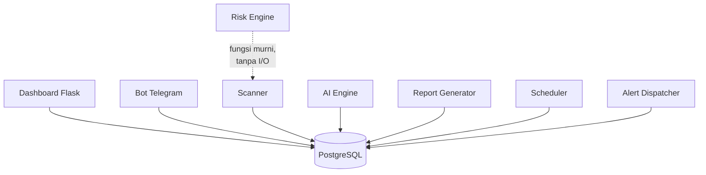
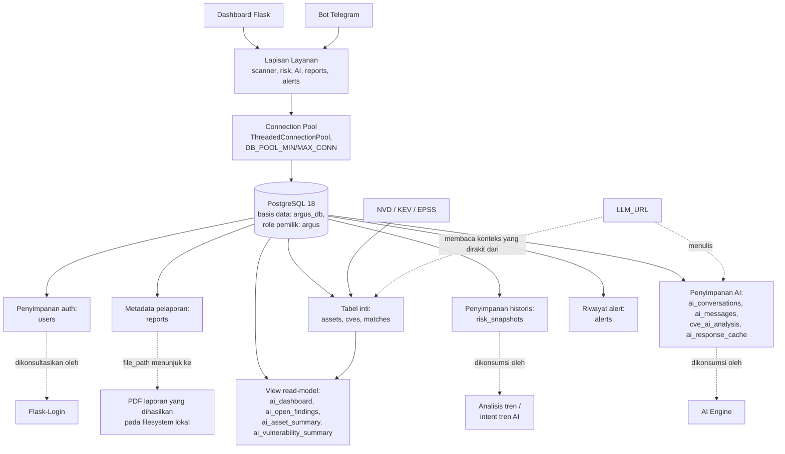
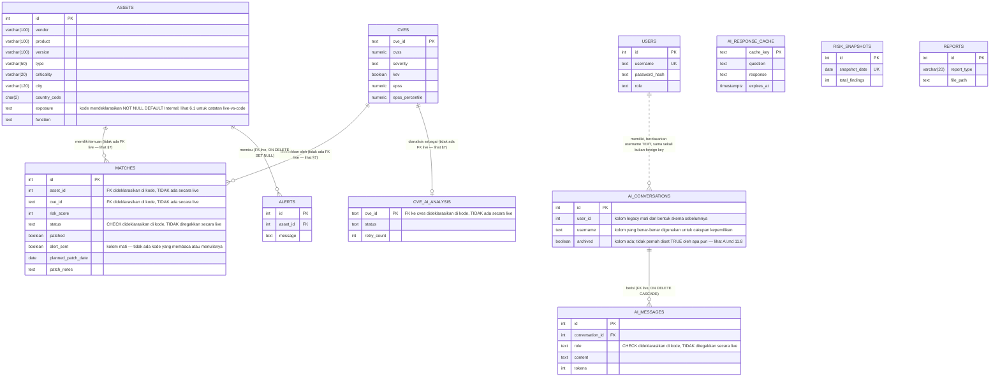
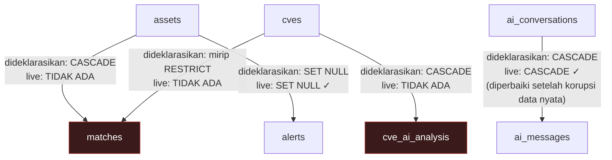
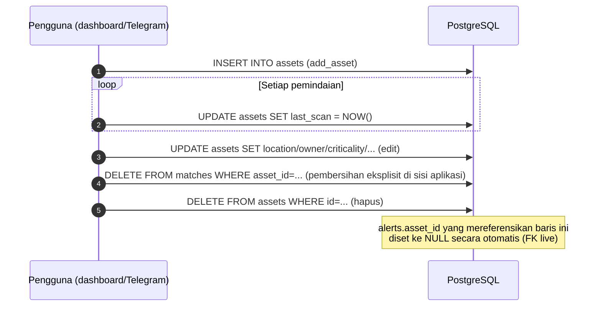
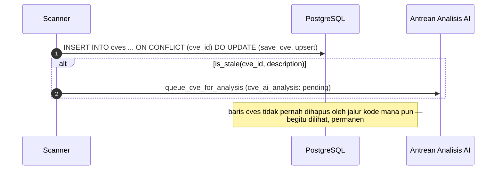
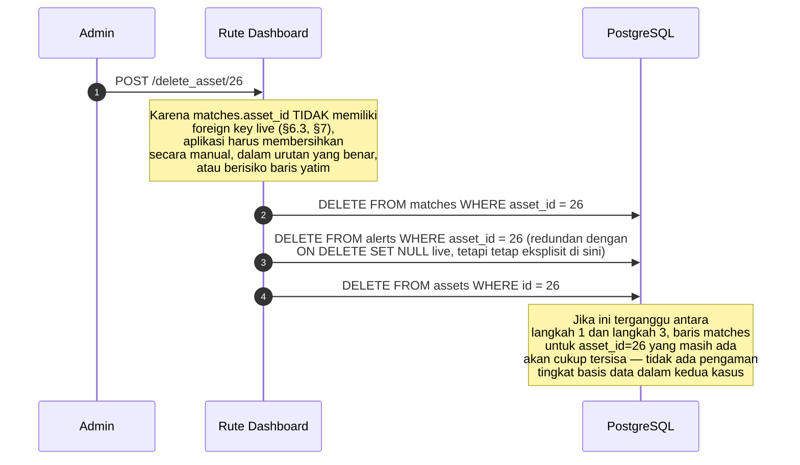

<div align="center">

# Referensi Arsitektur Basis Data ARGUS

🌐 [English](DATABASE.md) | [Indonesia](DATABASE.id.md)

</div>

Dokumen ini adalah referensi arsitektur basis data resmi untuk ARGUS. Dokumen ini menjelaskan desain skema, tujuan dan siklus hidup setiap tabel, relasi, indexing, performa, keamanan, dan strategi migrasi — dan, yang terpenting, di mana **basis data yang benar-benar terdeploy** berbeda dari apa yang dideklarasikan oleh kode definisi skema (`schema.sql`, `bot/database/migrate.py`).

> **Catatan metodologi, dan mengapa dokumen ini secara tidak biasa presisi soal penyimpangan (drift).** Dokumen ini ditulis berdasarkan dua sumber sekaligus: kode definisi skema (`bot/database/schema.sql`, `bot/database/migrate.py`, dan logika `_ensure_schema()` yang setara di `bot/dashboard/app.py`), dan sebuah backup `pg_dump` aktual dari instance ARGUS yang sedang berjalan (`argus_backup.sql`, PostgreSQL 18.4, 25 aset / 5.227 CVE / 668 matches / 330 analisis CVE / 53 alert pada saat dump diambil). Kedua sumber ini **tidak sepenuhnya sepakat**, dan ketidaksepakatan itu sendiri adalah fakta penting dan akurat tentang sistem ini: beberapa tabel (`assets`, `matches`, `ai_conversations`, `ai_messages`, `cve_ai_analysis`) awalnya dibuat oleh versi ARGUS yang lebih awal dan ad-hoc dengan bentuk yang lebih sempit, dan `CREATE TABLE IF NOT EXISTS` milik PostgreSQL adalah no-op yang diam-diam terhadap tabel yang sudah ada — artinya pernyataan `CREATE TABLE` yang ideal di `schema.sql`/`migrate.py` sebenarnya tidak pernah berlaku terhadap basis data yang sudah ada sebelum pernyataan tersebut ditulis. Hanya langkah perbaikan `ALTER TABLE ... ADD COLUMN IF NOT EXISTS` yang eksplisit yang benar-benar berlaku terhadap basis data semacam itu, dan — seperti yang diverifikasi dengan presisi oleh dokumen ini — tidak semua celah memiliki langkah perbaikan semacam itu. Di mana pun dokumen ini menyebut "sebagaimana dideklarasikan dalam kode" vs. "sebagaimana benar-benar terdeploy," ini bukan sekadar berhati-hati — ini adalah kondisi terverifikasi dan terdokumentasi dari dua hal yang benar-benar berbeda.

---

## Daftar Isi

1. [Pendahuluan](#1-pendahuluan)
2. [Filosofi Desain Basis Data](#2-filosofi-desain-basis-data)
3. [Arsitektur Basis Data Tingkat Tinggi](#3-arsitektur-basis-data-tingkat-tinggi)
4. [Ringkasan Relasi Entitas](#4-ringkasan-relasi-entitas)
5. [Ringkasan Skema Basis Data](#5-ringkasan-skema-basis-data)
6. [Dokumentasi Tabel](#6-dokumentasi-tabel)
7. [Desain Relasi](#7-desain-relasi)
8. [Siklus Hidup Data](#8-siklus-hidup-data)
9. [Penyimpanan Kerentanan](#9-penyimpanan-kerentanan)
10. [Penyimpanan Aset](#10-penyimpanan-aset)
11. [Penyimpanan AI](#11-penyimpanan-ai)
12. [Penyimpanan Pelaporan](#12-penyimpanan-pelaporan)
13. [Penyimpanan Risiko](#13-penyimpanan-risiko)
14. [Strategi Data Historis](#14-strategi-data-historis)
15. [Strategi Indexing](#15-strategi-indexing)
16. [Constraint](#16-constraint)
17. [Transaksi](#17-transaksi)
18. [Strategi Performa](#18-strategi-performa)
19. [Efisiensi Memori](#19-efisiensi-memori)
20. [Arsitektur Keamanan](#20-arsitektur-keamanan)
21. [Strategi Backup](#21-strategi-backup)
22. [Strategi Migrasi](#22-strategi-migrasi)
23. [Skalabilitas](#23-skalabilitas)
24. [Retensi Data](#24-retensi-data)
25. [Evolusi Basis Data Masa Depan](#25-evolusi-basis-data-masa-depan)
26. [Monitoring Basis Data](#26-monitoring-basis-data)
27. [Panduan Developer](#27-panduan-developer)
28. [Keputusan Arsitektural (ADR)](#28-keputusan-arsitektural-adr)
29. [Contoh Alur Kerja Basis Data](#29-contoh-alur-kerja-basis-data)
30. [Referensi Silang](#30-referensi-silang)

---

## 1. Pendahuluan

### Tujuan basis data

PostgreSQL adalah satu-satunya lapisan persistensi otoritatif milik ARGUS — setiap bagian state aplikasi (aset, CVE, temuan, riwayat risiko, percakapan AI, metadata laporan yang dihasilkan, akun pengguna) hidup dalam satu basis data PostgreSQL, diakses melalui `bot/database/`, satu-satunya kode di seluruh basis kode yang mengeluarkan SQL secara langsung ke sana (dengan satu pengecualian terdokumentasi — lihat `ARCHITECTURE.md` §4.1, diulang kembali di §6 di bawah: beberapa rute dashboard mengeluarkan SQL inline sendiri alih-alih memanggil fungsi `bot/database/`).

### Mengapa PostgreSQL dipilih

Dibahas lengkap di `ARCHITECTURE.md` §29 ADR-1; diulang di sini untuk audiens spesifik dokumen ini: lapisan skema dan query ARGUS bergantung langsung pada fitur khusus PostgreSQL — upsert `ON CONFLICT` (`save_cve`, `save_match`), `TIMESTAMPTZ` untuk data historis yang benar secara zona waktu, indeks parsial (`idx_cves_kev`), dan view SQL sebagai read model yang didenormalisasi (§6, §11). Tak satu pun dari ini dapat dipetakan secara bersih ke RDBMS lain atau penyimpanan NoSQL tanpa penulisan ulang yang substansial.

### Peran dalam ARGUS



PostgreSQL bukan sekadar "sebuah" komponen ARGUS — ini adalah **satu-satunya** titik integrasi antara proses dashboard dan proses bot Telegram (`ARCHITECTURE.md` §3). Keduanya tidak berbagi state lain, tidak ada IPC, dan tidak ada struktur memori bersama — setiap koordinasi antara kedua front end terjadi melalui pembacaan dan penulisan baris basis data yang sama.

### Manfaat penyimpanan relasional untuk beban kerja ini

Temuan (findings) secara inheren bersifat relasional (satu aset memiliki banyak temuan; satu CVE memengaruhi banyak aset; relasi itu sendiri — skor risiko, status, penugasan — membawa atributnya sendiri), yang persis merupakan hal yang dirancang untuk direpresentasikan secara bersih oleh sebuah junction table many-to-many yang tepat (`matches`). Context builder subsistem AI (`AI.md` §9) bergantung langsung pada struktur relasional ini — melakukan join `matches`/`assets`/`cves` untuk menjawab "apa yang memengaruhi aset kritikal saya" adalah SQL join yang alami, bukan latihan denormalisasi document-store.

---

## 2. Filosofi Desain Basis Data

| Prinsip | Bagaimana diterapkan | Alasan, dan catatan jujurnya |
|---|---|---|
| **Normalisasi** | Entitas inti (`assets`, `cves`, `matches`) berbentuk 3NF yang wajar; `matches` adalah junction table yang tepat dengan atributnya sendiri (skor risiko, status, penugasan) alih-alih tabel datar yang didenormalisasi | Desain relasional standar untuk data yang benar-benar relasional — tetapi seperti didokumentasikan di §6, §16, tabel `matches` yang *live* kehilangan foreign key yang seharusnya menegakkan integritas relasional ini di tingkat basis data, karena penyimpangan tabel ad-hoc-legacy yang dijelaskan dalam pendahuluan dokumen ini |
| **Integritas data** | Constraint ada di mana kode skema mendeklarasikannya (`CHECK` pada `cve_ai_analysis.status`, `UNIQUE` pada `matches(asset_id, cve_id)`, `NOT NULL` pada beberapa kolom) | Terverifikasi ditegakkan sebagian, tidak universal — §16 mendokumentasikan celah spesifik dan nyata (misalnya, `matches.status` tidak memiliki `CHECK` constraint yang live meskipun kode mendeklarasikannya) |
| **Konsistensi** | Basis data tunggal, penulisan transaksional ACID (§17) — tidak ada model eventual-consistency, tidak ada penulisan terdistribusi | Sesuai untuk target deployment single-instance milik ARGUS; perlu dipikirkan ulang di bawah desain multi-node masa depan mana pun (§23) |
| **Auditabilitas** | Timestamp (`created_at`, `first_seen`, `resolved_at`, `analyzed_at`) tersebar luas; `risk_snapshots` menyimpan state agregat historis | Bukan log audit yang komprehensif (§14, celah yang dicatat di `ARCHITECTURE.md` §19) — ini adalah riwayat *operasional* yang disimpan, bukan jejak audit keamanan tentang siapa-melakukan-apa-kapan |
| **Preservasi historis** | `risk_snapshots` (satu baris/hari, §13), riwayat percakapan (`ai_conversations`/`ai_messages`, tidak pernah kedaluwarsa — `AI.md` §11.5), file laporan yang dihasilkan + metadata (§12) | Disengaja — ARGUS tidak pernah menghapus data risiko/percakapan historis secara otomatis; hanya tindakan eksplisit pengguna (menghapus percakapan) atau kebijakan retensi operator sendiri (§24) yang menghapusnya |
| **Performa** | View yang dibuat khusus (`ai_dashboard`, `ai_open_findings`, `ai_asset_summary`, `ai_vulnerability_summary`), set indeks yang terdefinisi (§15), connection pooling (§18) | Nyata dan efektif untuk skala saat ini (jumlah baris di §23); beberapa celah indexing terverifikasi dan didokumentasikan, tidak disembunyikan (§15) |
| **Keamanan** | Query yang diparameterisasi di seluruh basis kode (`ARCHITECTURE.md` §19 mengonfirmasi tidak ditemukan SQL string-interpolated), cakupan tulis AI dengan least-privilege (`AI.md` §16.9) | Basis data itu sendiri memiliki **satu** peran tingkat aplikasi (`argus`, memiliki setiap objek — dikonfirmasi dari pernyataan `ALTER TABLE ... OWNER TO argus` dalam pg_dump) — tidak ada pemisahan tingkat basis data antara, misalnya, peran pelaporan read-only dan peran aplikasi read-write (§20) |
| **Skalabilitas** | Jalur akses (hot path) yang ter-index, panggilan eksternal yang di-batch di hulu basis data, denormalisasi berbasis view | Nyata tetapi terbatas — penilaian yang lebih luas di `ARCHITECTURE.md` §21 (instance tunggal, tanpa partitioning, tanpa read replica) berlaku sepenuhnya pada lapisan basis data secara spesifik (§23) |
| **Maintainability** | Satu modul `bot/database/<table>.py` per concern, mencerminkan batas tabel skema itu sendiri | Agak dilemahkan oleh pola penyimpangan yang terdokumentasi (§22) — skema "ideal" di `schema.sql` dan skema yang "benar-benar terdeploy" telah menyimpang dengan cara-cara yang perlu diketahui secara eksplisit oleh maintainer masa depan, yang justru menjadi tujuan dokumen ini |

---

## 3. Arsitektur Basis Data Tingkat Tinggi



Setiap subsistem aplikasi yang didokumentasikan di `ARCHITECTURE.md` §5 pada akhirnya bermuara pada satu basis data ini. Tidak ada datastore sekunder di mana pun dalam ARGUS — tidak ada server cache, tidak ada message broker, tidak ada object store, tidak ada basis data vektor (`AI.md` §13).

---

## 4. Ringkasan Relasi Entitas



Diagram ER ini secara sengaja memberi anotasi pada setiap relasi dan beberapa kolom dengan **status live yang terverifikasi**-nya, bukan hanya niat yang dideklarasikan kode — lihat §7 dan §16 untuk penjelasan lengkap dan terperinci dari setiap anotasi "tidak ada FK live" dan "tidak ditegakkan secara live" di atas.

---

## 5. Ringkasan Skema Basis Data

### 5.1 Skema tunggal, tanpa namespacing

Setiap tabel dan view berada dalam skema `public` default milik PostgreSQL — tidak ada namespace skema khusus `argus`, tidak ada pemisahan skema per-fitur (misalnya, tidak ada skema `ai` terpisah untuk tabel terkait AI). Seluruh dua belas tabel dan empat view adalah objek datar dan sejajar dalam `public`.

### 5.2 Konvensi penamaan (sebagaimana benar-benar diamati, termasuk di mana konvensi tersebut tidak konsisten)

| Konvensi | Diikuti secara konsisten? | Bukti |
|---|---|---|
| Nama tabel dan kolom `snake_case` | Ya, secara universal | Setiap tabel, setiap kolom |
| Nama tabel tunggal vs. jamak | **Tidak konsisten** | Sebagian besar tabel bersifat jamak (`assets`, `cves`, `matches`, `alerts`, `reports`, `users`), tetapi `cve_ai_analysis` dan `ai_response_cache` adalah nama gabungan yang berorientasi tunggal — tidak ada satu aturan tunggal yang diikuti, hanya penamaan organik per fitur seiring penambahannya |
| Penamaan indeks (`idx_<tabel>_<kolom>`) | Sebagian besar, dengan pengecualian terverifikasi | `idx_matches_asset_id`, `idx_matches_cve_id`, dll. mengikuti pola ini — tetapi basis data live juga memiliki `idx_matches_asset` dan `idx_matches_cve` (nama yang lebih pendek, tidak konsisten) yang berdampingan dengan yang bernama "dengan benar", keduanya meng-index kolom yang persis sama (temuan indeks duplikat di §15) |
| Penamaan foreign key (`<tabel>_<kolom>_fkey`) | Ya, untuk FK yang memang ada | `ai_messages_conversation_id_fkey`, `alerts_asset_id_fkey` — konvensi penamaan FK default PostgreSQL sendiri, bukan konvensi khusus yang diciptakan ARGUS |
| Konvensi timestamp `created_at`/`updated_at` | Ada pada sebagian besar tabel, tetapi dengan tipe yang tidak konsisten | Beberapa adalah `TIMESTAMPTZ`, beberapa adalah `TIMESTAMP WITHOUT TIME ZONE` — §6 mendokumentasikan ini secara presisi per tabel, karena ini adalah inkonsistensi nyata dan terverifikasi, bukan konvensi yang seragam |

### 5.3 Tanggung jawab utama berdasarkan kelompok tabel

| Kelompok | Tabel | Tanggung jawab |
|---|---|---|
| Inventaris inti & temuan | `assets`, `cves`, `matches` | Data korelasi fundamental — apa yang ada, apa yang rentan, apa yang cocok dengan apa |
| Historis/tren | `risk_snapshots` | Snapshot agregat pada titik waktu tertentu untuk analisis tren |
| Subsistem AI | `ai_conversations`, `ai_messages`, `cve_ai_analysis`, `ai_response_cache` | Memori chat, hasil analisis latar belakang, caching respons (`AI.md` §11, §12) |
| Output operasional | `reports`, `alerts` | Metadata untuk PDF yang dihasilkan dan notifikasi Telegram yang terkirim |
| Kontrol akses | `users` | Kredensial akun yang mendaftar sendiri (akun bawaan `admin`/`viewer` **bukan** baris dalam tabel ini — keduanya berada dalam memori, bersumber dari env var `ADMIN_PASSWORD`/`VIEWER_PASSWORD` — dikonfirmasi oleh pg_dump yang menunjukkan **nol** baris pada `users` di instance nyata yang benar-benar digunakan) |
| Read model | `ai_dashboard`, `ai_open_findings`, `ai_asset_summary`, `ai_vulnerability_summary` | Join/agregat yang dihitung di muka (precomputed), dibuat khusus untuk context builder AI (`AI.md` §9) |

---

## 6. Dokumentasi Tabel

Setiap subbagian di bawah ini mendokumentasikan satu tabel, terstruktur secara identik: Tujuan, Kolom (sebagaimana **benar-benar terdeploy**, sesuai pg_dump, dengan perbedaan yang dideklarasikan kode disebutkan secara eksplisit), Kunci/Constraint (live vs. dideklarasikan), Indeks, Siklus Hidup, Frekuensi Pembaruan, Pertumbuhan Teramati (dari backup nyata), Catatan Performa, Pertimbangan Keamanan, dan Ekspansi Masa Depan.

### 6.1 `assets`

**Tujuan.** Inventaris aset — satu baris per perangkat/sistem yang dilacak, entitas akar tempat setiap temuan melekat.

**Kolom (sebagaimana benar-benar terdeploy):**

| Kolom | Tipe live | Nullable/default live | Dideklarasikan kode (schema.sql/migrate.py) | Ketidaksesuaian |
|---|---|---|---|---|
| `id` | `integer` | `NOT NULL` (PK implisit) | `SERIAL PRIMARY KEY` | Tidak ada |
| `vendor` | `character varying(100)` | nullable, tanpa default | `TEXT NOT NULL` | **Kolom live bersifat nullable dan dibatasi panjang; kode mengasumsikan tak terbatas, wajib** |
| `product` | `character varying(100)` | nullable, tanpa default | `TEXT NOT NULL` | Ketidaksesuaian sama seperti `vendor` |
| `version` | `character varying(100)` | nullable, tanpa default | `TEXT NOT NULL` | Ketidaksesuaian sama seperti `vendor` |
| `location` | `character varying(100)` | nullable | `TEXT` | Hanya perbedaan tipe (dibatasi vs. tak terbatas), nullability sesuai |
| `criticality` | `character varying(20)` | nullable | `TEXT` | Hanya perbedaan tipe |
| `created_at` | `timestamp without time zone` | `DEFAULT CURRENT_TIMESTAMP` | Sama sekali tidak dideklarasikan di tabel `assets` milik `schema.sql` (schema.sql tidak mendaftarkan kolom `created_at` untuk `assets`) | Kolom live ada dari tabel ad-hoc yang sudah ada sebelumnya; kode skema saat ini sama sekali tidak mengelolanya |
| `owner` | `character varying(100)` | nullable | `TEXT` | Hanya perbedaan tipe |
| `notes` | `text` | nullable | `TEXT` | Tidak ada |
| `type` | `character varying(50)` | nullable, **tanpa default** | `TEXT NOT NULL DEFAULT 'Unknown'` | **Kolom live tidak memiliki default dan mengizinkan NULL; kode aplikasi (`add_asset`) selalu menyediakan nilai, sehingga ini bersifat laten alih-alih secara aktif menyebabkan data buruk, tetapi sebuah `INSERT` langsung yang melewati aplikasi akan membuat `type` menjadi NULL, bukan `'Unknown'`** |
| `last_scan` | `timestamp with time zone` | nullable | `TIMESTAMPTZ` | Tidak ada — yang satu ini sesuai |
| `search_keyword` | `text` | nullable | `TEXT` | Tidak ada |
| `city` | `character varying(120)` | nullable | `VARCHAR(120)` | Tidak ada |
| `country_code` | `character(2)` | nullable | `CHAR(2)` | Tidak ada |
| `exposure` | *(tidak ada dalam snapshot dump)* | — | `TEXT NOT NULL DEFAULT 'Internal'`, `CHECK (exposure IN ('Internal','External'))` | **Kolom ini, dan yang di bawahnya, ada dalam skrip migrasi basis kode saat ini tetapi belum ada dalam basis data pada saat backup ini diambil — lihat catatan operasional di bawah** |
| `function` | *(tidak ada dalam snapshot dump)* | — | `TEXT` | Sama seperti `exposure` |

**Catatan khusus tentang celah `exposure`/`function`:** tidak seperti ketidaksesuaian lain dalam tabel ini (yang bersifat permanen, penyimpangan struktural dari tabel legacy ad-hoc), ketidakhadiran `exposure`/`function` dari basis data yang di-backup kemungkinan besar mencerminkan bahwa backup khusus ini diambil **sebelum** migrasi terkait (bagian "Asset metadata: exposure & network function" milik `bot/database/migrate.py`) pernah dijalankan terhadap instance ini — bukan celah perbaikan. Menjalankan `python migrate.py` (atau memulai dashboard, yang self-heal melalui `_ensure_schema()`) terhadap basis data ini akan menambahkan kedua kolom untuk selanjutnya. Ini disebutkan secara eksplisit agar tidak tertukar dengan penyimpangan yang *sungguh-sungguh* dan tak-dapat-diperbaiki-tanpa-migrasi-baru yang didokumentasikan di tempat lain dalam tabel ini (misalnya, default yang hilang pada `type`).

**Primary key.** `assets_pkey PRIMARY KEY (id)` — live dan sesuai kode.

**Foreign key.** Tidak ada (memang tidak ada yang perlu — `assets` adalah entitas akar).

**Indeks (live).** `idx_assets_type` (`type`), `idx_assets_city_country` (`country_code, city`). **Belum live dalam snapshot ini:** `idx_assets_exposure`, `idx_assets_function` (dideklarasikan dalam `migrate.py` saat ini tetapi, konsisten dengan kolom `exposure`/`function` itu sendiri, belum diterapkan pada basis data khusus ini).

**Relasi.** Direferensikan oleh `matches.asset_id` (tidak ada FK live — §7) dan `alerts.asset_id` (FK live, `ON DELETE SET NULL`).

**Siklus hidup.** Dibuat via `add_asset()` (dashboard `/add_asset` atau Telegram `/add`) → diperbarui via `update_asset()` saat edit, dan `update_last_scan()` pada setiap pemindaian → dihapus via rute `/delete_asset` dashboard (yang secara eksplisit menghapus baris `matches`/`alerts` yang bergantung terlebih dahulu, dalam kode aplikasi, **karena tidak ada FK live untuk meng-cascade ini secara otomatis** — lihat §7) atau Telegram `/rm` (yang mengandalkan `ON DELETE SET NULL` live milik `alerts.asset_id` untuk relasi itu saja, tetapi tidak memiliki pembersihan setara untuk `matches`, karena tidak ada FK/cascade yang ada di sana juga).

**Frekuensi pembaruan.** `last_scan` diperbarui pada setiap pemindaian (setidaknya harian, sesuai scheduler); semua kolom lain diperbarui hanya saat edit eksplisit oleh pengguna.

**Pertumbuhan teramati.** 25 baris dalam backup referensi — inventaris kecil, organisasi tunggal, konsisten dengan audiens target ARGUS yang dinyatakan (`README.md` §1).

**Catatan performa.** `idx_assets_type` dan `idx_assets_city_country` mendukung pemfilteran daftar aset dashboard (`/assets?type=...`, agregasi city-exposure). Tidak ada indeks pada `vendor`/`product` meskipun `/assets` memiliki pencarian substring implisit pada kolom-kolom ini — dapat diterima pada 25 baris, menjadi perhatian nyata pada skala "ratusan ribu aset" pada target yang dinyatakan di §23.

**Pertimbangan keamanan.** Tidak ada enkripsi tingkat kolom; `notes` adalah teks bebas dan dapat berisi detail operasional sensitif tanpa pembatasan akses selain gating rute `@login_required`/`@admin_required` milik ARGUS sendiri (`API.md` §4) — basis data itu sendiri tidak memberlakukan kontrol akses tingkat baris atau kolom (§20).

**Ekspansi masa depan.** Sesuai `ARCHITECTURE.md` §8: tidak ada tabel riwayat/audit tingkat aset (sebuah edit menimpa nilai sebelumnya tanpa catatan perubahan); tidak ada pemodelan rentang versi firmware yang terstruktur; tidak ada pemodelan relasi aset-ke-aset (misalnya, parent/child untuk aset yang di-virtualisasi).

### 6.2 `cves`

**Tujuan.** Cache ternormalisasi milik ARGUS sendiri untuk catatan CVE, satu baris per ID CVE, di-upsert dari data NVD pada saat pemindaian.

**Kolom (sebagaimana benar-benar terdeploy):**

| Kolom | Tipe live | Nullable/default live | Dideklarasikan kode | Ketidaksesuaian |
|---|---|---|---|---|
| `cve_id` | `text` | `NOT NULL` (PK) | `TEXT PRIMARY KEY` | Tidak ada |
| `cvss` | `numeric` (presisi/skala tak terbatas) | nullable | `NUMERIC(4,1)` | **Kolom live tidak memiliki batas presisi/skala; kode mengasumsikan `NUMERIC(4,1)` yang dibatasi (sesuai rentang 0,0–10,0 milik CVSS dengan satu desimal)** — dalam praktiknya, koersi di sisi Python milik `save_cve()` sendiri berarti hanya nilai berbentuk-CVSS yang benar-benar pernah dimasukkan, sehingga ketidaksesuaian ini bersifat laten, tidak secara aktif menyebabkan data yang cacat |
| `severity` | `text` | nullable | `TEXT` | Tidak ada |
| `kev` | `boolean` | `DEFAULT false` | `BOOLEAN NOT NULL DEFAULT FALSE` | **Kolom live mengizinkan NULL** (tidak ada `NOT NULL`) meskipun ada default — sebuah baris secara teoretis dapat memiliki `kev IS NULL` alih-alih `FALSE`, yang setiap pemeriksaan boolean di sisi aplikasi (`WHERE kev = TRUE`) akan dengan benar memperlakukannya sebagai bukan-KEV, tetapi ini adalah jaminan yang lebih longgar dari yang diimplikasikan oleh deklarasi `NOT NULL` milik kode |
| `published` | `date` | nullable | `DATE` | Tidak ada |
| `description` | `text` | nullable | `TEXT` | Tidak ada |
| `epss` | `numeric` | `DEFAULT 0` | `NUMERIC(8,6)` (tidak ada default yang dideklarasikan dalam pernyataan `ADD COLUMN` milik `migrate.py`) | **Kolom live memiliki `DEFAULT 0` yang tidak dideklarasikan oleh kode migrasi saat ini** — tanda lain bahwa kolom live mendahului skrip migrasi saat ini |
| `epss_percentile` | `numeric` | `DEFAULT 0` | `NUMERIC(8,6)` (tidak ada default yang dideklarasikan) | Sama seperti `epss` |
| `created_at` | *(tidak muncul dalam output `\d` tabel ini pada kutipan dump yang ditinjau — lihat catatan di bawah)* | — | `TIMESTAMPTZ NOT NULL DEFAULT NOW()` (ditambahkan melalui migrasi `"cves.created_at column"` milik `migrate.py`, dengan komentar kode eksplisit yang menjelaskan bahwa perbaikan tepat ini diperlukan untuk memperbaiki error produksi nyata yang teramati — "Failed to fetch CVE" / error analyzer — yang disebabkan oleh ketidakhadiran kolom ini sebelumnya) | Komentar migrasi ini sendiri adalah bukti pihak pertama yang sangat baik dari pola tabel ad-hoc-legacy yang dijelaskan sepanjang dokumen ini — lihat §22 |

**Primary key.** `cves_pkey PRIMARY KEY (cve_id)` — live dan sesuai kode. Menggunakan ID CVE itu sendiri sebagai primary key (alih-alih integer sintetis) adalah pilihan yang disengaja dan masuk akal: ID CVE sudah merupakan identifier unik global yang stabil, dan setiap referensi luar ke sebuah CVE (dari `matches`, `cve_ai_analysis`) memang ingin menyimpan ID yang dapat dibaca manusia.

**Foreign key.** Tidak ada — `cves` adalah entitas akar, diisi dari NVD, tidak diturunkan dari tabel ARGUS lain mana pun.

**Indeks (live).** **Tidak ditemukan dalam daftar indeks backup referensi.** `idx_cves_kev` dan `idx_cves_cvss` dideklarasikan dalam `schema.sql`/`migrate.py` saat ini (dengan komentar kode eksplisit yang menjelaskan persis mengapa keduanya penting — dikutip di §15) tetapi, seperti `assets.exposure`/`function`, belum diterapkan pada basis data pada saat backup ini diambil. Ini adalah celah "dideklarasikan tetapi belum live" yang paling konsekuensial di seluruh skema, mengingat `cves` sudah menjadi tabel terbesar (5.227 baris dalam backup ini) dan hanya akan terus bertambah.

**Relasi.** Direferensikan oleh `matches.cve_id` (tidak ada FK live — §7) dan `cve_ai_analysis.cve_id` (tidak ada FK live — §7, meskipun keduanya dideklarasikan sebagai `REFERENCES cves(cve_id)` di kode).

**Siklus hidup.** Di-upsert (`ON CONFLICT`) oleh `database/cves.py::save_cve()` pada setiap pemindaian yang menemukan CVE tersebut — sebuah baris CVE **tidak pernah dihapus** oleh jalur kode mana pun (tidak ada `DELETE FROM cves` di mana pun dalam basis kode); begitu ARGUS pernah melihat sebuah CVE, barisnya bertahan selamanya, bahkan jika setiap aset yang pernah dicocokkan dengannya kemudian dihapus.

**Frekuensi pembaruan.** Di-upsert ulang setiap kali pemindaian aset mana pun menemukan CVE ini lagi — artinya sebuah CVE yang memengaruhi banyak sistem dapat ditulis ulang berkali-kali di berbagai pemindaian aset, setiap penulisan menghasilkan baris yang identik (atau diperbarui, jika data NVD berubah).

**Pertumbuhan teramati.** 5.227 baris dalam backup referensi untuk inventaris 25 aset — volume CVE berskala sesuai keluasan kata kunci vendor/produk yang dicari, bukan linear terhadap jumlah aset (satu kata kunci produk populer dapat mengembalikan ratusan CVE terkait).

**Catatan performa.** Indeks `idx_cves_kev`/`idx_cves_cvss` yang hilang (di atas) berarti, dalam basis data live tempat backup ini berasal, setiap query yang difilter-KEV atau diurutkan-CVSS terhadap `cves` (filter KEV `/findings` dashboard, sort CVSS pencarian `/cves` live, intent `kev` AI) saat ini adalah sequential scan — dapat ditoleransi pada 5.227 baris, skenario persis yang diperingatkan oleh komentar kode itu sendiri tidak akan berskala ("pada skala jutaan-CVE ini adalah perbedaan antara index scan dan full table scan").

**Pertimbangan keamanan.** `description` adalah teks NVD verbatim — tidak ada risiko injeksi (selalu diparameterisasi), tetapi patut dicatat bahwa ini adalah konten bersumber eksternal yang disimpan dan kemudian dimasukkan ke dalam prompt LLM (`AI.md` §9) tanpa sanitasi, karena diperlakukan sebagai data tepercaya begitu berada dalam basis data ARGUS sendiri.

**Ekspansi masa depan.** Tidak ada kolom CWE yang ada di mana pun (celah terverifikasi `AI.md` §10 — system prompt AI mengklaim tanggung jawab penjelasan-CWE yang tidak dapat dilandaskan oleh skema); tidak ada dukungan CVSS v4 (hanya satu skor numerik yang disimpan, bukan vektor yang diberi versi); tidak ada penyimpanan string vektor CVSS lengkap sama sekali.

### 6.3 `matches`

**Tujuan.** Junction table sentral — satu baris per temuan (asset, CVE), membawa skor risiko dan seluruh state alur kerja remediasi (status, penugasan, perencanaan patch). Ini adalah tabel paling sibuk dan paling sering di-query dalam skema, dan yang memiliki penyimpangan terverifikasi paling signifikan dari bentuk yang dideklarasikan kodenya.

**Kolom (sebagaimana benar-benar terdeploy):**

| Kolom | Tipe live | Nullable/default live | Dideklarasikan kode | Ketidaksesuaian |
|---|---|---|---|---|
| `id` | `integer` | `NOT NULL` (PK) | `SERIAL PRIMARY KEY` | Tidak ada |
| `asset_id` | `integer` | **nullable** | `INTEGER NOT NULL REFERENCES assets(id) ON DELETE CASCADE` | **Sama sekali tidak ada foreign key live — lihat pembahasan khusus di bawah** |
| `cve_id` | `text` | **nullable** | `TEXT NOT NULL REFERENCES cves(cve_id)` | **Sama sekali tidak ada foreign key live — pembahasan yang sama** |
| `risk_score` | `integer` | nullable | `INTEGER` | Tidak ada |
| `alert_sent` | `boolean` | `DEFAULT false` | **Tidak dideklarasikan di mana pun dalam `schema.sql` atau `migrate.py`** | **Kolom legacy yang sepenuhnya mati** — diverifikasi melalui pencarian langsung bahwa tidak ada kode Python di mana pun yang membaca atau menulis `alert_sent`; riwayat alert dilacak sepenuhnya melalui tabel `alerts` yang terpisah (§6.9). Kolom ini inert: selalu apa pun nilai default/terakhir-ditulisnya, tidak pernah dikonsultasikan untuk keputusan aplikasi apa pun |
| `created_at` | `timestamp without time zone` | `DEFAULT CURRENT_TIMESTAMP` | Tidak dideklarasikan dalam tabel `matches` milik `schema.sql` | Pola tabel-sudah-ada-sebelumnya yang sama seperti `assets.created_at`/`cves.created_at` |
| `first_seen` | `timestamp with time zone` | `DEFAULT now()`, `NOT NULL` | `TIMESTAMPTZ NOT NULL DEFAULT NOW()` | Tidak ada — sesuai persis |
| `patched` | `boolean` | `DEFAULT false`, `NOT NULL` | `BOOLEAN NOT NULL DEFAULT FALSE` | Tidak ada |
| `status` | `text` | `DEFAULT 'Open'::text`, **nullable, tanpa CHECK** | `TEXT NOT NULL DEFAULT 'Open' CHECK (status IN ('Open','In Progress','Resolved','Accepted Risk','False Positive'))` | **Tidak ada `NOT NULL` live, dan yang lebih penting, tidak ada `CHECK` constraint live** — whitelist lima nilai hanya ditegakkan oleh route handler Flask (validasi `update_finding_status` di `API.md` §5.5), bukan oleh basis data. Sebuah `UPDATE`/`INSERT` langsung yang melewati aplikasi (sesi `psql` manual, aplikasi kedua di masa depan, bug di jalur kode berbeda) dapat menyetel `status` ke teks arbitrer apa pun tanpa ada yang menghentikannya di lapisan basis data |
| `resolved_at` | `timestamp without time zone` | nullable | `TIMESTAMPTZ` | Ketidaksesuaian tipe (naive vs. timezone-aware) — timestamp resolusi yang dicatat sebelum penyimpangan ini diperkenalkan tidak memiliki konteks zona waktu |
| `due_date` | `date` | nullable | `DATE` | Tidak ada |
| `assigned_to` | `text` | nullable | `TEXT` | Tidak ada |
| `assigned_team` | `text` | nullable | `TEXT` | Tidak ada |
| `planned_patch_date` | *(tidak ada dalam snapshot dump)* | — | `DATE` | Situasi "migrasi belum dijalankan terhadap snapshot ini" yang sama seperti `assets.exposure`/`function` |
| `patch_notes` | *(tidak ada dalam snapshot dump)* | — | `TEXT` | Sama seperti di atas |

**Sebuah catatan khusus tentang foreign key yang hilang.** Ini adalah temuan terverifikasi tunggal paling signifikan di seluruh dokumen ini. `schema.sql` mendeklarasikan `matches.asset_id` dan `matches.cve_id` sebagai `NOT NULL REFERENCES ...` — tetapi daftar constraint basis data live (diekstrak langsung dari pernyataan `ADD CONSTRAINT` milik `pg_dump`) **tidak** mengandung `matches_asset_id_fkey` dan **tidak** mengandung `matches_cve_id_fkey`. Hanya ada dua foreign key lain yang ada di mana pun dalam basis data: `ai_messages_conversation_id_fkey` dan `alerts_asset_id_fkey`. Ini berarti, dalam basis data yang benar-benar berjalan tempat backup ini diambil:

- Adalah mungkin untuk `INSERT` sebuah baris `matches` yang mereferensikan `asset_id` atau `cve_id` yang tidak ada dalam `assets`/`cves` — basis data tidak akan menolaknya.
- Menghapus baris aset secara langsung (misalnya, `DELETE FROM assets WHERE id = 5`) **tidak** meng-cascade untuk menghapus baris `matches` milik aset tersebut di tingkat basis data — meskipun `schema.sql` mendeklarasikan `ON DELETE CASCADE`. Satu-satunya alasan ini saat ini tidak menghasilkan data yang tampak rusak adalah bahwa **lapisan aplikasi** mengompensasinya: rute `/delete_asset` dashboard secara eksplisit mengeluarkan `DELETE FROM matches WHERE asset_id=%s` sebelum menghapus aset (`API.md` §5.4), dan perilaku pembersihan perintah `/rm` Telegram secara terpisah dicatat sebagai tidak lengkap di `API.md` §6. Basis data itu sendiri tidak menyediakan pengaman ini sama sekali — setiap jalur kode penghapusan aset harus selalu ingat untuk membersihkan `matches` secara manual, selamanya, atau berisiko menghasilkan baris yatim (orphan).
- Ini secara arsitektural adalah kelas masalah yang sama dengan `ai_messages_conversation_id_fkey` yang sebelumnya sudah diperbaiki (§6.6) — tetapi tidak seperti kasus itu, **tidak ada langkah migrasi dalam `migrate.py` saat ini yang mencoba menambahkan foreign key `matches` yang hilang**. Ini adalah celah nyata yang saat ini belum ditangani, bukan yang sudah diselesaikan, dan ini adalah rekomendasi teratas dalam Panduan Developer (§27) dan pembahasan ADR (§28) dokumen ini.

**Primary key.** `matches_pkey PRIMARY KEY (id)` — live dan sesuai kode.

**Unique constraint — redundansi kedua yang terverifikasi dan nyata.** Basis data live memiliki **dua** constraint `UNIQUE` terpisah yang menegakkan aturan yang identik:
- `matches_asset_id_cve_id_key UNIQUE (asset_id, cve_id)` — nama yang diharapkan dan diperiksa oleh logika pemeriksaan constraint idempoten milik `migrate.py` (`SELECT 1 FROM pg_constraint WHERE conname = 'matches_asset_id_cve_id_key'`).
- `unique_asset_cve UNIQUE (asset_id, cve_id)` — constraint kedua, kolom sama, nama berbeda, **tidak direferensikan di mana pun dalam basis kode saat ini** (tidak ada langkah migrasi yang memeriksa atau membuat constraint dengan nama ini).

Kedua constraint secara semantik identik dan keduanya selalu terpenuhi atau dilanggar bersama-sama — PostgreSQL tidak secara otomatis mendeduplikasi constraint yang secara fungsional identik, sehingga keduanya bertahan, memakan (sedikit) ruang penyimpanan indeks tambahan dan membutuhkan pemeriksaan constraint yang sedikit lebih mahal pada setiap insert. Ini hampir pasti merupakan sisa dari riwayat tabel ad-hoc-legacy yang sama yang didokumentasikan sepanjang bagian ini: `unique_asset_cve` kemungkinan besar adalah constraint asli dari sebelum `migrate.py` ada, dan pemeriksaan idempoten milik `migrate.py` sendiri (mencari `matches_asset_id_cve_id_key` secara spesifik, berdasarkan nama) tidak mengenali `unique_asset_cve` sebagai sudah memenuhi persyaratan, sehingga ia menambahkan constraint kedua yang bernama redundan alih-alih mendeteksi yang sudah ada sebelumnya.

**Indeks (live) — redundansi ketiga yang terverifikasi.** Basis data live memiliki:
- `idx_matches_asset_id` dan `idx_matches_asset` — **dua indeks pada kolom tunggal yang sama, `asset_id`**, dengan nama yang lebih pendek (`idx_matches_asset`) tidak direferensikan di mana pun dalam `schema.sql` atau `migrate.py`.
- `idx_matches_cve_id` dan `idx_matches_cve` — pola identik pada `cve_id`.
- `idx_matches_risk` (`risk_score DESC`), `idx_matches_status` (`status`), `idx_matches_due_date` (`due_date`) — masing-masing tunggal, tidak terduplikasi.
- **Belum live dalam snapshot ini:** `idx_matches_asset_cve` (indeks komposit `(asset_id, status)` yang dideklarasikan di `schema.sql`) dan `idx_matches_planned_patch_date` — konsisten dengan pola "migrasi belum dijalankan terhadap snapshot ini" yang lebih luas untuk fitur perencanaan patch.

PostgreSQL akan dengan senang hati mempertahankan indeks yang redundan tanpa batas waktu — masing-masing menimbulkan overhead saat penulisan (setiap `INSERT`/`UPDATE` pada `matches` harus memperbarui semuanya) tanpa manfaat query tambahan, karena query planner hanya membutuhkan satu indeks per kolom untuk memenuhi sebuah lookup. Ini adalah peluang pembersihan yang konkret, berisiko rendah, dan sangat jelas (§27).

**Relasi.** Relasi konseptual (aset memiliki temuan, CVE dicocokkan, temuan mungkin memiliki analisis AI melalui CVE-nya) nyata dan merupakan apa yang diasumsikan oleh setiap query aplikasi — tetapi seperti didokumentasikan di atas, semuanya ditegakkan sepenuhnya oleh kode aplikasi saat ini, bukan oleh basis data (§7).

**Siklus hidup.** Dibuat oleh `database/matches.py::save_match()` (sebuah upsert — `INSERT ... ON CONFLICT (asset_id, cve_id) DO UPDATE` terhadap constraint unik mana pun yang kebetulan digunakan PostgreSQL untuk mendeteksi konflik, secara fungsional baik-baik saja mengingat kedua constraint mencakup kolom yang sama) selama pemindaian → `status`/`assigned_to`/`assigned_team` diperbarui via tindakan dashboard atau Telegram → `patched` ditoggle via `/toggle_patched` → `planned_patch_date`/`patch_notes` diset via `update_patch_plan()` (§6.3.1 di bawah) → baris dihapus hanya via pembersihan eksplisit `/delete_asset` milik dashboard (tidak ada jalur penghapusan lain, dan tidak ada kedaluwarsa otomatis).

**Frekuensi pembaruan.** Sangat tinggi relatif terhadap tabel lain — setiap pemindaian berpotensi memasukkan baris baru dan setiap tindakan alur kerja remediasi (perubahan status, penugasan, penjadwalan patch) adalah sebuah `UPDATE` terhadap tabel ini.

**Pertumbuhan teramati.** 668 baris untuk 25 aset / 5.227 CVE dalam backup referensi — rata-rata ~27 temuan per aset, konsisten dengan inventaris kecil yang cukup lama dan aktif dipindai.

**Catatan performa.** Indeks yang redundan (di atas) adalah biaya performa-tulis yang nyata, meski moderat; indeks komposit `(asset_id, status)` yang belum live berarti query halaman detail aset yang memfilter berdasarkan kedua dimensi secara bersamaan saat ini bergantung pada indeks kolom-tunggal alih-alih indeks gabungan, dalam snapshot khusus ini.

**Pertimbangan keamanan.** Ketiadaan `CHECK` constraint live pada `status` (di atas) berarti basis data tidak menyediakan defense-in-depth terhadap nilai `status` yang cacat yang mencapai tabel ini melalui jalur kode mana pun selain satu rute dashboard yang memvalidasinya — permukaan risiko integritas data yang nyata, meski sempit.

**Ekspansi masa depan.** Tidak ada riwayat audit tingkat-temuan (perubahan status menimpa nilai sebelumnya tanpa catatan — observasi identik `ARCHITECTURE.md` §11.5 untuk `assets` juga berlaku di sini, dan bisa dibilang lebih penting untuk `matches`, karena riwayat alur kerja remediasi adalah persis jenis hal yang ingin dipertahankan oleh deployment yang sadar-kepatuhan).

#### 6.3.1 Kolom perencanaan patch, secara khusus

`planned_patch_date` dan `patch_notes` (dideklarasikan di kode, belum ada dalam backup ini — lihat di atas) secara sengaja **independen** dari `due_date`: sesuai komentar penjelas skrip migrasi itu sendiri, `due_date` adalah tenggat SLA yang dihitung otomatis oleh ARGUS (diturunkan murni dari CVSS oleh `_calc_due_date()` — 7/30/60/90 hari untuk Critical/High/Medium/Low, diisi retroaktif untuk baris yang sudah ada oleh langkah migrasi khusus), sementara `planned_patch_date` adalah keputusan penjadwalan analis sendiri, yang mungkin jatuh sebelum atau sesudah tenggat SLA (misalnya, terkait dengan jendela pemeliharaan) dan tidak pernah dihitung otomatis atau ditimpa secara diam-diam oleh ARGUS. `database/matches.py::update_patch_plan()` adalah satu-satunya jalur penulisan, dan `database/assets.py::get_patch_plan(scope=...)` (memberi data ke template `patch_plan.html` dashboard — dikonfirmasi ada dalam basis kode saat ini) adalah jalur pembacaan, mendukung tiga tampilan: `"scheduled"` (memiliki tanggal terencana, paling cepat dulu), `"unscheduled"` (belum ada tanggal terencana, risiko tertinggi dulu), dan `"all"` (keduanya, terjadwal-dulu). Ketiganya secara eksplisit mengecualikan temuan yang `status`-nya `'Resolved'`, `'Accepted Risk'`, atau `'False Positive'` — temuan yang sudah ditutup tidak memiliki apa pun lagi yang perlu direncanakan.

### 6.4 `alerts`

**Tujuan.** Jejak audit pesan alert Telegram yang benar-benar terkirim — ditulis *setelah* pengiriman benar-benar terjadi (`API.md` §12.4), bukan sebuah antrean atau mekanisme pengiriman itu sendiri.

**Kolom (sebagaimana benar-benar terdeploy):** `id integer NOT NULL` (PK), `asset_id integer` (nullable), `message text NOT NULL`, `sent_at timestamp with time zone DEFAULT now() NOT NULL`. Tabel ini sesuai deklarasi kodenya di `schema.sql`/`migrate.py` **secara persis** — tidak ada penyimpangan, tidak seperti setiap tabel yang dibahas sejauh ini. Ini adalah titik data yang berguna: `alerts` jelas merupakan tabel yang selalu dibuat oleh kode manajemen skema saat ini, tanpa versi ad-hoc yang sudah ada sebelumnya untuk berkonflik.

**Primary key.** `alerts_pkey PRIMARY KEY (id)`.

**Foreign key.** `alerts_asset_id_fkey FOREIGN KEY (asset_id) REFERENCES assets(id) ON DELETE SET NULL` — **live dan ditegakkan dengan benar**, salah satu dari hanya dua foreign key nyata di seluruh basis data. `ON DELETE SET NULL` (alih-alih `CASCADE`) adalah pilihan yang tepat di sini secara khusus: catatan historis sebuah alert seharusnya bertahan meski aset yang menjadi objeknya dihapus — alert menjadi "sebuah alert tentang aset yang sejak itu telah dihapus" alih-alih menghilang, mempertahankan nilai audit "alert ini pernah terkirim" bahkan setelah asetnya sendiri hilang.

**Indeks.** Tidak ada yang khusus — tidak ada indeks `idx_alerts_*` yang ada baik di kode maupun basis data live. Pada 53 baris (backup referensi), ini bukan masalah; perlu perhatian jika `alerts` pernah tumbuh ke skala `matches`.

**Siklus hidup.** Dimasukkan oleh `database/matches.py::save_alert()`, dipanggil oleh `scanner.py` segera setelah pengiriman Telegram yang berhasil (§7 di `README.md`). Tidak pernah diperbarui. Tidak pernah dihapus oleh kode aplikasi mana pun — tumbuh secara monoton selamanya, satu baris per aset per pemindaian-dengan-temuan-baru (bukan satu baris per CVE individual — `README.md` §3 mengonfirmasi alert dikonsolidasikan per aset).

**Frekuensi pembaruan.** Tulis-sekali per baris; frekuensi baris baru mengikuti frekuensi pemindaian dan tingkat penemuan temuan.

**Pertumbuhan teramati.** 53 baris dalam backup referensi.

**Catatan performa.** Tidak ada kekhawatiran saat ini pada skala ini; satu-satunya jalur baca tabel ini adalah tampilan historis dashboard/bot (yang saat ini tidak ada sebagai view khusus — celah yang dicatat di `API.md` §12.5 bahwa data `alerts` tidak ditampilkan di mana pun dalam dashboard saat ini).

**Pertimbangan keamanan.** `message` adalah teks bebas yang berisi ringkasan temuan — kelas sensitivitas yang sama seperti temuan itu sendiri, tanpa perlindungan tambahan.

**Ekspansi masa depan.** Dapat diperluas menjadi tabel audit-log yang sungguh-sungguh (mencakup login, edit aset, perubahan status) seperti direkomendasikan di `ARCHITECTURE.md` §30 dan `AI.md` §27 — saat ini mencakup persis satu kategori peristiwa (pengiriman alert Telegram).

### 6.5 `reports`

**Tujuan.** Metadata untuk file laporan PDF yang dihasilkan — file itu sendiri berada di filesystem (`bot/dashboard/generated_reports/`); tabel ini adalah pointer plus timestamp/tipe generasi.

**Kolom (sebagaimana benar-benar terdeploy):** `id integer NOT NULL` (PK), `report_type character varying(20)` (nullable), `generated_at timestamp without time zone DEFAULT now()` (nullable — tidak ada `NOT NULL` meskipun `schema.sql` mendeklarasikan `TIMESTAMP NOT NULL DEFAULT NOW()`), `file_path text NOT NULL`.

**Primary key.** `reports_pkey PRIMARY KEY (id)`.

**Foreign key.** Tidak ada — laporan tidak terkait dengan aset atau CVE tertentu; masing-masing adalah dokumen agregat mandiri berjendela-waktu.

**Indeks.** Tidak ada — query `get_reports()` (`ORDER BY generated_at DESC LIMIT 20`) berjalan sebagai sequential scan dengan sort; dapat diterima pada 8 baris (backup referensi), akan mendapat manfaat dari indeks pada `generated_at` pada volume laporan yang jauh lebih besar.

**Siklus hidup.** Dimasukkan oleh `database/reports.py::save_report()` setelah setiap pembuatan laporan yang berhasil (harian/mingguan/bulanan/tahunan, sesuai permintaan atau terjadwal — `README.md` §14). Tidak pernah diperbarui. Tidak pernah dihapus oleh kode aplikasi mana pun (§12).

**Frekuensi pembaruan.** Baris baru per pembuatan laporan yang berhasil; pembuatan mingguan dan bulanan terjadwal adalah sumber berulang yang terjamin (`ARCHITECTURE.md` §16), ditambah pembuatan sesuai permintaan mana pun.

**Pertumbuhan teramati.** 8 baris dalam backup referensi.

**Catatan performa.** Sepele pada skala saat ini; biaya performa sebenarnya dari *pembuatan* laporan ada pada rendering PDF dan query agregasi data yang mendasarinya, bukan tabel metadata ini.

**Pertimbangan keamanan.** `file_path` digunakan oleh `/download/<report_id>` dengan pengaman path-traversal eksplisit (menolak path yang di-resolve mana pun di luar `REPORTS_DIR` — `API.md` §5.10) — pengaman ini di sisi aplikasi; basis data tidak memberlakukan constraint apa pun yang mencegah `file_path` yang cacat dimasukkan sejak awal.

**Ekspansi masa depan.** Tidak ada kebijakan retensi/pengarsipan yang ada (§12, §24) — setiap laporan yang pernah dihasilkan tetap direferensikan selamanya kecuali dibersihkan secara manual.

### 6.6 `ai_conversations`

**Tujuan.** Satu baris per thread percakapan AI Security Copilot (`AI.md` §11).

**Kolom (sebagaimana benar-benar terdeploy):**

| Kolom | Tipe live | Nullable/default live | Dideklarasikan kode | Ketidaksesuaian |
|---|---|---|---|---|
| `id` | `integer` | `NOT NULL` (PK) | `SERIAL PRIMARY KEY` | Tidak ada |
| `user_id` | `integer` | nullable | **Tidak dideklarasikan di mana pun dalam kode saat ini** | **Kolom legacy yang sepenuhnya mati** — sisa eksplisit dari "sebuah setup ad-hoc sebelumnya" (dikutip langsung dari komentar kode itu sendiri) yang menggunakan `user_id INTEGER` sebelum model kepemilikan berbasis `username TEXT` saat ini ada. Terverifikasi melalui pencarian langsung: tidak ada kode Python saat ini yang membaca atau menulis kolom ini |
| `title` | `text` | `DEFAULT 'New conversation'::text` | `TEXT NOT NULL DEFAULT 'New conversation'` | **Kolom live mengizinkan NULL** meskipun kode mendeklarasikan `NOT NULL` dan meskipun `migrate.py` menyertakan langkah perbaikan `ALTER COLUMN title SET DEFAULT` eksplisit — perbaikan itu menyetel *default*, tetapi constraint `NOT NULL` rupanya tidak pernah ditambahkan secara terpisah (tidak ada langkah `ALTER COLUMN title SET NOT NULL` yang ada dalam `migrate.py`) |
| `created_at` | `timestamp without time zone` | **nullable, tanpa default** | `TIMESTAMPTZ NOT NULL DEFAULT NOW()` | **Celah yang sungguh-sungguh signifikan** — tidak seperti `title`, tidak ada kode di mana pun (bukan `migrate.py`, bukan `_ensure_schema()` milik `bot/dashboard/app.py`) yang mencoba menambahkan default atau `NOT NULL` pada kolom ini. Sebuah baris yang dimasukkan tanpa nilai `created_at` eksplisit akan memiliki `created_at IS NULL` |
| `username` | `text` | nullable | `TEXT` (diperbaiki via `ADD COLUMN IF NOT EXISTS`, secara sengaja tanpa `NOT NULL` — komentar migrasi itu sendiri menjelaskan alasannya: "tidak ada DEFAULT yang dapat mengisi ulang username asli untuk baris legacy... baris yang ada/legacy adalah satu-satunya yang bisa NULL, dan tidak ada dalam deployment ini") | Sesuai persis dengan niat kode — ini adalah kasus di mana pilihan nullability kode skema disengaja dan beralasan dengan baik, bukan penyimpangan yang tidak disengaja |
| `updated_at` | `timestamp with time zone` | `DEFAULT now()`, `NOT NULL` | `TIMESTAMPTZ NOT NULL DEFAULT NOW()` | Tidak ada — sesuai persis (kolom ini ditambahkan baru oleh kode migrasi saat ini, tanpa konflik legacy) |
| `archived` | `boolean` | `DEFAULT false`, `NOT NULL` | `BOOLEAN NOT NULL DEFAULT FALSE` | Tidak ada dari segi skema — tetapi lihat `AI.md` §11.8: kolom ini tidak pernah benar-benar diset `TRUE` oleh jalur kode mana pun, basis data live mengonfirmasi setiap baris memiliki `archived = false` |

**Primary key.** `ai_conversations_pkey PRIMARY KEY (id)`.

**Foreign key.** Tidak ada. `username` adalah kolom `TEXT` biasa tanpa constraint — **bukan** foreign key ke `users.username`, dan menurut desainnya tidak dapat dengan mudah menjadi satu: akun bawaan `admin`/`viewer` (§5.3) sama sekali tidak memiliki baris terkait dalam `users`, sehingga FK yang ketat akan menolak setiap percakapan yang dibuat oleh salah satu akun bawaan, yang merupakan sebagian besar penggunaan ARGUS yang sebenarnya mengingat `users` memiliki nol baris dalam backup referensi.

**Indeks.** `idx_ai_conversations_username` — indeks komposit pada `(username, updated_at DESC)`, sesuai persis dengan pola query `list_conversations()` (filter berdasarkan pemilik, urutkan berdasarkan kebaruan).

**Relasi.** Parent dari `ai_messages` via `conversation_id` (FK §6.7, yang **memang** live, tidak seperti sebagian besar temuan lain dokumen ini).

**Siklus hidup.** Dibuat oleh `create_conversation()` pada pesan pertama percakapan baru → `title` diset sekali via `auto_title_from_message()`, dapat diganti nama kemudian via `rename_conversation()` → `updated_at` diperbarui pada setiap pesan baru → dihapus via `delete_conversation()`, meng-cascade ke `ai_messages` (§6.7). Tidak pernah kedaluwarsa secara otomatis (`AI.md` §11.5).

**Frekuensi pembaruan.** `updated_at` berubah pada setiap pesan di setiap percakapan aktif; `title`/`archived` jarang berubah (title: sekali atau via rename eksplisit; archived: tidak pernah, sesuai temuan kolom mati di atas).

**Pertumbuhan teramati.** 3 baris dalam backup referensi.

**Catatan performa.** Indeks komposit sepenuhnya mendukung satu pola query yang dilayani tabel ini (`list_conversations`); tidak ada kekhawatiran pada skala apa pun yang saat ini masuk akal untuk deployment operator tunggal.

**Pertimbangan keamanan.** Cakupan kepemilikan (`WHERE username = %s` pada setiap query — `AI.md` §11.7) ditegakkan oleh aplikasi, bukan oleh basis data (tidak ada row-level security, §20) — sebuah bug dalam jalur kode masa depan mana pun yang lupa menyertakan filter `username` tidak akan memiliki pengaman tingkat basis data yang mencegah eksposur data lintas pengguna.

**Ekspansi masa depan.** Kolom `user_id` yang mati dan kolom `archived` yang tidak pernah diset (§27) keduanya merupakan peluang pembersihan/penyelesaian berupaya-rendah; `AI.md` §11.9–11.10 membahas profil pengguna dan memori jangka panjang masa depan sebagai ekstensi yang lebih besar dan belum diimplementasikan.

### 6.7 `ai_messages`

**Tujuan.** Giliran (turn) individual dalam sebuah thread `ai_conversations`.

**Kolom (sebagaimana benar-benar terdeploy):** `id integer NOT NULL` (PK), `conversation_id integer` (nullable pada tingkat kolom, meskipun FK live di bawah secara efektif mensyaratkannya mereferensikan baris nyata kapan pun non-null), `role text` (nullable, **tidak ada `CHECK` constraint live**), `content text` (nullable, meskipun `schema.sql` mendeklarasikan `NOT NULL`), `created_at timestamp without time zone` (nullable, tanpa default — pola celah identik seperti `ai_conversations.created_at`), `tokens integer DEFAULT 0`.

**Primary key.** `ai_messages_pkey PRIMARY KEY (id)`.

**Foreign key — satu-satunya kasus yang benar-benar diperbaiki di seluruh dokumen ini.** `ai_messages_conversation_id_fkey FOREIGN KEY (conversation_id) REFERENCES ai_conversations(id) ON DELETE CASCADE` **live** dalam backup referensi. Ini adalah hasil langsung dari perbaikan yang terdokumentasi dan disengaja: komentar `migrate.py` sendiri menjelaskan ditemukannya, dalam produksi, baris `ai_messages` yang mereferensikan nilai `conversation_id` 1 dan 2 dengan **nol baris yang cocok dalam `ai_conversations`** — data yatim yang disebabkan oleh pola "tabel sudah ada sebelum FK ini" yang persis sama yang bertanggung jawab atas setiap celah lain dalam dokumen ini. Perbaikannya membutuhkan dua langkah eksplisit, keduanya ada dalam `migrate.py` dan keduanya diperlukan dalam urutan yang benar: pertama `DELETE FROM ai_messages WHERE conversation_id NOT IN (SELECT id FROM ai_conversations)` (PostgreSQL menolak menambahkan FK saat ada baris yang melanggar), lalu `ADD CONSTRAINT`. **Ini adalah satu-satunya tempat di seluruh skema di mana masalah tabel ad-hoc-legacy benar-benar, sepenuhnya diperbaiki** alih-alih hanya disiasati — patut dijadikan model untuk diikuti bagi foreign key `matches` yang masih belum diperbaiki (§6.3, §27).

**Indeks.** `idx_ai_messages_conversation` — live sebagai `(conversation_id)` saja (indeks kolom-tunggal), sedangkan versi yang dideklarasikan `migrate.py` adalah komposit `(conversation_id, created_at)`. Ini adalah ketidaksesuaian nyata yang kecil: indeks live mendukung "semua pesan untuk percakapan X" secara efisien, tetapi tidak dengan sendirinya menjamin pengambilan terurut index-only berdasarkan `created_at` dalam percakapan tersebut tanpa langkah sort tambahan — celah kecil yang saat ini tidak berdampak pada skala ini antara bentuk indeks yang dideklarasikan dan yang live.

**Siklus hidup.** Dimasukkan oleh `add_message()` untuk setiap giliran pengguna dan asisten (pesan pengguna dipersisten *sebelum* LLM bahkan dipanggil — pilihan desain sengaja `AI.md` §11.2 sehingga crash di tengah permintaan tidak pernah secara diam-diam kehilangan apa yang diketik) → tidak pernah diperbarui → dihapus hanya via penghapusan cascading `ai_conversations` (sekarang ditegakkan dengan benar, sesuai di atas).

**Frekuensi pembaruan.** Tinggi relatif terhadap `ai_conversations` — setiap giliran chat adalah baris baru; tidak ada baris yang pernah diperbarui di tempat.

**Pertumbuhan teramati.** 20 baris di 3 percakapan dalam backup referensi (~6,7 pesan/percakapan rata-rata).

**Catatan performa.** Query `LIMIT 20` milik `get_recent_history_for_llm()` (`AI.md` §11.3) mendapat manfaat dari indeks kolom-tunggal live untuk filter cakupan-percakapan, dengan PostgreSQL melakukan pengurutan berbasis `created_at` sebagai langkah sort alih-alih scan yang dipenuhi-indeks — dapat diabaikan pada jumlah baris saat ini, patut ditinjau kembali celah indeks komposit jika volume percakapan tumbuh secara substansial.

**Pertimbangan keamanan.** `content` menyimpan teks lengkap dari setiap pertanyaan dan jawaban, yang — sesuai `AI.md` §16.4 — dapat mencakup temuan/data aset sensitif yang diulang kembali di banyak giliran, tanpa redaksi atau kedaluwarsa (§24).

**Ekspansi masa depan.** Indeks komposit yang hilang (di atas) dan celah `CHECK` constraint `role` yang masih live-tetapi-tidak-ditegakkan keduanya merupakan perbaikan konkret berupaya-rendah.

### 6.8 `cve_ai_analysis`

**Tujuan.** Output yang dipersisten dari pipeline analisis CVE latar belakang (`AI.md` §7.7) — satu baris per CVE, menyimpan tujuh field teks terstruktur ditambah state pipeline.

**Kolom (sebagaimana benar-benar terdeploy):** `cve_id text NOT NULL` (PK), `summary`, `explanation`, `guidance`, `attack_scenario`, `business_impact`, `technical_impact`, `recommended_actions` (semua `text`, nullable), `analyzed_at timestamp without time zone` (nullable — kode mendeklarasikan `TIMESTAMPTZ`, penyimpangan tipe naive-vs-aware lainnya), `model_used text` (nullable — diisi dari `LLM_MODEL_NAME`, `AI.md` §12.2), `description_hash text` (nullable — basis SHA-256 untuk pemeriksaan staleness), `status text DEFAULT 'pending' NOT NULL`, `retry_count integer DEFAULT 0 NOT NULL`, `error_message text` (nullable), `created_at`/`updated_at timestamp with time zone DEFAULT now() NOT NULL` (keduanya dengan benar timezone-aware dan `NOT NULL` dalam basis data live — kolom yang lebih baru pada tabel ini rupanya ditambahkan dengan bersih, tidak seperti `created_at` milik `ai_conversations`/`ai_messages`).

**Primary key.** `cve_ai_analysis_pkey PRIMARY KEY (cve_id)`.

**Foreign key.** **Tidak ada yang live**, meskipun `CREATE TABLE IF NOT EXISTS` milik `migrate.py` mendeklarasikan `cve_id TEXT PRIMARY KEY REFERENCES cves(cve_id) ON DELETE CASCADE` — pola identik "tabel sudah ada sebelumnya, `CREATE TABLE IF NOT EXISTS` menjadi no-op" seperti `matches`, dan — tidak seperti FK `ai_messages` — **tidak ada langkah perbaikan khusus yang ada dalam `migrate.py` untuk FK spesifik ini** seperti yang ditulis untuk `ai_messages_conversation_id_fkey`. Ini berarti sebuah baris `cve_ai_analysis` dapat mereferensikan `cve_id` yang tidak lagi ada dalam `cves` (meskipun dalam praktiknya ini akan membutuhkan baris `cves` dihapus, yang tidak dilakukan oleh jalur kode saat ini mana pun — §6.2 — sehingga celah ini saat ini lebih laten dibanding celah `matches`).

**Check constraint (live).** `cve_ai_analysis_status_check CHECK (status = ANY (ARRAY['pending','processing','complete','failed']))` — **live dan ditegakkan dengan benar**, satu-satunya tempat di seluruh skema ini di mana `CHECK` constraint ditambahkan secara defensif dan eksplisit (via langkah migrasi khusus, terpisah dari `ADD COLUMN` kolom itu sendiri, secara khusus karena — sesuai komentar kode migrasi — klausa `CHECK` inline gagal jika baris yang sudah ada sudah melanggarnya, sehingga ditambahkan sebagai langkah mandiri yang dijaga). Ini adalah pola yang seharusnya (dan belum) diterapkan pada `matches.status` yang setara namun tidak ditegakkan (§6.3).

**Indeks.** `idx_cve_ai_analysis_status` — live, pada `status` saja, mendukung query inti `get_pending_cves()`.

**Siklus hidup.** Baris dibuat secara implisit dengan status `pending` saat sebuah CVE pertama kali diantrekan (`queue_cve_for_analysis()`) → `processing` saat diambil oleh batch scheduler → `complete` (dengan ketujuh field terisi) atau `failed` (dengan `error_message`, `retry_count` bertambah) → berpotensi diantrekan ulang ke `pending` jika `is_stale()` mendeteksi deskripsi atau model yang berubah (`AI.md` §12.2). Tidak pernah dihapus oleh kode aplikasi mana pun.

**Frekuensi pembaruan.** Sekali per upaya analisis (berhasil atau gagal); dipicu ulang hanya oleh perubahan deskripsi/model, bukan pada jadwal tetap.

**Pertumbuhan teramati.** 330 baris dalam backup referensi, dari total 5.227 CVE — artinya sekitar 6% dari semua CVE yang pernah dilihat ARGUS memiliki analisis tersimpan, konsisten dengan analisis yang hanya diantrekan untuk CVE yang benar-benar cocok dengan aset yang dilacak (668 temuan, dan 330 CVE unik yang dianalisis adalah hitungan yang masuk akal setelah dedup mengingat banyak temuan berbagi CVE yang sama di berbagai aset).

**Catatan performa.** Indeks tunggal berbasis `status` memadai untuk mendukung pola query pemrosesan batch pada skala ini.

**Pertimbangan keamanan.** Kelas pertimbangan yang sama seperti `cves.description` (§6.2) — konten tabel ini selanjutnya dimasukkan ke dalam konteks chat masa depan (`build_cve_context()` di `AI.md` §9), sehingga ketidakakuratan atau ke-basi-an apa pun di sini menjalar langsung ke jawaban yang dihasilkan AI.

**Ekspansi masa depan.** Menambahkan `cve_ai_analysis_cve_id_fkey` yang hilang (mencerminkan perbaikan `ai_messages` yang berhasil) adalah perbaikan yang jelas dan berisiko rendah (§27, §28).

### 6.9 `ai_response_cache`

**Tujuan.** Cache respons chat AI (`AI.md` §12.1) — dikunci pada hash dari pertanyaan plus konteks live, dengan TTL 10 menit.

**Kolom (sebagaimana benar-benar terdeploy):** `cache_key text NOT NULL` (PK), `question text NOT NULL`, `response text NOT NULL`, `tokens integer DEFAULT 0 NOT NULL`, `hit_count integer DEFAULT 0 NOT NULL`, `created_at timestamp with time zone DEFAULT now() NOT NULL`, `expires_at timestamp with time zone NOT NULL`. Tabel ini sesuai deklarasi kodenya **secara persis** — tidak ada penyimpangan, konsisten dengan `alerts` (§6.4) sebagai tabel yang selalu dikelola secara eksklusif oleh kode skema saat ini, tidak pernah ada sebelumnya dalam bentuk ad-hoc.

**Primary key.** `ai_response_cache_pkey PRIMARY KEY (cache_key)` — menggunakan hash itu sendiri sebagai primary key, yang juga berfungsi sebagai mekanisme deduplikasi alami (hash pertanyaan-plus-konteks yang identik cukup menimpa, atau lebih tepatnya meng-upsert, baris yang sama).

**Foreign key.** Tidak ada — menurut desainnya, cache ini sepenuhnya terlepas dari percakapan, aset, atau CVE tertentu; ia ada murni sebagai fungsi dari `(question text, context text) → response`.

**Indeks.** `idx_ai_response_cache_expires` pada `expires_at` — mendukung job pembersihan 30-menit milik scheduler (`purge_expired()`).

**Siklus hidup.** Ditulis oleh `save_response()` setelah panggilan LLM cache-miss → dibaca (dan `hit_count` bertambah) oleh `get_cached_response()` pada permintaan yang cocok berikutnya → dihapus oleh `purge_expired()` setelah `expires_at` lewat, atau secara implisit digantikan (via upsert) jika cache key yang sama ditulis lagi sebelum kedaluwarsa.

**Frekuensi pembaruan.** Perputaran tinggi, retensi rendah — setiap pasangan (question, context) unik yang tidak ditanyakan lagi dalam TTL 10 menitnya adalah data tulis-sekali-langsung-basi.

**Pertumbuhan teramati.** **Nol baris** dalam backup referensi — sepenuhnya konsisten dengan TTL 10 menit dan sebuah `pg_dump` yang menangkap snapshot pada titik waktu; tabel ini diharapkan hampir kosong sebagian besar waktu menurut desainnya, bukan tanda fitur yang rusak.

**Catatan performa.** Indeks `expires_at` menjaga job pembersihan tetap efisien terlepas dari perputaran tabel.

**Pertimbangan keamanan.** `response`/`question` adalah teks bebas yang di-cache — kelas sensitivitas yang sama seperti `ai_messages.content`, tetapi tanpa cakupan kepemilikan yang dimiliki `ai_conversations`/`ai_messages` (catatan terkonfirmasi `AI.md` §16.4 bahwa cache ini tidak dicakup per-pengguna, meski berisiko rendah dalam praktiknya karena data yang mendasari ARGUS sejak awal tidak spesifik-pengguna).

**Ekspansi masa depan.** `AI.md` §12.9 membahas kepindahan masa depan ke Redis untuk cache khusus ini, mengingat ini adalah satu-satunya tabel dengan perputaran tulis/baca terberat relatif terhadap nilai yang dipertahankannya.

### 6.10 `risk_snapshots`

**Tujuan.** Satu baris per hari, mencatat hitungan agregat postur risiko — satu-satunya tabel historis/analisis-tren dalam skema (§13).

**Kolom (sebagaimana benar-benar terdeploy):** `id integer NOT NULL` (PK), `snapshot_date date NOT NULL` (unik), `total_findings`, `open_findings`, `resolved_findings`, `kev_findings`, `overdue_findings`, `critical_findings`, `high_findings`, `total_assets` (semua `integer DEFAULT 0 NOT NULL`), `avg_risk_score numeric` (nullable), `max_risk_score integer` (nullable), `created_at timestamp with time zone DEFAULT now() NOT NULL`. Tabel ini sesuai deklarasi kodenya **secara persis** — seperti `alerts` dan `ai_response_cache`, rupanya dibuat baru oleh kode skema saat ini tanpa pendahulu ad-hoc.

**Primary key.** `risk_snapshots_pkey PRIMARY KEY (id)`.

**Unique constraint.** `risk_snapshots_snapshot_date_key UNIQUE (snapshot_date)` — menegakkan paling banyak satu snapshot per hari kalender, yang diandalkan oleh `record_today_snapshot()` (pola upsert-atau-perbarui-jika-baris-hari-ini-sudah-ada, sesuai `ARCHITECTURE.md` §8.6).

**Foreign key.** Tidak ada — secara sengaja merupakan tabel agregat mandiri, tidak terkait dengan baris aset/CVE/temuan tertentu.

**Indeks.** `idx_risk_snapshots_date` pada `snapshot_date DESC` — mendukung langsung query "snapshot terbaru" dan "N hari yang lalu" tren.

**Siklus hidup.** Satu baris dimasukkan (atau diperbarui, jika sudah berjalan hari ini) per hari oleh job `risk_snapshot` scheduler, 30 menit setelah pemindaian harian (`ARCHITECTURE.md` §13). Tidak pernah dihapus.

**Frekuensi pembaruan.** Paling banyak sekali per hari kalender.

**Pertumbuhan teramati.** 6 baris dalam backup referensi — konsisten dengan basis data yang kira-kira seminggu umurnya pada saat snapshot diambil. Pertumbuhan bersifat linear dan terbatas secara ketat: **satu baris per hari, selamanya** — 365/tahun, ~3.650 dalam satu dekade. Ini adalah desain eksplisit (komentar kode migrasi itu sendiri: "menyimpan total harian yang telah dihitung di muka... menjaga tabel ini tetap kecil selamanya").

**Catatan performa.** Mengingat pertumbuhan tabel yang terbatas dan linear, tidak akan pernah ada kekhawatiran partitioning atau pengarsipan yang benar-benar muncul di sini, bahkan pada cakrawala waktu berdekade-dekade — kasus langka dalam skema ini di mana "skala masa depan" sungguh-sungguh bukan kekhawatiran.

**Pertimbangan keamanan.** Hanya hitungan agregat — tidak ada detail per-aset atau per-temuan, menjadikan ini salah satu tabel dengan sensitivitas terendah dalam skema.

**Ekspansi masa depan.** Item peta jalan "analisis risiko prediktif" yang dicatat `ARCHITECTURE.md` §13 secara alami akan mengonsumsi riwayat terakumulasi tabel ini sebagai dataset input pelatihan/masukannya — tetapi tidak ada model, penyimpanan, atau job terjadwal semacam itu yang ada saat ini (`ARCHITECTURE.md` §13, §28).

### 6.11 `users`

**Tujuan.** Kredensial akun yang mendaftar sendiri (`API.md` §3.2) — secara eksplisit **bukan** tempat akun bawaan `admin`/`viewer` berada.

**Kolom (sebagaimana benar-benar terdeploy):** `id integer NOT NULL` (PK), `username text NOT NULL`, `password_hash text NOT NULL`, `role text DEFAULT 'viewer'::text` (nullable — kode mendeklarasikan `NOT NULL`), `created_at timestamp without time zone DEFAULT now()` (nullable — kode mendeklarasikan `TIMESTAMPTZ NOT NULL`).

**Primary key.** `users_pkey PRIMARY KEY (id)`.

**Unique constraint.** `users_username_key UNIQUE (username)` — live dan sesuai kode, mencegah registrasi mandiri duplikat dengan username yang sama (pemeriksaan duplikat alur registrasi `API.md` §5.2 adalah redundansi nyata di sisi aplikasi di atas jaminan yang ditegakkan basis data ini, bukan satu-satunya yang mencegahnya).

**Foreign key.** Tidak ada.

**Indeks.** Unique constraint di atas menyediakan indeks unik implisit pada `username`, yang merupakan satu-satunya kolom yang pernah dicari (`login`, pemeriksaan duplikat `register`) — tidak dibutuhkan indeks tambahan.

**Siklus hidup.** Dimasukkan via `/register` → `role` hanya dapat diubah via akses basis data langsung (tidak ada UI dashboard untuk manajemen peran — `API.md` §4.1) → `password_hash`/`username` dapat diperbarui via `/profile` → dihapus via `/delete_account`.

**Frekuensi pembaruan.** Rendah — peristiwa registrasi yang jarang, perubahan profil sesekali.

**Pertumbuhan teramati.** **Nol baris** dalam backup referensi. Ini adalah titik data nyata yang benar-benar patut dicatat: seluruh deployment 25-aset, 668-temuan, 3-percakapan yang direpresentasikan backup ini dioperasikan **secara eksklusif melalui kedua akun bawaan `admin`/`viewer`**, tanpa pengguna yang mendaftar sendiri sama sekali — bukti langsung bahwa fitur registrasi mandiri, meski diimplementasikan, mungkin melihat sedikit atau tanpa penggunaan aktual dalam deployment operator-tunggal yang tipikal.

**Catatan performa.** Sepele pada skala apa pun yang masuk akal untuk tabel ini secara khusus.

**Pertimbangan keamanan.** `password_hash` menggunakan hashing bergaram (salted) milik Werkzeug (`API.md` §3.2) — tidak ada password plaintext yang pernah disimpan. Kolom `role` yang live-nullable (di atas) berarti sebuah baris secara teoretis dapat memiliki `role IS NULL`; kode aplikasi yang memeriksa `role == "admin"` akan dengan benar memperlakukan `NULL` sebagai bukan-admin, sehingga ini adalah celah laten alih-alih berbahaya secara aktif, tetapi patut dicatat secara presisi.

**Ekspansi masa depan.** Tidak ada alur reset password, tidak ada field email/MFA, tidak ada pelacakan lockout akun/upaya gagal — semuanya tidak ada baik dari skema maupun lapisan aplikasi (`ARCHITECTURE.md` §19, §25).

### 6.12 Empat view yang menghadap AI

`ai_dashboard`, `ai_open_findings`, `ai_asset_summary`, `ai_vulnerability_summary` — keempatnya adalah `CREATE VIEW` (bukan materialized view; mereka mengeksekusi query yang mendasarinya secara segar pada setiap referensi, selalu mencerminkan data live) dan keempatnya sesuai deklarasi kodenya di `schema.sql` **secara persis**, tanpa penyimpangan, karena view tidak memiliki penyimpanan persisten sendiri untuk menyimpang dari pendahulu ad-hoc. Detail tingkat-kolom lengkap ada di `AI.md` §9 dan `ARCHITECTURE.md` §11.3 (tidak diulang di sini); tujuannya masing-masing dalam satu baris:

| View | Tujuan |
|---|---|
| `ai_dashboard` | Tiga hitungan agregat (`total_findings`, `open_findings`, `high_risk_findings`) — seluruh konteks intent-dashboard |
| `ai_open_findings` | Baris per-temuan yang di-join lintas `matches`/`assets`/`cves`, difilter ke `patched = FALSE` — read model utama "apa yang saat ini terbuka" |
| `ai_asset_summary` | Agregat per-aset (hitungan kerentanan, skor risiko tertinggi), satu baris per aset terlepas dari apakah ia memiliki temuan (`LEFT JOIN`) |
| `ai_vulnerability_summary` | Agregat per-CVE (hitungan aset terdampak, skor risiko tertinggi), satu baris per CVE terlepas dari apakah ia saat ini memengaruhi aset mana pun (`LEFT JOIN`) |

**Catatan operasional terverifikasi dan penting tentang view-view ini (dari komentar kode `migrate.py` sendiri, dikutip langsung):** definisi view `ai_dashboard` dalam `schema.sql` secara sengaja **lebih sempit** dibandingkan versi sebelumnya yang pernah lebih kaya, secara khusus karena `CREATE OR REPLACE VIEW` dalam PostgreSQL **tidak dapat menambah atau mengurutkan ulang kolom pada view yang sudah ada** — mencoba memperlebar `ai_dashboard` terhadap basis data di mana ia sudah ada dalam bentuk tiga-kolomnya saat ini akan gagal total, bukan berdegradasi secara diam-diam. Komentar kode secara eksplisit menginstruksikan maintainer masa depan untuk meng-query `ai_open_findings`/`ai_asset_summary` secara langsung dari `context_builder.py` untuk statistik yang lebih kaya alih-alih mencoba memperlebar view spesifik ini. Ini adalah constraint PostgreSQL yang nyata dan terdokumentasi yang membentuk evolusi skema, bukan pilihan desain arbitrer — lihat §22 untuk implikasi strategi-migrasi yang lebih luas.

---

## 7. Desain Relasi

### 7.1 Inventaris relasi — dideklarasikan vs. live

| Relasi | Kardinalitas | Dideklarasikan di kode | Live dalam basis data |
|---|---|---|---|
| `assets` → `matches` | Satu-ke-banyak | `ON DELETE CASCADE` | **Sama sekali tidak ada FK** — hanya ditegakkan oleh `DELETE FROM matches WHERE asset_id=%s` eksplisit dashboard sebelum menghapus aset (§6.3) |
| `cves` → `matches` | Satu-ke-banyak | `REFERENCES cves(cve_id)`, tidak ada cascade yang ditentukan (sehingga `NO ACTION`/`RESTRICT` akan menjadi default jika ada) | **Sama sekali tidak ada FK** — tidak relevan dalam praktiknya karena tidak ada kode yang pernah menghapus baris `cves` (§6.2) |
| `cves` → `cve_ai_analysis` | Satu-ke-nol-atau-satu | `ON DELETE CASCADE` | **Sama sekali tidak ada FK** (§6.8) |
| `assets` → `alerts` | Satu-ke-banyak | `ON DELETE SET NULL` | **Live dan benar** (§6.4) |
| `ai_conversations` → `ai_messages` | Satu-ke-banyak | `ON DELETE CASCADE` | **Live dan benar** (§6.7) — diperbaiki via migrasi eksplisit dan terdokumentasi setelah insiden data yatim yang nyata |
| `users` → `ai_conversations` | Konseptual satu-ke-banyak, berdasarkan kesetaraan string `username` | Tidak dideklarasikan sebagai FK di mana pun, bahkan tidak sebagai aspirasi | **Tidak ada FK, secara sengaja** — lihat alasan di §6.6 (akun bawaan tidak memiliki baris `users` untuk direferensikan) |

### 7.2 Mengapa relasi dipilih dengan cara ini (sebagaimana dideklarasikan) vs. apa yang sebenarnya berlaku hari ini

Desain yang **dimaksudkan** adalah pemodelan relasional konvensional: `matches` adalah junction table many-to-many yang tepat antara `assets` dan `cves`, dan cascading delete ada sehingga menghapus baris parent tidak meninggalkan anak yatim. Penegakan yang **sebenarnya, live** adalah cerita yang secara material berbeda, didokumentasikan secara menyeluruh per-tabel di §6: dua dari tiga relasi terpenting di seluruh skema (`assets`→`matches`, `cves`→`matches`) memiliki **nol penegakan tingkat basis data** hari ini, sepenuhnya karena riwayat tabel ad-hoc-legacy yang ditelusuri dokumen ini di seluruh isinya. Satu relasi yang *memang* rusak di produksi dan *diperbaiki* (`ai_conversations`→`ai_messages`, §6.7) adalah bukti langsung bahwa kelas masalah ini nyata, bukan teoretis — ia sudah menyebabkan korupsi data yang teramati (baris `ai_messages` yatim) sebelum diperbaiki.

### 7.3 Satu-ke-satu, satu-ke-banyak, banyak-ke-banyak

- **Satu-ke-satu (konseptual):** `cves` ↔ `cve_ai_analysis` — setiap CVE memiliki paling banyak satu baris analisis, dikunci oleh `cve_id` yang sama sebagai primary key kedua tabel (desain yang bersih, meski saat ini tidak ditegakkan).
- **Satu-ke-banyak:** `assets`→`matches`, `cves`→`matches` (dari masing-masing sisi junction table), `assets`→`alerts`, `ai_conversations`→`ai_messages`.
- **Banyak-ke-banyak:** `assets` ↔ `cves`, direalisasikan melalui `matches` sebagai junction table — ini adalah satu-satunya relasi many-to-many yang sungguh-sungguh dalam skema, dan alasan `matches` ada sebagai tabel terpisah dengan primary key sendiri alih-alih asosiasi compound-key sederhana.

### 7.4 Join table

`matches` adalah satu-satunya join table dalam skema. Ini bukan join table yang "murni" (tabel dua-foreign-key polos tanpa atribut lain) — ia membawa atribut substansialnya sendiri (`risk_score`, `status`, `patched`, `assigned_to`/`assigned_team`, `due_date`, `planned_patch_date`, `patch_notes`), yang persis mengapa ia dimodelkan sebagai tabel yang tepat dengan primary key surrogate `id`-nya sendiri (plus constraint `UNIQUE (asset_id, cve_id)` untuk mencegah pasangan duplikat) alih-alih tabel asosiasi hanya-composite-primary-key.

### 7.5 Cascading delete dan update

Hanya ada dua perilaku `ON DELETE` yang live di mana pun dalam skema: `SET NULL` milik `alerts.asset_id` dan `CASCADE` milik `ai_messages.conversation_id` (§7.1). Tidak ada `ON UPDATE CASCADE` di mana pun — tidak dideklarasikan di kode, tidak live, dan tidak dibutuhkan mengingat setiap primary key dalam skema ini adalah surrogate (`SERIAL`) atau identifier yang secara alami tidak berubah (`cve_id`, `cache_key`) alih-alih sesuatu yang diharapkan berubah setelah pembuatan.

### 7.6 Integritas referensial — ringkasan yang jujur



Tiga dari lima relasi konseptual dalam skema ini **tidak memiliki integritas referensial tingkat basis data hari ini.** Ini adalah fakta struktural tunggal terpenting dalam dokumen ini, dan itulah mengapa §16 (Constraint), §20 (Arsitektur Keamanan), §22 (Strategi Migrasi), dan §27 (Panduan Developer) semuanya kembali membahasnya dari sudut pandang masing-masing alih-alih memperlakukannya sebagai catatan kaki sekali saja.

---

## 8. Siklus Hidup Data

### 8.1 Siklus hidup aset



### 8.2 Siklus hidup CVE



### 8.3 Siklus hidup match (temuan)

```mermaid
sequenceDiagram
    autonumber
    participant S as Scanner
    participant DB as PostgreSQL
    participant User as Analis

    S->>DB: INSERT INTO matches ... ON CONFLICT (asset_id, cve_id) DO UPDATE (save_match)
    User->>DB: UPDATE matches SET status=... (progresi alur kerja)
    User->>DB: UPDATE matches SET assigned_to/assigned_team=...
    User->>DB: UPDATE matches SET planned_patch_date/patch_notes=... (update_patch_plan)
    User->>DB: UPDATE matches SET patched = NOT patched (toggle_patched)
    Note over DB: status='Resolved' juga mencatat resolved_at;<br/>status lain apa pun menghapusnya
    User->>DB: DELETE FROM matches (hanya via pembersihan eksplisit /delete_asset)
```

### 8.4 Siklus hidup laporan

Dihasilkan → baris metadata dimasukkan (`save_report`) → file ditulis ke disk → tidak pernah diperbarui → tidak pernah dihapus oleh kode aplikasi mana pun (§12, §24).

### 8.5 Siklus hidup risiko (snapshot)

Satu baris dimasukkan atau diperbarui per hari kalender, selamanya, oleh scheduler (§13). Tidak ada jalur penghapusan yang ada atau dibutuhkan mengingat pertumbuhan linear yang terbatas (§6.10).

### 8.6 Siklus hidup percakapan AI

Dibuat → pesan ditambahkan (tidak pernah diedit atau dihapus secara individual) → opsional diganti nama → dihapus (meng-cascade ke pesan, dengan benar, sesuai FK yang diperbaiki) — atau, lebih umum dalam praktiknya, cukup dibiarkan terakumulasi selamanya, karena tidak ada kedaluwarsa (§11.5 di `AI.md`).

### 8.7 Siklus hidup data historis (lintas-bagian)

`risk_snapshots` (agregat harian), `ai_conversations`/`ai_messages` (riwayat percakapan), dan `reports` (metadata PDF yang dihasilkan) adalah tiga penyimpanan data yang sungguh-sungguh historis dan dalam praktiknya append-only dalam skema ini — tak satu pun dari ketiganya memiliki mekanisme penghapusan/pengarsipan otomatis (§14, §24).

### 8.8 Siklus hidup alert

Tulis-sekali, append-only, tanpa jalur update atau penghapusan (§6.4) — siklus hidup paling sederhana dari tabel mana pun dalam skema.

### 8.9 Peristiwa siklus hidup yang digerakkan scheduler, terkonsolidasi

| Job terjadwal | Tabel yang disentuh | Efek |
|---|---|---|
| `daily_scan` (06:00 UTC) | `cves`, `matches`, `assets.last_scan`, `alerts`, `cve_ai_analysis` (hanya antrean) | Peristiwa tulis-berat utama di seluruh skema |
| `risk_snapshot` (06:30 UTC) | `risk_snapshots` | Satu baris, insert-atau-update |
| `weekly_report` / `monthly_report` | `reports` | Satu baris per pembuatan yang berhasil |
| `ai_analysis` (setiap 5 menit) | `cve_ai_analysis` | Hingga 5 baris berpindah `pending`→`processing`→`complete`/`failed` |
| `ai_watchdog` (setiap 5 menit) | `cve_ai_analysis` | Memulihkan baris yang macet di `processing` |
| `chat_cache_purge` (setiap 30 menit) | `ai_response_cache` | Menghapus baris yang kedaluwarsa |

---

## 9. Penyimpanan Kerentanan

### 9.1 Strategi sinkronisasi NVD

Bukan sinkronisasi massal — setiap pemindaian mengeluarkan pencarian kata kunci NVD yang live dan sesuai permintaan (`ARCHITECTURE.md` §9), dan hasilnya di-upsert ke `cves` satu CVE pada satu waktu via `save_cve()`. Tidak ada mirror lokal dari seluruh korpus NVD, tidak ada job "sync semua CVE" terjadwal, dan tidak ada tabel staging terpisah yang berbeda dari tabel `cves` live itu sendiri.

### 9.2 Penyimpanan KEV dan EPSS

Keduanya disimpan sebagai kolom biasa pada `cves` (`kev boolean`, `epss numeric`, `epss_percentile numeric`) alih-alih dalam tabel khusus terpisah — pilihan denormalisasi yang disengaja, karena nilai KEV/EPSS adalah properti 1:1 dari sebuah CVE, bukan relasi terpisah yang membutuhkan tabelnya sendiri. Sumber hulu KEV adalah feed yang di-cache 24 jam (`ARCHITECTURE.md` §14.2); EPSS diambil segar per pemindaian, di-batch (`ARCHITECTURE.md` §14.3) — tak satu pun perilaku caching ini hidup dalam basis data itu sendiri; keduanya adalah perilaku dalam-memori/per-permintaan dalam `bot/scanner/` dan `bot/kev/`.

### 9.3 Pembaruan CVE dan versi historis

Upsert `save_cve()` (`INSERT ... ON CONFLICT (cve_id) DO UPDATE`) berarti baris sebuah CVE **ditimpa** pada setiap penemuan ulang, tidak diberi versi. Jika NVD merevisi skor CVSS atau status KEV berubah, baris tersimpan milik ARGUS hanya mencerminkan tampilan pemindaian paling terkini — tidak ada tabel `cves_history` yang menyimpan skor CVSS sebelumnya sebelum pembaruan. Ini adalah celah nyata bagi auditor mana pun yang bertanya "apa yang ARGUS pikirkan severity CVE ini pada tanggal X" — satu-satunya proxy untuk pertanyaan itu adalah hitungan agregat `risk_snapshots` (§13), yang tidak menyimpan nilai historis per-CVE, hanya agregat seluruh armada.

### 9.4 Normalisasi dan deduplikasi

`cve_id` sebagai primary key adalah seluruh mekanisme deduplikasi — penegakan keunikan primary key milik PostgreSQL sendiri menjamin tepat satu baris per ID CVE, terlepas dari berapa banyak aset atau pemindaian yang menemukannya.

### 9.5 Penyimpanan matching

*Logika matching* itu sendiri (relevansi pencarian kata kunci, tanpa matching terstruktur berbasis CPE — `ARCHITECTURE.md` §9) sepenuhnya hidup dalam kode aplikasi; peran basis data murni untuk menyimpan apa pun yang dikembalikan NVD sebagai baris `matches` per pasangan (asset, CVE), tanpa kecerdasan matching yang tertanam dalam skema itu sendiri.

### 9.6 CVSS v4 masa depan (Direncanakan)

Belum diimplementasikan — kolom `cvss` menyimpan satu skor numerik tanpa tag versi yang membedakan skor turunan v3.1 dari yang turunan v2 (rantai fallback itu sendiri hidup di `nvd/client.py`, tidak tercermin dalam penyimpanan — `ARCHITECTURE.md` §9). Mendukung CVSS v4 di samping v3.x akan membutuhkan, minimal, kolom tag-versi dan keputusan tentang apakah menyimpan beberapa skor bersamaan per CVE atau terus memilih satu skor "terbaik" sesuai logika fallback yang ada.

### 9.7 Threat intelligence masa depan (Direncanakan)

Tidak ada skema yang ada hari ini di luar kolom `kev`/`epss` pada `cves` — sebuah tabel threat-intel yang lebih luas (misalnya, beberapa feed bernama, masing-masing menyumbangkan confidence/konteksnya sendiri per CVE) belum dibangun (`ARCHITECTURE.md` §28).

---

## 10. Penyimpanan Aset

### 10.1 Model inventaris

Satu tabel datar (`assets`), tidak ada tabel "locations" terpisah meskipun brief dokumen ini meminta satu — `location` (teks bebas), `city`/`country_code` (terstruktur, untuk fitur City Exposure) semuanya adalah kolom langsung pada `assets`, bukan model satu-ke-banyak ternormalisasi "sebuah aset dapat memiliki banyak lokasi". **Sebuah aset memiliki tepat satu lokasi, satu kota, satu negara dalam skema saat ini** — aset multi-lokasi (misalnya, armada perangkat identik yang di-deploy di berbagai lokasi) harus dimodelkan sebagai baris aset terpisah, satu per instance fisik, yang konsisten dengan cara deduplikasi berbasis `search_keyword` sudah memperlakukan "empat router identik" dalam ringkasan `/today` Telegram (`API.md` §6).

### 10.2 Kepemilikan

Sebuah kolom `owner` teks bebas tunggal — tidak ada foreign key ke tabel `users`/personel, tidak ada hierarki tim/organisasi. "Kepemilikan" dalam skema ARGUS adalah sebuah label, bukan relasi yang dimodelkan.

### 10.3 Beberapa lokasi (sesuai permintaan brief dokumen ini — jawaban yang jujur)

**Tidak didukung sebagai relasi satu-ke-banyak.** Ini patut dinyatakan dengan jelas karena brief secara eksplisit memintanya: tidak ada tabel `asset_locations` di mana pun dalam skema, baik live maupun dideklarasikan. Setiap baris `assets` memiliki tepat satu triple `location`/`city`/`country_code`.

### 10.4 Versi firmware dan perangkat lunak

Sebuah kolom `version` teks bebas tunggal, dibagikan baik untuk konsep versi firmware maupun perangkat lunak — tidak ada perbedaan yang ditarik antara keduanya dalam skema, dan tidak ada rentang versi terstruktur atau perbandingan versi semantik yang ada (`ARCHITECTURE.md` §8).

### 10.5 Kritikalitas dan konteks bisnis

`criticality` (Low/Medium/High/Critical, divalidasi hanya di lapisan aplikasi — tidak ditemukan `CHECK` constraint live untuk kolom ini juga) adalah satu-satunya masukan konteks-bisnis ke dalam penilaian risiko (`ARCHITECTURE.md` §13). `exposure` (Internal/External, §6.1) dan `function` (peran jaringan — Gateway/Endpoint/dll., §6.1) adalah dimensi konteks-bisnis tambahan yang lebih baru, dilapisi secara independen dari `criticality` dan `type` — empat sumbu klasifikasi yang sebagian besar ortogonal pada baris aset yang sama (kategori perangkat, kritikalitas bisnis, eksposur jaringan, fungsi jaringan), masing-masing dapat digunakan secara independen untuk tujuan pemfilteran/perencanaan-patch (§6.3.1).

### 10.6 Siklus hidup

Dibahas lengkap di §8.1.

### 10.7 Relasi masa depan (Direncanakan)

Tidak ada pemodelan aset parent/child (misalnya, sebuah hypervisor dan VM tamunya), tidak ada pengelompokan/tagging aset di luar kolom klasifikasi datar yang sudah ada, dan tidak ada pelacakan perubahan historis untuk atribut aset mana pun (observasi identik `ARCHITECTURE.md` §8).

---

## 11. Penyimpanan AI

### 11.1 Riwayat percakapan

`ai_conversations`/`ai_messages` (§6.6, §6.7) — detail lengkap sudah didokumentasikan pada tingkat tabel; bagian ini menambahkan framing strategi-penyimpanan. Riwayat percakapan disimpan **sepenuhnya, verbatim, tanpa batas waktu** — setiap pesan yang pernah dikirim atau diterima pengguna tetap ada dalam `ai_messages` selamanya (kecuali penghapusan eksplisit), meskipun hanya 20 pesan terkini yang pernah dikirim kembali ke LLM (`AI.md` §8, §11.3). Ini adalah asimetri yang disengaja: penyimpanan historis penuh untuk UI "lihat percakapan lalu" dashboard sendiri, recall terbatas untuk context window LLM yang sebenarnya.

### 11.2 Cache AI / prompt cache

`ai_response_cache` (§6.9) adalah satu-satunya tabel cache — tidak ada "prompt cache" terpisah yang berbeda dari response cache; ARGUS meng-cache *jawaban*, dikunci pada hash yang mencakup apa yang seharusnya masuk ke prompt, bukan teks prompt yang dirakit itu sendiri sebagai artifak cache yang terpisah (klarifikasi eksplisit `AI.md` §12.3).

### 11.3 Penyimpanan analisis AI

`cve_ai_analysis` (§6.8) — tujuh field teks terstruktur, sebuah state machine (`pending`/`processing`/`complete`/`failed`), dan mekanisme deteksi-staleness (`description_hash`, `model_used`) yang itu sendiri merupakan implementasi tingkat-penyimpanan dari strategi invalidasi-cache (`AI.md` §12.2), bukan sebuah TTL.

### 11.4 Penyimpanan konteks

Tidak ada tabel "penyimpanan konteks" khusus — string konteks dirakit segar pada setiap permintaan oleh `ContextBuilder` (`AI.md` §9) dan tidak pernah dipersisten di mana pun, termasuk tidak dicatat dalam log (celah terkonfirmasi `AI.md` §21.2). Ini berarti, seperti dicatat rekomendasi `AI.md` §27, saat ini tidak ada cara untuk secara retroaktif menentukan konteks apa persisnya yang melandasi jawaban AI historis tertentu selain menjalankan ulang context builder yang sama terhadap data live (yang berpotensi sudah berubah sejak itu).

### 11.5 Memori

Diulang dari §11.1: "memori" dalam ARGUS sepenuhnya dan eksklusif adalah tabel `ai_conversations`/`ai_messages` — tidak ada buffer sesi dalam-memori-saja yang terpisah, tidak ada tingkat memori jangka-pendek berbasis Redis, dan tidak ada memori lintas-percakapan dalam bentuk apa pun (`AI.md` §11.2, §11.4).

### 11.6 Ringkasan (summary)

**Tidak diimplementasikan sebagai artifak tersimpan.** Tidak ada tabel atau kolom peringkasan-percakapan yang ada; `AI.md` §8.9 mengonfirmasi giliran percakapan yang lebih lama cukup dibuang dari pandangan LLM begitu jendela 20-pesan terlampaui — tidak pernah diringkas menjadi bentuk terkompresi, tersimpan atau tidak.

### 11.7 Embedding / basis data vektor masa depan (Direncanakan)

**Tidak ada apa pun hari ini** — tidak ada kolom embedding, tidak ada ekstensi `pgvector`, tidak ada indeks vektor di mana pun dalam skema (`AI.md` §13, secara lengkap). Jika ini pernah dibangun, jalur implementasi alami — mengingat arsitektur ARGUS yang berpusat pada PostgreSQL — adalah ekstensi `pgvector` yang ditambahkan ke basis data yang sama ini, alih-alih vector store yang sepenuhnya terpisah, konsisten dengan prinsip "desain berpusat basis data" platform ini (`ARCHITECTURE.md` §2).

### 11.8 Penyimpanan pengetahuan

Tidak ada tabel "basis pengetahuan" terpisah yang berbeda dari `cves`/`matches`/`assets` itu sendiri — "pengetahuan" AI ARGUS *adalah* data operasionalnya, di-query secara live (`AI.md` §10). Satu pengecualian parsial adalah `cve_ai_analysis`, yang itu sendiri merupakan bentuk "pengetahuan" yang dipersisten dan dihitung di muka tentang sebuah CVE, dihasilkan sekali dan digunakan ulang di pertanyaan chat masa depan tentang CVE yang sama (via sertaan analisis yang sudah ada milik `build_cve_context()` — `AI.md` §7.2, §9.2).

---

## 12. Penyimpanan Pelaporan

### 12.1 Laporan yang dihasilkan

Satu baris metadata `reports` per PDF yang dihasilkan (§6.5); file PDF itu sendiri hidup di filesystem lokal, bukan dalam basis data (tidak ada penyimpanan blob `BYTEA`) — pilihan yang disengaja untuk menjaga basis data bebas dari payload biner besar, dengan biaya bahwa state file dan basis data perlu tetap sinkron secara manual (sebuah baris laporan yang `file_path`-nya tidak lagi mengarah ke file nyata — misalnya, setelah pembersihan filesystem manual — menghasilkan `404` saat unduh, sesuai `API.md` §5.10, alih-alih jaminan konsistensi yang ditegakkan basis data).

### 12.2 Laporan historis

Setiap laporan yang pernah dihasilkan tetap terdaftar (`get_reports(limit=20)` hanya menampilkan 20 terkini, tetapi semua baris tetap dalam tabel tanpa batas waktu — `limit` adalah batasan tampilan, bukan retensi).

### 12.3 Metadata

`report_type` (VARCHAR(20): `day`/`week`/`month`/`year`), `generated_at`, `file_path` — set metadata minimal namun cukup untuk kasus penggunaan saat ini (mendaftar dan mengunduh laporan lampau).

### 12.4 Strategi penyimpanan

Filesystem-plus-pointer, seperti di atas — ini berarti penyimpanan laporan **tidak** secara otomatis ikut serta dalam backup basis data berbasis `pg_dump` (§21); backup ARGUS yang lengkap membutuhkan backup terpisah untuk `bot/dashboard/generated_reports/` di samping dump basis data.

### 12.5 Retensi (saat ini) dan pengarsipan masa depan (Direncanakan)

Tidak ada kebijakan retensi yang ada baik di tingkat basis data maupun filesystem — laporan terakumulasi tanpa batas (§24). Sebuah strategi pengarsipan masa depan (misalnya, memindahkan laporan yang lebih tua dari N bulan ke cold storage terkompresi, atau object store) belum dirancang; bentuk metadata datar tabel `reports` akan mendukungnya tanpa perubahan skema (penambahan kolom `archived_path`/`archived_at` akan menjadi ekstensi alami dan berisiko rendah).

---

## 13. Penyimpanan Risiko

### 13.1 Penyimpanan kalkulasi risiko

Skor risiko **tidak** disimpan sebagai konsep mandiri — `matches.risk_score` adalah satu-satunya tempat skor risiko hidup, dihitung sekali pada saat pemindaian oleh fungsi `calculate_risk()` yang stateless (`ARCHITECTURE.md` §13) dan ditulis langsung ke baris temuan yang memicu kalkulasinya. Tidak ada "log kalkulasi risiko" terpisah yang mencatat empat masukan (CVSS, EPSS, KEV, kritikalitas) yang menghasilkan skor tertentu — jika salah satu dari keempat masukan itu kemudian berubah, `risk_score` yang tersimpan sebelumnya tidak dihitung ulang atau dijelaskan secara retroaktif; hanya pemindaian baru yang menimpanya.

### 13.2 Snapshot

`risk_snapshots` (§6.10, §8.5) — satu-satunya penyimpanan tren-risiko historis, satu baris per hari, hanya-agregat (tidak ada risiko historis per-aset atau per-temuan yang dipertahankan, hanya hitungan seluruh armada dan skor rata-rata/maksimum).

### 13.3 Tren historis

`get_week_over_week_comparison()` (`ARCHITECTURE.md` §13) meng-query tepat dua baris dari `risk_snapshots` — yang terbaru dan yang dari 7 hari sebelumnya — untuk menjawab "bagaimana minggu ini dibandingkan minggu lalu." Tidak ada penyimpanan trend-line/regresi yang ada; *analisis* tren dihitung pada saat query dari baris snapshot mentah, bukan dihitung dan disimpan di muka.

### 13.4 Risiko aset

Tidak disimpan secara terpisah — "risiko" sebuah aset selalu diturunkan pada saat query dengan mengagregasi nilai `matches.risk_score`-nya (misalnya, `MAX(m.risk_score) AS highest_risk_score` milik `ai_asset_summary`, §6.12), tidak pernah dipersisten sebagai kolom `assets.current_risk_score` mandiri.

### 13.5 Prioritisasi

Murni operasi `ORDER BY risk_score DESC` di mana pun dibutuhkan (`/findings`, intent `prioritize` AI) — tidak ada penyimpanan prioritisasi terpisah atau tabel ranking yang dihitung di muka.

### 13.6 Risiko prediktif masa depan (Direncanakan)

Riwayat harian terakumulasi milik `risk_snapshots` adalah dataset input pelatihan/masukan yang alami (dan, mengingat ukurannya yang terjamin kecil, sepenuhnya cukup) untuk model peramalan time-series masa depan mana pun — tetapi tidak ada model, penyimpanan, atau job terjadwal semacam itu yang ada hari ini (`ARCHITECTURE.md` §13, §28).

---

## 14. Strategi Data Historis

### 14.1 Apa yang dipertahankan, dan mengapa

| Data | Dipertahankan bagaimana | Mengapa |
|---|---|---|
| Postur risiko harian | `risk_snapshots`, satu baris/hari selamanya | Memungkinkan analisis tren (§13) tanpa perlu merekonstruksi state historis dari nilai `matches` saat ini (tidak diberi versi) |
| Riwayat percakapan AI | `ai_messages`, setiap giliran selamanya (hingga penghapusan eksplisit) | Memungkinkan pengguna melanjutkan atau meninjau percakapan lampau secara lengkap, meskipun hanya 20 pesan terkini yang pernah mencapai LLM lagi |
| Laporan yang dihasilkan | Metadata + file `reports`, tanpa batas waktu | Laporan historis tetap dapat diunduh sebagai catatan pada titik waktu tentang apa yang dilaporkan dan kapan |
| Alert yang terkirim | `alerts`, tanpa batas waktu, append-only | Jejak audit tentang apa yang benar-benar dikomunikasikan ke operator via Telegram |
| Analisis CVE | `cve_ai_analysis`, hingga digantikan oleh analisis baru (dipicu-staleness, bukan dipicu-waktu) | Menghindari panggilan LLM yang redundan (`AI.md` §12.2) — ini dipertahankan karena alasan biaya/performa sama seperti nilai historis |

### 14.2 Apa yang secara eksplisit TIDAK dipertahankan

- **Riwayat transisi-state per-temuan** — perubahan `matches.status` dari `Open` ke `In Progress` ke `Resolved` menimpa kolom setiap kali; tidak ada tabel `matches_history` atau event-log yang mencatat setiap transisi dan kapan terjadinya (hanya `resolved_at`, satu timestamp untuk resolusi paling terkini, yang bertahan).
- **Nilai historis per-CVE** — upsert-on-conflict milik `cves` berarti revisi skor CVSS atau perubahan status-KEV dari NVD/CISA tidak dipertahankan dalam bentuk "apa yang kami pikir ini sebelumnya" apa pun (§9.3).
- **Riwayat atribut aset** — sebuah nilai `criticality`/`owner`/`location` yang diedit cukup menggantikan yang lama (§10.6, `ARCHITECTURE.md` §8).
- **Jejak audit tindakan pengguna** — tidak ada tabel yang mencatat "pengguna X mengubah Y pada waktu Z" untuk tindakan apa pun selain pengiriman alert Telegram (`alerts`) — login, edit, dan perubahan peran sama sekali tidak diaudit di tingkat basis data (`ARCHITECTURE.md` §19).

### 14.3 Auditabilitas — penilaian yang jujur

Penyimpanan historis ARGUS berguna secara **operasional** (grafik tren, replay percakapan, arsip laporan) tetapi **bukan** log audit tingkat-kepatuhan. Seorang auditor keamanan yang bertanya "buktikan bahwa temuan X benar-benar Open pada tanggal Y, dan siapa yang mengubah statusnya menjadi Resolved dan kapan" tidak dapat dijawab dari skema saat ini — hanya "apa nilai `matches.resolved_at` sekarang" dan "seperti apa hitungan agregat `risk_snapshots` pada tanggal itu" yang dapat dijawab, tak satu pun merekonstruksi riwayat temuan spesifik itu sendiri.

### 14.4 Pertimbangan kepatuhan masa depan (Direncanakan)

Item peta jalan "Kerangka kepatuhan" dan "Peristiwa audit" milik `ARCHITECTURE.md` §28 akan membutuhkan, minimal: tabel event-sourcing atau audit-log yang sungguh-sungguh (append-only, satu baris per tindakan pengubah-state di setiap tabel yang saat ini belum memilikinya), dan kemungkinan pergeseran dalam cara perubahan `matches.status` dicatat (sebuah tabel `matches_status_history` pendamping, alih-alih terus menimpa `matches.status` di tempat tanpa jejak). Tak satu pun dari ini ada hari ini.

---

## 15. Strategi Indexing

### 15.1 Inventaris indeks live lengkap dan terverifikasi

| Indeks | Tabel | Kolom | Tipe | Dideklarasikan di kode saat ini? | Live dalam backup referensi? |
|---|---|---|---|---|---|
| `idx_matches_asset_id` | `matches` | `asset_id` | btree | Ya | Ya |
| `idx_matches_asset` | `matches` | `asset_id` | btree | **Tidak — duplikat yatim** | Ya |
| `idx_matches_cve_id` | `matches` | `cve_id` | btree | Ya | Ya |
| `idx_matches_cve` | `matches` | `cve_id` | btree | **Tidak — duplikat yatim** | Ya |
| `idx_matches_risk` | `matches` | `risk_score DESC` | btree | Ya | Ya |
| `idx_matches_status` | `matches` | `status` | btree | Ya | Ya |
| `idx_matches_due_date` | `matches` | `due_date` | btree | Ya | Ya |
| `idx_matches_asset_cve` | `matches` | `(asset_id, status)` | btree, komposit | Ya | Belum dalam snapshot ini |
| `idx_matches_planned_patch_date` | `matches` | `planned_patch_date` | btree | Ya | Belum dalam snapshot ini |
| `idx_assets_type` | `assets` | `type` | btree | Ya | Ya |
| `idx_assets_city_country` | `assets` | `(country_code, city)` | btree, komposit | Ya | Ya |
| `idx_assets_exposure` | `assets` | `exposure` | btree | Ya | Belum dalam snapshot ini |
| `idx_assets_function` | `assets` | `function` | btree | Ya | Belum dalam snapshot ini |
| `idx_cves_kev` | `cves` | `kev` | btree, **parsial** (`WHERE kev = TRUE`) | Ya | **Belum dalam snapshot ini — lihat §15.3** |
| `idx_cves_cvss` | `cves` | `cvss DESC` | btree | Ya | **Belum dalam snapshot ini — lihat §15.3** |
| `idx_ai_conversations_username` | `ai_conversations` | `(username, updated_at DESC)` | btree, komposit | Ya | Ya |
| `idx_ai_messages_conversation` | `ai_messages` | `conversation_id` | btree | Dideklarasikan sebagai komposit `(conversation_id, created_at)` | Ya, tetapi **hanya kolom-tunggal** — ketidaksesuaian bentuk dideklarasikan-vs-live yang kecil |
| `idx_cve_ai_analysis_status` | `cve_ai_analysis` | `status` | btree | Ya | Ya |
| `idx_risk_snapshots_date` | `risk_snapshots` | `snapshot_date DESC` | btree | Ya | Ya |
| `idx_ai_response_cache_expires` | `ai_response_cache` | `expires_at` | btree | Ya | Ya |

### 15.2 Indeks primer vs. sekunder

Primary key setiap tabel menghasilkan indeks btree unik implisit (tidak didaftarkan terpisah di atas, sesuai perilaku standar PostgreSQL) — tabel di atas hanya mencakup indeks sekunder yang dibuat secara eksplisit.

### 15.3 Celah indexing `cves`, dalam kata-kata kode itu sendiri

`schema.sql`/`migrate.py` saat ini menyertakan komentar persis ini yang membenarkan `idx_cves_kev`/`idx_cves_cvss` (dikutip verbatim, karena ini adalah pernyataan alasan performa pihak-pertama paling jelas di mana pun dalam basis kode):

> "cves.kev dan cves.cvss difilter/diurutkan secara berat oleh app.py (filter KEV /findings dan sort CVSS, sort pencarian live /cves, hitungan KEV dashboard) tetapi tidak memiliki indeks pendukung, memaksa sequential scan seluruh tabel cves pada setiap query semacam itu. Pada skala jutaan-CVE ini adalah perbedaan antara index scan dan full table scan."

Ini adalah diagnosis dan perbaikan yang benar — tetapi seperti didokumentasikan §6.2/§15.1, **perbaikan spesifik ini belum diterapkan** pada basis data backup referensi pada saat diambil. Menerapkannya (via `python migrate.py` atau cukup memulai dashboard, yang self-heal secara identik) adalah operasi berisiko-nol dan murni aditif tanpa kekhawatiran kompatibilitas skema — persis jenis celah yang menjadi tujuan dokumen ini untuk diungkap secara presisi alih-alih dibiarkan tersirat.

### 15.4 Indeks komposit

Ada dua: `idx_ai_conversations_username (username, updated_at DESC)` dan `idx_assets_city_country (country_code, city)` — keduanya diurutkan dengan benar (kolom yang lebih selektif/memfilter lebih dulu, sesuai pola query aktualnya). `idx_matches_asset_cve (asset_id, status)` dideklarasikan tetapi belum live dalam snapshot ini (§15.1).

### 15.5 Indeks unik

Implisit dari setiap constraint `UNIQUE`: `matches_asset_id_cve_id_key`/`unique_asset_cve` (keduanya, secara redundan — §6.3), `risk_snapshots_snapshot_date_key`, `users_username_key`, plus setiap primary key.

### 15.6 Indeks parsial

Tepat satu: `idx_cves_kev ON cves(kev) WHERE kev = TRUE` — sebuah optimisasi yang disengaja mengingat CVE yang terdaftar-KEV adalah minoritas kecil dari total tabel `cves` (dari 5.227 CVE dalam backup referensi, hanya sebagian kecil yang diharapkan terdaftar-KEV pada rasio dunia-nyata mana pun), sehingga meng-index hanya baris `TRUE` menjaga indeks itu sendiri tetap kecil relatif terhadap indeks kolom-penuh yang juga akan (sia-sia) meng-index setiap baris `FALSE`.

### 15.7 Full-text search masa depan (Direncanakan)

Belum diimplementasikan — `cves.description` dan `assets.notes` saat ini hanya dicari melalui pencocokan substring `ILIKE` tingkat aplikasi (tidak ada indeks full-text `tsvector`/GIN yang ada pada kolom mana pun). Pada skala deskripsi-CVE yang sudah ada (5.227 baris dan terus bertambah), kolom `tsvector` ber-indeks-GIN akan meningkatkan secara bermakna karakteristik performa pencarian kata kunci `/cves` live jika pencarian tersebut pernah diarahkan ulang untuk meng-query tabel `cves` milik ARGUS sendiri alih-alih (seperti saat ini) NVD secara langsung (`API.md` §5.1).

### 15.8 Indeks vektor masa depan (Direncanakan)

Sepenuhnya bergantung pada infrastruktur embedding §11.7 yang ada terlebih dahulu — tidak ada kolom vektor yang ada untuk di-index.

---

## 16. Constraint

### 16.1 Primary key — sepenuhnya live, tanpa celah

Setiap tabel memiliki primary key live yang ditegakkan dengan benar (§6, tabel demi tabel) — ini adalah satu-satunya kategori constraint dengan nol penyimpangan terverifikasi di mana pun dalam skema.

### 16.2 Foreign key — celah paling signifikan dalam dokumen ini

Hanya **dua** dari lima relasi konseptual parent-child yang memiliki foreign key live (`alerts.asset_id`, `ai_messages.conversation_id` — §7.1, §7.6). `matches.asset_id`, `matches.cve_id`, dan `cve_ai_analysis.cve_id` **tidak memiliki FK live** meskipun dideklarasikan demikian dalam `schema.sql`/`migrate.py`. Ini diulang di sini, khususnya di bagian Constraint, karena ini pada dasarnya adalah celah *constraint*, bukan sekadar keingintahuan dokumentasi — ini berarti basis data itu sendiri tidak dapat diandalkan untuk mencegah baris `matches`/`cve_ai_analysis` yatim; hanya kode aplikasi yang disiplin yang bisa.

### 16.3 Unique constraint

Ditegakkan dengan benar di mana pun dideklarasikan, dengan satu redundansi terverifikasi: `matches` memiliki dua constraint `UNIQUE (asset_id, cve_id)` yang secara fungsional identik di bawah dua nama berbeda (§6.3, §15.1).

### 16.4 Check constraint — live vs. dideklarasikan

| Constraint | Tabel | Dideklarasikan | Live |
|---|---|---|---|
| `status IN ('Open','In Progress','Resolved','Accepted Risk','False Positive')` | `matches` | Ya | **Tidak** |
| `exposure IN ('Internal','External')` | `assets` | Ya (`assets_exposure_check`) | Belum dalam snapshot ini (kolomnya sendiri tidak ada — §6.1) |
| `role IN ('user','assistant','system')` | `ai_messages` | Ya (inline dalam `CREATE TABLE IF NOT EXISTS`) | **Tidak** |
| `status IN ('pending','processing','complete','failed')` | `cve_ai_analysis` | Ya, ditambahkan via blok `DO $$ ... $$` khusus dan defensif | **Ya — satu-satunya kasus yang sepenuhnya berhasil** |

Pemeriksaan status `cve_ai_analysis` berhasil secara khusus karena langkah migrasinya ditulis dengan cara yang *aman*: sebagai `ALTER TABLE ... ADD CONSTRAINT` mandiri, dijaga oleh pemeriksaan keberadaan, dijalankan secara independen dari pernyataan `ADD COLUMN` kolom itu sendiri. Pemeriksaan `matches.status` dideklarasikan *inline*, sebagai bagian dari pernyataan `ADD COLUMN IF NOT EXISTS ... CHECK (...)` — yang, sesuai perilaku PostgreSQL sendiri, sepenuhnya dilewati jika kolom sudah ada (yang memang terjadi, dari tabel legacy ad-hoc), membawa serta `CHECK` inline tersebut. **Inilah alasan mekanis yang presisi mengapa satu check constraint berhasil dan dua lainnya tidak** — bukan kelalaian penilaian, tetapi konsekuensi yang dapat direproduksi dari *bagaimana* setiap pernyataan migrasi ditulis.

### 16.5 NOT NULL

Secara substansial lebih lemah secara live dibanding yang dideklarasikan di hampir setiap tabel dengan riwayat penyimpangan legacy (§6, tabel demi tabel) — `vendor`/`product`/`version` pada `assets`, `status`/`asset_id`/`cve_id` pada `matches`, `title`/`created_at` pada `ai_conversations`, `content`/`created_at` pada `ai_messages`, `role` pada `users` semuanya live-nullable meskipun kode mendeklarasikan `NOT NULL`. Dua tabel dengan nol riwayat ad-hoc (`alerts`, `ai_response_cache`, `risk_snapshots`) memiliki penegakan `NOT NULL` live yang sepenuhnya benar dan sesuai deklarasinya secara persis.

### 16.6 Nilai default

Sebagian besar konsisten, dengan beberapa default live-saja yang patut dicatat yang tidak dideklarasikan sendiri oleh kode saat ini (`cves.epss`/`epss_percentile DEFAULT 0`, `assets.created_at`/`matches.created_at DEFAULT CURRENT_TIMESTAMP`) — bukti, sekali lagi, bahwa skema ad-hoc yang sudah ada sebelumnya membuat pilihannya sendiri yang wajar yang tidak direplikasi maupun dibutuhkan oleh kode migrasi saat ini, karena `ADD COLUMN IF NOT EXISTS` hanya penting untuk kolom yang belum ada.

### 16.7 Validasi data — di mana sebenarnya itu terjadi

Mengingat celah constraint live di atas, **sebagian besar validasi data ARGUS terjadi di lapisan aplikasi Flask, bukan basis data** — `VALID_TYPES`, `VALID_EXPOSURES`, `VALID_FUNCTIONS` (konstanta `set` Python dalam `database/assets.py`), whitelist lima-nilai `status` (diperiksa inline dalam rute `/finding/update_status`, `API.md` §5.5), dan `SUPPORTED_LOCATIONS` (validasi kota/negara) semuanya adalah pemeriksaan murni-aplikasi tanpa constraint basis data live yang setara untuk menangkap bypass. Patut dinyatakan sebagai satu kesimpulan yang bersatu alih-alih dibiarkan tersebar: **model integritas data ARGUS hari ini adalah "percaya aplikasi," bukan "percaya basis data,"** untuk setiap field enumerasi/kategorikal kecuali `cve_ai_analysis.status`.

### 16.8 Integritas — pernyataan risiko ringkasan

Risiko praktis dari hal di atas saat ini rendah *secara khusus karena* `bot/database/` adalah satu-satunya jalur kode yang menulis ke tabel-tabel ini dalam operasi normal, dan ia disiplin dalam memvalidasi sebelum menulis. Risiko menjadi nyata pada saat: (a) aplikasi, skrip, atau sesi `psql` langsung kedua menulis ke basis data ini tanpa melalui validasi `bot/database/`, atau (b) perubahan kode masa depan pada `bot/database/` itu sendiri memperkenalkan bug validasi — dalam kedua kasus, tidak ada yang di lapisan basis data yang akan menangkapnya hari ini, untuk celah mana pun yang terdaftar di §16.2 dan §16.4.

---

## 17. Transaksi

### 17.1 Pola transaksi

Sebagian besar penulisan menggunakan context manager koneksi milik `psycopg2` (`with conn: with conn.cursor() as cur: ...`), yang commit secara otomatis pada exit bersih dan rollback secara otomatis pada exception yang tidak ditangani dalam blok tersebut (`ARCHITECTURE.md` §8.9). Tidak ada scripting `BEGIN`/`COMMIT` eksplisit di mana pun dalam kode aplikasi yang ditinjau — setiap batas transaksi bersifat implisit, satu blok `with conn:` Python pada satu waktu.

### 17.2 Atomisitas

Setiap blok `with conn:` adalah satu unit atomik — misalnya, `INSERT ... ON CONFLICT ... RETURNING` milik `save_match()` adalah satu pernyataan tunggal, secara inheren atomik; migrasi multi-pernyataan milik `migrate.py` (misalnya, perbaikan hapus-yatim-lalu-tambah-FK `ai_messages`, §6.7) menjalankan setiap langkah migrasi bernama sebagai blok `with conn:`-nya sendiri, artinya langkah hapus-yatim dan langkah tambah-constraint adalah dua transaksi **terpisah**, bukan satu — jika proses crash di antara keduanya, baris yatim akan terhapus tetapi FK belum ditambahkan, perbaikan yang selesai sebagian alih-alih atomik-semua-atau-tidak-sama-sekali. Ini konsisten dengan desain keseluruhan `migrate.py` sendiri (setiap langkah migrasi bernama berhasil atau gagal secara independen dan dilaporkan demikian, §22), bukan bug, tetapi patut dipahami secara presisi.

### 17.3 Konsistensi

Ditegakkan oleh constraint apa pun yang benar-benar live (§16) plus validasi tingkat aplikasi — mengingat celah FK yang terdokumentasi, "konsistensi" dalam pengertian ACID klasik secara genuine lebih lemah untuk `matches` dan `cve_ai_analysis` dibandingkan skema dengan integritas referensial penuh.

### 17.4 Isolasi

Tingkat isolasi default `READ COMMITTED` milik PostgreSQL digunakan di seluruh (tidak ada kode yang menyetel `isolation_level` berbeda pada koneksi mana pun) — sesuai untuk beban kerja ARGUS, di mana sebagian besar operasi adalah upsert/update satu-baris alih-alih operasi multi-pernyataan yang membutuhkan jaminan isolasi lebih kuat.

### 17.5 Durabilitas

Durabilitas berbasis WAL standar PostgreSQL — tidak ada mekanisme durabilitas tambahan tingkat aplikasi (misalnya, tidak ada write-ahead application log sendiri) yang dilapiskan di atasnya.

### 17.6 Rollback

Otomatis, via context manager `with conn:`, pada exception yang tidak ditangani apa pun. Beberapa rute berat-baca secara eksplisit memanggil `conn.rollback()` sebelum mencoba lagi dengan query fallback setelah pernyataan yang gagal (`ARCHITECTURE.md` §8.9) — diperlukan karena pernyataan yang gagal meracuni sisa transaksi tersebut hingga secara eksplisit di-rollback, sebuah perilaku `psycopg2`/PostgreSQL yang disiasati dengan benar oleh kode aplikasi di titik-titik spesifik tersebut.

### 17.7 Commit

Implisit, pada exit bersih dari setiap blok `with conn:` — tidak ada strategi commit yang di-batch/ditunda; setiap penulisan logis commit hampir seketika.

### 17.8 Pencegahan deadlock

Tidak ada strategi penghindaran-deadlock eksplisit (misalnya, disiplin urutan-lock yang konsisten) yang terdokumentasi atau terbukti dalam kode — pola penulisan aktual ARGUS (upsert satu-baris, pernyataan `UPDATE ... WHERE id = %s` yang sempit) secara alami berkontensi rendah dan tidak mungkin menghasilkan deadlock multi-tabel klasik, yang mungkin mengapa ini belum membutuhkan perhatian eksplisit, bukan karena sengaja dirancang untuk menghindarinya.

### 17.9 Optimistic locking masa depan (Direncanakan)

Belum diimplementasikan — tidak ada pemeriksaan konkurensi optimistik berbasis versi/`xmin` yang ada pada tabel mana pun. Dua update konkuren ke baris `matches` yang sama (misalnya, dua analis mengubah `status` dan `assigned_to` secara bersamaan) akan cukup membuat `UPDATE` yang lebih belakangan menang, tanpa deteksi konflik atau peringatan ke pengguna mana pun.

---

## 18. Strategi Performa

### 18.1 Connection pooling

`ThreadedConnectionPool` milik `bot/database/db.py`, berukuran sesuai `DB_POOL_MIN_CONN`/`DB_POOL_MAX_CONN` (default 2/20), **per proses** — artinya deployment gabungan dashboard + bot Telegram menjaga hingga 40 koneksi ter-pool terhadap PostgreSQL secara default, bukan 20 yang dibagikan (`ARCHITECTURE.md` §6, §20).

### 18.2 Prepared statement

Tidak digunakan secara eksplisit — query terparameterisasi milik `psycopg2` (placeholder `%s`) melindungi terhadap SQL injection (`ARCHITECTURE.md` §19) tetapi tidak sama dengan prepared statement sisi-server (`PREPARE`/`EXECUTE`); setiap query direncanakan segar oleh PostgreSQL pada setiap eksekusi kecuali caching pernyataan sisi-klien milik `psycopg2` sendiri berlaku secara transparan, yang tidak dikonfigurasi secara eksplisit oleh kode aplikasi baik dengan cara ini atau itu.

### 18.3 Pagination

Diimplementasikan untuk `/findings` (`page`/`per_page` eksplisit, `ARCHITECTURE.md` §17), **tidak** diimplementasikan untuk `/assets` (mengembalikan seluruh result set-nya dalam satu respons) — inkonsistensi nyata dan terverifikasi yang diulang dari `ARCHITECTURE.md` §21 karena ini secara langsung merupakan kekhawatiran bentuk-query-basis-data: `/assets` pada skala besar akan berarti result set tak terbatas yang di-fetch dan dirender dalam satu permintaan, tanpa `LIMIT`/`OFFSET` di tingkat query untuk membatasinya.

### 18.4 Optimisasi query

Empat view yang menghadap AI (§6.12) adalah mekanisme optimisasi-query utama skema — menghitung di muka join sehingga `context_builder.py` tidak pernah perlu menulis join multi-tabelnya sendiri per permintaan untuk intent yang dilayani view-view tersebut. Indeks `cves` yang hilang (§15.3) adalah celah optimisasi-query utama yang *belum ditangani*.

### 18.5 Caching

Secara khusus di lapisan basis data: tidak ada di luar tabel `ai_response_cache` tingkat aplikasi itu sendiri (§6.9) — tidak ada caching hasil query tingkat-PostgreSQL yang dikonfigurasi (misalnya, `pg_prewarm`, caching hasil pernyataan yang transparan-aplikasi) di luar caching shared-buffer internal Postgres sendiri untuk halaman yang sering diakses, yang merupakan perilaku server default, bukan optimisasi khusus ARGUS.

### 18.6 Lazy loading

Tidak berlaku dalam pengertian ORM (tidak ada ORM yang ada) — setiap query secara eksplisit memilih kolom yang dibutuhkannya (`ARCHITECTURE.md` §20), dengan beberapa pengecualian tampilan-detail yang menggunakan `SELECT *`.

### 18.7 Operasi batch

Lookup EPSS scanner (di-chunk pada ≤100 ID CVE per panggilan API eksternal, `ARCHITECTURE.md` §14.3) adalah optimisasi batching yang paling jelas — tetapi ini men-batch *panggilan API eksternal*, bukan penulisan basis data selanjutnya, yang masih terjadi satu panggilan `save_cve()`/`save_match()` per CVE dalam sebuah loop (diagram urutan `ARCHITECTURE.md` §9) alih-alih satu pernyataan batch multi-baris `INSERT ... VALUES (...), (...), ...`. Ini adalah peluang nyata yang saat ini belum dimanfaatkan: pada pemindaian volume-temuan tinggi, men-batch penulisan basis data itu sendiri (bukan hanya panggilan API EPSS) akan mengurangi overhead round-trip.

### 18.8 Pemrosesan latar belakang

APScheduler memindahkan penulisan basis data pemindaian/laporan/analisis-AI keluar dari siklus permintaan/respons untuk pemanggilan terjadwal (`ARCHITECTURE.md` §16) — meskipun tindakan dashboard sesuai-permintaan (`/today`, `/generate_report`) tetap sinkron dari perspektif pemanggil meskipun berjalan dalam thread pool latar belakang secara internal (`ARCHITECTURE.md` §20).

### 18.9 Tabel historis

Pertumbuhan `risk_snapshots` yang terjamin-kecil dan linear (§13.2) itu sendiri adalah strategi performa — dengan hanya menyimpan total harian yang telah dihitung di muka alih-alih riwayat yang dapat diturunkan-sesuai-permintaan, query tren tidak pernah perlu men-scan `matches` atau `cves` sama sekali, terlepas dari seberapa besar tabel-tabel tersebut tumbuh.

### 18.10 Materialized view masa depan (Direncanakan)

Belum diimplementasikan — keempat view yang menghadap AI adalah `CREATE VIEW` biasa (non-materialized), mengeksekusi ulang query yang mendasarinya pada setiap referensi. Pada volume `matches`/`cves` yang cukup besar, mengonversi `ai_asset_summary`/`ai_vulnerability_summary` (keduanya melibatkan agregasi dengan `GROUP BY`) menjadi materialized view dengan refresh terjadwal akan menukar biaya waktu-query dengan staleness — saat ini tidak dibutuhkan pada skala backup referensi (668 matches, 5.227 CVE) tetapi langkah alami berikutnya pada target "jutaan matches" di §23.

### 18.11 Read replica masa depan (Direncanakan)

Belum diimplementasikan — satu instance PostgreSQL melayani setiap pembacaan dan penulisan (`ARCHITECTURE.md` §11.8, §21). Memisahkan beban baca konteks-AI/dashboard dari beban tulis pemindaian via streaming replica secara arsitektural mudah mengingat dukungan replikasi native PostgreSQL, tetapi membutuhkan kesadaran tingkat-aplikasi (merutekan baca vs. tulis ke connection string berbeda) yang tidak ada dalam `bot/database/db.py` hari ini — setiap query, baca atau tulis, melalui connection pool tunggal yang sama terhadap instance tunggal yang sama.

---

## 19. Efisiensi Memori

### 19.1 Streaming query / penggunaan cursor

Tidak digunakan di mana pun dalam kode aplikasi yang ditinjau — setiap query mengambil seluruh result set-nya via `cur.fetchall()` (atau `cur.fetchone()` untuk lookup satu-baris); tidak ada named cursor sisi-server (`DECLARE CURSOR`) atau streaming sisi-klien (dukungan named-cursor `psycopg2` sendiri) di mana pun. Ini memadai mengingat batas baris yang sudah ditegakkan di lapisan aplikasi untuk konteks AI (`_MAX_FINDINGS=20`, `_MAX_ASSET_ROWS=10` — `AI.md` §8.2) dan volume data keseluruhan saat ini (§23), tetapi akan menjadi kekhawatiran memori yang nyata untuk query tak-terbatas masa depan mana pun terhadap tabel `matches`/`cves` yang jauh lebih besar.

### 19.2 Pemrosesan chunk

Lookup batch EPSS (§18.7) adalah satu-satunya tempat chunking sungguh-sungguh terjadi — dan ia meng-chunk *permintaan API eksternal*, bukan result set query basis data.

### 19.3 Result set besar

Result set `/assets` yang tidak dipaginasi (§18.3) adalah contoh paling jelas saat ini dari sebuah query yang ukuran result set-nya berskala langsung dan tak terbatas dengan tabel yang terus tumbuh, tanpa mitigasi chunking atau streaming.

### 19.4 Masa hidup objek

Setiap fungsi basis data membuka dan menutup koneksinya sendiri melalui pool bersama, per panggilan (`ARCHITECTURE.md` §4.5) — tidak ada koneksi atau objek sesi berumur panjang yang dibiarkan terbuka melintasi berbagai operasi logis, menjaga jejak memori per-koneksi tetap terbatas dan dapat diprediksi.

### 19.5 Strategi caching (dari sudut efisiensi-memori)

TTL 10-menit milik `ai_response_cache` (`AI.md` §12.1) secara alami membatasi ukuran steady-state tabel ini — entri lama kedaluwarsa dan dibersihkan (§6.9) alih-alih terakumulasi tanpa batas, tidak seperti setiap tabel lain dalam skema.

### 19.6 Redis masa depan (Direncanakan)

Pembahasan `AI.md` §12.9 berlaku identik di sini — memindahkan `ai_response_cache` ke Redis akan menghapus perputarannya dari tekanan buffer-cache PostgreSQL sendiri, manfaat efisiensi-memori yang nyata (meski saat ini belum terwujud) untuk basis data secara keseluruhan, bukan hanya optimisasi latensi untuk cache itu sendiri.

### 19.7 Vector cache masa depan (Direncanakan)

Bergantung pada keberadaan embedding sama sekali (§11.7) — tidak berlaku hari ini.

---

## 20. Arsitektur Keamanan

### 20.1 Autentikasi (ke basis data itu sendiri)

Satu peran PostgreSQL tunggal (`argus`) memiliki setiap tabel, sequence, dan view dalam skema (dikonfirmasi via pernyataan `ALTER TABLE ... OWNER TO argus` milik pg_dump di seluruh isinya) — tidak ada peran terpisah yang lebih terbatas untuk koneksi runtime aplikasi yang sebenarnya versus operasi manajemen-skema/migrasi. `DB_USER`/`DB_PASSWORD` (`INSTALL.md` §7) melakukan autentikasi sebagai peran tunggal yang sama ini untuk setiap koneksi yang pernah dibuat aplikasi.

### 20.2 Otorisasi (dalam basis data)

**Tidak ada di luar kepemilikan tabel default PostgreSQL.** Tidak ada skema `GRANT`/`REVOKE` yang terlihat di mana pun dalam kode manajemen-skema yang membatasi, misalnya, koneksi pelaporan read-only dari kemampuan untuk `DELETE FROM assets` — setiap koneksi yang pernah dibuka pool aplikasi memiliki hak akses DML/DDL penuh atas setiap objek dalam skema, berdasarkan koneksi sebagai peran pemilik.

### 20.3 Peran basis data — celah yang jujur

Ini adalah penyederhanaan arsitektural yang nyata dan dapat diverifikasi, bukan kelalaian yang perlu dipermalukan pada skala target operator-tunggal ARGUS saat ini (`README.md` §1) — tetapi ini adalah celah nyata relatif terhadap framing "kelas-enterprise" yang diminta seri dokumen ini untuk dipenuhi. Deployment yang sadar-defense-in-depth akan menginginkan, minimal: peran read-only terpisah untuk koneksi pelaporan/analitik masa depan mana pun, dan idealnya peran dengan hak akses lebih sempit untuk query runtime aplikasi sendiri (INSERT/UPDATE/SELECT/DELETE pada tabel tertentu saja) yang terpisah dari peran yang mampu-DDL yang digunakan untuk migrasi. Tak satu pun dari ini ada hari ini — `argus` melakukan segalanya.

### 20.4 Least privilege

Satu tempat least-privilege *memang* dipraktikkan secara bermakna adalah di lapisan **aplikasi**, bukan lapisan basis data: akses basis data subsistem AI sendiri berat-baca dan sempit-tulis (context builder hanya `SELECT`; penulisan subsistem AI terbatas pada keempat tabelnya sendiri — `AI.md` §16.9). Ini ditegakkan oleh disiplin kode aplikasi (metode `context_builder.py` cukup tidak pernah mengeluarkan `DELETE`/`UPDATE`), bukan oleh izin tingkat-basis-data apa pun yang membatasi apa yang *bisa* dilakukan koneksi subsistem AI jika sebuah bug pernah menyebabkannya mencoba.

### 20.5 Penyimpanan kredensial

`DB_PASSWORD` berada dalam `.env` (`INSTALL.md` §7), dibaca via `os.environ`, tanpa integrasi secrets-manager (`ARCHITECTURE.md` §19). Basis data itu sendiri menyimpan `password_hash` untuk tabel `users` menggunakan hashing bergaram milik Werkzeug (§6.11) — tidak ada kredensial plaintext dalam bentuk apa pun yang pernah ditulis ke tabel mana pun.

### 20.6 Manajemen rahasia (secrets)

Diulang dari `ARCHITECTURE.md` §19/§20: satu lapisan `.env` datar, tanpa enkripsi-at-rest untuk file itu sendiri di luar izin OS, tanpa mekanisme rotasi.

### 20.7 Enkripsi

**Tidak ada enkripsi data tingkat-kolom atau transparan yang ada di mana pun dalam skema.** `notes`, `content` (pesan AI), `description` (teks CVE) — semua kolom teks-bebas yang sensitivitas-adjacent — disimpan sebagai `text` PostgreSQL biasa, dilindungi hanya oleh kontrol akses tingkat jaringan/filesystem ke server basis data itu sendiri (rekomendasi `INSTALL.md` §20 untuk memfirewall port PostgreSQL), bukan oleh fitur enkripsi dalam-basis-data apa pun (misalnya, `pgcrypto`).

### 20.8 Pencegahan SQL injection

Terverifikasi, diterapkan secara konsisten: setiap query yang ditinjau di seluruh `bot/database/` dan rute inline-SQL dashboard menggunakan placeholder terparameterisasi `psycopg2` (`ARCHITECTURE.md` §19) — tidak ditemukan SQL yang diformat-string/digabungkan di mana pun. Satu tempat *struktur* SQL dinamis (bukan nilai) dibangun — perakitan klausa `ORDER BY`/`WHERE` dalam `/assets`, `/findings`, `/asset/<id>` — mengambil nama kolom dan arah sort dari kamus tetap dan whitelisted yang dikunci oleh set nilai sort yang diizinkan, tidak pernah dari input pengguna mentah dan tak-tervalidasi yang digabungkan ke dalam teks SQL.

### 20.9 Query terparameterisasi

Pola universal di seluruh `bot/database/` — setiap signature fungsi yang ditinjau meneruskan nilai sebagai parameter query (placeholder `%s`), tidak pernah via pemformatan string/f-string Python ke dalam teks SQL itu sendiri.

### 20.10 Audit logging

Diulang dari §14.3: `alerts` adalah satu-satunya tabel yang mendekati-audit, dan ia mencakup persis satu kategori peristiwa. Tidak ada ekstensi audit tingkat-basis-data (misalnya, `pgaudit`) yang dikonfigurasi atau direferensikan di mana pun dalam dokumentasi atau kode ARGUS.

### 20.11 Row-level security masa depan (Direncanakan)

Belum diimplementasikan — Row-Level Security native PostgreSQL (`ALTER TABLE ... ENABLE ROW LEVEL SECURITY` plus `CREATE POLICY`) tidak pernah digunakan di mana pun dalam skema ini. Ini akan langsung berlaku pada model cakupan-kepemilikan `ai_conversations`/`ai_messages` (§6.6, pembahasan least-privilege §20.4) — hari ini, cakupan kepemilikan ditegakkan sepenuhnya oleh setiap query yang dengan benar menyertakan klausa `WHERE username = %s` dalam kode aplikasi, dengan **nol pengaman tingkat-basis-data** jika sebuah query masa depan pernah menghilangkannya. RLS akan mengonversi ini dari "aplikasi harus selalu ingat" menjadi "basis data secara fisik tidak dapat mengembalikan baris pengguna lain terlepas dari query," jaminan yang secara bermakna lebih kuat yang saat ini belum dibangun.

---

## 21. Strategi Backup

### 21.1 Backup basis data

`pg_dump` adalah mekanisme backup terdokumentasi milik ARGUS (`INSTALL.md` §17) — analisis dokumen ini sendiri (catatan metodologi §0, di seluruh §6) dilakukan terhadap persis jenis backup ini, yang itu sendiri merupakan demonstrasi nilai `pg_dump`: sebuah dump logis lengkap menangkap bukan hanya skema yang dideklarasikan tetapi *state live aktual*, termasuk setiap penyimpangan/celah yang didokumentasikan di atas. Tidak ada penjadwalan, verifikasi, atau otomatisasi backup native-ARGUS — `INSTALL.md` §17 merekomendasikan `pg_dump` terjadwal-operator (cron/systemd timer), sepenuhnya eksternal terhadap aplikasi.

### 21.2 Backup incremental

Belum diimplementasikan atau didokumentasikan — ARGUS mengandalkan dump logis penuh (`pg_dump -F c` format custom, sesuai `INSTALL.md` §17), bukan mekanisme backup fisik/incremental milik PostgreSQL (misalnya, `pg_basebackup` plus WAL archiving untuk point-in-time recovery). Untuk deployment operator-tunggal pada volume data saat ini (jumlah baris referensi §23), dump penuh sepenuhnya memadai; ini hanya akan menjadi keterbatasan nyata pada volume data yang jauh lebih besar atau persyaratan RPO/RTO yang lebih ketat dari yang biasanya dimiliki audiens target ARGUS.

### 21.3 Point-in-time recovery

**Tidak didukung oleh apa pun yang dikonfigurasi ARGUS sendiri.** Point-in-time recovery sejati membutuhkan WAL archiving berkelanjutan, yang merupakan konfigurasi tingkat-server-PostgreSQL sepenuhnya di luar cakupan ARGUS sendiri — `INSTALL.md` tidak menyebutkan konfigurasi ini, dan tidak ada dokumentasi ARGUS yang membahasnya. Seorang operator yang menginginkan PITR perlu mengonfigurasinya langsung di tingkat server PostgreSQL, terlepas dari apa pun yang spesifik-ARGUS.

### 21.4 Backup laporan

Laporan adalah file-plus-metadata (§12.1) — sebuah `pg_dump` saja mem-backup baris metadata `reports` tetapi **tidak** file PDF aktual, yang hidup di filesystem lokal di bawah `bot/dashboard/generated_reports/`. `INSTALL.md` §17 dengan benar mendokumentasikan ini sebagai membutuhkan langkah backup tingkat-file yang terpisah.

### 21.5 Backup percakapan

Sepenuhnya tercakup oleh `pg_dump` standar, karena `ai_conversations`/`ai_messages` adalah tabel biasa tanpa dependensi file eksternal — tidak dibutuhkan penanganan khusus di luar dump basis data itu sendiri.

### 21.6 Backup konfigurasi

`.env` membutuhkan backup terpisahnya sendiri yang ditangani secara aman (`INSTALL.md` §17) — ini bukan bagian dari basis data dan berisi rahasia plaintext, sehingga harus di-backup dengan disiplin penanganan/kontrol-akses yang berbeda dari dump basis data atau file laporan.

### 21.7 Disaster recovery

Tidak ada tooling atau runbook disaster-recovery native-ARGUS yang terdokumentasi di luar prosedur restore manual di `INSTALL.md` §17 (pulihkan basis data, pulihkan direktori laporan, pulihkan/buat ulang `.env`, restart, verifikasi). Tidak ada failover otomatis, tidak ada standby replica, tidak ada replikasi backup lintas-region (`ARCHITECTURE.md` §22).

### 21.8 Kebijakan retensi (backup secara khusus)

Tidak ditentukan di mana pun — `INSTALL.md` merekomendasikan otomatisasi `pg_dump` pada jadwal tetapi tidak menentukan berapa banyak backup historis yang harus disimpan atau berapa lama; ini sepenuhnya diserahkan kepada penilaian dan infrastruktur operator sendiri.

---

## 22. Strategi Migrasi

### 22.1 Arsitektur dua-jalur-migrasi

Baik `bot/database/migrate.py` (skrip mandiri) maupun `_ensure_schema()` milik `bot/dashboard/app.py` (dijalankan otomatis pada setiap startup dashboard) menerapkan set migrasi idempoten yang setara — sesuai tinjauan dokumen ini, **keduanya sekarang secara substansial sinkron** (keduanya menyertakan tabel AI, keduanya menyertakan penambahan exposure/function/perencanaan-patch), yang memperbaiki celah yang terdokumentasi sebelumnya (`ARCHITECTURE.md` §11.1, ditulis terhadap versi basis kode sebelumnya, menemukan `migrate.py` sama sekali tidak memiliki tabel AI — celah itu sejak itu telah ditutup pada versi yang ditinjau untuk dokumen ini).

### 22.2 Versioning

**Tidak ada pelacakan versi-migrasi formal yang ada.** Tidak ada tabel `schema_migrations` yang mencatat migrasi bernama mana yang sudah berjalan, tidak ada nomor versi berurutan, dan tidak ada cara untuk meng-query "basis data ini pada versi skema apa" di luar diffing manual `information_schema` terhadap ekspektasi `schema.sql`/`migrate.py` saat ini. Setiap langkah migrasi sebaliknya idempoten secara individual (`ADD COLUMN IF NOT EXISTS`, `CREATE TABLE IF NOT EXISTS`, blok `DO $$ ... $$` yang diperiksa-keberadaan untuk constraint) — *mekanisme* keamanannya adalah "setiap pernyataan aman untuk dijalankan ulang," bukan "kami melacak pernyataan mana yang sudah berjalan."

### 22.3 Mengapa strategi migrasi ini dipilih

Migrasi idempoten dan dapat-dijalankan-ulang menghindari seluruh kelas masalah pembukuan "apakah environment ini sudah mendapat migrasi #47" yang umum pada framework migrasi berlacak-versi (misalnya, Alembic, Flyway) — sesuai untuk filosofi desain operator-tunggal, self-healing-pada-setiap-startup milik ARGUS (`ARCHITECTURE.md` §1). Trade-off-nya, dikonkretkan sepanjang dokumen ini: migrasi idempoten `ADD COLUMN IF NOT EXISTS` **tidak dapat memperbaiki kolom yang sudah ada dengan tipe, nullability, atau default yang salah** — yang merupakan penyebab mekanis akar yang tepat dari hampir setiap temuan penyimpangan di §6. Framework migrasi berlacak-versi juga tidak akan menghindari masalah tabel ad-hoc asli, tetapi ia akan menjadikan "apakah perbaikan spesifik ini benar-benar telah diterapkan pada basis data spesifik ini" sebuah fakta yang dapat di-query langsung, alih-alih membutuhkan jenis analisis pg_dump manual yang dilakukan dokumen ini.

### 22.4 Rollback

**Tidak didukung.** Migrasi murni aditif/idempoten-maju; tidak ada migrasi "undo" yang setara untuk perubahan apa pun (observasi identik dan terkonfirmasi `INSTALL.md` §6). Membatalkan perubahan skema yang tidak diinginkan membutuhkan pemulihan dari backup pra-migrasi (§21), bukan menjalankan skrip rollback.

### 22.5 Kompatibilitas

Migrasi dirancang agar aman terhadap **baik** bentuk legacy ad-hoc **maupun** basis data yang sepenuhnya baru tanpa state sebelumnya — setiap pernyataan `ADD COLUMN IF NOT EXISTS`/`CREATE TABLE IF NOT EXISTS` berhasil terlepas dari titik awal mana yang menjadi dasar penjalanannya. Bentuk yang sengaja-sempit milik view `ai_dashboard` (§6.12) adalah satu tempat dokumen ini menemukan contoh *constraint* kompatibilitas yang eksplisit dan terdokumentasi-kode yang secara aktif membentuk keputusan desain — `CREATE OR REPLACE VIEW` PostgreSQL tidak dapat menambah/mengurutkan ulang kolom pada view yang sudah ada, sehingga view tersebut dijaga tetap sempit alih-alih berisiko merusak `CREATE OR REPLACE VIEW` terhadap instance yang sudah terdeploy.

### 22.6 Evolusi skema masa depan — praktik terbaik yang direkomendasikan dokumen ini

1. **Selalu tambahkan constraint baru sebagai blok `DO $$ ... $$` mandiri yang dijaga** (pola `cve_ai_analysis_status_check`, §16.4) — jangan pernah inline dalam pernyataan `ADD COLUMN`, karena itu gagal secara diam-diam (dilewati) terhadap tabel mana pun di mana kolomnya sudah ada dalam keadaan apa pun.
2. **Untuk foreign key baru mana pun pada tabel yang sudah ada, ikuti pola perbaikan `ai_messages_conversation_id_fkey` secara persis**: pertama identifikasi dan hapus/rekonsiliasi baris yatim yang akan melanggar constraint, lalu tambahkan constraint dalam langkah terpisah yang dijaga. Terapkan ini segera pada celah `matches.asset_id`/`matches.cve_id`/`cve_ai_analysis.cve_id` yang masih terbuka (§27).
3. **Sebelum memperlebar view mana pun, periksa apakah `CREATE OR REPLACE VIEW` akan benar-benar berhasil** terhadap perubahan pengurutan-ulang-kolom atau penambahan-kolom — jika tidak, baik drop-dan-buat-ulang view secara eksplisit (menerima ketidaktersediaan singkat dan reset grant-izin apa pun yang diimplikasikannya) atau tambahkan view baru dengan nama berbeda sebagai gantinya.
4. **Audit indeks/constraint duplikat sebelum menambahkan yang baru** — periksa `pg_indexes`/`pg_constraint` untuk objek yang sudah ada yang mencakup kolom yang sama di bawah nama berbeda sebelum mengasumsikan tidak ada, mengingat riwayat skema ini yang telah terbukti mengalami persis itu dua kali (`idx_matches_asset`/`idx_matches_asset_id`, `idx_matches_cve`/`idx_matches_cve_id`, plus kedua constraint `UNIQUE`).

---

## 23. Skalabilitas

### 23.1 Target skala yang dinyatakan (sesuai brief dokumen ini)

5 juta CVE, 500.000 aset, 100 juta matches, jutaan percakapan AI, ribuan laporan.

### 23.2 Skala saat ini yang sebenarnya (dari backup referensi)

| Tabel | Jumlah baris referensi | Rasio terhadap target yang dinyatakan |
|---|---|---|
| `cves` | 5.227 | ~0,1% dari 5 juta |
| `assets` | 25 | ~0,005% dari 500.000 |
| `matches` | 668 | ~0,0007% dari 100 juta |
| `ai_conversations` | 3 | — |
| `ai_messages` | 20 | — |
| `reports` | 8 | ~0,1% dari "ribuan" |

### 23.3 Penilaian celah yang jujur

Arsitektur saat ini adalah **instance PostgreSQL tunggal yang tidak dipartisi tanpa read replica** (`ARCHITECTURE.md` §11.8, §21) — sepenuhnya memadai untuk skala aktual deployment referensi, dan belum dekat dengan tekanan nyata apa pun bahkan memperhitungkan pertumbuhan organik substansial dalam deployment operator-tunggal/tim-kecil. Mencapai target skala jutaan-baris yang dinyatakan akan membutuhkan arsitektur baru yang sungguh-sungguh, bukan tuning konfigurasi:

| Tuas skalabilitas | State saat ini | Apa yang dibutuhkan |
|---|---|---|
| **Partitioning** | Tidak ada — `matches` dan `cves` adalah tabel tunggal yang tidak dipartisi | Pada target skala yang dinyatakan, `matches` (100 juta baris) akan menjadi kandidat partitioning yang paling jelas — berdasarkan rentang tanggal `first_seen` (alami untuk tabel yang terurut-waktu dan berat-append) atau rentang hash `asset_id`. `cves` (5 juta baris) kurang jelas layak-dipartisi mengingat ia berat-baca dan dikunci oleh identifier alami yang sudah terdistribusi merata |
| **Read replica** | Tidak ada — setiap pembacaan dan penulisan melalui satu connection pool ke satu instance | Replikasi streaming dengan traffic baca (query dashboard, context builder AI) dirutekan ke replica, penulisan (pemindaian, persistensi analisis AI) ke primary — membutuhkan perutean koneksi baca/tulis tingkat-aplikasi yang tidak dimiliki `bot/database/db.py` hari ini |
| **Connection pooling** | Ada, tetapi per-proses dan moderat (`DB_POOL_MAX_CONN` default 20) | Pada ribuan pengguna konkuren (brief dokumen ini), sebuah pooler seperti PgBouncer di depan PostgreSQL, plus menaikkan `DB_POOL_MAX_CONN` selaras dengan `max_connections` PostgreSQL sendiri, akan diperlukan |
| **Penskalaan horizontal** | Tidak berlaku untuk instance PostgreSQL tunggal dalam pengertian tradisional | Sharding (di bawah) adalah satu-satunya jalur penskalaan-horizontal sejati untuk penyimpanan relasional pada skala jumlah-baris ini |
| **Sharding masa depan** | Belum diimplementasikan, belum dirancang | Akan membutuhkan sharding key (paling alami `asset_id`, menjaga temuan sebuah aset tetap ko-lokasi) dan lapisan routing — usaha arsitektural substansial tanpa dasar yang ada dalam skema saat ini |
| **Strategi pengarsipan** | Tidak ada (§24) | Temuan lama yang sudah resolved dan analisis CVE yang tergantikan adalah kandidat untuk pengarsipan ke cold storage pada skala besar — tidak ada tiering semacam itu yang ada hari ini; setiap baris hidup di tabel panas yang sama selamanya |

### 23.4 Apa yang TIDAK perlu diubah

Pertumbuhan `risk_snapshots` yang terjamin-linear dan terbatas (§13.2, §18.9) berarti tabel ini secara spesifik membutuhkan nol pekerjaan skalabilitas terlepas dari seberapa besar setiap tabel lain tumbuh — sebuah pilihan desain yang langka dan sungguh-sungguh tahan-masa-depan yang sudah ada.

---

## 24. Retensi Data

### 24.1 Kebijakan retensi saat ini, per tabel

| Data | Retensi saat ini | Mekanisme penghapusan |
|---|---|---|
| Laporan (`reports` + file) | Tanpa batas waktu | Tidak ada yang otomatis — hanya manual |
| Percakapan (`ai_conversations`/`ai_messages`) | Tanpa batas waktu | Hanya penghapusan yang diinisiasi pengguna (`DELETE /api/conversations/<id>`) |
| Riwayat risiko (`risk_snapshots`) | Tanpa batas waktu (tetapi terbatas, ~365 baris/tahun) | Tidak ada — dan mengingat ukurannya yang terjamin kecil, tidak dibutuhkan |
| Alert (`alerts`) | Tanpa batas waktu | Tidak ada |
| Cache respons AI (`ai_response_cache`) | TTL 10 menit | Otomatis (`purge_expired()`, setiap 30 menit) — **satu-satunya** tabel di seluruh skema dengan retensi/kedaluwarsa otomatis apa pun |
| Analisis CVE (`cve_ai_analysis`) | Tanpa batas waktu (digantikan di tempat saat basi, tidak pernah dihapus) | Tidak ada |
| Catatan CVE (`cves`) | Tanpa batas waktu | Tidak ada — tidak pernah dihapus oleh jalur kode mana pun, kapan pun |
| Temuan (`matches`) | Tanpa batas waktu (hingga penghapusan aset meng-cascade-nya pergi, di sisi aplikasi) | Hanya via penghapusan aset parent-nya sendiri |
| Log | Sama sekali tidak disimpan dalam basis data (`ARCHITECTURE.md` §26) | T/A |
| Data sementara | Tidak ada tabel "sementara" khusus di luar cache yang dijelaskan di atas | T/A |

### 24.2 Ringkasan yang jujur

**`ai_response_cache` adalah satu-satunya tabel di seluruh skema ini dengan kebijakan retensi/kedaluwarsa data otomatis apa pun.** Setiap tabel lain tumbuh secara monoton dan tanpa batas waktu, dibatasi hanya oleh pembersihan manual operator sendiri (yang tidak ada UI dashboard atau alat CLI yang saat ini memfasilitasi di luar satu endpoint API penghapusan-percakapan) atau, dalam kasus `risk_snapshots`, oleh bentuk data itu sendiri yang secara alami terbatas.

### 24.3 Rekomendasi

Mengingat ketiadaan tooling retensi saat ini, seorang operator yang khawatir tentang pertumbuhan tak terbatas (khususnya `cves`/`matches` pada skala multi-tahun sungguhan dengan frekuensi-pemindaian tinggi, atau file PDF terakumulasi `reports`) sebaiknya merencanakan pembersihan manual terjadwal-operator sebagai praktik operasional — tidak ada mekanisme yang disediakan ARGUS untuk mengotomatisasi ini hari ini, dan membangunnya (§25) akan menjadi kontribusi yang masuk akal dan saat ini belum diklaim siapa pun.

---

## 25. Evolusi Basis Data Masa Depan

Setiap item di bawah ini secara eksplisit **Direncanakan** — tak satu pun ada dalam skema saat ini.

| Kemampuan yang direncanakan | Apa yang akan dibutuhkan |
|---|---|
| **Basis data vektor / embedding** | Ekstensi `pgvector` (yang paling sesuai mengingat desain ARGUS yang berpusat-PostgreSQL — `AI.md` §13.3) atau vector store eksternal khusus; pipeline pembuatan embedding; strategi chunking jika dokumen tak terstruktur pernah diserap |
| **Relasi graf** | Saat ini tidak dibenarkan oleh use case ARGUS terdokumentasi mana pun — kandidat terdekat (relasi aset-ke-aset, misalnya hypervisor/VM, celah yang dicatat `ARCHITECTURE.md` §8) secara masuk akal dapat dimodelkan dengan foreign key self-referencing konvensional pada `assets` alih-alih membutuhkan basis data graf; sebuah penyimpanan graf yang sungguh-sungguh hanya akan dibenarkan oleh use case yang belum diartikulasikan di mana pun dalam dokumentasi ARGUS |
| **Tabel threat intelligence** | Skema di luar kolom `kev`/`epss` saat ini pada `cves` — kemungkinan tabel `threat_intel_feeds` khusus plus tabel join yang mengasosiasikan entri feed dengan CVE, jika ARGUS pernah mengagregasi sumber di luar KEV/EPSS (`ARCHITECTURE.md` §28) |
| **Pemetaan MITRE ATT&CK** | Tabel join `cve_attack_techniques` (ID CVE ↔ ID teknik) dan salinan lokal katalog teknik ATT&CK baik yang di-bundle atau disinkronkan secara berkala |
| **Tabel kepatuhan (compliance)** | Model pemetaan kontrol/kerangka (misalnya, `compliance_controls`, `finding_control_mappings`) — sama sekali belum dibangun (§14.4) |
| **Dukungan multi-tenant** | Kolom `tenant_id` (atau setara) ditambahkan ke pada dasarnya setiap tabel yang ditinjau di §6, plus keputusan tentang apakah `cves` tetap menjadi katalog bersama yang agnostik-tenant (kemungkinan besar, karena data CVE tidak spesifik-tenant) sementara `assets`/`matches`/percakapan menjadi bercakupan-tenant (`ARCHITECTURE.md` §28) |
| **Metadata plugin** | Tidak ada skema yang ada untuk mendaftarkan/melacak plugin yang terpasang, karena tidak ada sistem plugin sama sekali yang ada saat ini (`ARCHITECTURE.md` §27, `AI.md` §24) |
| **Peristiwa audit** | Tabel audit-log append-only yang sungguh-sungguh dan komprehensif (§14.4) — penambahan bernilai-tinggi jangka-pendek tunggal yang paling ditunjuk temuan dokumen ini sendiri, mengingat berapa banyak pertanyaan "siapa mengubah apa, kapan" yang saat ini tidak dapat dijawab skema ini |
| **Token API** | Tabel `api_tokens` (hash token, pengguna pemilik, scope, kedaluwarsa) — prasyarat langsung untuk "REST API Masa Depan" yang dijelaskan `API.md` §23, yang saat ini sama sekali tidak memiliki mekanisme autentikasi-token untuk menyimpan kredensial |
| **RBAC enterprise** | Di luar model dua-peran (`admin`/`viewer`) saat ini pada `users.role` — sistem RBAC yang sungguh-sungguh akan membutuhkan struktur tabel `roles`/`permissions` alih-alih kolom peran teks-bebas tunggal, plus menyelesaikan inkonsistensi akun-bawaan-tidak-memiliki-baris-`users` (§6.11) yang perlu diperhitungkan sistem izin nyata |
| **Penyimpanan time-series** | `risk_snapshots` sudah merupakan tabel time-series buatan-tangan yang minimal (satu baris/hari) — ekstensi time-series yang sungguh-sungguh (misalnya, TimescaleDB) hanya akan dibenarkan jika ARGUS pernah membutuhkan data risiko historis yang lebih granular dari harian, yang tidak diminta persyaratan apa pun saat ini |

---

## 26. Monitoring Basis Data

### 26.1 Apa yang disediakan ARGUS sendiri

**Sangat sedikit.** Pemeriksaan kesehatan `SELECT 1` milik perintah `/status` Telegram (`ARCHITECTURE.md` §22, §26) adalah satu-satunya sinyal kesehatan-basis-data yang ditampilkan ARGUS sendiri — ia mengonfirmasi konektivitas, tidak lebih (tidak ada jumlah-koneksi, tidak ada latensi-query, tidak ada informasi lock).

### 26.2 Jumlah koneksi

Tidak dimonitor atau ditampilkan ARGUS — perlu diamati secara eksternal via view `pg_stat_activity` milik PostgreSQL sendiri.

### 26.3 Query lambat

Tidak dilacak ARGUS — tidak ada instrumentasi pewaktuan-query yang ada dalam `bot/database/` atau kode pemanggil mana pun. Operator yang menginginkan ini perlu mengonfigurasi `log_min_duration_statement` sisi-server PostgreSQL (`INSTALL.md` §21) — tanggung jawab operasional, bukan kode-ARGUS.

### 26.4 Lock / deadlock

Tidak dimonitor ARGUS dalam bentuk apa pun — hanya terlihat via view `pg_locks` milik PostgreSQL sendiri, eksternal terhadap aplikasi.

### 26.5 Penggunaan/pertumbuhan penyimpanan

Tidak dilacak atau ditampilkan di mana pun dalam ARGUS — tidak ada grafik dashboard atau perintah Telegram yang melaporkan ukuran tabel atau penggunaan disk basis data. Seorang operator harus meng-query `pg_total_relation_size()` atau setara secara langsung.

### 26.6 Kesehatan indeks

Tidak dimonitor — temuan indeks-duplikat dan indeks-hilang di seluruh dokumen ini (§15) ditemukan oleh analisis manual dokumen ini sendiri terhadap output `pg_dump`, bukan oleh tooling yang disediakan ARGUS mana pun; tidak ada apa pun dalam basis kode yang akan menampilkan jenis temuan ini ke operator secara berkelanjutan.

### 26.7 Vacuum / analyze

Autovacuum standar PostgreSQL kemungkinan besar diandalkan (tidak ada kode yang menonaktifkannya atau mengonfigurasi pengaturan vacuum kustom per-tabel) — ARGUS tidak memonitor kesehatan/lag autovacuum sendiri maupun mengeluarkan perintah `VACUUM`/`ANALYZE` manual sendiri.

### 26.8 Metrik Prometheus masa depan (Direncanakan)

Belum diimplementasikan — tidak ada library `prometheus_client` atau setara yang di-import di mana pun (`ARCHITECTURE.md` §26). Sebuah `postgres_exporter` (alat standar siap-pakai, bukan sesuatu yang perlu dibangun ARGUS) yang berjalan bersama PostgreSQL akan menjadi jalur konvensional untuk mengisi hampir setiap celah dalam bagian ini (§26.2–§26.7) tanpa membutuhkan perubahan kode ARGUS apa pun — rekomendasi berupaya-lebih-rendah dibanding sebagian besar item "Direncanakan" lain dalam seri dokumen ini, karena ini membutuhkan nol perubahan kode ARGUS sama sekali, hanya penambahan tooling tingkat-deployment.

---

## 27. Panduan Developer

### 27.1 Menambahkan tabel

Tambahkan `CREATE TABLE IF NOT EXISTS` ke **kedua** `bot/database/migrate.py` dan `_ensure_schema()` milik `bot/dashboard/app.py`, menjaga keduanya sinkron (state saat ini yang terkonfirmasi §22.1) — duplikasi ini disengaja dalam basis kode ini, bukan kelalaian yang perlu "diperbaiki" dengan membuat satu memanggil yang lain.

### 27.2 Menambahkan kolom

Selalu gunakan `ALTER TABLE ... ADD COLUMN IF NOT EXISTS` — tetapi **jangan pernah mengasumsikan ini memperbaiki kolom yang sudah ada dengan tipe/nullability/default yang salah.** Jika sebuah kolom mungkin sudah ada dalam bentuk berbeda (yang, sesuai temuan dokumen ini, adalah situasi nyata dan berulang dalam riwayat basis kode spesifik ini), periksa secara eksplisit `information_schema.columns` untuk tipe/nullability saat ini terlebih dahulu, dan tulis langkah perbaikan `ALTER COLUMN ... TYPE ...` / `SET NOT NULL` / `SET DEFAULT` eksplisit jika bentuk yang ada perlu diperbaiki — jangan asumsikan `ADD COLUMN IF NOT EXISTS` saja sudah cukup, karena (sesuai §16.5) terbukti tidak di beberapa tempat.

### 27.3 Membuat indeks

**Periksa `pg_indexes` untuk indeks yang sudah ada pada kolom yang sama sebelum membuat yang baru**, terlepas dari nama apa yang Anda maksudkan untuk digunakan — skema ini sudah memiliki dua instance terkonfirmasi indeks yang secara tidak sengaja terduplikasi (§15.1), dan instance ketiga dari unique constraint yang terduplikasi (§6.3). Pemeriksaan keberadaan satu baris (`SELECT indexname FROM pg_indexes WHERE tablename = '...' AND indexdef LIKE '%<kolom>%'`) sebelum menambahkan indeks baru adalah asuransi murah terhadap instance keempat.

### 27.4 Menulis query

Lebih suka menambahkan fungsi ke modul `bot/database/<table>.py` yang relevan alih-alih SQL inline dalam rute dashboard, meskipun basis kode saat ini tidak mengikuti ini secara konsisten di mana pun (`ARCHITECTURE.md` §4.1, §24) — kode baru sebaiknya tidak menambah inkonsistensi tersebut. Selalu gunakan placeholder terparameterisasi (§20.9); jangan pernah memformat-string sebuah nilai ke dalam teks SQL.

### 27.5 Transaksi

Gunakan pola `with conn: with conn.cursor() as cur: ...` untuk penulisan apa pun — ini adalah idiom yang sudah mapan dan konsisten di seluruh `bot/database/`, menyediakan commit-otomatis-pada-sukses/rollback-otomatis-pada-exception tanpa perlu pernyataan `BEGIN`/`COMMIT` eksplisit.

### 27.6 Konvensi penamaan

Ikuti `snake_case` untuk semua tabel/kolom baru (sudah diikuti secara universal, §5.2); untuk indeks, gunakan pola `idx_<tabel>_<kolom>` yang sudah mapan (bukan gaya `idx_matches_asset`/`idx_matches_cve` yang lebih pendek dan yatim — itu adalah kecelakaan legacy, bukan konvensi kedua yang valid untuk dilestarikan); untuk foreign key, penamaan default `<tabel>_<kolom>_fkey` milik PostgreSQL sendiri sudah cukup dan sudah diikuti oleh kedua FK live dalam skema ini.

### 27.7 Performa

Tambahkan indeks setiap kali memperkenalkan kolom baru yang akan difilter atau diurutkan dalam query hot-path — celah `idx_cves_kev`/`idx_cves_cvss` (§15.3) ada persis karena ini tidak dilakukan pada saat pola query kolom-kolom tersebut diperkenalkan, dan komentar retrospektif kode itu sendiri mengakui persis ini.

### 27.8 Keamanan

Jangan pernah menggabungkan nilai ke dalam teks SQL; selalu validasi nilai enumerasi/kategorikal di lapisan aplikasi (mengingat celah constraint-live saat ini, §16.7, ini bukan defense-in-depth opsional hari ini — dalam beberapa kasus, ini adalah *satu-satunya* validasi yang ada sama sekali).

### 27.9 Aturan migrasi — panduan tunggal terpenting dalam dokumen ini

1. **Tambahkan constraint baru sebagai blok `DO $$ ... $$` mandiri yang dijaga-keberadaan, jangan pernah inline dengan penambahan kolom** (§16.4, §22.6).
2. **Saat menambahkan foreign key ke tabel yang sudah ada mana pun, selalu dahului dengan langkah rekonsiliasi-yatim**, mengikuti model `ai_messages_conversation_id_fkey` secara persis (§6.7, §22.6) — ini adalah pola yang terbukti dan bekerja untuk persis jenis perbaikan yang masih dibutuhkan `matches` dan `cve_ai_analysis`.
3. **Prioritaskan memperbaiki tiga celah foreign-key yang masih terbuka** (`matches.asset_id`, `matches.cve_id`, `cve_ai_analysis.cve_id`) sebagai peningkatan skema bernilai-tertinggi tunggal yang tersedia hari ini, mengingat ini adalah celah integritas-data paling konsekuensial yang diidentifikasi seluruh dokumen ini.
4. **Bersihkan kedua pasangan indeks/constraint duplikat yang terverifikasi** (`idx_matches_asset`/`idx_matches_asset_id`, `idx_matches_cve`/`idx_matches_cve_id`, dan `unique_asset_cve`/`matches_asset_id_cve_id_key` yang redundan) — pembersihan berisiko-rendah dan murni-biaya-aditif tanpa kerugian fungsional untuk menghapus duplikat yatim.
5. **Pertimbangkan untuk menghapus kedua kolom yang terkonfirmasi-mati** (`matches.alert_sent`, `ai_conversations.user_id`) dalam migrasi pembersihan masa depan, setelah dikonfirmasi tidak ada tooling eksternal atau pelaporan historis yang bergantung pada keberadaannya.

---

## 28. Keputusan Arsitektural (ADR)

### ADR-DB-1: Mengapa PostgreSQL

Dibahas lengkap di `ARCHITECTURE.md` §29 ADR-1 dan §1 dokumen ini — tidak diulang lengkap di sini.

### ADR-DB-2: Mengapa basis data relasional (bukan penyimpanan document/NoSQL)

**Keputusan:** Setiap entitas dimodelkan secara relasional, dengan `matches` sebagai junction table yang tepat alih-alih, misalnya, array embedded dari ID-temuan pada sebuah dokumen `assets`.
**Alasan:** Temuan secara inheren merupakan relasi many-to-many dengan atributnya sendiri (§1) — model document-store akan baik menduplikasi data temuan di kedua dokumen aset dan dokumen CVE, atau membutuhkan embedding satu-sisi yang canggung yang rusak begitu sebuah CVE memengaruhi lebih dari segelintir aset (yang, sesuai data referensi §6.2, adalah umum — 668 matches di hanya 5.227 CVE dan 25 aset sudah menunjukkan densitas many-to-many yang bermakna).
**Trade-off yang diterima:** Membutuhkan join untuk hampir setiap query menarik (yang justru menjadi tujuan view yang menghadap AI untuk dihitung di muka, §6.12) alih-alih pembacaan dokumen tunggal.

### ADR-DB-3: Mengapa penyimpanan historis minimal dan selektif (bukan komprehensif)

**Keputusan:** Hanya `risk_snapshots` (agregat harian) dan riwayat percakapan yang sungguh-sungguh dipertahankan seiring waktu; perubahan state temuan/aset/CVE individual tidak (§14).
**Alasan:** Sebuah model audit-log/event-sourcing komprehensif untuk setiap tabel akan menjadi investasi rekayasa yang jauh lebih besar (item peta jalan "Peristiwa audit" yang belum dibangun dan berbeda di `ARCHITECTURE.md` §28) dibanding kebutuhan yang jelas terbukti dari audiens target operator-tunggal ARGUS saat ini — desain `risk_snapshots` yang sempit dan dihitung-di-muka secara langsung mencerminkan "simpan hanya apa yang dibutuhkan untuk menjawab satu pertanyaan (perbandingan tren) yang sebenarnya kita perlu jawab," bukan filosofi historis-segalanya yang serba guna.
**Trade-off yang diterima:** Seperti dinyatakan §14.3 secara jelas, ini menjadikan basis data ARGUS sumber yang buruk untuk auditing "buktikan apa yang terjadi dan kapan" tingkat-kepatuhan hari ini — keterbatasan nyata dan diakui, bukan yang tersembunyi.

### ADR-DB-4: Mengapa normalisasi berhenti sebelum penegakan integritas-referensial penuh

**Keputusan (lebih akuratnya: sebuah state historis yang diwariskan, bukan pilihan berkelanjutan yang disengaja):** `matches` dan `cve_ai_analysis` kekurangan foreign key live meskipun dideklarasikan sebagai tabel ternormalisasi dan berconstraint-FK dalam kode skema saat ini.
**Alasan:** Ini **bukan** keputusan arsitektural yang disengaja — ini adalah konsekuensi mekanis langsung dari versi ARGUS ad-hoc yang lebih awal yang membuat tabel-tabel ini sebelum kode manajemen-skema yang lebih ketat saat ini ada, dikombinasikan dengan perilaku no-op diam-diam `CREATE TABLE IF NOT EXISTS` terhadap tabel yang sudah ada (§6, di seluruh isinya). Ini didokumentasikan di sini sebagai sebuah ADR secara khusus agar maintainer masa depan memahami bahwa ini adalah **utang teknis yang diwariskan untuk secara aktif diselesaikan** (§27.9), bukan trade-off yang dipertimbangkan untuk dipertahankan atau dibela.
**Trade-off yang diterima (saat ini, secara tidak sukarela):** Integritas data yang lebih lemah dari niat yang dideklarasikan skema itu sendiri, dikompensasi hari ini hanya oleh pembersihan kode-aplikasi yang disiplin di setiap jalur penghapusan.

### ADR-DB-5: Mengapa cache respons AI ada sama sekali, dan mengapa dikunci dengan cara seperti itu

Dibahas lengkap di pembahasan ADR-AI-4-adjacent `AI.md` §26 (desain hash-menyertakan-konteks §12.1) — diulang di sini sebagai poin khusus-basis-data: mengunci cache pada hash yang menyertakan konteks live berarti *isi* tabel cache sepenuhnya adalah data turunan dan sekali-pakai (tidak ada apa pun di sini yang menjadi sistem catatan) — yang persis mengapa ini dinilai dapat diterima untuk menjadi satu-satunya tabel dengan kedaluwarsa otomatis dan tanpa-basa-basi (§24.2), tidak seperti setiap tabel lain dalam skema.

### ADR-DB-6: Mengapa tabel percakapan terpisah dari tabel "messages" atau "notifications" umum

**Keputusan:** `ai_conversations`/`ai_messages` adalah tabel yang dibuat khusus untuk chat-AI, bukan skema messaging/notifikasi umum yang juga digunakan untuk, misalnya, riwayat alert Telegram.
**Alasan:** Bentuk data chat AI (kepemilikan berdasarkan username, thread terurut linear, field role/content/token yang menghadap-LLM) sungguh-sungguh berbeda dari bentuk `alerts` (bercakupan-aset, satu-arah, tanpa struktur percakapan) — memaksa keduanya ke dalam satu tabel umum akan membutuhkan kolom nullable dan bermakna-bersyarat untuk konsep mana pun yang tidak berlaku, desain yang lebih buruk dibanding dua tabel yang dibuat khusus.
**Trade-off yang diterima:** Tidak ada infrastruktur bersama antara "hal-hal yang pernah dikatakan ARGUS ke pengguna" lintas kedua kanal (chat vs. alert Telegram) — seorang operator tidak dapat meng-query "semua yang pernah dikomunikasikan ARGUS ke siapa pun, lintas setiap kanal" tanpa meng-query dua tabel yang secara struktural berbeda.

### ADR-DB-7: Mengapa risk_snapshots ada sebagai baris harian yang dihitung-di-muka alih-alih diturunkan sesuai-permintaan dari matches

**Keputusan:** Sebuah tabel khusus, ditulis sekali sehari oleh job terjadwal, alih-alih menghitung "seperti apa postur risiko kita 7 hari yang lalu" dari `matches`/`cves` sesuai permintaan pada saat query.
**Alasan:** `matches`/`cves` hanya mencerminkan state **saat ini** (§9.3, §13.1) — tidak ada cara untuk menurunkan "seperti apa ini seminggu yang lalu" dari tabel yang terus-menerus ditimpa di tempat. Sebuah tabel snapshot khusus adalah satu-satunya cara untuk menjawab pertanyaan tren-historis sama sekali, mengingat pendekatan (tidak-diberi-versi) yang dipilih skema untuk `matches`/`cves` itu sendiri.
**Trade-off yang diterima:** Data tren hanya segranular frekuensi snapshot (sekali sehari) — tidak ada riwayat postur-risiko intra-hari yang ada, dan sebuah snapshot merepresentasikan agregat pada titik-waktu, bukan rekonstruksi lengkap tentang temuan mana persisnya yang ada dengan atribut pasti apa pada momen itu.

### ADR-DB-8: Mengapa EPSS adalah kolom biasa pada cves alih-alih tabel historisnya sendiri

**Keputusan:** `cves.epss`/`epss_percentile` hanya menyimpan nilai yang paling terkini diamati, ditimpa pada setiap pemindaian — tidak ada tabel `epss_history` yang menyimpan bagaimana skor EPSS sebuah CVE berevolusi seiring waktu.
**Alasan:** Konsisten dengan desain keseluruhan `cves` yang tidak-diberi-versi (§9.3) — EPSS diperlakukan sebagai properti state-saat-ini sebuah CVE, sama seperti CVSS/KEV, bukan sebagai time series-nya sendiri. Mengingat skor EPSS memang dapat bergeser secara bermakna sepanjang masa hidup sebuah CVE (seiring bukti eksploitasi terakumulasi), ini adalah keterbatasan nyata, meski konsisten-dengan-sisa-skema.
**Trade-off yang diterima:** Tidak ada cara untuk menunjukkan kepada seorang analis "skor EPSS CVE ini telah meningkat selama sebulan terakhir" — hanya "berapa sekarang."

---

## 29. Contoh Alur Kerja Basis Data

### 29.1 Tambah aset → pindai → cocokkan → risiko → analisis AI → laporan → alert (siklus hidup lengkap)

```mermaid
sequenceDiagram
    autonumber
    participant U as Analis
    participant App as Aplikasi
    participant DB as PostgreSQL
    participant NVD as NVD/KEV/EPSS
    participant LLM as LLM_URL
    participant TG as Telegram

    U->>App: Tambah aset (vendor, produk, versi)
    App->>DB: INSERT INTO assets (...)
    Note over DB: id=26, exposure default ke 'Internal'<br/>(default dideklarasikan kode; lihat §6.1 untuk<br/>catatan live-vs-dideklarasikan pada kolom spesifik ini)

    U->>App: Picu pemindaian
    App->>NVD: Pencarian kata kunci + lookup EPSS & KEV
    NVD-->>App: CVE yang cocok
    App->>DB: INSERT/UPDATE cves (upsert, per CVE)
    App->>App: calculate_risk(cvss, criticality, kev, epss_pct)
    App->>DB: INSERT INTO matches ... ON CONFLICT (asset_id, cve_id) DO UPDATE
    Note over DB: Tidak ada FK live yang memvalidasi asset_id/cve_id di sini —<br/>integritas sepenuhnya bergantung pada aplikasi<br/>yang baru saja memasukkan/mengonfirmasi kedua baris parent sendiri

    App->>DB: is_stale(cve_id, description)?
    alt CVE baru atau berubah
        App->>DB: cve_ai_analysis: status='pending'
    end
    App->>DB: UPDATE assets SET last_scan = NOW()

    App->>TG: send_alert(pesan temuan-baru terkonsolidasi)
    App->>DB: INSERT INTO alerts (asset_id, message)

    Note over App: --- hingga 5 menit kemudian, tick scheduler ---
    App->>DB: SELECT ... FROM cve_ai_analysis WHERE status='pending' LIMIT 5
    App->>LLM: Analisis CVE (system prompt + fakta CVE)
    LLM-->>App: Analisis JSON terstruktur
    App->>DB: UPDATE cve_ai_analysis SET ..., status='complete'

    Note over App: --- tick scheduler mingguan/bulanan ---
    App->>DB: Query matches/cves/assets untuk jendela laporan
    App->>App: Render PDF
    App->>DB: INSERT INTO reports (report_type, file_path)
    App->>TG: send_document(PDF laporan)
```

### 29.2 Permintaan chat AI yang menyentuh basis data

Digambarkan lengkap di `AI.md` §5.1 — tidak diulang di sini; ringkasan khusus-basis-data adalah: satu `SELECT`/`INSERT` terhadap `ai_conversations`, satu `INSERT` terhadap `ai_messages` untuk giliran pengguna, N `SELECT` terhadap view/tabel yang menghadap-AI (context builder mana pun yang dijalankan), satu `SELECT` dan mungkin satu `INSERT` terhadap `ai_response_cache`, dan satu `INSERT` lagi terhadap `ai_messages` untuk giliran asisten — lima hingga tujuh round trip basis data per permintaan chat, tergantung jalur cache-hit.

### 29.3 Penghapusan aset (menunjukkan workaround FK-yang-hilang secara eksplisit)



---

## 30. Referensi Silang

- [`README.md`](./README.md) — ringkasan proyek, daftar fitur (bagian Basis Data §3), status proyek
- [`INSTALL.md`](./INSTALL.md) — instalasi basis data (§5), inisialisasi skema (§6), variabel environment (§7), prosedur backup/restore (§17)
- [`API.md`](./API.md) — referensi lapisan abstraksi basis data (§8), mencakup setiap signature fungsi `bot/database/*.py` yang menjadi dasar bagian tabel dokumen ini
- [`ARCHITECTURE.md`](./ARCHITECTURE.md) — Arsitektur Basis Data (§11, termasuk diagram ER dan tabel indeks yang digantikan dokumen ini dengan detail terverifikasi-live), Arsitektur Keamanan (§19), Model Ancaman Keamanan (§30)
- [`AI.md`](./AI.md) — Penyimpanan AI secara lengkap (§11, §12, §13), perilaku fungsional tabel `cve_ai_analysis`/`ai_conversations`/`ai_messages`/`ai_response_cache` dari perspektif subsistem AI
- `SECURITY.md` — belum dipublikasikan; lihat §20, §27.8 dokumen ini dan `ARCHITECTURE.md` §19, §30 untuk sementara ini
- `DEPLOYMENT.md` — belum dipublikasikan; lihat `INSTALL.md` §5, §17, §22-23 untuk sementara ini
- `ROADMAP.md` — belum dipublikasikan; lihat §25 dokumen ini dan `README.md` §17, `ARCHITECTURE.md` §28 untuk sementara ini
- `DEVELOPMENT.md` — belum dipublikasikan; lihat §27 dokumen ini untuk sementara ini
- `CONTRIBUTING.md` — belum dipublikasikan; lihat `README.md` §18 untuk sementara ini
