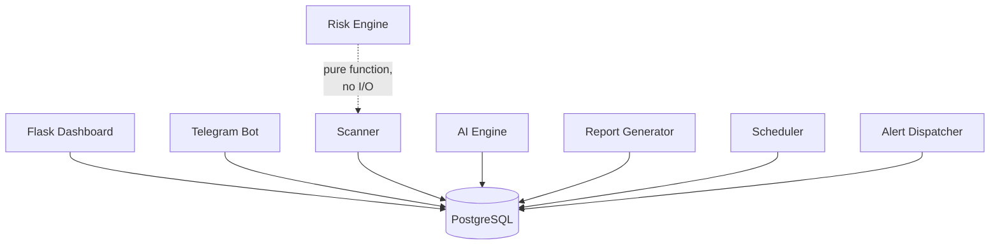
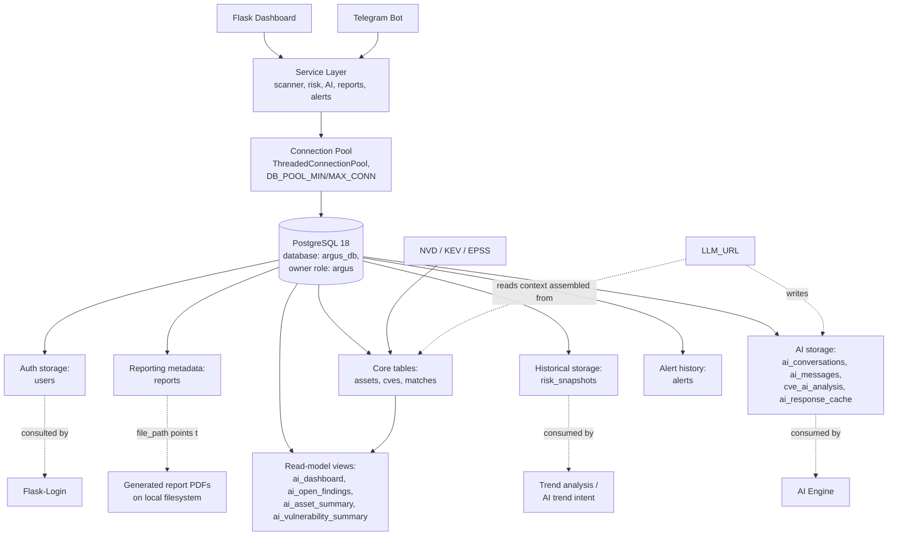
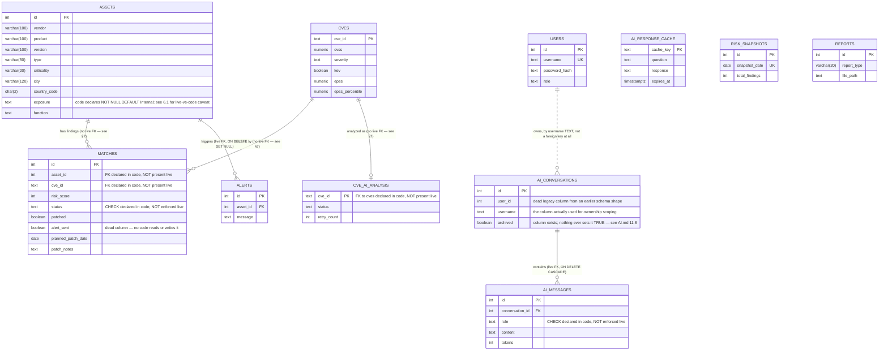
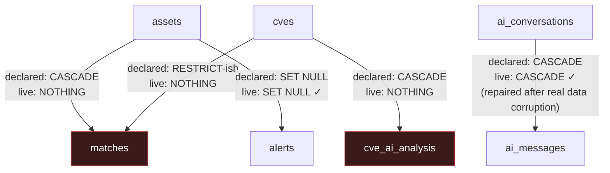
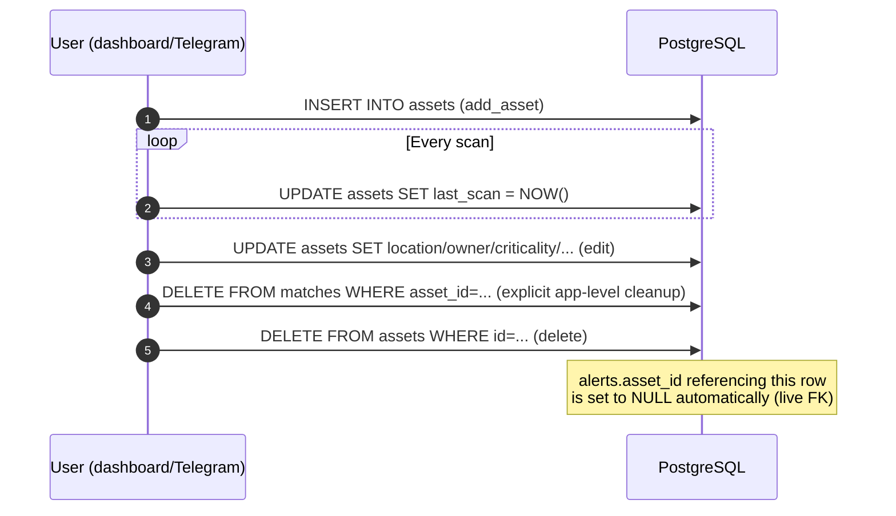
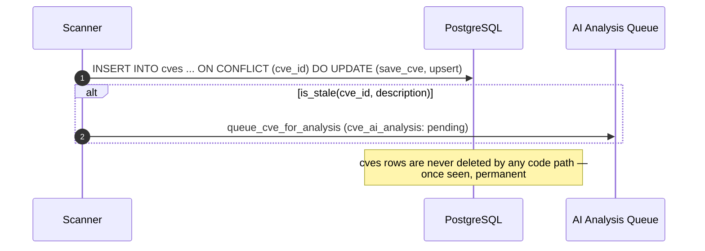
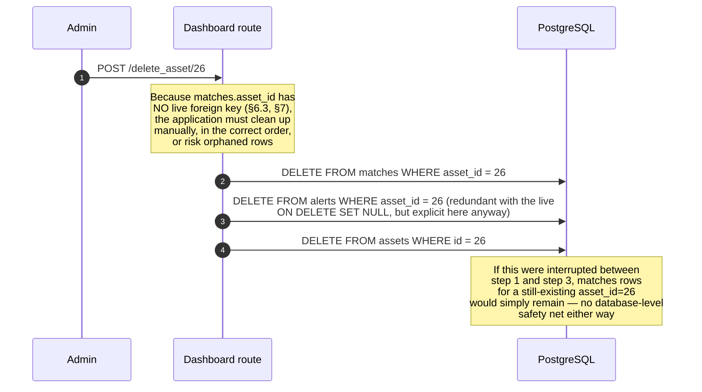

# ARGUS Database Architecture Reference

This document is the official database architecture reference for ARGUS. It explains the schema's design, every table's purpose and lifecycle, relationships, indexing, performance, security, and migration strategy — and, critically, where the **actual deployed database** differs from what the schema-definition code (`schema.sql`, `bot/database/migrate.py`) declares.

> **Methodology note, and why this document is unusually precise about drift.** This document was written against two sources simultaneously: the schema-definition code (`bot/database/schema.sql`, `bot/database/migrate.py`, and the equivalent `_ensure_schema()` logic in `bot/dashboard/app.py`), and an actual `pg_dump` backup of a running ARGUS instance (`argus_backup.sql`, PostgreSQL 18.4, 25 assets / 5,227 CVEs / 668 matches / 330 CVE analyses / 53 alerts at the time of the dump). These two sources **do not fully agree**, and the disagreement is itself an important, accurate fact about this system: several tables (`assets`, `matches`, `ai_conversations`, `ai_messages`, `cve_ai_analysis`) were originally created by an earlier, ad-hoc version of ARGUS with a narrower shape, and PostgreSQL's `CREATE TABLE IF NOT EXISTS` is a silent no-op against an already-existing table — meaning the idealized `CREATE TABLE` statements in `schema.sql`/`migrate.py` never actually apply to a database that pre-dates them. Only explicit `ALTER TABLE ... ADD COLUMN IF NOT EXISTS` repair steps take effect against such a database, and — as this document verifies precisely — not every gap has such a repair step written for it yet. Where this document says "as declared in code" vs. "as actually deployed," this is not hedging — it is the documented, verified state of two genuinely different things.

---

## Table of Contents

1. [Introduction](#1-introduction)
2. [Database Design Philosophy](#2-database-design-philosophy)
3. [High-Level Database Architecture](#3-high-level-database-architecture)
4. [Entity Relationship Overview](#4-entity-relationship-overview)
5. [Database Schema Overview](#5-database-schema-overview)
6. [Table Documentation](#6-table-documentation)
7. [Relationship Design](#7-relationship-design)
8. [Data Lifecycle](#8-data-lifecycle)
9. [Vulnerability Storage](#9-vulnerability-storage)
10. [Asset Storage](#10-asset-storage)
11. [AI Storage](#11-ai-storage)
12. [Reporting Storage](#12-reporting-storage)
13. [Risk Storage](#13-risk-storage)
14. [Historical Data Strategy](#14-historical-data-strategy)
15. [Indexing Strategy](#15-indexing-strategy)
16. [Constraints](#16-constraints)
17. [Transactions](#17-transactions)
18. [Performance Strategy](#18-performance-strategy)
19. [Memory Efficiency](#19-memory-efficiency)
20. [Security Architecture](#20-security-architecture)
21. [Backup Strategy](#21-backup-strategy)
22. [Migration Strategy](#22-migration-strategy)
23. [Scalability](#23-scalability)
24. [Data Retention](#24-data-retention)
25. [Future Database Evolution](#25-future-database-evolution)
26. [Database Monitoring](#26-database-monitoring)
27. [Developer Guidelines](#27-developer-guidelines)
28. [Architectural Decisions (ADR)](#28-architectural-decisions-adr)
29. [Database Workflow Examples](#29-database-workflow-examples)
30. [Cross References](#30-cross-references)

---

## 1. Introduction

### Purpose of the database

PostgreSQL is ARGUS's single, authoritative persistence layer — every piece of application state (assets, CVEs, findings, risk history, AI conversations, generated report metadata, user accounts) lives in one PostgreSQL database, accessed through `bot/database/`, the only code in the entire codebase that issues SQL directly to it (with a documented exception — see `ARCHITECTURE.md` §4.1, restated in §6 below: several dashboard routes issue their own inline SQL rather than calling a `bot/database/` function).

### Why PostgreSQL was selected

Covered in full in `ARCHITECTURE.md` §29 ADR-1; restated here for this document's specific audience: ARGUS's schema and query layer depend directly on PostgreSQL-specific features — `ON CONFLICT` upserts (`save_cve`, `save_match`), `TIMESTAMPTZ` for timezone-correct historical data, partial indexes (`idx_cves_kev`), and SQL views as denormalized read models (§6, §11). None of these map cleanly to a different RDBMS or a NoSQL store without a substantial rewrite.

### Role within ARGUS



PostgreSQL is not merely "a" component of ARGUS — it is the **only** integration point between the dashboard process and the Telegram bot process (`ARCHITECTURE.md` §3). They share no other state, no IPC, and no shared in-memory structure; every piece of coordination between the two front ends happens by both reading and writing the same database rows.

### Benefits of relational storage for this workload

Findings are inherently relational (an asset has many findings; a CVE affects many assets; the relationship itself — risk score, status, assignment — carries its own attributes), which is precisely what a proper many-to-many junction table (`matches`) is designed to represent cleanly. The AI subsystem's context builders (`AI.md` §9) depend on this relational structure directly — joining `matches`/`assets`/`cves` to answer "what's affecting my critical assets" is a natural SQL join, not a document-store denormalization exercise.

---

## 2. Database Design Philosophy

| Principle | How it's applied | Why, and the honest caveat |
|---|---|---|
| **Normalization** | Core entities (`assets`, `cves`, `matches`) are in a reasonable 3NF shape; `matches` is a proper junction table with its own attributes (risk score, status, assignment) rather than a denormalized flat table | Standard relational design for genuinely relational data — but as §6, §16 document, the *live* `matches` table is missing the foreign keys that would normally enforce this relational integrity at the database level, due to the ad-hoc-legacy-table drift described in this document's introduction |
| **Data integrity** | Constraints exist where the schema code declares them (`CHECK` on `cve_ai_analysis.status`, `UNIQUE` on `matches(asset_id, cve_id)`, `NOT NULL` on several columns) | Verified partially enforced, not universally — §16 documents specific, real gaps (e.g., `matches.status` has no live `CHECK` constraint despite the code declaring one) |
| **Consistency** | Single-database, ACID-transactional writes (§17) — no eventual-consistency model, no distributed writes | Appropriate for ARGUS's single-instance deployment target; would need rethinking under any future multi-node design (§23) |
| **Auditability** | Timestamps (`created_at`, `first_seen`, `resolved_at`, `analyzed_at`) are pervasive; `risk_snapshots` preserves historical aggregate state | Not a comprehensive audit log (§14, `ARCHITECTURE.md` §19's noted gap) — this is retained *operational* history, not a security audit trail of who-did-what-when |
| **Historical preservation** | `risk_snapshots` (one row/day, §13), conversation history (`ai_conversations`/`ai_messages`, never expiring — `AI.md` §11.5), generated report files + metadata (§12) | Deliberate — ARGUS never deletes historical risk/conversation data automatically; only explicit user action (deleting a conversation) or an operator's own retention policy (§24) removes it |
| **Performance** | Purpose-built views (`ai_dashboard`, `ai_open_findings`, `ai_asset_summary`, `ai_vulnerability_summary`), a defined index set (§15), connection pooling (§18) | Real and effective for the current scale (§23's row counts); some indexing gaps are verified and documented, not hidden (§15) |
| **Security** | Parameterized queries throughout (`ARCHITECTURE.md` §19 confirms no string-interpolated SQL was found), least-privilege AI write scope (`AI.md` §16.9) | The database itself has **one** application-level role (`argus`, owning every object — confirmed in the pg_dump's `ALTER TABLE ... OWNER TO argus` statements) — there is no database-level separation between, e.g., a read-only reporting role and a read-write application role (§20) |
| **Scalability** | Indexed hot paths, batched external calls upstream of the database, view-based denormalization | Real but limited — `ARCHITECTURE.md` §21's broader assessment (single instance, no partitioning, no read replicas) applies fully to the database layer specifically (§23) |
| **Maintainability** | One `bot/database/<table>.py` module per concern, mirroring the schema's own table boundaries | Undermined somewhat by the documented drift pattern (§22) — the "idealized" schema in `schema.sql` and the "actually deployed" schema have diverged in ways a future maintainer needs to know about explicitly, which is precisely this document's purpose |

---

## 3. High-Level Database Architecture



Every application subsystem documented in `ARCHITECTURE.md` §5 ultimately bottoms out at this one database. There is no secondary datastore anywhere in ARGUS — no cache server, no message broker, no object store, no vector database (`AI.md` §13).

---

## 4. Entity Relationship Overview



This ER diagram intentionally annotates each relationship and several columns with their **verified live status**, not just their code-declared intent — see §7 and §16 for the full, itemized explanation of every "no live FK" and "not enforced live" annotation above.

---

## 5. Database Schema Overview

### 5.1 Single schema, no namespacing

Every table and view lives in PostgreSQL's default `public` schema — there is no `argus`-specific schema namespace, no per-feature schema separation (e.g., no separate `ai` schema for AI-related tables). All twelve tables and four views are flat, sibling objects in `public`.

### 5.2 Naming conventions (as actually observed, including where they're inconsistent)

| Convention | Consistently followed? | Evidence |
|---|---|---|
| `snake_case` table and column names | Yes, universally | Every table, every column |
| Singular vs. plural table names | **Inconsistent** | Most tables are plural (`assets`, `cves`, `matches`, `alerts`, `reports`, `users`), but `cve_ai_analysis` and `ai_response_cache` are singular-oriented compound names — there is no single rule being followed, just organic naming per feature as it was added |
| Index naming (`idx_<table>_<column(s)>`) | Mostly, with a verified exception | `idx_matches_asset_id`, `idx_matches_cve_id`, etc. follow this pattern — but the live database also has `idx_matches_asset` and `idx_matches_cve` (shorter, inconsistent names) sitting alongside the "properly" named ones, both indexing the exact same columns (§15's duplicate-index finding) |
| Foreign key naming (`<table>_<column>_fkey`) | Yes, for the FKs that do exist | `ai_messages_conversation_id_fkey`, `alerts_asset_id_fkey` — PostgreSQL's own default FK-naming convention, not a custom one ARGUS invented |
| `created_at`/`updated_at` timestamp convention | Present on most tables, but with inconsistent types | Some are `TIMESTAMPTZ`, some are `TIMESTAMP WITHOUT TIME ZONE` — §6 documents this precisely per table, since it's a real, verified inconsistency rather than a uniform convention |

### 5.3 Primary responsibilities by table group

| Group | Tables | Responsibility |
|---|---|---|
| Core inventory & findings | `assets`, `cves`, `matches` | The fundamental correlation data — what exists, what's vulnerable, what matches what |
| Historical/trend | `risk_snapshots` | Point-in-time aggregate snapshots for trend analysis |
| AI subsystem | `ai_conversations`, `ai_messages`, `cve_ai_analysis`, `ai_response_cache` | Chat memory, background analysis results, response caching (`AI.md` §11, §12) |
| Operational output | `reports`, `alerts` | Metadata for generated PDFs and sent Telegram notifications |
| Access control | `users` | Self-registered account credentials (built-in `admin`/`viewer` accounts are **not** rows in this table — they are in-memory, sourced from `ADMIN_PASSWORD`/`VIEWER_PASSWORD` env vars — confirmed by the pg_dump showing **zero** rows in `users` on a real, actively-used instance) |
| Read models | `ai_dashboard`, `ai_open_findings`, `ai_asset_summary`, `ai_vulnerability_summary` | Precomputed joins/aggregates, purpose-built for the AI context builder (`AI.md` §9) |

---

## 6. Table Documentation

Every subsection below documents one table, structured identically: Purpose, Columns (as **actually deployed**, per the pg_dump, with code-declared differences called out explicitly), Keys/Constraints (live vs. declared), Indexes, Lifecycle, Update Frequency, Observed Growth (from the real backup), Performance Notes, Security Considerations, and Future Expansion.

### 6.1 `assets`

**Purpose.** The asset inventory — one row per tracked device/system, the root entity every finding is attached to.

**Columns (as actually deployed):**

| Column | Live type | Live nullable/default | Code-declared (schema.sql/migrate.py) | Discrepancy |
|---|---|---|---|---|
| `id` | `integer` | `NOT NULL` (implicit PK) | `SERIAL PRIMARY KEY` | None |
| `vendor` | `character varying(100)` | nullable, no default | `TEXT NOT NULL` | **Live column is nullable and length-capped; code assumes unbounded, required** |
| `product` | `character varying(100)` | nullable, no default | `TEXT NOT NULL` | Same discrepancy as `vendor` |
| `version` | `character varying(100)` | nullable, no default | `TEXT NOT NULL` | Same discrepancy as `vendor` |
| `location` | `character varying(100)` | nullable | `TEXT` | Type discrepancy only (bounded vs. unbounded), nullability matches |
| `criticality` | `character varying(20)` | nullable | `TEXT` | Type discrepancy only |
| `created_at` | `timestamp without time zone` | `DEFAULT CURRENT_TIMESTAMP` | Not declared in `schema.sql`'s `assets` table at all (schema.sql has no `created_at` column listed for `assets`) | Live column exists from the pre-existing ad-hoc table; current schema code doesn't manage it at all |
| `owner` | `character varying(100)` | nullable | `TEXT` | Type discrepancy only |
| `notes` | `text` | nullable | `TEXT` | None |
| `type` | `character varying(50)` | nullable, **no default** | `TEXT NOT NULL DEFAULT 'Unknown'` | **Live column has no default and allows NULL; application code (`add_asset`) always supplies a value, so this is latent rather than actively causing bad data, but a direct `INSERT` bypassing the application would leave `type` NULL, not `'Unknown'`** |
| `last_scan` | `timestamp with time zone` | nullable | `TIMESTAMPTZ` | None — this one matches |
| `search_keyword` | `text` | nullable | `TEXT` | None |
| `city` | `character varying(120)` | nullable | `VARCHAR(120)` | None |
| `country_code` | `character(2)` | nullable | `CHAR(2)` | None |
| `exposure` | *(not present in the dumped snapshot)* | — | `TEXT NOT NULL DEFAULT 'Internal'`, `CHECK (exposure IN ('Internal','External'))` | **This column, and the one below, exist in the current codebase's migration script but were not yet present in the database at the time of this backup — see the operational note below** |
| `function` | *(not present in the dumped snapshot)* | — | `TEXT` | Same as `exposure` |

**A note on the `exposure`/`function` gap specifically:** unlike the other discrepancies in this table (which are permanent, structural drift from the ad-hoc legacy table), the absence of `exposure`/`function` from the backed-up database most likely reflects that this particular backup was taken **before** the corresponding migration (`bot/database/migrate.py`'s "Asset metadata: exposure & network function" section) was ever run against this instance — not a repair gap. Running `python migrate.py` (or starting the dashboard, which self-heals via `_ensure_schema()`) against this database would add both columns going forward. This is called out explicitly so it isn't confused with the *genuine*, unfixable-without-a-new-migration drift documented elsewhere in this table (e.g., `type`'s missing default).

**Primary key.** `assets_pkey PRIMARY KEY (id)` — live and matches code.

**Foreign keys.** None (there are none to have — `assets` is a root entity).

**Indexes (live).** `idx_assets_type` (`type`), `idx_assets_city_country` (`country_code, city`). **Not yet live in this snapshot:** `idx_assets_exposure`, `idx_assets_function` (declared in the current `migrate.py` but, consistent with the `exposure`/`function` columns themselves, not yet applied to this particular database).

**Relationships.** Referenced by `matches.asset_id` (no live FK — §7) and `alerts.asset_id` (live FK, `ON DELETE SET NULL`).

**Lifecycle.** Created via `add_asset()` (dashboard `/add_asset` or Telegram `/add`) → updated via `update_asset()` on edit, and `update_last_scan()` on every scan → deleted via the dashboard's `/delete_asset` route (which explicitly deletes dependent `matches`/`alerts` rows first, in application code, **because there is no live FK to cascade this automatically** — see §7) or Telegram's `/rm` (which relies on `alerts.asset_id`'s live `ON DELETE SET NULL` for that one relationship, but has no equivalent cleanup for `matches`, since no FK/cascade exists there either).

**Update frequency.** `last_scan` updates on every scan (daily at minimum, per the scheduler); all other columns update only on explicit user edit.

**Observed growth.** 25 rows in the reference backup — a small, single-organization inventory, consistent with ARGUS's stated target audience (`README.md` §1).

**Performance notes.** `idx_assets_type` and `idx_assets_city_country` support the dashboard's asset-list filtering (`/assets?type=...`, city-exposure aggregation). No index exists on `vendor`/`product` despite `/assets`'s implicit substring searches on these — acceptable at 25 rows, a genuine concern at the "hundreds of thousands of assets" scale in §23's stated target.

**Security considerations.** No column-level encryption; `notes` is free text and could contain sensitive operational detail with no access restriction beyond ARGUS's own `@login_required`/`@admin_required` route gating (`API.md` §4) — the database itself imposes no row- or column-level access control (§20).

**Future expansion.** Per `ARCHITECTURE.md` §8: no asset-level history/audit table exists (an edit overwrites the previous value with no record of the change); no structured firmware-version-range modeling; no asset-to-asset relationship modeling (e.g., parent/child for virtualized assets).

### 6.2 `cves`

**Purpose.** ARGUS's own normalized cache of CVE records, one row per CVE ID, upserted from NVD data at scan time.

**Columns (as actually deployed):**

| Column | Live type | Live nullable/default | Code-declared | Discrepancy |
|---|---|---|---|---|
| `cve_id` | `text` | `NOT NULL` (PK) | `TEXT PRIMARY KEY` | None |
| `cvss` | `numeric` (unbounded precision/scale) | nullable | `NUMERIC(4,1)` | **Live column has no precision/scale limit; code assumes a bounded `NUMERIC(4,1)` (matching CVSS's 0.0–10.0 range with one decimal)** — in practice, `save_cve()`'s own Python-side coercion means only CVSS-shaped values are ever actually inserted, so this discrepancy is latent, not actively causing malformed data |
| `severity` | `text` | nullable | `TEXT` | None |
| `kev` | `boolean` | `DEFAULT false` | `BOOLEAN NOT NULL DEFAULT FALSE` | **Live column allows NULL** (no `NOT NULL`) despite the default — a row could theoretically have `kev IS NULL` rather than `FALSE`, which every application-side boolean check (`WHERE kev = TRUE`) would correctly treat as not-KEV, but which is a looser guarantee than the code's `NOT NULL` declaration implies |
| `published` | `date` | nullable | `DATE` | None |
| `description` | `text` | nullable | `TEXT` | None |
| `epss` | `numeric` | `DEFAULT 0` | `NUMERIC(8,6)` (no default declared in `migrate.py`'s `ADD COLUMN` statement) | **Live column has a `DEFAULT 0` that the current migration code doesn't declare** — another sign the live column predates the current migration script |
| `epss_percentile` | `numeric` | `DEFAULT 0` | `NUMERIC(8,6)` (no default declared) | Same as `epss` |
| `created_at` | *(does not appear in this table's `\d` output in the dump excerpt reviewed — see the note below)* | — | `TIMESTAMPTZ NOT NULL DEFAULT NOW()` (added via `migrate.py`'s `"cves.created_at column"` migration, with an explicit code comment explaining this exact repair was needed to fix a real observed production error — "Failed to fetch CVE" / analyzer errors — caused by this column's prior absence) | This migration's own comment is itself excellent, first-party evidence of the ad-hoc-legacy-table pattern this document describes throughout — see §22 |

**Primary key.** `cves_pkey PRIMARY KEY (cve_id)` — live and matches code. Using the CVE ID itself as the primary key (rather than a synthetic integer) is a deliberate, sensible choice: CVE IDs are already globally unique, stable identifiers, and every foreign reference to a CVE (from `matches`, `cve_ai_analysis`) naturally wants to store the human-readable ID anyway.

**Foreign keys.** None — `cves` is a root entity, populated from NVD, not derived from any other ARGUS table.

**Indexes (live).** **None found in the reference backup's index list.** `idx_cves_kev` and `idx_cves_cvss` are declared in the current `schema.sql`/`migrate.py` (with an explicit code comment explaining exactly why they matter — quoted in §15) but, like `assets.exposure`/`function`, were not yet applied to the database at the time of this backup. This is the single most consequential "declared but not yet live" gap in the entire schema, given `cves` is already the largest table (5,227 rows in this backup) and only grows.

**Relationships.** Referenced by `matches.cve_id` (no live FK — §7) and `cve_ai_analysis.cve_id` (no live FK — §7, despite both being declared as `REFERENCES cves(cve_id)` in code).

**Lifecycle.** Upserted (`ON CONFLICT`) by `database/cves.py::save_cve()` on every scan that encounters the CVE — a CVE row is **never deleted** by any code path (there is no `DELETE FROM cves` anywhere in the codebase); once ARGUS has seen a CVE, its row persists indefinitely, even if every asset that was ever matched to it is later removed.

**Update frequency.** Re-upserted every time any asset's scan encounters this CVE again — meaning a widely-affecting CVE could be re-written many times across many assets' scans, each write producing an identical (or updated, if NVD's data changed) row.

**Observed growth.** 5,227 rows in the reference backup for a 25-asset inventory — CVE volume scales with the breadth of vendor/product keywords searched, not linearly with asset count (a single popular product keyword can return hundreds of associated CVEs).

**Performance notes.** The missing `idx_cves_kev`/`idx_cves_cvss` indexes (above) mean, in the live database this backup came from, every KEV-filtered or CVSS-sorted query against `cves` (the dashboard's `/findings` KEV filter, the live `/cves` search's CVSS sort, the AI `kev` intent) is currently a sequential scan — tolerable at 5,227 rows, the exact scenario the code's own comment warns will not scale ("at millions-of-CVEs scale this is the difference between an index scan and a full table scan").

**Security considerations.** `description` is verbatim NVD text — no injection risk (always parameterized), but worth noting this is externally-sourced content stored and later fed into LLM prompts (`AI.md` §9) without sanitization, since it's treated as trusted data once in ARGUS's own database.

**Future expansion.** No CWE column exists anywhere (`AI.md` §10's verified gap — the AI system prompt claims CWE-explanation responsibility that the schema cannot ground); no CVSS v4 support (only a single numeric score is stored, not a versioned vector); no full CVSS vector string storage at all.

### 6.3 `matches`

**Purpose.** The central junction table — one row per (asset, CVE) finding, carrying the risk score and the entire remediation-workflow state (status, assignment, patch planning). This is the busiest, most-queried table in the schema and the one with the most significant verified drift from its code-declared shape.

**Columns (as actually deployed):**

| Column | Live type | Live nullable/default | Code-declared | Discrepancy |
|---|---|---|---|---|
| `id` | `integer` | `NOT NULL` (PK) | `SERIAL PRIMARY KEY` | None |
| `asset_id` | `integer` | **nullable** | `INTEGER NOT NULL REFERENCES assets(id) ON DELETE CASCADE` | **No live foreign key at all — see the dedicated discussion below** |
| `cve_id` | `text` | **nullable** | `TEXT NOT NULL REFERENCES cves(cve_id)` | **No live foreign key at all — same discussion** |
| `risk_score` | `integer` | nullable | `INTEGER` | None |
| `alert_sent` | `boolean` | `DEFAULT false` | **Not declared anywhere in `schema.sql` or `migrate.py`** | **A fully dead, legacy column** — verified via direct search that no Python code anywhere reads or writes `alert_sent`; alert history is tracked entirely through the separate `alerts` table instead (§6.9). This column is inert: always whatever its default/last-written value was, never consulted for any application decision |
| `created_at` | `timestamp without time zone` | `DEFAULT CURRENT_TIMESTAMP` | Not declared in `schema.sql`'s `matches` table | Same pre-existing-table pattern as `assets.created_at`/`cves.created_at` |
| `first_seen` | `timestamp with time zone` | `DEFAULT now()`, `NOT NULL` | `TIMESTAMPTZ NOT NULL DEFAULT NOW()` | None — matches exactly |
| `patched` | `boolean` | `DEFAULT false`, `NOT NULL` | `BOOLEAN NOT NULL DEFAULT FALSE` | None |
| `status` | `text` | `DEFAULT 'Open'::text`, **nullable, no CHECK** | `TEXT NOT NULL DEFAULT 'Open' CHECK (status IN ('Open','In Progress','Resolved','Accepted Risk','False Positive'))` | **No live `NOT NULL`, and critically, no live `CHECK` constraint** — the five-value whitelist is enforced only by the Flask route handler (`API.md` §5.5's `update_finding_status` validation), not by the database. A direct `UPDATE`/`INSERT` bypassing the application (a manual `psql` session, a future second application, a bug in a different code path) could set `status` to any arbitrary text with nothing at the database layer to stop it |
| `resolved_at` | `timestamp without time zone` | nullable | `TIMESTAMPTZ` | Type discrepancy (naive vs. timezone-aware) — resolution timestamps recorded before this drift was introduced lack timezone context |
| `due_date` | `date` | nullable | `DATE` | None |
| `assigned_to` | `text` | nullable | `TEXT` | None |
| `assigned_team` | `text` | nullable | `TEXT` | None |
| `planned_patch_date` | *(not present in the dumped snapshot)* | — | `DATE` | Same "migration not yet run against this snapshot" situation as `assets.exposure`/`function` |
| `patch_notes` | *(not present in the dumped snapshot)* | — | `TEXT` | Same as above |

**A dedicated note on the missing foreign keys.** This is the single most significant verified finding in this entire document. `schema.sql` declares `matches.asset_id` and `matches.cve_id` as `NOT NULL REFERENCES ...` — but the live database's constraint list (extracted directly from the `pg_dump`'s `ADD CONSTRAINT` statements) contains **no** `matches_asset_id_fkey` and **no** `matches_cve_id_fkey`. Only two other foreign keys exist anywhere in the database: `ai_messages_conversation_id_fkey` and `alerts_asset_id_fkey`. This means, in the actual running database this backup was taken from:

- It is possible to `INSERT` a `matches` row referencing an `asset_id` or `cve_id` that does not exist in `assets`/`cves` — the database will not reject it.
- Deleting an asset row directly (e.g., `DELETE FROM assets WHERE id = 5`) does **not** cascade to delete that asset's `matches` rows at the database level — despite `schema.sql`'s declared `ON DELETE CASCADE`. The only reason this doesn't currently produce visibly broken data is that the **application layer** compensates: the dashboard's `/delete_asset` route explicitly issues `DELETE FROM matches WHERE asset_id=%s` before deleting the asset (`API.md` §5.4), and the Telegram `/rm` command's cleanup behavior was separately noted as incomplete in `API.md` §6. The database itself provides none of this safety net — every asset-deletion code path must remember to clean up `matches` manually, forever, or risk orphaned rows.
- This is architecturally the same class of issue as the previously-repaired `ai_messages_conversation_id_fkey` (§6.6) — but unlike that case, **no migration step in the current `migrate.py` attempts to add the missing `matches` foreign keys**. This is a real, currently-unaddressed gap, not a resolved one, and it is the top recommendation in this document's Developer Guidelines (§27) and ADR discussion (§28).

**Primary key.** `matches_pkey PRIMARY KEY (id)` — live and matches code.

**Unique constraints — a second verified, real redundancy.** The live database has **two** separate `UNIQUE` constraints enforcing the identical rule:
- `matches_asset_id_cve_id_key UNIQUE (asset_id, cve_id)` — the name `migrate.py`'s idempotent constraint-check logic expects and checks for (`SELECT 1 FROM pg_constraint WHERE conname = 'matches_asset_id_cve_id_key'`).
- `unique_asset_cve UNIQUE (asset_id, cve_id)` — a second constraint, same columns, different name, **not referenced anywhere in the current codebase** (no migration step checks for or created a constraint by this name).

Both constraints are semantically identical and both are always satisfied or violated together — PostgreSQL does not deduplicate functionally-identical constraints automatically, so both persist, taking up (a small amount of) additional index storage and requiring a marginally more expensive constraint-check on every insert. This is almost certainly a leftover from the same ad-hoc-legacy-table history documented throughout this section: `unique_asset_cve` was likely the original constraint from before `migrate.py` existed, and `migrate.py`'s own idempotent check (looking for `matches_asset_id_cve_id_key` specifically, by name) didn't recognize `unique_asset_cve` as already satisfying the requirement, so it added a second, redundantly-named constraint rather than detecting the pre-existing one.

**Indexes (live) — a third verified redundancy.** The live database has:
- `idx_matches_asset_id` and `idx_matches_asset` — **two indexes on the same single column, `asset_id`**, with the shorter name (`idx_matches_asset`) not referenced anywhere in `schema.sql` or `migrate.py`.
- `idx_matches_cve_id` and `idx_matches_cve` — the identical pattern on `cve_id`.
- `idx_matches_risk` (`risk_score DESC`), `idx_matches_status` (`status`), `idx_matches_due_date` (`due_date`) — each single, not duplicated.
- **Not yet live in this snapshot:** `idx_matches_asset_cve` (the composite `(asset_id, status)` index declared in `schema.sql`) and `idx_matches_planned_patch_date` — consistent with the broader "migration not yet run against this snapshot" pattern for the patch-planning feature.

PostgreSQL will happily maintain redundant indexes indefinitely — each one costs write-time overhead (every `INSERT`/`UPDATE` on `matches` must update all of them) for zero additional query benefit, since the query planner only needs one index per column to satisfy a lookup. This is a concrete, low-risk, high-clarity cleanup opportunity (§27).

**Relationships.** The conceptual relationships (asset has findings, CVE is matched, finding may have an AI analysis via its CVE) are real and are what every application query assumes — but as documented above, they are enforced entirely by application code today, not by the database (§7).

**Lifecycle.** Created by `database/matches.py::save_match()` (an upsert — `INSERT ... ON CONFLICT (asset_id, cve_id) DO UPDATE` against whichever unique constraint PostgreSQL happens to use to detect the conflict, functionally fine given both constraints cover the same columns) during a scan → `status`/`assigned_to`/`assigned_team` updated via dashboard or Telegram actions → `patched` toggled via `/toggle_patched` → `planned_patch_date`/`patch_notes` set via `update_patch_plan()` (§6.3.1 below) → row deleted only via the dashboard's explicit `/delete_asset` cleanup (there is no other deletion path, and no automatic expiration).

**Update frequency.** Extremely high relative to other tables — every scan potentially inserts new rows and every remediation-workflow action (status change, assignment, patch scheduling) is an `UPDATE` against this table.

**Observed growth.** 668 rows for 25 assets / 5,227 CVEs in the reference backup — an average of ~27 findings per asset, consistent with a moderately-aged, actively-scanned small inventory.

**Performance notes.** The redundant indexes (above) are a genuine, if modest, write-performance cost; the composite `(asset_id, status)` index not yet being live means asset-detail-page queries filtering by both dimensions simultaneously currently rely on the single-column indexes rather than a combined one, in this specific snapshot.

**Security considerations.** The absence of a live `status` `CHECK` constraint (above) means the database provides no defense-in-depth against a malformed `status` value reaching this table via any code path other than the one dashboard route that validates it — a real, if narrow, data-integrity risk surface.

**Future expansion.** No finding-level audit history (a status change overwrites the previous value with no record — `ARCHITECTURE.md` §11.5's identical observation for `assets` applies here too, and arguably matters more for `matches`, since remediation-workflow history is exactly the kind of thing a compliance-minded deployment would want retained).

#### 6.3.1 The patch-planning columns, specifically

`planned_patch_date` and `patch_notes` (declared in code, not yet present in this backup — see above) are deliberately **independent** of `due_date`: per the migration script's own explanatory comment, `due_date` is ARGUS's auto-calculated SLA deadline (derived purely from CVSS by `_calc_due_date()` — 7/30/60/90 days for Critical/High/Medium/Low, backfilled for pre-existing rows by a dedicated migration step), while `planned_patch_date` is the analyst's own scheduling decision, which may fall before or after the SLA deadline (e.g., tied to a maintenance window) and is never auto-computed or silently overwritten by ARGUS. `database/matches.py::update_patch_plan()` is the sole write path, and `database/assets.py::get_patch_plan(scope=...)` (feeding the dashboard's `patch_plan.html` template — confirmed present in the current codebase) is the read path, supporting three views: `"scheduled"` (has a planned date, soonest first), `"unscheduled"` (no planned date yet, highest risk first), and `"all"` (both, scheduled-first). All three explicitly exclude findings whose `status` is `'Resolved'`, `'Accepted Risk'`, or `'False Positive'` — a closed-out finding has nothing left to plan.

### 6.4 `alerts`

**Purpose.** An audit trail of Telegram alert messages actually sent — written *after* the send already happened (`API.md` §12.4), not a queue or delivery mechanism itself.

**Columns (as actually deployed):** `id integer NOT NULL` (PK), `asset_id integer` (nullable), `message text NOT NULL`, `sent_at timestamp with time zone DEFAULT now() NOT NULL`. This table matches its code declaration in `schema.sql`/`migrate.py` **exactly** — no drift, unlike every table discussed so far. This is a useful data point: `alerts` is evidently a table that was always created by the current schema-management code, with no pre-existing ad-hoc version to conflict with.

**Primary key.** `alerts_pkey PRIMARY KEY (id)`.

**Foreign keys.** `alerts_asset_id_fkey FOREIGN KEY (asset_id) REFERENCES assets(id) ON DELETE SET NULL` — **live and correctly enforced**, one of only two real foreign keys in the entire database. `ON DELETE SET NULL` (rather than `CASCADE`) is the correct choice here specifically: an alert's historical record should survive the asset it was about being deleted — the alert becomes "an alert about a since-deleted asset" rather than vanishing, preserving the audit value of "this alert was sent" even after the asset itself is gone.

**Indexes.** None dedicated — no `idx_alerts_*` index exists in either the code or the live database. At 53 rows (the reference backup), this is a non-issue; would need attention if `alerts` ever grew to the scale of `matches`.

**Lifecycle.** Inserted by `database/matches.py::save_alert()`, called by `scanner.py` immediately after a successful Telegram send (§7 in `README.md`). Never updated. Never deleted by any application code — grows monotonically forever, at one row per asset per scan-with-new-findings (not one row per individual CVE — `README.md` §3 confirms alerts are consolidated per asset).

**Update frequency.** Write-once per row; frequency of new rows tracks scan frequency and finding-discovery rate.

**Observed growth.** 53 rows in the reference backup.

**Performance notes.** No current concern at this scale; this table's only read path is the dashboard/bot's historical display (which doesn't currently exist as a dedicated view — `API.md` §12.5's noted gap that `alerts` data isn't surfaced anywhere in the dashboard today).

**Security considerations.** `message` is free text containing finding summaries — the same sensitivity class as the findings themselves, with no additional protection.

**Future expansion.** Could be broadened into a genuine audit-log table (covering logins, asset edits, status changes) as recommended in `ARCHITECTURE.md` §30 and `AI.md` §27 — today it covers exactly one category of event (Telegram alert sends).

### 6.5 `reports`

**Purpose.** Metadata for generated PDF report files — the file itself lives on the filesystem (`bot/dashboard/generated_reports/`); this table is the pointer plus generation timestamp/type.

**Columns (as actually deployed):** `id integer NOT NULL` (PK), `report_type character varying(20)` (nullable), `generated_at timestamp without time zone DEFAULT now()` (nullable — no `NOT NULL` despite `schema.sql` declaring `TIMESTAMP NOT NULL DEFAULT NOW()`), `file_path text NOT NULL`.

**Primary key.** `reports_pkey PRIMARY KEY (id)`.

**Foreign keys.** None — reports aren't tied to a specific asset or CVE; each is a standalone, time-windowed aggregate document.

**Indexes.** None — `get_reports()`'s query (`ORDER BY generated_at DESC LIMIT 20`) runs as a sequential scan with a sort; acceptable at 8 rows (the reference backup), would benefit from an index on `generated_at` at meaningfully larger report volumes.

**Lifecycle.** Inserted by `database/reports.py::save_report()` after every successful report generation (daily/weekly/monthly/yearly, on-demand or scheduled — `README.md` §14). Never updated. Never deleted by any application code (§12).

**Update frequency.** New row per successful report generation; scheduled weekly and monthly generation are the guaranteed-recurring sources (`ARCHITECTURE.md` §16), plus any on-demand generation.

**Observed growth.** 8 rows in the reference backup.

**Performance notes.** Trivial at current scale; the actual performance cost of report *generation* is in the PDF-rendering and underlying data-aggregation query, not this metadata table.

**Security considerations.** `file_path` is used by `/download/<report_id>` with an explicit path-traversal guard (rejecting any resolved path outside `REPORTS_DIR` — `API.md` §5.10) — the guard is application-side; the database imposes no constraint preventing a malformed `file_path` from being inserted in the first place.

**Future expansion.** No retention/archival policy exists (§12, §24) — every report ever generated remains referenced forever unless manually cleaned up.

### 6.6 `ai_conversations`

**Purpose.** One row per AI Security Copilot conversation thread (`AI.md` §11).

**Columns (as actually deployed):**

| Column | Live type | Live nullable/default | Code-declared | Discrepancy |
|---|---|---|---|---|
| `id` | `integer` | `NOT NULL` (PK) | `SERIAL PRIMARY KEY` | None |
| `user_id` | `integer` | nullable | **Not declared anywhere in current code** | **A fully dead legacy column** — the explicit remnant of "an earlier ad-hoc setup" (quoted directly from the code's own comment) that used `user_id INTEGER` before the current `username TEXT`-based ownership model existed. Verified via direct search: no current Python code reads or writes this column |
| `title` | `text` | `DEFAULT 'New conversation'::text` | `TEXT NOT NULL DEFAULT 'New conversation'` | **Live column allows NULL** despite the code's `NOT NULL` declaration and despite `migrate.py` including an explicit `ALTER COLUMN title SET DEFAULT` repair step — that repair sets the *default*, but a `NOT NULL` constraint was apparently never separately added (no `ALTER COLUMN title SET NOT NULL` step exists in `migrate.py`) |
| `created_at` | `timestamp without time zone` | **nullable, no default** | `TIMESTAMPTZ NOT NULL DEFAULT NOW()` | **A genuinely significant gap** — unlike `title`, there is no code anywhere (not `migrate.py`, not `bot/dashboard/app.py`'s `_ensure_schema()`) that attempts to add a default or `NOT NULL` to this column. A row inserted without an explicit `created_at` value would have `created_at IS NULL` |
| `username` | `text` | nullable | `TEXT` (repaired via `ADD COLUMN IF NOT EXISTS`, deliberately without `NOT NULL` — the migration's own comment explains why: "no DEFAULT can backfill a real username for legacy rows... existing/legacy rows are the only ones that could be NULL, and there are none in this deployment") | Matches code intent exactly — this is a case where the schema code's nullability choice is deliberate and well-reasoned, not accidental drift |
| `updated_at` | `timestamp with time zone` | `DEFAULT now()`, `NOT NULL` | `TIMESTAMPTZ NOT NULL DEFAULT NOW()` | None — matches exactly (this column was added fresh by the current migration code, with no legacy conflict) |
| `archived` | `boolean` | `DEFAULT false`, `NOT NULL` | `BOOLEAN NOT NULL DEFAULT FALSE` | None in terms of schema — but see `AI.md` §11.8: this column is never actually set to `TRUE` by any code path, live database confirms every row has `archived = false` |

**Primary key.** `ai_conversations_pkey PRIMARY KEY (id)`.

**Foreign keys.** None. `username` is a plain, unconstrained `TEXT` column — **not** a foreign key to `users.username`, and by design cannot easily be one: the built-in `admin`/`viewer` accounts (§5.3) have no corresponding row in `users` at all, so a strict FK would reject every conversation created by either built-in account, which is most of ARGUS's actual usage given `users` had zero rows in the reference backup.

**Indexes.** `idx_ai_conversations_username` — a composite index on `(username, updated_at DESC)`, precisely matching `list_conversations()`'s query pattern (filter by owner, sort by recency).

**Relationships.** Parent of `ai_messages` via `conversation_id` (§6.7's FK, which **is** live, unlike most of this document's other findings).

**Lifecycle.** Created by `create_conversation()` on the first message of a new conversation → `title` set once via `auto_title_from_message()`, renamable later via `rename_conversation()` → `updated_at` bumped on every new message → deleted via `delete_conversation()`, cascading to `ai_messages` (§6.7). Never automatically expired (`AI.md` §11.5).

**Update frequency.** `updated_at` changes on every message in every active conversation; `title`/`archived` change rarely (title: once or via explicit rename; archived: never, per the dead-column finding above).

**Observed growth.** 3 rows in the reference backup.

**Performance notes.** The composite index fully supports the one query pattern this table serves (`list_conversations`); no concerns at any currently-plausible scale for a single-operator deployment.

**Security considerations.** Ownership scoping (`WHERE username = %s` in every query — `AI.md` §11.7) is application-enforced, not database-enforced (no row-level security, §20) — a bug in any future code path that forgets to include the `username` filter would have no database-level backstop preventing cross-user data exposure.

**Future expansion.** The dead `user_id` column and the never-set `archived` column (§27) are both low-effort cleanup/completion opportunities; `AI.md` §11.9–11.10 discuss future user profiles and long-term memory as larger, unimplemented extensions.

### 6.7 `ai_messages`

**Purpose.** Individual turns within an `ai_conversations` thread.

**Columns (as actually deployed):** `id integer NOT NULL` (PK), `conversation_id integer` (nullable at the column level, though the live FK below effectively requires it reference a real row whenever non-null), `role text` (nullable, **no live `CHECK` constraint**), `content text` (nullable, despite `schema.sql` declaring `NOT NULL`), `created_at timestamp without time zone` (nullable, no default — the identical gap pattern as `ai_conversations.created_at`), `tokens integer DEFAULT 0`.

**Primary key.** `ai_messages_pkey PRIMARY KEY (id)`.

**Foreign keys — the one genuinely repaired case in this entire document.** `ai_messages_conversation_id_fkey FOREIGN KEY (conversation_id) REFERENCES ai_conversations(id) ON DELETE CASCADE` **is live** in the reference backup. This is the direct result of a documented, deliberate repair: `migrate.py`'s own comment describes finding, in production, `ai_messages` rows referencing `conversation_id` values 1 and 2 with **zero matching rows in `ai_conversations`** — orphaned data caused by exactly the same "table pre-existed without this FK" pattern responsible for every other gap in this document. The fix required two explicit steps, both present in `migrate.py` and both necessary in the correct order: first `DELETE FROM ai_messages WHERE conversation_id NOT IN (SELECT id FROM ai_conversations)` (PostgreSQL refuses to add a FK while violating rows exist), then the `ADD CONSTRAINT`. **This is the one place in the entire schema where the ad-hoc-legacy-table problem was actually, fully fixed** rather than merely worked around — worth holding up as the model to follow for the still-unfixed `matches` foreign keys (§6.3, §27).

**Indexes.** `idx_ai_messages_conversation` — live as `(conversation_id)` only (a single-column index), whereas `migrate.py`'s declared version is a composite `(conversation_id, created_at)`. This is a real, minor discrepancy: the live index supports "all messages for conversation X" efficiently, but does not itself guarantee an index-only ordered retrieval by `created_at` within that conversation without an additional sort step — a small, currently-inconsequential-at-this-scale gap between declared and live index shape.

**Lifecycle.** Inserted by `add_message()` for every user and assistant turn (the user's message is persisted *before* the LLM is even called — `AI.md` §11.2's deliberate design choice so a mid-request crash never silently loses what was typed) → never updated → deleted only via cascading `ai_conversations` deletion (now correctly enforced, per above).

**Update frequency.** High relative to `ai_conversations` — every chat turn is a new row; no row is ever updated in place.

**Observed growth.** 20 rows across 3 conversations in the reference backup (~6.7 messages/conversation on average).

**Performance notes.** `get_recent_history_for_llm()`'s `LIMIT 20` query (`AI.md` §11.3) benefits from the live single-column index for the conversation-scoping filter, with PostgreSQL performing the `created_at`-based ordering as a sort step rather than an index-satisfied scan — negligible at current row counts, worth revisiting the composite-index gap if conversation volume grows substantially.

**Security considerations.** `content` stores the full text of every question and answer, which — per `AI.md` §16.4 — can include restated sensitive findings/asset data across many turns, with no redaction or expiration (§24).

**Future expansion.** The missing composite index (above) and the still-live-but-unenforced `role` `CHECK` constraint gap are both concrete, low-effort improvements.

### 6.8 `cve_ai_analysis`

**Purpose.** The persisted output of the background CVE analysis pipeline (`AI.md` §7.7) — one row per CVE, storing seven structured text fields plus pipeline state.

**Columns (as actually deployed):** `cve_id text NOT NULL` (PK), `summary`, `explanation`, `guidance`, `attack_scenario`, `business_impact`, `technical_impact`, `recommended_actions` (all `text`, nullable), `analyzed_at timestamp without time zone` (nullable — code declares `TIMESTAMPTZ`, another naive-vs-aware type drift), `model_used text` (nullable — populated from `LLM_MODEL_NAME`, `AI.md` §12.2), `description_hash text` (nullable — the SHA-256 basis for the staleness check), `status text DEFAULT 'pending' NOT NULL`, `retry_count integer DEFAULT 0 NOT NULL`, `error_message text` (nullable), `created_at`/`updated_at timestamp with time zone DEFAULT now() NOT NULL` (both correctly timezone-aware and `NOT NULL` in the live database — this table's newer columns were evidently added cleanly, unlike `ai_conversations`/`ai_messages`'s `created_at`).

**Primary key.** `cve_ai_analysis_pkey PRIMARY KEY (cve_id)`.

**Foreign keys.** **None live**, despite `migrate.py`'s `CREATE TABLE IF NOT EXISTS` declaring `cve_id TEXT PRIMARY KEY REFERENCES cves(cve_id) ON DELETE CASCADE` — the identical "table pre-existed, `CREATE TABLE IF NOT EXISTS` was a no-op" pattern as `matches`, and — unlike the `ai_messages` FK — **no dedicated repair step exists in `migrate.py` for this specific FK** the way one was written for `ai_messages_conversation_id_fkey`. This means a `cve_ai_analysis` row can reference a `cve_id` that no longer exists in `cves` (though in practice this would require `cves` rows to be deleted, which no current code path does — §6.2 — so this gap is currently more latent than the `matches` one).

**Check constraint (live).** `cve_ai_analysis_status_check CHECK (status = ANY (ARRAY['pending','processing','complete','failed']))` — **live and correctly enforced**, the one place in this entire schema where a `CHECK` constraint was added defensively and explicitly (via its own dedicated migration step, separate from the column's own `ADD COLUMN`, specifically because — per the migration code's comment — inline `CHECK` clauses fail if pre-existing rows already violate them, so it's added as a guarded, standalone step). This is the pattern that should have been (and wasn't) applied to `matches.status`'s equivalent, unenforced `CHECK` (§6.3).

**Indexes.** `idx_cve_ai_analysis_status` — live, on `status` alone, supporting `get_pending_cves()`'s core query.

**Lifecycle.** Row created implicitly at `pending` status when a CVE is first queued (`queue_cve_for_analysis()`) → `processing` when picked up by a scheduler batch → `complete` (with all seven fields populated) or `failed` (with `error_message`, `retry_count` incremented) → potentially re-queued to `pending` again if `is_stale()` detects a changed description or model (`AI.md` §12.2). Never deleted by any application code.

**Update frequency.** Once per analysis attempt (success or failure); re-triggered only by a description/model change, not on a fixed schedule.

**Observed growth.** 330 rows in the reference backup, against 5,227 total CVEs — meaning roughly 6% of all CVEs ARGUS has ever seen have a stored analysis, consistent with analysis being queued only for CVEs actually matched to a tracked asset (668 findings, and 330 unique analyzed CVEs is a plausible de-duplicated count given many findings share the same CVE across multiple assets).

**Performance notes.** The single `status`-based index adequately supports the batch-processing query pattern at this scale.

**Security considerations.** Same class of consideration as `cves.description` (§6.2) — this table's content is subsequently fed into future chat contexts (`AI.md` §9's `build_cve_context()`), so any inaccuracy or staleness here propagates directly into AI-generated answers.

**Future expansion.** Adding the missing `cve_ai_analysis_cve_id_fkey` (mirroring the successful `ai_messages` repair) is a clear, low-risk improvement (§27, §28).

### 6.9 `ai_response_cache`

**Purpose.** The AI chat response cache (`AI.md` §12.1) — keyed on a hash of the question plus live context, with a 10-minute TTL.

**Columns (as actually deployed):** `cache_key text NOT NULL` (PK), `question text NOT NULL`, `response text NOT NULL`, `tokens integer DEFAULT 0 NOT NULL`, `hit_count integer DEFAULT 0 NOT NULL`, `created_at timestamp with time zone DEFAULT now() NOT NULL`, `expires_at timestamp with time zone NOT NULL`. This table matches its code declaration **exactly** — no drift, consistent with `alerts` (§6.4) as a table that has always been managed exclusively by the current schema code, never pre-existing in an ad-hoc form.

**Primary key.** `ai_response_cache_pkey PRIMARY KEY (cache_key)` — using the hash itself as the primary key, which doubles as the natural deduplication mechanism (an identical question-plus-context hash simply overwrites, or rather upserts over, the same row).

**Foreign keys.** None — by design, this cache is entirely decoupled from any specific conversation, asset, or CVE; it exists purely as a function of `(question text, context text) → response`.

**Indexes.** `idx_ai_response_cache_expires` on `expires_at` — supports the scheduler's 30-minute purge job (`purge_expired()`).

**Lifecycle.** Written by `save_response()` after a cache-miss LLM call → read (and `hit_count` incremented) by `get_cached_response()` on subsequent matching requests → deleted by `purge_expired()` once `expires_at` has passed, or implicitly superseded (via upsert) if the same cache key is written again before expiry.

**Update frequency.** High-churn, low-retention — every unique (question, context) pair not asked again within its 10-minute TTL is pure write-once, immediately-stale data.

**Observed growth.** **Zero rows** in the reference backup — entirely consistent with a 10-minute TTL and a `pg_dump` capturing a point-in-time snapshot; this table is expected to be near-empty most of the time by design, not a sign of a broken feature.

**Performance notes.** The `expires_at` index keeps the purge job efficient regardless of table churn.

**Security considerations.** `response`/`question` are cached free text — the same sensitivity class as `ai_messages.content`, but without the ownership scoping `ai_conversations`/`ai_messages` have (`AI.md` §16.4's confirmed note that this cache is not user-scoped, though low-risk in practice since ARGUS's underlying data isn't user-specific to begin with).

**Future expansion.** `AI.md` §12.9 discusses a future move to Redis for this specific cache, given it's the one table under the heaviest write/read churn relative to its retained value.

### 6.10 `risk_snapshots`

**Purpose.** One row per day, recording aggregate risk-posture counts — the sole historical/trend-analysis table in the schema (§13).

**Columns (as actually deployed):** `id integer NOT NULL` (PK), `snapshot_date date NOT NULL` (unique), `total_findings`, `open_findings`, `resolved_findings`, `kev_findings`, `overdue_findings`, `critical_findings`, `high_findings`, `total_assets` (all `integer DEFAULT 0 NOT NULL`), `avg_risk_score numeric` (nullable), `max_risk_score integer` (nullable), `created_at timestamp with time zone DEFAULT now() NOT NULL`. This table matches its code declaration **exactly** — like `alerts` and `ai_response_cache`, evidently created fresh by the current schema code with no ad-hoc predecessor.

**Primary key.** `risk_snapshots_pkey PRIMARY KEY (id)`.

**Unique constraint.** `risk_snapshots_snapshot_date_key UNIQUE (snapshot_date)` — enforces at most one snapshot per calendar day, which `record_today_snapshot()` relies on (an upsert-or-update-if-today's-row-exists pattern, per `ARCHITECTURE.md` §8.6).

**Foreign keys.** None — deliberately a standalone aggregate table, not tied to any individual asset/CVE/finding row.

**Indexes.** `idx_risk_snapshots_date` on `snapshot_date DESC` — supports "latest snapshot" and "N days ago" trend queries directly.

**Lifecycle.** One row inserted (or updated, if already run today) per day by the scheduler's `risk_snapshot` job, 30 minutes after the daily scan (`ARCHITECTURE.md` §13). Never deleted.

**Update frequency.** At most once per calendar day.

**Observed growth.** 6 rows in the reference backup — consistent with a database roughly a week old at the time of the snapshot. Growth is strictly linear and bounded: **one row per day, forever** — 365/year, ~3,650 in a decade. This is by explicit design (the migration code's own comment: "storing pre-aggregated daily totals... keeps this table small forever").

**Performance notes.** Given the table's bounded, linear growth, no partitioning or archival concern will ever meaningfully arise here, even at a multi-decade time horizon — a rare case in this schema where "future scale" genuinely isn't a concern.

**Security considerations.** Aggregate counts only — no per-asset or per-finding detail, making this one of the lowest-sensitivity tables in the schema.

**Future expansion.** `ARCHITECTURE.md` §13's noted "predictive risk analysis" roadmap item would naturally consume this table's history as its training/input data, without needing any change to the table itself.

### 6.11 `users`

**Purpose.** Self-registered account credentials (`API.md` §3.2) — explicitly **not** where the built-in `admin`/`viewer` accounts live.

**Columns (as actually deployed):** `id integer NOT NULL` (PK), `username text NOT NULL`, `password_hash text NOT NULL`, `role text DEFAULT 'viewer'::text` (nullable — code declares `NOT NULL`), `created_at timestamp without time zone DEFAULT now()` (nullable — code declares `TIMESTAMPTZ NOT NULL`).

**Primary key.** `users_pkey PRIMARY KEY (id)`.

**Unique constraint.** `users_username_key UNIQUE (username)` — live and matches code, preventing duplicate self-registration under the same username (`API.md` §5.2's registration-flow duplicate check is real application-side redundancy on top of this database-enforced guarantee, not the only thing preventing it).

**Foreign keys.** None.

**Indexes.** The unique constraint above provides an implicit unique index on `username`, which is the only column ever looked up by (`login`, `register`'s duplicate check) — no additional index needed.

**Lifecycle.** Inserted via `/register` → `role` changeable only via direct database access (no dashboard UI for role management — `API.md` §4.1) → `password_hash`/`username` updatable via `/profile` → deleted via `/delete_account`.

**Update frequency.** Low — infrequent registration events, occasional profile changes.

**Observed growth.** **Zero rows** in the reference backup. This is a genuinely notable, real data point: the entire 25-asset, 668-finding, 3-conversation deployment this backup represents was operated **exclusively through the two built-in `admin`/`viewer` accounts**, with no self-registered users at all — direct evidence that the self-registration feature, while implemented, may see little or no actual use in a typical single-operator deployment.

**Performance notes.** Trivial at any plausible scale for this table specifically.

**Security considerations.** `password_hash` uses Werkzeug's salted hashing (`API.md` §3.2) — no plaintext password is ever stored. The live-nullable `role` column (above) means a row could theoretically have `role IS NULL`; application code checking `role == "admin"` would correctly treat `NULL` as not-admin, so this is a latent rather than actively dangerous gap, but worth noting precisely.

**Future expansion.** No password-reset flow, no email/MFA fields, no account-lockout/failed-attempt tracking — all absent from both the schema and the application layer (`ARCHITECTURE.md` §19, §25).

### 6.12 The four AI-facing views

`ai_dashboard`, `ai_open_findings`, `ai_asset_summary`, `ai_vulnerability_summary` — all four are `CREATE VIEW` (not materialized views; they execute their underlying query fresh on every reference, always reflecting live data) and all four match their code declaration in `schema.sql` **exactly**, with no drift, since views have no persistent storage of their own to drift from an ad-hoc predecessor. Full column-level detail is in `AI.md` §9 and `ARCHITECTURE.md` §11.3 (not repeated here); their purpose in one line each:

| View | Purpose |
|---|---|
| `ai_dashboard` | Three aggregate counts (`total_findings`, `open_findings`, `high_risk_findings`) — the entire dashboard-intent context |
| `ai_open_findings` | Per-finding rows joined across `matches`/`assets`/`cves`, filtered to `patched = FALSE` — the primary "what's currently open" read model |
| `ai_asset_summary` | Per-asset aggregate (vulnerability counts, highest risk score), one row per asset regardless of whether it has any findings (`LEFT JOIN`) |
| `ai_vulnerability_summary` | Per-CVE aggregate (affected asset count, highest risk score), one row per CVE regardless of whether it currently affects any asset (`LEFT JOIN`) |

**A verified, important operational note about these views (from `migrate.py`'s own code comment, quoted directly):** the `ai_dashboard` view's definition in `schema.sql` is deliberately **narrower** than an earlier, richer version once was, specifically because `CREATE OR REPLACE VIEW` in PostgreSQL **cannot add or reorder columns on an already-existing view** — attempting to widen `ai_dashboard` against a database where it already exists in its current three-column shape would fail outright, not silently degrade. The code comment explicitly instructs future maintainers to query `ai_open_findings`/`ai_asset_summary` directly from `context_builder.py` for richer stats rather than attempting to widen this specific view. This is a real, documented PostgreSQL constraint shaping the schema's evolution, not an arbitrary design choice — see §22 for the broader migration-strategy implications.

---

## 7. Relationship Design

### 7.1 Relationship inventory — declared vs. live

| Relationship | Cardinality | Declared in code | Live in database | 
|---|---|---|---|
| `assets` → `matches` | One-to-many | `ON DELETE CASCADE` | **No FK at all** — enforced only by the dashboard's explicit `DELETE FROM matches WHERE asset_id=%s` before deleting an asset (§6.3) |
| `cves` → `matches` | One-to-many | `REFERENCES cves(cve_id)`, no cascade specified (so `NO ACTION`/`RESTRICT` would be the default if it existed) | **No FK at all** — moot in practice since no code ever deletes a `cves` row (§6.2) |
| `cves` → `cve_ai_analysis` | One-to-zero-or-one | `ON DELETE CASCADE` | **No FK at all** (§6.8) |
| `assets` → `alerts` | One-to-many | `ON DELETE SET NULL` | **Live and correct** (§6.4) |
| `ai_conversations` → `ai_messages` | One-to-many | `ON DELETE CASCADE` | **Live and correct** (§6.7) — repaired via an explicit, documented migration after a real orphaned-data incident |
| `users` → `ai_conversations` | Conceptual one-to-many, by `username` string equality | Not declared as an FK anywhere, not even in aspiration | **No FK, by design** — see the rationale in §6.6 (built-in accounts have no `users` row to reference) |

### 7.2 Why relationships were chosen this way (as declared) vs. what actually holds today

The **intended** design is conventional relational modeling: `matches` is a proper many-to-many junction table between `assets` and `cves`, and cascading deletes exist so that removing a parent row doesn't leave orphaned children. The **actual, live** enforcement is a materially different story, documented exhaustively per-table in §6: two of the three most important relationships in the entire schema (`assets`→`matches`, `cves`→`matches`) have **zero database-level enforcement** today, entirely due to the ad-hoc-legacy-table history this document traces throughout. The one relationship that *was* broken in production and got *fixed* (`ai_conversations`→`ai_messages`, §6.7) is direct proof this class of problem is real, not theoretical — it already caused observable data corruption (orphaned `ai_messages` rows) before being repaired.

### 7.3 One-to-one, one-to-many, many-to-many

- **One-to-one (conceptual):** `cves` ↔ `cve_ai_analysis` — each CVE has at most one analysis row, keyed by the same `cve_id` as both tables' primary key (a clean, if currently unenforced, design).
- **One-to-many:** `assets`→`matches`, `cves`→`matches` (from each side of the junction table), `assets`→`alerts`, `ai_conversations`→`ai_messages`.
- **Many-to-many:** `assets` ↔ `cves`, realized through `matches` as the junction table — this is the schema's one genuine many-to-many relationship, and the reason `matches` exists as a distinct table with its own primary key rather than a simple compound-key-only association.

### 7.4 Join tables

`matches` is the only join table in the schema. It is not a "pure" join table (a bare two-foreign-key table with no other attributes) — it carries substantial attributes of its own (`risk_score`, `status`, `patched`, `assigned_to`/`assigned_team`, `due_date`, `planned_patch_date`, `patch_notes`), which is exactly why it's modeled as a proper table with its own surrogate `id` primary key (plus the `UNIQUE (asset_id, cve_id)` constraint to prevent duplicate pairs) rather than a composite-primary-key-only association table.

### 7.5 Cascading deletes and updates

Only two `ON DELETE` behaviors are live anywhere in the schema: `alerts.asset_id`'s `SET NULL` and `ai_messages.conversation_id`'s `CASCADE` (§7.1). There is no `ON UPDATE CASCADE` anywhere — not declared in code, not live, and not needed given that every primary key in this schema is a surrogate (`SERIAL`) or a naturally-immutable identifier (`cve_id`, `cache_key`) rather than something expected to change after creation.

### 7.6 Referential integrity — the honest summary



Three of five conceptual relationships in this schema have **no database-level referential integrity today.** This is the single most important structural fact in this document, and it is why §16 (Constraints), §20 (Security Architecture), §22 (Migration Strategy), and §27 (Developer Guidelines) all return to it from their own angles rather than treating it as a one-time footnote.

---

## 8. Data Lifecycle

### 8.1 Asset lifecycle



### 8.2 CVE lifecycle



### 8.3 Match (finding) lifecycle

```mermaid
sequenceDiagram
    autonumber
    participant S as Scanner
    participant DB as PostgreSQL
    participant User as Analyst

    S->>DB: INSERT INTO matches ... ON CONFLICT (asset_id, cve_id) DO UPDATE (save_match)
    User->>DB: UPDATE matches SET status=... (workflow progression)
    User->>DB: UPDATE matches SET assigned_to/assigned_team=...
    User->>DB: UPDATE matches SET planned_patch_date/patch_notes=... (update_patch_plan)
    User->>DB: UPDATE matches SET patched = NOT patched (toggle_patched)
    Note over DB: status='Resolved' also stamps resolved_at;<br/>any other status clears it
    User->>DB: DELETE FROM matches (only via /delete_asset's explicit cleanup)
```

### 8.4 Report lifecycle

Generated → metadata row inserted (`save_report`) → file written to disk → never updated → never deleted by any application code (§12, §24).

### 8.5 Risk (snapshot) lifecycle

One row inserted or updated per calendar day, forever, by the scheduler (§13). No deletion path exists or is needed given the bounded linear growth (§6.10).

### 8.6 AI conversation lifecycle

Created → messages appended (never edited or deleted individually) → optionally renamed → deleted (cascading to messages, correctly, per the repaired FK) — or, more commonly in practice, simply left to accumulate forever, since there is no expiration (§11.5 in `AI.md`).

### 8.7 Historical data lifecycle (cross-cutting)

`risk_snapshots` (daily aggregates), `ai_conversations`/`ai_messages` (conversation history), and `reports` (generated PDFs' metadata) are the three genuinely historical, append-only-in-practice data stores in this schema — none of the three has an automated deletion/archival mechanism (§14, §24).

### 8.8 Alert lifecycle

Write-once, append-only, no update or deletion path (§6.4) — the simplest lifecycle of any table in the schema.

### 8.9 Scheduler-driven lifecycle events, consolidated

| Scheduled job | Table(s) touched | Effect |
|---|---|---|
| `daily_scan` (06:00 UTC) | `cves`, `matches`, `assets.last_scan`, `alerts`, `cve_ai_analysis` (queuing only) | The primary write-heavy event in the entire schema |
| `risk_snapshot` (06:30 UTC) | `risk_snapshots` | One row, insert-or-update |
| `weekly_report` / `monthly_report` | `reports` | One row per successful generation |
| `ai_analysis` (every 5 min) | `cve_ai_analysis` | Up to 5 rows transition `pending`→`processing`→`complete`/`failed` |
| `ai_watchdog` (every 5 min) | `cve_ai_analysis` | Recovers rows stuck in `processing` |
| `chat_cache_purge` (every 30 min) | `ai_response_cache` | Deletes expired rows |

---

## 9. Vulnerability Storage

### 9.1 NVD synchronization strategy

Not a bulk synchronization — every scan issues a live, on-demand NVD keyword search (`ARCHITECTURE.md` §9), and the result is upserted into `cves` one CVE at a time via `save_cve()`. There is no local mirror of NVD's full corpus, no scheduled "sync all CVEs" job, and no separate staging table distinct from the live `cves` table itself.

### 9.2 KEV and EPSS storage

Both are stored as plain columns on `cves` (`kev boolean`, `epss numeric`, `epss_percentile numeric`) rather than in separate dedicated tables — a deliberate denormalization choice, since KEV/EPSS values are 1:1 properties of a CVE, not a separate relationship requiring their own table. KEV's upstream source is a 24-hour cached feed (`ARCHITECTURE.md` §14.2); EPSS is fetched fresh per scan, batched (`ARCHITECTURE.md` §14.3) — neither caching behavior lives in the database itself; both are in-memory/per-request behaviors in `bot/scanner/` and `bot/kev/`.

### 9.3 CVE updates and historical versions

`save_cve()`'s upsert (`INSERT ... ON CONFLICT (cve_id) DO UPDATE`) means a CVE's row is **overwritten** on every re-encounter, not versioned. If NVD revises a CVSS score or KEV status changes, ARGUS's stored row reflects only the most recent scan's view — there is no `cves_history` table preserving what the CVSS score used to be before an update. This is a genuine gap for any auditor asking "what did ARGUS think this CVE's severity was on date X" — the only proxy for that question is `risk_snapshots`' aggregate counts (§13), which don't preserve per-CVE historical values, only fleet-wide aggregates.

### 9.4 Normalization and deduplication

`cve_id` as the primary key is the entire deduplication mechanism — PostgreSQL's own uniqueness enforcement on the primary key guarantees exactly one row per CVE ID, regardless of how many assets or scans encounter it.

### 9.5 Matching storage

The *matching logic* (keyword search relevance, no CPE-based structured matching — `ARCHITECTURE.md` §9) lives entirely in application code; the database's role is purely to store whatever NVD returned as a `matches` row per (asset, CVE) pair, with no matching intelligence embedded in the schema itself.

### 9.6 Future CVSS v4 (Planned)

Not implemented — the `cvss` column stores a single numeric score with no version tag distinguishing a v3.1-derived score from a v2-derived one (the fallback chain itself lives in `nvd/client.py`, not reflected in storage — `ARCHITECTURE.md` §9). Supporting CVSS v4 alongside v3.x would require, at minimum, a version-tag column and a decision about whether to store multiple concurrent scores per CVE or continue picking one "best" score per the existing fallback logic.

### 9.7 Future threat intelligence (Planned)

No schema exists today beyond `kev`/`epss` columns on `cves` — a broader threat-intel table (e.g., multiple named feeds, each contributing its own confidence/context per CVE) is unbuilt (`ARCHITECTURE.md` §28).

---

## 10. Asset Storage

### 10.1 Inventory model

One flat table (`assets`), no separate "locations" table despite this document's brief calling for one — `location` (free text), `city`/`country_code` (structured, for the City Exposure feature) are all columns directly on `assets`, not a normalized one-to-many "an asset can have multiple locations" model. **An asset has exactly one location, one city, one country in the current schema** — multi-location assets (e.g., a fleet of identical devices deployed across several sites) must be modeled as separate asset rows, one per physical instance, which is consistent with how `search_keyword`-based deduplication already treats "four identical routers" in Telegram's `/today` summary (`API.md` §6).

### 10.2 Ownership

A single free-text `owner` column — no foreign key to a `users`/personnel table, no team/organization hierarchy. "Ownership" in ARGUS's schema is a label, not a modeled relationship.

### 10.3 Multiple locations (as requested by this document's brief — the honest answer)

**Not supported as a one-to-many relationship.** This is worth stating plainly since the brief explicitly asked for it: there is no `asset_locations` table anywhere in the schema, live or declared. Each `assets` row has exactly one `location`/`city`/`country_code` triple.

### 10.4 Firmware and software versions

A single free-text `version` column, shared for both firmware and software version concepts — no distinction is drawn between them in the schema, and no structured version-range or semantic-version comparison exists (`ARCHITECTURE.md` §8).

### 10.5 Criticality and business context

`criticality` (Low/Medium/High/Critical, validated at the application layer only — no live `CHECK` constraint was found for this column either) is the sole business-context input into risk scoring (`ARCHITECTURE.md` §13). `exposure` (Internal/External, §6.1) and `function` (network role — Gateway/Endpoint/etc., §6.1) are newer, additional business-context dimensions, layered on independently of `criticality` and `type` — four largely-orthogonal classification axes on the same asset row (device category, business criticality, network exposure, network function), each usable independently for filtering/patch-planning purposes (§6.3.1).

### 10.6 Lifecycle

Covered fully in §8.1.

### 10.7 Future relationships (Planned)

No parent/child asset modeling (e.g., a hypervisor and its guest VMs), no asset-grouping/tagging beyond the existing flat classification columns, and no historical change-tracking for any asset attribute (`ARCHITECTURE.md` §8's identical observation).

---

## 11. AI Storage

### 11.1 Conversation history

`ai_conversations`/`ai_messages` (§6.6, §6.7) — full detail already documented at the table level; this section adds the storage-strategy framing. Conversation history is stored **completely, verbatim, indefinitely** — every message a user has ever sent or received remains in `ai_messages` forever (barring explicit deletion), even though only the most recent 20 are ever sent back to the LLM (`AI.md` §8, §11.3). This is a deliberate asymmetry: full historical storage for the dashboard's own "view past conversations" UI, bounded recall for the LLM's actual context window.

### 11.2 AI cache / prompt cache

`ai_response_cache` (§6.9) is the only cache table — there is no separate "prompt cache" distinct from the response cache; ARGUS caches the *answer*, keyed on a hash that includes what would have gone into the prompt, not the assembled prompt text itself as a distinct cached artifact (`AI.md` §12.3's explicit clarification).

### 11.3 AI analysis storage

`cve_ai_analysis` (§6.8) — seven structured text fields, a state machine (`pending`/`processing`/`complete`/`failed`), and a staleness-detection mechanism (`description_hash`, `model_used`) that is itself a storage-layer implementation of a cache-invalidation strategy (`AI.md` §12.2), not a TTL.

### 11.4 Context storage

There is no dedicated "context storage" table — context strings are assembled fresh on every request by `ContextBuilder` (`AI.md` §9) and are never persisted anywhere, including not being logged (`AI.md` §21.2's confirmed gap). This means, as `AI.md` §27's recommendation notes, there is currently no way to retroactively determine exactly what context grounded a specific historical AI answer beyond re-running the same context builder against (potentially since-changed) live data.

### 11.5 Memory

Restated from §11.1: "memory" in ARGUS is entirely and exclusively the `ai_conversations`/`ai_messages` tables — there is no separate in-memory-only session buffer, no Redis-backed short-term memory tier, and no cross-conversation memory of any kind (`AI.md` §11.2, §11.4).

### 11.6 Summaries

**Not implemented as a stored artifact.** No conversation-summarization table or column exists; `AI.md` §8.9 confirms older conversation turns are simply dropped from the LLM's view once the 20-message window is exceeded — never summarized into a compressed form, stored or otherwise.

### 11.7 Future embeddings / vector database (Planned)

**Nothing exists today** — no embedding column, no `pgvector` extension, no vector index anywhere in the schema (`AI.md` §13, in full). If this is ever built, the natural implementation path — given ARGUS's existing PostgreSQL-centric architecture — would be the `pgvector` extension added to this same database, rather than a wholly separate vector store, consistent with the platform's "database-centric design" principle (`ARCHITECTURE.md` §2).

### 11.8 Knowledge storage

There is no separate "knowledge base" table distinct from `cves`/`matches`/`assets` themselves — ARGUS's AI "knowledge" *is* its operational data, queried live (`AI.md` §10). The one partial exception is `cve_ai_analysis`, which is itself a form of persisted, pre-computed "knowledge" about a CVE, generated once and reused across future chat questions about that same CVE (via `build_cve_context()`'s inclusion of any existing analysis — `AI.md` §7.2, §9.2).

---

## 12. Reporting Storage

### 12.1 Generated reports

One `reports` metadata row per generated PDF (§6.5); the PDF file itself lives on the local filesystem, not in the database (no `BYTEA` blob storage) — a deliberate choice keeping the database free of large binary payloads, at the cost of file and database state needing to stay in sync manually (a report row whose `file_path` no longer resolves to a real file — e.g., after a manual filesystem cleanup — produces a `404` at download time, per `API.md` §5.10, rather than a database-enforced consistency guarantee).

### 12.2 Historical reports

Every report ever generated remains listed (`get_reports(limit=20)` shows only the most recent 20, but all rows remain in the table indefinitely — the `limit` is a display constraint, not a retention one).

### 12.3 Metadata

`report_type` (VARCHAR(20): `day`/`week`/`month`/`year`), `generated_at`, `file_path` — a minimal, sufficient metadata set for the current use case (listing and downloading past reports).

### 12.4 Storage strategy

Filesystem-plus-pointer, as above — this means report storage does **not** automatically participate in `pg_dump`-based database backups (§21); a complete ARGUS backup requires separately backing up `bot/dashboard/generated_reports/` alongside the database dump.

### 12.5 Retention (current) and future archiving (Planned)

No retention policy exists at either the database or filesystem level — reports accumulate indefinitely (§24). A future archival strategy (e.g., moving reports older than N months to compressed cold storage, or an object store) is undesigned; the `reports` table's flat metadata shape would support it without schema change (an `archived_path`/`archived_at` column addition would be a natural, low-risk extension).

---

## 13. Risk Storage

### 13.1 Risk calculation storage

Risk scores are **not** stored as a standalone concept — `matches.risk_score` is the only place a risk score lives, computed once at scan time by the stateless `calculate_risk()` function (`ARCHITECTURE.md` §13) and written directly into the finding row that triggered its calculation. There is no separate "risk calculation log" recording the four inputs (CVSS, EPSS, KEV, criticality) that produced a given score — if any of those four inputs later changes, the previously-stored `risk_score` is not retroactively recalculated or explained; only a fresh scan overwrites it.

### 13.2 Snapshots

`risk_snapshots` (§6.10, §8.5) — the sole historical risk-trend storage, one row per day, aggregate-only (no per-asset or per-finding historical risk is preserved, only fleet-wide counts and average/max scores).

### 13.3 Historical trends

`get_week_over_week_comparison()` (`ARCHITECTURE.md` §13) queries exactly two rows from `risk_snapshots` — the latest and the one from 7 days prior — to answer "how does this week compare to last week." No trend-line/regression storage exists; trend *analysis* is computed at query time from raw snapshot rows, not pre-computed and stored.

### 13.4 Asset risk

Not separately stored — an asset's "risk" is always derived at query time by aggregating its `matches.risk_score` values (e.g., `ai_asset_summary`'s `MAX(m.risk_score) AS highest_risk_score`, §6.12), never persisted as a standalone `assets.current_risk_score` column.

### 13.5 Prioritization

Purely a `ORDER BY risk_score DESC` operation wherever it's needed (`/findings`, the AI's `prioritize` intent) — no separate prioritization storage or pre-computed ranking table exists.

### 13.6 Future predictive risk (Planned)

`risk_snapshots`' accumulated daily history is the natural (and, given its guaranteed-small size, entirely sufficient) input dataset for any future time-series forecasting model — but no such model, storage, or scheduled job exists today (`ARCHITECTURE.md` §13, §28).

---

## 14. Historical Data Strategy

### 14.1 What is preserved, and why

| Data | Preserved how | Why |
|---|---|---|
| Daily risk posture | `risk_snapshots`, one row/day forever | Enables trend analysis (§13) without needing to reconstruct historical state from `matches`' current (non-versioned) values |
| AI conversation history | `ai_messages`, every turn forever (until explicit deletion) | Lets a user resume or review a past conversation in full, even though only the most recent 20 messages ever reach the LLM again |
| Generated reports | `reports` metadata + files, indefinitely | Historical reports remain downloadable as a point-in-time record of what was reported and when |
| Sent alerts | `alerts`, indefinitely, append-only | An audit trail of what was actually communicated to operators via Telegram |
| CVE analysis | `cve_ai_analysis`, until superseded by a fresh analysis (staleness-triggered, not time-triggered) | Avoids redundant LLM calls (`AI.md` §12.2) — this is preserved for cost/performance reasons as much as historical value |

### 14.2 What is explicitly NOT preserved

- **Per-finding state-transition history** — a `matches.status` change from `Open` to `In Progress` to `Resolved` overwrites the column each time; there is no `matches_history` or event-log table recording each transition and when it happened (only `resolved_at`, a single timestamp for the most recent resolution, survives).
- **Per-CVE historical values** — `cves`' upsert-on-conflict means a CVSS score revision or KEV-status change from NVD/CISA is not retained in any "what did we think this was before" form (§9.3).
- **Asset attribute history** — an edited `criticality`/`owner`/`location` value simply replaces the old one (§10.6, `ARCHITECTURE.md` §8).
- **User action audit trail** — no table records "user X changed Y at time Z" for any action other than a Telegram alert being sent (`alerts`) — logins, edits, and role changes are entirely unaudited at the database level (`ARCHITECTURE.md` §19).

### 14.3 Auditability — the honest assessment

ARGUS's historical storage is **operationally** useful (trend charts, conversation replay, report archives) but is **not** a compliance-grade audit log. A security auditor asking "prove that finding X was actually Open on date Y, and who changed its status to Resolved and when" cannot be answered from the current schema — only "what is `matches.resolved_at}` right now" and "what did the aggregate `risk_snapshots` counts look like on that date" can be answered, neither of which reconstructs the specific finding's own history.

### 14.4 Future compliance considerations (Planned)

`ARCHITECTURE.md` §28's "Compliance frameworks" and "Audit events" roadmap items would require, at minimum: a genuine event-sourcing or audit-log table (append-only, one row per state-changing action across every table currently lacking one), and likely a shift in how `matches.status` changes are recorded (an accompanying `matches_status_history` table, rather than continuing to overwrite `matches.status` in place with no trace). None of this exists today.

---

## 15. Indexing Strategy

### 15.1 The complete, verified live index inventory

| Index | Table | Columns | Type | Declared in current code? | Live in reference backup? |
|---|---|---|---|---|---|
| `idx_matches_asset_id` | `matches` | `asset_id` | btree | Yes | Yes |
| `idx_matches_asset` | `matches` | `asset_id` | btree | **No — orphaned duplicate** | Yes |
| `idx_matches_cve_id` | `matches` | `cve_id` | btree | Yes | Yes |
| `idx_matches_cve` | `matches` | `cve_id` | btree | **No — orphaned duplicate** | Yes |
| `idx_matches_risk` | `matches` | `risk_score DESC` | btree | Yes | Yes |
| `idx_matches_status` | `matches` | `status` | btree | Yes | Yes |
| `idx_matches_due_date` | `matches` | `due_date` | btree | Yes | Yes |
| `idx_matches_asset_cve` | `matches` | `(asset_id, status)` | btree, composite | Yes | Not yet in this snapshot |
| `idx_matches_planned_patch_date` | `matches` | `planned_patch_date` | btree | Yes | Not yet in this snapshot |
| `idx_assets_type` | `assets` | `type` | btree | Yes | Yes |
| `idx_assets_city_country` | `assets` | `(country_code, city)` | btree, composite | Yes | Yes |
| `idx_assets_exposure` | `assets` | `exposure` | btree | Yes | Not yet in this snapshot |
| `idx_assets_function` | `assets` | `function` | btree | Yes | Not yet in this snapshot |
| `idx_cves_kev` | `cves` | `kev` | btree, **partial** (`WHERE kev = TRUE`) | Yes | **Not yet in this snapshot — see §15.3** |
| `idx_cves_cvss` | `cves` | `cvss DESC` | btree | Yes | **Not yet in this snapshot — see §15.3** |
| `idx_ai_conversations_username` | `ai_conversations` | `(username, updated_at DESC)` | btree, composite | Yes | Yes |
| `idx_ai_messages_conversation` | `ai_messages` | `conversation_id` | btree | Declared as composite `(conversation_id, created_at)` | Yes, but **only single-column** — a minor declared-vs-live shape mismatch |
| `idx_cve_ai_analysis_status` | `cve_ai_analysis` | `status` | btree | Yes | Yes |
| `idx_risk_snapshots_date` | `risk_snapshots` | `snapshot_date DESC` | btree | Yes | Yes |
| `idx_ai_response_cache_expires` | `ai_response_cache` | `expires_at` | btree | Yes | Yes |

### 15.2 Primary vs. secondary indexes

Every table's primary key produces an implicit unique btree index (not separately listed above, per standard PostgreSQL behavior) — the table above covers only the explicitly-created secondary indexes.

### 15.3 The `cves` indexing gap, in the code's own words

The current `schema.sql`/`migrate.py` include this exact comment justifying `idx_cves_kev`/`idx_cves_cvss` (quoted verbatim, since it is the clearest first-party statement of performance rationale anywhere in the codebase):

> "cves.kev and cves.cvss are filtered/sorted on heavily by app.py (/findings KEV filter and CVSS sort, /cves live search sort, dashboard KEV counts) but had no supporting index, forcing a sequential scan of the entire cves table on every such query. At millions-of-CVEs scale this is the difference between an index scan and a full table scan."

This is the correct diagnosis and the correct fix — but as §6.2/§15.1 document, **this specific fix had not yet been applied to the reference backup's database** at the time it was taken. Applying it (via `python migrate.py` or simply starting the dashboard, which self-heals identically) is a zero-risk, purely additive operation with no schema-compatibility concern — the exact kind of gap this document exists to surface precisely rather than leave implicit.

### 15.4 Composite indexes

Two exist: `idx_ai_conversations_username (username, updated_at DESC)` and `idx_assets_city_country (country_code, city)` — both correctly ordered (the more selective/filtering column first, matching their actual query patterns). `idx_matches_asset_cve (asset_id, status)` is declared but not yet live in this snapshot (§15.1).

### 15.5 Unique indexes

Implicit from every `UNIQUE` constraint: `matches_asset_id_cve_id_key`/`unique_asset_cve` (both, redundantly — §6.3), `risk_snapshots_snapshot_date_key`, `users_username_key`, plus every primary key.

### 15.6 Partial indexes

Exactly one: `idx_cves_kev ON cves(kev) WHERE kev = TRUE` — a deliberate optimization given that KEV-listed CVEs are a small minority of the total `cves` table (of 5,227 CVEs in the reference backup, only a small fraction would be expected to be KEV-listed at any real-world ratio), so indexing only the `TRUE` rows keeps the index itself small relative to a full-column index that would also (uselessly) index every `FALSE` row.

### 15.7 Future full-text search (Planned)

Not implemented — `cves.description` and `assets.notes` are searched today only via application-level `ILIKE` substring matching (no `tsvector`/GIN full-text index exists on either column). At the CVE-description scale already present (5,227 rows and growing), a GIN-indexed `tsvector` column would meaningfully improve the live `/cves` keyword search's performance characteristics if that search were ever redirected to query ARGUS's own `cves` table instead of (as it currently does) NVD directly (`API.md` §5.1).

### 15.8 Future vector indexes (Planned)

Contingent entirely on §11.7's embedding infrastructure existing first — no vector column exists to index.

---

## 16. Constraints

### 16.1 Primary keys — fully live, no gaps

Every table has a live, correctly-enforced primary key (§6, table by table) — this is the one constraint category with zero verified drift anywhere in the schema.

### 16.2 Foreign keys — the most significant gap in this document

Only **two** of five conceptual parent-child relationships have a live foreign key (`alerts.asset_id`, `ai_messages.conversation_id` — §7.1, §7.6). `matches.asset_id`, `matches.cve_id`, and `cve_ai_analysis.cve_id` have **no live FK** despite being declared as such in `schema.sql`/`migrate.py`. This is restated here, in the Constraints section specifically, because it is fundamentally a *constraint* gap, not merely a documentation curiosity — it means the database itself cannot be relied upon to prevent orphaned `matches`/`cve_ai_analysis` rows; only disciplined application code can.

### 16.3 Unique constraints

Correctly enforced everywhere they're declared, with one verified redundancy: `matches` has two functionally-identical `UNIQUE (asset_id, cve_id)` constraints under two different names (§6.3, §15.1).

### 16.4 Check constraints — live vs. declared

| Constraint | Table | Declared | Live |
|---|---|---|---|
| `status IN ('Open','In Progress','Resolved','Accepted Risk','False Positive')` | `matches` | Yes | **No** |
| `exposure IN ('Internal','External')` | `assets` | Yes (`assets_exposure_check`) | Not yet in this snapshot (column itself absent — §6.1) |
| `role IN ('user','assistant','system')` | `ai_messages` | Yes (inline in the `CREATE TABLE IF NOT EXISTS`) | **No** |
| `status IN ('pending','processing','complete','failed')` | `cve_ai_analysis` | Yes, added via a dedicated, defensive `DO $$ ... $$` block | **Yes — the one fully successful case** |

The `cve_ai_analysis` status check succeeded specifically because its migration step was written the *safe* way: as a standalone `ALTER TABLE ... ADD CONSTRAINT`, guarded by an existence check, run independently of the column's own `ADD COLUMN` statement. `matches.status`'s check was declared *inline*, as part of an `ADD COLUMN IF NOT EXISTS ... CHECK (...)` statement — which, per PostgreSQL's own behavior, is skipped entirely if the column already exists (which it did, from the ad-hoc legacy table), taking the inline `CHECK` down with it. **This is the precise, mechanical reason one check constraint succeeded and two others didn't** — not an oversight in judgment, but a reproducible consequence of *how* each migration statement was written.

### 16.5 NOT NULL

Substantially weaker live than declared across almost every table with legacy-drift history (§6, table by table) — `vendor`/`product`/`version` on `assets`, `status`/`asset_id`/`cve_id` on `matches`, `title`/`created_at` on `ai_conversations`, `content`/`created_at` on `ai_messages`, `role` on `users` are all live-nullable despite code declaring `NOT NULL`. The two tables with zero ad-hoc history (`alerts`, `ai_response_cache`, `risk_snapshots`) have fully correct, live `NOT NULL` enforcement matching their declarations exactly.

### 16.6 Default values

Mostly consistent, with a few notable live-only defaults the current code doesn't itself declare (`cves.epss`/`epss_percentile DEFAULT 0`, `assets.created_at`/`matches.created_at DEFAULT CURRENT_TIMESTAMP`) — evidence, again, of the pre-existing ad-hoc schema having made its own reasonable choices that the current migration code neither replicates nor needs to, since `ADD COLUMN IF NOT EXISTS` only matters for columns that don't yet exist.

### 16.7 Data validation — where it actually happens

Given the live constraint gaps above, **the overwhelming majority of ARGUS's data validation happens in the Flask application layer, not the database** — `VALID_TYPES`, `VALID_EXPOSURES`, `VALID_FUNCTIONS` (Python `set` constants in `database/assets.py`), the five-value `status` whitelist (checked inline in the `/finding/update_status` route, `API.md` §5.5), and `SUPPORTED_LOCATIONS` (city/country validation) are all pure-application checks with no corresponding live database constraint to catch a bypass. This is worth stating as a single, unified conclusion rather than leaving it scattered: **ARGUS's data integrity model today is "trust the application," not "trust the database,"** for every enumerated/categorical field except `cve_ai_analysis.status`.

### 16.8 Integrity — summary risk statement

The practical risk of the above is currently low *specifically because* `bot/database/` is the only code path that writes to these tables under normal operation, and it is disciplined about validating before writing. The risk becomes real the moment: (a) a second application, script, or direct `psql` session writes to this database without going through `bot/database/`'s validation, or (b) a future code change to `bot/database/` itself introduces a validation bug — in either case, nothing at the database layer would catch it today, for any of the gaps listed in §16.2 and §16.4.

---

## 17. Transactions

### 17.1 Transaction pattern

The overwhelming majority of writes use `psycopg2`'s connection context manager (`with conn: with conn.cursor() as cur: ...`), which commits automatically on clean exit and rolls back automatically on an unhandled exception within the block (`ARCHITECTURE.md` §8.9). There is no explicit `BEGIN`/`COMMIT` scripting anywhere in the application code reviewed — every transaction boundary is implicit, one Python `with conn:` block at a time.

### 17.2 Atomicity

Each `with conn:` block is one atomic unit — e.g., `save_match()`'s `INSERT ... ON CONFLICT ... RETURNING` is a single statement, inherently atomic; `migrate.py`'s multi-statement migrations (e.g., the `ai_messages` orphan-delete-then-add-FK repair, §6.7) run each named migration step as its own `with conn:` block, meaning the delete-orphans step and the add-constraint step are two **separate** transactions, not one — if the process had crashed between them, the orphans would be deleted but the FK not yet added, a partially-completed repair rather than an atomic all-or-nothing one. This is consistent with `migrate.py`'s own overall design (each named migration step independently succeeds or fails and is reported as such, §22), not a bug, but worth understanding precisely.

### 17.3 Consistency

Enforced by whatever constraints are actually live (§16) plus application-level validation — given the documented FK gaps, "consistency" in the classic ACID sense is genuinely weaker for `matches` and `cve_ai_analysis` than for a schema with full referential integrity.

### 17.4 Isolation

PostgreSQL's default `READ COMMITTED` isolation level is used throughout (no code sets a different `isolation_level` on any connection) — appropriate for ARGUS's workload, where most operations are single-row upserts/updates rather than multi-statement operations requiring stronger isolation guarantees.

### 17.5 Durability

Standard PostgreSQL WAL-based durability — no application-level additional durability mechanism (e.g., no write-ahead application log of its own) is layered on top.

### 17.6 Rollback

Automatic, via the `with conn:` context manager, on any unhandled exception. Several read-heavy routes explicitly call `conn.rollback()` before retrying with a fallback query after a failed statement (`ARCHITECTURE.md` §8.9) — necessary because a failed statement poisons the rest of that transaction until explicitly rolled back, a `psycopg2`/PostgreSQL behavior the application code correctly works around in those specific spots.

### 17.7 Commit

Implicit, on clean exit from every `with conn:` block — no batched/deferred commit strategy exists; every logical write commits essentially immediately.

### 17.8 Deadlock prevention

No explicit deadlock-avoidance strategy (e.g., consistent lock-ordering discipline) is documented or evidenced in the code — ARGUS's actual write patterns (single-row upserts, narrow `UPDATE ... WHERE id = %s` statements) are low-contention by nature and unlikely to produce classic multi-table deadlocks, which is likely why this hasn't needed explicit attention, not because it was deliberately designed around.

### 17.9 Future optimistic locking (Planned)

Not implemented — no version/`xmin`-based optimistic concurrency check exists on any table. Two concurrent updates to the same `matches` row (e.g., two analysts changing `status` and `assigned_to` simultaneously) would simply have the later `UPDATE` win, with no conflict detection or warning to either user.

---

## 18. Performance Strategy

### 18.1 Connection pooling

`bot/database/db.py`'s `ThreadedConnectionPool`, sized by `DB_POOL_MIN_CONN`/`DB_POOL_MAX_CONN` (defaults 2/20), **per process** — meaning a combined dashboard + Telegram bot deployment maintains up to 40 pooled connections against PostgreSQL by default, not 20 shared (`ARCHITECTURE.md` §6, §20).

### 18.2 Prepared statements

Not explicitly used — `psycopg2`'s parameterized queries (`%s` placeholders) protect against SQL injection (`ARCHITECTURE.md` §19) but are not the same as server-side prepared statements (`PREPARE`/`EXECUTE`); each query is planned fresh by PostgreSQL on every execution unless `psycopg2`'s own client-side statement caching applies transparently, which the application code does not explicitly configure either way.

### 18.3 Pagination

Implemented for `/findings` (explicit `page`/`per_page`, `ARCHITECTURE.md` §17), **not** implemented for `/assets` (returns its full result set in one response) — a genuine, verified inconsistency restated from `ARCHITECTURE.md` §21 because it's directly a database-query-shape concern: `/assets` at scale would mean an unbounded result set fetched and rendered in one request, with no `LIMIT`/`OFFSET` at the query level to bound it.

### 18.4 Query optimization

The four AI-facing views (§6.12) are the schema's primary query-optimization mechanism — precomputing joins so `context_builder.py` never needs to write its own multi-table join per request for the intents those views serve. The missing `cves` indexes (§15.3) are the primary *unaddressed* query-optimization gap.

### 18.5 Caching

At the database layer specifically: none beyond the application-level `ai_response_cache` table itself (§6.9) — there is no PostgreSQL-level query result caching configured (e.g., `pg_prewarm`, application-transparent statement result caching) beyond Postgres's own internal shared-buffer caching of frequently-accessed pages, which is default server behavior, not an ARGUS-specific optimization.

### 18.6 Lazy loading

Not applicable in the ORM sense (no ORM exists) — every query explicitly selects the columns it needs (`ARCHITECTURE.md` §20), with a few detail-view exceptions using `SELECT *`.

### 18.7 Batch operations

The scanner's EPSS lookup (chunked at ≤100 CVE IDs per external API call, `ARCHITECTURE.md` §14.3) is the clearest batching optimization — but this batches the *external API call*, not the subsequent database writes, which still happen one `save_cve()`/`save_match()` call per CVE in a loop (`ARCHITECTURE.md` §9's sequence diagram) rather than a single multi-row `INSERT ... VALUES (...), (...), ...` batch statement. This is a real, currently-unexploited opportunity: at high finding-volume scans, batching the database writes themselves (not just the EPSS API call) would reduce round-trip overhead.

### 18.8 Background processing

APScheduler moves scan/report/AI-analysis database writes off the request/response cycle for scheduled invocations (`ARCHITECTURE.md` §16) — though on-demand dashboard actions (`/today`, `/generate_report`) remain synchronous from the caller's perspective despite running in a background thread pool internally (`ARCHITECTURE.md` §20).

### 18.9 Historical tables

`risk_snapshots`' guaranteed-small, linear growth (§13.2) is itself a performance strategy — by storing only pre-aggregated daily totals rather than derivable-on-demand history, trend queries never need to scan `matches` or `cves` at all, regardless of how large those tables grow.

### 18.10 Future materialized views (Planned)

Not implemented — all four AI-facing views are plain (non-materialized) `CREATE VIEW`, re-executing their underlying query on every reference. At sufficiently large `matches`/`cves` volumes, converting `ai_asset_summary`/`ai_vulnerability_summary` (both involve aggregation with `GROUP BY`) to materialized views with a scheduled refresh would trade query-time cost for staleness — currently unneeded at the reference backup's scale (668 matches, 5,227 CVEs) but a natural next step at the "millions of matches" target in §23.

### 18.11 Future read replicas (Planned)

Not implemented — a single PostgreSQL instance serves every read and write (`ARCHITECTURE.md` §11.8, §21). Separating AI-context/dashboard read load from scan-write load via a streaming replica is architecturally straightforward given PostgreSQL's native replication support, but requires application-layer awareness (routing reads vs. writes to different connection strings) that does not exist in `bot/database/db.py` today — every query, read or write, goes through the same single connection pool against the same single instance.

---

## 19. Memory Efficiency

### 19.1 Streaming queries / cursor usage

Not used anywhere in the application code reviewed — every query fetches its full result set via `cur.fetchall()` (or `cur.fetchone()` for single-row lookups); there is no server-side named cursor (`DECLARE CURSOR`) or client-side streaming (`psycopg2`'s own named-cursor support) anywhere. This is adequate given the row caps already enforced at the application layer for AI context (`_MAX_FINDINGS=20`, `_MAX_ASSET_ROWS=10` — `AI.md` §8.2) and the current overall data volumes (§23), but would become a real memory concern for any future unbounded query against a much larger `matches`/`cves` table.

### 19.2 Chunk processing

The EPSS batch lookup (§18.7) is the one place genuine chunking occurs — and it chunks the *external API request*, not a database query's result set.

### 19.3 Large result sets

`/assets`' unpaginated result set (§18.3) is the clearest current example of a query whose result-set size scales directly and unboundedly with a growing table, with no chunking or streaming mitigation.

### 19.4 Object lifetime

Every database function opens and closes its own connection via the shared pool, per call (`ARCHITECTURE.md` §4.5) — there is no long-lived connection or session object held open across multiple logical operations, keeping per-connection memory footprint bounded and predictable.

### 19.5 Caching strategy (memory-efficiency angle)

`ai_response_cache`'s 10-minute TTL (`AI.md` §12.1) bounds this table's steady-state size naturally — old entries expire and get purged (§6.9) rather than accumulating indefinitely, unlike every other table in the schema.

### 19.6 Future Redis (Planned)

`AI.md` §12.9's discussion applies identically here — moving `ai_response_cache` to Redis would remove its churn from PostgreSQL's own buffer-cache pressure, a genuine (if currently unrealized) memory-efficiency benefit for the database as a whole, not just a latency optimization for the cache itself.

### 19.7 Future vector cache (Planned)

Contingent on embeddings existing at all (§11.7) — not applicable today.

---

## 20. Security Architecture

### 20.1 Authentication (to the database itself)

A single PostgreSQL role (`argus`) owns every table, sequence, and view in the schema (confirmed via the pg_dump's `ALTER TABLE ... OWNER TO argus` statements throughout) — there is no separate, more-restricted role for the application's actual runtime connections versus schema-management/migration operations. `DB_USER`/`DB_PASSWORD` (`INSTALL.md` §7) authenticate as this same single role for every connection the application ever makes.

### 20.2 Authorization (within the database)

**None beyond PostgreSQL's default table ownership.** There is no `GRANT`/`REVOKE` scheme visible anywhere in the schema-management code restricting, e.g., a read-only reporting connection from being able to `DELETE FROM assets` — every connection the application pool ever opens has full DML/DDL privileges over every object in the schema, by virtue of connecting as the owning role.

### 20.3 Database roles — the honest gap

This is a real, verifiable architectural simplification, not an oversight to be embarrassed about at ARGUS's current single-operator target scale (`README.md` §1) — but it is a genuine gap relative to the "enterprise-grade" framing this document series has been asked to meet. A defense-in-depth-conscious deployment would want, at minimum: a distinct read-only role for any future reporting/analytics connection, and ideally a narrower-privileged role for the application's own runtime queries (INSERT/UPDATE/SELECT/DELETE on specific tables only) distinct from the DDL-capable role used for migrations. None of this exists today — `argus` does everything.

### 20.4 Least privilege

The one place least-privilege *is* meaningfully practiced is at the **application** layer, not the database layer: the AI subsystem's own database access is read-heavy and narrow-write (context builders only `SELECT`; the AI subsystem's writes are confined to its own four tables — `AI.md` §16.9). This is enforced by application code discipline (`context_builder.py` methods simply never issue a `DELETE`/`UPDATE`), not by any database-level permission restricting what the AI subsystem's connection *could* do if a bug ever caused it to try.

### 20.5 Credential storage

`DB_PASSWORD` lives in `.env` (`INSTALL.md` §7), read via `os.environ`, with no secrets-manager integration (`ARCHITECTURE.md` §19). The database itself stores `password_hash` for the `users` table using Werkzeug's salted hashing (§6.11) — no plaintext credential of any kind is ever written to any table.

### 20.6 Secrets management

Restated from `ARCHITECTURE.md` §19/§20: a single flat `.env` layer, no encryption-at-rest for the file itself beyond OS permissions, no rotation mechanism.

### 20.7 Encryption

**No column-level or transparent data encryption exists anywhere in the schema.** `notes`, `content` (AI messages), `description` (CVE text) — all sensitive-adjacent free-text columns — are stored as plain PostgreSQL `text`, protected only by network/filesystem-level access control to the database server itself (`INSTALL.md` §20's recommendation to firewall PostgreSQL's port), not by any in-database encryption feature (e.g., `pgcrypto`).

### 20.8 SQL injection prevention

Verified, consistently applied: every query reviewed across `bot/database/` and the dashboard's inline-SQL routes uses `psycopg2` parameterized placeholders (`ARCHITECTURE.md` §19) — no string-formatted/concatenated SQL was found anywhere. The one place dynamic SQL *structure* (not values) is built — `ORDER BY`/`WHERE` clause assembly in `/assets`, `/findings`, `/asset/<id>` — draws column names and sort directions from a fixed, whitelisted dictionary keyed by an allowed set of sort values, never from raw, unvalidated user input concatenated into SQL text.

### 20.9 Parameterized queries

The universal pattern throughout `bot/database/` — every function signature reviewed passes values as query parameters (`%s` placeholders), never via Python string formatting/f-strings into the SQL text itself.

### 20.10 Audit logging

Restated from §14.3: `alerts` is the only audit-adjacent table, and it covers exactly one category of event. No database-level audit extension (e.g., `pgaudit`) is configured or referenced anywhere in ARGUS's documentation or code.

### 20.11 Future row-level security (Planned)

Not implemented — PostgreSQL's native Row-Level Security (`ALTER TABLE ... ENABLE ROW LEVEL SECURITY` plus `CREATE POLICY`) is never used anywhere in this schema. This would be directly applicable to `ai_conversations`/`ai_messages`' ownership-scoping model (§6.6, §20.4's least-privilege discussion) — today, ownership scoping is enforced entirely by every query correctly including a `WHERE username = %s` clause in application code, with **zero database-level backstop** if a future query ever omitted it. RLS would convert this from "the application must always remember" to "the database physically cannot return another user's rows regardless of the query," a meaningfully stronger guarantee that is currently unbuilt.

---

## 21. Backup Strategy

### 21.1 Database backup

`pg_dump` is ARGUS's documented backup mechanism (`INSTALL.md` §17) — this document's own analysis (§0's methodology note, throughout §6) was performed against exactly this kind of backup, which is itself a demonstration of `pg_dump`'s value: a full logical dump captures not just declared schema but *actual live state*, including every drift/gap documented above. There is no ARGUS-native backup scheduling, verification, or automation — `INSTALL.md` §17 recommends operator-scheduled `pg_dump` (cron/systemd timer), external to the application entirely.

### 21.2 Incremental backup

Not implemented or documented — ARGUS relies on full logical dumps (`pg_dump -F c` custom format, per `INSTALL.md` §17), not PostgreSQL's physical/incremental backup mechanisms (e.g., `pg_basebackup` plus WAL archiving for point-in-time recovery). For a single-operator deployment at the current data volumes (§23's reference row counts), a full dump is entirely adequate; it would become a real limitation only at much larger data volumes or stricter RPO/RTO requirements than ARGUS's target audience typically has.

### 21.3 Point-in-time recovery

**Not supported by anything ARGUS itself configures.** True point-in-time recovery requires continuous WAL archiving, which is a PostgreSQL-server-level configuration entirely outside ARGUS's own scope — `INSTALL.md` makes no mention of configuring this, and no ARGUS documentation discusses it. An operator wanting PITR would need to configure it directly at the PostgreSQL server level, independent of anything ARGUS-specific.

### 21.4 Report backup

Reports are file-plus-metadata (§12.1) — a `pg_dump` alone backs up the `reports` metadata rows but **not** the actual PDF files, which live on the local filesystem under `bot/dashboard/generated_reports/`. `INSTALL.md` §17 correctly documents this as requiring a separate file-level backup step.

### 21.5 Conversation backup

Fully covered by a standard `pg_dump`, since `ai_conversations`/`ai_messages` are ordinary tables with no external file dependency — no special handling needed beyond the database dump itself.

### 21.6 Configuration backup

`.env` requires its own separate, securely-handled backup (`INSTALL.md` §17) — it is not part of the database and contains plaintext secrets, so it should be backed up with different handling/access-control discipline than the database dump or report files.

### 21.7 Disaster recovery

No ARGUS-native disaster-recovery tooling or documented runbook beyond the manual restore procedure in `INSTALL.md` §17 (restore the database, restore the reports directory, restore/recreate `.env`, restart, verify). No automated failover, no standby replica, no cross-region backup replication (`ARCHITECTURE.md` §22).

### 21.8 Retention policy (backups specifically)

Not specified anywhere — `INSTALL.md` recommends automating `pg_dump` on a schedule but does not prescribe how many historical backups to retain or for how long; this is left entirely to the operator's own judgment and infrastructure.

---

## 22. Migration Strategy

### 22.1 The two-migration-path architecture

Both `bot/database/migrate.py` (a standalone script) and `bot/dashboard/app.py`'s `_ensure_schema()` (run automatically on every dashboard startup) apply an equivalent set of idempotent migrations — as of this document's review, **the two are now substantially in sync** (both include the AI tables, both include the exposure/function/patch-planning additions), which corrects an earlier-documented gap (`ARCHITECTURE.md` §11.1, written against a prior version of this codebase, found `migrate.py` missing the AI tables entirely — that gap has since been closed in the version reviewed for this document).

### 22.2 Versioning

**No formal migration-version tracking exists.** There is no `schema_migrations` table recording which named migrations have already run, no sequential version numbers, and no way to query "what schema version is this database at" beyond manually diffing `information_schema` against `schema.sql`/`migrate.py`'s current expectations. Every migration step is instead individually idempotent (`ADD COLUMN IF NOT EXISTS`, `CREATE TABLE IF NOT EXISTS`, existence-checked `DO $$ ... $$` blocks for constraints) — the *mechanism* for safety is "every statement is safe to re-run," not "we track which statements have already run."

### 22.3 Why this migration strategy was chosen

Idempotent, re-runnable migrations avoid an entire class of "did this environment already get migration #47" bookkeeping problems common to version-tracked migration frameworks (e.g., Alembic, Flyway) — appropriate for ARGUS's single-operator, self-healing-on-every-startup design philosophy (`ARCHITECTURE.md` §1). The trade-off, made concrete throughout this document: idempotent `ADD COLUMN IF NOT EXISTS` migrations **cannot repair a column that already exists with the wrong type, nullability, or default** — which is the exact, root mechanical cause of nearly every drift finding in §6. A version-tracked migration framework wouldn't have avoided the original ad-hoc-table problem either, but it would make "has this specific repair actually been applied to this specific database" a directly queryable fact, rather than something requiring the kind of manual pg_dump analysis this document performed.

### 22.4 Rollback

**Not supported.** Migrations are purely additive/idempotent-forward; there is no corresponding "undo" migration for any change (`INSTALL.md` §6's identical, confirmed observation). Reverting an unwanted schema change requires restoring from a pre-migration backup (§21), not running a rollback script.

### 22.5 Compatibility

Migrations are designed to be safe against **either** the ad-hoc legacy shape or a fully-fresh database with no prior state — every `ADD COLUMN IF NOT EXISTS`/`CREATE TABLE IF NOT EXISTS` statement succeeds regardless of which starting point it's run against. The `ai_dashboard` view's deliberately-narrow shape (§6.12) is the one place this document found an explicit, code-documented example of a compatibility *constraint* actively shaping a design decision — PostgreSQL's `CREATE OR REPLACE VIEW` cannot add/reorder columns on an existing view, so the view was kept narrow rather than risk breaking `CREATE OR REPLACE VIEW` against an already-deployed instance.

### 22.6 Future schema evolution — best practices this document recommends

1. **Always add new constraints as standalone, guarded `DO $$ ... $$` blocks** (the `cve_ai_analysis_status_check` pattern, §16.4) — never inline within an `ADD COLUMN` statement, since that fails silently (is skipped) against any table where the column already exists under any circumstances.
2. **For any new foreign key on an existing table, follow the `ai_messages_conversation_id_fkey` repair pattern exactly**: first identify and delete/reconcile orphaned rows that would violate the constraint, then add the constraint in a separate, guarded step. Apply this immediately to the still-open `matches.asset_id`/`matches.cve_id`/`cve_ai_analysis.cve_id` gaps (§27).
3. **Before widening any view, check whether `CREATE OR REPLACE VIEW` will actually succeed** against a column-reordering or column-adding change — if it won't, either drop-and-recreate the view explicitly (accepting the brief unavailability and any permission-grant reset that implies) or add a new, differently-named view instead.
4. **Audit for duplicate indexes/constraints before adding a new one** — check `pg_indexes`/`pg_constraint` for an existing object covering the same columns under a different name before assuming one doesn't exist, given this schema's demonstrated history of exactly that happening twice (`idx_matches_asset`/`idx_matches_asset_id`, `idx_matches_cve`/`idx_matches_cve_id`, plus the two `UNIQUE` constraints).

---

## 23. Scalability

### 23.1 Stated target scale (per this document's brief)

5 million CVEs, 500,000 assets, 100 million matches, millions of AI conversations, thousands of reports.

### 23.2 Actual current scale (from the reference backup)

| Table | Reference row count | Ratio to stated target |
|---|---|---|
| `cves` | 5,227 | ~0.1% of 5 million |
| `assets` | 25 | ~0.005% of 500,000 |
| `matches` | 668 | ~0.0007% of 100 million |
| `ai_conversations` | 3 | — |
| `ai_messages` | 20 | — |
| `reports` | 8 | ~0.1% of "thousands" |

### 23.3 Honest gap assessment

The current architecture is a **single, non-partitioned PostgreSQL instance with no read replicas** (`ARCHITECTURE.md` §11.8, §21) — entirely adequate for the reference deployment's actual scale, and not yet close to any real strain even accounting for substantial organic growth within a single-operator/small-team deployment. Reaching the stated multi-million-row target scale would require genuine new architecture, not configuration tuning:

| Scalability lever | Current state | What's needed |
|---|---|---|
| **Partitioning** | None — `matches` and `cves` are single, unpartitioned tables | At the stated target scale, `matches` (100M rows) would be the clearest partitioning candidate — by `first_seen` date range (natural for a time-ordered, append-heavy table) or by `asset_id` hash range. `cves` (5M rows) is less obviously partition-worthy given it's read-heavy and keyed by a natural, evenly-distributed identifier already |
| **Read replicas** | None — every read and write goes through one connection pool to one instance | Streaming replication with read traffic (dashboard queries, AI context builders) routed to replicas, writes (scans, AI analysis persistence) to the primary — requires application-layer read/write connection routing that `bot/database/db.py` does not have today |
| **Connection pooling** | Present, but per-process and modest (`DB_POOL_MAX_CONN` default 20) | At thousands of concurrent users (this document's brief), a pooler like PgBouncer in front of PostgreSQL, plus raising `DB_POOL_MAX_CONN` in coordination with PostgreSQL's own `max_connections`, would be necessary |
| **Horizontal scaling** | Not applicable to a single PostgreSQL instance in the traditional sense | Sharding (below) is the only true horizontal-scaling path for a relational store at this row-count scale |
| **Future sharding** | Not implemented, not designed | Would require a sharding key (most naturally `asset_id`, keeping an asset's own findings co-located) and a routing layer — a substantial architectural undertaking with no groundwork present in the current schema |
| **Archival strategy** | None (§24) | Old, resolved findings and superseded CVE analyses are candidates for archival to cold storage at scale — no such tiering exists today; every row lives in the same hot table forever |

### 23.4 What would NOT need to change

`risk_snapshots`' guaranteed-linear, bounded growth (§13.2, §18.9) means this table specifically requires zero scalability work regardless of how large every other table grows — a rare, genuinely future-proof design choice already in place.

---

## 24. Data Retention

### 24.1 Current retention policy, by table

| Data | Current retention | Deletion mechanism |
|---|---|---|
| Reports (`reports` + files) | Indefinite | None automated — manual only |
| Conversations (`ai_conversations`/`ai_messages`) | Indefinite | User-initiated deletion only (`DELETE /api/conversations/<id>`) |
| Risk history (`risk_snapshots`) | Indefinite (but bounded, ~365 rows/year) | None — and given the guaranteed-small size, none is needed |
| Alerts (`alerts`) | Indefinite | None |
| AI response cache (`ai_response_cache`) | 10-minute TTL | Automated (`purge_expired()`, every 30 min) — the **only** table in the entire schema with any automated retention/expiration |
| CVE analysis (`cve_ai_analysis`) | Indefinite (superseded in-place on staleness, never deleted) | None |
| CVE records (`cves`) | Indefinite | None — never deleted by any code path, ever |
| Findings (`matches`) | Indefinite (until asset deletion cascades it away, application-side) | Only via the parent asset's own deletion |
| Logs | Not database-stored at all (`ARCHITECTURE.md` §26) | N/A |
| Temporary data | No dedicated "temporary" table exists beyond the cache described above | N/A |

### 24.2 The honest summary

**`ai_response_cache` is the sole table in this entire schema with any automated data-retention/expiration policy.** Every other table grows monotonically and indefinitely, bounded only by an operator's own manual cleanup (which no dashboard UI or CLI tool currently facilitates beyond the one conversation-deletion API endpoint) or, in `risk_snapshots`' case, by the data's own naturally bounded shape.

### 24.3 Recommendation

Given the current absence of any retention tooling, an operator concerned about unbounded growth (particularly of `cves`/`matches` at genuine multi-year, high-scan-frequency scale, or `reports`' accumulated PDF files) should plan for manual, operator-scheduled cleanup as an operational practice — there is no ARGUS-provided mechanism to automate this today, and building one (§25) would be a reasonable, currently-unclaimed contribution.

---

## 25. Future Database Evolution

Every item below is explicitly **Planned** — none exist in the current schema.

| Planned capability | What it would require |
|---|---|
| **Vector database / embeddings** | A `pgvector` extension (the natural fit given ARGUS's PostgreSQL-centric design — `AI.md` §13.3) or a dedicated external vector store; an embedding-generation pipeline; a chunking strategy if unstructured documents are ever ingested |
| **Graph relationships** | Not currently justified by any documented ARGUS use case — the closest candidate (asset-to-asset relationships, e.g. hypervisor/VM, `ARCHITECTURE.md` §8's noted gap) could plausibly be modeled with a conventional self-referencing foreign key on `assets` rather than requiring a graph database; a genuine graph store would only be justified by a use case not yet articulated anywhere in ARGUS's documentation |
| **Threat intelligence tables** | A schema beyond the current `kev`/`epss` columns on `cves` — likely a dedicated `threat_intel_feeds` table plus a join table associating feed entries with CVEs, if ARGUS ever aggregates sources beyond KEV/EPSS (`ARCHITECTURE.md` §28) |
| **MITRE ATT&CK mapping** | A `cve_attack_techniques` join table (CVE ID ↔ technique ID) and either a bundled or periodically-synced local copy of the ATT&CK technique catalogue |
| **Compliance tables** | A control/framework mapping model (e.g., `compliance_controls`, `finding_control_mappings`) — entirely unbuilt (§14.4) |
| **Multi-tenant support** | A `tenant_id` (or equivalent) column added to essentially every table currently reviewed in §6, plus a decision about whether `cves` remains a shared, tenant-agnostic catalogue (likely, since CVE data isn't tenant-specific) while `assets`/`matches`/conversations become tenant-scoped (`ARCHITECTURE.md` §28) |
| **Plugin metadata** | No schema exists to register/track installed plugins, since no plugin system exists at all yet (`ARCHITECTURE.md` §27, `AI.md` §24) |
| **Audit events** | A genuine, comprehensive append-only audit-log table (§14.4) — the single most valuable near-term addition this document's own findings point toward, given how many "who changed what, when" questions this schema currently cannot answer |
| **API tokens** | A `api_tokens` table (token hash, owning user, scopes, expiry) — a direct prerequisite for the "Future REST API" described in `API.md` §23, which currently has no token-authentication mechanism to store credentials for at all |
| **Enterprise RBAC** | Beyond today's two-role (`admin`/`viewer`) model on `users.role` — a genuine RBAC system would need a `roles`/`permissions` table structure rather than a single free-text role column, plus resolving the built-in-accounts-have-no-`users`-row inconsistency (§6.11) that a real permissions system would need to account for |
| **Time-series storage** | `risk_snapshots` is already a hand-rolled, minimal time-series table (one row/day) — a genuine time-series extension (e.g., TimescaleDB) would only be justified if ARGUS ever needed finer-grained-than-daily historical risk data, which no current requirement calls for |

---

## 26. Database Monitoring

### 26.1 What ARGUS itself provides

**Very little.** The Telegram `/status` command's `SELECT 1` health check (`ARCHITECTURE.md` §22, §26) is the only database-health signal ARGUS surfaces on its own — it confirms connectivity, nothing more (no connection-count, no query-latency, no lock information).

### 26.2 Connection count

Not monitored or exposed by ARGUS — would need to be observed externally via PostgreSQL's own `pg_stat_activity` view.

### 26.3 Slow queries

Not tracked by ARGUS — no query-timing instrumentation exists in `bot/database/` or any calling code. An operator wanting this would need to configure PostgreSQL server-side `log_min_duration_statement` (`INSTALL.md` §21) — an operational, not ARGUS-code, responsibility.

### 26.4 Locks / deadlocks

Not monitored by ARGUS in any form — visible only via PostgreSQL's own `pg_locks` view, external to the application.

### 26.5 Storage usage / growth

Not tracked or surfaced anywhere in ARGUS — no dashboard chart or Telegram command reports table sizes or database disk usage. An operator must query `pg_total_relation_size()` or equivalent directly.

### 26.6 Index health

Not monitored — the duplicate-index and missing-index findings throughout this document (§15) were discovered by this document's own manual analysis of `pg_dump` output, not by any ARGUS-provided tooling; nothing in the codebase would surface this kind of finding to an operator on an ongoing basis.

### 26.7 Vacuum / analyze

Standard PostgreSQL autovacuum is presumably relied upon (no code disables it or configures custom per-table vacuum settings) — ARGUS neither monitors autovacuum's own health/lag nor issues any manual `VACUUM`/`ANALYZE` commands itself.

### 26.8 Future Prometheus metrics (Planned)

Not implemented — no `prometheus_client` or equivalent library is imported anywhere (`ARCHITECTURE.md` §26). A `postgres_exporter` (a standard, off-the-shelf tool, not something ARGUS would need to build) running alongside PostgreSQL would be the conventional path to filling nearly every gap in this section (§26.2–§26.7) without requiring any ARGUS-specific code — a lower-effort recommendation than most other "Planned" items in this document series, since it requires zero ARGUS code changes at all, only deployment-level tooling addition.

---

## 27. Developer Guidelines

### 27.1 Adding tables

Add the `CREATE TABLE IF NOT EXISTS` to **both** `bot/database/migrate.py` and `bot/dashboard/app.py`'s `_ensure_schema()`, keeping them synchronized (§22.1's confirmed current state) — this duplication is deliberate in this codebase, not an oversight to "fix" by having one call the other.

### 27.2 Adding columns

Always use `ALTER TABLE ... ADD COLUMN IF NOT EXISTS` — but **never assume this repairs a pre-existing column with the wrong type/nullability/default.** If a column might already exist under a different shape (which, per this document's findings, is a real and recurring situation in this specific codebase's history), explicitly check `information_schema.columns` for the current type/nullability first, and write an explicit `ALTER COLUMN ... TYPE ...` / `SET NOT NULL` / `SET DEFAULT` repair step if the existing shape needs correcting — do not assume `ADD COLUMN IF NOT EXISTS` alone is sufficient, since (per §16.5) it demonstrably isn't in several places already.

### 27.3 Creating indexes

**Check `pg_indexes` for an existing index on the same columns before creating a new one**, regardless of what name you intend to use — this schema has two confirmed instances of accidentally-duplicated indexes already (§15.1), and a third instance of duplicated unique constraints (§6.3). A one-line existence check (`SELECT indexname FROM pg_indexes WHERE tablename = '...' AND indexdef LIKE '%<column>%'`) before adding a new index is cheap insurance against a fourth.

### 27.4 Writing queries

Prefer adding a function to the relevant `bot/database/<table>.py` module over inline SQL in a dashboard route, even though the current codebase does not follow this consistently everywhere (`ARCHITECTURE.md` §4.1, §24) — new code should not add to that inconsistency. Always use parameterized placeholders (§20.9); never string-format a value into SQL text.

### 27.5 Transactions

Use the `with conn: with conn.cursor() as cur: ...` pattern for any write — it is the established, consistent idiom throughout `bot/database/`, providing automatic commit-on-success/rollback-on-exception without needing explicit `BEGIN`/`COMMIT` statements.

### 27.6 Naming conventions

Follow `snake_case` for all new tables/columns (universally followed already, §5.2); for indexes, use the established `idx_<table>_<column(s)>` pattern (not the shorter, orphaned `idx_matches_asset`/`idx_matches_cve` style — those are legacy accidents, not a second valid convention to perpetuate); for foreign keys, PostgreSQL's own default `<table>_<column>_fkey` naming is sufficient and already followed by both live FKs in this schema.

### 27.7 Performance

Add an index whenever introducing a new column that will be filtered or sorted on in a hot-path query — the `idx_cves_kev`/`idx_cves_cvss` gap (§15.3) exists precisely because this wasn't done at the time those columns' query patterns were introduced, and the code's own retrospective comment acknowledges exactly this.

### 27.8 Security

Never concatenate a value into SQL text; always validate enumerated/categorical values at the application layer (given the current live-constraint gaps, §16.7, this is not optional defense-in-depth today — it is, in several cases, the *only* validation that exists at all).

### 27.9 Migration rules — the single most important guideline in this document

1. **Add new constraints as standalone, existence-guarded `DO $$ ... $$` blocks, never inline with a column addition** (§16.4, §22.6).
2. **When adding a foreign key to any existing table, always precede it with an orphan-reconciliation step**, following the `ai_messages_conversation_id_fkey` model exactly (§6.7, §22.6) — this is the proven, working pattern for exactly the kind of repair `matches` and `cve_ai_analysis` still need.
3. **Prioritize fixing the three still-open foreign-key gaps** (`matches.asset_id`, `matches.cve_id`, `cve_ai_analysis.cve_id`) as the single highest-value schema improvement available today, given they are the most consequential data-integrity gap this entire document identifies.
4. **Clean up the two verified duplicate-index/constraint pairs** (`idx_matches_asset`/`idx_matches_asset_id`, `idx_matches_cve`/`idx_matches_cve_id`, and the redundant `unique_asset_cve`/`matches_asset_id_cve_id_key`) — low-risk, purely additive-cost cleanup with no functional downside to removing the orphaned duplicates.
5. **Consider dropping the two confirmed-dead columns** (`matches.alert_sent`, `ai_conversations.user_id`) in a future cleanup migration, once confirmed no external tooling or historical reporting depends on their presence.

---

## 28. Architectural Decisions (ADR)

### ADR-DB-1: Why PostgreSQL

Covered in full in `ARCHITECTURE.md` §29 ADR-1 and §1 of this document — not repeated in full here.

### ADR-DB-2: Why a relational database (not a document/NoSQL store)

**Decision:** Every entity is modeled relationally, with `matches` as a proper junction table rather than, e.g., an embedded array of finding-IDs on an `assets` document.
**Rationale:** Findings are inherently a many-to-many relationship with their own attributes (§1) — a document-store model would either duplicate finding data across both an asset document and a CVE document, or require an awkward one-sided embedding that breaks down the moment a CVE affects more than a handful of assets (which, per §6.2's reference data, is common — 668 matches across only 5,227 CVEs and 25 assets already shows meaningful many-to-many density).
**Trade-off accepted:** Requires joins for nearly every interesting query (which the AI-facing views exist specifically to precompute, §6.12) rather than a single-document read.

### ADR-DB-3: Why historical storage is minimal and selective (not comprehensive)

**Decision:** Only `risk_snapshots` (daily aggregates) and conversation history are genuinely preserved over time; individual finding/asset/CVE state changes are not (§14).
**Rationale:** A comprehensive audit-log/event-sourcing model for every table would be a substantially larger engineering investment (`ARCHITECTURE.md` §28's "Audit events" as a distinct, unbuilt roadmap item) than ARGUS's current single-operator target audience has clearly demonstrated a need for — `risk_snapshots`' narrow, pre-aggregated design directly reflects "store only what's needed to answer the one question (trend comparison) we actually need to answer," not a general-purpose historical-everything philosophy.
**Trade-off accepted:** As §14.3 states plainly, this makes ARGUS's database a poor source for compliance-grade "prove what happened and when" auditing today — a real, acknowledged limitation, not a hidden one.

### ADR-DB-4: Why normalization stopped short of full referential-integrity enforcement

**Decision (more accurately: an inherited historical state, not a deliberate ongoing choice):** `matches` and `cve_ai_analysis` lack live foreign keys despite being declared as normalized, FK-constrained tables in the current schema code.
**Rationale:** This was **not** a deliberate architectural decision — it is the direct, mechanical consequence of an earlier, ad-hoc version of ARGUS creating these tables before the current, more rigorous schema-management code existed, combined with `CREATE TABLE IF NOT EXISTS`'s silent no-op behavior against pre-existing tables (§6, throughout). It is documented here as an ADR specifically so a future maintainer understands this is **inherited technical debt to actively resolve** (§27.9), not a considered trade-off to defend or preserve.
**Trade-off accepted (currently, involuntarily):** Weaker data integrity than the schema's own declared intent, compensated for today only by disciplined application-code cleanup at every deletion path.

### ADR-DB-5: Why an AI response cache exists at all, and why it's keyed the way it is

Covered in full in `AI.md` §26 ADR-AI-4-adjacent discussion (§12.1's hash-includes-context design) — restated here as a database-specific point: keying the cache on a hash that includes live context means the cache table's *content* is entirely derived, disposable data (nothing here is a system of record) — which is precisely why it was judged acceptable for this to be the one table with automated, unceremonious expiration (§24.2), unlike every other table in the schema.

### ADR-DB-6: Why conversation tables are separate from a general "messages" or "notifications" table

**Decision:** `ai_conversations`/`ai_messages` are purpose-built, AI-chat-specific tables, not a generalized messaging/notification schema also used for, e.g., Telegram alert history.
**Rationale:** The AI chat's data shape (ownership by username, a linear ordered thread, LLM-facing role/content/token fields) is genuinely different from `alerts`' shape (asset-scoped, one-directional, no conversational structure) — forcing both into one generalized table would require nullable, conditionally-meaningful columns for whichever concept doesn't apply, a worse design than two purpose-built tables.
**Trade-off accepted:** No shared infrastructure between "things ARGUS has told a user" across the two channels (chat vs. Telegram alerts) — an operator cannot query "everything ARGUS has ever communicated to anyone, across every channel" without querying two structurally different tables.

### ADR-DB-7: Why risk_snapshots exists as pre-aggregated daily rows rather than being derived on-demand from matches

**Decision:** A dedicated table, written once daily by a scheduled job, rather than computing "what was our risk posture 7 days ago" from `matches`/`cves` on demand at query time.
**Rationale:** `matches`/`cves` reflect **current** state only (§9.3, §13.1) — there is no way to derive "what did this look like a week ago" from tables that are continuously overwritten in place. A dedicated snapshot table is the only way to answer a historical-trend question at all, given the schema's chosen (non-versioned) approach to `matches`/`cves` themselves.
**Trade-off accepted:** Trend data is only as granular as the snapshot frequency (once daily) — no intra-day risk-posture history exists, and a snapshot represents a point-in-time aggregate, not a full reconstruction of exactly which findings existed with which exact attributes at that moment.

### ADR-DB-8: Why EPSS is a plain column on cves rather than its own historical table

**Decision:** `cves.epss`/`epss_percentile` store only the most recently observed value, overwritten on every scan — no `epss_history` table preserving how a CVE's EPSS score evolved over time.
**Rationale:** Consistent with `cves`' overall non-versioned design (§9.3) — EPSS is treated as a current-state property of a CVE, same as CVSS/KEV, not as its own time series. Given EPSS scores can genuinely shift meaningfully over a CVE's lifetime (as exploitation evidence accumulates), this is a real, if consistent-with-the-rest-of-the-schema, limitation.
**Trade-off accepted:** No way to show an analyst "this CVE's EPSS score has been climbing over the past month" — only "what is it right now."

---

## 29. Database Workflow Examples

### 29.1 Add asset → scan → match → risk → AI analysis → report → alert (full lifecycle)

```mermaid
sequenceDiagram
    autonumber
    participant U as Analyst
    participant App as Application
    participant DB as PostgreSQL
    participant NVD as NVD/KEV/EPSS
    participant LLM as LLM_URL
    participant TG as Telegram

    U->>App: Add asset (vendor, product, version)
    App->>DB: INSERT INTO assets (...)
    Note over DB: id=26, exposure defaults to 'Internal'<br/>(code-declared default; see §6.1 for the<br/>live-vs-declared caveat on this specific column)

    U->>App: Trigger scan
    App->>NVD: Keyword search + EPSS + KEV lookup
    NVD-->>App: Matched CVEs
    App->>DB: INSERT/UPDATE cves (upsert, per CVE)
    App->>App: calculate_risk(cvss, criticality, kev, epss_pct)
    App->>DB: INSERT INTO matches ... ON CONFLICT (asset_id, cve_id) DO UPDATE
    Note over DB: No live FK validates asset_id/cve_id here —<br/>integrity relies entirely on the application<br/>having just inserted/confirmed both parent rows itself

    App->>DB: is_stale(cve_id, description)?
    alt new or changed CVE
        App->>DB: cve_ai_analysis: status='pending'
    end
    App->>DB: UPDATE assets SET last_scan = NOW()

    App->>TG: send_alert(consolidated new-findings message)
    App->>DB: INSERT INTO alerts (asset_id, message)

    Note over App: --- up to 5 minutes later, scheduler tick ---
    App->>DB: SELECT ... FROM cve_ai_analysis WHERE status='pending' LIMIT 5
    App->>LLM: Analyze CVE (system prompt + CVE facts)
    LLM-->>App: Structured JSON analysis
    App->>DB: UPDATE cve_ai_analysis SET ..., status='complete'

    Note over App: --- weekly/monthly scheduler tick ---
    App->>DB: Query matches/cves/assets for report window
    App->>App: Render PDF
    App->>DB: INSERT INTO reports (report_type, file_path)
    App->>TG: send_document(report PDF)
```

### 29.2 AI chat request touching the database

Fully diagrammed in `AI.md` §5.1 — not repeated here; the database-specific summary is: one `SELECT`/`INSERT` against `ai_conversations`, one `INSERT` against `ai_messages` for the user's turn, N `SELECT`s against the AI-facing views/tables (whichever context builder is dispatched), one `SELECT` and possibly one `INSERT` against `ai_response_cache`, and one more `INSERT` against `ai_messages` for the assistant's turn — five to seven database round trips per chat request, depending on the cache-hit path.

### 29.3 Asset deletion (showing the missing-FK workaround explicitly)



---

## 30. Cross References

- [`README.md`](./README.md) — project overview, feature list (§3's Database section), project status
- [`INSTALL.md`](./INSTALL.md) — database installation (§5), schema initialization (§6), environment variables (§7), backup/restore procedures (§17)
- [`API.md`](./API.md) — database abstraction layer reference (§8), covering every `bot/database/*.py` function signature this document's table sections build on
- [`ARCHITECTURE.md`](./ARCHITECTURE.md) — Database Architecture (§11, including the ER diagram and index table this document supersedes with live-verified detail), Security Architecture (§19), Security Threat Model (§30)
- [`AI.md`](./AI.md) — AI Storage in full detail (§11, §12, §13), the `cve_ai_analysis`/`ai_conversations`/`ai_messages`/`ai_response_cache` tables' functional behavior from the AI subsystem's perspective
- `SECURITY.md` — not yet published; see §20, §27.8 of this document and `ARCHITECTURE.md` §19, §30 in the meantime
- `DEPLOYMENT.md` — not yet published; see `INSTALL.md` §5, §17, §22-23 in the meantime
- `ROADMAP.md` — not yet published; see §25 of this document and `README.md` §17, `ARCHITECTURE.md` §28 in the meantime
- `DEVELOPMENT.md` — not yet published; see §27 of this document in the meantime
- `CONTRIBUTING.md` — not yet published; see `README.md` §18 in the meantime
