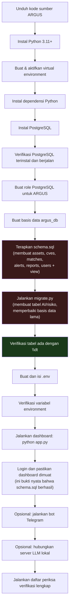
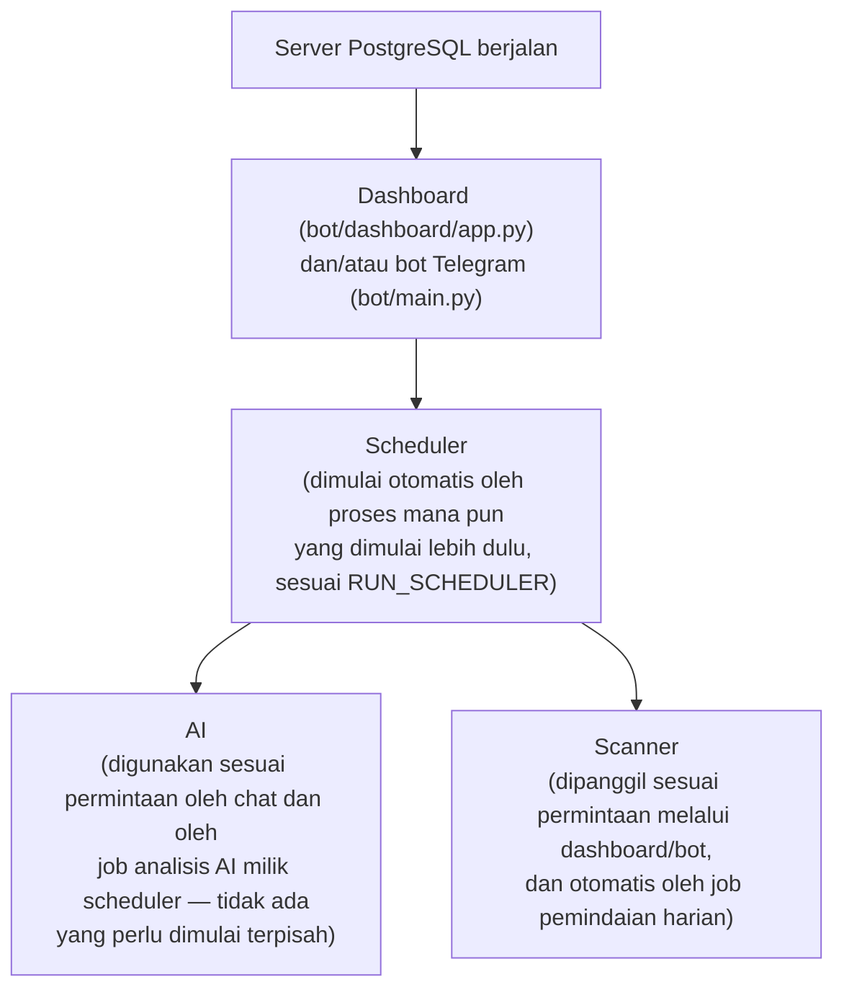
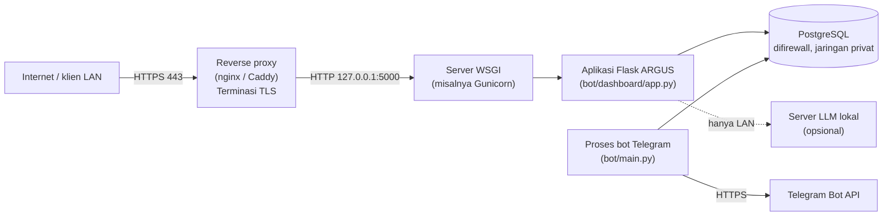

# Panduan Instalasi ARGUS

> **Catatan verifikasi.** Setiap perintah, path file, variabel environment, nilai default, dan perilaku yang dijelaskan dalam dokumen ini diverifikasi langsung terhadap kode sumber ARGUS — `bot/dashboard/app.py`, `bot/main.py`, `bot/database/db.py`, `bot/database/schema.sql`, `bot/database/migrate.py`, `bot/Ai/llm.py`, `bot/alerts/telegram_alert.py`, `bot/jobs/daily_scan.py`, `bot/nvd/`, dan `requirements.txt` — pada revisi ini. Tidak ada satu pun yang disimpulkan dari konvensi umum atau dari cara kerja "aplikasi Flask pada umumnya". Apa pun yang belum diimplementasikan secara eksplisit diberi label **Fitur Direncanakan**, dan tidak pernah dijelaskan seolah-olah sudah berfungsi.

---

## Daftar Isi

1. [Pendahuluan](#1-pendahuluan)
2. [Ringkasan Instalasi](#2-ringkasan-instalasi)
3. [Persyaratan Sistem](#3-persyaratan-sistem)
4. [Instalasi Python](#4-instalasi-python)
5. [Instalasi PostgreSQL](#5-instalasi-postgresql)
6. [Verifikasi PostgreSQL](#6-verifikasi-postgresql)
7. [Layanan PostgreSQL](#7-layanan-postgresql)
8. [Menghubungkan ke PostgreSQL](#8-menghubungkan-ke-postgresql)
9. [Pembuatan Basis Data](#9-pembuatan-basis-data)
10. [Pengguna PostgreSQL](#10-pengguna-postgresql)
11. [Inisialisasi Skema](#11-inisialisasi-skema)
12. [Verifikasi Basis Data](#12-verifikasi-basis-data)
13. [Konfigurasi Environment](#13-konfigurasi-environment)
14. [Verifikasi Environment](#14-verifikasi-environment)
15. [Menjalankan ARGUS](#15-menjalankan-argus)
16. [Verifikasi Instalasi](#16-verifikasi-instalasi)
17. [Pemecahan Masalah](#17-pemecahan-masalah)
18. [Deployment Produksi](#18-deployment-produksi)
19. [Backup](#19-backup)
20. [Memperbarui ARGUS](#20-memperbarui-argus)
21. [Uninstalasi](#21-uninstalasi)
22. [FAQ](#22-faq)
23. [Lampiran untuk Pemula](#23-lampiran-untuk-pemula)

---

## 1. Pendahuluan

### Apa itu ARGUS

ARGUS adalah platform manajemen kerentanan berbasis Python yang terdiri dari dashboard web Flask, basis data PostgreSQL, bot Telegram opsional, penjadwal job latar belakang (APScheduler), dan asisten AI lokal opsional. ARGUS melacak aset, mencocokkannya terhadap data kerentanan NVD/CISA-KEV/EPSS, menghitung skor risiko, menghasilkan laporan, dan dapat mengirim alert Telegram.

### Tujuan dokumen ini

Ini adalah manual instalasi lengkap dan mandiri untuk ARGUS. Setiap perintah dalam dokumen ini diperiksa terhadap apa yang **benar-benar dilakukan** kode sumber ARGUS — bukan terhadap cara instalasi proyek Flask/PostgreSQL generik pada umumnya. Di mana pun perilaku kode yang sebenarnya lebih ketat, lebih rapuh, atau berbeda dari yang diharapkan, hal itu dijelaskan secara eksplisit, karena celah-celah persis itulah yang menyebabkan kegagalan instalasi nyata di masa lalu (tabel hilang, nama basis data salah, `psql` tidak ditemukan, kegagalan skema yang senyap, dan lainnya — lihat [§17 Pemecahan Masalah](#17-pemecahan-masalah)).

### Audiens yang dituju

Panduan ini **tidak mengasumsikan pengetahuan PostgreSQL sebelumnya** dan **tidak mengasumsikan pengetahuan ARGUS sebelumnya**. Ditulis untuk:

- Pemula dan pelajar yang menginstal aplikasi Python berbasis basis data untuk pertama kalinya
- Peneliti dan analis keamanan yang menyiapkan ARGUS untuk penggunaan sendiri
- Developer dan kontributor yang menginginkan lingkungan pengembangan lokal yang benar
- Administrator sistem yang men-deploy ARGUS untuk tim atau organisasi
- Enterprise dan organisasi pemerintah yang mengevaluasi atau men-deploy ARGUS dalam skala besar

### Jenis instalasi yang dicakup

| Jenis instalasi | Artinya | Dicakup di |
|---|---|---|
| **Development** | Menjalankan ARGUS langsung dengan `python app.py` / `python main.py` di mesin Anda sendiri, untuk pengujian dan kontribusi | §4–§16 |
| **Production** | Menjalankan ARGUS di belakang reverse proxy dan server WSGI sungguhan, di server khusus, dengan basis data yang difirewall | §18 |
| **Offline** | Menginstal ARGUS di mesin dengan akses internet terbatas atau tanpa akses internet | Disebutkan inline di mana pun sebuah langkah membutuhkan akses internet (PyPI, NVD, Telegram, unduhan LLM) |
| **AI-enabled** | Menginstal dan menghubungkan server LLM lokal sehingga chat AI Security Copilot dan analisis CVE latar belakang berfungsi | Dijelaskan di [§13 Konfigurasi Environment](#13-konfigurasi-environment) — lihat variabel `LLM_URL` dan [§15.4](#154-server-ai-opsional) |

### Filosofi instalasi

Kode ARGUS sendiri **tidak sepenuhnya self-healing (memperbaiki diri sendiri)**. Sebagian di antaranya bersifat idempoten dan aman dijalankan ulang (dashboard memperbaiki *kolom* yang hilang setiap kali dimulai), tetapi tiga tabel terpenting di seluruh basis data — `assets`, `cves`, dan `matches` — **hanya pernah dibuat oleh satu file spesifik**, `bot/database/schema.sql`, dan tidak ada apa pun lain dalam basis kode yang akan membuatnya untuk Anda. Jika Anda melewatkan langkah tunggal ini, ARGUS sering kali *tampak* berhasil dimulai dan kemudian gagal kemudian, membingungkan, pada saat pertama kali sebuah halaman atau perintah menyentuh data nyata. Panduan ini disusun secara khusus agar Anda tidak dapat mencapai mode kegagalan tersebut: setiap langkah diurutkan, diverifikasi, dan diperiksa sebelum Anda melanjutkan ke langkah berikutnya.

---

## 2. Ringkasan Instalasi

Diagram di bawah ini adalah urutan persis yang diikuti panduan ini, dan urutan persis yang dibutuhkan kode sumber ARGUS. Melewatkan atau mengubah urutan langkah mana pun dalam blok "Database setup" adalah penyebab tunggal paling umum kegagalan instalasi.



**Mengapa langkah yang disorot penting:** langkah I (`schema.sql`) adalah satu-satunya tempat di seluruh basis kode yang membuat `assets`, `cves`, dan `matches`. Langkah J (`migrate.py`) bergantung pada ketiga tabel tersebut sudah ada — ia hanya menambahkan kolom dan constraint padanya, dan membuat tabel AI/risiko terpisah dari awal. Langkah K adalah titik pemeriksaan Anda: jika `\dt` tidak menampilkan semua tabel yang diharapkan, berhenti dan perbaiki sebelum menginstal apa pun lagi.

---

## 3. Persyaratan Sistem

### Minimum

| Komponen | Persyaratan | Alasan |
|---|---|---|
| CPU | 2 core | Flask, PostgreSQL, dan scheduler bersifat ringan; 2 core cukup untuk deployment kecil tunggal |
| RAM | 4 GB | PostgreSQL, proses Python, dan OS semuanya butuh ruang gerak; di bawah ini, pengaturan memori default PostgreSQL dapat menyebabkan swapping |
| Penyimpanan | 5 GB ruang kosong | Python, dependensinya, PostgreSQL, dan basis data kerentanan kecil mudah muat; data CVE bertambah seiring waktu (lihat `DATABASE.md` jika tersedia) |
| Python | 3.11 atau lebih baru | Versi dependensi ARGUS (dikunci di `requirements.txt`, misalnya `Flask==3.1.3`, `psycopg2-binary==2.9.12`) diuji terhadap Python modern; versi Python yang lebih lama tidak didukung |
| PostgreSQL | 13 atau lebih baru | Skema ARGUS menggunakan SQL PostgreSQL modern standar (`SERIAL`, `TIMESTAMPTZ`, indeks parsial, blok `DO $$ ... $$`) — tidak ada fitur khusus-versi yang eksotis, tetapi rilis PostgreSQL yang sangat lama tidak didukung dan tidak diuji |
| Sistem Operasi | Windows 10/11 (64-bit) atau distribusi Linux 64-bit modern | ARGUS adalah Python murni tanpa kode khusus OS; satu-satunya bagian panduan ini yang khusus-platform adalah *cara Anda menginstal dan mengelola* Python/PostgreSQL |
| Jaringan | Akses HTTPS keluar (outbound) ke `services.nvd.nist.gov`, feed KEV CISA, dan (jika menggunakan Telegram) `api.telegram.org` | Dibutuhkan untuk data kerentanan dan agar bot berfungsi; tidak dibutuhkan hanya untuk melihat data yang sudah ada di dashboard |
| GPU | Tidak dibutuhkan | ARGUS sendiri tidak melakukan pekerjaan GPU apa pun; GPU hanya relevan jika Anda menginstal server LLM lokal yang dipercepat GPU (opsional, lihat §15.4) |

### Direkomendasikan

| Komponen | Persyaratan |
|---|---|
| CPU | 4 core |
| RAM | 8 GB (atau lebih jika Anda berencana menjalankan server LLM lokal di mesin yang sama) |
| Penyimpanan | 20 GB SSD |
| PostgreSQL | Terinstal di mesin yang sama untuk deployment kecil, atau host basis data khusus untuk penggunaan tim |
| AI | Server LLM lokal (`llama.cpp` atau Ollama) dengan model terkuantisasi setidaknya 7–8B parameter jika Anda menginginkan AI Security Copilot |

### Enterprise

| Komponen | Persyaratan |
|---|---|
| CPU | 8+ core |
| RAM | 32 GB+ |
| Penyimpanan | 200 GB+ SSD dengan target backup terjadwal |
| Deployment | Host PostgreSQL khusus, reverse proxy di depan dashboard, terminasi HTTPS, port basis data difirewall — lihat [§18 Deployment Produksi](#18-deployment-produksi) |
| AI | Host inferensi LLM khusus, hanya terjangkau dari jaringan internal |

---

## 4. Instalasi Python

### Tujuan

ARGUS adalah aplikasi Python. Python harus terinstal dan dapat dijangkau dengan benar dari command line Anda sebelum hal lain apa pun dalam panduan ini akan berfungsi.

### Penjelasan

ARGUS membutuhkan **Python 3.11 atau lebih baru**. Menginstal Python saja tidak cukup — Python juga harus ditambahkan ke `PATH` sistem Anda (daftar direktori yang dicari shell Anda saat Anda mengetik perintah), atau terminal Anda tidak akan mengenali perintah `python` atau `pip` meskipun Python secara teknis sudah terinstal.

### Windows

**Perintah / langkah:**

1. Unduh installer dari [halaman unduhan resmi Python](https://www.python.org/downloads/).
2. Jalankan installer. **Centang kotak berlabel "Add python.exe to PATH"** di bagian bawah layar pertama — satu kotak centang ini bertanggung jawab atas sebagian besar error "python is not recognized" jika tidak dicentang.
3. Klik "Install Now".

**Output yang diharapkan:** Setelah instalasi, buka jendela Command Prompt atau PowerShell **baru** (jendela yang sudah terbuka tidak melihat `PATH` yang telah diperbarui) dan jalankan:

```powershell
python --version
```

Output yang diharapkan:

```
Python 3.11.x
```

(atau 3.12.x, dst. — versi 3.11+ apa pun)

**Verifikasi:**

```powershell
pip --version
```

Output yang diharapkan:

```
pip 2x.x.x from C:\...\Python31x\Lib\site-packages\pip (python 3.1x)
```

### Linux (Ubuntu/Debian)

```bash
sudo apt update
sudo apt install -y python3 python3-pip python3-venv
```

**Verifikasi:**

```bash
python3 --version
pip3 --version
```

Output yang diharapkan:

```
Python 3.11.x
pip 2x.x.x from ... (python 3.11)
```

### Linux (Fedora/kompatibel RHEL)

```bash
sudo dnf install -y python3 python3-pip
```

### Virtual environment (kedua platform)

**Tujuan:** Virtual environment menjaga dependensi Python milik ARGUS terisolasi dari apa pun lain yang terinstal di sistem Anda, sehingga versi dependensi tepat yang dikunci ARGUS (dari `requirements.txt`) tidak berkonflik dengan proyek Python lain.

**Perintah:**

```bash
# Dari dalam folder proyek ARGUS
python3 -m venv venv          # Linux/macOS
python -m venv venv           # Windows
```

Aktifkan:

```bash
source venv/bin/activate      # Linux/macOS
venv\Scripts\Activate.ps1     # Windows PowerShell
venv\Scripts\activate.bat     # Windows Command Prompt
```

**Output yang diharapkan:** Prompt terminal Anda sekarang dimulai dengan `(venv)`. Setiap perintah `python` dan `pip` untuk sisa panduan ini mengasumsikan ini aktif.

**Verifikasi:**

```bash
which python      # Linux/macOS — seharusnya menunjuk ke dalam folder venv/
where python       # Windows — seharusnya menunjuk ke dalam folder venv\
```

### Kesalahan umum

| Kesalahan | Gejala | Perbaikan |
|---|---|---|
| Lupa mencentang "Add to PATH" di Windows | `'python' is not recognized as an internal or external command` | Jalankan ulang installer, pilih "Modify", dan aktifkan opsi PATH — atau instal ulang dari awal |
| Menggunakan jendela terminal lama setelah instalasi | `python` masih tidak ditemukan meskipun "baru saja diinstal" | Tutup dan buka ulang terminal Anda (perubahan PATH tidak berlaku pada jendela yang sudah terbuka) |
| Lupa mengaktifkan virtual environment | Paket "berhasil" terinstal tetapi ARGUS masih mengatakan modul hilang saat Anda menjalankannya | Jalankan ulang perintah `activate` untuk platform Anda sebelum setiap `pip install` dan setiap `python app.py` |
| Menggunakan `python` di Linux padahal hanya `python3` yang ada | `python: command not found` | Gunakan `python3` dan `pip3` secara eksplisit di Linux, seperti ditunjukkan di atas |

### Pemulihan

Jika Python tampak terinstal tetapi perintah tidak dikenali, verifikasi lokasi instalasi sebenarnya dan tambahkan secara manual ke `PATH` (Windows: System Properties → Environment Variables → `Path` → New → folder yang berisi `python.exe`), lalu buka terminal baru dan uji ulang.

### Praktik terbaik

- Selalu bekerja di dalam virtual environment untuk proyek ini.
- Jangan instal dependensi ARGUS ke Python sistem-lebar Anda — ini dapat secara diam-diam merusak alat lain di mesin Anda yang juga menggunakan Python.

**Lanjutkan ke [§5 Instalasi PostgreSQL](#5-instalasi-postgresql).**

---

## 5. Instalasi PostgreSQL

### Tujuan

ARGUS menyimpan 100% datanya — aset, kerentanan, temuan, laporan, akun pengguna, percakapan AI — dalam satu basis data PostgreSQL tunggal. Tidak ada datastore lain di mana pun dalam ARGUS. Jika PostgreSQL tidak terinstal dan dikonfigurasi dengan benar, tidak ada hal lain dalam panduan ini yang akan berfungsi.

### Penjelasan — konsep PostgreSQL, dijelaskan dari nol

Jika Anda belum pernah menggunakan server basis data sebelumnya, istilah-istilah ini akan sering muncul di panduan ini dan dalam pesan error ARGUS sendiri. Baca bagian ini sekali, dengan saksama — ini akan menyelamatkan Anda dari hampir setiap error yang membingungkan nanti.

| Istilah | Apa artinya sebenarnya |
|---|---|
| **Server** | Program latar belakang (`postgres`) yang berjalan terus-menerus di mesin Anda (atau mesin lain), mendengarkan koneksi. Jika ini tidak berjalan, *tidak ada apa pun* yang dapat berbicara dengan PostgreSQL — bukan `psql`, bukan ARGUS, tidak ada apa pun. |
| **Client** | Program apa pun yang terhubung *ke* server PostgreSQL. `psql` (alat command-line) adalah client. ARGUS sendiri juga merupakan client — ia terhubung ke PostgreSQL persis dengan cara yang sama seperti `psql`, hanya dari kode Python alih-alih terminal. |
| **Database (basis data)** | Wadah bernama untuk tabel, di dalam server PostgreSQL. Satu server PostgreSQL dapat menampung banyak basis data terpisah. ARGUS mengharapkan satu basis data spesifik, secara default bernama `argus_db` (lihat [§9](#9-pembuatan-basis-data)). |
| **Role / User** | Dalam PostgreSQL, "role" dan "user" merujuk pada konsep dasar yang sama — sebuah akun yang dapat login dan/atau memiliki objek basis data. Panduan ini membuat role khusus untuk ARGUS alih-alih menggunakan role default `postgres` yang serba bisa untuk penggunaan sehari-hari. |
| **Schema** | Namespace *di dalam* basis data yang mengelompokkan tabel bersama-sama (schema default PostgreSQL disebut `public`). ARGUS menempatkan setiap tabelnya di schema default `public` — Anda tidak perlu membuat atau mengonfigurasi schema apa pun sendiri. |
| **Owner (pemilik)** | Setiap tabel (dan setiap basis data) memiliki pemilik — role yang memiliki kendali penuh atasnya. Role yang Anda gunakan untuk menjalankan `schema.sql` sebaiknya sama dengan role yang digunakan ARGUS sendiri untuk terhubung, atau Anda dapat mengalami error izin nanti. |
| **Host** | Alamat jaringan mesin yang menjalankan server PostgreSQL. Untuk instalasi mesin tunggal normal, ini adalah `localhost` (komputer Anda sendiri). |
| **Port** | Port jaringan tempat PostgreSQL mendengarkan. Default standar PostgreSQL adalah **5432**. ARGUS juga default ke `5432` jika Anda tidak menyetel `DB_PORT` (lihat [§13](#13-konfigurasi-environment)). |
| **`psql`** | Client command-line resmi milik PostgreSQL. Anda menggunakannya untuk membuat basis data/role dan menjalankan `schema.sql`. Ini terinstal secara otomatis bersama server PostgreSQL baik di Windows maupun Linux. |

### Instalasi Windows

1. Unduh installer dari [halaman unduhan resmi PostgreSQL](https://www.postgresql.org/download/windows/).
2. Jalankan installer.
3. Saat diminta, **setel dan ingat password untuk akun superuser `postgres`** — Anda akan membutuhkannya di [§8](#8-menghubungkan-ke-postgresql). Catat di tempat yang aman; melupakannya adalah salah satu penghambat instalasi paling umum.
4. Pertahankan port default (**5432**) kecuali Anda punya alasan spesifik untuk mengubahnya.
5. Di layar "Select Components", pastikan **Command Line Tools** dicentang — ini yang menginstal `psql`.
6. Selesaikan instalasi. Di Windows, installer biasanya menambahkan folder `bin` PostgreSQL ke `PATH` Anda secara otomatis, tetapi ini tidak dijamin di setiap versi — lihat [§6](#6-verifikasi-postgresql) untuk memastikan.

### Instalasi Linux (Ubuntu/Debian)

```bash
sudo apt update
sudo apt install -y postgresql postgresql-contrib
```

Ini menginstal baik **server** PostgreSQL (yang dimulai otomatis sebagai layanan sistem) maupun `psql` (**client**).

### Instalasi Linux (Fedora/kompatibel RHEL)

```bash
sudo dnf install -y postgresql-server postgresql-contrib
sudo postgresql-setup --initdb
```

Di Fedora/RHEL, server terinstal tetapi **tidak dimulai atau diaktifkan** secara otomatis — Anda harus melakukannya sendiri (dibahas di [§7](#7-layanan-postgresql)).

### Output yang diharapkan

Tidak ada satu output "sukses" tunggal untuk instalasi itu sendiri — keberhasilan dikonfirmasi oleh langkah verifikasi di [§6](#6-verifikasi-postgresql) dan [§7](#7-layanan-postgresql). Jangan lewati langkah tersebut.

### Kesalahan umum

| Kesalahan | Gejala | Bagian dengan perbaikan |
|---|---|---|
| Lupa password `postgres` selama instalasi Windows | Tidak dapat login sama sekali setelahnya | Instal ulang, atau reset password menggunakan `pg_hba.conf` — lihat [§8](#8-menghubungkan-ke-postgresql) |
| Tidak menginstal Command Line Tools di Windows | `psql` tidak ditemukan meskipun PostgreSQL "sudah terinstal" | Lihat [§6](#6-verifikasi-postgresql) untuk perbaikan PATH, atau jalankan ulang installer dan tambahkan komponennya |
| Mengasumsikan server dimulai otomatis di Fedora/RHEL | Setiap upaya koneksi gagal dengan "connection refused" | Lihat [§7](#7-layanan-postgresql) |

### Pemulihan

Jika installer gagal di tengah jalan di Windows, uninstal melalui "Add or Remove Programs" dan jalankan ulang installer sebagai Administrator. Di Linux, `sudo apt remove --purge postgresql postgresql-contrib` (atau setara `dnf`) diikuti instalasi ulang yang bersih biasanya lebih cepat daripada mencoba memperbaiki instalasi yang setengah jalan.

### Praktik terbaik

- Catat password `postgres` segera selama instalasi — Anda akan membutuhkannya beberapa kali dalam panduan ini.
- Jangan ubah port default kecuali Anda punya alasan spesifik; ARGUS default ke `5432` dan mengubahnya berarti Anda juga harus menyetel `DB_PORT` nanti.

**Lanjutkan ke [§6 Verifikasi PostgreSQL](#6-verifikasi-postgresql).**

---

## 6. Verifikasi PostgreSQL

### Tujuan

Pastikan client command-line `psql` benar-benar dapat dijangkau dari terminal Anda sebelum mencoba menggunakannya. Ini adalah titik kegagalan awal paling umum.

### Windows

```powershell
where psql
```

**Output yang diharapkan:**

```
C:\Program Files\PostgreSQL\1x\bin\psql.exe
```

Jika sebaliknya Anda melihat:

```
INFO: Could not find files for the given pattern(s).
```

`psql` tidak ada di `PATH` Anda.

### Linux

```bash
which psql
```

**Output yang diharapkan:**

```
/usr/bin/psql
```

Jika sebaliknya Anda melihat tidak ada apa pun (output kosong) atau `which: no psql in (...)`, `psql` tidak terinstal atau tidak ada di `PATH` Anda.

### Pemulihan — pemecahan masalah PATH

**Windows:** Temukan secara manual folder `bin` PostgreSQL (umumnya `C:\Program Files\PostgreSQL\<versi>\bin`), lalu:

1. Cari "Environment Variables" di menu Start → "Edit the system environment variables".
2. Klik "Environment Variables".
3. Di bawah "System variables", pilih `Path`, klik "Edit", klik "New", dan tempel path folder `bin`.
4. Klik OK di setiap dialog, lalu **tutup dan buka ulang terminal Anda**.
5. Jalankan ulang `where psql`.

**Linux:** Jika PostgreSQL terinstal via `apt`/`dnf` tetapi `psql` masih tidak ditemukan, instalasi kemungkinan besar gagal di tengah jalan — jalankan ulang perintah instalasi dari [§5](#5-instalasi-postgresql) dan periksa error dalam outputnya.

### Verifikasi

Setelah `psql` ditemukan, konfirmasi versinya:

```bash
psql --version
```

Output yang diharapkan (nomor versi akan bervariasi):

```
psql (PostgreSQL) 1x.x
```

**Lanjutkan ke [§7 Layanan PostgreSQL](#7-layanan-postgresql).**

---

## 7. Layanan PostgreSQL

### Tujuan

`psql` yang terinstal **tidak** berarti **server** PostgreSQL sedang berjalan. Ini adalah dua hal yang terpisah (lihat penjelasan Server vs. Client di [§5](#5-instalasi-postgresql)). Bagian ini memastikan server itu sendiri benar-benar aktif dan mendengarkan.

### Windows — `services.msc`

1. Tekan `Win + R`, ketik `services.msc`, tekan Enter.
2. Temukan layanan bernama seperti **postgresql-x64-1x**.
3. Kolom "Status"-nya seharusnya bertuliskan **Running**.

**Jika tidak berjalan:**

1. Klik kanan layanan → **Start**.
2. Agar mulai otomatis pada setiap boot, klik kanan → **Properties** → setel "Startup type" ke **Automatic**.

### Linux — `systemctl`

**Periksa status:**

```bash
sudo systemctl status postgresql
```

**Output yang diharapkan** (kutipan):

```
● postgresql.service - PostgreSQL RDBMS
     Loaded: loaded (...)
     Active: active (running) since ...
```

**Jika bertuliskan `inactive (dead)` atau `failed`:**

```bash
sudo systemctl start postgresql
sudo systemctl enable postgresql   # agar juga mulai otomatis saat reboot
```

**Me-restart layanan** (berguna setelah perubahan konfigurasi):

```bash
sudo systemctl restart postgresql
```

### Memverifikasi port yang didengarkan

Pastikan PostgreSQL benar-benar mendengarkan di port 5432 (defaultnya):

**Linux:**

```bash
sudo ss -ltnp | grep 5432
```

atau, jika `ss` tidak tersedia:

```bash
sudo netstat -ltnp | grep 5432
```

**Output yang diharapkan** (kutipan):

```
LISTEN  0  244  127.0.0.1:5432  0.0.0.0:*  users:(("postgres",pid=1234,fd=7))
```

**Windows (PowerShell):**

```powershell
netstat -ano | findstr 5432
```

**Output yang diharapkan:** setidaknya satu baris menunjukkan `LISTENING` pada port 5432.

### Kesalahan umum

| Kesalahan | Gejala | Perbaikan |
|---|---|---|
| Mengasumsikan PostgreSQL mulai saat boot di Fedora/RHEL | Berfungsi hari ini, gagal setelah reboot | `sudo systemctl enable postgresql` |
| Firewall memblokir port 5432 (jarang pada koneksi `localhost`, lebih umum jika terhubung dari mesin lain) | Server berjalan, `netstat`/`ss` menunjukkannya mendengarkan, tetapi koneksi jarak jauh tetap timeout | Lihat entri firewall Windows/Linux di [§17 Pemecahan Masalah](#17-pemecahan-masalah) |
| Beberapa versi PostgreSQL terinstal berdampingan | Situasi "layanan mana yang sebenarnya berjalan" yang membingungkan | Periksa `services.msc` / `systemctl list-units 'postgresql*'` untuk setiap versi yang terinstal dan pastikan hanya yang ingin Anda gunakan yang berjalan |

### Pemulihan

Jika layanan menolak untuk dimulai, periksa lognya:

**Linux:**

```bash
sudo journalctl -u postgresql -n 50
```

**Windows:** Periksa subfolder `log` direktori data PostgreSQL (umumnya `C:\Program Files\PostgreSQL\<versi>\data\log`) untuk file log terbaru.

**Lanjutkan ke [§8 Menghubungkan ke PostgreSQL](#8-menghubungkan-ke-postgresql).**

---

## 8. Menghubungkan ke PostgreSQL

### Tujuan

Pastikan Anda benar-benar dapat mengautentikasi ke server PostgreSQL yang sedang berjalan menggunakan akun superuser `postgres` bawaan, sebelum membuat apa pun yang spesifik-ARGUS.

### Perintah

```bash
psql -U postgres
```

### Penjelasan tentang prompt password

Anda akan diminta:

```
Password for user postgres:
```

Ketik password yang Anda setel selama instalasi ([§5](#5-instalasi-postgresql)) dan tekan Enter. **Tidak ada apa pun yang akan muncul di layar saat Anda mengetik ini** — tidak ada titik, tidak ada asterisk. Ini perilaku `psql` normal, bukan bug.

### Output yang diharapkan

```
psql (1x.x)
Type "help" for help.

postgres=#
```

Prompt `postgres=#` mengonfirmasi Anda sekarang terhubung, sebagai role `postgres`, ke basis data default `postgres`.

### Pesan kegagalan umum, dijelaskan

| Pesan | Artinya | Perbaikan |
|---|---|---|
| `psql: error: connection to server ... failed: FATAL: password authentication failed for user "postgres"` | Password yang Anda ketik salah | Ketik ulang dengan saksama (ingat: tidak ada apa pun yang ditampilkan saat Anda mengetik). Jika Anda benar-benar lupa passwordnya, lihat Pemulihan di bawah. |
| `psql: error: connection to server at "localhost" (...), port 5432 failed: Connection refused` | **Server** PostgreSQL tidak berjalan, atau mendengarkan di port yang berbeda | Kembali ke [§7](#7-layanan-postgresql) dan pastikan layanan berjalan |
| `psql: error: connection to server ... failed: could not translate host name "localhost" to address` | Masalah DNS/jaringan lokal yang tidak biasa | Coba `psql -U postgres -h 127.0.0.1` sebagai gantinya |
| `'psql' is not recognized...` | `psql` tidak ada di `PATH` Anda | Kembali ke [§6](#6-verifikasi-postgresql) |

### Pemulihan — password `postgres` yang terlupa

Anda dapat mereset dengan `ALTER USER`, tetapi pertama-tama Anda membutuhkan satu koneksi yang berfungsi untuk melakukannya. Jalur termudah adalah menggunakan `pgAdmin` (terinstal bersama PostgreSQL di Windows) yang mungkin menyimpan kredensial tersimpan, atau — di Linux — secara sementara sunting `pg_hba.conf` untuk mengizinkan akses lokal berbasis-trust, reset password, lalu kembalikan perubahan:

```bash
# Temukan pg_hba.conf (umumnya /etc/postgresql/<versi>/main/pg_hba.conf di Debian/Ubuntu)
sudo nano /etc/postgresql/*/main/pg_hba.conf
```

Ubah sementara metode koneksi lokal menjadi `trust`, lalu:

```bash
sudo systemctl restart postgresql
psql -U postgres
```

Setelah terhubung:

```sql
ALTER USER postgres WITH PASSWORD 'password-baru-anda';
```

Kemudian kembalikan `pg_hba.conf` ke `md5` atau `scram-sha-256` dan restart PostgreSQL lagi.

### Verifikasi

Setelah terhubung, keluar dengan:

```
\q
```

**Lanjutkan ke [§9 Pembuatan Basis Data](#9-pembuatan-basis-data).**

---

## 9. Pembuatan Basis Data

### Tujuan

Buat basis data persis seperti yang diharapkan ARGUS untuk dihubungkan.

### Penjelasan — mengapa nama yang tepat penting

Kode koneksi basis data ARGUS (`bot/database/db.py`) membaca nama basis data dari variabel environment `DB_NAME`, dan **jika `DB_NAME` tidak diset, defaultnya adalah persis `argus_db`** — diverifikasi langsung dari kode sumber:

```python
"database": os.getenv("DB_NAME", "argus_db"),
```

Ini adalah sumber kebenaran tunggal yang sebenarnya untuk nama basis data default. Jika Anda membuat basis data dengan nama berbeda (misalnya, `argus`, `Argus_DB`, `argusdb`) dan tidak menyetel `DB_NAME` agar cocok persis di file `.env` Anda, ARGUS akan mencoba terhubung ke `argus_db`, yang tidak akan ada, dan setiap operasi basis data tunggal akan gagal. **Nama basis data bersifat case-sensitive dalam praktiknya untuk tujuan ini** — buat persis `argus_db` kecuali Anda sengaja berencana menyetel `DB_NAME` khusus nanti.

### Perintah

Saat terhubung sebagai `postgres` (`psql -U postgres`):

```sql
CREATE DATABASE argus_db
    WITH
    OWNER = postgres
    ENCODING = 'UTF8';
```

> Jika Anda sudah membuat role ARGUS khusus (lihat [§10](#10-pengguna-postgresql)), setel `OWNER` ke nama role tersebut sebagai gantinya.

### Penjelasan setiap bagian

- **`argus_db`** — nama persis yang diharapkan ARGUS secara default.
- **`OWNER`** — role yang memiliki kendali penuh atas basis data ini. Ini seharusnya cocok dengan role yang akan digunakan ARGUS untuk terhubung (`DB_USER` di `.env` Anda).
- **`ENCODING = 'UTF8'`** — deskripsi CVE dan catatan aset dapat berisi berbagai karakter Unicode (nama beraksen, teks non-Inggris, simbol khusus). Encoding default PostgreSQL pada beberapa sistem bergantung pada locale; secara eksplisit menentukan `UTF8` menghindari kegagalan insert terkait encoding nanti.

### Verifikasi

```sql
\l
```

**Output yang diharapkan** (kutipan — daftar Anda mungkin menyertakan basis data lain juga):

```
                                  List of databases
   Name    |  Owner   | Encoding |   Collate   |    Ctype    | Access privileges
-----------+----------+----------+-------------+-------------+-------------------
 argus_db  | postgres | UTF8     | en_US.UTF-8 | en_US.UTF-8 |
 postgres  | postgres | UTF8     | en_US.UTF-8 | en_US.UTF-8 |
 ...
```

Pastikan `argus_db` muncul dalam daftar dengan encoding `UTF8`.

### Kesalahan umum

| Kesalahan | Gejala (nanti) | Perbaikan |
|---|---|---|
| Membuat `argus` alih-alih `argus_db` | ARGUS gagal terhubung: `database "argus_db" does not exist` | Ganti nama basis data (`ALTER DATABASE argus RENAME TO argus_db;`) atau setel `DB_NAME=argus` di `.env` — tetapi yang pertama sangat direkomendasikan agar Anda tidak pernah perlu mengingat nilai non-default |
| Membiarkan encoding sebagai default non-UTF8 | Insert deskripsi CVE dengan karakter khusus gagal nanti | Drop dan buat ulang basis data dengan `ENCODING = 'UTF8'` secara eksplisit (lakukan **sebelum** mengimpor skema/data apa pun) |
| Membuat basis data saat terhubung ke **instance server** PostgreSQL yang berbeda (misalnya, versi lama masih berjalan berdampingan dengan versi baru) | `\l` dari satu sesi `psql` menunjukkan basis data, tetapi ARGUS masih tidak dapat menemukannya | Pastikan layanan/port PostgreSQL mana yang sebenarnya Anda hubungkan — lihat [§7](#7-layanan-postgresql) |

### Pemulihan

Untuk memulai ulang secara bersih:

```sql
DROP DATABASE IF EXISTS argus_db;
CREATE DATABASE argus_db WITH OWNER = postgres ENCODING = 'UTF8';
```

**Lanjutkan ke [§10 Pengguna PostgreSQL](#10-pengguna-postgresql).**

---

## 10. Pengguna PostgreSQL

### Tujuan

Tentukan role PostgreSQL mana yang akan benar-benar digunakan ARGUS untuk terhubung, dan pahami trade-off-nya.

### Penjelasan

Kode koneksi basis data ARGUS men-default `DB_USER` ke `postgres` jika Anda tidak menyetelnya:

```python
"user": os.getenv("DB_USER", "postgres"),
```

Ini berarti **setup paling sederhana** — dan yang digunakan panduan ini secara default untuk pengembangan — adalah membiarkan ARGUS terhubung langsung sebagai superuser `postgres`. Ini baik-baik saja untuk mesin pengembangan pribadi tetapi **tidak direkomendasikan** untuk lingkungan bersama atau produksi apa pun, karena role `postgres` memiliki kekuatan tak terbatas atas seluruh server PostgreSQL, bukan hanya basis data ARGUS.

### Setup pengembangan (jalur paling sederhana)

Tidak perlu melakukan apa-apa lagi — selama `argus_db` dimiliki oleh `postgres` (seperti dibuat di [§9](#9-pembuatan-basis-data)) dan `.env` Anda tidak menyetel `DB_USER`/menyetelnya ke `postgres`, ARGUS akan terhubung dengan sukses menggunakan password `postgres` yang sudah Anda miliki.

### Setup produksi / role-khusus (direkomendasikan untuk apa pun di luar pengujian solo lokal)

Buat role khusus untuk ARGUS, dengan password yang hanya digunakan ARGUS:

```sql
CREATE ROLE argus_user WITH LOGIN PASSWORD 'pilih-password-kuat-di-sini';
ALTER DATABASE argus_db OWNER TO argus_user;
GRANT ALL PRIVILEGES ON DATABASE argus_db TO argus_user;
```

Kemudian di `.env` Anda (lihat [§13](#13-konfigurasi-environment)):

```ini
DB_USER=argus_user
DB_PASSWORD=pilih-password-kuat-di-sini
```

### Kepemilikan dan hak akses, dijelaskan

- **`ALTER DATABASE argus_db OWNER TO argus_user`** menjadikan `argus_user` sebagai pemilik basis data itu sendiri — dibutuhkan agar `argus_user` dapat membuat/mengubah tabel di dalamnya (yang persis apa yang dibutuhkan `schema.sql` dan `migrate.py`).
- **`GRANT ALL PRIVILEGES`** adalah grant lebih luas yang mencakup hak connect/create pada basis data. Dikombinasikan dengan kepemilikan, ini memberi `argus_user` segala yang dibutuhkannya dan tidak lebih (ia masih tidak dapat, misalnya, membuat atau menghapus basis data *lain*, atau mengelola role PostgreSQL lain).

### Pertimbangan keamanan

- Jangan pernah menggunakan ulang password superuser `postgres` sebagai password aplikasi ARGUS Anda di lingkungan bersama apa pun.
- Role `argus_user` khusus membatasi dampak jika file `.env` ARGUS (yang menyimpan password ini dalam teks polos — lihat [§13](#13-konfigurasi-environment)) pernah terekspos.

### Kesalahan umum

| Kesalahan | Gejala | Perbaikan |
|---|---|---|
| Membuat `argus_user` tetapi lupa mentransfer kepemilikan `argus_db` | `permission denied for database argus_db` atau `permission denied to create ... ` saat menerapkan `schema.sql` | Jalankan perintah `ALTER DATABASE ... OWNER TO ...` di atas |
| Menyetel `DB_USER=argus_user` di `.env` tetapi tidak pernah benar-benar membuat role tersebut di PostgreSQL | `FATAL: role "argus_user" does not exist` | Jalankan perintah `CREATE ROLE` di atas terlebih dahulu |

**Lanjutkan ke [§11 Inisialisasi Skema](#11-inisialisasi-skema).**

---

## 11. Inisialisasi Skema

### Tujuan

Ini adalah bagian tunggal terpenting di seluruh panduan ini. Menerapkan skema dengan benar, dalam urutan yang benar, adalah apa yang menentukan apakah ARGUS berfungsi sama sekali.

### Penjelasan — apa yang sebenarnya dilakukan `schema.sql` dan `migrate.py`

Berdasarkan inspeksi langsung kedua file:

- **`bot/database/schema.sql`** adalah **satu-satunya** tempat di seluruh basis kode ARGUS yang berisi pernyataan `CREATE TABLE` untuk `assets`, `cves`, dan `matches` — tiga tabel fondasi yang menjadi dasar segala sesuatu yang lain. Ia juga membuat `alerts`, `reports`, `users`, dan empat view read-only (`ai_dashboard`, `ai_open_findings`, `ai_asset_summary`, `ai_vulnerability_summary`).
- **`bot/database/migrate.py`** **tidak** membuat `assets`, `cves`, atau `matches`. Ia hanya menjalankan pernyataan `ALTER TABLE` terhadapnya (mengasumsikan sudah ada), dan secara terpisah membuat lima tabel terkait AI/risiko yang *tidak* ada di `schema.sql` sama sekali: `ai_conversations`, `ai_messages`, `cve_ai_analysis`, `risk_snapshots`, dan `ai_response_cache`. Ia juga menyegarkan keempat view dan membackfill baris analisis AI yang tertunda.
- **`bot/dashboard/app.py`** menjalankan fungsi perbaikan internalnya sendiri (`_ensure_schema()`) secara otomatis setiap kali dashboard dimulai. Fungsi ini **juga** mengasumsikan `assets`, `cves`, dan `matches` sudah ada — setiap pernyataan di dalamnya adalah `ALTER TABLE ...` atau `CREATE TABLE IF NOT EXISTS` untuk tabel *lain*, tidak pernah `CREATE TABLE` untuk tiga tabel inti. Yang krusial, **fungsi ini menelan error secara diam-diam** — jika tabel inti tidak ada, `_ensure_schema()` gagal secara senyap di latar belakang, tidak mencatat apa pun yang terlihat bagi Anda, dan dashboard **tetap dimulai dan tampak berfungsi** hingga saat pertama sebuah halaman benar-benar meng-query `assets`/`cves`/`matches`, di titik mana ia crash dengan error seperti `relation "assets" does not exist`.

**Ini persis mode kegagalan yang dijelaskan dalam pengujian dunia nyata** ("dashboard crashing due to missing tables", "relation 'assets' does not exist"). Ini terjadi secara khusus saat `schema.sql` dilewatkan dan dashboard dimulai langsung. Panduan ini mencegahnya dengan menjadikan `schema.sql` langkah wajib dan terverifikasi sebelum hal lain apa pun berjalan.

### Urutan yang benar (dan mengapa)

1. **Terapkan `schema.sql`** — membuat tiga tabel fondasi plus `alerts`/`reports`/`users`/view. Tidak ada hal lain yang berfungsi tanpa ini.
2. **Jalankan `migrate.py`** — aman dijalankan berapa kali pun; membuat tabel AI/risiko dan menerapkan perbaikan kolom tambahan apa pun.
3. **Baru kemudian** mulai `app.py` atau `bot/main.py`.

Menjalankan `migrate.py` *sebelum* `schema.sql` juga dapat langsung didiagnosis: tidak seperti `_ensure_schema()` dashboard yang senyap, `migrate.py` **mencetak baris `FAILED` yang terlihat** dengan error basis data yang tepat untuk setiap langkah yang gagal — jadi jika Anda tidak sengaja menjalankannya lebih dulu, Anda akan melihat sesuatu seperti:

```
  → matches UNIQUE (asset_id, cve_id) constraint ... FAILED
    relation "matches" does not exist
```

Ini diharapkan dan dapat dipulihkan — cukup jalankan `schema.sql` terlebih dahulu, lalu jalankan ulang `migrate.py` (sepenuhnya idempoten).

### Perintah — Langkah 1: terapkan `schema.sql`

Dari root proyek ARGUS:

```bash
psql -U postgres -d argus_db -f bot/database/schema.sql
```

(Ganti `-U postgres` dengan `-U argus_user` jika Anda membuat role khusus di [§10](#10-pengguna-postgresql).)

**Output yang diharapkan** (kutipan — banyak baris `CREATE TABLE`/`CREATE INDEX`/`DO`):

```
CREATE TABLE
CREATE TABLE
CREATE TABLE
CREATE INDEX
CREATE INDEX
CREATE INDEX
CREATE INDEX
CREATE TABLE
DO
DO
CREATE INDEX
CREATE INDEX
CREATE INDEX
DO
CREATE INDEX
CREATE INDEX
CREATE INDEX
CREATE INDEX
CREATE INDEX
CREATE TABLE
CREATE TABLE
CREATE VIEW
CREATE VIEW
CREATE VIEW
CREATE VIEW
```

Setiap baris seharusnya bertuliskan `CREATE TABLE`, `CREATE INDEX`, `CREATE VIEW`, atau `DO` — **tidak pernah** `ERROR`. Jika Anda melihat baris `ERROR` mana pun, berhenti dan baca [§17 Pemecahan Masalah](#17-pemecahan-masalah) sebelum melanjutkan.

### Perintah — Langkah 2: jalankan `migrate.py`

Header file `migrate.py` sendiri menyatakan invokasi yang persis dibutuhkan:

```bash
cd bot
python database/migrate.py
```

**Output yang diharapkan** (kutipan):

```
Argus database migration

  → assets.type column ... OK
  → assets.last_scan column ... OK
  → assets.search_keyword column ... OK
  → cves.severity column ... OK
  → cves.epss column ... OK
  → cves.epss_percentile column ... OK
  → cves.created_at column ... OK
  ...
Migration complete.

Argus AI views

  → view ai_dashboard ... OK
  → view ai_open_findings ... OK
  → view ai_asset_summary ... OK
  → view ai_vulnerability_summary ... OK

Backfilling AI analysis queue

  → queued 0 CVE(s) that had no analysis row yet
```

Setiap langkah migrasi seharusnya bertuliskan **`OK`**. Jika ada langkah bertuliskan **`FAILED`**, pesan error yang dicetak segera setelahnya memberi tahu Anda persis apa yang salah (paling umum: `schema.sql` tidak diterapkan terlebih dahulu).

### Verifikasi

```bash
psql -U postgres -d argus_db -c "\dt"
```

Lihat [§12 Verifikasi Basis Data](#12-verifikasi-basis-data) untuk daftar tabel lengkap yang diharapkan.

### Kesalahan umum

| Kesalahan | Gejala | Perbaikan |
|---|---|---|
| Menjalankan `migrate.py` sebelum `schema.sql` | Setiap langkah dalam output `migrate.py` bertuliskan `FAILED` dengan `relation "..." does not exist` | Jalankan `schema.sql` terlebih dahulu (Langkah 1 di atas), lalu jalankan ulang `migrate.py` — aman dijalankan ulang |
| Menjalankan `psql` terhadap basis data yang salah (misalnya, basis data `postgres` default, lupa `-d argus_db`) | `schema.sql` tampak berhasil, tetapi tabel tidak ada di `argus_db` | Selalu periksa ulang flag `-d argus_db`; verifikasi dengan `\dt` segera setelahnya saat terhubung khusus ke `argus_db` |
| Menjalankan `python database/migrate.py` dari direktori yang salah | `ModuleNotFoundError: No module named 'database'` | Anda harus menjalankannya sebagai `cd bot && python database/migrate.py` — import relatif skrip (`from database.db import get_connection`) membutuhkan `bot/` sebagai direktori saat ini Anda |
| Mengasumsikan memulai dashboard sekali akan membuat tabel untuk Anda | Dashboard dimulai tanpa error terlihat, lalu crash di halaman nyata pertama dengan `relation "assets" does not exist` | Ini persis mode kegagalan senyap yang dijelaskan di atas — kembali dan jalankan `schema.sql` secara manual; memulai `app.py` tidak pernah menjadi pengganti untuk itu |

### Rollback

Baik `schema.sql` maupun `migrate.py` tidak mendukung "undo" otomatis. Setiap pernyataan dalam kedua file bersifat aditif (`CREATE TABLE IF NOT EXISTS`, `ADD COLUMN IF NOT EXISTS`) — tidak ada down-migration yang sesuai. Untuk benar-benar memulai ulang:

```sql
DROP DATABASE argus_db;
CREATE DATABASE argus_db WITH OWNER = postgres ENCODING = 'UTF8';
```

Kemudian ulangi Langkah 1 dan 2 di atas dari awal.

### Praktik terbaik

- Selalu terapkan `schema.sql` segera setelah membuat basis data, sebelum menyentuh hal lain apa pun.
- Selalu jalankan `migrate.py` sekali setelah `schema.sql`, bahkan pada basis data yang sepenuhnya baru — ia membuat tabel AI/risiko yang tidak dibuat `schema.sql`.
- Jalankan ulang `migrate.py` setelah setiap pembaruan ARGUS (lihat [§20](#20-memperbarui-argus)) — selalu aman dijalankan ulang dan mengambil kolom/tabel baru apa pun yang ditambahkan oleh versi ARGUS yang lebih baru.

**Lanjutkan ke [§12 Verifikasi Basis Data](#12-verifikasi-basis-data).**

---

## 12. Verifikasi Basis Data

### Tujuan

Pastikan setiap tabel yang dibutuhkan ARGUS benar-benar ada sebelum mencoba menjalankan bagian aplikasi apa pun.

### Perintah

```bash
psql -U postgres -d argus_db -c "\dt"
```

### Output yang diharapkan

```
                 List of relations
 Schema |         Name            | Type  |  Owner
--------+--------------------------+-------+----------
 public | ai_conversations         | table | postgres
 public | ai_messages              | table | postgres
 public | ai_response_cache        | table | postgres
 public | alerts                   | table | postgres
 public | assets                   | table | postgres
 public | cve_ai_analysis          | table | postgres
 public | cves                     | table | postgres
 public | matches                  | table | postgres
 public | reports                  | table | postgres
 public | risk_snapshots           | table | postgres
 public | users                    | table | postgres
```

Anda seharusnya melihat **seluruh sebelas tabel** yang tercantum di atas. (`Owner` akan bertuliskan `argus_user` alih-alih `postgres` jika Anda mengikuti setup role-khusus di [§10](#10-pengguna-postgresql).)

### Verifikasi keempat view secara terpisah

```bash
psql -U postgres -d argus_db -c "\dv"
```

**Output yang diharapkan:**

```
                  List of relations
 Schema |          Name             | Type |  Owner
--------+----------------------------+------+----------
 public | ai_asset_summary           | view | postgres
 public | ai_dashboard               | view | postgres
 public | ai_open_findings           | view | postgres
 public | ai_vulnerability_summary   | view | postgres
```

### Fungsi setiap tabel (singkat)

| Tabel | Tujuan |
|---|---|
| `assets` | Inventaris terlacak Anda (perangkat, perangkat lunak, sistem) |
| `cves` | Catatan kerentanan yang di-cache, diambil dari NVD |
| `matches` | Keterkaitan antara aset dan CVE yang memengaruhinya, plus skor risiko dan status remediasi |
| `alerts` | Catatan setiap alert Telegram yang telah dikirim ARGUS |
| `reports` | Metadata tentang laporan PDF yang dihasilkan |
| `users` | Akun dashboard yang mendaftar sendiri (terpisah dari akun `admin`/`viewer` bawaan — lihat [§13](#13-konfigurasi-environment)) |
| `ai_conversations` / `ai_messages` | Riwayat chat AI Security Copilot |
| `cve_ai_analysis` | Analisis yang dihasilkan AI tersimpan untuk CVE individual |
| `risk_snapshots` | Satu baris per hari statistik risiko agregat, untuk grafik tren |
| `ai_response_cache` | Cache berumur-pendek dari jawaban chat AI |

### Verifikasi — pastikan tabel benar-benar dapat digunakan, bukan hanya ada

```bash
psql -U postgres -d argus_db -c "SELECT COUNT(*) FROM assets;"
```

**Output yang diharapkan** pada instalasi baru:

```
 count
-------
     0
(1 row)
```

`0` benar dan diharapkan di sini — ini mengonfirmasi tabel ada dan dapat di-query, meskipun kosong. Error alih-alih `0` berarti ada yang masih salah.

### Kesalahan umum

| Kesalahan | Gejala | Perbaikan |
|---|---|---|
| Hanya sebagian tabel muncul (misalnya, `assets`/`cves`/`matches`/`alerts`/`reports`/`users` ada, tetapi tidak ada `ai_conversations`/`risk_snapshots`/dll.) | Anda menerapkan `schema.sql` tetapi tidak pernah menjalankan `migrate.py` | Kembali ke [§11 Langkah 2](#11-inisialisasi-skema) dan jalankan `migrate.py` |
| Tidak ada tabel sama sekali yang muncul | `schema.sql` tidak pernah diterapkan, atau diterapkan ke basis data yang salah | Kembali ke [§11 Langkah 1](#11-inisialisasi-skema) |
| `\dt` menunjukkan tabel, tetapi dimiliki oleh user yang tidak terduga | Anda menerapkan `schema.sql` saat terhubung sebagai role berbeda dari yang dimaksudkan | Belum tentu masalah tersendiri, tetapi pastikan `DB_USER` di `.env` Anda cocok dengan role yang memiliki hak akses pada tabel-tabel ini |

**Lanjutkan ke [§13 Konfigurasi Environment](#13-konfigurasi-environment).**

---

## 13. Konfigurasi Environment

### Tujuan

Konfigurasi setiap pengaturan yang benar-benar dibaca ARGUS dari environment-nya, dalam satu file `.env`.

### Penjelasan

ARGUS membaca konfigurasi dari file bernama `.env`, ditempatkan di **root proyek ARGUS** (folder yang sama yang berisi `requirements.txt` dan folder `bot/`). Ini dimuat secara otomatis oleh library `python-dotenv` milik Python, yang dipanggil oleh setiap bagian ARGUS yang membutuhkan konfigurasi (`bot/database/db.py`, `bot/alerts/telegram_alert.py`, `bot/main.py`) saat startup.

**Detail penting yang terverifikasi:** fungsi `load_dotenv()` milik `python-dotenv` — yang dipanggil ARGUS, tanpa argumen — mencari `.env` dimulai dari **direktori kerja saat ini** Anda dan berjalan **ke atas** melalui folder induk hingga menemukannya. Ini berarti `.env` di root proyek akan ditemukan dengan benar baik Anda menjalankan ARGUS dari root proyek, dari `bot/`, atau dari `bot/dashboard/` — **selama direktori saat ini terminal Anda berada di suatu tempat di dalam folder proyek ARGUS.** Jika Anda `cd` sepenuhnya keluar dari proyek (misalnya, ke folder temp sistem) dan memanggil skrip dengan path absolut, `.env` tidak akan ditemukan, karena pencarian ke-atas tidak pernah mencapai folder proyek. Selalu jalankan perintah ARGUS dengan direktori saat ini terminal Anda berada di suatu tempat di dalam proyek.

### Setiap variabel environment yang benar-benar dibaca ARGUS

Tabel di bawah ini dibuat dengan mencari seluruh basis kode untuk setiap pemanggilan `os.getenv(...)` dan `os.environ.get(...)`. **Tidak ada variabel yang tidak tercantum di sini yang dibaca di mana pun dalam ARGUS.** Jika Anda pernah melihat proyek manajemen kerentanan lain menggunakan nama seperti `DATABASE_URL`, `POSTGRES_HOST`, `TELEGRAM_TOKEN`, atau `OLLAMA_HOST` — ARGUS tidak menggunakan nama apa pun itu. Gunakan nama persis di bawah ini.

#### Wajib

| Variabel | Tujuan | Wajib? | Default | Catatan |
|---|---|---|---|---|
| `SECRET_KEY` | Kunci penandatanganan sesi Flask | **Ya — dashboard menolak untuk dimulai tanpanya** | Tidak ada | Buat dengan `python -c "import secrets; print(secrets.token_hex(32))"`. Jika tidak diset, `app.py` memicu `RuntimeError: SECRET_KEY is missing.` segera saat startup. |
| `DB_PASSWORD` | Password koneksi PostgreSQL | Efektifnya ya | Tidak ada (string kosong) | Tidak ditegakkan oleh kegagalan startup yang keras, tetapi sebuah peringatan dicatat, dan setiap operasi basis data akan gagal tanpanya jika role Anda benar-benar memiliki password yang diset |
| `TOKEN` | Token Telegram Bot API | Hanya jika menjalankan bot Telegram (`bot/main.py`) | Tidak ada | Jika tidak diset, `bot/main.py` memicu `RuntimeError: TOKEN environment variable is not set.` segera. Tidak dibutuhkan untuk menjalankan dashboard saja. |

#### Koneksi basis data (semua opsional — default yang masuk akal ada)

| Variabel | Default | Tujuan |
|---|---|---|
| `DB_HOST` | `localhost` | Hostname/IP server PostgreSQL |
| `DB_NAME` | `argus_db` | Nama basis data — harus cocok persis dengan yang Anda buat di [§9](#9-pembuatan-basis-data) |
| `DB_USER` | `postgres` | Role PostgreSQL yang digunakan ARGUS untuk terhubung |
| `DB_PORT` | `5432` | Port PostgreSQL |
| `DB_POOL_MIN_CONN` | `2` | Jumlah minimum koneksi basis data ter-pool yang tetap terbuka |
| `DB_POOL_MAX_CONN` | `20` | Jumlah maksimum koneksi basis data ter-pool |

#### Akun dashboard

| Variabel | Default | Catatan |
|---|---|---|
| `ADMIN_PASSWORD` | **`"admin"` jika tidak diset** | Ini adalah fallback nyata dan terverifikasi dalam kode sumber — `os.getenv("ADMIN_PASSWORD", "admin")`. **Anda harus menyetel ini secara eksplisit ke password yang kuat**; membiarkannya tidak diset berarti password akun admin bawaan adalah kata literal `admin`. |
| `VIEWER_PASSWORD` | Tidak ada (tanpa fallback) | Password akun `viewer` (hanya-baca) bawaan. Jika tidak diset, akun ini sama sekali tidak dapat login (passwordnya dibandingkan dengan `None`, yang tidak pernah cocok dengan apa pun yang diketik). |

#### Sumber data eksternal

| Variabel | Default | Catatan |
|---|---|---|
| `NVD_API_KEY` | Tidak ada | Opsional. Tanpanya, lookup kerentanan NVD dibatasi rate-nya lebih agresif. Dapatkan kunci gratis dari [halaman permintaan kunci API NVD](https://nvd.nist.gov/developers/request-an-api-key). |

#### Alert Telegram

| Variabel | Default | Catatan |
|---|---|---|
| `CHAT_ID` | Tidak ada | ID chat/channel Telegram tempat alert dikirim. Dibutuhkan hanya untuk pengiriman alert (`send_alert`/`send_document` keduanya memicu error jika ini atau `TOKEN` hilang) — tidak dibutuhkan untuk menjalankan dashboard atau perintah bot yang tidak mengirim alert. |

#### AI (semua opsional — ARGUS berjalan sepenuhnya tanpa satu pun ini diset)

| Variabel | Default | Catatan |
|---|---|---|
| `LLM_URL` | `http://192.168.0.26:8080/v1/chat/completions` | URL lengkap endpoint chat completions yang kompatibel dengan OpenAI (server `llama.cpp` lokal atau Ollama). **Default ini adalah alamat IP LAN spesifik, bukan placeholder** — jika Anda tidak menyetel `LLM_URL` Anda sendiri, ARGUS akan benar-benar mencoba terhubung ke alamat persis tersebut dan, saat koneksi gagal, chat AI akan membalas "ARGUS AI server is offline. Please start the LLM server." |
| `LLM_MODEL_NAME` | `default-local-llm` | Label kosmetik yang disimpan bersama analisis CVE yang dihasilkan AI, mencatat model mana yang menghasilkannya. Tidak memengaruhi konektivitas atau perilaku. |

#### Scheduler

| Variabel | Default | Catatan |
|---|---|---|
| `RUN_SCHEDULER` | `true` | Mengontrol apakah penjadwal job latar belakang (pemindaian harian, laporan, batch analisis AI) dimulai di dalam proses ini. Nilai "off" yang diterima adalah `false`, `0`, atau `no` (tidak case-sensitive). Lihat [§15](#15-menjalankan-argus) untuk alasan ini penting jika Anda menjalankan dashboard dan bot sekaligus. |

### Contoh file `.env` lengkap

```ini
# ── Wajib ──────────────────────────────────────────────
SECRET_KEY=ganti-dengan-nilai-acak-panjang
DB_PASSWORD=ganti-dengan-password-postgresql-anda

# ── Koneksi basis data ────────────────────────────────
DB_HOST=localhost
DB_NAME=argus_db
DB_USER=postgres
DB_PORT=5432
DB_POOL_MIN_CONN=2
DB_POOL_MAX_CONN=20

# ── Akun dashboard ────────────────────────────────────
ADMIN_PASSWORD=ganti-dengan-password-admin-yang-kuat
VIEWER_PASSWORD=ganti-dengan-password-viewer-yang-kuat

# ── NVD (opsional tapi direkomendasikan) ─────────────
NVD_API_KEY=

# ── Telegram (opsional) ───────────────────────────────
TOKEN=
CHAT_ID=

# ── AI (opsional) ─────────────────────────────────────
LLM_URL=
LLM_MODEL_NAME=

# ── Scheduler ─────────────────────────────────────────
RUN_SCHEDULER=true
```

Biarkan variabel opsional apa pun kosong (atau hilangkan sepenuhnya) jika Anda tidak membutuhkan fitur tersebut — jangan masukkan teks placeholder seperti `your-token-here` ke nilai yang benar-benar akan dicoba digunakan ARGUS, karena itu akan diperlakukan sebagai nilai nyata yang salah alih-alih "tidak dikonfigurasi".

### Pertimbangan keamanan

- `.env` berisi rahasia teks polos (password basis data, password admin, token Telegram). Jangan pernah meng-commit-nya ke version control. `.gitignore` ARGUS sendiri sudah mengecualikannya — jangan hapus pengecualian itu.
- Ubah `ADMIN_PASSWORD` segera — fallback `"admin"` nyata dan dapat dieksploitasi jika dibiarkan pada deployment yang dapat dijangkau jaringan apa pun.
- Batasi izin filesystem pada `.env` (`chmod 600 .env` di Linux) sehingga hanya akun yang menjalankan ARGUS yang dapat membacanya.

### Kesalahan umum

| Kesalahan | Gejala | Perbaikan |
|---|---|---|
| Mengetik nama variabel yang tidak digunakan ARGUS (misalnya, `DATABASE_URL`, `POSTGRES_PASSWORD`) | ARGUS secara diam-diam mengabaikannya dan kembali ke default, menyebabkan error "basis data salah"/"password salah" yang membingungkan | Gunakan nama variabel persis di tabel di atas — periksa typo karakter demi karakter |
| Membiarkan `ADMIN_PASSWORD` tidak diset, mengasumsikan itu akan memaksa prompt setup | Akun admin secara diam-diam menerima password `admin` | Setel secara eksplisit |
| Menyetel `DB_NAME` ke sesuatu selain yang benar-benar Anda buat di PostgreSQL | `FATAL: database "..." does not exist` | Buat `DB_NAME` dan nama basis data sebenarnya cocok persis, atau ganti nama basis data agar cocok |
| Memasukkan nilai placeholder palsu ke `LLM_URL` "untuk berjaga-jaga" | ARGUS benar-benar mencoba terhubung ke alamat palsu tersebut dan gagal, alih-alih berperilaku seolah-olah AI hanya tidak digunakan | Biarkan `LLM_URL` kosong/tidak diset jika Anda belum menginginkan fitur AI |

**Lanjutkan ke [§14 Verifikasi Environment](#14-verifikasi-environment).**

---

## 14. Verifikasi Environment

### Tujuan

Pastikan setiap nilai dalam file `.env` Anda benar-benar tepat **sebelum** menjalankan ARGUS itu sendiri, sehingga masalah yang tersisa apa pun mudah diisolasi.

### Verifikasi koneksi basis data secara independen dari ARGUS

```bash
psql -U <nilai DB_USER> -d <nilai DB_NAME> -h <nilai DB_HOST> -p <nilai DB_PORT>
```

Untuk nilai default, ini persis:

```bash
psql -U postgres -d argus_db -h localhost -p 5432
```

**Output yang diharapkan:** prompt `argus_db=#` yang sama seperti sebelumnya. Jika ini gagal, perbaiki di sini sebelum menyentuh ARGUS — setiap mode kegagalan dan perbaikannya sudah dicakup di [§8](#8-menghubungkan-ke-postgresql) dan [§9](#9-pembuatan-basis-data).

### Verifikasi kredensial cocok persis

Buka `.env` dan baca ulang nilai `DB_PASSWORD` karakter demi karakter terhadap password apa pun yang benar-benar Anda setel untuk role PostgreSQL tersebut. Error copy-paste di sini (spasi trailing, karakter kutip yang salah) adalah penyebab umum yang mudah terlewat dari `password authentication failed`.

### Verifikasi endpoint AI (hanya jika Anda berniat menggunakan fitur AI)

```bash
curl -X POST "<nilai LLM_URL Anda>" \
  -H "Content-Type: application/json" \
  -d '{"messages":[{"role":"user","content":"Say OK if you can read this."}]}'
```

**Output yang diharapkan:** respons JSON berisi `"choices"` dan konten pesan. Jika ini gagal (connection refused/timeout), fitur chat AI akan menampilkan "ARGUS AI server is offline" setelah ARGUS berjalan — itu perilaku yang diharapkan dan benar mengingat endpoint yang tidak dapat dijangkau, bukan bug.

### Verifikasi token Telegram (hanya jika menggunakan bot)

```bash
curl "https://api.telegram.org/bot<nilai TOKEN Anda>/getMe"
```

**Output yang diharapkan:**

```json
{"ok":true,"result":{"id":123456789,"is_bot":true,"first_name":"NamaBotAnda", ...}}
```

Jika Anda melihat `{"ok":false,"error_code":401,"description":"Unauthorized"}`, tokennya salah — buat ulang via **@BotFather** di Telegram.

### Verifikasi pengaturan scheduler

Cukup baca ulang baris `RUN_SCHEDULER` di `.env`. Jika Anda berencana menjalankan **baik** dashboard maupun bot Telegram secara bersamaan, baca [§15](#15-menjalankan-argus) sekarang sebelum memulai salah satunya, untuk menghindari job terjadwal yang terduplikasi.

### Verifikasi kesiapan dashboard (pemeriksaan kering sebelum benar-benar menjalankannya)

Pastikan `SECRET_KEY` benar-benar ada dan tidak kosong:

```bash
grep -q "^SECRET_KEY=." .env && echo "SECRET_KEY is set" || echo "SECRET_KEY is MISSING or empty"
```

**Lanjutkan ke [§15 Menjalankan ARGUS](#15-menjalankan-argus).**

---

## 15. Menjalankan ARGUS

### Tujuan

Mulai setiap komponen ARGUS dalam urutan yang benar, dan pahami persis mengapa urutan tersebut penting.

### 15.1 Urutan startup yang benar



**Mengapa urutan ini:** PostgreSQL harus dapat dijangkau sebelum dashboard maupun bot dimulai, karena keduanya segera mencoba operasi basis data saat startup. Baik scheduler, client AI, maupun scanner bukan proses terpisah yang Anda mulai sendiri — mereka dipanggil secara otomatis, dari dalam `app.py`/`main.py` mana pun yang Anda jalankan.

### 15.2 Jalankan dashboard

```bash
cd bot/dashboard
python app.py
```

**Output yang diharapkan:**

```
 * Serving Flask app 'app'
 * Debug mode: off
 * Running on all addresses (0.0.0.0)
 * Running on http://127.0.0.1:5000
 * Running on http://<ip-lokal-anda>:5000
```

Buka `http://localhost:5000` di browser.

**Jika `SECRET_KEY` hilang, Anda malah akan melihat:**

```
RuntimeError: SECRET_KEY is missing. Add a long random SECRET_KEY to the .env file.
```

Ini perilaku yang diharapkan dan benar — kembali ke [§13](#13-konfigurasi-environment).

### 15.3 Jalankan bot Telegram (opsional, proses terpisah)

```bash
cd bot
python main.py
```

**Output yang diharapkan:**

```
2026-07-09 12:00:00 [INFO] telegram.ext.Application: Application started
```

**Jika `TOKEN` hilang:**

```
RuntimeError: TOKEN environment variable is not set.
```

Kembali ke [§13](#13-konfigurasi-environment).

### 15.4 Server AI opsional

ARGUS tidak menyertakan atau menginstal server LLM itu sendiri — ini sepenuhnya tanggung jawab Anda sendiri, dan sepenuhnya opsional. Server apa pun yang mengimplementasikan endpoint `/v1/chat/completions` yang kompatibel dengan OpenAI berfungsi, karena itulah satu-satunya interface yang digunakan client AI ARGUS (`bot/Ai/llm.py`).

**Opsi A — server llama.cpp:**

```bash
git clone https://github.com/ggerganov/llama.cpp
cd llama.cpp
cmake -B build && cmake --build build --config Release -j
./build/bin/llama-server -m /path/to/your-model.gguf --host 0.0.0.0 --port 8080
```

**Opsi B — Ollama:**

```bash
curl -fsSL https://ollama.com/install.sh | sh
ollama pull llama3.1:8b
ollama serve
```

Endpoint kompatibel OpenAI milik Ollama adalah `http://localhost:11434/v1/chat/completions` secara default — setel `LLM_URL` di `.env` ke alamat tersebut (atau ke alamat server `llama.cpp` Anda) alih-alih membiarkan default IP-LAN bawaan tetap ada.

### 15.5 Menjalankan dashboard dan bot bersamaan

Baik `app.py` maupun `bot/main.py` mampu memulai scheduler. Jika Anda menjalankan kedua proses sekaligus **tanpa** mengatasi ini, setiap job terjadwal (pemindaian harian, laporan mingguan/bulanan, batch analisis AI) akan berjalan **dua kali** — sekali per proses. Setel `RUN_SCHEDULER=false` di `.env` yang digunakan oleh **salah satu** dari kedua proses (umumnya bot, membiarkan dashboard sebagai pemilik scheduler, atau sebaliknya — keduanya berfungsi, cukup pilih satu).

### Kesalahan umum

| Kesalahan | Gejala | Perbaikan |
|---|---|---|
| Menjalankan `python app.py` dari root proyek alih-alih `bot/dashboard/` | `ModuleNotFoundError` atau aplikasi tidak menemukan template/file statisnya sendiri | Selalu `cd bot/dashboard` terlebih dahulu |
| Menjalankan `python main.py` dari root proyek alih-alih `bot/` | `ModuleNotFoundError: No module named 'handlers'` (atau serupa) | Selalu `cd bot` terlebih dahulu |
| Menjalankan baik dashboard maupun bot dengan scheduler aktif di keduanya | Laporan ganda, run pemindaian ganda, ukuran batch analisis AI berganda | Setel `RUN_SCHEDULER=false` pada salah satunya, sesuai §15.5 |
| Mengharapkan chat AI mengatakan "not configured" saat `LLM_URL` tidak diset | Sebaliknya, ARGUS mencoba alamat LAN default bawaan dan menampilkan "ARGUS AI server is offline" | Ini perilaku yang benar dan terverifikasi — tidak ada state "not configured" terpisah; endpoint yang tidak dapat dijangkau (default atau kustom) selalu menghasilkan pesan "offline" |

**Lanjutkan ke [§16 Verifikasi Instalasi](#16-verifikasi-instalasi).**

---

## 16. Verifikasi Instalasi

### Tujuan

Daftar periksa lengkap dan terurut yang memastikan setiap bagian ARGUS benar-benar berfungsi, bukan hanya bahwa proses dimulai tanpa crash.

Setiap item menyertakan perintah persis, hasil yang diharapkan, dan apa yang harus dilakukan jika tidak cocok.

| # | Pemeriksaan | Perintah / Tindakan | Hasil yang diharapkan | Jika gagal |
|---|---|---|---|---|
| 1 | Python terinstal | `python --version` (atau `python3 --version`) | `Python 3.11.x` atau lebih baru | [§4](#4-instalasi-python) |
| 2 | pip terinstal | `pip --version` | String versi, tanpa error | [§4](#4-instalasi-python) |
| 3 | Virtual environment aktif | Prompt menunjukkan `(venv)` | Ada | Jalankan ulang perintah `activate` dari [§4](#4-instalasi-python) |
| 4 | Dependensi terinstal | `pip show flask psycopg2-binary` | Info paket ditunjukkan untuk keduanya | `pip install -r requirements.txt` lagi |
| 5 | PostgreSQL dapat dijangkau | `psql -U postgres -d argus_db -c "SELECT 1;"` | `1` dikembalikan | [§6](#6-verifikasi-postgresql)–[§8](#8-menghubungkan-ke-postgresql) |
| 6 | Seluruh 11 tabel ada | `psql -U postgres -d argus_db -c "\dt"` | 11 tabel tercantum (lihat [§12](#12-verifikasi-basis-data)) | [§11](#11-inisialisasi-skema) |
| 7 | Seluruh 4 view ada | `psql -U postgres -d argus_db -c "\dv"` | 4 view tercantum | [§11](#11-inisialisasi-skema) |
| 8 | Dashboard dimulai | `python app.py` dari `bot/dashboard/` | `Running on http://127.0.0.1:5000` | [§15](#15-menjalankan-argus), [§17](#17-pemecahan-masalah) |
| 9 | Login berfungsi | Kunjungi `/login`, masuk sebagai `admin` | Halaman utama dashboard dimuat | Periksa `ADMIN_PASSWORD` di `.env` |
| 10 | Pembuatan aset berfungsi | Tambah aset via `/add_asset` | Muncul di `/assets` | Periksa log dashboard |
| 11 | Pemindaian berfungsi | Picu pemindaian pada aset dengan perangkat lunak yang diketahui | Baris baru muncul di `/findings` | Verifikasi konektivitas NVD (§9 dari [§14](#14-verifikasi-environment), atau periksa `NVD_API_KEY`) |
| 12 | Laporan berfungsi | Picu laporan dari `/reports` | PDF yang dapat diunduh dihasilkan | Periksa log dashboard untuk output error generator laporan |
| 13 | Risk engine berfungsi | Sebuah temuan menunjukkan `risk_score` bukan-nol di `/findings` | Skor mencerminkan CVSS/kritikalitas/KEV/EPSS | Periksa ulang field `criticality` aset dan nilai CVSS/KEV/EPSS CVE |
| 14 | Laporan historis (grafik tren) | `/charts` dimuat tanpa error 500 | Grafik dirender | Pastikan `risk_snapshots` memiliki setidaknya satu baris (`SELECT * FROM risk_snapshots;`) — scheduler menulis satu baris/hari; bot Telegram juga menulis satu baris segera saat startup |
| 15 | Bot Telegram merespons | Kirim `/start` ke bot Anda | Membalas "Argus Online 🟢" | [§15.3](#153-jalankan-bot-telegram-opsional-proses-terpisah), [§17](#17-pemecahan-masalah) |
| 16 | Alert Telegram berfungsi | Picu pemindaian pada aset yang menghasilkan temuan baru | Pesan tiba di chat `CHAT_ID` | Pastikan baik `TOKEN` maupun `CHAT_ID` diset dengan benar |
| 17 | Scheduler berjalan | Tunggu waktu terjadwal, atau periksa `risk_snapshots` bertambah satu baris per hari | Baris baru muncul setiap hari | [§15.5](#155-menjalankan-dashboard-dan-bot-bersamaan) |
| 18 | Chat AI merespons | Ajukan pertanyaan ke asisten AI di dashboard | Jawaban relevan, berbasis data (bukan "offline") | [§15.4](#154-server-ai-opsional), [§14](#14-verifikasi-environment) |
| 19 | Memori percakapan AI berfungsi | Ajukan pertanyaan lanjutan dalam percakapan yang sama | Jawaban AI mencerminkan konteks sebelumnya | Pastikan tabel `ai_conversations`/`ai_messages` ada ([§12](#12-verifikasi-basis-data)) |

**Jika setiap baris dalam tabel ini lolos, ARGUS terinstal dengan benar.**

---

## 17. Pemecahan Masalah

Setiap entri di bawah ini mengikuti struktur yang sama: **Gejala → Penyebab → Diagnosis → Pemulihan → Verifikasi.**

### `psql` tidak dikenali

- **Gejala:** `'psql' is not recognized as an internal or external command` (Windows) atau `psql: command not found` (Linux).
- **Penyebab:** Alat client PostgreSQL tidak ada di `PATH` sistem Anda.
- **Diagnosis:** `where psql` (Windows) / `which psql` (Linux) tidak mengembalikan apa pun.
- **Pemulihan:** Lihat [§6 Verifikasi PostgreSQL](#6-verifikasi-postgresql) untuk langkah perbaikan PATH yang tepat per platform.
- **Verifikasi:** `psql --version` mengembalikan string versi.

### Connection refused

- **Gejala:** `connection to server at "localhost" (...), port 5432 failed: Connection refused`.
- **Penyebab:** Proses **server** PostgreSQL tidak berjalan (ini berbeda dari `psql`, client, yang tidak terinstal).
- **Diagnosis:** `sudo systemctl status postgresql` (Linux) atau periksa `services.msc` (Windows) — status bukan "running"/"active".
- **Pemulihan:** [§7 Layanan PostgreSQL](#7-layanan-postgresql).
- **Verifikasi:** `ss -ltnp | grep 5432` (Linux) atau `netstat -ano | findstr 5432` (Windows) menunjukkan socket yang mendengarkan.

### Password authentication failed

- **Gejala:** `FATAL: password authentication failed for user "postgres"` (atau nama role apa pun).
- **Penyebab:** Password yang salah diketik, atau `DB_PASSWORD` di `.env` tidak cocok dengan password role sebenarnya di PostgreSQL.
- **Diagnosis:** Coba terhubung secara manual dengan `psql -U <role> -d argus_db -h localhost` menggunakan password persis dari `.env`.
- **Pemulihan:** Reset password role: `ALTER USER <role> WITH PASSWORD 'password-baru';` (saat terhubung sebagai role dengan hak akses yang cukup), lalu perbarui `.env` agar cocok persis.
- **Verifikasi:** Koneksi manual `psql` dari Diagnosis sekarang berhasil.

### Database does not exist

- **Gejala:** `FATAL: database "argus_db" does not exist` (atau nama apa pun di `DB_NAME`).
- **Penyebab:** Basis data tidak pernah dibuat, dibuat dengan nama berbeda, atau `DB_NAME` di `.env` tidak cocok dengan nama basis data sebenarnya.
- **Diagnosis:** `psql -U postgres -c "\l"` dan periksa ejaan/case persis setiap basis data yang tercantum.
- **Pemulihan:** [§9 Pembuatan Basis Data](#9-pembuatan-basis-data) — buat basis data yang hilang, atau perbaiki `DB_NAME` di `.env` agar cocok dengan yang sudah ada.
- **Verifikasi:** `psql -U postgres -d argus_db -c "SELECT 1;"` berhasil.

### `relation "assets" does not exist` (atau `cves`, `matches`, tabel lain mana pun)

- **Gejala:** ARGUS dimulai tanpa error terlihat, kemudian sebuah halaman dashboard atau perintah bot crash dengan error PostgreSQL persis ini.
- **Penyebab:** `schema.sql` tidak pernah diterapkan — ini adalah kegagalan instalasi ARGUS dunia nyata paling umum tunggal. Fungsi perbaikan-skema internal dashboard sendiri mengasumsikan tabel-tabel ini sudah ada dan secara diam-diam tidak melakukan apa pun yang berguna jika tidak.
- **Diagnosis:** `psql -U postgres -d argus_db -c "\dt"` — tabel yang hilang tidak tercantum.
- **Pemulihan:** [§11 Inisialisasi Skema](#11-inisialisasi-skema) — terapkan `schema.sql`, lalu jalankan `migrate.py`.
- **Verifikasi:** [§12 Verifikasi Basis Data](#12-verifikasi-basis-data) — seluruh 11 tabel dan 4 view ada.

### Permission denied (basis data)

- **Gejala:** `permission denied for table assets`, `permission denied for database argus_db`, atau serupa saat menerapkan `schema.sql` atau menjalankan ARGUS.
- **Penyebab:** Role tempat ARGUS/Anda terhubung tidak memiliki, atau belum diberi hak akses pada, objek yang relevan.
- **Diagnosis:** Bandingkan kolom `Owner` pada output `\dt`/`\l` terhadap role di `DB_USER`.
- **Pemulihan:** [§10 Pengguna PostgreSQL](#10-pengguna-postgresql) — baik terhubung sebagai role pemilik, atau jalankan ulang perintah `ALTER DATABASE ... OWNER TO ...` / `GRANT` untuk role yang benar-benar ingin Anda gunakan.
- **Verifikasi:** Operasi yang gagal berhasil saat dicoba ulang sebagai role dengan hak akses yang benar.

### Wrong `DB_NAME`

- **Gejala:** Semuanya tentang instalasi "tampak benar" tetapi ARGUS masih tidak dapat menemukan datanya, atau terhubung ke basis data yang kosong/salah.
- **Penyebab:** `DB_NAME` di `.env` tidak cocok persis dengan basis data yang benar-benar Anda terapkan `schema.sql` ke sana.
- **Diagnosis:** `echo` atau buka `.env` dan bandingkan `DB_NAME` karakter demi karakter terhadap output `\l`.
- **Pemulihan:** Perbaiki `.env`, atau ganti nama basis data agar cocok: `ALTER DATABASE <nama_salah> RENAME TO argus_db;`.
- **Verifikasi:** [§12 Verifikasi Basis Data](#12-verifikasi-basis-data).

### Wrong database owner

- Lihat **Permission denied (basis data)** di atas — ini masalah dasar yang sama.

### Missing tables (hanya sebagian tabel ada)

- **Gejala:** `\dt` menunjukkan `assets`/`cves`/`matches`/`alerts`/`reports`/`users` tetapi hilang `ai_conversations`, `ai_messages`, `cve_ai_analysis`, `risk_snapshots`, atau `ai_response_cache`.
- **Penyebab:** `schema.sql` diterapkan, tetapi `migrate.py` tidak pernah dijalankan — `schema.sql` sama sekali tidak membuat kelima tabel ini.
- **Diagnosis:** Bandingkan output `\dt` Anda terhadap daftar 11-tabel lengkap di [§12](#12-verifikasi-basis-data).
- **Pemulihan:** `cd bot && python database/migrate.py`.
- **Verifikasi:** `\dt` sekarang menunjukkan seluruh 11 tabel.

### `.env` salah (variabel yang tidak ada di ARGUS)

- **Gejala:** Pengaturan yang Anda konfigurasi tampak sepenuhnya diabaikan.
- **Penyebab:** Anda menggunakan nama variabel dari konvensi proyek lain (misalnya, `DATABASE_URL`, `POSTGRES_PASSWORD`, `TELEGRAM_TOKEN`, `OLLAMA_HOST`) yang tidak pernah dibaca kode ARGUS.
- **Diagnosis:** Bandingkan `.env` Anda baris demi baris terhadap tabel variabel otoritatif di [§13](#13-konfigurasi-environment) — daftar ini dibangun langsung dari setiap pemanggilan `os.getenv`/`os.environ.get` dalam basis kode; tidak ada yang lain.
- **Pemulihan:** Ganti nama variabel ke nama sebenarnya milik ARGUS.
- **Verifikasi:** Perilaku yang dimaksudkan (koneksi DB yang benar, token bot yang benar, dll.) sekarang berlaku.

### Migration failed (`migrate.py` mencetak `FAILED`)

- **Gejala:** Satu atau lebih baris dalam output `migrate.py` bertuliskan `FAILED` diikuti error basis data.
- **Penyebab:** Hampir selalu: `schema.sql` tidak diterapkan terlebih dahulu (lihat bagian khusus di atas), atau state migrasi parsial/tidak konsisten sebelumnya.
- **Diagnosis:** Baca teks error persis yang dicetak setelah `FAILED` — itu error PostgreSQL sebenarnya, bukan pesan ARGUS generik.
- **Pemulihan:** Terapkan `schema.sql` jika belum, lalu jalankan ulang `migrate.py` — sepenuhnya idempoten dan aman dijalankan ulang setelah memperbaiki penyebab yang mendasarinya.
- **Verifikasi:** Menjalankan ulang menunjukkan `OK` untuk setiap langkah.

### Schema import failed (`ERROR` saat menjalankan `schema.sql`)

- **Gejala:** `psql -f bot/database/schema.sql` mencetak satu atau lebih baris `ERROR:` alih-alih `CREATE TABLE`/`CREATE INDEX`/`DO`.
- **Penyebab:** Umumnya: basis data yang salah dipilih (flag `-d`), hak akses tidak cukup, atau upaya sebelumnya yang diterapkan sebagian meninggalkan objek dalam state yang tidak konsisten.
- **Diagnosis:** Baca teks `ERROR:` spesifik — ia menyebutkan objek dan alasan yang tepat.
- **Pemulihan:** Untuk memulai bersih, drop dan buat ulang basis data ([§9](#9-pembuatan-basis-data)) dan terapkan ulang `schema.sql` dari awal.
- **Verifikasi:** Jalankan ulang penuh menunjukkan tidak ada baris `ERROR:`.

### Flask dashboard crash saat startup

- **Gejala:** `RuntimeError: SECRET_KEY is missing. Add a long random SECRET_KEY to the .env file.`
- **Penyebab:** `SECRET_KEY` tidak diset di `.env`, atau `.env` tidak ditemukan (lihat catatan direktori-kerja di [§13](#13-konfigurasi-environment)).
- **Diagnosis:** `grep SECRET_KEY .env` dari dalam proyek.
- **Pemulihan:** Tambahkan `SECRET_KEY=<nilai acak>` ke `.env`, dihasilkan via `python -c "import secrets; print(secrets.token_hex(32))"`.
- **Verifikasi:** `python app.py` (dari `bot/dashboard/`) dimulai tanpa error ini.

### Scheduler not running

- **Gejala:** `risk_snapshots` tidak pernah mendapat baris baru; laporan tidak pernah dihasilkan sesuai jadwal.
- **Penyebab:** `RUN_SCHEDULER=false` diset di `.env` yang digunakan setiap proses yang Anda jalankan, atau proses terus crash/restart sebelum mencapai waktu terjadwal.
- **Diagnosis:** Periksa `RUN_SCHEDULER` di `.env`; periksa uptime/log proses untuk crash loop.
- **Pemulihan:** Pastikan setidaknya satu proses yang berjalan memiliki `RUN_SCHEDULER` tidak diset atau `true`. Lihat [§15.5](#155-menjalankan-dashboard-dan-bot-bersamaan) jika menjalankan baik dashboard maupun bot.
- **Verifikasi:** `SELECT * FROM risk_snapshots ORDER BY id DESC LIMIT 1;` menunjukkan baris terbaru.

### AI unavailable

- **Gejala:** Chat AI membalas "ARGUS AI server is offline. Please start the LLM server."
- **Penyebab:** `LLM_URL` menunjuk ke alamat yang tidak dapat dijangkau — baik IP LAN default bawaan (jika Anda tidak pernah menyetel sendiri) atau kustom yang sebenarnya tidak berjalan.
- **Diagnosis:** Uji `curl` [§14 Verifikasi Environment](#14-verifikasi-environment) terhadap `LLM_URL` Anda.
- **Pemulihan:** [§15.4 Server AI opsional](#154-server-ai-opsional) — instal dan jalankan server LLM, dan arahkan `LLM_URL` ke sana.
- **Verifikasi:** Uji `curl` mengembalikan respons JSON dengan `"choices"`.

### Telegram failures

- **Gejala:** Bot tidak merespons perintah apa pun; atau alert tidak pernah tiba meskipun pemindaian menghasilkan temuan.
- **Penyebab:** `TOKEN` tidak valid/hilang (bot sama sekali tidak merespons), atau `CHAT_ID` hilang/salah (bot merespons perintah tetapi alert tidak pernah tiba).
- **Diagnosis:** Uji [§14](#14-verifikasi-environment) `curl .../getMe` untuk token; turunkan ulang `CHAT_ID` via `getUpdates` setelah mengirim pesan ke bot.
- **Pemulihan:** [§13](#13-konfigurasi-environment) untuk nama variabel persis; buat ulang token via **@BotFather** jika perlu.
- **Verifikasi:** `/start` mendapat balasan; pemindaian dengan temuan baru menghasilkan pesan Telegram.

### Port already in use

- **Gejala:** `OSError: [Errno 98] Address already in use` (Linux) atau `OSError: [WinError 10048]` (Windows) saat memulai dashboard.
- **Penyebab:** Sesuatu yang lain (sering proses ARGUS sebelumnya yang masih berjalan) sudah terikat ke port 5000.
- **Diagnosis:** `lsof -i :5000` (Linux) atau `netstat -ano | findstr :5000` (Windows).
- **Pemulihan:** Hentikan proses yang menggunakan port tersebut, atau ubah port dengan menyunting pemanggilan `app.run(...)` di bagian bawah `bot/dashboard/app.py` (saat ini tidak ada variabel environment untuk ini — lihat daftar variabel otoritatif [§13](#13-konfigurasi-environment), yang tidak menyertakan pengaturan port untuk dashboard itu sendiri).
- **Verifikasi:** Dashboard dimulai dan mencetak `Running on http://127.0.0.1:5000` (atau port pilihan Anda).

### Windows firewall

- **Gejala:** ARGUS berjalan secara lokal tetapi tidak dapat dijangkau dari perangkat lain di jaringan Anda.
- **Penyebab:** Windows Defender Firewall memblokir koneksi masuk (inbound) ke Python/port 5000.
- **Diagnosis:** Coba akses `http://<ip-lan-mesin-anda>:5000` dari perangkat lain; jika menggantung/timeout (tetapi `localhost:5000` berfungsi baik di mesin yang sama), ini hampir selalu firewall.
- **Pemulihan:** Windows Security → Firewall & network protection → Allow an app through firewall → tambahkan Python (atau izinkan port 5000 secara spesifik via "Advanced settings" → Inbound Rules → New Rule).
- **Verifikasi:** Perangkat lain sekarang dapat memuat dashboard.

### Linux firewall

- **Gejala:** Sama seperti di atas, di Linux.
- **Penyebab:** `ufw`/`firewalld`/`iptables` memblokir port 5000 (atau 5432 untuk akses basis data jarak jauh langsung).
- **Pemulihan:** misalnya, dengan `ufw`: `sudo ufw allow 5000/tcp`.
- **Verifikasi:** Dashboard dapat dijangkau dari perangkat lain di jaringan.

### PATH issues

- Lihat **`psql` tidak dikenali** di atas, dan [§4](#4-instalasi-python)/[§6](#6-verifikasi-postgresql) untuk langkah perbaikan khusus-platform untuk Python dan PostgreSQL masing-masing.

### Virtual environment issues

- **Gejala:** `pip install` tampak berhasil tetapi ARGUS masih melaporkan modul hilang.
- **Penyebab:** Virtual environment sebenarnya tidak aktif saat Anda menjalankan `pip install`, atau Anda memiliki beberapa instalasi Python dan mengaktifkan yang salah.
- **Diagnosis:** `which python` (Linux) / `where python` (Windows) — apakah path menunjuk ke dalam folder `venv/` proyek Anda?
- **Pemulihan:** Nonaktifkan (`deactivate`), hapus folder `venv/`, buat ulang, aktifkan ulang, dan instal ulang dependensi — lihat [§4](#4-instalasi-python).
- **Verifikasi:** `pip show flask` menunjukkan path `Location:` di dalam `venv/`.

### Package installation failures

- **Gejala:** `pip install -r requirements.txt` gagal di tengah jalan, sering mencoba mengompilasi paket dari sumber kode.
- **Penyebab:** Tidak ada wheel prebuilt yang tersedia untuk kombinasi versi Python/OS/arsitektur Anda yang spesifik untuk salah satu paket yang dikunci (umumnya `psycopg2-binary`, `matplotlib`, `numpy`, atau `pillow`).
- **Pemulihan:** Pastikan Anda menggunakan versi Python standar dan terbaru (3.11/3.12) pada OS 64-bit, di mana wheel prebuilt untuk paket-paket ini dipublikasikan. Di Linux, memasang compiler C dan header client PostgreSQL (`sudo apt install build-essential libpq-dev`) memungkinkan build dari sumber kode sebagai fallback. Di Windows, pasang [Microsoft Visual C++ Redistributable](https://learn.microsoft.com/cpp/windows/latest-supported-vc-redist) jika Anda melihat error pemuatan DLL setelah instalasi.
- **Verifikasi:** `pip install -r requirements.txt` selesai tanpa error.

### Dependency conflicts

- **Gejala:** `pip` melaporkan konflik versi antar paket.
- **Penyebab:** Menginstal dependensi ARGUS ke environment Python yang sudah memiliki paket lain yang berkonflik terinstal.
- **Pemulihan:** Selalu gunakan virtual environment baru yang didedikasikan untuk ARGUS (lihat [§4](#4-instalasi-python)) alih-alih Python sistem Anda atau environment yang dibagikan dengan proyek lain.
- **Verifikasi:** `pip install -r requirements.txt` selesai dengan bersih di environment baru.

### Database lock

- **Gejala:** Sebuah query atau run `schema.sql`/`migrate.py` tampak menggantung tanpa batas.
- **Penyebab:** Sesi lain (umumnya sesi `psql` yang terbuka dengan transaksi yang belum di-commit) memegang lock pada tabel yang sama.
- **Diagnosis:** Dari sesi `psql` terpisah: `SELECT * FROM pg_locks WHERE NOT granted;` dan `SELECT * FROM pg_stat_activity;` untuk mengidentifikasi sesi yang memblokir.
- **Pemulihan:** Tutup sesi yang memblokir (keluar dari jendela `psql` lain, atau `SELECT pg_terminate_backend(<pid>);` untuk ID proses yang bermasalah) — gunakan ini dengan hati-hati, karena ini memaksa mengakhiri pekerjaan sesi tersebut.
- **Verifikasi:** Perintah yang awalnya menggantung selesai.

### Database permissions

- Lihat **Permission denied (basis data)** di atas.

### Masalah `search_path`

- **Gejala:** Sebuah tabel yang dapat Anda lihat dengan `\dt` masih menghasilkan `relation "..." does not exist` dari alat atau koneksi tertentu.
- **Penyebab:** ARGUS selalu menggunakan nama tabel yang sepenuhnya diselesaikan, tidak berkualifikasi terhadap schema `public` standar, dan tidak membuat apa pun di luar `public` — `search_path` yang tidak cocok hampir selalu merupakan gejala terhubung ke **basis data yang sama sekali salah**, bukan masalah penamaan-schema sebenarnya di dalam ARGUS itu sendiri.
- **Diagnosis:** `\dn` untuk mendaftar schema, dan pastikan ulang Anda terhubung ke `argus_db` secara spesifik, bukan basis data lain yang kebetulan berbagi nama tabel.
- **Pemulihan:** Hubungkan ulang dengan flag `-d argus_db` eksplisit; tidak ada apa pun dalam skema ARGUS sendiri yang perlu dikonfigurasi terkait `search_path`.
- **Verifikasi:** [§12 Verifikasi Basis Data](#12-verifikasi-basis-data).

### Beberapa basis data PostgreSQL (kebingungan `argus` vs. `argus_db`)

- **Gejala:** Beberapa data tampak "menghilang," atau ARGUS berperilaku seolah-olah baru diinstal padahal Anda sebelumnya sudah menambahkan data.
- **Penyebab:** Data dimasukkan ke satu basis data (misalnya, secara manual, ke basis data bernama `argus`) sementara ARGUS sendiri dikonfigurasi (via `DB_NAME`) untuk menggunakan yang berbeda (`argus_db`, default sebenarnya).
- **Diagnosis:** `psql -U postgres -c "\l"` dan periksa setiap basis data untuk tabel yang bersangkutan (`\c <namadb>` lalu `\dt` di dalam masing-masing).
- **Pemulihan:** Konsolidasikan — baik migrasikan data ke basis data yang benar-benar digunakan ARGUS, atau arahkan `DB_NAME` ke basis data yang benar-benar menyimpan data Anda. **`argus_db` adalah default yang benar yang diharapkan basis kode ini; perlakukan nama lain apa pun sebagai pengecualian, bukan norma.**
- **Verifikasi:** [§12 Verifikasi Basis Data](#12-verifikasi-basis-data) terhadap basis data yang benar-benar dikonfigurasi digunakan ARGUS.

---

## 18. Deployment Produksi

### Tujuan

Jelaskan cara menjalankan ARGUS secara aman dan andal di luar mesin developer tunggal.

### Arsitektur



### Fakta penting dan terverifikasi tentang deployment produksi

- **ARGUS tidak menyertakan Dockerfile, `docker-compose.yml`, dependensi Gunicorn, atau konfigurasi Nginx.** Tidak ada satu pun dari ini yang ada di mana pun dalam pohon kode sumber saat ini. Dukungan Docker hanyalah **Fitur Direncanakan** — tidak ada apa pun di sini yang langsung berfungsi hari ini; panduan di bawah menjelaskan cara menambahkan bagian-bagian ini sendiri.
- **Jangan pernah menjalankan development server Flask (`python app.py`) langsung di produksi.** Ia bersifat single-threaded secara default dan tidak diperkeras untuk trafik yang bermusuhan/tidak tepercaya. Gunakan server WSGI sungguhan di depannya.
- **`app.py` melakukan perbaikan skema dan memulai scheduler latar belakang pada saat import** ([§11](#11-inisialisasi-skema)). Jika Anda menjalankannya di bawah server WSGI dengan banyak proses worker, setiap worker secara independen meng-import modul — artinya scheduler (dan pemindaian harian, laporan, serta job analisis AI-nya) akan berjalan sekali **per worker**, menduplikasi segalanya. **Gunakan tepat satu proses worker** untuk dashboard, dan skalakan konkurensi penanganan permintaan dengan thread sebagai gantinya, atau jalankan scheduler dari hanya satu proses khusus dengan `RUN_SCHEDULER=false` diset pada yang lain.

### Ubuntu Server + Gunicorn + Nginx + systemd

Pasang Gunicorn (bukan bagian dari `requirements.txt` ARGUS sendiri — ini pilihan deployment yang Anda tambahkan):

```bash
pip install gunicorn
```

Jalankan dengan tepat satu worker:

```bash
cd bot/dashboard
gunicorn -w 1 -b 127.0.0.1:5000 app:app
```

**Contoh unit systemd** (`/etc/systemd/system/argus.service`):

```ini
[Unit]
Description=ARGUS Vulnerability Management Dashboard
After=network.target postgresql.service

[Service]
Type=simple
User=argus
WorkingDirectory=/opt/argus/bot/dashboard
Environment="PATH=/opt/argus/venv/bin"
ExecStart=/opt/argus/venv/bin/gunicorn -w 1 -b 127.0.0.1:5000 app:app
Restart=on-failure
RestartSec=5

[Install]
WantedBy=multi-user.target
```

```bash
sudo systemctl daemon-reload
sudo systemctl enable --now argus
```

**Contoh reverse proxy Nginx:**

```nginx
server {
    listen 80;
    server_name argus.example.com;
    return 301 https://$host$request_uri;
}

server {
    listen 443 ssl;
    server_name argus.example.com;

    ssl_certificate     /etc/letsencrypt/live/argus.example.com/fullchain.pem;
    ssl_certificate_key /etc/letsencrypt/live/argus.example.com/privkey.pem;

    location / {
        proxy_pass         http://127.0.0.1:5000;
        proxy_set_header   Host $host;
        proxy_set_header   X-Real-IP $remote_addr;
        proxy_set_header   X-Forwarded-For $proxy_add_x_forwarded_for;
        proxy_set_header   X-Forwarded-Proto $scheme;
    }
}
```

Gunakan [Certbot](https://certbot.eff.org/) untuk sertifikat HTTPS gratis yang diperbarui otomatis.

**Penting:** Flag keamanan cookie sesi ARGUS (`SESSION_COOKIE_SECURE`) **di-hardcode ke `False` dalam kode sumber** (`bot/dashboard/app.py`), tidak dibaca dari variabel environment. Jika Anda men-deploy di belakang HTTPS seperti ditunjukkan di atas, nilai ini seharusnya diubah menjadi `True` langsung di kode sumber sebelum penggunaan produksi — saat ini tidak ada pengaturan `.env` untuk ini (lihat daftar variabel otoritatif di [§13](#13-konfigurasi-environment), yang tidak menyertakannya).

### Firewall

- Batasi akses masuk (inbound) ke port PostgreSQL (5432) hanya untuk host aplikasi ARGUS — jangan pernah mengeksposnya ke internet publik.
- Batasi akses masuk ke port 5000 (port listening dashboard yang sebenarnya) hanya untuk reverse proxy; reverse proxy itulah yang benar-benar dijangkau publik/jaringan Anda.

### Basis data, Telegram, server AI, dan scheduler di produksi

- Jalankan PostgreSQL di host khusus yang di-backup untuk apa pun di luar deployment operator-tunggal.
- Jalankan bot Telegram sebagai layanan systemd-nya sendiri, terpisah dari dashboard, dengan `RUN_SCHEDULER=false` pada mana pun dari keduanya yang Anda tetapkan sebagai proses non-scheduling.
- Jika menggunakan AI, jalankan server LLM di mesin yang hanya dapat dijangkau dari jaringan internal Anda, bukan internet publik — client AI ARGUS tidak menambahkan autentikasi atau TLS-nya sendiri ke koneksi tersebut.

### Health check

ARGUS saat ini tidak mengekspos endpoint `/health` khusus. Ekuivalen praktis:

- Perintah `/status` milik bot Telegram melakukan pemeriksaan konektivitas basis data + NVD sungguhan.
- Memonitor `GET /login` untuk respons HTTP `200` adalah pemeriksaan liveness dasar yang masuk akal untuk dashboard.
- Monitor PostgreSQL itu sendiri, dan server LLM (jika digunakan), secara independen — ARGUS tidak mengagregasi kesehatannya ke dalam statusnya sendiri.

### Backup dan monitoring

Lihat [§19 Backup](#19-backup). Untuk monitoring, ARGUS sendiri saat ini tidak menyertakan metrik Prometheus atau instrumentasi serupa (**Fitur Direncanakan** paling banter, belum diimplementasikan) — gunakan alat eksternal standar (view statistik PostgreSQL sendiri, systemd/journald untuk kesehatan proses, pemeriksa uptime untuk dashboard).

**Lanjutkan ke [§19 Backup](#19-backup).**

---

## 19. Backup

### Tujuan

Melindungi terhadap kehilangan data.

### Backup basis data

```bash
pg_dump -U postgres -d argus_db -F c -f argus_backup.dump
```

Format custom (`-F c`) mendukung restore selektif dan paralel. Gunakan `-F p` sebagai gantinya jika Anda menginginkan file SQL biasa yang dapat dibaca manusia.

### Backup konfigurasi

Backup `.env` **secara terpisah** dari dump basis data, dan dengan kontrol akses yang berbeda (lebih ketat), karena berisi rahasia teks polos.

### Backup laporan

Laporan PDF yang dihasilkan berada di filesystem pada `bot/dashboard/generated_reports/`, **bukan** di dalam basis data — backup basis-data-saja tidak menangkapnya. Backup folder ini secara terpisah jika file laporan historis penting bagi Anda.

### Backup riwayat percakapan

Riwayat percakapan AI (`ai_conversations`/`ai_messages`) sepenuhnya berada di dalam PostgreSQL — `pg_dump` standar sudah mencakupnya sepenuhnya; tidak ada langkah terpisah yang dibutuhkan.

### Pemulihan (prosedur restore)

```bash
# Ke dalam basis data baru yang kosong:
createdb -U postgres -O postgres argus_db_restored
pg_restore -U postgres -d argus_db_restored argus_backup.dump
```

Verifikasi basis data yang dipulihkan, lalu baik arahkan `DB_NAME` ke sana atau ganti namanya menjadi `argus_db` setelah Anda yakin itu benar.

### Verifikasi

Setelah restore apa pun, jalankan ulang seluruh daftar periksa [§16 Verifikasi Instalasi](#16-verifikasi-instalasi) terhadap basis data yang dipulihkan sebelum mengandalkannya.

### Praktik terbaik

- Otomatisasi `pg_dump` pada jadwal (cron atau systemd timer) independen dari scheduler internal ARGUS sendiri.
- Simpan backup di luar mesin yang menjalankan PostgreSQL.
- Uji restore sesungguhnya secara berkala — backup yang tidak diuji bukan backup yang terverifikasi.

**Lanjutkan ke [§20 Memperbarui ARGUS](#20-memperbarui-argus).**

---

## 20. Memperbarui ARGUS

### Tujuan

Perbarui ARGUS dengan aman tanpa kehilangan data atau merusak instalasi yang ada.

### Perintah

```bash
# 1. Backup terlebih dahulu — lihat §19
# 2. Hentikan proses dashboard dan bot

# 3. Tarik (pull) kode terbaru
git pull

# 4. Aktifkan virtual environment Anda dan perbarui dependensi
source venv/bin/activate           # atau ekuivalen Windows
pip install -r requirements.txt --upgrade

# 5. Terapkan ulang schema.sql (aman — setiap pernyataan CREATE TABLE IF NOT EXISTS / idempoten)
psql -U postgres -d argus_db -f bot/database/schema.sql

# 6. Jalankan ulang migrate.py (selalu aman dijalankan ulang; mengambil tabel/kolom baru apa pun)
cd bot
python database/migrate.py
cd ..

# 7. Periksa ulang .env Anda terhadap daftar variabel terkini di §13 untuk hal baru apa pun

# 8. Mulai ulang dashboard dan, jika digunakan, bot
```

### Mengapa urutan ini

Dependensi harus mutakhir sebelum menjalankan kode apa pun yang bergantung pada fitur paket yang lebih baru. Skema dan migrasi harus diterapkan sebelum aplikasi mulai melayani permintaan terhadap bentuk-basis-data yang diasumsikan-mutakhir — baik `schema.sql` maupun `migrate.py` aman dijalankan ulang terhadap basis data yang sudah mutakhir, karena setiap pernyataan di keduanya ditulis sebagai `IF NOT EXISTS`/idempoten.

### Pembaruan AI

Memperbarui model LLM lokal atau server sepenuhnya independen dari proses pembaruan ARGUS sendiri — tidak ada migrasi sisi-ARGUS yang dibutuhkan. Cukup perbarui instalasi `llama.cpp`/Ollama Anda atau ganti file model, lalu verifikasi ulang konektivitas sesuai [§14](#14-verifikasi-environment).

### Rollback

Jika pembaruan menyebabkan regresi: hentikan proses yang terpengaruh, checkout versi kode terakhir yang diketahui baik (`git checkout <tag-atau-commit-sebelumnya>`), instal ulang `requirements.txt` versi tersebut, dan — jika pembaruan menyertakan perubahan skema yang perlu Anda batalkan — pulihkan basis data dari backup yang diambil di langkah 1, karena ARGUS tidak menyediakan down-migration otomatis ([§11](#11-inisialisasi-skema)).

### Verifikasi

Jalankan ulang [§16 Verifikasi Instalasi](#16-verifikasi-instalasi) setelah setiap pembaruan.

**Lanjutkan ke [§21 Uninstalasi](#21-uninstalasi).**

---

## 21. Uninstalasi

### Tujuan

Hapus ARGUS dan semua yang dibuatnya secara bersih dan aman.

### Hentikan semua proses yang berjalan

Hentikan dashboard, bot Telegram, dan (jika dikelola oleh systemd) nonaktifkan layanannya:

```bash
sudo systemctl stop argus
sudo systemctl disable argus
```

### Penghapusan basis data

**Langkah ini tidak dapat dibatalkan — backup terlebih dahulu jika ada kemungkinan Anda akan membutuhkan datanya nanti (lihat [§19](#19-backup)).**

```sql
DROP DATABASE argus_db;
```

### Penghapusan pengguna (hanya role khusus, jika Anda membuatnya)

```sql
DROP ROLE argus_user;
```

(**Jangan** menghapus role superuser `postgres` — dibutuhkan oleh PostgreSQL itu sendiri.)

### Penghapusan virtual environment

```bash
rm -rf venv/
```

### Penghapusan laporan

```bash
rm -rf bot/dashboard/generated_reports/*
```

### Penghapusan model AI (hanya jika Anda menginstal server LLM lokal khusus untuk ARGUS)

```bash
# llama.cpp — cukup hapus file model
rm /path/to/your-model.gguf

# Ollama
ollama rm <nama-model>
```

### Pembersihan lengkap

```bash
cd ..
rm -rf argus/
```

Hapus file unit systemd apa pun yang Anda buat:

```bash
sudo rm /etc/systemd/system/argus.service
sudo systemctl daemon-reload
```

---

## 22. FAQ

**Apa itu PostgreSQL?**
Server basis data — program latar belakang terpisah yang menyimpan dan mengelola data ARGUS. ARGUS sendiri tidak menyimpan apa pun langsung ke disk; ia selalu berbicara dengan PostgreSQL untuk membaca/menulis data. Lihat [§5](#5-instalasi-postgresql) untuk penjelasan lengkap dari nol.

**Mengapa saya butuh `psql`?**
`psql` adalah cara Anda membuat basis data dan menerapkan `schema.sql` — file yang membuat setiap tabel yang dibutuhkan ARGUS. Tanpa `psql` (atau client PostgreSQL yang setara), Anda tidak memiliki cara untuk menyiapkan basis data sebelum ARGUS terhubung ke sana.

**Apa itu `DB_NAME`?**
Variabel environment yang dibaca ARGUS untuk mengetahui basis data PostgreSQL mana yang harus dihubungkan. Defaultnya, jika Anda tidak menyetelnya, adalah persis `argus_db` — diverifikasi langsung di `bot/database/db.py`.

**Apa perbedaan antara `argus` dan `argus_db`?**
Tidak ada secara konseptual — tetapi default sebenarnya milik ARGUS adalah `argus_db`, bukan `argus`. Jika Anda membuat basis data bernama `argus` dan tidak pernah menyetel `DB_NAME=argus` di `.env`, ARGUS akan mencari `argus_db`, tidak menemukannya, dan gagal. Gunakan `argus_db` kecuali Anda punya alasan spesifik untuk menyimpang, dan jika Anda menyimpang, setel `DB_NAME` agar cocok persis.

**Bisakah saya menggunakan role superuser `postgres` untuk ARGUS?**
Ya — itu default (`DB_USER` default ke `postgres`) dan baik-baik saja untuk penggunaan pribadi/pengembangan. Untuk apa pun yang dibagikan atau menghadap-produksi, buat role khusus sebagai gantinya ([§10](#10-pengguna-postgresql)).

**Bisakah saya menggunakan SQLite alih-alih PostgreSQL?**
Tidak. Skema dan query ARGUS menggunakan SQL khusus PostgreSQL (`SERIAL`, `TIMESTAMPTZ`, upsert `ON CONFLICT`, indeks parsial, blok `DO $$ ... $$`) yang tidak memiliki ekuivalen langsung di SQLite. Ini akan membutuhkan penulisan ulang seluruh lapisan basis data, bukan perubahan konfigurasi.

**Bisakah saya menggunakan MySQL alih-alih PostgreSQL?**
Tidak, dengan alasan yang sama seperti SQLite — lapisan skema dan query ditulis secara khusus terhadap sintaks dan fitur PostgreSQL.

**Bisakah saya menonaktifkan fitur AI?**
Ya, sepenuhnya — cukup biarkan `LLM_URL` tidak diset (atau jangan konfigurasi server LLM yang dapat dijangkau). Endpoint chat AI cukup melaporkan server sebagai offline, dan job analisis AI latar belakang tidak akan memiliki apa pun yang dapat dijangkau untuk dipanggil; tidak ada hal lain dalam ARGUS yang bergantung pada ketersediaan AI.

**Bisakah saya menggunakan Docker?**
Belum bisa — tidak ada Dockerfile atau `docker-compose.yml` di mana pun dalam pohon kode sumber ARGUS saat ini. Ini hanyalah **Fitur Direncanakan**. Instal ARGUS menggunakan pendekatan virtual-environment dalam panduan ini hari ini.

**Bisakah saya men-deploy ARGUS di Linux?**
Ya — panduan ini mencakup Linux (Ubuntu/Debian dan Fedora/kompatibel RHEL) sepanjang isinya, termasuk jalur deployment produksi lengkap di [§18](#18-deployment-produksi).

**Bisakah saya menjalankan ARGUS di Windows?**
Ya, untuk pengembangan dan penggunaan pribadi — panduan ini mencakup instalasi Windows sepanjang isinya. Panduan deployment produksi ([§18](#18-deployment-produksi)) ditulis untuk Linux, karena itu target standar yang diperkeras untuk layanan yang menghadap-internet.

---

## 23. Lampiran untuk Pemula

Penjelasan bahasa sederhana untuk istilah yang digunakan sepanjang panduan ini.

**Database (Basis Data)** — Tempat terstruktur untuk menyimpan informasi sehingga dapat dicari, difilter, dan diperbarui secara andal, alih-alih hidup dalam file teks biasa. Anggap sebagai sistem spreadsheet yang sangat kuat dan sangat terorganisir yang dapat dibaca dan ditulis banyak program sekaligus, dengan aman.

**Table (Tabel)** — Di dalam basis data, sebuah tabel seperti satu lembar dalam spreadsheet: baris dan kolom. Di ARGUS, tabel `assets` memiliki satu baris per perangkat/sistem yang Anda lacak, dengan kolom seperti `vendor`, `product`, dan `version`.

**Schema** — Pengelompokan bernama dari tabel di dalam basis data (grup default PostgreSQL disebut `public`). ARGUS menempatkan setiap tabel yang digunakannya ke dalam grup default ini — Anda tidak pernah perlu membuat yang khusus.

**Role** — Dalam PostgreSQL, sebuah akun yang dapat login dan/atau memiliki sesuatu di dalam basis data. "Role" dan "user" berarti hal yang sama dalam PostgreSQL.

**Owner (Pemilik)** — Role yang memiliki kendali penuh atas tabel atau basis data tertentu. Hanya pemilik (atau superuser) yang dapat dengan bebas memodifikasi strukturnya.

**Primary Key** — Sebuah kolom (atau sekumpulan kolom) yang nilainya dijamin unik untuk setiap baris, digunakan untuk mengidentifikasi baris tersebut secara tidak ambigu. Di tabel `assets` milik ARGUS, ini adalah kolom `id` — tidak ada dua aset yang pernah berbagi `id` yang sama.

**Foreign Key** — Kolom dalam satu tabel yang merujuk ke sebuah baris dalam tabel lain, digunakan untuk menautkan data terkait bersama-sama. Misalnya, sebuah baris dalam tabel `matches` milik ARGUS merujuk ke baris `assets` tertentu (aset mana yang terdampak) dan baris `cves` tertentu (kerentanan mana yang memengaruhinya).

**Port** — Angka yang mengidentifikasi "pintu" jaringan tertentu yang didengarkan sebuah layanan, di mesin tertentu. Nomor pintu standar PostgreSQL adalah 5432; dashboard ARGUS mendengarkan di 5000 secara default.

**Host** — Alamat mesin yang Anda coba jangkau melalui jaringan. `localhost` berarti "mesin yang sama yang sedang Anda gunakan saat ini."

**Environment Variable (Variabel Environment)** — Pengaturan bernama yang Anda berikan ke sebuah program dari luar kodenya sendiri, tanpa menyunting kode itu sendiri. ARGUS membaca konfigurasinya (password basis data, secret key, token Telegram, dll.) dari variabel environment yang ditempatkan dalam file `.env`.

**PATH** — Daftar yang disimpan sistem operasi Anda berisi folder untuk dicari setiap kali Anda mengetik nama perintah (seperti `python` atau `psql`), sehingga ia tahu program mana yang Anda maksud tanpa Anda mengetik lokasi file lengkap program setiap kali.

**Virtual Environment** — Salinan Python dan paket terinstalnya yang terisolasi dan mandiri, khusus untuk satu proyek. Ini menjaga versi paket persis yang dibutuhkan ARGUS terpisah dari proyek Python lain apa pun di mesin Anda, sehingga tidak dapat saling mengganggu.

**Migration (Migrasi)** — Skrip yang mengubah struktur basis data (menambahkan tabel, kolom, atau constraint) dengan cara yang aman diterapkan pada basis data yang sudah ada yang sudah memiliki data nyata di dalamnya, tanpa menghapus apa pun. `migrate.py` milik ARGUS persis skrip semacam ini.

**Connection Pool** — Cache koneksi basis data yang sudah terbuka yang digunakan ulang sebuah program alih-alih membuat (dan menghancurkan) koneksi baru untuk setiap operasi basis data tunggal. Ini jauh lebih cepat, karena membangun koneksi baru memiliki overhead nyata. ARGUS menjaga pool 2–20 koneksi tetap terbuka secara default (`DB_POOL_MIN_CONN`/`DB_POOL_MAX_CONN`).

**Scheduler** — Komponen yang menjalankan tugas tertentu secara otomatis pada waktu atau interval yang ditetapkan, tanpa perlu seseorang memicunya secara manual. Scheduler ARGUS menjalankan pemindaian kerentanan setiap hari pukul 06:00, menghasilkan laporan mingguan dan bulanan, dan memproses analisis AI dalam batch kecil setiap 5 menit.

**Background Job (Job Latar Belakang)** — Tugas yang berjalan sendiri, terpisah dari apa pun yang sedang aktif dilakukan pengguna di dashboard pada saat itu — misalnya, pemindaian harian ARGUS berjalan di latar belakang terlepas dari apakah ada orang yang sedang melihat dashboard saat itu terpicu.
