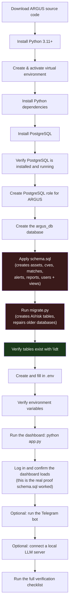
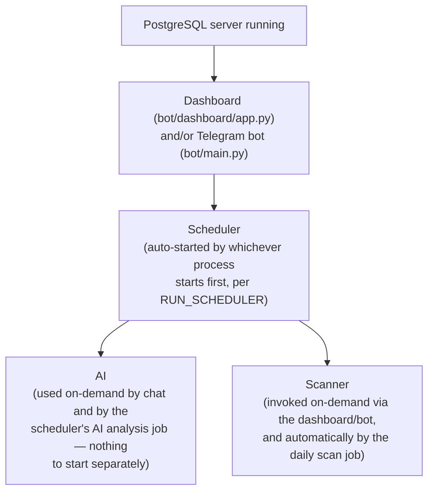
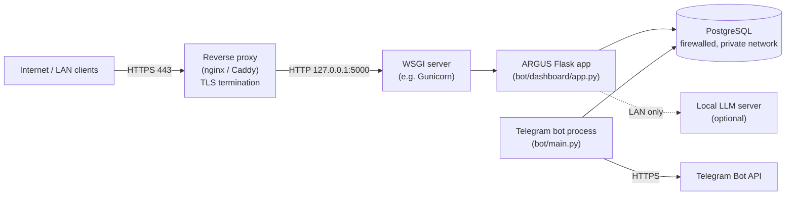

# ARGUS Installation Guide

> **Verification note.** Every command, file path, environment variable, default value, and behavior described in this document was verified directly against the ARGUS source code — `bot/dashboard/app.py`, `bot/main.py`, `bot/database/db.py`, `bot/database/schema.sql`, `bot/database/migrate.py`, `bot/Ai/llm.py`, `bot/alerts/telegram_alert.py`, `bot/jobs/daily_scan.py`, `bot/nvd/`, and `requirements.txt` — as of this revision. Nothing here is inferred from convention or from how "a typical Flask app" usually works. Anything not yet implemented is explicitly labeled **Planned Feature**, and is never described as if it already worked.

---

## Table of Contents

1. [Introduction](#1-introduction)
2. [Installation Overview](#2-installation-overview)
3. [System Requirements](#3-system-requirements)
4. [Python Installation](#4-python-installation)
5. [PostgreSQL Installation](#5-postgresql-installation)
6. [Verify PostgreSQL](#6-verify-postgresql)
7. [PostgreSQL Service](#7-postgresql-service)
8. [Connecting to PostgreSQL](#8-connecting-to-postgresql)
9. [Database Creation](#9-database-creation)
10. [PostgreSQL Users](#10-postgresql-users)
11. [Schema Initialization](#11-schema-initialization)
12. [Verify Database](#12-verify-database)
13. [Environment Configuration](#13-environment-configuration)
14. [Environment Verification](#14-environment-verification)
15. [Running ARGUS](#15-running-argus)
16. [Installation Verification](#16-installation-verification)
17. [Troubleshooting](#17-troubleshooting)
18. [Production Deployment](#18-production-deployment)
19. [Backup](#19-backup)
20. [Updating ARGUS](#20-updating-argus)
21. [Uninstallation](#21-uninstallation)
22. [FAQ](#22-faq)
23. [Beginner Appendix](#23-beginner-appendix)

---

## 1. Introduction

### What ARGUS is

ARGUS is a Python-based vulnerability management platform consisting of a Flask web dashboard, a PostgreSQL database, an optional Telegram bot, a background job scheduler (APScheduler), and an optional local AI assistant. It tracks assets, matches them against NVD/CISA-KEV/EPSS vulnerability data, computes risk scores, generates reports, and can send Telegram alerts.

### Purpose of this document

This is the complete, standalone installation manual for ARGUS. Every command in this document was checked against what the ARGUS source code actually does — not against how a generic Flask/PostgreSQL project is normally installed. Where the code's actual behavior is stricter, more fragile, or different from what you'd expect, that is called out explicitly, because those exact gaps are what caused real installation failures in the past (missing tables, wrong database name, `psql` not found, silent schema failures, and more — see [§17 Troubleshooting](#17-troubleshooting)).

### Intended audience

This guide assumes **no prior PostgreSQL knowledge** and **no prior ARGUS knowledge**. It is written for:

- Beginners and students installing a database-backed Python application for the first time
- Researchers and security analysts setting up ARGUS for their own use
- Developers and contributors who want a correct local development environment
- System administrators deploying ARGUS for a team or organization
- Enterprises and government organizations evaluating or deploying ARGUS at scale

### Types of installation covered

| Installation type | What it means | Where it's covered |
|---|---|---|
| **Development** | Running ARGUS directly with `python app.py` / `python main.py` on your own machine, for testing and contribution | §4–§16 |
| **Production** | Running ARGUS behind a reverse proxy and a real WSGI server, on a dedicated server, with a firewalled database | §18 |
| **Offline** | Installing ARGUS on a machine with restricted or no internet access | Called out inline wherever a step requires internet access (PyPI, NVD, Telegram, an LLM download) |
| **AI-enabled** | Installing and connecting a local LLM server so the AI Security Copilot chat and background CVE analysis work | §8 of [`INSTALL.md`'s AI section is folded into §13/§15](#13-environment-configuration) — see the `LLM_URL` variable and [§15.4](#154-optional-ai-server) |

### Installation philosophy

ARGUS's own code is **not fully self-healing**. Some parts of it are idempotent and safe to re-run (the dashboard repairs missing *columns* every time it starts), but the three most important tables in the entire database — `assets`, `cves`, and `matches` — are **only ever created by one specific file**, `bot/database/schema.sql`, and nothing else in the codebase will create them for you. If you skip that one step, ARGUS will often *appear* to start successfully and then fail later, confusingly, the first time a page or command touches real data. This guide is structured specifically so that you cannot reach that failure mode: every step is ordered, verified, and checked before you move to the next one.

---

## 2. Installation Overview

The diagram below is the exact order this guide follows, and the exact order the ARGUS source code requires. Skipping or reordering any step in the "Database setup" block is the single most common cause of installation failure.



**Why the highlighted steps matter:** step I (`schema.sql`) is the only place in the entire codebase that creates `assets`, `cves`, and `matches`. Step J (`migrate.py`) depends on those three tables already existing — it only adds columns and constraints to them, and creates the separate AI/risk tables from scratch. Step K is your checkpoint: if `\dt` doesn't show all the expected tables, stop and fix it before installing anything else.

---

## 3. System Requirements

### Minimum

| Component | Requirement | Why |
|---|---|---|
| CPU | 2 cores | Flask, PostgreSQL, and the scheduler are lightweight; 2 cores is enough for a single small deployment |
| RAM | 4 GB | PostgreSQL, the Python process, and the OS all need headroom; below this, PostgreSQL's default memory settings can cause swapping |
| Storage | 5 GB free | Python, its dependencies, PostgreSQL, and a small vulnerability database easily fit; CVE data grows over time (see `DATABASE.md` if available) |
| Python | 3.11 or newer | ARGUS's dependency versions (pinned in `requirements.txt`, e.g. `Flask==3.1.3`, `psycopg2-binary==2.9.12`) are tested against modern Python; older Python versions are not supported |
| PostgreSQL | 13 or newer | ARGUS's schema uses standard modern PostgreSQL SQL (`SERIAL`, `TIMESTAMPTZ`, partial indexes, `DO $$ ... $$` blocks) — no exotic version-specific features, but very old PostgreSQL releases are unsupported and untested |
| Operating System | Windows 10/11 (64-bit) or a modern 64-bit Linux distribution | ARGUS is pure Python with no OS-specific code; the only platform-specific parts of this guide are *how you install and manage* Python/PostgreSQL |
| Network | Outbound HTTPS access to `services.nvd.nist.gov`, CISA's KEV feed, and (if using Telegram) `api.telegram.org` | Required for vulnerability data and the bot to function; not required just to view existing data in the dashboard |
| GPU | Not required | ARGUS itself does no GPU work; a GPU is only relevant if you install a GPU-accelerated local LLM server (optional, see §15.4) |

### Recommended

| Component | Requirement |
|---|---|
| CPU | 4 cores |
| RAM | 8 GB (or more if you plan to run a local LLM server on the same machine) |
| Storage | 20 GB SSD |
| PostgreSQL | Installed on the same machine for small deployments, or a dedicated database host for team use |
| AI | A local LLM server (`llama.cpp` or Ollama) with at least a 7–8B parameter quantized model if you want the AI Security Copilot |

### Enterprise

| Component | Requirement |
|---|---|
| CPU | 8+ cores |
| RAM | 32 GB+ |
| Storage | 200 GB+ SSD with a scheduled backup target |
| Deployment | Dedicated PostgreSQL host, reverse proxy in front of the dashboard, HTTPS termination, firewalled database port — see [§18 Production Deployment](#18-production-deployment) |
| AI | A dedicated LLM inference host, reachable over the internal network only |

---

## 4. Python Installation

### Purpose

ARGUS is a Python application. Python must be installed and correctly reachable from your command line before anything else in this guide will work.

### Explanation

ARGUS requires **Python 3.11 or newer**. Installing Python is not enough by itself — Python must also be added to your system's `PATH` (the list of directories your shell searches when you type a command), or your terminal will not recognize the `python` or `pip` commands even though Python is technically installed.

### Windows

**Commands / steps:**

1. Download the installer from the [official Python downloads page](https://www.python.org/downloads/).
2. Run the installer. **Check the box labeled "Add python.exe to PATH"** at the bottom of the first screen — this single checkbox is responsible for most "python is not recognized" errors when left unchecked.
3. Click "Install Now".

**Expected output:** After installation, open a **new** Command Prompt or PowerShell window (existing windows do not see the updated `PATH`) and run:

```powershell
python --version
```

Expected output:

```
Python 3.11.x
```

(or 3.12.x, etc. — any 3.11+ version)

**Verification:**

```powershell
pip --version
```

Expected output:

```
pip 2x.x.x from C:\...\Python31x\Lib\site-packages\pip (python 3.1x)
```

### Linux (Ubuntu/Debian)

```bash
sudo apt update
sudo apt install -y python3 python3-pip python3-venv
```

**Verification:**

```bash
python3 --version
pip3 --version
```

Expected output:

```
Python 3.11.x
pip 2x.x.x from ... (python 3.11)
```

### Linux (Fedora/RHEL-compatible)

```bash
sudo dnf install -y python3 python3-pip
```

### Virtual environment (both platforms)

**Purpose:** A virtual environment keeps ARGUS's Python dependencies isolated from anything else installed on your system, so ARGUS's exact pinned dependency versions (from `requirements.txt`) don't conflict with other Python projects.

**Commands:**

```bash
# From inside the ARGUS project folder
python3 -m venv venv          # Linux/macOS
python -m venv venv           # Windows
```

Activate it:

```bash
source venv/bin/activate      # Linux/macOS
venv\Scripts\Activate.ps1     # Windows PowerShell
venv\Scripts\activate.bat     # Windows Command Prompt
```

**Expected output:** Your terminal prompt now begins with `(venv)`. Every `python` and `pip` command for the rest of this guide assumes this is active.

**Verification:**

```bash
which python      # Linux/macOS — should point inside the venv/ folder
where python       # Windows — should point inside the venv\ folder
```

### Common mistakes

| Mistake | Symptom | Fix |
|---|---|---|
| Forgot to check "Add to PATH" on Windows | `'python' is not recognized as an internal or external command` | Re-run the installer, choose "Modify", and enable the PATH option — or reinstall from scratch |
| Used an old terminal window after installing | `python` still not found even though it was "just installed" | Close and reopen your terminal (PATH changes don't apply to already-open windows) |
| Forgot to activate the virtual environment | Packages install "successfully" but ARGUS still says a module is missing when you run it | Re-run the `activate` command for your platform before every `pip install` and every `python app.py` |
| Used `python` on Linux where only `python3` exists | `python: command not found` | Use `python3` and `pip3` explicitly on Linux, as shown above |

### Recovery

If Python seems installed but commands aren't recognized, verify the actual install location and manually add it to `PATH` (Windows: System Properties → Environment Variables → `Path` → New → the folder containing `python.exe`), then open a new terminal and re-test.

### Best practices

- Always work inside the virtual environment for this project.
- Do not install ARGUS's dependencies into your system-wide Python — this can silently break other tools on your machine that also use Python.

**Continue to [§5 PostgreSQL Installation](#5-postgresql-installation).**

---

## 5. PostgreSQL Installation

### Purpose

ARGUS stores 100% of its data — assets, vulnerabilities, findings, reports, user accounts, AI conversations — in a single PostgreSQL database. There is no other datastore anywhere in ARGUS. If PostgreSQL isn't installed and correctly configured, nothing else in this guide will work.

### Explanation — PostgreSQL concepts, explained from zero

If you have never used a database server before, these terms will come up constantly in this guide and in ARGUS's own error messages. Read this section once, carefully — it will save you from almost every confusing error later.

| Term | What it actually means |
|---|---|
| **Server** | A background program (`postgres`) that runs continuously on your machine (or another machine), listening for connections. If this isn't running, *nothing* can talk to PostgreSQL — not `psql`, not ARGUS, nothing. |
| **Client** | Any program that connects *to* the PostgreSQL server. `psql` (a command-line tool) is a client. ARGUS itself is also a client — it connects to PostgreSQL exactly the same way `psql` does, just from Python code instead of a terminal. |
| **Database** | A named container for tables, inside the PostgreSQL server. One PostgreSQL server can host many separate databases. ARGUS expects one specific database, by default named `argus_db` (see [§9](#9-database-creation)). |
| **Role / User** | In PostgreSQL, "role" and "user" refer to the same underlying concept — an account that can log in and/or own database objects. This guide creates a dedicated role for ARGUS rather than using the all-powerful default `postgres` role for everyday use. |
| **Schema** | A namespace *inside* a database that groups tables together (PostgreSQL's default schema is called `public`). ARGUS puts every one of its tables in the default `public` schema — you do not need to create or configure any schema yourself. |
| **Owner** | Every table (and every database) has an owner — the role that has full control over it. The role you use to run `schema.sql` should be the same role ARGUS itself connects as, or you can run into permission errors later. |
| **Host** | The network address of the machine running the PostgreSQL server. For a normal single-machine install, this is `localhost` (your own computer). |
| **Port** | The network port PostgreSQL listens on. PostgreSQL's standard default is **5432**. ARGUS also defaults to `5432` if you don't set `DB_PORT` (see [§13](#13-environment-configuration)). |
| **`psql`** | PostgreSQL's official command-line client. You use it to create databases/roles and to run `schema.sql`. It is installed automatically alongside the PostgreSQL server on both Windows and Linux. |

### Windows Installation

1. Download the installer from the [official PostgreSQL downloads page](https://www.postgresql.org/download/windows/).
2. Run the installer.
3. When prompted, **set and remember a password for the `postgres` superuser account** — you will need this in [§8](#8-connecting-to-postgresql). Write it down somewhere safe; forgetting it is one of the most common installation blockers.
4. Keep the default port (**5432**) unless you have a specific reason to change it.
5. In the "Select Components" screen, make sure **Command Line Tools** is checked — this is what installs `psql`.
6. Finish the installation. On Windows, the installer normally adds PostgreSQL's `bin` folder to your `PATH` automatically, but this is not guaranteed on every version — see [§6](#6-verify-postgresql) to confirm.

### Linux Installation (Ubuntu/Debian)

```bash
sudo apt update
sudo apt install -y postgresql postgresql-contrib
```

This installs both the PostgreSQL **server** (which starts automatically as a system service) and `psql` (the **client**).

### Linux Installation (Fedora/RHEL-compatible)

```bash
sudo dnf install -y postgresql-server postgresql-contrib
sudo postgresql-setup --initdb
```

On Fedora/RHEL, the server is installed but **not started or enabled** automatically — you must do this yourself (covered in [§7](#7-postgresql-service)).

### Expected output

There is no single "success" output for installation itself — success is confirmed by the verification steps in [§6](#6-verify-postgresql) and [§7](#7-postgresql-service). Do not skip those.

### Common mistakes

| Mistake | Symptom | Section with the fix |
|---|---|---|
| Forgot the `postgres` password during Windows install | Can't log in at all afterward | Reinstall, or reset the password using `pg_hba.conf` — see [§8](#8-connecting-to-postgresql) |
| Didn't install Command Line Tools on Windows | `psql` not found even though PostgreSQL "is installed" | See [§6](#6-postgresql-verify) for the PATH fix, or re-run the installer and add the component |
| Assumed the server starts automatically on Fedora/RHEL | Every connection attempt fails with "connection refused" | See [§7](#7-postgresql-service) |

### Recovery

If the installer fails partway through on Windows, uninstall via "Add or Remove Programs" and re-run the installer as Administrator. On Linux, `sudo apt remove --purge postgresql postgresql-contrib` (or the `dnf` equivalent) followed by a clean reinstall is usually faster than trying to repair a partial install.

### Best practices

- Note down the `postgres` password immediately during installation — you will need it multiple times in this guide.
- Don't change the default port unless you have a specific reason to; ARGUS defaults to `5432` and changing it means you must also set `DB_PORT` later.

**Continue to [§6 Verify PostgreSQL](#6-verify-postgresql).**

---

## 6. Verify PostgreSQL

### Purpose

Confirm that the `psql` command-line client is actually reachable from your terminal before attempting to use it. This is the single most common early failure point.

### Windows

```powershell
where psql
```

**Expected output:**

```
C:\Program Files\PostgreSQL\1x\bin\psql.exe
```

If instead you see:

```
INFO: Could not find files for the given pattern(s).
```

`psql` is not on your `PATH`.

### Linux

```bash
which psql
```

**Expected output:**

```
/usr/bin/psql
```

If instead you see nothing (empty output) or `which: no psql in (...)`, `psql` is not installed or not on your `PATH`.

### Recovery — PATH troubleshooting

**Windows:** Manually locate the PostgreSQL `bin` folder (commonly `C:\Program Files\PostgreSQL\<version>\bin`), then:

1. Search for "Environment Variables" in the Start menu → "Edit the system environment variables".
2. Click "Environment Variables".
3. Under "System variables", select `Path`, click "Edit", click "New", and paste the `bin` folder path.
4. Click OK on every dialog, then **close and reopen your terminal**.
5. Re-run `where psql`.

**Linux:** If PostgreSQL was installed via `apt`/`dnf` but `psql` still isn't found, the install likely failed partway — re-run the installation command from [§5](#5-postgresql-installation) and check for errors in its output.

### Verification

Once `psql` is found, confirm its version:

```bash
psql --version
```

Expected output (version number will vary):

```
psql (PostgreSQL) 1x.x
```

**Continue to [§7 PostgreSQL Service](#7-postgresql-service).**

---

## 7. PostgreSQL Service

### Purpose

`psql` being installed does **not** mean the PostgreSQL **server** is running. These are two separate things (see the Server vs. Client explanation in [§5](#5-postgresql-installation)). This section confirms the server itself is actually up and listening.

### Windows — `services.msc`

1. Press `Win + R`, type `services.msc`, press Enter.
2. Find the service named something like **postgresql-x64-1x**.
3. Its "Status" column should say **Running**.

**If it is not running:**

1. Right-click the service → **Start**.
2. To make it start automatically on every boot, right-click → **Properties** → set "Startup type" to **Automatic**.

### Linux — `systemctl`

**Check status:**

```bash
sudo systemctl status postgresql
```

**Expected output** (excerpt):

```
● postgresql.service - PostgreSQL RDBMS
     Loaded: loaded (...)
     Active: active (running) since ...
```

**If it says `inactive (dead)` or `failed`:**

```bash
sudo systemctl start postgresql
sudo systemctl enable postgresql   # so it also starts automatically on reboot
```

**Restarting the service** (useful after a configuration change):

```bash
sudo systemctl restart postgresql
```

### Verifying the listening port

Confirm PostgreSQL is actually listening on port 5432 (its default):

**Linux:**

```bash
sudo ss -ltnp | grep 5432
```

or, if `ss` is unavailable:

```bash
sudo netstat -ltnp | grep 5432
```

**Expected output** (excerpt):

```
LISTEN  0  244  127.0.0.1:5432  0.0.0.0:*  users:(("postgres",pid=1234,fd=7))
```

**Windows (PowerShell):**

```powershell
netstat -ano | findstr 5432
```

**Expected output:** at least one line showing `LISTENING` on port 5432.

### Common mistakes

| Mistake | Symptom | Fix |
|---|---|---|
| Assumed PostgreSQL starts on boot on Fedora/RHEL | Works today, fails after a reboot | `sudo systemctl enable postgresql` |
| Firewall blocking port 5432 (rare on `localhost` connections, more common if connecting from another machine) | Server is running, `netstat`/`ss` shows it listening, but a remote connection still times out | See the Windows/Linux firewall entries in [§17 Troubleshooting](#17-troubleshooting) |
| Multiple PostgreSQL versions installed side-by-side | Confusing "which service is actually running" situation | Check `services.msc` / `systemctl list-units 'postgresql*'` for every installed version and make sure only the one you intend to use is running |

### Recovery

If the service refuses to start, check its logs:

**Linux:**

```bash
sudo journalctl -u postgresql -n 50
```

**Windows:** Check the PostgreSQL data directory's `log` subfolder (commonly `C:\Program Files\PostgreSQL\<version>\data\log`) for the most recent log file.

**Continue to [§8 Connecting to PostgreSQL](#8-connecting-to-postgresql).**

---

## 8. Connecting to PostgreSQL

### Purpose

Confirm you can actually authenticate to the running PostgreSQL server using the built-in `postgres` superuser account, before creating anything ARGUS-specific.

### Commands

```bash
psql -U postgres
```

### Explanation of the password prompt

You will be prompted:

```
Password for user postgres:
```

Type the password you set during installation ([§5](#5-postgresql-installation)) and press Enter. **Nothing will appear on screen as you type this** — no dots, no asterisks. This is normal `psql` behavior, not a bug.

### Expected output

```
psql (1x.x)
Type "help" for help.

postgres=#
```

The `postgres=#` prompt confirms you are now connected, as the `postgres` role, to the default `postgres` database.

### Common failure messages, explained

| Message | Meaning | Fix |
|---|---|---|
| `psql: error: connection to server ... failed: FATAL: password authentication failed for user "postgres"` | The password you typed is wrong | Re-type carefully (remember: nothing is displayed as you type). If you truly forgot the password, see Recovery below. |
| `psql: error: connection to server at "localhost" (...), port 5432 failed: Connection refused` | The PostgreSQL **server** is not running, or is listening on a different port | Go back to [§7](#7-postgresql-service) and confirm the service is running |
| `psql: error: connection to server ... failed: could not translate host name "localhost" to address` | An unusual local DNS/networking issue | Try `psql -U postgres -h 127.0.0.1` instead |
| `'psql' is not recognized...` | `psql` is not on your `PATH` | Go back to [§6](#6-verify-postgresql) |

### Recovery — forgotten `postgres` password

You can reset it using `ALTER USER`, but you first need one working connection to do so. The easiest path is to use `pgAdmin` (installed alongside PostgreSQL on Windows) which may retain saved credentials, or — on Linux — temporarily edit `pg_hba.conf` to allow local trust-based access, reset the password, then revert the change:

```bash
# Locate pg_hba.conf (commonly /etc/postgresql/<version>/main/pg_hba.conf on Debian/Ubuntu)
sudo nano /etc/postgresql/*/main/pg_hba.conf
```

Temporarily change the local connection method to `trust`, then:

```bash
sudo systemctl restart postgresql
psql -U postgres
```

Once connected:

```sql
ALTER USER postgres WITH PASSWORD 'your-new-password';
```

Then revert `pg_hba.conf` back to `md5` or `scram-sha-256` and restart PostgreSQL again.

### Verification

Once connected, exit with:

```
\q
```

**Continue to [§9 Database Creation](#9-database-creation).**

---

## 9. Database Creation

### Purpose

Create the exact database ARGUS expects to connect to.

### Explanation — why the exact name matters

ARGUS's database connection code (`bot/database/db.py`) reads the database name from the `DB_NAME` environment variable, and **if `DB_NAME` is not set, it defaults to exactly `argus_db`** — verified directly in the source:

```python
"database": os.getenv("DB_NAME", "argus_db"),
```

This is the actual, single source of truth for the default database name. If you create a database with a different name (e.g., `argus`, `Argus_DB`, `argusdb`) and don't set `DB_NAME` to match it exactly in your `.env` file, ARGUS will try to connect to `argus_db`, which won't exist, and every single database operation will fail. **Database names are case-sensitive in practice for this purpose** — create exactly `argus_db` unless you deliberately plan to set a custom `DB_NAME` later.

### Commands

While connected as `postgres` (`psql -U postgres`):

```sql
CREATE DATABASE argus_db
    WITH
    OWNER = postgres
    ENCODING = 'UTF8';
```

> If you created a dedicated ARGUS role already (see [§10](#10-postgresql-users)), set `OWNER` to that role's name instead of `postgres`.

### Explanation of each part

- **`argus_db`** — the exact name ARGUS expects by default.
- **`OWNER`** — the role that has full control over this database. This should match whichever role ARGUS will connect as (`DB_USER` in your `.env`).
- **`ENCODING = 'UTF8'`** — CVE descriptions and asset notes can contain a wide range of Unicode characters (accented names, non-English text, special symbols). PostgreSQL's default encoding on some systems is locale-dependent; explicitly specifying `UTF8` avoids encoding-related insert failures later.

### Verification

```sql
\l
```

**Expected output** (excerpt — your list may include other databases too):

```
                                  List of databases
   Name    |  Owner   | Encoding |   Collate   |    Ctype    | Access privileges
-----------+----------+----------+-------------+-------------+-------------------
 argus_db  | postgres | UTF8     | en_US.UTF-8 | en_US.UTF-8 |
 postgres  | postgres | UTF8     | en_US.UTF-8 | en_US.UTF-8 |
 ...
```

Confirm `argus_db` appears in the list with `UTF8` encoding.

### Common mistakes

| Mistake | Symptom (later) | Fix |
|---|---|---|
| Created `argus` instead of `argus_db` | ARGUS fails to connect: `database "argus_db" does not exist` | Either rename the database (`ALTER DATABASE argus RENAME TO argus_db;`) or set `DB_NAME=argus` in `.env` — but the former is strongly recommended so you never have to remember a non-default value |
| Left encoding as a non-UTF8 default | Later inserts of CVE descriptions with special characters fail | Drop and recreate the database with `ENCODING = 'UTF8'` explicitly (do this **before** importing any schema/data) |
| Created the database while connected to a different PostgreSQL **server instance** (e.g., an old version still running alongside a new one) | `\l` from one `psql` session shows the database, but ARGUS still can't find it | Confirm which PostgreSQL service/port you're actually connected to — see [§7](#7-postgresql-service) |

### Recovery

To start over cleanly:

```sql
DROP DATABASE IF EXISTS argus_db;
CREATE DATABASE argus_db WITH OWNER = postgres ENCODING = 'UTF8';
```

**Continue to [§10 PostgreSQL Users](#10-postgresql-users).**

---

## 10. PostgreSQL Users

### Purpose

Decide which PostgreSQL role ARGUS will actually connect as, and understand the trade-offs.

### Explanation

ARGUS's database connection code defaults `DB_USER` to `postgres` if you don't set it:

```python
"user": os.getenv("DB_USER", "postgres"),
```

This means the **simplest possible setup** — and the one this guide uses by default for development — is to let ARGUS connect directly as the `postgres` superuser. This is fine for a personal development machine but is **not recommended** for any shared or production environment, because the `postgres` role has unrestricted power over the entire PostgreSQL server, not just the ARGUS database.

### Development setup (simplest path)

Do nothing extra — as long as `argus_db` is owned by `postgres` (as created in [§9](#9-database-creation)) and your `.env` doesn't set `DB_USER`/sets it to `postgres`, ARGUS will connect successfully using the `postgres` password you already have.

### Production / dedicated-user setup (recommended for anything beyond solo local testing)

Create a role specifically for ARGUS, with a password only ARGUS uses:

```sql
CREATE ROLE argus_user WITH LOGIN PASSWORD 'choose-a-strong-password-here';
ALTER DATABASE argus_db OWNER TO argus_user;
GRANT ALL PRIVILEGES ON DATABASE argus_db TO argus_user;
```

Then in your `.env` (see [§13](#13-environment-configuration)):

```ini
DB_USER=argus_user
DB_PASSWORD=choose-a-strong-password-here
```

### Ownership and privileges, explained

- **`ALTER DATABASE argus_db OWNER TO argus_user`** makes `argus_user` the owner of the database itself — required so that `argus_user` can create/alter tables inside it (which is exactly what `schema.sql` and `migrate.py` need to do).
- **`GRANT ALL PRIVILEGES`** is a broader grant covering connect/create rights on the database. Combined with ownership, this gives `argus_user` everything it needs and nothing it doesn't (it still cannot, for example, create or drop *other* databases, or manage other PostgreSQL roles).

### Security considerations

- Never reuse the `postgres` superuser password as your ARGUS application password in any shared environment.
- A dedicated `argus_user` role limits the blast radius if the ARGUS `.env` file (which stores this password in plain text — see [§13](#13-environment-configuration)) is ever exposed.

### Common mistakes

| Mistake | Symptom | Fix |
|---|---|---|
| Created `argus_user` but forgot to transfer ownership of `argus_db` | `permission denied for database argus_db` or `permission denied to create ... ` when applying `schema.sql` | Run the `ALTER DATABASE ... OWNER TO ...` command above |
| Set `DB_USER=argus_user` in `.env` but never actually created that role in PostgreSQL | `FATAL: role "argus_user" does not exist` | Run the `CREATE ROLE` command above first |

**Continue to [§11 Schema Initialization](#11-schema-initialization).**

---

## 11. Schema Initialization

### Purpose

This is the single most important section in this entire guide. Applying the schema correctly, in the correct order, is what determines whether ARGUS works at all.

### Explanation — what `schema.sql` and `migrate.py` each actually do

Based on direct inspection of both files:

- **`bot/database/schema.sql`** is the **only** place in the entire ARGUS codebase that contains `CREATE TABLE` statements for `assets`, `cves`, and `matches` — the three foundational tables everything else depends on. It also creates `alerts`, `reports`, `users`, and four read-only views (`ai_dashboard`, `ai_open_findings`, `ai_asset_summary`, `ai_vulnerability_summary`).
- **`bot/database/migrate.py`** does **not** create `assets`, `cves`, or `matches`. It only runs `ALTER TABLE` statements against them (assuming they already exist), and separately creates five AI/risk-related tables that are *not* in `schema.sql` at all: `ai_conversations`, `ai_messages`, `cve_ai_analysis`, `risk_snapshots`, and `ai_response_cache`. It also refreshes the four views and backfills any pending AI analysis rows.
- **`bot/dashboard/app.py`** runs its own internal repair function (`_ensure_schema()`) automatically every time the dashboard starts. This function **also** assumes `assets`, `cves`, and `matches` already exist — every statement in it is an `ALTER TABLE ...` or `CREATE TABLE IF NOT EXISTS` for the *other* tables, never a `CREATE TABLE` for the three core ones. Critically, **this function silently swallows errors** — if the core tables don't exist, `_ensure_schema()` fails quietly in the background, logs nothing visible to you, and the dashboard **still starts and appears to work** until the first time a page actually queries `assets`/`cves`/`matches`, at which point it crashes with an error like `relation "assets" does not exist`.

**This is exactly the failure mode described in real-world testing** ("dashboard crashing due to missing tables", "relation 'assets' does not exist"). It happens specifically when `schema.sql` is skipped and the dashboard is started directly. This guide prevents it by making `schema.sql` a mandatory, verified step before anything else runs.

### The correct order (and why)

1. **Apply `schema.sql`** — creates the three foundational tables plus `alerts`/`reports`/`users`/views. Nothing else works without this.
2. **Run `migrate.py`** — safe to run any number of times; creates the AI/risk tables and applies any additional column repairs.
3. **Only then** start `app.py` or `bot/main.py`.

Running `migrate.py` *before* `schema.sql` is also directly diagnosable: unlike the dashboard's silent `_ensure_schema()`, `migrate.py` **prints a visible `FAILED`** line with the exact database error for every step that fails — so if you accidentally run it first, you'll see something like:

```
  → matches UNIQUE (asset_id, cve_id) constraint ... FAILED
    relation "matches" does not exist
```

This is expected and recoverable — just run `schema.sql` first, then re-run `migrate.py` (it's fully idempotent).

### Commands — Step 1: apply `schema.sql`

From the ARGUS project root:

```bash
psql -U postgres -d argus_db -f bot/database/schema.sql
```

(Replace `-U postgres` with `-U argus_user` if you created a dedicated role in [§10](#10-postgresql-users).)

**Expected output** (excerpt — many `CREATE TABLE`/`CREATE INDEX`/`DO` lines):

```
CREATE TABLE
CREATE TABLE
CREATE TABLE
CREATE INDEX
CREATE INDEX
CREATE INDEX
CREATE INDEX
CREATE TABLE
DO
DO
CREATE INDEX
CREATE INDEX
CREATE INDEX
DO
CREATE INDEX
CREATE INDEX
CREATE INDEX
CREATE INDEX
CREATE INDEX
CREATE TABLE
CREATE TABLE
CREATE VIEW
CREATE VIEW
CREATE VIEW
CREATE VIEW
```

Every line should say `CREATE TABLE`, `CREATE INDEX`, `CREATE VIEW`, or `DO` — **never** `ERROR`. If you see any `ERROR` line, stop and read [§17 Troubleshooting](#17-troubleshooting) before continuing.

### Commands — Step 2: run `migrate.py`

`migrate.py`'s own file header states the exact required invocation:

```bash
cd bot
python database/migrate.py
```

**Expected output** (excerpt):

```
Argus database migration

  → assets.type column ... OK
  → assets.last_scan column ... OK
  → assets.search_keyword column ... OK
  → cves.severity column ... OK
  → cves.epss column ... OK
  → cves.epss_percentile column ... OK
  → cves.created_at column ... OK
  ...
Migration complete.

Argus AI views

  → view ai_dashboard ... OK
  → view ai_open_findings ... OK
  → view ai_asset_summary ... OK
  → view ai_vulnerability_summary ... OK

Backfilling AI analysis queue

  → queued 0 CVE(s) that had no analysis row yet
```

Every migration step should say **`OK`**. If any step says **`FAILED`**, the error message printed immediately after it tells you exactly what went wrong (most commonly: `schema.sql` wasn't applied first).

### Verification

```bash
psql -U postgres -d argus_db -c "\dt"
```

See [§12 Verify Database](#12-verify-database) for the complete expected table list.

### Common mistakes

| Mistake | Symptom | Fix |
|---|---|---|
| Ran `migrate.py` before `schema.sql` | Every step in `migrate.py`'s output says `FAILED` with `relation "..." does not exist` | Run `schema.sql` first (Step 1 above), then re-run `migrate.py` — it's safe to re-run |
| Ran `psql` against the wrong database (e.g., the default `postgres` database, forgetting `-d argus_db`) | `schema.sql` appears to succeed, but the tables aren't in `argus_db` | Always double-check the `-d argus_db` flag; verify with `\dt` immediately afterward while connected to `argus_db` specifically |
| Ran `python database/migrate.py` from the wrong directory | `ModuleNotFoundError: No module named 'database'` | You must run it as `cd bot && python database/migrate.py` — the script's relative import (`from database.db import get_connection`) requires `bot/` to be your current directory |
| Assumed starting the dashboard once would create the tables for you | Dashboard starts with no visible error, then crashes on the first real page with `relation "assets" does not exist` | This is the exact silent-failure mode explained above — go back and run `schema.sql` manually; starting `app.py` is never a substitute for it |

### Rollback

Neither `schema.sql` nor `migrate.py` supports an automatic "undo". Every statement in both files is additive (`CREATE TABLE IF NOT EXISTS`, `ADD COLUMN IF NOT EXISTS`) — there is no corresponding down-migration. To fully start over:

```sql
DROP DATABASE argus_db;
CREATE DATABASE argus_db WITH OWNER = postgres ENCODING = 'UTF8';
```

Then repeat Steps 1 and 2 above from scratch.

### Best practices

- Always apply `schema.sql` immediately after creating the database, before touching anything else.
- Always run `migrate.py` once after `schema.sql`, even on a brand-new database — it creates the AI/risk tables that `schema.sql` does not.
- Re-run `migrate.py` after every ARGUS update (see [§20](#20-updating-argus)) — it's always safe to re-run and picks up any new columns/tables added by newer versions of ARGUS.

**Continue to [§12 Verify Database](#12-verify-database).**

---

## 12. Verify Database

### Purpose

Confirm every table ARGUS needs actually exists before attempting to run any part of the application.

### Commands

```bash
psql -U postgres -d argus_db -c "\dt"
```

### Expected output

```
                 List of relations
 Schema |         Name            | Type  |  Owner
--------+--------------------------+-------+----------
 public | ai_conversations         | table | postgres
 public | ai_messages              | table | postgres
 public | ai_response_cache        | table | postgres
 public | alerts                   | table | postgres
 public | assets                   | table | postgres
 public | cve_ai_analysis          | table | postgres
 public | cves                     | table | postgres
 public | matches                  | table | postgres
 public | reports                  | table | postgres
 public | risk_snapshots           | table | postgres
 public | users                    | table | postgres
```

You should see **all eleven tables** listed above. (`Owner` will read `argus_user` instead of `postgres` if you followed the dedicated-role setup in [§10](#10-postgresql-users).)

### Verify the four views separately

```bash
psql -U postgres -d argus_db -c "\dv"
```

**Expected output:**

```
                  List of relations
 Schema |          Name             | Type |  Owner
--------+----------------------------+------+----------
 public | ai_asset_summary           | view | postgres
 public | ai_dashboard               | view | postgres
 public | ai_open_findings           | view | postgres
 public | ai_vulnerability_summary   | view | postgres
```

### What each table is for (brief)

| Table | Purpose |
|---|---|
| `assets` | Your tracked inventory (devices, software, systems) |
| `cves` | Cached vulnerability records fetched from NVD |
| `matches` | The link between an asset and a CVE that affects it, plus risk score and remediation status |
| `alerts` | A record of every Telegram alert ARGUS has sent |
| `reports` | Metadata about generated PDF reports |
| `users` | Self-registered dashboard accounts (separate from the built-in `admin`/`viewer` accounts — see [§13](#13-environment-configuration)) |
| `ai_conversations` / `ai_messages` | AI Security Copilot chat history |
| `cve_ai_analysis` | Saved AI-generated analysis for individual CVEs |
| `risk_snapshots` | One row per day of aggregate risk statistics, for trend charts |
| `ai_response_cache` | Short-lived cache of AI chat answers |

### Verification — confirm the tables are actually usable, not just present

```bash
psql -U postgres -d argus_db -c "SELECT COUNT(*) FROM assets;"
```

**Expected output** on a fresh install:

```
 count
-------
     0
(1 row)
```

`0` is correct and expected here — it confirms the table exists and is queryable, even though it's empty. An error instead of `0` means something is still wrong.

### Common mistakes

| Mistake | Symptom | Fix |
|---|---|---|
| Only some tables appear (e.g., `assets`/`cves`/`matches` present, but no `ai_conversations`/`risk_snapshots`/etc.) | You applied `schema.sql` but never ran `migrate.py` | Go back to [§11 Step 2](#11-schema-initialization) and run `migrate.py` |
| No tables appear at all | `schema.sql` was never applied, or was applied to the wrong database | Go back to [§11 Step 1](#11-schema-initialization) |
| `\dt` shows tables, but they're owned by an unexpected user | You applied `schema.sql` while connected as a different role than intended | Not necessarily a problem on its own, but make sure `DB_USER` in your `.env` matches a role that has privileges on these tables |

**Continue to [§13 Environment Configuration](#13-environment-configuration).**

---

## 13. Environment Configuration

### Purpose

Configure every setting ARGUS actually reads from its environment, in one `.env` file.

### Explanation

ARGUS reads configuration from a file named `.env`, placed at the **root of the ARGUS project** (the same folder that contains `requirements.txt` and the `bot/` folder). This is loaded automatically by Python's `python-dotenv` library, which every part of ARGUS that needs configuration (`bot/database/db.py`, `bot/alerts/telegram_alert.py`, `bot/main.py`) calls on startup.

**Important, verified detail:** `python-dotenv`'s `load_dotenv()` function — which is what ARGUS calls, with no arguments — searches for `.env` starting in your **current working directory** and walking **upward** through parent folders until it finds one. This means `.env` at the project root will be found correctly whether you run ARGUS from the project root, from `bot/`, or from `bot/dashboard/` — **as long as your terminal's current directory is somewhere inside the ARGUS project folder.** If you `cd` completely outside the project (for example, to a system temp folder) and invoke a script by an absolute path, `.env` will **not** be found, because the upward search never reaches the project folder. Always run ARGUS commands with your terminal's current directory somewhere inside the project.

### Every environment variable ARGUS actually reads

The table below was built by searching the entire codebase for every `os.getenv(...)` and `os.environ.get(...)` call. **No variable not listed here is read anywhere in ARGUS.** If you have seen other vulnerability-management projects use names like `DATABASE_URL`, `POSTGRES_HOST`, `TELEGRAM_TOKEN`, or `OLLAMA_HOST` — ARGUS does not use any of those names. Use the exact names below.

#### Required

| Variable | Purpose | Required? | Default | Notes |
|---|---|---|---|---|
| `SECRET_KEY` | Flask's session-signing key | **Yes — the dashboard refuses to start without it** | None | Generate one with `python -c "import secrets; print(secrets.token_hex(32))"`. If unset, `app.py` raises `RuntimeError: SECRET_KEY is missing.` immediately at startup. |
| `DB_PASSWORD` | PostgreSQL connection password | Effectively yes | None (empty string) | Not enforced by a hard startup failure, but a warning is logged, and every database operation will fail without it if your role actually has a password set |
| `TOKEN` | Telegram Bot API token | Only if running the Telegram bot (`bot/main.py`) | None | If unset, `bot/main.py` raises `RuntimeError: TOKEN environment variable is not set.` immediately. Not needed to run the dashboard alone. |

#### Database connection (all optional — sensible defaults exist)

| Variable | Default | Purpose |
|---|---|---|
| `DB_HOST` | `localhost` | Hostname/IP of the PostgreSQL server |
| `DB_NAME` | `argus_db` | Database name — must match exactly what you created in [§9](#9-database-creation) |
| `DB_USER` | `postgres` | PostgreSQL role ARGUS connects as |
| `DB_PORT` | `5432` | PostgreSQL port |
| `DB_POOL_MIN_CONN` | `2` | Minimum number of pooled database connections kept open |
| `DB_POOL_MAX_CONN` | `20` | Maximum number of pooled database connections |

#### Dashboard accounts

| Variable | Default | Notes |
|---|---|---|
| `ADMIN_PASSWORD` | **`"admin"` if unset** | This is a real, verified fallback in the source code — `os.getenv("ADMIN_PASSWORD", "admin")`. **You must set this explicitly to a strong password**; leaving it unset means the built-in admin account's password is the literal word `admin`. |
| `VIEWER_PASSWORD` | None (no fallback) | The built-in `viewer` (read-only) account's password. If unset, this account cannot log in at all (its password compares against `None`, which never matches anything typed). |

#### External data sources

| Variable | Default | Notes |
|---|---|---|
| `NVD_API_KEY` | None | Optional. Without it, NVD vulnerability lookups are rate-limited more aggressively. Get a free key from the [NVD API key request page](https://nvd.nist.gov/developers/request-an-api-key). |

#### Telegram alerts

| Variable | Default | Notes |
|---|---|---|
| `CHAT_ID` | None | The Telegram chat/channel ID alerts are sent to. Required only for alert delivery (`send_alert`/`send_document` both raise an error if this or `TOKEN` is missing) — not required to run the dashboard or bot commands that don't send alerts. |

#### AI (all optional — ARGUS runs fully without any of these set)

| Variable | Default | Notes |
|---|---|---|
| `LLM_URL` | `http://192.168.0.26:8080/v1/chat/completions` | The full URL of an OpenAI-compatible chat completions endpoint (a local `llama.cpp` server or Ollama). **This default is a specific LAN IP address, not a placeholder** — if you don't set your own `LLM_URL`, ARGUS will actually attempt to connect to that exact address and, on connection failure, the AI chat will reply "ARGUS AI server is offline. Please start the LLM server." |
| `LLM_MODEL_NAME` | `default-local-llm` | A cosmetic label stored alongside AI-generated CVE analyses, recording which model produced them. Does not affect connectivity or behavior. |

#### Scheduler

| Variable | Default | Notes |
|---|---|---|
| `RUN_SCHEDULER` | `true` | Controls whether the background job scheduler (daily scans, reports, AI analysis batches) starts inside this process. Accepted "off" values are `false`, `0`, or `no` (case-insensitive). See [§15](#15-running-argus) for why this matters if you run both the dashboard and the bot at once. |

### Example complete `.env` file

```ini
# ── Required ──────────────────────────────────────────────
SECRET_KEY=replace-with-a-long-random-value
DB_PASSWORD=replace-with-your-postgresql-password

# ── Database connection ──────────────────────────────────
DB_HOST=localhost
DB_NAME=argus_db
DB_USER=postgres
DB_PORT=5432
DB_POOL_MIN_CONN=2
DB_POOL_MAX_CONN=20

# ── Dashboard accounts ────────────────────────────────────
ADMIN_PASSWORD=replace-with-a-strong-admin-password
VIEWER_PASSWORD=replace-with-a-strong-viewer-password

# ── NVD (optional but recommended) ───────────────────────
NVD_API_KEY=

# ── Telegram (optional) ───────────────────────────────────
TOKEN=
CHAT_ID=

# ── AI (optional) ─────────────────────────────────────────
LLM_URL=
LLM_MODEL_NAME=

# ── Scheduler ─────────────────────────────────────────────
RUN_SCHEDULER=true
```

Leave any optional variable blank (or omit it entirely) if you don't need that feature — do not put placeholder text like `your-token-here` in a value ARGUS will actually try to use, since that would be treated as a real, wrong value rather than "not configured".

### Security considerations

- `.env` contains plaintext secrets (database password, admin password, Telegram token). Never commit it to version control. ARGUS's own `.gitignore` already excludes it — do not remove that exclusion.
- Change `ADMIN_PASSWORD` immediately — the `"admin"` fallback is real and exploitable if left in place on any network-reachable deployment.
- Restrict filesystem permissions on `.env` (`chmod 600 .env` on Linux) so only the account running ARGUS can read it.

### Common mistakes

| Mistake | Symptom | Fix |
|---|---|---|
| Typed a variable name ARGUS doesn't use (e.g., `DATABASE_URL`, `POSTGRES_PASSWORD`) | ARGUS silently ignores it and falls back to defaults, causing confusing "wrong database"/"wrong password" errors | Use the exact variable names in the tables above — check for typos character by character |
| Left `ADMIN_PASSWORD` unset, assuming it would force a setup prompt | The admin account silently accepts the password `admin` | Set it explicitly |
| Set `DB_NAME` to something other than what you actually created in PostgreSQL | `FATAL: database "..." does not exist` | Make `DB_NAME` and the actual database name match exactly, or rename the database to match |
| Put a fake placeholder value into `LLM_URL` "just in case" | ARGUS actually tries to connect to that fake address and fails, instead of behaving as if AI is simply unused | Leave `LLM_URL` blank/unset if you don't want the AI feature yet |

**Continue to [§14 Environment Verification](#14-environment-verification).**

---

## 14. Environment Verification

### Purpose

Confirm every value in your `.env` file is actually correct **before** starting ARGUS itself, so any remaining problem is easy to isolate.

### Verify the database connection independently of ARGUS

```bash
psql -U <DB_USER value> -d <DB_NAME value> -h <DB_HOST value> -p <DB_PORT value>
```

For the default values, this is exactly:

```bash
psql -U postgres -d argus_db -h localhost -p 5432
```

**Expected output:** the same `argus_db=#` prompt as before. If this fails, fix it here before touching ARGUS — every failure mode and fix is already covered in [§8](#8-connecting-to-postgresql) and [§9](#9-database-creation).

### Verify credentials match exactly

Open `.env` and re-read the `DB_PASSWORD` value character by character against whatever password you actually set for that PostgreSQL role. Copy-paste errors here (trailing spaces, wrong quote characters) are a common, easy-to-miss cause of `password authentication failed`.

### Verify the AI endpoint (only if you intend to use AI features)

```bash
curl -X POST "<your LLM_URL value>" \
  -H "Content-Type: application/json" \
  -d '{"messages":[{"role":"user","content":"Say OK if you can read this."}]}'
```

**Expected output:** a JSON response containing `"choices"` and message content. If this fails (connection refused/timeout), the AI chat feature will show "ARGUS AI server is offline" once ARGUS is running — that is expected and correct behavior given an unreachable endpoint, not a bug.

### Verify the Telegram token (only if using the bot)

```bash
curl "https://api.telegram.org/bot<your TOKEN value>/getMe"
```

**Expected output:**

```json
{"ok":true,"result":{"id":123456789,"is_bot":true,"first_name":"YourBotName", ...}}
```

If you see `{"ok":false,"error_code":401,"description":"Unauthorized"}`, the token is wrong — regenerate it via **@BotFather** on Telegram.

### Verify the scheduler setting

Simply re-read the `RUN_SCHEDULER` line in `.env`. If you plan to run **both** the dashboard and the Telegram bot simultaneously, read [§15](#15-running-argus) now before starting either one, to avoid duplicated scheduled jobs.

### Verify dashboard readiness (a dry check before actually running it)

Confirm `SECRET_KEY` is actually present and non-empty:

```bash
grep -q "^SECRET_KEY=." .env && echo "SECRET_KEY is set" || echo "SECRET_KEY is MISSING or empty"
```

**Continue to [§15 Running ARGUS](#15-running-argus).**

---

## 15. Running ARGUS

### Purpose

Start every ARGUS component in the correct order, and understand exactly why that order matters.

### 15.1 Correct startup order



**Why this order:** PostgreSQL must be reachable before either the dashboard or the bot starts, since both immediately attempt database operations on startup. Neither the scheduler, the AI client, nor the scanner are separate processes you start yourself — they are invoked automatically, from inside whichever of `app.py`/`main.py` you run.

### 15.2 Run the dashboard

```bash
cd bot/dashboard
python app.py
```

**Expected output:**

```
 * Serving Flask app 'app'
 * Debug mode: off
 * Running on all addresses (0.0.0.0)
 * Running on http://127.0.0.1:5000
 * Running on http://<your-local-ip>:5000
```

Open `http://localhost:5000` in a browser.

**If `SECRET_KEY` is missing, you will instead see:**

```
RuntimeError: SECRET_KEY is missing. Add a long random SECRET_KEY to the .env file.
```

This is expected, correct behavior — go back to [§13](#13-environment-configuration).

### 15.3 Run the Telegram bot (optional, separate process)

```bash
cd bot
python main.py
```

**Expected output:**

```
2026-07-09 12:00:00 [INFO] telegram.ext.Application: Application started
```

**If `TOKEN` is missing:**

```
RuntimeError: TOKEN environment variable is not set.
```

Go back to [§13](#13-environment-configuration).

### 15.4 Optional AI server

ARGUS does not ship or install an LLM server itself — this is entirely your own responsibility, and entirely optional. Any server that implements an OpenAI-compatible `/v1/chat/completions` endpoint works, because that is the only interface ARGUS's AI client (`bot/Ai/llm.py`) speaks.

**Option A — `llama.cpp` server:**

```bash
git clone https://github.com/ggerganov/llama.cpp
cd llama.cpp
cmake -B build && cmake --build build --config Release -j
./build/bin/llama-server -m /path/to/your-model.gguf --host 0.0.0.0 --port 8080
```

**Option B — Ollama:**

```bash
curl -fsSL https://ollama.com/install.sh | sh
ollama pull llama3.1:8b
ollama serve
```

Ollama's OpenAI-compatible endpoint is `http://localhost:11434/v1/chat/completions` by default — set `LLM_URL` in `.env` to that address (or to your `llama.cpp` server's address) rather than leaving the built-in LAN-IP default in place.

### 15.5 Running both the dashboard and the bot together

Both `app.py` and `bot/main.py` are capable of starting the scheduler. If you run both processes at once **without** addressing this, every scheduled job (daily scans, weekly/monthly reports, AI analysis batches) will run **twice** — once per process. Set `RUN_SCHEDULER=false` in the `.env` used by **one** of the two processes (commonly the bot, leaving the dashboard as the scheduler owner, or vice versa — either works, just pick one).

### Common mistakes

| Mistake | Symptom | Fix |
|---|---|---|
| Ran `python app.py` from the project root instead of `bot/dashboard/` | `ModuleNotFoundError` or the app not finding its own templates/static files | Always `cd bot/dashboard` first |
| Ran `python main.py` from the project root instead of `bot/` | `ModuleNotFoundError: No module named 'handlers'` (or similar) | Always `cd bot` first |
| Ran both dashboard and bot with the scheduler enabled on both | Duplicate reports, duplicate scan runs, doubled AI analysis batch sizes | Set `RUN_SCHEDULER=false` on one of them, per §15.5 |
| Expected the AI chat to say "not configured" when `LLM_URL` is unset | Instead, ARGUS tries the built-in default LAN address and shows "ARGUS AI server is offline" | This is correct, verified behavior — there is no separate "not configured" state; an unreachable endpoint (default or custom) always produces the "offline" message |

**Continue to [§16 Installation Verification](#16-installation-verification).**

---

## 16. Installation Verification

### Purpose

A complete, ordered checklist confirming every part of ARGUS actually works, not just that processes started without crashing.

Each item includes the exact command, the expected result, and what to do if it doesn't match.

| # | Check | Command / Action | Expected result | If it fails |
|---|---|---|---|---|
| 1 | Python installed | `python --version` (or `python3 --version`) | `Python 3.11.x` or newer | [§4](#4-python-installation) |
| 2 | pip installed | `pip --version` | Version string, no error | [§4](#4-python-installation) |
| 3 | Virtual environment active | Prompt shows `(venv)` | Present | Re-run the `activate` command from [§4](#4-python-installation) |
| 4 | Dependencies installed | `pip show flask psycopg2-binary` | Package info shown for both | `pip install -r requirements.txt` again |
| 5 | PostgreSQL reachable | `psql -U postgres -d argus_db -c "SELECT 1;"` | `1` returned | [§6](#6-verify-postgresql)–[§8](#8-connecting-to-postgresql) |
| 6 | All 11 tables exist | `psql -U postgres -d argus_db -c "\dt"` | 11 tables listed (see [§12](#12-verify-database)) | [§11](#11-schema-initialization) |
| 7 | All 4 views exist | `psql -U postgres -d argus_db -c "\dv"` | 4 views listed | [§11](#11-schema-initialization) |
| 8 | Dashboard starts | `python app.py` from `bot/dashboard/` | `Running on http://127.0.0.1:5000` | [§15](#15-running-argus), [§17](#17-troubleshooting) |
| 9 | Login works | Visit `/login`, sign in as `admin` | Dashboard home page loads | Check `ADMIN_PASSWORD` in `.env` |
| 10 | Asset creation works | Add an asset via `/add_asset` | Appears in `/assets` | Check dashboard logs |
| 11 | Scan works | Trigger a scan on an asset with known software | New rows appear in `/findings` | Verify NVD connectivity (§9 of [§14](#14-environment-verification), or check `NVD_API_KEY`) |
| 12 | Reports work | Trigger a report from `/reports` | A downloadable PDF is produced | Check dashboard logs for the report generator's error output |
| 13 | Risk engine works | A finding shows a non-zero `risk_score` in `/findings` | Score reflects CVSS/criticality/KEV/EPSS | Re-check the asset's `criticality` field and the CVE's CVSS/KEV/EPSS values |
| 14 | Historical reports (trend charts) | `/charts` loads without a 500 error | Chart renders | Confirm `risk_snapshots` has at least one row (`SELECT * FROM risk_snapshots;`) — the scheduler writes one row/day; the Telegram bot also writes one immediately at startup |
| 15 | Telegram bot responds | Send `/start` to your bot | Replies "Argus Online 🟢" | [§15.3](#153-run-the-telegram-bot-optional-separate-process), [§17](#17-troubleshooting) |
| 16 | Telegram alerts work | Trigger a scan on an asset that produces new findings | A message arrives in the `CHAT_ID` chat | Confirm both `TOKEN` and `CHAT_ID` are set correctly |
| 17 | Scheduler running | Wait for a scheduled time, or check `risk_snapshots` growing by one row per day | New row appears daily | [§15.5](#155-running-both-the-dashboard-and-the-bot-together) |
| 18 | AI chat responds | Ask the AI assistant a question in the dashboard | A relevant, data-grounded answer (not "offline") | [§15.4](#154-optional-ai-server), [§14](#14-environment-verification) |
| 19 | AI conversation memory works | Ask a follow-up question in the same conversation | The AI's answer reflects earlier context | Confirm `ai_conversations`/`ai_messages` tables exist ([§12](#12-verify-database)) |

**If every row in this table passes, ARGUS is correctly installed.**

---

## 17. Troubleshooting

Every entry below follows the same structure: **Symptoms → Cause → Diagnosis → Recovery → Verification.**

### `psql` not recognized

- **Symptoms:** `'psql' is not recognized as an internal or external command` (Windows) or `psql: command not found` (Linux).
- **Cause:** PostgreSQL's client tools are not on your system `PATH`.
- **Diagnosis:** `where psql` (Windows) / `which psql` (Linux) returns nothing.
- **Recovery:** See [§6 Verify PostgreSQL](#6-verify-postgresql) for the exact PATH-repair steps per platform.
- **Verification:** `psql --version` returns a version string.

### Connection refused

- **Symptoms:** `connection to server at "localhost" (...), port 5432 failed: Connection refused`.
- **Cause:** The PostgreSQL **server** process is not running (this is different from `psql`, the client, not being installed).
- **Diagnosis:** `sudo systemctl status postgresql` (Linux) or check `services.msc` (Windows) — status is not "running"/"active".
- **Recovery:** [§7 PostgreSQL Service](#7-postgresql-service).
- **Verification:** `ss -ltnp | grep 5432` (Linux) or `netstat -ano | findstr 5432` (Windows) shows a listening socket.

### Password authentication failed

- **Symptoms:** `FATAL: password authentication failed for user "postgres"` (or any role name).
- **Cause:** Wrong password typed, or `.env`'s `DB_PASSWORD` doesn't match the actual role's password in PostgreSQL.
- **Diagnosis:** Try connecting manually with `psql -U <role> -d argus_db -h localhost` using the exact password from `.env`.
- **Recovery:** Reset the role's password: `ALTER USER <role> WITH PASSWORD 'new-password';` (while connected as a role with sufficient privileges), then update `.env` to match exactly.
- **Verification:** The manual `psql` connection from Diagnosis now succeeds.

### Database does not exist

- **Symptoms:** `FATAL: database "argus_db" does not exist` (or whatever name is in `DB_NAME`).
- **Cause:** The database was never created, was created under a different name, or `DB_NAME` in `.env` doesn't match the actual database name.
- **Diagnosis:** `psql -U postgres -c "\l"` and check the exact spelling/case of every listed database.
- **Recovery:** [§9 Database Creation](#9-database-creation) — either create the missing database, or correct `DB_NAME` in `.env` to match an existing one.
- **Verification:** `psql -U postgres -d argus_db -c "SELECT 1;"` succeeds.

### `relation "assets" does not exist` (or `cves`, `matches`, any other table)

- **Symptoms:** ARGUS starts with no visible error, then a dashboard page or bot command crashes with this exact PostgreSQL error.
- **Cause:** `schema.sql` was never applied — this is the single most common real-world ARGUS installation failure. The dashboard's own internal schema-repair function assumes these tables already exist and silently does nothing useful if they don't.
- **Diagnosis:** `psql -U postgres -d argus_db -c "\dt"` — the missing table isn't listed.
- **Recovery:** [§11 Schema Initialization](#11-schema-initialization) — apply `schema.sql`, then run `migrate.py`.
- **Verification:** [§12 Verify Database](#12-verify-database) — all 11 tables and 4 views present.

### Permission denied (database)

- **Symptoms:** `permission denied for table assets`, `permission denied for database argus_db`, or similar while applying `schema.sql` or running ARGUS.
- **Cause:** The role ARGUS/you are connecting as does not own, or hasn't been granted rights on, the relevant objects.
- **Diagnosis:** Compare the `Owner` column of `\dt`/`\l` output against the role in `DB_USER`.
- **Recovery:** [§10 PostgreSQL Users](#10-postgresql-users) — either connect as the owning role, or re-run the `ALTER DATABASE ... OWNER TO ...` / `GRANT` commands for the role you actually intend to use.
- **Verification:** The failing operation succeeds when re-attempted as the correctly-privileged role.

### Wrong `DB_NAME`

- **Symptoms:** Everything about the install "looks correct" but ARGUS still can't find its data, or connects to an empty/wrong database.
- **Cause:** `DB_NAME` in `.env` doesn't exactly match the database you actually applied `schema.sql` to.
- **Diagnosis:** `echo` or open `.env` and compare `DB_NAME` character-for-character against `\l` output.
- **Recovery:** Correct `.env`, or rename the database to match: `ALTER DATABASE <wrong_name> RENAME TO argus_db;`.
- **Verification:** [§12 Verify Database](#12-verify-database).

### Wrong database owner

- See **Permission denied (database)** above — this is the same underlying issue.

### Missing tables (only some tables present)

- **Symptoms:** `\dt` shows `assets`/`cves`/`matches`/`alerts`/`reports`/`users` but is missing `ai_conversations`, `ai_messages`, `cve_ai_analysis`, `risk_snapshots`, or `ai_response_cache`.
- **Cause:** `schema.sql` was applied, but `migrate.py` was never run — `schema.sql` does not create these five tables at all.
- **Diagnosis:** Compare your `\dt` output against the full 11-table list in [§12](#12-verify-database).
- **Recovery:** `cd bot && python database/migrate.py`.
- **Verification:** `\dt` now shows all 11 tables.

### Wrong `.env` (variables that don't exist in ARGUS)

- **Symptoms:** A setting you configured seems to be completely ignored.
- **Cause:** You used a variable name from a different project's conventions (e.g., `DATABASE_URL`, `POSTGRES_PASSWORD`, `TELEGRAM_TOKEN`, `OLLAMA_HOST`) that ARGUS's code never reads.
- **Diagnosis:** Compare your `.env` line-by-line against the authoritative variable table in [§13](#13-environment-configuration) — this list was built directly from every `os.getenv`/`os.environ.get` call in the codebase; there are no others.
- **Recovery:** Rename the variable to ARGUS's actual name.
- **Verification:** The intended behavior (correct DB connection, correct bot token, etc.) now takes effect.

### Migration failed (`migrate.py` prints `FAILED`)

- **Symptoms:** One or more lines in `migrate.py`'s output say `FAILED` followed by a database error.
- **Cause:** Almost always: `schema.sql` was not applied first (see the dedicated section above), or a previous partial/inconsistent migration state.
- **Diagnosis:** Read the exact error text printed after `FAILED` — it is the real PostgreSQL error, not a generic ARGUS message.
- **Recovery:** Apply `schema.sql` if you haven't, then re-run `migrate.py` — it is fully idempotent and safe to re-run after fixing the underlying cause.
- **Verification:** Re-running shows `OK` for every step.

### Schema import failed (`ERROR` while running `schema.sql`)

- **Symptoms:** `psql -f bot/database/schema.sql` prints one or more `ERROR:` lines instead of `CREATE TABLE`/`CREATE INDEX`/`DO`.
- **Cause:** Commonly: wrong database selected (`-d` flag), insufficient privileges, or a partially-applied previous attempt leaving objects in an inconsistent state.
- **Diagnosis:** Read the specific `ERROR:` text — it names the exact object and reason.
- **Recovery:** For a clean slate, drop and recreate the database ([§9](#9-database-creation)) and re-apply `schema.sql` from scratch.
- **Verification:** Full re-run shows no `ERROR:` lines.

### Flask dashboard crash on startup

- **Symptoms:** `RuntimeError: SECRET_KEY is missing. Add a long random SECRET_KEY to the .env file.`
- **Cause:** `SECRET_KEY` is not set in `.env`, or `.env` isn't being found (see the working-directory note in [§13](#13-environment-configuration)).
- **Diagnosis:** `grep SECRET_KEY .env` from inside the project.
- **Recovery:** Add `SECRET_KEY=<random value>` to `.env`, generated via `python -c "import secrets; print(secrets.token_hex(32))"`.
- **Verification:** `python app.py` (from `bot/dashboard/`) starts without this error.

### Scheduler not running

- **Symptoms:** `risk_snapshots` never gets new rows; reports never generate on schedule.
- **Cause:** `RUN_SCHEDULER=false` is set in the `.env` used by every process you're running, or the process keeps crashing/restarting before reaching a scheduled time.
- **Diagnosis:** Check `RUN_SCHEDULER` in `.env`; check process uptime/logs for crash loops.
- **Recovery:** Ensure at least one running process has `RUN_SCHEDULER` unset or `true`. See [§15.5](#155-running-both-the-dashboard-and-the-bot-together) if running both dashboard and bot.
- **Verification:** `SELECT * FROM risk_snapshots ORDER BY id DESC LIMIT 1;` shows a recent row.

### AI unavailable

- **Symptoms:** The AI chat replies "ARGUS AI server is offline. Please start the LLM server."
- **Cause:** `LLM_URL` points to an unreachable address — either the built-in default LAN IP (if you never set your own) or a custom one that isn't actually running.
- **Diagnosis:** [§14 Environment Verification](#14-environment-verification)'s `curl` test against your `LLM_URL`.
- **Recovery:** [§15.4 Optional AI server](#154-optional-ai-server) — install and start an LLM server, and point `LLM_URL` at it.
- **Verification:** The `curl` test returns a JSON response with `"choices"`.

### Telegram failures

- **Symptoms:** Bot doesn't respond to any command; or alerts never arrive despite scans producing findings.
- **Cause:** Invalid/missing `TOKEN` (bot doesn't respond at all), or missing/wrong `CHAT_ID` (bot responds to commands but alerts never arrive).
- **Diagnosis:** [§14](#14-environment-verification)'s `curl .../getMe` test for the token; re-derive `CHAT_ID` via `getUpdates` after messaging the bot.
- **Recovery:** [§13](#13-environment-configuration) for exact variable names; regenerate the token via **@BotFather** if needed.
- **Verification:** `/start` gets a reply; a scan with new findings produces a Telegram message.

### Port already in use

- **Symptoms:** `OSError: [Errno 98] Address already in use` (Linux) or `OSError: [WinError 10048]` (Windows) when starting the dashboard.
- **Cause:** Something else (often a previous, still-running ARGUS process) is already bound to port 5000.
- **Diagnosis:** `lsof -i :5000` (Linux) or `netstat -ano | findstr :5000` (Windows).
- **Recovery:** Stop the process using that port, or change the port by editing the `app.run(...)` call at the bottom of `bot/dashboard/app.py` (there is currently no environment variable for this — see [§13](#13-environment-configuration)'s authoritative variable list, which does not include a port setting for the dashboard itself).
- **Verification:** The dashboard starts and prints `Running on http://127.0.0.1:5000` (or your chosen port).

### Windows firewall

- **Symptoms:** ARGUS runs locally but is unreachable from another device on your network.
- **Cause:** Windows Defender Firewall is blocking inbound connections to Python/port 5000.
- **Diagnosis:** Try accessing `http://<your-machine's-LAN-IP>:5000` from another device; if it hangs/times out (but `localhost:5000` works fine on the same machine), this is almost always the firewall.
- **Recovery:** Windows Security → Firewall & network protection → Allow an app through firewall → add Python (or allow port 5000 specifically via "Advanced settings" → Inbound Rules → New Rule).
- **Verification:** The other device can now load the dashboard.

### Linux firewall

- **Symptoms:** Same as above, on Linux.
- **Cause:** `ufw`/`firewalld`/`iptables` blocking port 5000 (or 5432 for direct remote database access).
- **Recovery:** e.g., with `ufw`: `sudo ufw allow 5000/tcp`.
- **Verification:** The dashboard is reachable from another device on the network.

### PATH issues

- See **`psql` not recognized** above, and [§4](#4-python-installation)/[§6](#6-verify-postgresql) for the platform-specific repair steps for Python and PostgreSQL respectively.

### Virtual environment issues

- **Symptoms:** `pip install` seems to succeed but ARGUS still reports missing modules.
- **Cause:** The virtual environment wasn't actually active when you ran `pip install`, or you have multiple Python installations and activated the wrong one.
- **Diagnosis:** `which python` (Linux) / `where python` (Windows) — does the path point inside your project's `venv/` folder?
- **Recovery:** Deactivate (`deactivate`), delete the `venv/` folder, recreate it, reactivate it, and reinstall dependencies — see [§4](#4-python-installation).
- **Verification:** `pip show flask` shows a `Location:` path inside `venv/`.

### Package installation failures

- **Symptoms:** `pip install -r requirements.txt` fails partway through, often trying to compile a package from source.
- **Cause:** No prebuilt wheel is available for your exact Python version/OS/architecture combination for one of the pinned packages (commonly `psycopg2-binary`, `matplotlib`, `numpy`, or `pillow`).
- **Recovery:** Ensure you're on a standard, recent Python version (3.11/3.12) on a 64-bit OS, where prebuilt wheels for these packages are published. On Linux, installing a C compiler and PostgreSQL client headers (`sudo apt install build-essential libpq-dev`) allows building from source as a fallback. On Windows, install the [Microsoft Visual C++ Redistributable](https://learn.microsoft.com/cpp/windows/latest-supported-vc-redist) if you see DLL-loading errors after installation.
- **Verification:** `pip install -r requirements.txt` completes with no errors.

### Dependency conflicts

- **Symptoms:** `pip` reports version conflicts between packages.
- **Cause:** Installing ARGUS's dependencies into a Python environment that already has other, conflicting packages installed.
- **Recovery:** Always use a fresh virtual environment dedicated to ARGUS (see [§4](#4-python-installation)) rather than your system Python or an environment shared with other projects.
- **Verification:** `pip install -r requirements.txt` completes cleanly in the fresh environment.

### Database lock

- **Symptoms:** A query or `schema.sql`/`migrate.py` run appears to hang indefinitely.
- **Cause:** Another session (commonly an open `psql` session with an uncommitted transaction) is holding a lock on the same table.
- **Diagnosis:** From a separate `psql` session: `SELECT * FROM pg_locks WHERE NOT granted;` and `SELECT * FROM pg_stat_activity;` to identify the blocking session.
- **Recovery:** Close the blocking session (exit the other `psql` window, or `SELECT pg_terminate_backend(<pid>);` for the offending process ID) — use this with care, as it forcibly ends that session's work.
- **Verification:** The originally hanging command completes.

### Database permissions

- See **Permission denied (database)** above.

### `search_path` problems

- **Symptoms:** A table you can see with `\dt` still produces `relation "..." does not exist` from certain tools or connections.
- **Cause:** ARGUS always uses fully-resolved, unqualified table names against the standard `public` schema, and creates nothing outside `public` — a mismatched `search_path` is virtually always a symptom of connecting to the **wrong database entirely**, not an actual schema-namespacing issue within ARGUS itself.
- **Diagnosis:** `\dn` to list schemas, and re-confirm you're connected to `argus_db` specifically, not another database that happens to share a table name.
- **Recovery:** Reconnect with the explicit `-d argus_db` flag; there is nothing in ARGUS's own schema to configure regarding `search_path`.
- **Verification:** [§12 Verify Database](#12-verify-database).

### Multiple PostgreSQL databases (`argus` vs. `argus_db` confusion)

- **Symptoms:** Some data appears to "disappear," or ARGUS behaves as if freshly installed even though you previously added data.
- **Cause:** Data was inserted into one database (e.g., manually, into a database named `argus`) while ARGUS itself is configured (via `DB_NAME`) to use a different one (`argus_db`, the actual default).
- **Diagnosis:** `psql -U postgres -c "\l"` and check every database for the tables in question (`\c <dbname>` then `\dt` inside each one).
- **Recovery:** Consolidate — either migrate the data into the database ARGUS actually uses, or point `DB_NAME` at the database that actually holds your data. **`argus_db` is the correct default this codebase expects; treat any other name as the exception, not the norm.**
- **Verification:** [§12 Verify Database](#12-verify-database) against the database ARGUS is actually configured to use.

---

## 18. Production Deployment

### Purpose

Explain how to run ARGUS safely and reliably beyond a single developer's own machine.

### Architecture



### Important, verified facts about production deployment

- **ARGUS does not ship a Dockerfile, `docker-compose.yml`, Gunicorn dependency, or Nginx configuration.** None of these exist anywhere in the current source tree. Docker support is a **Planned Feature** only — nothing here works out of the box today; the guidance below describes how to add these pieces yourself.
- **Never run the Flask development server (`python app.py`) directly in production.** It is single-threaded by default and not hardened for hostile/untrusted traffic. Use a real WSGI server in front of it.
- **`app.py` performs schema-repair and starts the background scheduler at import time** ([§11](#11-schema-initialization)). If you run it under a WSGI server with multiple worker processes, each worker independently imports the module — meaning the scheduler (and its daily scans, reports, and AI analysis jobs) would run once **per worker**, duplicating everything. **Use exactly one worker process** for the dashboard, and scale request-handling concurrency with threads instead, or run the scheduler from only one dedicated process with `RUN_SCHEDULER=false` set on the others.

### Ubuntu Server + Gunicorn + Nginx + systemd

Install Gunicorn (not part of ARGUS's own `requirements.txt` — it's a deployment choice you add):

```bash
pip install gunicorn
```

Run with exactly one worker:

```bash
cd bot/dashboard
gunicorn -w 1 -b 127.0.0.1:5000 app:app
```

**Example systemd unit** (`/etc/systemd/system/argus.service`):

```ini
[Unit]
Description=ARGUS Vulnerability Management Dashboard
After=network.target postgresql.service

[Service]
Type=simple
User=argus
WorkingDirectory=/opt/argus/bot/dashboard
Environment="PATH=/opt/argus/venv/bin"
ExecStart=/opt/argus/venv/bin/gunicorn -w 1 -b 127.0.0.1:5000 app:app
Restart=on-failure
RestartSec=5

[Install]
WantedBy=multi-user.target
```

```bash
sudo systemctl daemon-reload
sudo systemctl enable --now argus
```

**Example Nginx reverse proxy:**

```nginx
server {
    listen 80;
    server_name argus.example.com;
    return 301 https://$host$request_uri;
}

server {
    listen 443 ssl;
    server_name argus.example.com;

    ssl_certificate     /etc/letsencrypt/live/argus.example.com/fullchain.pem;
    ssl_certificate_key /etc/letsencrypt/live/argus.example.com/privkey.pem;

    location / {
        proxy_pass         http://127.0.0.1:5000;
        proxy_set_header   Host $host;
        proxy_set_header   X-Real-IP $remote_addr;
        proxy_set_header   X-Forwarded-For $proxy_add_x_forwarded_for;
        proxy_set_header   X-Forwarded-Proto $scheme;
    }
}
```

Use [Certbot](https://certbot.eff.org/) for a free, auto-renewing HTTPS certificate.

**Important:** ARGUS's session cookie security flag (`SESSION_COOKIE_SECURE`) is **hardcoded to `False` in the source code** (`bot/dashboard/app.py`), not read from an environment variable. If you deploy behind HTTPS as shown above, this value should be changed to `True` directly in the source before production use — there is currently no `.env` setting for this (see the authoritative variable list in [§13](#13-environment-configuration), which does not include it).

### Firewall

- Restrict inbound access to PostgreSQL's port (5432) to only the ARGUS application host(s) — never expose it to the public internet.
- Restrict inbound access to port 5000 (the dashboard's actual listening port) to the reverse proxy only; the reverse proxy is what the public/your network actually reaches.

### Database, Telegram, AI server, and scheduler in production

- Run PostgreSQL on a dedicated, backed-up host for anything beyond a single-operator deployment.
- Run the Telegram bot as its own systemd service, separate from the dashboard, with `RUN_SCHEDULER=false` on whichever of the two you designate as the non-scheduling process.
- If using AI, run the LLM server on a machine reachable only from your internal network, not the public internet — ARGUS's AI client does not add its own authentication or TLS to that connection.

### Health checks

ARGUS does not currently expose a dedicated `/health` endpoint. Practical equivalents:

- The Telegram bot's `/status` command performs a real database + NVD connectivity check.
- Monitoring `GET /login` for an HTTP `200` response is a reasonable basic liveness check for the dashboard.
- Monitor PostgreSQL itself, and the LLM server (if used), independently — ARGUS does not aggregate their health into its own status.

### Backups and monitoring

See [§19 Backup](#19-backup). For monitoring, ARGUS itself does not include Prometheus metrics or similar instrumentation today (**Planned Feature** at most, not implemented) — use standard external tools (PostgreSQL's own statistics views, systemd/journald for process health, an uptime checker for the dashboard).

**Continue to [§19 Backup](#19-backup).**

---

## 19. Backup

### Purpose

Protect against data loss.

### Database backup

```bash
pg_dump -U postgres -d argus_db -F c -f argus_backup.dump
```

The custom format (`-F c`) supports selective and parallel restore. Use `-F p` instead if you want a plain, human-readable SQL file.

### Configuration backup

Back up `.env` **separately** from the database dump, and with different (stricter) access controls, since it contains plaintext secrets.

### Reports backup

Generated PDF reports live on the filesystem at `bot/dashboard/generated_reports/`, **not** inside the database — a database-only backup does not capture them. Back up this folder separately if historical report files matter to you.

### Conversation history backup

AI conversation history (`ai_conversations`/`ai_messages`) lives entirely inside PostgreSQL — a standard `pg_dump` already covers it completely; no separate step is needed.

### Recovery (restore procedure)

```bash
# Into a fresh, empty database:
createdb -U postgres -O postgres argus_db_restored
pg_restore -U postgres -d argus_db_restored argus_backup.dump
```

Verify the restored database, then either point `DB_NAME` at it or rename it to `argus_db` once you're confident it's correct.

### Verification

After any restore, re-run the full [§16 Installation Verification](#16-installation-verification) checklist against the restored database before relying on it.

### Best practices

- Automate `pg_dump` on a schedule (cron or systemd timer) independent of ARGUS's own internal scheduler.
- Store backups off the machine running PostgreSQL.
- Periodically test an actual restore — an untested backup is not a verified backup.

**Continue to [§20 Updating ARGUS](#20-updating-argus).**

---

## 20. Updating ARGUS

### Purpose

Update ARGUS safely without losing data or breaking an existing installation.

### Commands

```bash
# 1. Back up first — see §19
# 2. Stop the dashboard and bot processes

# 3. Pull the latest code
git pull

# 4. Activate your virtual environment and update dependencies
source venv/bin/activate           # or the Windows equivalent
pip install -r requirements.txt --upgrade

# 5. Re-apply schema.sql (safe — every statement is CREATE TABLE IF NOT EXISTS / idempotent)
psql -U postgres -d argus_db -f bot/database/schema.sql

# 6. Re-run migrate.py (always safe to re-run; picks up any new tables/columns)
cd bot
python database/migrate.py
cd ..

# 7. Re-check your .env against the current variable list in §13 for anything new

# 8. Restart the dashboard and, if used, the bot
```

### Why this order

Dependencies must be current before running any code that depends on newer package features. Schema and migrations must be applied before the application starts serving requests against an assumed-current database shape — both `schema.sql` and `migrate.py` are safe to re-run against an already-up-to-date database, since every statement in both is written as `IF NOT EXISTS`/idempotent.

### AI updates

Updating a local LLM model or server is entirely independent of ARGUS's own update process — no ARGUS-side migration is needed. Simply update your `llama.cpp`/Ollama installation or swap the model file, then re-verify connectivity per [§14](#14-environment-verification).

### Rollback

If an update causes a regression: stop the affected process(es), check out the previous known-good code version (`git checkout <previous-tag-or-commit>`), reinstall that version's `requirements.txt`, and — if the update included a schema change you need to undo — restore the database from the backup taken in step 1, since ARGUS provides no automatic down-migration ([§11](#11-schema-initialization)).

### Verification

Re-run [§16 Installation Verification](#16-installation-verification) after every update.

**Continue to [§21 Uninstallation](#21-uninstallation).**

---

## 21. Uninstallation

### Purpose

Cleanly and safely remove ARGUS and everything it created.

### Stop all running processes

Stop the dashboard, the Telegram bot, and (if managed by systemd) disable the service:

```bash
sudo systemctl stop argus
sudo systemctl disable argus
```

### Database removal

**This step is irreversible — back up first if there's any chance you'll need the data later (see [§19](#19-backup)).**

```sql
DROP DATABASE argus_db;
```

### User removal (only the dedicated role, if you created one)

```sql
DROP ROLE argus_user;
```

(Do **not** drop the `postgres` superuser role — it's needed by PostgreSQL itself.)

### Virtual environment removal

```bash
rm -rf venv/
```

### Reports removal

```bash
rm -rf bot/dashboard/generated_reports/*
```

### AI models removal (only if you installed a dedicated local LLM server for ARGUS)

```bash
# llama.cpp — just delete the model file
rm /path/to/your-model.gguf

# Ollama
ollama rm <model-name>
```

### Full cleanup

```bash
cd ..
rm -rf argus/
```

Remove any systemd unit file you created:

```bash
sudo rm /etc/systemd/system/argus.service
sudo systemctl daemon-reload
```

---

## 22. FAQ

**What is PostgreSQL?**
A database server — a separate background program that stores and manages ARGUS's data. ARGUS itself doesn't store anything on disk directly; it always talks to PostgreSQL to read/write data. See [§5](#5-postgresql-installation) for a full explanation from zero.

**Why do I need `psql`?**
`psql` is how you create the database and apply `schema.sql` — the file that creates every table ARGUS needs. Without `psql` (or an equivalent PostgreSQL client), you have no way to prepare the database before ARGUS connects to it.

**What is `DB_NAME`?**
The environment variable ARGUS reads to know which PostgreSQL database to connect to. Its default, if you don't set it, is exactly `argus_db` — verified directly in `bot/database/db.py`.

**What's the difference between `argus` and `argus_db`?**
Nothing conceptually — but ARGUS's actual default is `argus_db`, not `argus`. If you create a database named `argus` and never set `DB_NAME=argus` in `.env`, ARGUS will look for `argus_db`, not find it, and fail. Use `argus_db` unless you have a specific reason to deviate, and if you do deviate, set `DB_NAME` to match exactly.

**Can I use the `postgres` superuser role for ARGUS?**
Yes — it's the default (`DB_USER` defaults to `postgres`) and is fine for personal/development use. For anything shared or production-facing, create a dedicated role instead ([§10](#10-postgresql-users)).

**Can I use SQLite instead of PostgreSQL?**
No. ARGUS's schema and queries use PostgreSQL-specific SQL (`SERIAL`, `TIMESTAMPTZ`, `ON CONFLICT` upserts, partial indexes, `DO $$ ... $$` blocks) that has no direct SQLite equivalent. This would require rewriting the entire database layer, not a configuration change.

**Can I use MySQL instead of PostgreSQL?**
No, for the same reason as SQLite — the schema and query layer are written specifically against PostgreSQL syntax and features.

**Can I disable the AI features?**
Yes, completely — just leave `LLM_URL` unset (or don't configure a reachable LLM server). The AI chat endpoint will simply report the server as offline, and the background AI analysis job will have nothing reachable to call; nothing else in ARGUS depends on AI being available.

**Can I use Docker?**
Not yet — there is no Dockerfile or `docker-compose.yml` anywhere in the current ARGUS source tree. This is a **Planned Feature** only. Install ARGUS using the virtual-environment approach in this guide today.

**Can I deploy ARGUS on Linux?**
Yes — this guide covers Linux (Ubuntu/Debian and Fedora/RHEL-compatible) throughout, including a full production deployment path in [§18](#18-production-deployment).

**Can I run ARGUS on Windows?**
Yes, for development and personal use — this guide covers Windows installation throughout. Production deployment guidance ([§18](#18-production-deployment)) is written for Linux, since that's the standard, hardened target for internet-facing services.

---

## 23. Beginner Appendix

Plain-language explanations of terms used throughout this guide.

**Database** — A structured place to store information so it can be searched, filtered, and updated reliably, instead of living in a plain text file. Think of it as a very powerful, very organized spreadsheet system that many programs can read and write to at once, safely.

**Table** — Inside a database, a table is like one sheet in a spreadsheet: rows and columns. In ARGUS, the `assets` table has one row per device/system you're tracking, with columns like `vendor`, `product`, and `version`.

**Schema** — A named grouping of tables inside a database (PostgreSQL's default group is called `public`). ARGUS puts every table it uses into this default group — you never need to create a custom one.

**Role** — In PostgreSQL, an account that can log in and/or own things inside the database. "Role" and "user" mean the same thing in PostgreSQL.

**Owner** — The role that has full control over a specific table or database. Only the owner (or a superuser) can freely modify its structure.

**Primary Key** — A column (or set of columns) whose value is guaranteed unique for every row, used to identify that exact row unambiguously. In ARGUS's `assets` table, this is the `id` column — no two assets ever share the same `id`.

**Foreign Key** — A column in one table that refers to a row in another table, used to link related data together. For example, a row in ARGUS's `matches` table refers to a specific `assets` row (which asset was affected) and a specific `cves` row (which vulnerability affected it).

**Port** — A number that identifies a specific "door" a network service listens on, on a given machine. PostgreSQL's standard door number is 5432; ARGUS's dashboard listens on 5000 by default.

**Host** — The address of the machine you're trying to reach over the network. `localhost` means "this same machine you're currently using."

**Environment Variable** — A named setting you provide to a program from outside its own code, without editing the code itself. ARGUS reads its configuration (database password, secret key, Telegram token, etc.) from environment variables placed in a `.env` file.

**PATH** — A list your operating system keeps of folders to search through whenever you type a command name (like `python` or `psql`), so it knows which program you mean without you typing the program's full file location every time.

**Virtual Environment** — An isolated, self-contained copy of Python and its installed packages, specific to one project. This keeps ARGUS's exact required package versions separate from any other Python project on your machine, so they can't interfere with each other.

**Migration** — A script that changes a database's structure (adding tables, columns, or constraints) in a way that's safe to apply to an existing database that already has real data in it, without deleting anything. ARGUS's `migrate.py` is exactly this kind of script.

**Connection Pool** — A cache of already-open database connections that a program reuses instead of creating (and destroying) a brand new connection for every single database operation. This is much faster, since establishing a fresh connection has real overhead. ARGUS keeps a pool of 2–20 connections open by default (`DB_POOL_MIN_CONN`/`DB_POOL_MAX_CONN`).

**Scheduler** — A component that runs certain tasks automatically at set times or intervals, without a person needing to trigger them manually. ARGUS's scheduler runs a vulnerability scan every day at 06:00, generates reports weekly and monthly, and processes AI analysis in small batches every 5 minutes.

**Background Job** — A task that runs on its own, separately from whatever a user is actively doing in the dashboard at that moment — for example, ARGUS's daily scan runs in the background regardless of whether anyone is looking at the dashboard when it fires.
