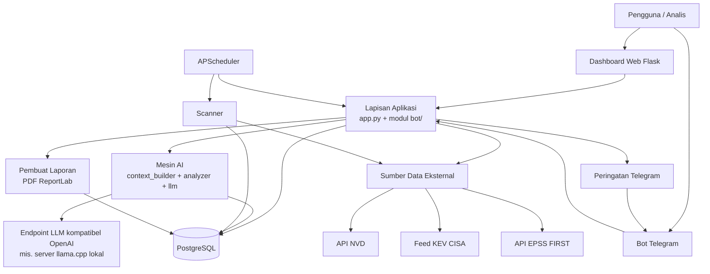
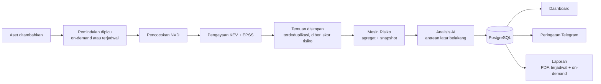

<div align="center">

# ARGUS

### Platform Manajemen Kerentanan Berbantuan AI

🌐 [English](README.md) | [Indonesia](README.id.md)

*Lacak aset, korelasikan dengan data CVE/KEV/EPSS terkini, prioritaskan berdasarkan risiko yang dihitung, dan dapatkan analisis yang berbasis AI — melalui dashboard Flask atau bot Telegram.*

[]()
[]()
[]()
[]()
[]()

[Fitur](#3-fitur-utama) • [Arsitektur](#5-arsitektur-sistem) • [Instalasi](#13-ringkasan-instalasi) • [Dokumentasi](#16-dokumentasi) • [Peta Jalan](#17-peta-jalan)

</div>

---

## Daftar Isi

1. [Ringkasan Proyek](#1-ringkasan-proyek)
2. [Deskripsi Proyek](#2-deskripsi-proyek)
3. [Fitur Utama](#3-fitur-utama)
4. [Tangkapan Layar](#4-tangkapan-layar)
5. [Arsitektur Sistem](#5-arsitektur-sistem)
6. [Tumpukan Teknologi](#6-tumpukan-teknologi)
7. [Struktur Folder](#7-struktur-folder)
8. [Komponen Inti](#8-komponen-inti)
9. [Alur Kerja](#9-alur-kerja)
10. [Kemampuan AI](#10-kemampuan-ai)
11. [Fitur Keamanan](#11-fitur-keamanan)
12. [Fitur Performa](#12-fitur-performa)
13. [Ringkasan Instalasi](#13-ringkasan-instalasi)
14. [Ringkasan Penggunaan](#14-ringkasan-penggunaan)
15. [Konfigurasi](#15-konfigurasi)
16. [Dokumentasi](#16-dokumentasi)
17. [Peta Jalan](#17-peta-jalan)
18. [Kontribusi](#18-kontribusi)
19. [Lisensi](#19-lisensi)
20. [Ucapan Terima Kasih](#20-ucapan-terima-kasih)
21. [Sangkalan](#21-sangkalan)
22. [Dukungan](#22-dukungan)
23. [Status Proyek](#23-status-proyek)

---

## 1. Ringkasan Proyek

ARGUS adalah platform manajemen kerentanan yang di-hosting sendiri (self-hosted), yang melacak inventaris aset tim keamanan, mencocokkan aset-aset tersebut dengan National Vulnerability Database (NVD), memperkaya temuan dengan katalog Known Exploited Vulnerabilities (KEV) milik CISA dan Exploit Prediction Scoring System (EPSS) milik FIRST, lalu menghitung skor risiko gabungan untuk keperluan prioritisasi.

Di atas alur inti tersebut, ARGUS menambahkan lapisan AI Security Copilot: sebuah antarmuka chat yang didasarkan pada data PostgreSQL milik operator sendiri secara langsung (bukan memori hasil pelatihan model), yang mampu menjawab pertanyaan berbahasa alami tentang temuan, aset, dan tren, serta sebuah pipeline latar belakang otomatis yang menghasilkan analisis terstruktur untuk setiap CVE yang baru ditemukan.

**Mengapa ARGUS dibuat.** Tim keamanan kecil dan menengah — serta analis individu yang mengelola lingkungan pribadi atau lab — sering kali sudah memiliki bahan mentah untuk manajemen kerentanan (daftar aset, akses ke feed NVD/KEV/EPSS) tetapi belum memiliki alat untuk mengorelasikannya secara berkelanjutan, memberi skor secara konsisten, atau menampilkan jawaban "apa yang paling penting sekarang" tanpa harus mencocokkan spreadsheet secara manual. ARGUS mengotomatiskan alur korelasi tersebut dan menambahkan lapisan percakapan di atas data yang dihasilkan.

**Audiens yang dituju.** Analis keamanan individu, tim SOC/CERT kecil, mahasiswa dan peneliti yang membangun atau mempelajari perangkat manajemen kerentanan, serta operator infrastruktur homelab/self-hosted yang menginginkan pelacakan CVE tanpa harus mengadopsi platform enterprise yang berat.

**Arsitektur dalam satu kalimat.** Sebuah basis data PostgreSQL bersama berada di belakang dua front end independen — dashboard web Flask dan bot Telegram — yang keduanya memanggil modul pemindaian, penilaian risiko, pelaporan, dan AI yang sama di bawah `bot/`.

**Filosofi desain.** ARGUS dibangun berdasarkan tiga prinsip: (1) skema basis data bersifat self-healing — aplikasi menerapkan migrasi idempotennya sendiri saat startup, alih-alih memerlukan langkah manual `psql`; (2) lapisan AI didasarkan secara eksplisit pada data nyata — setiap prompt yang dikirim ke LLM dibangun dari hasil query langsung, dan system prompt untuk analisis CVE menginstruksikan model untuk bernalar hanya dari data yang diberikan, bukan dari pengetahuan hasil pelatihannya yang mungkin sudah usang; dan (3) tidak ada yang berjalan dengan nilai default yang tidak aman — aplikasi menolak untuk berjalan tanpa `SECRET_KEY` dan kredensial admin/viewer yang eksplisit.

---

## 2. Deskripsi Proyek

**Tujuan.** ARGUS ada untuk menjawab tiga pertanyaan secara berkelanjutan untuk sekumpulan aset yang telah ditentukan: *kerentanan apa yang memengaruhi kita, mana di antaranya yang benar-benar sedang atau berpotensi dieksploitasi, dan apa yang harus diperbaiki terlebih dahulu.*

**Visi.** Satu sumber kebenaran tunggal yang di-hosting sendiri untuk paparan (exposure) sebuah organisasi — menggabungkan data kerentanan yang terstruktur dengan lapisan AI yang dapat menjelaskan dan merangkum data tersebut dalam bahasa alami, tanpa mengharuskan analis menulis SQL atau mencocokkan berbagai feed secara manual.

**Tujuan (Objectives).**
- Menjaga inventaris aset yang akurat dan bervariasi versi, lengkap dengan metadata kepemilikan dan tingkat kekritisan.
- Mencocokkan aset secara berkelanjutan dengan NVD, menandai keanggotaan KEV, dan melampirkan skor probabilitas eksploitasi EPSS.
- Menghitung skor risiko yang konsisten berbasis formula, sehingga temuan dapat diurutkan secara objektif, bukan ditriase berdasarkan perasaan.
- Menyediakan dua antarmuka operator (dashboard web, bot Telegram) yang didukung oleh satu lapisan data dan logika bisnis bersama.
- Mendasarkan respons AI pada data nyata dan bersikap eksplisit mengenai keterbatasan AI, alih-alih menampilkan model seolah-olah otoritatif.

**Filosofi desain inti.** Mengutamakan infrastruktur yang idempoten dan self-healing (migrasi skema yang aman untuk dijalankan ulang), kegagalan eksplisit alih-alih default diam-diam (rahasia/secret yang hilang membuat aplikasi crash saat startup, bukan malah jatuh ke kondisi yang tidak aman), serta lapisan data yang digunakan ulang secara identik oleh kedua front end — hanya ada satu paket `database/`, bukan salinan khusus bot dan salinan khusus web.

---

## 3. Fitur Utama

> Fitur di bawah ini mencerminkan apa yang telah diimplementasikan dalam basis kode saat ini. Apa pun yang tidak tercantum di sini sebagai sudah diimplementasikan, dilacak di bagian [Peta Jalan](#17-peta-jalan).

### Manajemen Aset
- Inventaris aset dengan vendor, produk, versi, dan **tipe** aset (Router, Switch, Firewall, Server, Workstation, Printer, Camera, IoT, NAS, WAP, PLC, Unknown)
- Metadata lokasi, kota, dan negara per aset (digunakan oleh dashboard City Exposure, lihat di bawah)
- Pelacakan kepemilikan (ownership) dan tingkat kekritisan (Low / Medium / High / Critical)
- Catatan bebas teks (free-text notes) per aset
- Timestamp `last_scan` yang diperbarui secara otomatis pada setiap pemindaian
- CRUD penuh melalui dashboard web (`/assets`, `/add_asset`, `/edit_asset`, `/delete_asset`) maupun Telegram (`/add`, `/asset`, `/edit`, `/rm`)

### Manajemen Kerentanan
- Integrasi API NVD dengan fallback CVSS otomatis dari v3.1 → v3.0 → v2
- Sinkronisasi katalog KEV milik CISA dengan cache lokal 24 jam serta retry/backoff saat feed gagal
- Pengambilan skor dan persentil EPSS, di-batch per aset untuk meminimalkan panggilan API
- Penentuan tingkat keparahan per-CVE (LOW / MEDIUM / HIGH / CRITICAL) dari CVSS
- Penyimpanan temuan yang terdeduplikasi (`UNIQUE(asset_id, cve_id)`) dengan pelacakan `first_seen` / `resolved_at`
- Alur status temuan (finding status workflow): status open/resolved, flag `patched`, serta penugasan ke individu atau tim
- Snapshot risiko historis yang dicatat secara terjadwal untuk analisis tren

### Fitur AI
- Chat AI Security Copilot (`/api/chat`), didasarkan pada konteks terstruktur yang disusun dari query PostgreSQL langsung — temuan, agregat dashboard, ringkasan per-aset, dan data KEV/tren — bukan dari pengambilan (retrieval) bebas bentuk
- Perutean intent (intent routing) yang mengklasifikasikan setiap pertanyaan (pencarian CVE, prioritisasi, perbandingan tren, ringkasan dashboard, temuan, aset, KEV, overdue, tim, umum) untuk memilih kumpulan query mana yang membangun konteks
- Riwayat dan persistensi percakapan multi-giliran (`ai_conversations` / `ai_messages`), dibatasi maksimal 20 pesan konteks per permintaan untuk membatasi ukuran prompt
- Pipeline analisis CVE latar belakang otomatis: setiap CVE yang baru ditemukan dimasukkan ke antrean, dianalisis oleh LLM menggunakan deskripsi NVD-nya ditambah konteks KEV/EPSS khusus ARGUS, dan disimpan sebagai kolom terstruktur (dampak teknis, tindakan yang direkomendasikan, dan lain-lain)
- Logika retry dan watchdog untuk pipeline analisis — analisis yang gagal dicoba ulang hingga tiga kali, dan sebuah job watchdog periodik memulihkan baris (row) yang macet di tengah pemrosesan
- Caching respons berdasarkan hash dari pertanyaan ditambah konteks data langsung, sehingga jawaban otomatis menjadi tidak valid (invalidate) saat temuan yang mendasarinya berubah, dengan TTL singkat sebagai jaring pengaman kedua
- Terhubung ke endpoint chat completions apa pun yang kompatibel dengan OpenAI melalui HTTP (`LLM_URL`), diuji terhadap server `llama.cpp` lokal; **tidak ada integrasi Ollama bawaan atau resmi (first-party) dalam basis kode saat ini**

### Mesin Risiko (Risk Engine)
- Formula risiko yang deterministik: `(CVSS × 10) + (persentil EPSS × 1000) + bonus kekritisan (0/10/20/30) + bonus KEV (50)`
- Skor risiko per temuan, dihitung ulang setiap kali pemindaian
- Snapshot risiko harian yang terjadwal untuk grafik tren historis
- Agregasi risiko per aset untuk tampilan prioritisasi

### Pelaporan
- Pembuatan laporan PDF (ReportLab) dengan header/footer yang terformat, tabel ringkasan eksekutif, dan tabel temuan yang menyorot entri KEV
- Pembuat laporan harian, mingguan, bulanan, dan tahunan
- Laporan mingguan dan bulanan terjadwal otomatis; pembuatan on-demand dari dashboard (`/generate_report/<type>`) dan Telegram (`/report`)
- Laporan yang dihasilkan disimpan dan dapat diunduh (`/download/<report_id>`)

### Peringatan (Alerts)
- Pengiriman peringatan Telegram untuk hasil pemindaian, digabungkan menjadi satu pesan per aset, bukan satu pesan per CVE
- Penyimpanan riwayat peringatan untuk keperluan audit

### Dashboard
- Dashboard web berbasis Flask dengan halaman landing, beranda dashboard yang terautentikasi, daftar/detail aset, daftar/detail temuan, penjelajah CVE (tampilan cache dan pencarian langsung), laporan, pencarian, serta halaman docs/fitur
- Grafik interaktif: distribusi aset, riwayat temuan, paparan (exposure) KEV, distribusi risiko, rincian per vendor
- City Exposure Overview — endpoint peta beragregasi tingkat kota (`/api/dashboard/city-exposure`) yang hanya mengembalikan angka rollup, tidak pernah detail per aset
- Pencarian lintas aset dan temuan
- Manajemen profil dan akun pengguna, termasuk penghapusan akun mandiri (self-service)

### Bot Telegram
- Perintah manajemen aset (`/add`, `/asset`, `/edit`, `/rm`)
- Pemindaian kerentanan on-demand dan terjadwal (`/scan`)
- Peninjauan temuan (`/findings`) dengan indikator tingkat keparahan dan KEV
- Pencarian kata kunci langsung ke NVD (`/cve`)
- Pemeriksaan kesehatan (health check) langsung untuk PostgreSQL dan API NVD (`/status`)
- Pembuatan laporan (`/report`) dan ringkasan harian (`/today`)
- Referensi perintah (`/help`)

### Scheduler
- Job latar belakang berbasis APScheduler: pemindaian aset harian (06:00), snapshot risiko harian (06:30), laporan mingguan (Senin 07:00), laporan bulanan (tanggal 1 setiap bulan, 07:00), batch analisis AI (setiap 5 menit), watchdog analisis AI (setiap 5 menit), dan pembersihan (purge) chat-cache (setiap 30 menit)

### Keamanan
- Autentikasi berbasis sesi Flask-Login dengan model dua peran (`admin`, `viewer`) yang bersumber dari variabel lingkungan (environment variable) wajib, ditambah alur pendaftaran pengguna mandiri (self-service registration)
- Perlindungan CSRF pada semua route yang mengubah state (Flask-WTF)
- Kata sandi di-hash menggunakan `generate_password_hash`/`check_password_hash` milik Werkzeug
- Cookie sesi `HttpOnly`, `SameSite=Lax`, aman secara default (`SESSION_COOKIE_SECURE`), dengan masa berlaku sesi 8 jam
- Kegagalan startup yang tegas (tanpa fallback yang tidak aman) jika `SECRET_KEY`, `ADMIN_PASSWORD`, atau `VIEWER_PASSWORD` tidak diset
- Dekorator `@admin_required` dan `@login_required` yang menegakkan kontrol akses di tingkat route

### Basis Data
- PostgreSQL dengan skema yang idempoten dan self-healing — `app.py` menerapkan tabel/kolom/view yang hilang saat startup, dan `migrate.py` menyediakan logika yang sama sebagai skrip mandiri (standalone)
- Tabel khusus untuk assets, CVE, matches/temuan, alerts, reports, users, percakapan AI, pesan AI, analisis AI CVE, snapshot risiko, dan cache respons AI
- View (`ai_dashboard`, `ai_open_findings`, `ai_asset_summary`, `ai_vulnerability_summary`) yang dibuat khusus agar query konteks AI tetap sederhana dan cepat

---

## 4. Tangkapan Layar

> Tangkapan layar belum disertakan dalam repositori ini. Placeholder di bawah menunjukkan lokasi tempat gambar tersebut akan ditambahkan.

| Tampilan | Pratinjau |
|---|---|
| Dashboard | `docs/screenshots/dashboard.png` *(menunggu)* |
| Login | `docs/screenshots/login.png` *(menunggu)* |
| Assets | `docs/screenshots/assets.png` *(menunggu)* |
| Findings | `docs/screenshots/findings.png` *(menunggu)* |
| Reports | `docs/screenshots/reports.png` *(menunggu)* |
| AI Chat | `docs/screenshots/ai-chat.png` *(menunggu)* |
| Telegram Bot | `docs/screenshots/telegram-bot.png` *(menunggu)* |
| Charts | `docs/screenshots/charts.png` *(menunggu)* |
| Risk Dashboard | `docs/screenshots/risk-dashboard.png` *(menunggu)* |

---

## 5. Arsitektur Sistem



Dashboard web dan bot Telegram adalah proses independen yang berbagi satu basis data PostgreSQL dan satu paket Python `bot/` (akses basis data, pemindaian, penilaian risiko, AI, dan logika pelaporan tidak diduplikasi di antara keduanya).

---

## 6. Tumpukan Teknologi

| Teknologi | Peran dalam ARGUS |
|---|---|
| **Python 3** | Bahasa implementasi utama baik untuk aplikasi Flask maupun bot Telegram |
| **Flask 3.x** | Dashboard web, routing, penanganan sesi |
| **Flask-Login** | Autentikasi dan manajemen sesi/pengguna |
| **Flask-WTF** | Perlindungan CSRF |
| **PostgreSQL** | Penyimpanan data utama — assets, CVE, temuan, users, percakapan AI, riwayat risiko |
| **psycopg2** | Driver PostgreSQL yang digunakan di seluruh lapisan `database/` |
| **APScheduler** | Penjadwalan job latar belakang (pemindaian, snapshot, laporan, batch AI) |
| **python-telegram-bot** | Kerangka kerja (framework) bot Telegram, perutean perintah |
| **requests / httpx** | Klien HTTP untuk NVD, KEV, EPSS, dan endpoint LLM |
| **ReportLab** | Pembuatan laporan PDF |
| **matplotlib** | Pembuatan gambar grafik untuk dashboard |
| **Werkzeug** | Hashing kata sandi, utilitas WSGI (bawaan Flask) |
| **Jinja2** | Rendering template sisi server (server-side) untuk dashboard |
| **HTML / CSS / JavaScript** | Front end dashboard (template yang dirender server dengan skrip grafik/interaksi sisi klien) |
| **API NVD** | Sumber data CVE dan CVSS yang otoritatif |
| **Feed KEV CISA** | Katalog Known Exploited Vulnerabilities |
| **API EPSS FIRST** | Data Exploit Prediction Scoring System |
| **Endpoint LLM kompatibel OpenAI** | Backend inferensi lokal untuk AI Security Copilot (diuji terhadap `llama.cpp`; server mana pun yang mengimplementasikan skema `/v1/chat/completions` bersifat kompatibel) |

---

## 7. Struktur Folder

```
argus/
├── app.py                    # Dashboard Flask: routes, auth, charts, reports, API chat AI, schema self-heal
├── requirements.txt           # Dependensi bersama untuk dashboard dan bot
├── database/                  # (tingkat atas) dicadangkan untuk aset skema/operasional
├── docker/                    # Dicadangkan untuk aset kontainerisasi (belum diisi)
├── docs/                      # Dicadangkan untuk dokumentasi lanjutan (belum diisi)
├── logs/                      # Output log saat runtime
├── static/                    # Aset statis dashboard (termasuk gambar grafik yang dihasilkan)
└── bot/
    ├── main.py                # Entry point bot Telegram — registrasi handler, boot scheduler
    ├── migrate.py              # Skrip migrasi skema idempoten yang berdiri sendiri (standalone)
    ├── config/                 # Pemuatan environment/config, koordinat lokasi untuk peta kota
    ├── database/                # Lapisan akses data bersama yang digunakan oleh dashboard dan bot
    │   ├── db.py                 # Factory koneksi
    │   ├── schema.sql            # Skema dasar (baseline)
    │   ├── assets.py             # CRUD aset, agregasi city-exposure
    │   ├── cves.py                # Upsert CVE + penentuan tingkat keparahan
    │   ├── matches.py             # CRUD temuan, pembaruan status/penugasan
    │   ├── conversations.py       # Persistensi percakapan/pesan AI
    │   ├── cve_analysis.py        # State machine pipeline analisis AI (pending/processing/done/failed)
    │   ├── chat_cache.py          # Cache respons AI berbasis hash
    │   ├── reports.py             # Persistensi catatan laporan
    │   └── risk_snapshots.py      # Penyimpanan snapshot risiko historis
    ├── handlers/                # Satu file per perintah Telegram
    ├── scanner/                  # Logika pemindaian inti — pencocokan NVD, pengayaan KEV/EPSS
    ├── nvd/                       # Klien API NVD (fallback CVSS v3.1→v3.0→v2, health check)
    ├── kev/                        # Klien feed KEV CISA (di-cache, dengan retry)
    ├── risk/                        # Formula penilaian risiko
    ├── Ai/                            # AI Security Copilot: penyusunan konteks, prompt, klien LLM, penganalisis CVE
    ├── reports/                        # Pembuat laporan PDF dan periodik (harian/mingguan/bulanan/tahunan)
    ├── alerts/                          # Pengiriman peringatan Telegram
    ├── jobs/                              # Definisi job APScheduler
    └── dashboard/                          # Template dan aset statis khusus dashboard
        ├── templates/                        # Template Jinja2 (dashboard, assets, findings, CVE, reports, auth, docs)
        ├── static/                             # CSS/JS/aset dashboard
        └── generated_reports/                   # Direktori output PDF
```

---

## 8. Komponen Inti

**Lapisan Basis Data** (`bot/database/`) — Satu paket bersama untuk seluruh persistensi, digunakan secara identik oleh aplikasi Flask dan bot Telegram. Setiap modul memiliki satu tabel atau satu ranah tanggung jawab (assets, CVE, matches, alerts, reports, users, percakapan AI, analisis AI, snapshot risiko, chat cache) dan membuka/menutup koneksinya sendiri per pemanggilan.

**Layanan Eksternal** (`bot/nvd/`, `bot/kev/`) — Klien yang ringkas dan tangguh (resilient) di sekitar API NVD dan feed KEV CISA. Klien NVD melakukan fallback lintas versi skema CVSS (v3.1 → v3.0 → v2) karena tidak semua catatan CVE mempublikasikan skema terbaru. Klien KEV menyimpan cache seluruh feed di memori selama 24 jam dengan retry/backoff untuk mentoleransi gangguan feed yang sifatnya sementara.

**Scanner** (`bot/scanner/`) — Mesin korelasi: untuk sebuah aset, melakukan query CVE yang cocok ke NVD, mengambil data EPSS secara batch, memeriksa keanggotaan KEV, dan menuliskan temuan yang terdeduplikasi lengkap dengan skor risiko yang telah dihitung.

**Bot Telegram** (`bot/main.py`, `bot/handlers/`) — Lapisan perintah yang ringkas; setiap handler mendelegasikan ke modul scanner/database/risk bersama, alih-alih mengimplementasikan ulang logikanya.

**Dashboard** (`app.py`, `bot/dashboard/`) — Front end web Flask: autentikasi, UI manajemen aset/temuan, API grafik, API chat AI, pembuatan/pengunduhan laporan, dan endpoint peta city-exposure.

**Mesin AI** (`bot/Ai/`) — Tiga bagian yang saling bekerja sama: `context_builder.py` mengklasifikasikan intent pertanyaan dan menyusun string konteks data langsung dari PostgreSQL; `llm.py` mengirim konteks tersebut ke endpoint chat completions yang kompatibel dengan OpenAI; `analyzer.py` menjalankan pipeline analisis CVE latar belakang otomatis dengan retry, watchdog, dan penanganan output JSON terstruktur.

**Scheduler** (`bot/jobs/daily_scan.py`) — Memiliki (owns) setiap job berulang dalam sistem: pemindaian, snapshot risiko, laporan mingguan/bulanan, batch analisis AI, sapuan (sweep) watchdog AI, dan pembersihan chat-cache.

**Mesin Risiko** (`bot/risk/scoring.py`) — Satu fungsi murni (pure function) yang mengimplementasikan formula risiko, dipanggil baik oleh scanner (skor per temuan) maupun job snapshot risiko (tren agregat).

**Reports** (`bot/reports/`) — Pembuat laporan berbasis periode (harian/mingguan/bulanan/tahunan) ditambah renderer PDF berbasis ReportLab dengan header/footer yang konsisten serta tabel temuan yang menyorot entri KEV.

**Alerts** (`bot/alerts/`) — Pengiriman Telegram untuk hasil pemindaian, di-batch per aset, dengan pengiriman yang dijaga (guarded) sehingga kegagalan kirim tidak pernah membuat proses pemindaian crash.

---

## 9. Alur Kerja



1. **Aset ditambahkan** — melalui dashboard (`/add_asset`) atau Telegram (`/add`), lengkap dengan vendor, produk, versi, dan tipe.
2. **Pemindaian dipicu** — on-demand (`/scan`, atau aksi dashboard) atau oleh job terjadwal harian (06:00).
3. **Pencocokan NVD** — scanner melakukan query ke NVD untuk mencari CVE yang cocok dengan vendor/produk/versi aset.
4. **Pengayaan KEV + EPSS** — setiap CVE yang cocok diperiksa terhadap set KEV yang di-cache dan diperkaya dengan pencarian EPSS secara batch.
5. **Temuan disimpan** — pasangan (asset, CVE) baru dimasukkan dengan semantik `ON CONFLICT DO NOTHING`/upsert beserta skor risiko yang telah dihitung; `last_scan` pada aset diperbarui.
6. **Mesin Risiko** — skor per temuan digabungkan (roll up) ke tampilan tingkat aset; job snapshot harian mencatat kondisi risiko pada suatu titik waktu (point-in-time) untuk analisis tren.
7. **Analisis AI** — CVE baru dimasukkan ke antrean untuk analisis latar belakang; pipeline penganalisis mengambilnya pada interval 5 menit dan menyimpan kolom dampak teknis serta remediasi yang terstruktur.
8. **Basis Data** — sumber kebenaran tunggal yang dibaca oleh setiap konsumen hilir (downstream).
9. **Dashboard** — menampilkan temuan, grafik, dan chat AI, semuanya dibaca langsung dari PostgreSQL.
10. **Peringatan Telegram** — sebuah pesan peringatan gabungan per aset dikirim untuk temuan yang baru ditemukan.
11. **Laporan** — laporan PDF mingguan dan bulanan dibuat secara otomatis; laporan harian/tahunan dan on-demand dapat dipicu secara manual dari kedua antarmuka.

---

## 10. Kemampuan AI

**Cara kerjanya.** AI Security Copilot tidak menggunakan pengambilan (retrieval) dari dokumen tak terstruktur atau vector store. Sebagai gantinya, `context_builder.py` mengklasifikasikan intent dari sebuah pertanyaan (pencarian CVE, prioritisasi, tren, ringkasan dashboard, aset, KEV, overdue, tim, atau umum) dan menjalankan sekumpulan kecil query SQL terparameter yang telah ditentukan sebelumnya (`queries.py`) terhadap view basis data khusus AI. Baris hasil query tersebut diformat menjadi blok konteks berupa teks biasa dan dikirim ke LLM bersama pertanyaan pengguna serta riwayat percakapan terbaru.

**Inferensi lokal.** ARGUS berkomunikasi dengan server mana pun yang mengimplementasikan skema `/v1/chat/completions` yang kompatibel dengan OpenAI, dikonfigurasi melalui variabel lingkungan `LLM_URL`. Ini telah diuji terhadap server `llama.cpp` lokal; tidak ada klien Ollama bawaan atau alur kode (code path) khusus Ollama dalam implementasi saat ini, meskipun sebuah instance Ollama yang mengekspos endpoint kompatibel OpenAI akan berfungsi sebagai target `LLM_URL` yang bisa langsung dipasang (drop-in).

**Memori percakapan.** Percakapan dan masing-masing pesan disimpan secara persisten (`ai_conversations`, `ai_messages`), memungkinkan pengguna melanjutkan thread sebelumnya. Untuk membatasi ukuran prompt dan biaya, hanya 20 pesan terbaru dari sebuah percakapan yang disertakan sebagai riwayat dalam satu permintaan — memori tidak dipertahankan tanpa batas.

**Landasan bergaya "RAG", dinyatakan secara tepat.** ARGUS tidak mengimplementasikan retrieval-augmented generation dalam pengertian basis data vektor (tidak ada embedding, tidak ada pencarian similaritas). Yang diimplementasikan adalah pengambilan terstruktur (structured retrieval) — SQL langsung dan terparameter terhadap data temuan/CVE/aset yang nyata — digunakan untuk mendasarkan setiap prompt pada fakta terkini, bukan pada data pelatihan model. Hal ini dinyatakan secara eksplisit, alih-alih diberi label "RAG" tanpa kualifikasi, untuk menghindari melebih-lebihkan arsitektur yang sebenarnya.

**Penyusunan prompt.** System prompt pada pipeline analisis CVE secara eksplisit menginstruksikan model untuk bernalar hanya dari deskripsi NVD, CVSS, status KEV, dan skor EPSS yang diberikan — bukan dari memori hasil pelatihannya sendiri tentang CVE tersebut — serta mengembalikan JSON yang ketat (strict) agar respons dapat dipecah menjadi kolom-kolom basis data terpisah. Respons yang cacat format (malformed) diperlakukan sebagai kegagalan dan dicoba ulang (hingga tiga kali percobaan), bukan disimpan sebagian.

**Manajemen konteks.** Kumpulan hasil query dibatasi (misalnya, 20 baris untuk temuan yang masih terbuka/open, 10 baris untuk ringkasan aset) untuk menjaga prompt tetap berada dalam anggaran token yang wajar bagi model lokal yang lebih kecil.

**Pengambilan pengetahuan dan mitigasi halusinasi.** Mendasarkan setiap analisis pada data langsung yang terstruktur — alih-alih mengandalkan memori model tentang suatu CVE — adalah strategi utama mitigasi halusinasi dalam basis kode ini. System prompt memperkuat hal ini dengan menginstruksikan model untuk tidak mengandalkan pengetahuannya sendiri tentang suatu CVE, karena pengetahuan tersebut mungkin sudah usang atau bahkan salah.

**Penanganan batas pengetahuan (knowledge cutoff).** Karena analisis didasarkan pada deskripsi NVD serta nilai KEV/EPSS terkini yang diambil pada saat pemindaian, *data* yang mendasari jawaban AI sama terkininya dengan pemindaian/sinkronisasi terakhir — tidak dibatasi oleh batas pengetahuan (training cutoff) model yang mendasarinya. Pengetahuan umum model itu sendiri (misalnya, tren eksploitasi yang lebih luas yang tidak tercermin dalam KEV/EPSS) tetap tunduk pada batas pelatihannya dan tidak diperiksa faktanya (fact-checked) oleh ARGUS.

**Keterbatasan yang diakui secara jujur.** Lapisan AI bergantung pada endpoint LLM eksternal yang dapat dijangkau dan dikonfigurasi; jika `LLM_URL` tidak diset, API chat mengembalikan error eksplisit "belum dikonfigurasi" alih-alih gagal secara diam-diam atau mengarang (fabricating) sebuah respons. Kualitas respons sepenuhnya bergantung pada model yang terhubung — ARGUS tidak melakukan fine-tuning atau membatasi perilaku model dengan cara lain selain melalui penyusunan prompt. Respons yang di-cache dapat menjadi usang (stale) dalam jendela TTL-nya jika kualitas jawaban model yang mendasarinya seharusnya berubah untuk konteks yang sama (kasus tepi/edge case dengan probabilitas rendah namun mungkin terjadi). Analisis dan respons chat yang dihasilkan AI bukan pengganti penilaian keamanan manual — lihat bagian [Sangkalan](#21-sangkalan).

---

## 11. Fitur Keamanan

- **Autentikasi** — Manajemen sesi Flask-Login untuk dua peran bawaan (`admin`, `viewer`) yang bersumber dari variabel lingkungan wajib, ditambah alur pendaftaran mandiri untuk pengguna tambahan yang disimpan dalam tabel `users`.
- **Otorisasi** — Dekorator `@login_required` dan `@admin_required` di tingkat route; permintaan khusus admin yang tidak berwenang mengembalikan `403 Forbidden`.
- **Perlindungan CSRF** — Diberlakukan secara global melalui `CSRFProtect` milik Flask-WTF pada semua route yang mengubah state.
- **Hashing kata sandi** — Semua kredensial, baik bawaan maupun hasil pendaftaran mandiri, di-hash menggunakan `generate_password_hash`/`check_password_hash` milik Werkzeug; tidak ada kata sandi plaintext yang pernah disimpan secara persisten.
- **Cookie yang aman** — Cookie sesi bersifat `HttpOnly`, `SameSite=Lax`, dan aman secara default (`SESSION_COOKIE_SECURE=true` kecuali secara eksplisit di-override untuk pengujian HTTP lokal), dengan masa berlaku sesi 8 jam.
- **Variabel lingkungan** — Semua rahasia (`SECRET_KEY`, `ADMIN_PASSWORD`, `VIEWER_PASSWORD`, `NVD_API_KEY`, kredensial basis data, `TOKEN` untuk bot, `LLM_URL`) dibaca dari environment; tidak ada satu pun yang memiliki nilai default bawaan yang tidak aman untuk nilai-nilai yang bersifat kritis bagi keamanan.
- **Kegagalan startup yang tegas (fail-closed)** — Aplikasi memunculkan `RuntimeError` dan menolak untuk berjalan jika `SECRET_KEY`, `ADMIN_PASSWORD`, atau `VIEWER_PASSWORD` tidak ada, alih-alih menggantinya dengan nilai default.
- **Least privilege (paparan data)** — Endpoint peta City Exposure hanya mengembalikan angka teragregasi di tingkat kota dan secara sengaja mengecualikan catatan aset individual, lokasi presisi, atau metadata sensitif lainnya.
- **Perlindungan basis data** — Semua query diparameterisasi melalui `psycopg2`; tidak ada konstruksi string SQL dinamis dari input pengguna pada modul akses data yang telah ditinjau.
- **Validasi input** — Validasi di tingkat form pada pendaftaran (panjang username, kecocokan konfirmasi kata sandi, pemeriksaan username duplikat) dan pada form aset.
- **Audit logging** — Logging terstruktur (modul `logging`) di seluruh scanner, pipeline AI, dan penanganan error; pesan peringatan historis disimpan dalam tabel `alerts`. Saat ini belum ada tabel audit-log keamanan khusus yang dapat di-query di luar log aplikasi dan riwayat alerts.

---

## 12. Fitur Performa

- **Caching** — Respons chat AI di-cache berdasarkan hash dari pertanyaan ditambah konteks data langsungnya, sehingga pertanyaan berulang terhadap data yang tidak berubah sepenuhnya melewati (skip) pemanggilan LLM; sebuah job terjadwal membersihkan entri cache yang kedaluwarsa setiap 30 menit.
- **Optimasi basis data** — View SQL yang dibuat khusus (`ai_dashboard`, `ai_open_findings`, `ai_asset_summary`, `ai_vulnerability_summary`) menghitung di muka (precompute) agregasi umum sehingga penyusunan konteks AI dan grafik dashboard menghindari pengulangan join yang kompleks pada setiap permintaan.
- **Panggilan eksternal secara batch** — Skor EPSS diambil dalam satu permintaan batch per pemindaian aset, bukan satu permintaan per CVE; keanggotaan KEV diperiksa terhadap set yang di-cache di memori, bukan panggilan API langsung per pencarian.
- **Paginasi** — Tampilan daftar temuan dan aset dipaginasi di dashboard, alih-alih merender seluruh isi tabel sekaligus.
- **Job latar belakang** — Pemindaian, snapshot risiko, pembuatan laporan, dan analisis AI semuanya berjalan pada job latar belakang APScheduler, alih-alih memblokir siklus request/response.
- **Ukuran batch yang dibatasi** — Pipeline analisis AI membatasi dirinya hingga 5 CVE per putaran batch (dapat dikonfigurasi) dengan jeda antar-permintaan yang kecil, sehingga lonjakan CVE yang baru ditemukan tidak dapat memonopoli server LLM lokal yang single-threaded atau menghambat job terjadwal lainnya.
- **Konteks percakapan yang dibatasi** — Riwayat percakapan AI yang dikirim ke LLM dibatasi maksimal 20 pesan, mencegah pertumbuhan prompt yang tidak terbatas pada percakapan yang berlangsung lama.

---

## 13. Ringkasan Instalasi

```bash
# 1. Clone repositori
git clone <repo-url> && cd argus

# 2. Instal dependensi (digunakan bersama oleh dashboard dan bot)
pip install -r requirements.txt

# 3. Konfigurasi variabel lingkungan — lihat bagian Konfigurasi di bawah
cp .env.example .env   # buat file ini dari variabel yang tercantum di §15
$EDITOR .env

# 4. Jalankan dashboard web (otomatis menerapkan migrasi skema saat startup)
python app.py

# 5. Jalankan bot Telegram (proses terpisah, berbagi basis data yang sama)
cd bot && python main.py
```

Untuk panduan deployment produksi (batasan worker Gunicorn, reverse proxy, terminasi TLS), lihat dokumentasi instalasi lengkap yang dirujuk pada [§16 Dokumentasi](#16-dokumentasi).

---

## 14. Ringkasan Penggunaan

- **Dashboard** — Login di `/login`, lalu kelola aset di `/assets`, tinjau temuan di `/findings`, jelajahi CVE di `/cves`, dan lihat grafik di `/charts`.
- **Telegram** — Kirim pesan ke bot yang telah dikonfigurasi dengan `/help` untuk daftar perintah lengkap; mulai dengan `/add` untuk mendaftarkan sebuah aset dan `/scan <id>` untuk menjalankan pemindaian pertama.
- **AI Chat** — Tersedia dari antarmuka chat dashboard (`/api/chat`); ajukan pertanyaan seperti "apa yang harus saya perbaiki lebih dulu?" atau "rangkum temuan minggu ini."
- **Pemindaian (Scanning)** — Berjalan otomatis sekali sehari; picu on-demand dari dashboard atau dengan `/scan <id>` di Telegram.
- **Laporan** — PDF mingguan dan bulanan dibuat otomatis; minta satu laporan on-demand dari halaman Reports pada dashboard atau dengan `/report` di Telegram.
- **Peringatan (Alerts)** — Dikirim otomatis ke Telegram setelah setiap pemindaian yang menemukan kecocokan baru; tidak ada langkah opt-in terpisah yang diperlukan selain mengonfigurasi token bot.

Dokumentasi lengkap tingkat endpoint dan perintah dirujuk pada [§16 Dokumentasi](#16-dokumentasi).

---

## 15. Konfigurasi

ARGUS dikonfigurasi sepenuhnya melalui variabel lingkungan, dimuat melalui `python-dotenv`. Minimal yang diperlukan:

| Variabel | Diperlukan untuk | Catatan |
|---|---|---|
| `SECRET_KEY` | Dashboard | Kunci penandatanganan sesi Flask; aplikasi menolak berjalan jika tidak diset |
| `ADMIN_PASSWORD` | Dashboard | Kata sandi akun bawaan `admin`; aplikasi menolak berjalan jika tidak diset |
| `VIEWER_PASSWORD` | Dashboard | Kata sandi akun bawaan `viewer`; aplikasi menolak berjalan jika tidak diset |
| `DB_HOST`, `DB_NAME`, `DB_USER`, `DB_PASSWORD` | Dashboard + Bot | Koneksi PostgreSQL |
| `TOKEN` | Bot | Token bot Telegram; bot menolak berjalan jika tidak diset |
| `NVD_API_KEY` | Dashboard + Bot | Direkomendasikan untuk batas laju (rate limit) API NVD yang lebih tinggi |
| `LLM_URL` | AI Chat / Analisis AI | URL lengkap endpoint `/v1/chat/completions` yang kompatibel dengan OpenAI; jika tidak diset, endpoint chat AI mengembalikan error "belum dikonfigurasi" yang jelas, alih-alih gagal secara diam-diam |
| `SESSION_COOKIE_SECURE` | Dashboard | Default `true`; set ke `false` hanya untuk pengujian HTTP lokal/LAN |

Skema basis data tidak perlu diterapkan secara manual — baik `app.py` maupun `bot/main.py` (melalui `migrate.py`) menerapkan migrasi skema yang idempoten saat startup. Referensi konfigurasi lengkap, termasuk variabel tuning opsional, dibahas dalam dokumentasi instalasi yang dirujuk di bawah, bukan diduplikasi di sini.

---

## 16. Dokumentasi

| Dokumen | Deskripsi | Status |
|---|---|---|
| `INSTALL.md` | Panduan instalasi lengkap dan deployment produksi | Belum dipublikasikan — lihat [§13](#13-ringkasan-instalasi) untuk quick start |
| `API.md` | Referensi route dashboard dan JSON API | Belum dipublikasikan — lihat [§14](#14-ringkasan-penggunaan) untuk ringkasan |
| `ARCHITECTURE.md` | Dokumentasi arsitektur dan alur data secara lanjutan | Belum dipublikasikan — lihat [§5](#5-arsitektur-sistem) dan [§8](#8-komponen-inti) |
| `DATABASE.md` | Referensi skema lengkap | Belum dipublikasikan — lihat `bot/database/schema.sql` dan `bot/migrate.py` di repositori |
| `AI.md` | Referensi desain dan prompt AI Security Copilot | Belum dipublikasikan — lihat [§10](#10-kemampuan-ai) |
| `SECURITY.md` | Model keamanan dan proses pengungkapan (disclosure) yang bertanggung jawab | Belum dipublikasikan — lihat [§11](#11-fitur-keamanan) |
| `DEPLOYMENT.md` | Deployment terkontainerisasi/produksi | Belum dipublikasikan — direktori `docker/` saat ini masih placeholder |
| `ROADMAP.md` | Fitur dan prioritas yang direncanakan | Belum dipublikasikan — lihat [§17](#17-peta-jalan) |

Direktori `docs/` dalam repositori ini saat ini masih placeholder; bagian-bagian di atas dalam README ini adalah dokumentasi otoritatif sampai file-file tersebut dipublikasikan.

---

## 17. Peta Jalan

Berikut ini adalah hal-hal yang **direncanakan, belum diimplementasikan**. Dicantumkan di sini untuk mengomunikasikan arah pengembangan, bukan kapabilitas yang sudah ada saat ini.

- Alur kerja Agentic AI (aksi AI multi-langkah yang menggunakan tool, bukan sekadar chat/analisis satu giliran)
- Pemetaan teknik MITRE ATT&CK untuk temuan
- Peta Lokasi & Risiko Aset per-aset yang benar-benar interaktif (implementasi saat ini hanya berupa tampilan exposure teragregasi di tingkat kota — lihat [§3](#3-fitur-utama))
- Agregasi feed threat-intelligence yang lebih luas di luar NVD/KEV/EPSS
- REST API yang terdokumentasi dan berversi (endpoint HTTP saat ini bersifat internal untuk dashboard, bukan API eksternal yang dipublikasikan)
- Dukungan GraphQL API
- Multi-tenancy
- SSO Enterprise (SAML/OIDC)
- Sistem plugin/ekstensi
- Pemindaian terdistribusi atau berskala horizontal
- Pengambilan (retrieval) berbasis vector database untuk lapisan AI (konteks AI saat ini berbasis SQL, bukan berbasis embedding — lihat [§10](#10-kemampuan-ai))
- Pembaruan dashboard real-time (berbasis WebSocket)
- Pelaporan kepatuhan (compliance) formal (misalnya, dipetakan ke kerangka kerja regulasi tertentu)
- Tindakan remediasi berbantuan AI (di luar analisis dan chat read-only saat ini)
- Analisis risiko prediktif (memprediksi risiko masa depan, bukan sekadar memberi skor pada temuan saat ini)
- Aset deployment terkontainerisasi (`docker/` saat ini merupakan direktori placeholder kosong)
- File dokumentasi yang dipublikasikan sebagaimana tercantum di [§16](#16-dokumentasi)

---

## 18. Kontribusi

1. **Fork** repositori.
2. **Branch** dari branch default menggunakan nama yang deskriptif (misalnya, `fix/kev-cache-retry`, `feature/report-export`).
3. **Commit** dalam perubahan yang kecil dan terfokus dengan pesan yang jelas.
4. **Pull Request** terhadap branch default, jelaskan apa yang berubah dan mengapa.
5. **Standar koding** — ikuti batasan modul yang sudah ada (akses data tetap berada di `database/`, klien API eksternal tetap berada di paketnya masing-masing, route handler tetap ringkas dan mendelegasikan ke modul-modul tersebut). Sesuaikan dengan pola logging dan penanganan error yang sudah ada, alih-alih memperkenalkan pola baru per file.
6. **Pelaporan issue** — buka issue dengan langkah-langkah reproduksi, perilaku yang diharapkan vs. yang sebenarnya terjadi, dan output log yang relevan. Untuk isu yang sensitif terkait keamanan, lihat [§22 Dukungan](#22-dukungan).

---

## 19. Lisensi

*Lisensi belum ditentukan.* Belum ada lisensi yang dideklarasikan untuk proyek ini. Sampai file `LICENSE` ditambahkan, seluruh hak dicadangkan (reserved) oleh penulis/pemilik proyek — jangan asumsikan penggunaan ulang (reuse) yang bersifat permisif.

---

## 20. Ucapan Terima Kasih

- **NVD (National Vulnerability Database)**, yang dikelola oleh NIST, untuk data CVE dan CVSS.
- **CISA**, untuk katalog Known Exploited Vulnerabilities (KEV).
- **OpenCVE**, dirujuk sebagai proyek ekosistem sumber data dalam ranah perangkat CVE yang lebih luas.
- **FIRST.org**, untuk Exploit Prediction Scoring System (EPSS).
- **Komunitas open-source** di balik Flask, PostgreSQL, APScheduler, python-telegram-bot, ReportLab, dan ekosistem Python yang lebih luas yang menjadi fondasi proyek ini.

---

## 21. Sangkalan

ARGUS dirancang untuk **membantu (assist)** analis keamanan — bukan menggantikan asesmen keamanan profesional, penetration test, atau penilaian dari analis yang kompeten. Skor risiko, analisis yang dihasilkan AI, dan respons chat AI adalah alat bantu pengambilan keputusan (decision-support), bukan penetapan yang otoritatif. **Konten yang dihasilkan AI harus selalu diverifikasi secara independen** sebelum digunakan untuk mendasari keputusan keamanan, prioritisasi patch, atau klaim kepatuhan (compliance). Data kerentanan (NVD, KEV, EPSS) mencerminkan kondisi feed upstream tersebut pada saat sinkronisasi terakhir dan mungkin belum mencakup perkembangan terbaru untuk suatu CVE tertentu.

---

## 22. Dukungan

- **GitHub Issues** — untuk laporan bug dan permintaan fitur *(tautan akan ditambahkan setelah repositori bersifat publik)*
- **Discussions** — untuk pertanyaan dan diskusi umum *(tautan akan ditambahkan setelah diaktifkan)*
- **Dokumentasi** — lihat [§16](#16-dokumentasi) untuk status terkini
- **Situs web** — belum tersedia

---

## 23. Status Proyek

ARGUS sedang dalam **pengembangan aktif**. Alur inti (pelacakan aset, pemindaian berbasis NVD/KEV/EPSS, penilaian risiko, dashboard web, bot Telegram, pelaporan PDF, dan AI Security Copilot) telah diimplementasikan dan berfungsi, sebagaimana dijelaskan secara rinci di [§3](#3-fitur-utama).

| Area | Status |
|---|---|
| Manajemen aset, pemindaian, penilaian risiko | Diimplementasikan |
| Dashboard web (auth, assets, findings, CVE, charts, reports, search) | Diimplementasikan |
| Bot Telegram (kumpulan perintah lengkap) | Diimplementasikan |
| Chat AI Security Copilot + persistensi percakapan | Diimplementasikan |
| Analisis AI CVE latar belakang otomatis | Diimplementasikan |
| Pemindaian, snapshot, dan laporan terjadwal | Diimplementasikan |
| Peta exposure tingkat kota | Diimplementasikan |
| Peta risiko interaktif per-aset | Diimplementasikan |
| Deployment Docker/terkontainerisasi | Direncanakan (baru berupa placeholder direktori) |
| Kumpulan dokumentasi lanjutan (`docs/`) | Direncanakan (baru berupa placeholder direktori) |

Proyek ini belum menjalani audit keamanan eksternal. Perlakukan sebagai proyek yang cocok untuk penggunaan pribadi, lab, atau evaluasi internal, dan tinjau [§11 Fitur Keamanan](#11-fitur-keamanan) serta [§21 Sangkalan](#21-sangkalan) sebelum melakukan deployment produksi apa pun.
