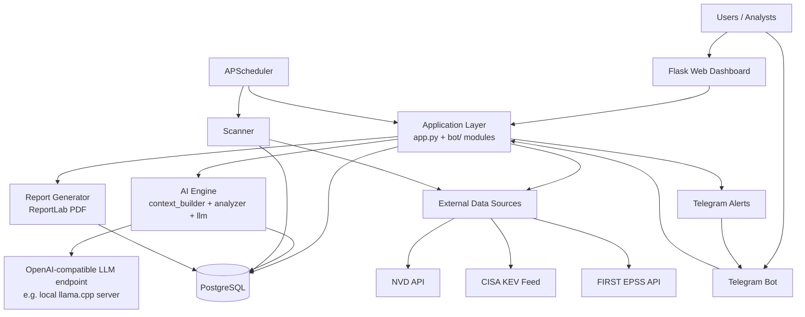
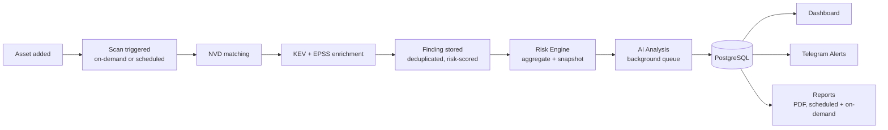

<div align="center">

# ARGUS

### AI-Assisted Vulnerability Management Platform

🌐 [English](README.md) | [Indonesia](README.id.md)

*Track assets, correlate them against live CVE/KEV/EPSS data, prioritize by calculated risk, and get AI-grounded analysis — through a Flask dashboard or a Telegram bot.*

[]()
[]()
[]()
[]()
[]()

[Features](#3-key-features) • [Architecture](#5-system-architecture) • [Installation](#13-installation-overview) • [Documentation](#16-documentation) • [Roadmap](#17-roadmap)

</div>

---

## Table of Contents

1. [Project Overview](#1-project-overview)
2. [Project Description](#2-project-description)
3. [Key Features](#3-key-features)
4. [Screenshots](#4-screenshots)
5. [System Architecture](#5-system-architecture)
6. [Technology Stack](#6-technology-stack)
7. [Folder Structure](#7-folder-structure)
8. [Core Components](#8-core-components)
9. [Workflow](#9-workflow)
10. [AI Capabilities](#10-ai-capabilities)
11. [Security Features](#11-security-features)
12. [Performance Features](#12-performance-features)
13. [Installation Overview](#13-installation-overview)
14. [Usage Overview](#14-usage-overview)
15. [Configuration](#15-configuration)
16. [Documentation](#16-documentation)
17. [Roadmap](#17-roadmap)
18. [Contributing](#18-contributing)
19. [License](#19-license)
20. [Acknowledgements](#20-acknowledgements)
21. [Disclaimer](#21-disclaimer)
22. [Support](#22-support)
23. [Project Status](#23-project-status)

---

## 1. Project Overview

ARGUS is a self-hosted vulnerability management platform that tracks a security team's asset inventory, matches those assets against the National Vulnerability Database (NVD), enriches findings with CISA's Known Exploited Vulnerabilities (KEV) catalogue and FIRST's Exploit Prediction Scoring System (EPSS), and calculates a composite risk score for prioritization.

On top of that core pipeline, ARGUS layers an AI Security Copilot: a chat interface, grounded in the operator's own live PostgreSQL data (not the model's training memory), that can answer natural-language questions about findings, assets, and trends, and an automated background pipeline that generates a structured analysis for every newly discovered CVE.

**Why it exists.** Small and mid-sized security teams — and individual analysts managing a personal or lab environment — often have the raw ingredients for vulnerability management (an asset list, access to NVD/KEV/EPSS feeds) but not the tooling to correlate them continuously, score them consistently, or surface the "what matters right now" answer without manually cross-referencing spreadsheets. ARGUS automates that correlation loop and adds a conversational layer on top of the resulting data.

**Intended audience.** Individual security analysts, small SOC/CERT teams, students and researchers building or studying vulnerability management tooling, and homelab/self-hosted infrastructure operators who want CVE tracking without adopting a heavyweight enterprise platform.

**Architecture in one sentence.** A shared PostgreSQL database sits behind two independent front ends — a Flask web dashboard and a Telegram bot — both of which call into the same scanning, risk-scoring, reporting, and AI modules under `bot/`.

**Design philosophy.** ARGUS is built around three principles: (1) the database schema is self-healing — the application applies its own idempotent migrations at startup rather than requiring a manual `psql` step; (2) the AI layer is explicitly grounded — every prompt sent to the LLM is built from live query results, and the system prompt for CVE analysis instructs the model to reason only from supplied data rather than its own training knowledge, which may be stale; and (3) nothing runs with insecure defaults — the application refuses to start without an explicit `SECRET_KEY` and admin/viewer credentials.

---

## 2. Project Description

**Purpose.** ARGUS exists to answer three questions for a defined set of assets on an ongoing basis: *what vulnerabilities affect us, which of those are actually being exploited or likely to be, and what should be fixed first.*

**Vision.** A single, self-hosted source of truth for an organization's exposure — combining structured vulnerability data with an AI layer that can explain and summarize that data in natural language, without requiring analysts to write SQL or cross-reference multiple feeds by hand.

**Objectives.**
- Maintain an accurate, versioned asset inventory with ownership and criticality metadata.
- Continuously match assets against NVD, flag KEV membership, and attach EPSS exploitation-probability scores.
- Calculate a consistent, formula-based risk score so findings can be objectively ranked rather than triaged by feel.
- Provide two operator interfaces (web dashboard, Telegram bot) backed by one shared data and business-logic layer.
- Ground AI responses in live data and be explicit about AI limitations rather than presenting the model as authoritative.

**Core design philosophy.** Favor idempotent, self-healing infrastructure (schema migrations that are safe to re-run), explicit failure over silent defaults (missing secrets crash the app on startup rather than falling back to something insecure), and a data layer that is reused identically by both front ends — there is one `database/` package, not a bot-specific and a web-specific copy.

---

## 3. Key Features

> Features below reflect what is implemented in the current codebase. Anything not listed here as implemented is tracked in the [Roadmap](#17-roadmap).

### Asset Management
- Asset inventory with vendor, product, version, and asset **type** (Router, Switch, Firewall, Server, Workstation, Printer, Camera, IoT, NAS, WAP, PLC, Unknown)
- Location, city, and country metadata per asset (used by the City Exposure dashboard, see below)
- Ownership and criticality (Low / Medium / High / Critical) tracking
- Free-text notes per asset
- `last_scan` timestamp maintained automatically on every scan
- Full CRUD via both the web dashboard (`/assets`, `/add_asset`, `/edit_asset`, `/delete_asset`) and Telegram (`/add`, `/asset`, `/edit`, `/rm`)

### Vulnerability Management
- NVD API integration with automatic CVSS fallback across v3.1 → v3.0 → v2 scoring
- CISA KEV catalogue synchronization with a 24-hour local cache and retry/backoff on feed failures
- EPSS score and percentile ingestion, batched per asset to minimize API calls
- Per-CVE severity derivation (LOW / MEDIUM / HIGH / CRITICAL) from CVSS
- Deduplicated finding storage (`UNIQUE(asset_id, cve_id)`) with `first_seen` / `resolved_at` tracking
- Finding status workflow: open/resolved state, a `patched` flag, and assignment to an individual or team
- Historical risk snapshots recorded on a schedule for trend analysis

### AI Features
- AI Security Copilot chat (`/api/chat`), grounded in a structured context assembled from live PostgreSQL queries — findings, dashboard aggregates, per-asset summaries, and KEV/trend data — rather than free-form retrieval
- Intent routing that classifies each question (CVE lookup, prioritization, trend comparison, dashboard summary, findings, asset, KEV, overdue, team, general) to select which query set builds the context
- Multi-turn conversation history and persistence (`ai_conversations` / `ai_messages`), capped at 20 messages of context per request to bound prompt size
- Automated background CVE analysis pipeline: every newly discovered CVE is queued, analyzed by the LLM using its NVD description plus ARGUS-specific KEV/EPSS context, and stored as structured fields (technical impact, recommended actions, etc.)
- Retry and watchdog logic for the analysis pipeline — failed analyses retry up to three times, and a periodic watchdog job recovers rows stuck mid-processing
- Response caching keyed on a hash of the question plus the live data context, so answers automatically invalidate when underlying findings change, with a short TTL as a second safety net
- Connects to any OpenAI-compatible chat completions endpoint over HTTP (`LLM_URL`), evaluated against a local `llama.cpp` server; **no bundled or first-party Ollama integration exists in the current codebase**

### Risk Engine
- Deterministic risk formula: `(CVSS × 10) + (EPSS percentile × 1000) + criticality bonus (0/10/20/30) + KEV bonus (50)`
- Per-finding risk score, recalculated on scan
- Scheduled daily risk snapshots for historical trend charts
- Risk aggregation by asset for prioritization views

### Reporting
- PDF report generation (ReportLab) with a formatted header/footer, executive summary table, and KEV-highlighted findings table
- Daily, weekly, monthly, and yearly report generators
- Weekly and monthly reports scheduled automatically; on-demand generation from the dashboard (`/generate_report/<type>`) and Telegram (`/report`)
- Generated reports are stored and downloadable (`/download/<report_id>`)

### Alerts
- Telegram alert delivery for scan results, batched into one message per asset rather than one message per CVE
- Historical alert storage for audit purposes

### Dashboard
- Flask-based web dashboard with landing page, authenticated dashboard home, asset list/detail, findings list/detail, CVE browser (cached and live-lookup views), reports, search, and a docs/features page
- Interactive charts: asset distribution, findings history, KEV exposure, risk distribution, vendor breakdown
- City Exposure Overview — an aggregated, city-level map endpoint (`/api/dashboard/city-exposure`) that returns only rollup counts, never per-asset details
- Search across assets and findings
- User profile and account management, including self-service account deletion

### Telegram Bot
- Asset management commands (`/add`, `/asset`, `/edit`, `/rm`)
- On-demand and scheduled vulnerability scanning (`/scan`)
- Finding review (`/findings`) with severity and KEV indicators
- Direct NVD keyword search (`/cve`)
- Live health check of PostgreSQL and the NVD API (`/status`)
- Report generation (`/report`) and a daily digest (`/today`)
- Command reference (`/help`)

### Scheduler
- APScheduler-based background jobs: daily asset scan (06:00), daily risk snapshot (06:30), weekly report (Mondays 07:00), monthly report (1st of month, 07:00), AI analysis batch (every 5 minutes), AI analysis watchdog (every 5 minutes), and chat-cache purge (every 30 minutes)

### Security
- Flask-Login session-based authentication with a two-role model (`admin`, `viewer`) sourced from required environment variables, plus self-service user registration
- CSRF protection on all state-changing routes (Flask-WTF)
- Passwords hashed with Werkzeug's `generate_password_hash`/`check_password_hash`
- HTTP-only, `SameSite=Lax` session cookies, secure by default (`SESSION_COOKIE_SECURE`), 8-hour session lifetime
- Hard startup failure (no insecure fallback) if `SECRET_KEY`, `ADMIN_PASSWORD`, or `VIEWER_PASSWORD` are unset
- `@admin_required` and `@login_required` decorators enforcing route-level access control

### Database
- PostgreSQL with an idempotent, self-healing schema — `app.py` applies missing tables/columns/views at startup, and `migrate.py` provides the same logic as a standalone script
- Dedicated tables for assets, CVEs, matches/findings, alerts, reports, users, AI conversations, AI messages, CVE AI analysis, risk snapshots, and the AI response cache
- Views (`ai_dashboard`, `ai_open_findings`, `ai_asset_summary`, `ai_vulnerability_summary`) purpose-built to keep AI context queries simple and fast

---

## 4. Screenshots

> Screenshots are not yet included in this repository. Placeholders below indicate where they will be added.

| View | Preview |
|---|---|
| [Dashboard](screenshots/dashboard.png) | `docs/screenshots/dashboard.png` |
| [Login](screenshots/login.png) | `docs/screenshots/login.png` |
| [Assets](screenshots/assets.png) | `docs/screenshots/assets.png` |
| [Findings](screenshots/findings.png) | `docs/screenshots/findings.png` |
| [Reports](screenshots/reports.png) | `docs/screenshots/reports.png` |
| [AI Chat](screenshots/ai-chat.png) | `docs/screenshots/ai-chat.png` |
| Telegram Bot | `docs/screenshots/telegram-bot.png` *(pending)* |
| [Charts](screenshots/charts.png) | `docs/screenshots/charts.png` |
| [Risk Dashboard](screenshots/risk-dashboard.png) | `docs/screenshots/risk-dashboard.png` |

---

## 5. System Architecture



The web dashboard and Telegram bot are independent processes that share one PostgreSQL database and one `bot/` Python package (database access, scanning, risk scoring, AI, and reporting logic are not duplicated between them).

---

## 6. Technology Stack

| Technology | Role in ARGUS |
|---|---|
| **Python 3** | Primary implementation language for both the Flask app and the Telegram bot |
| **Flask 3.x** | Web dashboard, routing, session handling |
| **Flask-Login** | Authentication and session/user management |
| **Flask-WTF** | CSRF protection |
| **PostgreSQL** | Primary datastore — assets, CVEs, findings, users, AI conversations, risk history |
| **psycopg2** | PostgreSQL driver used throughout the `database/` layer |
| **APScheduler** | Background job scheduling (scans, snapshots, reports, AI batches) |
| **python-telegram-bot** | Telegram bot framework, command routing |
| **requests / httpx** | HTTP clients for NVD, KEV, EPSS, and the LLM endpoint |
| **ReportLab** | PDF report generation |
| **matplotlib** | Chart image generation for the dashboard |
| **Werkzeug** | Password hashing, WSGI utilities (ships with Flask) |
| **Jinja2** | Server-side template rendering for the dashboard |
| **HTML / CSS / JavaScript** | Dashboard front end (server-rendered templates with client-side chart/interaction scripts) |
| **NVD API** | Authoritative CVE and CVSS data source |
| **CISA KEV Feed** | Known Exploited Vulnerabilities catalogue |
| **FIRST EPSS API** | Exploit Prediction Scoring System data |
| **OpenAI-compatible LLM endpoint** | Local inference backend for the AI Security Copilot (evaluated against `llama.cpp`; any server implementing the `/v1/chat/completions` schema is compatible) |

---

## 7. Folder Structure

```
argus/
├── app.py                    # Flask dashboard: routes, auth, charts, reports, AI chat API, schema self-heal
├── requirements.txt           # Shared dependencies for the dashboard and the bot
├── database/                  # (top-level) reserved for schema/ops assets
├── docker/                    # Reserved for containerization assets (not yet populated)
├── docs/                      # Reserved for extended documentation (not yet populated)
├── logs/                      # Runtime log output
├── static/                    # Dashboard static assets (includes generated chart images)
└── bot/
    ├── main.py                # Telegram bot entry point — handler registration, scheduler boot
    ├── migrate.py              # Standalone idempotent schema migration script
    ├── config/                 # Environment/config loading, location coordinates for the city map
    ├── database/                # Shared data-access layer used by both the dashboard and the bot
    │   ├── db.py                 # Connection factory
    │   ├── schema.sql            # Baseline schema
    │   ├── assets.py             # Asset CRUD, city-exposure aggregation
    │   ├── cves.py                # CVE upsert + severity derivation
    │   ├── matches.py             # Finding CRUD, status/assignment updates
    │   ├── conversations.py       # AI conversation/message persistence
    │   ├── cve_analysis.py        # AI analysis pipeline state machine (pending/processing/done/failed)
    │   ├── chat_cache.py          # Hash-based AI response cache
    │   ├── reports.py             # Report record persistence
    │   └── risk_snapshots.py      # Historical risk snapshot storage
    ├── handlers/                # One file per Telegram command
    ├── scanner/                  # Core scan logic — NVD matching, KEV/EPSS enrichment
    ├── nvd/                       # NVD API client (CVSS v3.1→v3.0→v2 fallback, health check)
    ├── kev/                        # CISA KEV feed client (cached, retried)
    ├── risk/                        # Risk scoring formula
    ├── Ai/                            # AI Security Copilot: context assembly, prompts, LLM client, CVE analyzer
    ├── reports/                        # PDF and period report generators (daily/weekly/monthly/yearly)
    ├── alerts/                          # Telegram alert delivery
    ├── jobs/                              # APScheduler job definitions
    └── dashboard/                          # Dashboard-specific templates and static assets
        ├── templates/                        # Jinja2 templates (dashboard, assets, findings, CVEs, reports, auth, docs)
        ├── static/                             # Dashboard CSS/JS/assets
        └── generated_reports/                   # PDF output directory
```

---

## 8. Core Components

**Database Layer** (`bot/database/`) — A single shared package for all persistence, used identically by the Flask app and the Telegram bot. Each module owns one table or concern (assets, CVEs, matches, alerts, reports, users, AI conversations, AI analysis, risk snapshots, chat cache) and opens/closes its own connection per call.

**External Services** (`bot/nvd/`, `bot/kev/`) — Thin, resilient clients around the NVD API and the CISA KEV feed. The NVD client falls back across CVSS schema versions (v3.1 → v3.0 → v2) since not every CVE record publishes the newest schema. The KEV client caches the full feed in memory for 24 hours with retry/backoff to tolerate transient feed outages.

**Scanner** (`bot/scanner/`) — The correlation engine: given an asset, queries NVD for matching CVEs, batches EPSS lookups, checks KEV membership, and writes deduplicated findings with a computed risk score.

**Telegram Bot** (`bot/main.py`, `bot/handlers/`) — A thin command layer; each handler delegates to the shared scanner/database/risk modules rather than reimplementing logic.

**Dashboard** (`app.py`, `bot/dashboard/`) — The Flask web front end: authentication, asset/finding management UI, chart APIs, the AI chat API, report generation/download, and the city-exposure map endpoint.

**AI Engine** (`bot/Ai/`) — Three cooperating pieces: `context_builder.py` classifies question intent and assembles a live-data context string from PostgreSQL; `llm.py` sends that context to an OpenAI-compatible chat completions endpoint; `analyzer.py` runs the automated background CVE analysis pipeline with retry, watchdog, and structured-JSON-output handling.

**Scheduler** (`bot/jobs/daily_scan.py`) — Owns every recurring job in the system: scans, risk snapshots, weekly/monthly reports, AI analysis batches, AI watchdog sweeps, and chat-cache purges.

**Risk Engine** (`bot/risk/scoring.py`) — A single pure function implementing the risk formula, called by both the scanner (per-finding score) and the risk-snapshot job (aggregate trend).

**Reports** (`bot/reports/`) — Period-based report builders (daily/weekly/monthly/yearly) plus a ReportLab-based PDF renderer with a consistent header/footer and KEV-highlighted findings table.

**Alerts** (`bot/alerts/`) — Telegram delivery for scan results, batched per asset, with delivery guarded so a failed send never crashes a scan.

---

## 9. Workflow



1. **Asset added** — via the dashboard (`/add_asset`) or Telegram (`/add`), with vendor, product, version, and type.
2. **Scan triggered** — on-demand (`/scan`, or a dashboard action) or by the daily scheduled job (06:00).
3. **NVD matching** — the scanner queries NVD for CVEs matching the asset's vendor/product/version.
4. **KEV + EPSS enrichment** — each matched CVE is checked against the cached KEV set and enriched with a batched EPSS lookup.
5. **Finding stored** — new (asset, CVE) pairs are inserted with `ON CONFLICT DO NOTHING`/upsert semantics and a computed risk score; `last_scan` is updated on the asset.
6. **Risk Engine** — per-finding scores roll up into asset-level views; a daily snapshot job records the point-in-time risk posture for trend analysis.
7. **AI Analysis** — new CVEs are queued for background analysis; the analyzer pipeline picks them up on its 5-minute interval and stores structured technical-impact and remediation fields.
8. **Database** — the single source of truth read by every downstream consumer.
9. **Dashboard** — surfaces findings, charts, and AI chat, all reading live from PostgreSQL.
10. **Telegram Alerts** — a consolidated, per-asset alert message is sent for newly discovered findings.
11. **Reports** — weekly and monthly PDF reports are generated automatically; daily/yearly and on-demand reports can be triggered manually from either interface.

---

## 10. AI Capabilities

**How it works.** The AI Security Copilot does not use retrieval from unstructured documents or a vector store. Instead, `context_builder.py` classifies the intent of a question (CVE lookup, prioritization, trend, dashboard summary, asset, KEV, overdue, team, or general) and runs a small set of predefined, parameterized SQL queries (`queries.py`) against dedicated AI-facing database views. The resulting rows are formatted into a plain-text context block and sent to the LLM alongside the user's question and recent conversation history.

**Local inference.** ARGUS talks to any server implementing the OpenAI-compatible `/v1/chat/completions` schema, configured via the `LLM_URL` environment variable. It has been evaluated against a local `llama.cpp` server; there is no bundled Ollama client or Ollama-specific code path in the current implementation, though an Ollama instance exposing an OpenAI-compatible endpoint would work as a drop-in `LLM_URL` target.

**Conversation memory.** Conversations and individual messages are persisted (`ai_conversations`, `ai_messages`), letting a user resume a prior thread. To bound prompt size and cost, only the most recent 20 messages of a conversation are included as history in any single request — memory is not maintained indefinitely without limit.

**"RAG"-style grounding, precisely stated.** ARGUS does not implement retrieval-augmented generation in the vector-database sense (no embeddings, no similarity search). What it does implement is structured retrieval — direct, parameterized SQL against live findings/CVE/asset data — used to ground every prompt in current facts rather than the model's training data. This is called out explicitly rather than labeled "RAG" without qualification, to avoid overstating the architecture.

**Prompt construction.** The CVE analysis pipeline's system prompt explicitly instructs the model to reason only from the supplied NVD description, CVSS, KEV status, and EPSS score — not from its own training memory of the CVE — and to return strict JSON so the response can be split into separate database columns. A malformed response is treated as a failure and retried (up to three attempts) rather than partially saved.

**Context management.** Query result sets are capped (e.g., 20 rows for open findings, 10 for asset summaries) to keep prompts within a reasonable token budget for smaller local models.

**Knowledge retrieval and hallucination mitigation.** Grounding every analysis in live, structured data — rather than relying on the model's memory of a given CVE — is the primary hallucination-mitigation strategy in this codebase. The system prompt reinforces this by instructing the model not to draw on its own knowledge of a CVE, since that knowledge may be outdated or simply wrong.

**Knowledge cutoff handling.** Because analysis is grounded in the NVD description and current KEV/EPSS values fetched at scan time, the *data* underlying an AI answer is as current as the last scan/sync — not limited by the underlying model's training cutoff. The model's own general knowledge (e.g., broader exploitation trends not reflected in KEV/EPSS) is still subject to its training cutoff and is not fact-checked by ARGUS.

**Honest limitations.** The AI layer depends on an external LLM endpoint being reachable and configured; if `LLM_URL` is unset, the chat API returns an explicit "not configured" error rather than failing silently or fabricating a response. Response quality depends entirely on the connected model — ARGUS does not fine-tune or otherwise constrain model behavior beyond prompt construction. Cached responses can become stale within their TTL window if the underlying model's answer quality would have changed given the same context (a low-probability but possible edge case). AI-generated analysis and chat responses are not a substitute for manual security judgment — see the [Disclaimer](#21-disclaimer).

---

## 11. Security Features

- **Authentication** — Flask-Login session management for two built-in roles (`admin`, `viewer`) sourced from required environment variables, plus a self-service registration flow for additional users stored in the `users` table.
- **Authorization** — Route-level `@login_required` and `@admin_required` decorators; an unauthorized admin-only request returns `403 Forbidden`.
- **CSRF protection** — Enforced globally via Flask-WTF's `CSRFProtect` on all state-changing routes.
- **Password hashing** — All credentials, built-in and self-registered, are hashed with Werkzeug's `generate_password_hash`/`check_password_hash`; no plaintext password is ever persisted.
- **Secure cookies** — Session cookies are `HttpOnly`, `SameSite=Lax`, and secure-by-default (`SESSION_COOKIE_SECURE=true` unless explicitly overridden for local HTTP testing), with an 8-hour session lifetime.
- **Environment variables** — All secrets (`SECRET_KEY`, `ADMIN_PASSWORD`, `VIEWER_PASSWORD`, `NVD_API_KEY`, database credentials, `TOKEN` for the bot, `LLM_URL`) are read from the environment; none have insecure built-in defaults for security-critical values.
- **Fail-closed startup** — The application raises `RuntimeError` and refuses to start if `SECRET_KEY`, `ADMIN_PASSWORD`, or `VIEWER_PASSWORD` are missing, rather than substituting a default.
- **Least privilege (data exposure)** — The City Exposure map endpoint returns only aggregated, city-level counts and deliberately excludes individual asset notes, precise locations, or other sensitive metadata.
- **Database protection** — All queries are parameterized through `psycopg2`; there is no dynamic SQL string construction from user input in the reviewed data-access modules.
- **Input validation** — Form-level validation on registration (username length, password confirmation match, duplicate-username checks) and on asset forms.
- **Audit logging** — Structured logging (`logging` module) throughout the scanner, AI pipeline, and error handlers; historical alert messages are retained in the `alerts` table. There is currently no dedicated, queryable security audit-log table beyond application logs and the alerts history.

---

## 12. Performance Features

- **Caching** — AI chat responses are cached by a hash of the question plus its live data context, so repeated questions against unchanged data skip the LLM call entirely; a scheduled job purges expired cache entries every 30 minutes.
- **Database optimization** — Purpose-built SQL views (`ai_dashboard`, `ai_open_findings`, `ai_asset_summary`, `ai_vulnerability_summary`) precompute common aggregations so AI context assembly and dashboard charts avoid repeating complex joins per request.
- **Batched external calls** — EPSS scores are fetched in a single batched request per asset scan rather than one request per CVE; KEV membership is checked against an in-memory cached set rather than a live API call per lookup.
- **Pagination** — Findings and asset list views are paginated in the dashboard rather than rendering full table scans.
- **Background jobs** — Scans, risk snapshots, report generation, and AI analysis all run on APScheduler background jobs rather than blocking request/response cycles.
- **Bounded batch sizes** — The AI analysis pipeline caps itself at 5 CVEs per batch pass (configurable) with a small inter-request delay, so a burst of newly discovered CVEs cannot monopolize a single-threaded local LLM server or starve other scheduled jobs.
- **Bounded conversation context** — AI conversation history sent to the LLM is capped at 20 messages, preventing unbounded prompt growth on long-running conversations.

---

## 13. Installation Overview

```bash
# 1. Clone the repository
git clone <repo-url> && cd argus

# 2. Install dependencies (shared by the dashboard and the bot)
pip install -r requirements.txt

# 3. Configure environment variables — see Configuration below
cp .env.example .env   # create this from the variables listed in §15
$EDITOR .env

# 4. Run the web dashboard (auto-applies schema migrations on startup)
python app.py

# 5. Run the Telegram bot (separate process, shares the same database)
cd bot && python main.py
```

For production deployment guidance (Gunicorn worker constraints, reverse proxy, TLS termination), see the full installation documentation referenced in [§16 Documentation](#16-documentation).

---

## 14. Usage Overview

- **Dashboard** — Log in at `/login`, then manage assets under `/assets`, review findings under `/findings`, browse CVEs under `/cves`, and view charts under `/charts`.
- **Telegram** — Message the configured bot with `/help` for the full command list; start with `/add` to register an asset and `/scan <id>` to run a first scan.
- **AI Chat** — Available from the dashboard's chat interface (`/api/chat`); ask questions like "what should I fix first?" or "summarize this week's findings."
- **Scanning** — Runs automatically once daily; trigger on demand from the dashboard or with `/scan <id>` in Telegram.
- **Reports** — Weekly and monthly PDFs generate automatically; request one on demand from the dashboard's Reports page or with `/report` in Telegram.
- **Alerts** — Delivered automatically to Telegram after each scan that finds new matches; no separate opt-in step is required beyond configuring the bot token.

Full endpoint- and command-level documentation is referenced in [§16 Documentation](#16-documentation).

---

## 15. Configuration

ARGUS is configured entirely through environment variables, loaded via `python-dotenv`. At minimum:

| Variable | Required for | Notes |
|---|---|---|
| `SECRET_KEY` | Dashboard | Flask session signing key; app refuses to start if unset |
| `ADMIN_PASSWORD` | Dashboard | Built-in `admin` account password; app refuses to start if unset |
| `VIEWER_PASSWORD` | Dashboard | Built-in `viewer` account password; app refuses to start if unset |
| `DB_HOST`, `DB_NAME`, `DB_USER`, `DB_PASSWORD` | Dashboard + Bot | PostgreSQL connection |
| `TOKEN` | Bot | Telegram bot token; bot refuses to start if unset |
| `NVD_API_KEY` | Dashboard + Bot | Recommended for higher NVD API rate limits |
| `LLM_URL` | AI Chat / AI Analysis | Full URL of an OpenAI-compatible `/v1/chat/completions` endpoint; if unset, the AI chat endpoint returns a clear "not configured" error instead of failing silently |
| `SESSION_COOKIE_SECURE` | Dashboard | Defaults to `true`; set to `false` only for local/LAN HTTP testing |

The database schema does not need to be applied manually — both `app.py` and `bot/main.py` (via `migrate.py`) apply idempotent schema migrations on startup. Full configuration reference, including optional tuning variables, is covered in the installation documentation referenced below rather than duplicated here.

---

## 16. Documentation

| Document | Description | Status |
|---|---|---|
| `INSTALL.md` | Full installation and production deployment guide | [INSTALL.md](INSTALL.md) — see [§13](#13-installation-overview) for a quick start |
| `API.md` | Dashboard route and JSON API reference | [API.md](API.md) — see [§14](#14-usage-overview) for an overview |
| `ARCHITECTURE.md` | Extended architecture and data-flow documentation | [ARCHITECTURE.md](ARCHITECTURE.md) — see [§5](#5-system-architecture) and [§8](#8-core-components) |
| `DATABASE.md` | Full schema reference | [DATABASE.md](DATABASE.md) — see `bot/database/schema.sql` and `bot/migrate.py` in the repository |
| `AI.md` | AI Security Copilot design and prompt reference | [AI.md](AI.md) — see [§10](#10-ai-capabilities) |
| `SECURITY.md` | Security model and responsible disclosure process | [SECURITY.md](SECURITY.md) — see [§11](#11-security-features) |
| `DEPLOYMENT.md` | Containerized/production deployment | Not yet published — the `docker/` directory is currently a placeholder |
| `ROADMAP.md` | Planned features and priorities | [ROADMAP.md](ROADMAP.md) — see [§17](#17-roadmap) |

The `docs/` directory in this repository is currently a placeholder; the sections above in this README are the authoritative documentation until these files are published.

---

## 17. Roadmap

The following are **planned, not implemented**. They are listed here to communicate direction, not current capability.

- Agentic AI workflows (multi-step, tool-using AI actions rather than single-turn chat/analysis)
- MITRE ATT&CK technique mapping for findings
- A true interactive, per-asset Asset Location & Risk Map (today's implementation is an aggregated, city-level exposure view only — see [§3](#3-key-features))
- Broader threat-intelligence feed aggregation beyond NVD/KEV/EPSS
- A documented, versioned REST API (today's HTTP endpoints are dashboard-internal, not a published external API)
- GraphQL API support
- Multi-tenancy
- Enterprise SSO (SAML/OIDC)
- A plugin/extension system
- Distributed or horizontally scaled scanning
- Vector database-backed retrieval for the AI layer (current AI context is SQL-based, not embedding-based — see [§10](#10-ai-capabilities))
- Real-time (WebSocket-based) dashboard updates
- Formal compliance reporting (e.g., mapped to specific regulatory frameworks)
- AI-assisted remediation actions (beyond the current read-only analysis and chat)
- Predictive risk analysis (forecasting future risk rather than scoring current findings)
- Containerized deployment assets (`docker/` is currently an empty placeholder directory)
- Published documentation files listed in [§16](#16-documentation)

---

## 18. Contributing

1. **Fork** the repository.
2. **Branch** from the default branch using a descriptive name (e.g., `fix/kev-cache-retry`, `feature/report-export`).
3. **Commit** in small, focused changes with clear messages.
4. **Pull Request** against the default branch, describing what changed and why.
5. **Coding standards** — follow the existing module boundaries (data access stays in `database/`, external API clients stay in their own package, route handlers stay thin and delegate to those modules). Match existing logging and error-handling patterns rather than introducing new ones per file.
6. **Issue reporting** — open an issue with reproduction steps, expected vs. actual behavior, and relevant log output. For security-sensitive issues, see [§22 Support](#22-support).

---

## 19. License

*License to be determined.* No license has been declared for this project yet. Until a `LICENSE` file is added, all rights are reserved by the project author(s) — do not assume permissive reuse.

---

## 20. Acknowledgements

- **NVD (National Vulnerability Database)**, maintained by NIST, for CVE and CVSS data.
- **CISA**, for the Known Exploited Vulnerabilities (KEV) catalogue.
- **FIRST.org**, for the Exploit Prediction Scoring System (EPSS).
- The **open-source community** behind Flask, PostgreSQL, APScheduler, python-telegram-bot, ReportLab, and the wider Python ecosystem this project is built on.

---

## 21. Disclaimer

ARGUS is designed to **assist** security analysts — it does not replace a professional security assessment, penetration test, or the judgment of a qualified analyst. Risk scores, AI-generated analysis, and AI chat responses are decision-support tools, not authoritative determinations. **AI-generated content should always be independently verified** before being used to justify a security decision, patch prioritization, or compliance claim. Vulnerability data (NVD, KEV, EPSS) reflects the state of those upstream feeds at the time of the last sync and may not capture the most recent developments for a given CVE.

---

## 22. Support

- **GitHub Issues** — for bug reports and feature requests *(link to be added once the repository is public)*
- **Discussions** — for questions and general discussion *(link to be added once enabled)*
- **Documentation** — see [§16](#16-documentation) for current status
- **Website** — not yet available

---

## 23. Project Status

ARGUS is under **active development**. The core pipeline (asset tracking, NVD/KEV/EPSS-based scanning, risk scoring, the web dashboard, the Telegram bot, PDF reporting, and the AI Security Copilot) is implemented and functional, as detailed in [§3](#3-key-features).

| Area | Status |
|---|---|
| Asset management, scanning, risk scoring | Implemented |
| Web dashboard (auth, assets, findings, CVEs, charts, reports, search) | Implemented |
| Telegram bot (full command set) | Implemented |
| AI Security Copilot chat + conversation persistence | Implemented |
| Automated background CVE AI analysis | Implemented |
| Scheduled scans, snapshots, and reports | Implemented |
| City-level exposure map | Implemented |
| Per-asset interactive risk map | Implemented |
| Docker/containerized deployment | Planned (directory placeholder only) |
| Extended documentation set (`docs/`) | Planned (directory placeholder only) |

This project has not undergone an external security audit. Treat it as suitable for personal, lab, or internal evaluation use, and review [§11 Security Features](#11-security-features) and [§21 Disclaimer](#21-disclaimer) before any production deployment.
