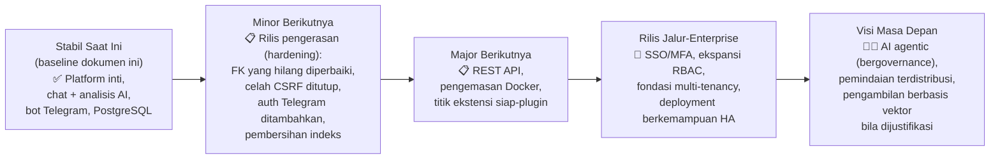
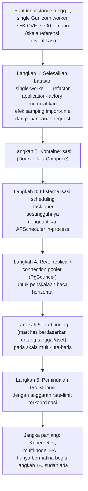

# Roadmap ARGUS

Ini adalah roadmap strategis ARGUS — di mana posisi proyek ini saat ini, apa yang secara realistis akan datang berikutnya, dan ke mana arahnya dalam horizon multi-rilis. Ini bukan changelog, bukan catatan rilis, dan bukan pelacak tugas (task tracker); dokumen ini ada untuk memberikan kontributor, pengadopsi, dan evaluator gambaran yang jujur dan berbasis teknis tentang arah proyek.

## Cara membaca roadmap ini

Setiap item dalam dokumen ini diberi label salah satu dari lima status, digunakan secara konsisten di seluruh dokumen:

| Status | Makna |
|---|---|
| ✅ **Selesai (Completed)** | Diimplementasikan dan diverifikasi dalam basis kode saat ini — dirujuk-silang terhadap `README.md`, `API.md`, `ARCHITECTURE.md`, `AI.md`, dan `DATABASE.md`, yang semuanya ditulis dengan memeriksa langsung source code yang berjalan, bukan dengan mendeskripsikan niat/intent |
| 🔧 **Sedang Berjalan / Sebagian (In Progress/Partial)** | Sudah ada dalam beberapa bentuk saat ini tetapi belum lengkap, tidak konsisten, atau memiliki celah (gap) yang diketahui dan terdokumentasi — misalnya, migrasi yang sudah ditulis dalam kode tetapi belum diterapkan di semua tempat, atau fitur yang diimplementasikan untuk satu entry point tetapi tidak untuk entry point lainnya |
| 📋 **Direncanakan (Planned)** | Belum diimplementasikan, tetapi merupakan niat konkret jangka dekat-hingga-menengah dengan jalur implementasi yang cukup jelas mengingat arsitektur saat ini |
| 🔭 **Jangka Panjang / Visi Masa Depan (Long-Term/Future Vision)** | Selaras secara arah dengan ke mana ARGUS ingin menuju, tetapi memerlukan arsitektur baru yang substansial, dan tidak terikat pada rilis tertentu |
| 🧪 **Riset / Eksperimental (Research/Experimental)** | Ide yang layak dieksplorasi, tanpa jalur implementasi yang terikat. Disertakan demi transparansi tentang ke mana pemikiran mengarah, bukan sebagai janji |

Tidak ada satu pun item dalam dokumen ini yang memiliki tanggal rilis spesifik. ARGUS berbasis milestone, bukan berbasis kalender: sebuah milestone dirilis ketika cakupannya benar-benar selesai, bukan pada jadwal yang tetap. Ketika roadmap ini mengatakan "rilis berikutnya," itu berarti "rilis berikutnya yang mengirimkan cakupan ini," bukan tanggal yang terikat.

### Hubungan dengan dokumen lain

Roadmap ini adalah lapisan strategis yang berada di atas dokumentasi referensi teknis ARGUS — sebaiknya dibaca berdampingan, bukan sebagai pengganti:

- [`README.md`](./README.md) — fitur saat ini dan status proyek, kebenaran dasar (ground truth) yang menjadi acuan klaim "Selesai" pada roadmap ini
- [`ARCHITECTURE.md`](./ARCHITECTURE.md) — cetak biru teknis sistem, termasuk `Future Architecture Roadmap`-nya sendiri (§28) dan `Security Threat Model` (§30), yang keduanya menjadi rujukan langsung dokumen ini untuk bagian Keamanan dan Skalabilitas di bawah
- [`API.md`](./API.md) — referensi antarmuka saat ini, termasuk desain `Future REST API`-nya sendiri (§23) yang dirujuk pada §8 di bawah
- [`INSTALL.md`](./INSTALL.md) — realitas deployment saat ini, termasuk batasan single-Gunicorn-worker yang menjadi gerbang bagi beberapa item di §17–§18
- [`DATABASE.md`](./DATABASE.md) — keadaan skema yang sebenarnya dan terverifikasi hidup (live), termasuk celah integritas data yang nyata dan masih terbuka saat ini, yang secara langsung membentuk prioritas "Jangka Pendek" di §7
- [`AI.md`](./AI.md) — referensi teknis lengkap subsistem AI, termasuk `Future AI Roadmap`-nya sendiri (§25), yang dirangkum §10 di bawah pada level strategis, bukan diduplikasi secara penuh
- `SECURITY.md` — belum dipublikasikan; §15 dokumen ini adalah pernyataan terkini yang paling mendekati arah keamanan ARGUS sampai dokumen tersebut ada

**Catatan tentang volatilitas.** Setiap item roadmap di bawah ini mencerminkan pemikiran proyek pada saat dokumen ini ditulis. Prioritas berubah seiring penggunaan nyata memunculkan kebutuhan baru, seiring audiens tim-kecil/analis-individu yang benar-benar dilayani ARGUS (`README.md` §1) memberi tahu para maintainer apa yang penting, dan seiring utang teknis yang terdokumentasi di `ARCHITECTURE.md` dan `DATABASE.md` ditangani atau diprioritaskan ulang. Tidak ada satu pun di sini yang merupakan komitmen kontraktual.

---

## Daftar Isi

1. [Pendahuluan](#introduction) *(di atas)*
2. [Pernyataan Visi](#2-pernyataan-visi)
3. [Status Proyek](#3-status-proyek)
4. [Kemampuan Saat Ini](#4-kemampuan-saat-ini)
5. [Filosofi Pengembangan](#5-filosofi-pengembangan)
6. [Linimasa Roadmap](#6-linimasa-roadmap)
7. [Roadmap Jangka Pendek](#7-roadmap-jangka-pendek)
8. [Roadmap Jangka Menengah](#8-roadmap-jangka-menengah)
9. [Roadmap Jangka Panjang](#9-roadmap-jangka-panjang)
10. [Roadmap AI](#10-roadmap-ai)
11. [Roadmap Keamanan Siber](#11-roadmap-keamanan-siber)
12. [Roadmap Dashboard](#12-roadmap-dashboard)
13. [Roadmap Bot Telegram](#13-roadmap-bot-telegram)
14. [Roadmap Basis Data](#14-roadmap-basis-data)
15. [Roadmap Keamanan](#15-roadmap-keamanan)
16. [Roadmap Performa](#16-roadmap-performa)
17. [Roadmap Skalabilitas](#17-roadmap-skalabilitas)
18. [Roadmap Deployment](#18-roadmap-deployment)
19. [Roadmap Integrasi](#19-roadmap-integrasi)
20. [Roadmap Komunitas](#20-roadmap-komunitas)
21. [Roadmap Enterprise](#21-roadmap-enterprise)
22. [Riset & Inovasi](#22-riset--inovasi)
23. [Risiko & Tantangan](#23-risiko--tantangan)
24. [Metrik Keberhasilan](#24-metrik-keberhasilan)
25. [Strategi Rilis](#25-strategi-rilis)
26. [Peluang Kontribusi](#26-peluang-kontribusi)
27. [Fitur yang Sering Diminta](#27-fitur-yang-sering-diminta)
28. [Referensi Silang](#28-referensi-silang)

---

## 2. Pernyataan Visi

Visi jangka panjang ARGUS adalah menjadi platform manajemen kerentanan yang dapat dijalankan sepenuhnya oleh seorang analis individu atau tim keamanan kecil di infrastruktur mereka sendiri, dengan lapisan AI yang benar-benar mengurangi pekerjaan manual dalam mentriase dan memahami temuan — bukan chatbot yang ditempelkan pada scanner, melainkan sebuah sistem di mana korelasi, penilaian risiko, dan analisis berbahasa alami adalah tiga sudut pandang atas data langsung yang sama.

**Prinsip panduan yang menjadi dasar visi ini:**

- **AI-assisted, bukan AI-driven.** Subsistem AI menjelaskan dan memprioritaskan; ia tidak — saat ini, atau dalam rencana jangka dekat mana pun — mengambil tindakan otonom terhadap temuan, aset, atau pemindaian (`AI.md` §16.6, §2). Setiap langkah masa depan menuju kapabilitas agentic (§10, §22) akan dijaga oleh lapisan governance/persetujuan yang eksplisit, bukan dikirim sebagai default.
- **Self-hosted secara default.** Data kerentanan dan aset yang sensitif seharusnya tidak perlu meninggalkan infrastruktur operator sendiri untuk mendapatkan nilai dari ARGUS — desain local-first pada lapisan AI (`AI.md` §1, §2) adalah sikap arsitektural permanen, bukan keterbatasan sementara yang menunggu integrasi cloud yang "sesungguhnya."
- **Jujur tentang skala.** ARGUS dibangun untuk audiens yang benar-benar dimilikinya (`README.md` §1) — analis individu, tim SOC/CERT kecil, operator homelab — bukan deployment enterprise hipotetis. Kapabilitas skala-enterprise (§9, §17, §21) adalah arah untuk tumbuh secara sengaja, bukan kepura-puraan untuk dipertahankan sekarang.
- **Modular, dengan seam (batas modul) yang nyata, belum menjadi marketplace plugin.** Batasan modul ARGUS yang sudah ada (`ARCHITECTURE.md` §5, §27) ramah-ekstensi dalam praktiknya bahkan tanpa sistem plugin formal — visinya adalah pada akhirnya memformalkan seam tersebut (§8, §20) begitu ada kebutuhan nyata yang terbukti dari upaya ekstensi yang sesungguhnya, bukan membangun kerangka kerja plugin secara spekulatif.
- **Dokumentasi sebagai artefak kelas satu (first-class).** Rangkaian dokumen yang menjadi bagian dari roadmap ini (`README.md` hingga `DATABASE.md`) dibangun dengan memverifikasi klaim terhadap kode yang berjalan, termasuk mengungkap bug nyata (foreign key yang hilang di `DATABASE.md`, celah CSRF di `API.md`) alih-alih mendeskripsikan sistem yang ideal. Roadmap ini melanjutkan disiplin tersebut — item yang direncanakan dideskripsikan sebagai apa yang akan mereka perlukan, bukan diklaim sebagai sudah berfungsi.

### Apa arti "manajemen kerentanan berbantuan AI yang komprehensif" secara spesifik bagi ARGUS

Bukan: sistem yang menggantikan penilaian analis. Melainkan: sistem yang menghilangkan beban *mekanis* dari manajemen kerentanan — mencocokkan-silang NVD/KEV/EPSS, mengingat mana dari lima puluh temuan yang sebenarnya paling penting, menulis jenis penjelasan yang sama untuk CVE serupa yang kesepuluh bulan ini — sehingga penilaian analis dihabiskan untuk keputusan yang benar-benar membutuhkannya, bukan untuk pencarian data yang dapat dilakukan secara andal oleh basis data dan LLM yang berlandaskan data nyata (well-grounded).

---

## 3. Status Proyek

| Kategori | Apa yang termasuk di sini |
|---|---|
| ✅ **Selesai** | Diimplementasikan, berfungsi, dan diverifikasi terhadap source — pipeline inti asset/scan/risk/dashboard/bot/AI-chat/AI-analysis (`README.md` §3, §23) |
| 🔧 **Sedang Berjalan / Sebagian** | Celah nyata dan masih terbuka saat ini yang ditemukan selama upaya dokumentasi ini — foreign key basis data yang hilang (`DATABASE.md` §6.3, §16.2), celah token CSRF pada route JSON POST (`API.md` §7.2, §20), ketiadaan total model otorisasi pada bot Telegram (`ARCHITECTURE.md` §18, §19) — ini bukan fitur baru yang menunggu untuk dibangun, melainkan fungsionalitas yang sudah ada dan sudah dirilis dengan sisi kasar (rough edges) yang diketahui dan terdokumentasi |
| 📋 **Direncanakan** | Langkah konkret berikutnya dengan jalur implementasi yang jelas — REST API berversi (`API.md` §23), pengemasan Docker (`INSTALL.md` §22), pemetaan MITRE ATT&CK (`ARCHITECTURE.md` §28) |
| 🔭 **Riset Masa Depan** | Benar-benar terbuka (open-ended) — AI agentic, dukungan multi-tenant, pemindaian terdistribusi (§9, §10, §17) |
| 🧪 **Eksperimental** | Ide tanpa jalur yang terikat sama sekali — pemodelan jalur serangan berbasis graf, digital twin (§22) |

**Tentang tidak melebih-lebihkan fungsionalitas yang diimplementasikan:** beberapa kemampuan yang disebutkan dalam dokumentasi awal ARGUS sendiri dan framing publiknya ternyata, setelah pemeriksaan kode langsung, tidak ada seperti yang dideskripsikan — tidak ada integrasi OpenCVE di mana pun dalam basis kode (`README.md` §3, `API.md` §14.4), tidak ada integrasi khusus Ollama meskipun Ollama disebutkan dalam materi proyek (`README.md` §3, `AI.md` §26 ADR-AI-2), dan tidak ada data CWE di mana pun dalam skema meskipun system prompt AI mengklaim bertanggung jawab menjelaskannya (celah terverifikasi pada `AI.md` §10). Roadmap ini memperlakukan koreksi atas celah antara yang diklaim dan kapabilitas sebenarnya ini sebagai prioritas "Jangka Pendek" yang sah dan berkelanjutan (§7), bukan sebagai rasa malu satu kali yang dilewati diam-diam.

---

## 4. Kemampuan Saat Ini

Dirangkum dari `README.md` §3 dan diverifikasi di seluruh rangkaian dokumentasi lengkap — disajikan di sini sebagai **baseline** yang menjadi titik awal roadmap ini bergerak maju, tidak dinyatakan ulang secara rinci lengkap (lihat `README.md` untuk daftar fitur lengkap dan terkini).

| Area | Status |
|---|---|
| Manajemen aset (CRUD, kekritisan, exposure, fungsi jaringan, kota/negara) | ✅ Selesai |
| Manajemen CVE (bersumber dari NVD, upsert, tingkat keparahan diturunkan) | ✅ Selesai |
| Sinkronisasi NVD | ✅ Selesai (pencarian langsung per-pemindaian, bukan mirror massal — `DATABASE.md` §9.1) |
| Integrasi OpenCVE | ❌ **Belum diimplementasikan** — meskipun disebutkan dalam materi proyek ini sendiri yang lebih luas (`API.md` §14.4) |
| Integrasi KEV | ✅ Selesai (cache 24 jam) |
| Integrasi EPSS | ✅ Selesai (di-batch per pemindaian) |
| Mesin Risiko (formula deterministik CVSS/EPSS/KEV/kekritisan) | ✅ Selesai |
| Snapshot risiko historis | ✅ Selesai (harian, pertumbuhan terbatas — `DATABASE.md` §13.2) |
| Chat AI Security Copilot | ✅ Selesai (khusus dashboard — tidak ada padanan di Telegram, `AI.md` §6) |
| Analisis CVE AI latar belakang | ✅ Selesai, dengan asimetri yang diketahui dalam cara dua entry point AI menangani `LLM_URL` yang hilang (`AI.md` §6.4) |
| Bot Telegram | ✅ Selesai untuk kumpulan perintahnya, 🔧 **tanpa model otorisasi sama sekali** (`ARCHITECTURE.md` §18) |
| Dashboard | ✅ Selesai, 🔧 paginasi tidak konsisten (`/findings` dipaginasi, `/assets` tidak — `ARCHITECTURE.md` §17, §21) |
| Laporan (PDF, harian/mingguan/bulanan/tahunan) | ✅ Selesai |
| Scheduler (APScheduler, 7 job) | ✅ Selesai |
| Autentikasi (berbasis sesi, dua peran) | ✅ Selesai, tanpa MFA/SSO |
| Basis data (PostgreSQL) | ✅ Selesai, 🔧 drift skema dan foreign key yang hilang terverifikasi (`DATABASE.md` §6, §16) |
| Peringatan/Alerting (khusus Telegram) | ✅ Selesai untuk satu kanalnya |
| Perencanaan patch (`planned_patch_date`/`patch_notes`, `exposure`/`function` aset) | ✅ Selesai dalam kode, 🔧 belum diterapkan ke setiap basis data yang di-deploy (`DATABASE.md` §6.1, §6.3) |

---

## 5. Filosofi Pengembangan

| Prinsip | Mengapa memandu pengembangan masa depan |
|---|---|
| **Modularitas** | Batasan modul per-ranah ARGUS yang sudah ada (`scanner/`, `Ai/`, `risk/`, `reports/`, `alerts/` — `ARCHITECTURE.md` §5) adalah yang membuat sebagian besar fitur jangka-menengah §8 (format laporan baru, kanal peringatan baru, feed ancaman baru) bersifat aditif, bukan invasif. Pekerjaan masa depan sebaiknya memperluas seam ini, bukan semakin mengaburkannya — "pelanggaran layering" yang terdokumentasi pada `ARCHITECTURE.md` §4 (SQL inline pada route dashboard yang melewati `bot/database/`) adalah peringatan untuk dihindari, bukan pola untuk diulang |
| **Keamanan secara default** | Pilihan fail-closed proyek yang sudah ada (tanpa `SECRET_KEY`/`ADMIN_PASSWORD` default, `ARCHITECTURE.md` §2) menetapkan standar yang harus dipenuhi setiap fitur masa depan — mekanisme autentikasi baru (§15) dan integrasi baru (§19) sebaiknya gagal secara tertutup (fail closed), bukan terbuka, ketika salah konfigurasi |
| **AI offline-first** | Sikap permanen (§2), bukan placeholder — setiap item roadmap AI (§10) dievaluasi terhadap "apakah ini masih berfungsi dengan LLM lokal yang di-hosting sendiri," tidak dirancang cloud-first dengan dukungan lokal sebagai renungan belakangan |
| **Kesiapan enterprise, diperoleh bukan diasumsikan** | Tabel status-proyek `README.md` §23 sendiri sudah membedakan apa yang diimplementasikan dari apa yang aspiratif — roadmap enterprise §21 melanjutkan disiplin tersebut alih-alih menyiratkan kematangan setara-enterprise yang belum dicapai ARGUS |
| **Performa berlandaskan data nyata** | Backup referensi `DATABASE.md` §23 (25 aset, 5.227 CVE, 668 match) adalah skala nyata saat ini — pekerjaan performa (§16) sebaiknya diprioritaskan terhadap realitas ini terlebih dahulu, dan target skala masa depan yang dinyatakan (5 juta CVE, 500 ribu aset) kedua |
| **Maintainability di atas kecerdikan (cleverness)** | Pola terdokumentasi bahwa setiap klien eksternal memiliki bentuk yang sama (fetch, cache, invalidate — `ARCHITECTURE.md` §27) dan setiap generator laporan berbagi satu renderer (`ARCHITECTURE.md` §14) sebaiknya menjadi template yang diikuti kontributor baru, bukan serangkaian implementasi satu-kali |
| **Skalabilitas sebagai langkah masa depan yang disengaja dan berpintu (gated)** | Analisis celah yang jujur dari `ARCHITECTURE.md` §21 (single Gunicorn worker, tanpa partitioning, tanpa read replica) berarti pekerjaan skalabilitas diurutkan, bukan simultan — §17 menjabarkan urutan ketergantungan yang sebenarnya |
| **Standar terbuka** | Skema LLM yang kompatibel-OpenAI (bukan SDK vendor, `AI.md` §6.1) dan PostgreSQL standar (bukan ekstensi proprietary) adalah contoh yang sudah ada dari preferensi terhadap standar terbuka yang dapat dipertukarkan di atas vendor lock-in — integrasi masa depan (§19) sebaiknya mengikuti pola ini |
| **Digerakkan komunitas, secara realistis** | ARGUS belum memiliki basis kontributor sebesar proyek-proyek matang yang menjadi tolok ukur roadmap ini (Kubernetes, GitLab, Wazuh) — roadmap komunitas §20 ditulis untuk posisi proyek saat ini, bukan posisi proyek-proyek tersebut yang sudah ada |

---

## 6. Linimasa Roadmap

**Mengapa pengerasan (hardening) didahulukan sebelum fitur baru.** Milestone berikutnya setelah rilis stabil saat ini secara sengaja adalah rilis **pengerasan**, bukan rilis fitur — panduan developer `DATABASE.md` §27 mengidentifikasi perbaikan spesifik yang sudah terdiagnosis (foreign key `matches`, indeks duplikat, celah constraint `CHECK`) yang bernilai lebih tinggi dan berisiko lebih rendah dibanding fitur baru mana pun di §8, justru karena semuanya ditemukan dengan memeriksa langsung instance nyata yang berjalan, bukan dihipotesiskan. Mengirimkan fitur jangka-menengah baru (§8) di atas celah integritas data yang belum diperbaiki hanya akan membuat perbaikan pada akhirnya semakin sulit (lebih banyak baris data, lebih banyak jalur kode aplikasi yang perlu diaudit karena bergantung pada perilaku celah saat ini).

---

## 7. Roadmap Jangka Pendek

Diurutkan berdasarkan prioritas, dengan rasional untuk masing-masing — ini adalah item jangka-dekat yang realistis dengan jalur implementasi yang jelas dan sudah dipahami.

### 7.1 Perbaikan integritas data (prioritas tertinggi)

- **Tambahkan foreign key `matches.asset_id` dan `matches.cve_id` yang hilang**, mengikuti pola perbaikan persis yang sudah terbukti untuk `ai_messages_conversation_id_fkey` (`DATABASE.md` §6.7, §22.6): rekonsiliasi baris yatim (orphan) terlebih dahulu, lalu tambahkan constraint sebagai langkah terpisah yang dijaga (guarded). *Rasional: ini adalah celah tunggal paling konsekuensial dan sudah terdiagnosis di seluruh skema — basis data saat ini tidak dapat mencegah temuan yang yatim, dan hanya kedisiplinan kode aplikasi yang menggantikan apa yang seharusnya menjadi jaminan basis data (`DATABASE.md` §7.6).*
- **Tambahkan foreign key `cve_ai_analysis.cve_id` yang hilang**, pola yang sama.
- **Hapus indeks dan constraint duplikat** pada `matches` (`idx_matches_asset`/`idx_matches_asset_id`, `idx_matches_cve`/`idx_matches_cve_id`, `unique_asset_cve`/`matches_asset_id_cve_id_key`) — *rasional: nol manfaat fungsional, biaya nyata saat penulisan, dan pembersihan yang mudah begitu teridentifikasi (`DATABASE.md` §15.1, §27.3).*
- **Tambahkan constraint `CHECK` yang hilang pada `matches.status` dan `ai_messages.role`**, menggunakan pola aman yang terbukti (blok `DO $$ ... $$` mandiri yang dijaga, bukan `ADD COLUMN ... CHECK` inline) yang sudah berhasil untuk `cve_ai_analysis.status` (`DATABASE.md` §16.4).
- **Pastikan `idx_cves_kev`/`idx_cves_cvss` serta kolom exposure/function/patch-planning benar-benar diterapkan** ke setiap instance yang di-deploy, bukan hanya ada dalam skrip migrasi (`DATABASE.md` §6.1, §6.2, §15.3).

### 7.2 Pengerasan keamanan (security hardening)

- **Selesaikan celah token CSRF** pada `/api/chat` dan `/api/conversations*` — baik dengan membuat JavaScript front-end melampirkan `X-CSRFToken` (token-nya sudah dirender di meta tag `base.html` dan hanya belum dibaca), atau dengan membuat keputusan yang disengaja dan terdokumentasi untuk mengecualikan route JSON yang terautentikasi-sesi ini secara spesifik (`API.md` §7.2, §20). *Rasional: ini adalah cacat yang terverifikasi dan dapat direproduksi (dikonfirmasi secara empiris terhadap versi Flask-WTF yang di-pin), bukan kekhawatiran teoretis.*
- **Tambahkan gerbang otorisasi dasar pada bot Telegram** — bahkan sekadar allowlist ID pengguna Telegram yang berwenang, diperiksa dalam dekorator yang membungkus setiap handler. *Rasional: saat ini, siapa pun yang dapat mengirim pesan ke bot memiliki akses baca/tulis penuh ke inventaris aset dan dapat memicu pemindaian — batas kepercayaan (trust boundary) yang secara material berbeda (dan saat ini tidak dijaga) dibanding RBAC dashboard (`ARCHITECTURE.md` §18, §19, §30).*
- **Tambahkan rate limiting dasar pada `/login`** setidaknya, mengingat ketiadaan total mitigasi brute-force saat ini (`API.md` §19, `ARCHITECTURE.md` §30).
- **Tetapkan validasi/peringatan `LLM_URL` secara eksplisit** sehingga pipeline analisis tidak pernah diam-diam jatuh kembali (fallback) ke IP pengembangan yang di-hardcode (`AI.md` §6.4, §22.4) — baik dengan menghapus fallback hardcode tersebut sepenuhnya (menyamai perilaku gagal-bersih jalur chat) atau mencatat peringatan yang keras dan mustahil terlewatkan jika pernah digunakan.

### 7.3 Akurasi dokumentasi dan klaim

- **Koreksi atau hapus klaim spesifik OpenCVE dan Ollama** dari materi proyek mana pun yang tersisa yang masih merujuknya sebagai integrasi aktif, sekarang setelah rangkaian dokumentasi saat ini memverifikasi bahwa keduanya tidak ada seperti yang dideskripsikan (§3).
- **Selesaikan atau hapus kode mati yang teridentifikasi selama dokumentasi** — `bot/Ai/prompts.py`/`queries.py` (duplikat logika yang tidak digunakan dan terdokumentasi secara menyesatkan, kini sudah inline di tempat lain — `AI.md` §7.4), metode `build_dashboard_context()` yang tidak terjangkau (`AI.md` §9.7), kolom `archived` pada percakapan yang tidak pernah diset (`AI.md` §11.8), dan kolom mati `matches.alert_sent`/`ai_conversations.user_id` (`DATABASE.md` §6.3, §6.6).

### 7.4 Pengujian dan CI/CD

- **Perkenalkan test suite otomatis yang sesungguhnya.** Saat ini, satu-satunya artefak pengujian dalam basis kode adalah `bot/test.py` — skrip smoke-test manual untuk context builder AI tanpa assertion, dimaksudkan untuk dibaca manusia, bukan dijalankan oleh CI (diverifikasi langsung: tidak ada dependensi `pytest`/`unittest` dalam `requirements.txt`, dan tidak ada `.github/workflows`, `Dockerfile`, atau konfigurasi CI jenis apa pun di mana pun dalam repositori). *Rasional: ini bisa dibilang celah tunggal terbesar antara kematangan rekayasa ARGUS saat ini dan framing "enterprise-grade" yang diminta dipenuhi rangkaian dokumentasi ini — setiap item roadmap lain dalam dokumen ini lebih berisiko dikirim tanpa cakupan regresi dibanding dengan cakupan tersebut.*
- **Tambahkan CI** (GitHub Actions atau setara) yang menjalankan setidaknya: linting, test suite masa depan, dan dry-run migrasi skema terhadap basis data baru — yang terakhir ini akan menangkap beberapa masalah drift yang ditemukan `DATABASE.md` melalui pemeriksaan manual `pg_dump`.

### 7.5 Perbaikan lebih kecil bernilai tinggi

- **Perbaiki paginasi `/assets` yang hilang**, menyelaraskannya dengan pola `/findings` yang sudah ada (`ARCHITECTURE.md` §17, §21).
- **Tingkatkan konsistensi prompt AI** — rekonsiliasi system prompt `bot/Ai/prompts.py` yang usang dan lebih pendek dengan prompt inline yang sebenarnya dan lebih panjang pada route chat dashboard, sehingga kontributor masa depan tidak salah mengira yang mana yang terkini (`AI.md` §7.4).
- **Tambahkan perbaikan logging dasar** — variabel lingkungan `LOG_LEVEL` (saat ini tidak ada — `ARCHITECTURE.md` §26, `API.md` §18) dan, secara opsional, logging berbasis file dengan rotasi, bukan hanya stdout.
- **Perluas dokumentasi** — `INSTALL.md`, `API.md`, `SECURITY.md` tetap belum dipublikasikan di dalam repositori sebagai file mandiri per tabel dokumentasi `README.md` §16 sendiri; rangkaian dokumentasi saat ini (termasuk roadmap ini) sebaiknya menjadi dasar untuk benar-benar mempublikasikannya, bukan sekadar merujuknya sebagai "sedang berlangsung."

---

## 8. Roadmap Jangka Menengah

### 8.1 REST API

Permukaan `/api/v1/` yang berversi dan terautentikasi-token, sesuai sketsa desain rinci yang sudah dijabarkan di `API.md` §23 — route handler tipis yang memanggil langsung ke modul `bot/database/`, `bot/scanner/`, `bot/risk/`, `bot/reports/`, dan `bot/Ai/` yang sudah ada, alih-alih mengimplementasikan ulang logikanya. *Rasional: route `/api/chart/*`, `/api/chat`, dan `/api/conversations*` saat ini bersifat internal, tidak berversi, dan hanya-session-cookie (`API.md` §1, §3.7) — permukaan integrasi eksternal yang sesungguhnya memerlukan auth token dan kontrak yang stabil yang tidak disediakan keduanya.* **Prasyarat:** menyelesaikan pola response-envelope `API.md` §17 yang tidak konsisten terlebih dahulu, sehingga API baru tidak mewarisinya.

### 8.2 Arsitektur plugin

Versi terformalisasi dari pola ekstensi yang sudah terdokumentasi secara informal (`ARCHITECTURE.md` §27, `AI.md` §24) — antarmuka sempit dan bertujuan-tunggal per subsistem (klien scanner, penyedia alert, generator laporan, context builder AI) yang dibuat benar-benar dapat di-plug (dapat ditemukan secara dinamis, diberi versi secara independen) alih-alih "salin polanya ke dalam basis kode utama." *Rasional: setiap titik ekstensi saat ini sudah memiliki bentuk yang terbukti dan berfungsi — memformalkannya berisiko lebih rendah dibanding menciptakan kontrak plugin baru dari nol.*

### 8.3 Mode gelap (dark mode)

Perubahan front-end/CSS saja pada dashboard bertemplate Jinja2 yang sudah ada (`ARCHITECTURE.md` §17) — tanpa implikasi backend atau model data. *Rasional: biaya implementasi rendah, sering diminta pada perangkat sebanding (§27), dan tempat yang wajar bagi kontributor front-end pemula untuk memulai (§26).*

### 8.4 Perbaikan peran (role)

Bergerak melampaui model biner `admin`/`viewer` saat ini (`API.md` §4.1) menuju peran menengah yang terlingkup (scoped) (misalnya, "Analyst" — dapat mengelola temuan tetapi bukan aset atau pengguna). *Rasional: `API.md` §4.4 sudah mengidentifikasi celah persis ini; model dua-peran saat ini adalah keterbatasan nyata bagi tim mana pun yang lebih besar dari "satu admin, beberapa viewer read-only."*

### 8.5 Dashboard lanjutan

Dibangun di atas infrastruktur grafik yang sudah ada (dua sistem charting paralel `ARCHITECTURE.md` §17 — PNG statis dan berbasis JSON-API) menuju tampilan dashboard yang benar-benar dapat dikustomisasi dan disimpan. *Rasional: `/charts` dan `/api/chart/*` saat ini adalah tampilan tetap yang tidak dapat dikonfigurasi — tidak ada persistensi tata letak dashboard sama sekali.*

### 8.6 Agregasi threat intelligence

Melampaui tiga sumber NVD/KEV/EPSS saat ini (`README.md` §3) — feed tambahan, mengikuti pola cache-fetch-invalidate `kev/clients.py` yang terbukti (`ARCHITECTURE.md` §27) sebagai template untuk setiap sumber baru. *Rasional: KEV dan EPSS sendiri adalah integrasi aditif dan non-invasif di bawah pola yang sama ini — tidak ada alasan arsitektural mengapa sumber feed ketiga atau keempat akan lebih sulit.*

### 8.7 Scheduler yang ditingkatkan

Menangani celah keandalan yang teridentifikasi di `ARCHITECTURE.md` §16 — tidak ada retry otomatis untuk job terjadwal yang gagal berjalan (saat ini: catat log dan tunggu tick berikutnya), tidak ada penyimpanan job persisten yang bertahan setelah restart proses (penyimpanan in-memory APScheduler, `ARCHITECTURE.md` §16). *Rasional: job `ai_watchdog` sudah membuktikan nilai logika pemulihan yang dibangun khusus (`ARCHITECTURE.md` §22) — memperluas prinsip tersebut ke job scan dan report adalah langkah alami berikutnya, bukan ide baru.*

### 8.8 Caching Redis

Memindahkan cache respons chat AI (`AI.md` §12.1, §12.9) keluar dari PostgreSQL dan ke Redis — menghilangkan churn-nya dari bersaing dengan setiap operasi basis data lain untuk connection pool dan I/O yang sama (`AI.md` §19.3). *Rasional: ini adalah bagian berisiko-paling-rendah dan paling jelas cakupannya dari diskusi "Redis masa depan" yang lebih luas pada `AI.md` dan `ARCHITECTURE.md` — cache yang terisolasi dengan baik dan memiliki antarmuka sempit yang sudah terdefinisi (`make_cache_key`, `get_cached_response`, `save_response` — `AI.md` §24) yang dapat diimplementasikan backend baru tanpa menyentuh kode pemanggil.*

### 8.9 Notifikasi WebSocket

Mekanisme push real-time (misalnya, Flask-SocketIO) untuk penyelesaian pemindaian, temuan kritis baru, atau penyelesaian analisis AI — menangani ketiadaan mekanisme pembaruan dashboard real-time apa pun yang terkonfirmasi pada `ARCHITECTURE.md` §17 saat ini (setiap interaksi adalah siklus request/response standar). *Rasional: perilaku `/today` saat ini yang sinkron-dari-perspektif-pemanggil (`ARCHITECTURE.md` §20) adalah gejala langsung dari celah ini — pemindaian yang berjalan lama saat ini hanya membuat browser menunggu.*

### 8.10 Perbaikan percakapan AI

Menangani celah spesifik dan bernama dari `AI.md`: ringkasan (summarization) percakapan begitu batas riwayat 20-pesan terlampaui (`AI.md` §8.9), fitur "arsipkan percakapan" yang benar-benar dihubungkan ke kolom `archived` yang sudah ada namun tidak digunakan (`AI.md` §11.8), dan respons chat streaming (`AI.md` §14.2) sehingga UI menampilkan output secara bertahap alih-alih menunggu respons penuh yang dibatasi timeout 120 detik.

### 8.11 Relasi aset

Memodelkan relasi aset induk/anak (misalnya, sebuah hypervisor dan VM tamunya) — menangani celah yang diidentifikasi baik `ARCHITECTURE.md` §8 maupun `DATABASE.md` §10.7: saat ini, sebuah aset tidak memiliki relasi ke aset lain mana pun di luar baris independen.

### 8.12 Pencarian dan pelaporan lanjutan

Pencarian terpadu di seluruh aset, temuan, dan CVE (saat ini: `/search` mencoba pencocokan nama-aset terlebih dahulu, lalu jatuh kembali ke redirect NVD langsung — `ARCHITECTURE.md` §17), dan ekspor CSV untuk laporan (dikonfirmasi sepenuhnya tidak ada saat ini — PDF adalah satu-satunya format, `API.md` §11.4).

---

## 9. Roadmap Jangka Panjang

Ini adalah tujuan skala-enterprise yang memerlukan arsitektur baru yang substansial — disertakan untuk mengomunikasikan arah, secara eksplisit tidak terikat pada rilis jangka dekat mana pun.

| Tujuan | Pertimbangan arsitektural |
|---|---|
| **SSO Enterprise (SAML/OIDC), LDAP, OAuth2** | Memperluas Trust Boundary 1 (dashboard) saja — **tidak** dengan sendirinya menangani trust boundary bot Telegram yang terpisah dan saat ini tidak dijaga (`ARCHITECTURE.md` §19, §30); perbaikan otorisasi Telegram §7.2 adalah prasyarat untuk kisah auth enterprise yang benar-benar koheren, bukan renungan untuk ditambahkan kemudian |
| **MFA** | Dibangun di atas SSO atau langkah faktor-kedua independen dalam alur Flask-Login yang sudah ada — belum ada fondasi apa pun saat ini (`ARCHITECTURE.md` §19) |
| **Pemindaian terdistribusi** | Memerlukan anggaran rate-limit yang terkoordinasi di seluruh worker scanner (`_NVD_CONCURRENCY = 1` saat ini bersifat per-proses dan akan menghitung ganda terhadap batas NVD jika diparalelkan secara naif — `ARCHITECTURE.md` §12, §21) dan work-queue alih-alih model implisit saat ini "siapa pun yang memanggil `scan_all_assets()` mengerjakan semuanya secara serial" |
| **Scheduler terdistribusi** | Penyimpanan job in-memory dan single-process milik APScheduler (§8.7) secara fundamental tidak kompatibel dengan beberapa instance yang berkoordinasi — ini memerlukan task queue terdistribusi yang sesungguhnya (Celery+Redis atau setara), bukan perubahan konfigurasi (`ARCHITECTURE.md` §16, §21) |
| **High availability** | Memerlukan penyelesaian batasan single-Gunicorn-worker terlebih dahulu (`INSTALL.md` §23, `ARCHITECTURE.md` §21, §23) — HA di atas arsitektur yang hanya dapat menjalankan satu worker aplikasi secara aman bukanlah HA yang bermakna |
| **Load balancing** | Bergantung pada butir di atas — load-balancing di seluruh beberapa instance aplikasi yang *stateless* memerlukan batasan worker terselesaikan dan state sesi dibuat tidak bergantung pada instance (sudah benar saat ini, karena sesi berbasis cookie, bukan server-side — usaha yang lebih kecil dibanding batasan worker itu sendiri) |
| **Vector database** | Hanya dijustifikasi jika ARGUS menyerap konten tak terstruktur yang mendapat manfaat dari pengambilan semantik (`AI.md` §13.3) — tidak diperlukan untuk apa pun dalam use case data-terstruktur saat ini; `pgvector` sebagai ekstensi PostgreSQL adalah kecocokan alami mengingat desain berpusat-basis-data ARGUS yang sudah ada, seandainya ini menjadi dijustifikasi |
| **AI multi-model** | Memerlukan field `model` dalam request (saat ini sama sekali tidak ada — `AI.md` §6.3, §22.2) dan lapisan routing/seleksi, paling alami dibangun di atas klasifikasi `determine_intent()` yang sudah ada (`AI.md` §6.6) |
| **Deployment cloud, kontainerisasi, deployment multi-node** | Pengemasan Docker (`INSTALL.md` §22, saat ini direktori placeholder kosong) adalah prasyarat keras untuk semua hal lain di baris ini — Kubernetes atau deployment multi-node tanpa Docker ada terlebih dahulu bukanlah langkah berikutnya yang bermakna (`ARCHITECTURE.md` §23) |
| **Analitik lanjutan** | Dibangun di atas data historis `risk_snapshots` yang sudah ada dan terjamin terbatas (`DATABASE.md` §13.2, §28) — konsumen alami dari data yang sudah dikumpulkan, tidak memerlukan instrumentasi baru, hanya logika analisis baru |

---

## 10. Roadmap AI

Dirangkum pada level strategis; `AI.md` §25 adalah referensi teknis lengkap dan rinci untuk setiap item di bawah — tidak diduplikasi secara penuh di sini.

### Jangka dekat (dibangun langsung di atas arsitektur yang sudah ada)

- **Konsistensi prompt yang ditingkatkan** — menyelesaikan duplikasi `prompts.py`/`queries.py` yang usang (§7.3).
- **Respons streaming** — perbaikan UX paling jelas dan paling bernilai segera mengingat pengalaman chat saat ini yang sepenuhnya di-buffer dan menunggu hingga 120 detik (`AI.md` §14.2).
- **Optimasi konteks** — penganggaran konteks yang sadar-token (bukan hanya dibatasi jumlah-baris), dan ringkasan percakapan begitu batas 20-pesan terlampaui (`AI.md` §8.9, §22.2).

### Jangka menengah (perluasan alami dari desain retrieval terstruktur saat ini)

- **Laporan yang dihasilkan AI** — lapisan naratif berbantuan-LLM di atas generator laporan PDF yang sudah ada (`ARCHITECTURE.md` §14), menghasilkan framing ringkasan-eksekutif atas data laporan alih-alih mengharuskan model merekonstruksinya dari awal di setiap sesi chat.
- **Ringkasan threat intelligence** — seiring sumber feed tambahan ditambahkan (§8.6), context builder AI adalah tempat alami untuk mensintesis di seluruh sumber tersebut, mengikuti pola intent-routing yang sama yang sudah digunakan untuk KEV (`AI.md` §9.2).

### Jangka panjang / riset (memerlukan arsitektur yang benar-benar baru)

- **Pencarian semantik, embedding, vector database** — tidak diperlukan untuk use case data-terstruktur saat ini (`AI.md` §13); baru akan dijustifikasi seiring dengan penyerapan konten tak terstruktur (entri paralel di §9).
- **Remediasi berbantuan AI** — bergerak dari *menyarankan* prioritisasi (sudah diimplementasikan, `AI.md` §15) ke benar-benar mengusulkan dan — dengan persetujuan manusia yang eksplisit — mengeksekusi langkah remediasi. **Memerlukan lapisan tool/function-calling yang belum ada saat ini** (`AI.md` §16.6, celah terbesar yang teridentifikasi di §24) dan alur kerja governance/persetujuan (§21) sebagai prasyarat keras, bukan tambahan opsional.
- **Analisis prediktif, peramalan ancaman** — kemungkinan komponen statistik/ML terpisah yang mengonsumsi riwayat `risk_snapshots`, berbeda sepenuhnya dari subsistem chat/analisis berbasis-LLM (`AI.md` §25, observasi paralel `ARCHITECTURE.md` §13 tentang Mesin Risiko).
- **AI agentic, kolaborasi multi-agen, tool calling** — penilaian `AI.md` §25 sendiri berlaku tanpa kualifikasi: ini memerlukan lapisan tool/function-calling, lalu gerbang keamanan/persetujuan, sebelum apa pun ini aman untuk dirilis, mengingat ketidakmampuan struktural subsistem AI saat ini untuk mengambil tindakan apa pun yang mengubah state adalah properti keamanannya yang paling kuat saat ini (`AI.md` §16.6). Ini tidak boleh dilemahkan secara sembarangan.
- **Alur kerja persetujuan manusia** — prasyarat keras untuk kapabilitas agentic, dan — sesuai rekomendasi `AI.md` §27 sendiri — layak dibangun *sebelum* kapabilitas agentic mana pun dirilis, bukan bersamaan dengannya.
- **Bantuan otonom masa depan** — item paling jauh pada daftar ini, secara eksplisit dijaga di belakang setiap item di atas; bukan arah jangka dekat.

---

## 11. Roadmap Keamanan Siber

| Kapabilitas | Status | Rasional |
|---|---|---|
| **Pemetaan MITRE ATT&CK** | 🔭 Jangka panjang | Memerlukan sumber data dan skema pemetaan CVE-ke-teknik yang baru (`ARCHITECTURE.md` §28, `DATABASE.md` §25) — belum ada fondasi hari ini di luar pola umum bagaimana KEV diintegrasikan (preseden untuk *cara* menambahkannya, bukan infrastruktur yang sudah ada khusus untuk itu) |
| **Integrasi CAPEC** | 🧪 Riset | Akan melengkapi pemetaan ATT&CK (pola serangan vs. teknik) tetapi belum ada desain atau jalur yang terikat saat ini — disertakan demi kelengkapan, bukan sebagai niat jangka dekat |
| **Peningkatan CWE** | 📋 Direncanakan, dan sudah terlambat | Berbeda dari kebanyakan item di bagian ini, ini bukan murni aditif — temuan terverifikasi `AI.md` §10 adalah bahwa system prompt AI ARGUS sendiri *sudah mengklaim* tanggung jawab penjelasan CWE dengan **nol** data CWE di mana pun dalam skema untuk mendasarinya. Ini sebaiknya diprioritaskan sebagai penutupan celah yang sudah ada dan menyesatkan, bukan sekadar penambahan nice-to-have |
| **CVSS v4** | 📋 Direncanakan | Memerlukan kolom version-tag dan keputusan tentang menyimpan beberapa skor bersamaan per CVE (saat ini: satu skor numerik, tanpa version tag — `DATABASE.md` §9.6) |
| **Threat intelligence pelaku ancaman (threat actor)** | 🔭 Jangka panjang | Belum ada sumber data atau skema saat ini; akan mengikuti pola ekstensi umum "feed ancaman baru" (`ARCHITECTURE.md` §27) begitu sumber spesifik dan konkret teridentifikasi |
| **Advisory vendor** | 🔭 Jangka panjang | Pola yang sama seperti di atas — belum ada integrasi saat ini |
| **Basis data exploit (misalnya, Exploit-DB)** | 🧪 Riset | Melengkapi KEV (eksploitasi terkonfirmasi) dengan ketersediaan exploit proof-of-concept — belum dirancang |
| **Peningkatan CISA** | 📋 Direncanakan | Integrasi KEV saat ini adalah satu feed tunggal, di-cache 24 jam (`ARCHITECTURE.md` §9, §14.2) — CISA mempublikasikan advisory lain di luar KEV yang saat ini sama sekali tidak diserap |
| **Kerangka kepatuhan (compliance)** | 🔭 Jangka panjang | Memerlukan model pemetaan kontrol/kerangka kerja (misalnya, `compliance_controls`, `finding_control_mappings` — `DATABASE.md` §25) yang sepenuhnya belum dibangun saat ini |
| **Penilaian exposure aset** | ✅ Sebagian selesai | Kolom `exposure` (Internal/External) dan `function` (peran jaringan) sudah ada dalam kode (`DATABASE.md` §6.1, §10.5) sebagai input yang dapat dibangun oleh penyempurnaan penilaian masa depan — belum diperhitungkan ke dalam formula risiko itu sendiri, yang tetap hanya CVSS/EPSS/KEV/kekritisan (`ARCHITECTURE.md` §13) |
| **Analisis SBOM** | 🧪 Riset | Belum ada penyerapan software-bill-of-materials; akan menjadi kapabilitas baru yang substansial, kemungkinan memerlukan model data aset-ke-komponen sendiri yang berbeda dari tabel `assets` datar saat ini |
| **Risiko rantai pasokan (supply-chain)** | 🧪 Riset | Terkait dengan analisis SBOM di atas — belum ada desain saat ini |
| **Pemindaian kerentanan container** | 🧪 Riset | Scanner ARGUS saat ini berbasis pencarian kata kunci terhadap NVD (`ARCHITECTURE.md` §9), bukan berbasis image-layer — pemindaian container kemungkinan memerlukan pendekatan pemindaian yang secara fundamental berbeda, bukan perluasan dari yang sudah ada |
| **Dukungan aset cloud** | 🧪 Riset | Model aset saat ini (`DATABASE.md` §10) tidak memiliki atribut khusus penyedia-cloud (region, account ID, resource ARN/ID) — akan memerlukan perluasan skema dan kemungkinan pola integrasi API penyedia-cloud yang berbeda dari model vendor/produk/versi saat ini |

---

## 12. Roadmap Dashboard

| Kapabilitas | Status | Rasional |
|---|---|---|
| **Pembaruan real-time** | 📋 Direncanakan | Memerlukan infrastruktur WebSocket (§8.9) — setiap interaksi saat ini hanya request/response (`ARCHITECTURE.md` §17) |
| **Grafik interaktif** | 🔧 Sebagian | Endpoint JSON `/api/chart/*` sudah ada dan diperkirakan dikonsumsi oleh charting sisi-klien (`API.md` §5.8) — tetapi berdampingan dengan route `/charts` PNG-statis terpisah yang meregenerasi gambar di sisi server pada setiap request (`ARCHITECTURE.md` §17); menyatukan dua sistem paralel ini adalah pembersihan jangka-dekat yang alami, bukan murni fitur baru |
| **Peta panas risiko (heatmap)** | 📋 Direncanakan | Dibangun di atas data skor-risiko yang sudah ada (`ARCHITECTURE.md` §13) — celah visualisasi, bukan celah data |
| **Peta lokasi aset (granular, per-aset)** | 🔭 Jangka panjang | City Exposure Overview (teragregasi, tingkat-kota, sadar-privasi secara desain — `ARCHITECTURE.md` §19) adalah pendahulu yang sudah diimplementasikan; peta per-aset yang granular akan memerlukan koordinat presisi dan keputusan yang disengaja untuk melonggarkan rasional privasi yang sama yang membuat peta saat ini hanya tingkat-kota (`README.md` §17) |
| **Filter lanjutan** | 🔧 Sebagian | `/findings` sudah mendukung beberapa dimensi filter (vendor, risiko, KEV, kata kunci, status, kota/negara — `API.md` §5.5); `/assets` memiliki lebih sedikit opsi filter dan tanpa paginasi (`ARCHITECTURE.md` §17, §21) — membawa `/assets` ke paritas adalah bagian jangka-dekat yang konkret |
| **Pencarian tersimpan** | 📋 Direncanakan | Belum ada persistensi untuk state filter/pencarian saat ini — akan memerlukan tabel kecil baru (terlingkup-pengguna, mirip semangatnya dengan model kepemilikan `ai_conversations`) |
| **Dashboard kustom** | 🔭 Jangka panjang | Memerlukan persistensi tata letak dashboard, sepenuhnya tidak ada saat ini (§8.5) |
| **Dashboard eksekutif** | 🔧 Sebagian | Intent "dashboard" pada chat AI (`build_executive_summary_context()` — `AI.md` §9.2) sudah menghasilkan ringkasan bergaya-eksekutif secara percakapan; *tampilan* dashboard eksekutif non-chat yang khusus adalah bagian yang tersisa |
| **Peningkatan aksesibilitas** | 📋 Direncanakan | Belum ada audit aksesibilitas atau pekerjaan kesesuaian-WCAG yang terdokumentasi di mana pun dalam materi proyek ini — celah nyata dan saat ini belum ditangani yang layak diprioritaskan mengingat audiens pemerintah/institusional yang dinyatakan ARGUS (brief dokumen ini sendiri) |
| **UI responsif** | 🧪 Riset | Struktur template/CSS saat ini (`ARCHITECTURE.md` §17) tidak diverifikasi terhadap perilaku viewport mobile dalam upaya dokumentasi ini — status di sini secara jujur tidak pasti, bukan diklaim ke arah mana pun |
| **Dukungan desktop masa depan** | 🧪 Riset | Belum ada desain saat ini atau kebutuhan yang terbukti diartikulasikan di mana pun dalam materi ARGUS |

---

## 13. Roadmap Bot Telegram

| Kapabilitas | Status | Rasional |
|---|---|---|
| **Menu interaktif / inline keyboard** | 📋 Direncanakan | Bot saat ini murni berbasis perintah, teks yang di-parsing `shlex` (`API.md` §6, `ARCHITECTURE.md` §18) — `python-telegram-bot` (library yang sudah menjadi dependensi ARGUS) memiliki dukungan inline-keyboard native yang saat ini sama sekali tidak digunakan |
| **Perbaikan percakapan (alur Telegram multi-giliran)** | 🔭 Jangka panjang | Setiap perintah saat ini stateless dan berdiri sendiri (`ARCHITECTURE.md` §18) — alur multi-giliran yang sesungguhnya (misalnya, bot mengajukan pertanyaan lanjutan) akan menjadi infrastruktur state-machine baru, bukan perluasan dari pola command-handler saat ini |
| **Alur kerja persetujuan** | 🔭 Jangka panjang | Bergantung pada arah alur-kerja-persetujuan enterprise §21 yang lebih luas; belum ada fondasi saat ini |
| **Dukungan suara** | 🧪 Riset | Belum ada desain saat ini; akan berlapis di atas dukungan pesan-suara Telegram sendiri, sama sekali belum ditangani saat ini |
| **Perintah bahasa alami** | 🔭 Jangka panjang | Perintah saat ini terstruktur (`/add <vendor> "<product>" ...`), bukan diparsing bahasa-alami — intent-routing subsistem chat AI (`AI.md` §9.2) secara arsitektural adalah analog terdekat yang sudah ada, tetapi **sama sekali belum ada integrasi Telegram saat ini** (`AI.md` §6, celah terkonfirmasi) — menghubungkan keduanya adalah langkah nyata pertama di sini |
| **Dukungan multi-bahasa** | 📋 Direncanakan | Temuan terverifikasi `AI.md` §23.5 — pencocokan kata kunci intent-routing chat AI hanya-Bahasa-Inggris dan memiliki kasus kegagalan nyata yang terdokumentasi untuk pertanyaan non-Inggris — berlaku bahkan lebih langsung untuk pekerjaan bahasa-alami Telegram masa depan mana pun, karena bot tidak memiliki integrasi AI untuk mewarisi bahkan mitigasi prioritas-CVE-ID yang sebagian dari sana |
| **Unggahan file** | 🧪 Riset | Belum ada use case yang diartikulasikan saat ini (misalnya, impor aset massal via CSV yang diunggah ke Telegram) — plausibel tetapi belum dirancang |
| **Laporan terjadwal (diinisiasi Telegram)** | ✅ Sudah selesai | Laporan mingguan/bulanan sudah dikirim otomatis via Telegram (`ARCHITECTURE.md` §16, §11.3) — dicantumkan di sini hanya untuk mengonfirmasi bahwa item brief spesifik ini bukan celah |
| **Notifikasi kustom (aturan alert yang dapat dikonfigurasi)** | 📋 Direncanakan | Peringatan saat ini memiliki tepat satu kondisi pemicu — "pemindaian ini menghasilkan temuan baru" (`ARCHITECTURE.md` §15) — belum ada ambang batas keparahan, preferensi notifikasi per-pengguna, atau konfigurasi frekuensi-digest |

---

## 14. Roadmap Basis Data

Merujuk-silang `DATABASE.md` §23, §25 secara langsung — tidak dinyatakan ulang secara rinci lengkap di sini.

| Kapabilitas | Status | Rasional |
|---|---|---|
| **Partitioning** | 🔭 Jangka panjang | Hanya dijustifikasi pada target skala multi-juta-baris yang dinyatakan (`DATABASE.md` §23.3) — `matches` (berdasarkan rentang tanggal `first_seen` atau hash `asset_id`) adalah kandidat paling jelas; belum diperlukan pada skala terverifikasi saat ini (668 baris) |
| **Materialized view** | 📋 Direncanakan | Empat view yang menghadap-AI saat ini adalah view biasa (non-materialized), dieksekusi ulang pada setiap rujukan (`DATABASE.md` §18.10) — mengonversi `ai_asset_summary`/`ai_vulnerability_summary` secara spesifik (keduanya melibatkan agregasi `GROUP BY`) adalah langkah berikutnya yang alami dan cakupannya jelas begitu volume query menjustifikasi trade-off staleness |
| **Read replica** | 🔭 Jangka panjang | Memerlukan routing koneksi baca/tulis di tingkat aplikasi yang belum dimiliki `bot/database/db.py` saat ini (`DATABASE.md` §18.11) |
| **Tuning performa** | 📋 Direncanakan, segera | Celah `idx_cves_kev`/`idx_cves_cvss` (`DATABASE.md` §15.3) sudah terdiagnosis dan hanya perlu benar-benar mencapai setiap basis data yang di-deploy (§7.1) — item berusaha-paling-rendah dan paling jelas dalam seluruh roadmap ini |
| **Optimasi historis** | ✅ Sudah tercapai untuk data risiko | Desain `risk_snapshots` yang pra-teragregasi dan terjamin terbatas (`DATABASE.md` §13.2, §18.9) sudah menyelesaikan ini secara spesifik untuk data tren risiko — polanya terbukti dan dapat diperluas ke kebutuhan data-historis lain begitu teridentifikasi |
| **Integrasi vector database** | 🔭 Jangka panjang | Bergantung pada justifikasi sisi-AI §9/§10 — `pgvector` sebagai ekstensi PostgreSQL adalah jalur implementasi alami mengingat arsitektur ARGUS yang sudah ada, seandainya ini menjadi diperlukan (`DATABASE.md` §25) |
| **Relasi graf** | 🧪 Riset | Penilaian `DATABASE.md` §25 sendiri: belum dijustifikasi saat ini oleh use case ARGUS mana pun yang diartikulasikan; foreign key self-referencing konvensional pada `assets` (untuk relasi induk/anak, §8.11) kemungkinan sudah cukup tanpa memerlukan graph database sama sekali |
| **Dukungan multi-tenant** | 🔭 Jangka panjang | Memerlukan dimensi `tenant_id` ditambahkan ke hampir setiap tabel yang ditinjau di `DATABASE.md` §6, ditambah menyelesaikan inkonsistensi akun-bawaan-tidak-memiliki-baris-`users` (`DATABASE.md` §6.11) yang perlu diperhitungkan oleh model perizinan multi-tenant yang sesungguhnya |
| **Pengarsipan** | 📋 Direncanakan | Belum ada tooling retensi/pengarsipan untuk tabel mana pun saat ini (`DATABASE.md` §24) — laporan, temuan yang sudah diselesaikan, dan analisis CVE yang sudah digantikan adalah kandidat pengarsipan jangka-dekat yang paling jelas |
| **Log audit** | 📋 Direncanakan, bernilai tinggi | Kesimpulan konsisten `DATABASE.md` §14.4, §25: tabel log-audit append-only yang sesungguhnya dan komprehensif adalah penambahan basis data paling bernilai yang belum dibangun, mengingat berapa banyak pertanyaan "siapa mengubah apa, kapan" yang tidak dapat dijawab skema saat ini |
| **Optimasi time-series** | 🧪 Riset | `risk_snapshots` sudah menjadi tabel time-series buatan-tangan yang memadai pada granularitas harian (`DATABASE.md` §25) — ekstensi time-series khusus (misalnya, TimescaleDB) hanya akan dijustifikasi oleh kebutuhan granularitas lebih-halus-dari-harian yang belum diperlukan saat ini |

---

## 15. Roadmap Keamanan

Merujuk-silang `ARCHITECTURE.md` §19, §30 dan `AI.md` §16, §27 secara langsung.

| Kapabilitas | Status | Rasional |
|---|---|---|
| **MFA** | 🔭 Jangka panjang | Belum ada fondasi saat ini (`ARCHITECTURE.md` §19) — diurutkan setelah otorisasi dasar Telegram (§7.2), yang merupakan celah lebih mendesak dan berusaha-lebih-rendah |
| **SSO, OAuth2, OIDC, LDAP** | 🔭 Jangka panjang | Memperluas trust boundary dashboard saja, bukan Telegram (tabel §9) — benar-benar bernilai untuk deployment institusional/pemerintah (audiens yang dinyatakan dokumen ini) tetapi upaya integrasi substansial tanpa dependensi library yang sudah ada saat ini |
| **Perlindungan prompt injection** | 📋 Direncanakan | Mitigasi saat ini hanya-instruksi-prompt, tanpa penegakan teknis (`AI.md` §16.1, §17) — celah nyata yang diakui; bahkan lapisan heuristik panjang/pola input dasar akan menjadi perbaikan atas sikap "percayai system prompt" saat ini, meskipun bukan solusi lengkap |
| **Keamanan runtime (misalnya, pemindaian kerentanan dependensi ARGUS sendiri)** | 📋 Direncanakan | Belum ada proses setara `pip-audit`/`safety`/Dependabot yang terbukti di mana pun dalam repositori saat ini |
| **Integrasi secrets manager** | 🔭 Jangka panjang | Saat ini: file `.env` datar, tanpa integrasi secrets-manager eksternal (`ARCHITECTURE.md` §19, §25) |
| **Dashboard audit** | 🔭 Jangka panjang | Bergantung pada tabel log-audit (§14) ada terlebih dahulu — tampilan dashboard adalah langkah kedua yang alami, bukan upaya paralel |
| **Perbaikan sesi** | 📋 Direncanakan | Masa berlaku sesi tetap 8 jam saat ini tidak dapat dikonfigurasi via variabel lingkungan (`API.md` §3.4) — membuatnya dapat dikonfigurasi, dan mempertimbangkan default yang lebih singkat untuk deployment bersensitivitas-lebih-tinggi, adalah perbaikan kecil dan cakupannya jelas |
| **Enkripsi saat disimpan (at rest)** | 🔭 Jangka panjang | Belum ada enkripsi basis data tingkat-kolom atau transparan saat ini (`DATABASE.md` §20.7) — `notes`, `content` percakapan AI, dan `description` CVE adalah kandidat paling jelas jika ini dikejar |
| **Keamanan rantai pasokan, SBOM, rilis bertanda tangan** | 🧪 Riset | Belum ada praktik saat ini seputar provenance dependensi, penandatanganan rilis, atau pembuatan SBOM ARGUS sendiri — benar-benar bernilai untuk audiens pemerintah/institusional yang disebut brief roadmap ini, tetapi saat ini sama sekali belum ditangani |
| **Keamanan container** | 🔭 Jangka panjang | Bergantung pada pengemasan Docker ada terlebih dahulu (§9, `INSTALL.md` §22) — pemindaian keamanan container untuk image yang belum ada bukanlah langkah berikutnya yang bermakna |
| **Pemindaian keamanan (SAST/DAST pada kode ARGUS sendiri)** | 📋 Direncanakan | Belum ada bukti pengujian keamanan aplikasi statis atau dinamis yang dijalankan terhadap basis kode ARGUS sendiri saat ini — penambahan CI yang masuk akal dan berfriksi-rendah begitu CI ada sama sekali (§7.4) |
| **Program pengungkapan bertanggung jawab (responsible disclosure)** | 📋 Direncanakan | Belum ada `SECURITY.md` yang ada sebagai file terpublikasi saat ini (`README.md` §16) — menetapkan proses pelaporan kerentanan yang jelas adalah tindakan jangka-dekat berbiaya-rendah dan bernilai-kepercayaan-tinggi, independen dari perubahan kode apa pun |

---

## 16. Roadmap Performa

| Kapabilitas | Status | Rasional |
|---|---|---|
| **Caching (di luar cache respons AI saat ini)** | 🔧 Sebagian | Hanya cache respons chat AI yang ada saat ini (`AI.md` §12, `DATABASE.md` §18.5) — pembacaan dashboard, pembuatan grafik, dan pembuatan laporan tidak memiliki caching sama sekali |
| **Redis** | 📋 Direncanakan | Dibahas di §8.8 — item performa jangka-dekat-hingga-menengah yang paling jelas dan cakupannya paling baik |
| **Perbaikan connection pooling** | 📋 Direncanakan | Pooling saat ini nyata tetapi per-proses (`ARCHITECTURE.md` §20) — deployment dashboard+bot gabungan secara efektif menggandakan anggaran koneksi nyata terhadap PostgreSQL tanpa koordinasi apa pun antara kedua pool tersebut; pooler eksternal bersama (misalnya, PgBouncer) akan menangani ini secara langsung |
| **Lazy loading** | Tidak berlaku | Tidak berlaku dalam pengertian ORM (tidak ada ORM); query kolom yang sudah selektif adalah praktik yang memadai saat ini (`ARCHITECTURE.md` §20) |
| **Pemrosesan async** | 🔧 Sebagian | Fungsi inti scanner sudah `async` (`ARCHITECTURE.md` §12) — tetapi tindakan dashboard on-demand masih memblokir browser pemanggil via thread-pool bridge alih-alih penanganan request async yang sesungguhnya (`ARCHITECTURE.md` §20) |
| **Pemindaian paralel** | 🔭 Jangka panjang | Dijaga di belakang nilai hardcode `_NVD_CONCURRENCY` saat ini yaitu 1 dan masalah koordinasi rate-limit yang dijelaskan di §9 — menaikkan ini secara aman memerlukan baik penyesuaian otomatis yang sadar-`NVD_API_KEY` (perbaikan jangka-dekat lebih kecil) atau koordinasi pemindaian-terdistribusi penuh (jangka panjang) |
| **Background worker (di luar scheduler + thread pool saat ini)** | 🔭 Jangka panjang | Bergantung pada beralih dari model in-process APScheduler (§9, §14) |
| **Scheduler terdistribusi** | 🔭 Jangka panjang | Dibahas di §9 |
| **Optimasi memori** | 🔧 Sebagian | Batasan token/baris yang sudah ada (`AI.md` §8.2) dan batching EPSS (`ARCHITECTURE.md` §9) adalah optimasi nyata yang berfungsi — belum ada kekhawatiran memori yang belum ditangani terdiagnosis pada skala saat ini |
| **Akselerasi GPU** | Tidak berlaku bagi ARGUS sendiri | Sepenuhnya properti server LLM pilihan operator (`AI.md` §6.5) — bukan sesuatu yang diimplementasikan atau dapat diimplementasikan basis kode ARGUS sendiri, karena ARGUS tidak pernah memuat model |
| **Optimasi laporan** | 🔭 Jangka panjang | Belum ada caching atau pembuatan inkremental (`ARCHITECTURE.md` §14) — setiap laporan mengagregasi ulang seluruh jendela waktunya dari awal setiap kali; hanya relevan pada volume/frekuensi laporan jauh melampaui 8 laporan total yang teramati saat ini (`DATABASE.md` §23.2) |
| **Optimasi AI** | 🔧 Sebagian | Streaming (§10, §8.10) adalah perbaikan performa AI jangka-dekat paling jelas dan paling bernilai yang belum dibangun |

---

## 17. Roadmap Skalabilitas

Dengan asumsi target masa depan yang dinyatakan (jutaan CVE, ratusan ribu aset, ribuan pengguna, jutaan percakapan AI) — `ARCHITECTURE.md` §21 dan `DATABASE.md` §23 keduanya menyediakan analisis celah rinci yang dirangkum bagian ini secara strategis.

**Mengapa urutan spesifik ini.** Setiap langkah dalam diagram ini adalah prasyarat sesungguhnya untuk langkah setelahnya, bukan urutan prioritas yang sembarangan: deployment Kubernetes (H) di atas arsitektur yang hanya dapat menjalankan satu worker aplikasi secara aman (kondisi saat ini, per `INSTALL.md` §23) tidak memberikan manfaat nyata sampai batasan tersebut (B) diselesaikan; pemindaian terdistribusi (G) tidak bermakna tanpa terlebih dahulu menangani masalah anggaran-rate-limit-bersama yang akan diciptakan paralelisasi naif (`ARCHITECTURE.md` §12); dan partitioning (F) secara eksplisit *tidak* diperlukan pada tabel `matches` ~700-baris yang terverifikasi saat ini (`DATABASE.md` §23.2) — membangunnya secara prematur akan menambah kompleksitas tanpa manfaat saat ini.

- **Penskalaan horizontal:** Dijaga di belakang penyelesaian batasan single-worker (langkah B di atas) — `ARCHITECTURE.md` §21, §23.
- **Microservices (hanya jika dijustifikasi):** Penilaian `ARCHITECTURE.md` §21 sendiri tetap berlaku: batasan modul saat ini adalah dekomposisi awal yang plausibel *jika* penskalaan independen, misalnya, mesin AI versus scanner menjadi bottleneck yang terbukti — bukan rekomendasi default tanpa bukti tersebut.
- **Sistem antrean / message broker:** Diperlukan untuk langkah D (scheduling terdistribusi) dan pemrosesan antrean-analisis-AI terdistribusi masa depan mana pun pada skala melampaui apa yang dapat ditopang polling 5-menit pada kolom `status='pending'` (`ARCHITECTURE.md` §21).
- **API Gateway:** Bergantung pada REST API (§8.1) ada terlebih dahulu — gateway di depan API yang belum ada bukanlah langkah berikutnya yang bermakna.
- **Distributed worker:** Rantai prasyarat yang sama dengan scheduling terdistribusi (langkah D).
- **Deployment cloud-native:** Bergantung pada Docker (langkah C).
- **High availability, disaster recovery:** Keadaan akhir jangka panjang (H) — memerlukan replikasi streaming PostgreSQL dengan failover otomatis, beberapa instance aplikasi stateless di belakang load balancer, dan koordinasi scheduler terdistribusi, tidak satu pun ada saat ini (`ARCHITECTURE.md` §22).

---

## 18. Roadmap Deployment

| Kapabilitas | Status | Rasional |
|---|---|---|
| **Docker** | 📋 Direncanakan, prioritas jangka-dekat | Direktori `docker/` saat ini hanya ada sebagai placeholder kosong (`README.md` §17, `INSTALL.md` §22) — ini adalah item deployment berdaya-ungkit-paling-tinggi, karena hampir setiap item lain di bagian ini bergantung padanya |
| **Docker Compose** | 📋 Direncanakan | `INSTALL.md` §22 sudah membuat sketsa bentuk yang dimaksudkan (layanan `postgres`, layanan `argus-dashboard` di belakang Gunicorn, layanan `argus-bot` opsional, layanan LLM-lokal opsional) — desainnya sudah ada; implementasinya belum |
| **Kubernetes, Helm chart** | 🔭 Jangka panjang | Bergantung pada Docker ada terlebih dahulu, dan pada penyelesaian batasan single-Gunicorn-worker sebelum penskalaan pod horizontal aman (§17) |
| **Nginx / reverse proxy** | ✅ Sudah terdokumentasi, belum diotomatisasi | `INSTALL.md` §23 sudah menyediakan contoh konfigurasi nginx yang berfungsi untuk deployment produksi — ini ada sebagai dokumentasi/panduan hari ini, bukan sebagai langkah pengaturan otomatis |
| **Otomatisasi HTTPS** (misalnya, pembaruan Let's Encrypt otomatis) | 📋 Direncanakan | `INSTALL.md` §23 merujuk Certbot tetapi tidak mengotomatisasi pengaturannya — deployment berbasis Docker Compose (di atas) adalah tempat alami untuk membundel ini |
| **Monitoring, observability** | 🔭 Jangka panjang | Belum ada endpoint metrik, belum ada route `/health` yang berbeda dari route dashboard biasa, belum ada integrasi Prometheus/Grafana di mana pun (`ARCHITECTURE.md` §26) — pendekatan bergaya-`postgres_exporter` untuk sisi basis data (`DATABASE.md` §26.8) adalah titik awal berusaha-paling-rendah, tidak memerlukan perubahan kode ARGUS sama sekali |
| **Logging tersentralisasi** | 📋 Direncanakan | Saat ini: hanya stdout/stderr, tanpa logging berbasis file, tanpa agregasi log (`ARCHITECTURE.md` §19, §26) |
| **Infrastructure as Code** | 🧪 Riset | Belum ada artefak Terraform/CloudFormation/Ansible untuk ARGUS saat ini — benar-benar berguna untuk audiens pemerintah/enterprise yang disebut brief roadmap ini, tetapi belum ada desain saat ini |
| **Deployment cloud (penyedia bernama)** | 🧪 Riset | Belum ada panduan khusus-penyedia-cloud (`ARCHITECTURE.md` §23) — arsitekturnya bersifat cloud-agnostic karena kelalaian (hanya Python + PostgreSQL, dapat di-deploy di mana pun keduanya berjalan) bukan karena desain portabilitas-cloud yang disengaja |

---

## 19. Roadmap Integrasi

Semua item di bawah secara eksplisit **direncanakan, belum diimplementasikan** — ARGUS saat ini berintegrasi dengan tepat tiga sumber data eksternal (NVD, KEV, EPSS) dan satu kanal notifikasi (Telegram). Setiap item di bagian ini adalah integrasi yang benar-benar dan saat ini tidak ada.

| Integrasi | Kategori | Rasional |
|---|---|---|
| Microsoft Teams, Slack, Discord | Kanal notifikasi | Akan mengikuti bentuk antarmuka `send_alert(message: str) -> bool` yang terbukti milik `alerts/telegram_alert.py` (`ARCHITECTURE.md` §27) — polanya terbukti, hanya kanal spesifiknya yang baru |
| Email | Kanal notifikasi | Pola yang sama — kemungkinan kanal baru paling sederhana untuk ditambahkan mengingat tidak diperlukan langkah API eksternal/registrasi-bot |
| Webhook (outbound generik) | Primitif notifikasi/integrasi | Pengirim webhook generik akan memungkinkan ARGUS berintegrasi dengan sistem hilir *mana pun* tanpa ARGUS memerlukan klien khusus untuk masing-masing — bisa dibilang berdaya-ungkit lebih tinggi dibanding menambahkan integrasi bernama satu per satu |
| Jira, ServiceNow | Integrasi ticketing | Akan memerlukan pola integrasi dua-arah yang baru (membuat/memperbarui tiket dari temuan) berbeda dari model pengiriman-alert satu-arah saat ini — kategori integrasi yang benar-benar baru, bukan variasi dari pola yang sudah ada |
| Splunk, Elastic Stack | Integrasi SIEM/pengiriman-log | Paling alami akan mengonsumsi log/event ARGUS sendiri (bergantung pada logging tersentralisasi dan tabel log-audit ada terlebih dahulu — §14, §18) alih-alih mengharuskan ARGUS melakukan polling atau push ke salah satu platform tersebut secara langsung |
| TheHive, MISP, OpenCTI | Platform threat-intel/manajemen-kasus | Melengkapi arah agregasi-threat-intelligence yang lebih luas (§11) — belum ada desain saat ini |
| Azure AD, Google Workspace | Penyedia identitas | Termasuk di bawah arah SSO/OIDC (§15) alih-alih menjadi kategori integrasi yang berbeda |
| GitHub, GitLab | Integrasi source-control/CI | Use case paling plausibel: memicu pemindaian atau pemeriksaan sebagai bagian dari pipeline CI/CD — bergantung pada REST API (§8.1) ada sebagai permukaan integrasi |
| Pipeline CI/CD (generik) | Integrasi otomasi | Prasyarat yang sama seperti di atas |

---

## 20. Roadmap Komunitas

| Area | Status | Rasional |
|---|---|---|
| **Governance open-source** | 📋 Direncanakan | Belum ada model governance formal (struktur maintainer, proses pengambilan keputusan) yang terdokumentasi di mana pun dalam materi ARGUS saat ini — layak ditetapkan sebelum basis kontributor tumbuh cukup besar sehingga ketiadaannya menjadi sumber friksi |
| **Panduan kontributor** | 📋 Direncanakan | Belum ada `CONTRIBUTING.md` yang ada sebagai file terpublikasi saat ini (`README.md` §16, §18 sudah mendeskripsikan proses kontribusi yang *diharapkan* secara informal — memformalkannya menjadi file sesungguhnya adalah langkah konkret berikutnya) |
| **Template issue** | 📋 Direncanakan | Belum ditemukan struktur `.github/ISSUE_TEMPLATE` dalam repositori — perbaikan berbiaya-rendah untuk kualitas laporan bug yang masuk |
| **Perbaikan dokumentasi** | 🔧 Berkelanjutan | Seluruh rangkaian dokumentasi ini (`README.md` hingga roadmap ini) adalah upaya perbaikan-dokumentasi saat ini itu sendiri — langkah berikutnya adalah memastikan file-file ini benar-benar dipublikasikan dalam repositori (tabel dokumentasi `README.md` §16 sendiri masih menandai beberapa sebagai "belum dipublikasikan") |
| **Diskusi komunitas** | 📋 Direncanakan | Bergantung pada proyek mencapai visibilitas publik (`README.md` §22 sudah mencatat GitHub Discussions sebagai "akan ditambahkan setelah diaktifkan") |
| **Lokalisasi** | 🧪 Riset | Belum ada kerangka kerja i18n dalam template dashboard saat ini — usaha substansial mengingat desain template/prompt satu-bahasa (Bahasa Inggris) saat ini di seluruh sistem, termasuk intent-routing subsistem AI yang bergantung-kata-kunci-Inggris (`AI.md` §23.5) |
| **Ekosistem plugin** | 🔭 Jangka panjang | Bergantung pada arsitektur plugin (§8.2) ada terlebih dahulu — sebuah ekosistem memerlukan platform untuk dibangun di atasnya |
| **SDK ekstensi** | 🔭 Jangka panjang | Prasyarat yang sama seperti di atas — kemungkinan versi terkemas dan terdokumentasi dari pola ekstensi yang sudah dideskripsikan secara informal di `ARCHITECTURE.md` §27 dan `AI.md` §24 |
| **Sumber daya edukasi** | 🧪 Riset | Audiens yang dinyatakan ARGUS mencakup mahasiswa dan peneliti (`README.md` §1) — konten tutorial, penjelasan arsitektur, atau framing edukasi "bangun scanner kerentanan Anda sendiri" yang dibangun di sekitar basis kode ARGUS adalah arah plausibel yang belum dirancang |
| **Kolaborasi riset** | 🧪 Riset | Belum ada hubungan formal saat ini dengan institusi akademik atau riset — arah terbuka mengingat audiens yang dinyatakan proyek, bukan rencana yang terikat |

---

## 21. Roadmap Enterprise

Setiap item di bawah secara eksplisit berorientasi masa depan — ARGUS saat ini belum memiliki lisensi enterprise, belum memiliki multi-tenancy, dan belum memiliki model dukungan profesional jenis apa pun (`README.md` §19, §22 mengonfirmasi belum ada lisensi yang dideklarasikan sama sekali, apalagi tingkatan enterprise).

| Kapabilitas | Status | Rasional |
|---|---|---|
| **Multi-tenancy** | 🔭 Jangka panjang | Dibahas secara rinci di §14 — memerlukan dimensi `tenant_id` di hampir seluruh skema |
| **RBAC Enterprise** | 🔭 Jangka panjang | Melampaui model dua-peran saat ini (§8.4) — sistem RBAC sesungguhnya memerlukan struktur tabel `roles`/`permissions`, bukan satu kolom `role` bebas-teks (`DATABASE.md` §25) |
| **Logging audit** | 📋 Direncanakan | Dibahas di §14 — bisa dibilang item paling bernilai tinggi dalam seluruh roadmap ini mengingat betapa langsungnya ini menangani celah nyata yang terverifikasi |
| **Dashboard kepatuhan** | 🔭 Jangka panjang | Bergantung pada pemetaan kerangka-kepatuhan (§11) ada terlebih dahulu |
| **Alur kerja persetujuan** | 🔭 Jangka panjang | Bergantung pada AI agentic atau kapabilitas tindakan-otonom lain mana pun ada terlebih dahulu (§10) — saat ini belum ada apa pun yang *membutuhkan* persetujuan, karena subsistem AI tidak dapat bertindak sendiri |
| **Branding kustom** | 📋 Direncanakan | Perubahan front-end/template berusaha relatif rendah begitu ada kebutuhan deployment-enterprise yang jelas diartikulasikan |
| **Token API** | 📋 Direncanakan | Prasyarat langsung untuk REST API (§8.1) — belum ada mekanisme autentikasi-token atau tabel `api_tokens` saat ini (`DATABASE.md` §25) |
| **Lisensi enterprise** | 🧪 Riset | ARGUS belum memiliki lisensi yang dideklarasikan sama sekali saat ini (`README.md` §19) — model lisensi enterprise mana pun bergantung pada keputusan fondasional tersebut dibuat terlebih dahulu, dan secara eksplisit tidak menyiratkan sudah direncanakan oleh roadmap ini |
| **High availability** | 🔭 Jangka panjang | Dibahas di §9, §17 |
| **Model dukungan profesional** | 🧪 Riset | Belum ada struktur organisasi atau entitas komersial saat ini di balik ARGUS yang terdokumentasi — disertakan di sini hanya karena brief asli memintanya, secara eksplisit tidak menyiratkan bahwa ini direncanakan |

---

## 22. Riset & Inovasi

Ini adalah ide-ide yang benar-benar eksperimental — disertakan demi transparansi tentang ke mana pemikiran mengarah, dengan **tanpa jalur implementasi yang terikat**. Memberi label sesuatu di sini secara eksplisit bukanlah janji.

| Ide | Mengapa menarik | Mengapa belum lebih maju |
|---|---|---|
| **Benchmarking LLM** (mengevaluasi secara sistematis model lokal mana yang berkinerja terbaik terhadap prompt spesifik ARGUS) | Akan memberi operator panduan konkret melampaui rekomendasi ukuran-model/kuantisasi umum `AI.md` §6.2 | Belum ada harness benchmarking atau dataset evaluasi; `AI.md` §7.5 mengonfirmasi belum ada infrastruktur pengujian-prompt jenis apa pun saat ini |
| **Copilot keamanan siber** (lebih luas dari chat saat ini — bantuan proaktif, bukan hanya reaktif) | Perluasan alami dari framing AI Security Copilot yang sudah ada (`README.md` §1) | Memerlukan prasyarat AI-agentic yang dibahas di §10 |
| **Prediksi ancaman** | Melengkapi analisis risiko prediktif (§10) | Fondasi statistik/ML yang sama diperlukan, sepenuhnya terpisah dari subsistem berbasis-LLM |
| **Jalur serangan berbasis graf** (memodelkan bagaimana penyerang dapat merangkai temuan di seluruh aset) | Dapat secara bermakna memperluas prioritisasi risiko melampaui penilaian per-temuan | Memerlukan baik model data graf (penilaian §14: belum dijustifikasi dengan sendirinya saat ini) maupun cara untuk bernalar tentang rantai serangan multi-hop yang belum dilakukan komponen mana pun saat ini |
| **Digital twin** (model simulasi lingkungan aset untuk menguji skenario remediasi) | Menarik untuk use case pelatihan/simulasi mengingat audiens edukasi yang dinyatakan ARGUS (`README.md` §1) | Belum ada desain saat ini; usaha substansial dan berdiri sendiri yang tidak terkait dengan arsitektur ARGUS yang sudah ada |
| **Simulasi risiko** ("bagaimana jika kita menambal X dulu vs. Y dulu") | Dibangun secara alami di atas data skor-risiko yang sudah ada | Akan memerlukan lapisan query what-if di atas `matches`/`risk_snapshots` yang belum ada saat ini |
| **Respons insiden berbantuan AI** | Memperluas subsistem AI melampaui manajemen kerentanan ke dukungan insiden-aktif | Ranah masalah yang berbeda dari fokus manajemen-kerentanan ARGUS saat ini — akan memerlukan model data sendiri (insiden, linimasa) yang sepenuhnya tidak ada saat ini |
| **Knowledge graph** | Dapat menyatukan relasi CVE, aset, dan threat-intel secara lebih kaya dibanding join relasional saat ini | Tumpang tindih dengan riset relasi-graf (§14) — penilaian "belum dijustifikasi" yang sama berlaku |
| **Query bahasa alami** (melampaui chat saat ini — misalnya, perintah "tunjukkan saya" yang memanipulasi tampilan dashboard itu sendiri) | Memperluas pola intent-routing yang sudah ada (`AI.md` §9.2) menuju tindakan UI, bukan hanya pengambilan informasi | Akan memerlukan subsistem AI memiliki semacam pemahaman tentang state/navigasi dashboard, yang saat ini sama sekali tidak dimilikinya (cakupan terkonfirmasi `AI.md` §10: AI hanya pernah membaca data, tidak pernah mengontrol UI) |
| **Prioritisasi adaptif** (penilaian risiko yang belajar dari pola remediasi nyata organisasi dari waktu ke waktu) | Dapat menangani observasi `ARCHITECTURE.md` §13 bahwa bobot risiko saat ini terbaca sebagai konstanta yang masuk akal dan dipilih-tangan, bukan yang terkalibrasi | Akan memerlukan mekanisme feedback-loop (melacak apa yang benar-benar diprioritaskan/diremediasi vs. apa yang disarankan formula) yang belum ada saat ini, ditambah keputusan tentang apakah bobot hasil-pembelajaran-mesin lebih dapat dipercaya dibanding formula yang sepenuhnya dapat dijelaskan saat ini (preferensi `ARCHITECTURE.md` §13 yang dinyatakan untuk explainability di atas ketelitian statistik) |

---

## 23. Risiko & Tantangan

Tantangan yang jujur dan spesifik — bukan pernyataan generik "software itu sulit."

| Risiko | Mengapa nyata bagi ARGUS secara spesifik | Arah mitigasi |
|---|---|---|
| **Menjaga akurasi dokumentasi seiring evolusi basis kode** | Rangkaian dokumen persis ini sudah harus mengoreksi dirinya sendiri satu kali — basis kode berubah secara bermakna (entry point yang direstrukturisasi, modul baru, fitur Patch Planning baru) antara tinjauan `ARCHITECTURE.md`/`AI.md` dan tinjauan `DATABASE.md`, memerlukan koreksi eksplisit terhadap klaim sebelumnya. Ini adalah risiko nyata dan berulang yang terbukti, bukan hipotetis | Perlakukan verifikasi dokumentasi sebagai praktik berkelanjutan yang terikat pada rilis, bukan upaya satu kali — metodologi yang digunakan di seluruh rangkaian ini (verifikasi terhadap kode dan data nyata yang berjalan, bukan pernyataan niat) sebaiknya menjadi praktik standar, bukan audit khusus satu kali |
| **Pembaruan dependensi** | `requirements.txt` mem-pin versi spesifik (`INSTALL.md` §3) tanpa proses pemeriksaan-pembaruan otomatis yang terbukti di mana pun | Perkenalkan Dependabot atau setara sebagai bagian dari pekerjaan CI/CD di §7.4 |
| **Evolusi model AI** | ARGUS secara sengaja bersifat model-agnostic (`AI.md` §6.1) — kekuatan untuk fleksibilitas, tetapi juga berarti ARGUS tidak memiliki kendali atas, dan kemampuan terbatas untuk menguji terhadap, seluruh ruang model yang mungkin dihubungkan operator | Ide riset benchmarking-LLM jangka-dekat (§22) akan membantu, tetapi bukan solusi lengkap — model-agnosticism adalah trade-off permanen, bukan masalah untuk dihilangkan |
| **Pertumbuhan basis data** | Analisis celah jujur `DATABASE.md` §23: arsitektur saat ini belum dibangun untuk target multi-juta-baris yang dideskripsikan roadmap ini | Roadmap skalabilitas bertahap §17 ada justru untuk mengurutkan pekerjaan ini alih-alih mencobanya sekaligus |
| **Tantangan penskalaan secara lebih luas** | Batasan single-Gunicorn-worker (`INSTALL.md` §23) memblokir hampir setiap langkah penskalaan lain sampai diselesaikan | §17 membuat ketergantungan ini eksplisit alih-alih memperlakukan setiap item penskalaan sebagai independen |
| **False positive (dalam pencocokan kerentanan)** | Pencocokan ARGUS adalah relevansi pencarian-kata-kunci NVD, bukan pencocokan terstruktur berbasis-CPE (`ARCHITECTURE.md` §9) — ini adalah keterbatasan presisi yang nyata, bukan bug untuk diperbaiki secara inkremental, karena ini adalah properti dari pendekatan pencocokan yang dipilih itu sendiri | Langkah masa depan menuju pencocokan berbasis-CPE akan menjadi pendesainan-ulang scanner yang signifikan, bukan latihan tuning — belum direncanakan saat ini, tetapi disebutkan di sini sebagai tuas sesungguhnya jika tingkat false-positive menjadi masalah yang terbukti |
| **Halusinasi AI** | Kesimpulan jujur `AI.md` §17.10, §23.9 sendiri: setiap mitigasi yang digunakan ARGUS bersifat tingkat-prompt dan retrieval-first, **tanpa lapisan verifikasi teknis independen** — ini dideskripsikan dalam `AI.md` sebagai bisa dibilang risiko paling konsekuensial dan realistis tunggal dalam seluruh subsistem AI | Rekomendasi `AI.md` §27 (menyimpan konteks untuk audit retrospektif, indikator grounding/kepercayaan) adalah arah mitigasi jangka-dekat yang konkret; solusi lengkap (fact-checking independen) adalah usaha lebih besar yang belum terjadwal |
| **Perubahan sumber threat intelligence** (NVD/KEV/EPSS mengubah API atau format data mereka) | ARGUS bergantung pada tiga sumber data eksternal yang tidak dikendalikan ARGUS untuk proposisi nilai intinya | Setiap klien sudah memiliki modul terisolasi sendiri dengan penanganan-error yang terdefinisi (`ARCHITECTURE.md` §9, §14) — perubahan upstream yang breaking akan terisolasi ke satu modul klien, bukan kegagalan berantai, berdasarkan desain yang sudah ada |
| **Kapasitas pemeliharaan komunitas** | ARGUS belum memiliki basis kontributor sebesar proyek-proyek matang yang menjadi tolok ukur roadmap ini | Roadmap komunitas §20 secara sengaja dicakup untuk posisi proyek yang sebenarnya, bukan yang diaspirasikan — ekspektasi realistis mengurangi risiko kelelahan kontributor dari strategi komunitas yang terlalu ambisius |
| **Keterbatasan sumber daya** (waktu maintainer, biaya infrastruktur untuk pengujian pada skala) | Tidak spesifik bagi ARGUS, tetapi nyata — roadmap skalabilitas §17 secara eksplisit mengurutkan pekerjaan sebagian *karena* mencoba semuanya sekaligus akan menjadi penggunaan sumber daya terbatas yang buruk | Perencanaan berbasis-milestone dan berurutan-ketergantungan (sebagaimana digunakan dokumen ini di seluruh bagian) adalah mitigasinya sendiri |

---

## 24. Metrik Keberhasilan

Tujuan yang terukur dan realistis — bukan janji numerik yang tidak diposisikan untuk dijamin dokumen ini.

| Metrik | Seperti apa "keberhasilan" | Mengapa metrik ini, bukan klaim yang lebih besar |
|---|---|---|
| **Performa (waktu respons)** | Route dashboard dan respons chat AI selesai dalam ekspektasi yang konsisten dan terdokumentasi untuk tingkatan hardware deployment itu sendiri — bukan target milidetik tetap yang independen dari hardware LLM/basis-data apa yang sebenarnya dijalankan operator | `AI.md` §6.5, §23.4 sudah menetapkan bahwa latensi AI sepenuhnya bergantung-hardware — SLA numerik tetap akan tidak jujur mengingat ARGUS tidak memiliki kendali atas infrastruktur operator |
| **Penggunaan memori** | Jejak memori yang terdokumentasi dan teruji pada skala referensi yang terdefinisi (misalnya, skala backup referensi `DATABASE.md` §23.2 ~5K CVE / ~700 temuan, dan titik referensi yang lebih besar terdefinisi begitu test suite §7.4 ada untuk mengukurnya) | Konkret dan dapat diuji, tidak seperti klaim abstrak "penggunaan memori rendah" |
| **Cakupan dokumentasi** | Setiap tabel, route, perintah, dan variabel konfigurasi memiliki entri yang sesuai dalam rangkaian dokumentasi saat ini, dijaga tetap terkini seiring basis kode berubah (risiko bernama §23) | Dapat diukur langsung dengan membandingkan (diff) dokumentasi terhadap source, metode yang sama yang digunakan membangun seluruh rangkaian ini |
| **Cakupan pengujian** | Cakupan bermakna dari `bot/database/`, `bot/scanner/`, `bot/risk/`, dan `bot/Ai/` — dimulai dari baseline hari ini yang cakupan otomatisnya nyaris nol (§7.4) | Angka cakupan nyata apa pun adalah perbaikan atas kondisi saat ini; target persentase spesifik kurang penting dibanding menetapkan praktiknya sama sekali |
| **Adopsi pengguna** | Pertumbuhan dalam deployment nyata, dibuktikan dengan keterlibatan komunitas (issue, diskusi) alih-alih target jumlah-instalasi spesifik yang tidak dimiliki ARGUS cara untuk mengukurnya saat ini (belum ada telemetri atau direncanakan — konsisten dengan sikap privacy-first proyek, `AI.md` §2) | ARGUS secara sengaja tidak melakukan phone-home — metrik adopsi harus datang dari sinyal komunitas yang sukarela, bukan instrumentasi |
| **Kontribusi komunitas** | Pertumbuhan pull request eksternal dan keterlibatan issue dari waktu ke waktu, dari baseline hari ini | Realistis untuk tahap proyek saat ini alih-alih dibandingkan dengan volume kontribusi setara-Kubernetes |
| **Resolusi issue** | Proses triase yang terdokumentasi dan diikuti (begitu template issue dan panduan kontributor ada, §20) dengan norma waktu-respons yang wajar | Berorientasi proses alih-alih SLA spesifik yang belum memiliki sumber daya cukup untuk dijamin proyek ini |
| **Keandalan** | Pengurangan celah spesifik yang sudah terdiagnosis yang ditemukan rangkaian dokumentasi ini (foreign key yang hilang, celah CSRF, indeks duplikat) — dilacak sebagai daftar tugas (punch list) konkret, bukan skor keandalan abstrak | Terikat langsung pada temuan nyata yang sudah tercatat, bukan aspirasi yang samar |
| **Postur keamanan** | Penutupan celah spesifik yang disebutkan di §7.2 dan rekomendasi model-ancaman `ARCHITECTURE.md` §30, ditambah penetapan proses pengungkapan-bertanggung-jawab (§15) | Prinsip yang sama — item konkret yang sudah teridentifikasi, bukan klaim postur abstrak |

---

## 25. Strategi Rilis

### Versioning

ARGUS saat ini tidak mempublikasikan nomor versi di mana pun dalam basis kode (`ARCHITECTURE.md` §24 — tanpa `__version__`, tanpa file `VERSION`, tanpa string versi dalam `requirements.txt` atau entry point aplikasi). **Mengadopsi Semantic Versioning (MAJOR.MINOR.PATCH) mulai dari rilis berikutnya** adalah itu sendiri item roadmap jangka-dekat, bukan asumsi yang dapat dibuat dokumen ini tentang skema versioning yang sudah ada.

### Jenis rilis, begitu versioning diadopsi

| Jenis rilis | Apa isinya |
|---|---|
| **Major** | Perubahan skema yang breaking, perubahan API yang breaking (begitu REST API di §8.1 ada untuk memiliki kontrak kompatibilitas sama sekali), atau pergeseran arsitektural fundamental (misalnya, menyelesaikan batasan single-worker) |
| **Minor** | Fitur baru yang tidak merusak deployment yang sudah ada — sebagian besar item roadmap jangka-menengah §8 akan mendarat sebagai rilis minor |
| **Patch** | Perbaikan bug, perbaikan keamanan, dan jenis pekerjaan pengerasan di §7 — penting, **rilis berikutnya seharusnya kemungkinan berupa rilis pengerasan patch-atau-minor yang berfokus pada item §7**, bukan lonjakan versi major, karena tidak ada pekerjaan tersebut yang merusak deployment yang sudah ada |
| **Release candidate** | Belum digunakan saat ini — layak diperkenalkan begitu test suite (§7.4) ada untuk membuat periode RC bermakna (nilai terbatas dari periode RC tanpa cakupan regresi otomatis untuk dijalankan terhadapnya) |

### Kebijakan deprecation

Belum diformalkan saat ini — `ARCHITECTURE.md` §24 mengonfirmasi belum ada mekanisme dalam basis kode untuk menandai route atau fungsi sebagai deprecated, memperingatkan pemanggil, atau menghentikan antarmuka sesuai jadwal. Ini sebaiknya ditetapkan **sebelum** REST API (§8.1) dirilis, karena API eksternal yang berversi adalah persis jenis antarmuka yang memerlukan kebijakan deprecation sesungguhnya sejak hari pertama, bukan ditambahkan belakangan.

### Kompatibilitas mundur (backward compatibility)

Perubahan skema basis data sebaiknya tetap bersifat aditif kapan pun memungkinkan (observasi `ARCHITECTURE.md` §24 bahwa ini sudah menjadi praktik saat ini) — tetapi sesuai temuan `DATABASE.md` sendiri, migrasi "aditif" harus dipasangkan dengan langkah perbaikan sesungguhnya (rekonsiliasi orphan sebelum menambahkan constraint, §7.1) alih-alih mengasumsikan `ADD COLUMN IF NOT EXISTS` saja menjamin hasil yang konsisten di seluruh riwayat sebenarnya setiap deployment.

### Panduan migrasi

Belum dipublikasikan saat ini sebagai artefak terpisah — bagian "Updating ARGUS" `INSTALL.md` §16 adalah padanan terdekat yang sudah ada. Begitu semantic versioning dan kadensi rilis sesungguhnya ada, panduan migrasi per-versi-major (apa yang berubah, apa yang perlu dilakukan operator) sebaiknya menyertai setiap rilis major.

---

## 26. Peluang Kontribusi

Diorganisasi berdasarkan area, dengan catatan jujur tentang aksesibilitas tingkat-keahlian saat ini untuk masing-masing — upaya sesungguhnya untuk membantu calon kontributor memilih titik awal, bukan daftar generik.

| Area | Peluang pertama yang baik | Mengapa |
|---|---|---|
| **Dokumentasi** | Mempublikasikan dokumen yang saat ini belum dipublikasikan (`INSTALL.md`, `API.md`, `SECURITY.md` per `README.md` §16) sebagai file repositori sesungguhnya; menjaga dokumentasi tetap sinkron seiring basis kode berevolusi (risiko bernama §23) | Hambatan teknis rendah, nilai tinggi, dan seluruh rangkaian ini sudah menyediakan standar akurasi untuk disamai |
| **Pengujian** | Menulis test suite otomatis nyata pertama (§7.4) — memulai dengan `bot/risk/scoring.py` (fungsi murni tanpa I/O, `ARCHITECTURE.md` §13, modul paling mudah dalam basis kode untuk diuji-unit) adalah titik masuk yang alami | Mengingat cakupan nyaris-nol hari ini, hampir semua pengujian yang ditulis dengan baik bersifat net-positive, dan fungsi murni adalah tempat berfriksi-paling-rendah untuk memulai |
| **Terjemahan** | Melokalkan template dashboard dan, dalam jangka panjang, menangani intent-routing subsistem AI yang hanya-Bahasa-Inggris (`AI.md` §23.5) | Bagian lokalisasi-template dapat didekati oleh kontributor non-backend; bagian intent-routing AI adalah peluang yang lebih lanjut dan terkait-AI |
| **Frontend** | Mode gelap (§8.3), paginasi `/assets` (§7.5), perbaikan aksesibilitas (§12) | Ketiganya adalah perubahan tingkat-template/CSS yang cakupannya jelas dengan pola yang sudah ada untuk diikuti (paginasi `/findings` adalah template untuk `/assets`) |
| **Backend** | Perbaikan foreign-key `matches`/`cve_ai_analysis` (§7.1) — tugas yang terdefinisi dengan baik dan sudah terdiagnosis dengan pola terbukti untuk diikuti (perbaikan sukses `ai_messages`) | Cakupan konkret dan terbatas dengan definisi "selesai" yang jelas, sesuai untuk kontributor yang menginginkan tugas backend pertama yang bermakna tetapi tidak open-ended |
| **AI** | Pembersihan konsistensi prompt (§7.3), respons streaming (§10) | Yang pertama adalah pembersihan kecil dan cakupannya jelas; yang kedua adalah fitur lebih substansial tetapi jelas-terbatas dengan prior art yang sudah ada (chat streaming adalah pola yang sudah dipahami dengan baik dalam ekosistem tooling LLM yang lebih luas) |
| **Basis data** | Pembersihan indeks (§7.1), desain tabel log-audit (§14, §21) | Yang pertama kecil dan mekanis; yang kedua adalah peluang desain sesungguhnya untuk kontributor yang ingin membentuk kapabilitas baru bernilai-tinggi dari nol |
| **Threat intelligence** | Menambahkan sumber feed baru mengikuti pola `kev/clients.py` (§11, §19) | Template yang terbukti dengan baik untuk diikuti, dengan NVD/KEV sebagai implementasi referensi yang berfungsi |
| **Keamanan** | Perbaikan CSRF (§7.2), gerbang otorisasi Telegram (§7.2) | Keduanya adalah perbaikan konkret, sudah terdiagnosis, dan relevan-keamanan yang sesuai untuk kontributor berminat-keamanan tetapi belum tentu memiliki konteks mendalam khusus-ARGUS |
| **Performa** | Perbaikan indeks `cves` (§7.1, §14) — bisa dibilang peluang kontribusi berusaha-paling-rendah dan paling jelas dalam seluruh roadmap ini | Sudah sepenuhnya terdiagnosis dengan perbaikan pasti yang dispesifikasikan; sebagian besar hanya masalah memastikan itu benar-benar diterapkan di mana-mana |
| **Aksesibilitas** | Audit kesesuaian WCAG pada template dashboard yang sudah ada (§12) | Belum ada pekerjaan sebelumnya untuk dibangun di atasnya, menjadikan ini peluang sesungguhnya dan cakupannya jelas untuk kontributor dengan keahlian aksesibilitas |
| **Plugin** | Belum menjadi area kontribusi nyata — arsitektur plugin (§8.2) belum ada untuk membangun plugin terhadapnya | Dicantumkan di sini hanya untuk jujur bahwa ini bukan peluang yang dapat ditindaklanjuti hari ini, tidak seperti item-item di atas |

---

## 27. Fitur yang Sering Diminta

| Fitur | Status | Catatan |
|---|---|---|
| **REST API** | 📋 Direncanakan | Desain rinci sudah ada (`API.md` §23) — lihat §8.1 |
| **Mode Gelap** | 📋 Direncanakan | Lihat §8.3 — berusaha rendah, kandidat kontribusi-pertama yang baik |
| **Docker** | 📋 Direncanakan | Lihat §18 — item deployment berdaya-ungkit-tertinggi, saat ini hanya direktori placeholder |
| **Deployment Cloud** | 🔭 Jangka panjang | Bergantung pada Docker; belum ada pekerjaan khusus-penyedia dimulai (§18) |
| **Autentikasi Enterprise (SSO/OIDC/LDAP)** | 🔭 Jangka panjang | Lihat §15, §21 — memperluas trust boundary dashboard saja; tidak dengan sendirinya memperbaiki celah otorisasi Telegram yang terpisah |
| **UI Multi-bahasa** | 🧪 Dalam evaluasi | Lihat §20 — belum ada kerangka kerja i18n dalam template saat ini; intent-routing subsistem AI yang bergantung-Bahasa-Inggris (`AI.md` §23.5) adalah celah terkait dan lebih dalam yang tidak akan ditangani upaya terjemahan-UI-saja |
| **Dukungan Plugin** | 🔭 Jangka panjang | Lihat §8.2 — pola ekstensi informal sudah ada dan berfungsi; memformalkannya menjadi sistem plugin sesungguhnya adalah celahnya |
| **Dukungan Mobile** | 🧪 Dalam evaluasi | Belum ada audit desain-responsif yang dilakukan (§12) — status secara jujur tidak pasti, tidak dikonfirmasi ke arah mana pun |
| **Dashboard Kustom** | 🔭 Jangka panjang | Lihat §8.5 dan §12 — memerlukan persistensi tata-letak-dashboard yang belum ada saat ini |
| **Perbaikan AI (umum)** | 🔧 Berkelanjutan | Lihat §10 untuk rincian lengkap dan terprioritaskan — streaming dan pembersihan konsistensi-prompt adalah bagian jangka-paling-dekat |
| **Autentikasi Multi-Faktor** | 🔭 Jangka panjang | Lihat §15 |
| **Logging Audit** | 📋 Direncanakan | Lihat §14, §21 — item yang paling konsisten direkomendasikan di seluruh rangkaian dokumentasi ini |
| **Role-Based Access Control (melampaui admin/viewer)** | 📋 Direncanakan | Lihat §8.4 |
| **Ekspor CSV untuk Laporan** | 📋 Direncanakan | Lihat §8.12 — dikonfirmasi sepenuhnya tidak ada saat ini; PDF adalah satu-satunya format saat ini |

---

## 28. Referensi Silang

- [`README.md`](./README.md) — fitur saat ini, status proyek terverifikasi
- [`INSTALL.md`](./INSTALL.md) — realitas instalasi dan deployment saat ini, termasuk batasan single-worker yang dirujuk di seluruh §17–§18
- [`API.md`](./API.md) — referensi antarmuka saat ini, termasuk desain Future REST API rinci yang dirujuk di §8.1
- [`ARCHITECTURE.md`](./ARCHITECTURE.md) — cetak biru teknis yang menjadi dasar langsung bagian skalabilitas (§17), keamanan (§15), dan ekstensi (§8.2) roadmap ini, termasuk Future Architecture Roadmap-nya sendiri (§28) dan Security Threat Model (§30)
- [`DATABASE.md`](./DATABASE.md) — keadaan skema yang terverifikasi hidup, sumber langsung prioritas integritas-data §7.1 dan roadmap basis data §14
- [`AI.md`](./AI.md) — referensi teknis lengkap subsistem AI, termasuk Future AI Roadmap-nya sendiri (§25) yang dirangkum §10 secara strategis
- `SECURITY.md` — belum dipublikasikan; §15 dokumen ini adalah pernyataan terkini yang paling mendekati arah keamanan sampai dokumen tersebut ada
- `DEPLOYMENT.md` — belum dipublikasikan; lihat `INSTALL.md` §22–§23 dan §18 dokumen ini untuk sementara
- `DEVELOPMENT.md` — belum dipublikasikan; lihat `API.md` §25, `ARCHITECTURE.md` §27, `AI.md` §24, dan §26 dokumen ini untuk sementara
- `CONTRIBUTING.md` — belum dipublikasikan; lihat §20, §26 dokumen ini dan `README.md` §18 untuk sementara
- `CHANGELOG.md` — belum dipublikasikan; bergantung pada skema versioning yang diadopsi di §25
