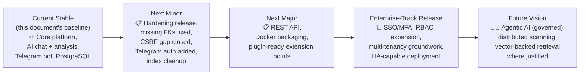
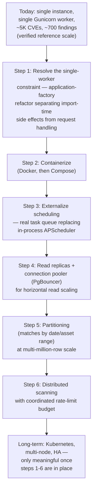

# ARGUS Roadmap

This is ARGUS's strategic roadmap — where the project is today, what's realistically next, and where it's heading over a multi-release horizon. It is not a changelog, not release notes, and not a task tracker; it exists to give contributors, adopters, and evaluators an honest, technically-grounded picture of the project's direction.

## How to read this roadmap

Every item in this document is labeled with one of five statuses, used consistently throughout:

| Status | Meaning |
|---|---|
| ✅ **Completed** | Implemented and verified in the current codebase — cross-referenced against `README.md`, `API.md`, `ARCHITECTURE.md`, `AI.md`, and `DATABASE.md`, all of which were written by directly inspecting the running source, not by describing intent |
| 🔧 **In Progress / Partial** | Exists in some form today but is incomplete, inconsistent, or has a known, documented gap — e.g., a migration written in code but not yet applied everywhere, or a feature implemented for one entry point but not another |
| 📋 **Planned** | Not implemented, but a concrete, near-to-mid-term intention with a reasonably clear implementation path given the current architecture |
| 🔭 **Long-Term / Future Vision** | Directionally aligned with where ARGUS wants to go, but requiring substantial new architecture, and not committed to any particular release |

No item in this document carries a specific release date. ARGUS is milestone-based, not calendar-based: a milestone ships when its scope is actually done, not on a fixed schedule. Where this roadmap says "next release," it means "the next release that ships this scope," not a committed date.

### Relationship to other documents

This roadmap is the strategic layer sitting above ARGUS's technical reference documentation — it should be read alongside, not instead of:

- [`README.md`](./README.md) — current features and project status, the ground truth this roadmap's "Completed" claims are checked against
- [`ARCHITECTURE.md`](./ARCHITECTURE.md) — the system's technical blueprint, including its own `Future Architecture Roadmap` (§28) and `Security Threat Model` (§30), both of which this document draws on directly for the Security and Scalability sections below
- [`API.md`](./API.md) — the current interface reference, including its own `Future REST API` design (§23) referenced in §8 below
- [`INSTALL.md`](./INSTALL.md) — current deployment reality, including the single-Gunicorn-worker constraint that gates several items in §17–§18
- [`DATABASE.md`](./DATABASE.md) — the schema's actual, verified live state (including real, currently-open data-integrity gaps), which directly shapes the "Short-Term" priorities in §7
- [`AI.md`](./AI.md) — the AI subsystem's full technical reference, including its own `Future AI Roadmap` (§25), which §10 below summarizes at a strategic level rather than duplicating in full
- `SECURITY.md` — not yet published; §15 of this document is the closest current statement of ARGUS's security direction until it exists

**A note on volatility.** Every roadmap item below reflects the project's thinking as of this document's writing. Priorities shift as real usage surfaces new needs, as the small-team/individual-analyst audience ARGUS actually serves (`README.md` §1) tells the maintainers what matters, and as the technical debt documented in `ARCHITECTURE.md` and `DATABASE.md` gets addressed or reprioritized. Nothing here is a contractual commitment.

---

## Table of Contents

1. [Introduction](#introduction) *(above)*
2. [Vision Statement](#2-vision-statement)
3. [Project Status](#3-project-status)
4. [Current Capabilities](#4-current-capabilities)
5. [Development Philosophy](#5-development-philosophy)
6. [Roadmap Timeline](#6-roadmap-timeline)
7. [Short-Term Roadmap](#7-short-term-roadmap)
8. [Mid-Term Roadmap](#8-mid-term-roadmap)
9. [Long-Term Roadmap](#9-long-term-roadmap)
10. [AI Roadmap](#10-ai-roadmap)
11. [Cybersecurity Roadmap](#11-cybersecurity-roadmap)
12. [Dashboard Roadmap](#12-dashboard-roadmap)
13. [Telegram Bot Roadmap](#13-telegram-bot-roadmap)
14. [Database Roadmap](#14-database-roadmap)
15. [Security Roadmap](#15-security-roadmap)
16. [Performance Roadmap](#16-performance-roadmap)
17. [Scalability Roadmap](#17-scalability-roadmap)
18. [Deployment Roadmap](#18-deployment-roadmap)
19. [Integration Roadmap](#19-integration-roadmap)
20. [Community Roadmap](#20-community-roadmap)
21. [Enterprise Roadmap](#21-enterprise-roadmap)
22. [Research & Innovation](#22-research--innovation)
23. [Risks & Challenges](#23-risks--challenges)
24. [Success Metrics](#24-success-metrics)
25. [Release Strategy](#25-release-strategy)
26. [Contribution Opportunities](#26-contribution-opportunities)
27. [Frequently Requested Features](#27-frequently-requested-features)
28. [Cross References](#28-cross-references)

---

## 2. Vision Statement

ARGUS's long-term vision is to be a vulnerability management platform that an individual analyst or a small security team can run entirely on their own infrastructure, with an AI layer that genuinely reduces the manual work of triaging and understanding findings — not a chatbot bolted onto a scanner, but a system where correlation, risk scoring, and natural-language analysis are three views onto the same live data.

**Guiding principles the vision is built on:**

- **AI-assisted, not AI-driven.** The AI subsystem explains and prioritizes; it does not — today, or in any near-term plan — take autonomous action against findings, assets, or scans (`AI.md` §16.6, §2). Any future move toward agentic capability (§10, §22) will be gated by an explicit governance/approval layer, not shipped as a default.
- **Self-hosted by default.** Sensitive vulnerability and asset data should not need to leave an operator's own infrastructure to get value from ARGUS — the AI layer's local-first design (`AI.md` §1, §2) is a permanent architectural stance, not a temporary limitation waiting for a "real" cloud integration.
- **Honest about scale.** ARGUS is built for the audience it actually has (`README.md` §1) — individual analysts, small SOC/CERT teams, homelab operators — not a hypothetical enterprise deployment. Enterprise-scale capability (§9, §17, §21) is a direction to grow into deliberately, not a pretense to maintain now.
- **Modular, with real seams, not a plugin marketplace yet.** ARGUS's existing module boundaries (`ARCHITECTURE.md` §5, §27) are extension-friendly in practice even without a formal plugin system — the vision is to eventually formalize those seams (§8, §20) once there's a real, demonstrated need from actual extension attempts, not to build a plugin framework speculatively.
- **Documentation as a first-class artifact.** The document series this roadmap belongs to (`README.md` through `DATABASE.md`) was built by verifying claims against running code, including surfacing real bugs (`DATABASE.md`'s missing foreign keys, `API.md`'s CSRF gap) rather than describing an idealized system. This roadmap continues that discipline — planned items are described as what they'd require, not asserted as already working.

### What "comprehensive AI-powered vulnerability management" means for ARGUS specifically

Not: a system that replaces analyst judgment. Instead: a system that removes the *mechanical* burden of vulnerability management — cross-referencing NVD/KEV/EPSS, remembering which of fifty findings actually matters most, writing the same kind of explanation for the tenth similar CVE this month — so an analyst's judgment is spent on decisions that need it, not on lookups a database and a well-grounded LLM can do reliably.

---

## 3. Project Status

| Category | What belongs here |
|---|---|
| ✅ **Completed** | Implemented, working, and verified against source — the core asset/scan/risk/dashboard/bot/AI-chat/AI-analysis pipeline (`README.md` §3, §23) |
| 🔧 **In Progress / Partial** | Real, currently-open gaps discovered during this documentation effort — missing database foreign keys (`DATABASE.md` §6.3, §16.2), a CSRF token gap on JSON POST routes (`API.md` §7.2, §20), the Telegram bot's complete lack of authorization (`ARCHITECTURE.md` §18, §19) — these are not new features waiting to be built, but existing, shipped functionality with known, documented rough edges |
| 📋 **Planned** | Concrete next steps with a clear implementation path — a versioned REST API (`API.md` §23), Docker packaging (`INSTALL.md` §22), MITRE ATT&CK mapping (`ARCHITECTURE.md` §28) |
| 🔭 **Future Research** | Genuinely open-ended — agentic AI, multi-tenant support, distributed scanning (§9, §10, §17) |
| 🧪 **Experimental** | Ideas with no committed path at all — graph-based attack path modeling, digital twins (§22) |

**On not exaggerating implemented functionality:** several capabilities named in ARGUS's own earlier documentation and public framing turned out, on direct code inspection, to not exist as described — there is no OpenCVE integration anywhere in the codebase (`README.md` §3, `API.md` §14.4), no Ollama-specific integration despite Ollama being named in project materials (`README.md` §3, `AI.md` §26 ADR-AI-2), and no CWE data anywhere in the schema despite the AI system prompt claiming responsibility for explaining it (`AI.md` §10's verified gap). This roadmap treats correcting that gap between stated and actual capability as itself a legitimate, ongoing "Short-Term" priority (§7), not a one-time embarrassment to move past quietly.

---

## 4. Current Capabilities

Summarized from `README.md` §3 and verified across the full documentation series — presented here as the **baseline** this roadmap builds forward from, not restated in full detail (see `README.md` for the complete, current feature list).

| Area | Status |
|---|---|
| Asset management (CRUD, criticality, exposure, network function, city/country) | ✅ Completed |
| CVE management (NVD-sourced, upserted, severity-derived) | ✅ Completed |
| NVD synchronization | ✅ Completed (live per-scan lookup, not a bulk mirror — `DATABASE.md` §9.1) |
| OpenCVE integration | ❌ **Not implemented** — despite being named in this project's own broader materials (`API.md` §14.4) |
| KEV integration | ✅ Completed (24-hour cache) |
| EPSS integration | ✅ Completed (batched per scan) |
| Risk Engine (deterministic CVSS/EPSS/KEV/criticality formula) | ✅ Completed |
| Historical risk snapshots | ✅ Completed (daily, bounded growth — `DATABASE.md` §13.2) |
| AI Security Copilot chat | ✅ Completed (dashboard-only — no Telegram equivalent, `AI.md` §6) |
| Background AI CVE analysis | ✅ Completed, with a known asymmetry in how the two AI entry points handle a missing `LLM_URL` (`AI.md` §6.4) |
| Telegram bot | ✅ Completed for its command set, 🔧 **no authorization model at all** (`ARCHITECTURE.md` §18) |
| Dashboard | ✅ Completed, 🔧 inconsistent pagination (`/findings` paginated, `/assets` is not — `ARCHITECTURE.md` §17, §21) |
| Reports (PDF, daily/weekly/monthly/yearly) | ✅ Completed |
| Scheduler (APScheduler, 7 jobs) | ✅ Completed |
| Authentication (session-based, two roles) | ✅ Completed, no MFA/SSO |
| Database (PostgreSQL) | ✅ Completed, 🔧 verified schema drift and missing foreign keys (`DATABASE.md` §6, §16) |
| Alerting (Telegram only) | ✅ Completed for its one channel |
| Patch planning (`planned_patch_date`/`patch_notes`, asset `exposure`/`function`) | ✅ Completed in code, 🔧 not yet applied to every deployed database (`DATABASE.md` §6.1, §6.3) |

---

## 5. Development Philosophy

| Principle | Why it guides future development |
|---|---|
| **Modularity** | ARGUS's existing per-concern module boundaries (`scanner/`, `Ai/`, `risk/`, `reports/`, `alerts/` — `ARCHITECTURE.md` §5) are what make most of §8's mid-term features (a new report format, a new alert channel, a new threat feed) additive rather than invasive. Future work should extend these seams, not blur them further — `ARCHITECTURE.md` §4's documented "layering violation" (inline SQL in dashboard routes bypassing `bot/database/`) is a caution against, not a pattern to repeat |
| **Security by default** | The project's existing fail-closed choices (no default `SECRET_KEY`/`ADMIN_PASSWORD`, `ARCHITECTURE.md` §2) set the bar every future feature should meet — new authentication mechanisms (§15) and new integrations (§19) should fail closed, not open, when misconfigured |
| **Offline-first AI** | A permanent stance (§2), not a placeholder — every AI roadmap item (§10) is evaluated against "does this still work with a local, self-hosted LLM," not designed cloud-first with local support as an afterthought |
| **Enterprise readiness, earned not assumed** | `README.md` §23's own project-status table already distinguishes what's implemented from what's aspirational — §21's enterprise roadmap continues that discipline rather than implying enterprise-grade maturity ARGUS hasn't yet reached |
| **Performance grounded in real data** | `DATABASE.md` §23's reference backup (25 assets, 5,227 CVEs, 668 matches) is the actual current scale — performance work (§16) should be prioritized against this reality first, and the stated future scale target (5M CVEs, 500K assets) second |
| **Maintainability over cleverness** | The documented pattern of every external client having the same shape (fetch, cache, invalidate — `ARCHITECTURE.md` §27) and every report generator sharing one renderer (`ARCHITECTURE.md` §14) should be the template new contributors follow, not a series of one-off implementations |
| **Scalability as a deliberate, gated future step** | `ARCHITECTURE.md` §21's honest gap analysis (single Gunicorn worker, no partitioning, no read replicas) means scalability work is sequenced, not simultaneous — §17 lays out the actual dependency order |
| **Open standards** | The OpenAI-compatible LLM schema (rather than a vendor SDK, `AI.md` §6.1) and standard PostgreSQL (rather than a proprietary extension) are existing examples of preferring open, swappable standards over vendor lock-in — future integrations (§19) should follow this pattern |
| **Community-driven, realistically** | ARGUS does not yet have the contributor base of the mature projects this roadmap is benchmarked against (Kubernetes, GitLab, Wazuh) — §20's community roadmap is written for where the project is now, not where those projects already are |

---

## 6. Roadmap Timeline

**Why hardening comes before new features.** The next milestone after the current stable release is deliberately a **hardening** release, not a feature release — `DATABASE.md` §27's developer guidelines identify specific, already-diagnosed fixes (the `matches` foreign keys, duplicate indexes, the `CHECK` constraint gaps) that are higher-value, lower-risk work than any net-new feature in §8, precisely because they were found by directly inspecting a real, running instance, not hypothesized. Shipping new mid-term features (§8) on top of an unrepaired data-integrity gap would only make the eventual repair harder (more rows, more application code paths to audit for reliance on the gap's current behavior).

---

## 7. Short-Term Roadmap

Ordered by priority, with rationale for each — these are realistic, near-term items with a clear, already-understood implementation path.

### 7.1 Data integrity repair (highest priority)

- **Add the missing `matches.asset_id` and `matches.cve_id` foreign keys**, following the exact repair pattern already proven for `ai_messages_conversation_id_fkey` (`DATABASE.md` §6.7, §22.6): reconcile orphaned rows first, then add the constraint as a separate, guarded step. *Rationale: this is the single most consequential, already-diagnosed gap in the entire schema — the database currently cannot prevent an orphaned finding, and only disciplined application code stands in for what should be a database guarantee (`DATABASE.md` §7.6).*
- **Add the missing `cve_ai_analysis.cve_id` foreign key**, same pattern.
- **Remove the duplicate indexes and constraints** on `matches` (`idx_matches_asset`/`idx_matches_asset_id`, `idx_matches_cve`/`idx_matches_cve_id`, `unique_asset_cve`/`matches_asset_id_cve_id_key`) — *rationale: zero functional benefit, real write-time cost, and a straightforward cleanup once identified (`DATABASE.md` §15.1, §27.3).*
- **Add the missing `matches.status` and `ai_messages.role` `CHECK` constraints**, using the proven safe pattern (a standalone, guarded `DO $$ ... $$` block, not an inline `ADD COLUMN ... CHECK`) that already worked for `cve_ai_analysis.status` (`DATABASE.md` §16.4).
- **Ensure `idx_cves_kev`/`idx_cves_cvss` and the exposure/function/patch-planning columns are actually applied** to every deployed instance, not just present in the migration script (`DATABASE.md` §6.1, §6.2, §15.3).

### 7.2 Security hardening

- **Resolve the CSRF token gap** on `/api/chat` and `/api/conversations*` — either have the front-end JavaScript attach `X-CSRFToken` (the token is already rendered in `base.html`'s meta tag and simply isn't being read), or make a deliberate, documented decision to exempt these specific session-authenticated JSON routes (`API.md` §7.2, §20). *Rationale: this is a verified, reproducible defect (empirically confirmed against the pinned Flask-WTF version), not a theoretical concern.*
- **Add a basic authorization gate to the Telegram bot** — even a simple allowlist of authorized Telegram user IDs, checked in a decorator wrapping every handler. *Rationale: today, anyone who can message the bot has full read/write access to the asset inventory and can trigger scans — a materially different (and currently ungated) trust boundary than the dashboard's RBAC (`ARCHITECTURE.md` §18, §19, §30).*
- **Add basic rate limiting to `/login`** at minimum, given the complete current absence of any brute-force mitigation (`API.md` §19, `ARCHITECTURE.md` §30).
- **Explicitly set `LLM_URL` validation/warnings** so the analysis pipeline never silently falls back to the hardcoded development IP literal (`AI.md` §6.4, §22.4) — either remove the hardcoded fallback entirely (matching the chat path's clean-failure behavior) or log a loud, impossible-to-miss warning if it's ever used.

### 7.3 Documentation and claim accuracy

- **Correct or remove the OpenCVE and Ollama-specific claims** from any remaining project materials that still reference them as active integrations, now that the current documentation series has verified neither exists as described (§3).
- **Resolve or remove the dead code identified during documentation** — `bot/Ai/prompts.py`/`queries.py` (unused, misleadingly-documented duplicates of logic now inline elsewhere — `AI.md` §7.4), the unreachable `build_dashboard_context()` method (`AI.md` §9.7), the never-set `archived` column on conversations (`AI.md` §11.8), and the dead `matches.alert_sent`/`ai_conversations.user_id` columns (`DATABASE.md` §6.3, §6.6).

### 7.4 Testing and CI/CD

- **Introduce an actual automated test suite.** Today, the only test artifact in the codebase is `bot/test.py` — a manual smoke-test script for the AI context builder with no assertions, meant to be read by a human, not run by CI (verified directly: no `pytest`/`unittest` dependency exists in `requirements.txt`, and no `.github/workflows`, `Dockerfile`, or CI configuration of any kind exists anywhere in the repository). *Rationale: this is arguably the single largest gap between ARGUS's current engineering maturity and the "enterprise-grade" framing this documentation series has been asked to meet — every other roadmap item in this document is riskier to ship without regression coverage than with it.*
- **Add CI** (GitHub Actions or equivalent) running at minimum: linting, the future test suite, and a schema-migration dry-run against a fresh database — the last of which would have caught several of the drift issues `DATABASE.md` found through manual `pg_dump` inspection.

### 7.5 Smaller, high-value improvements

- **Fix `/assets`' missing pagination**, bringing it in line with `/findings`' existing pattern (`ARCHITECTURE.md` §17, §21).
- **Improve AI prompt consistency** — reconcile `bot/Ai/prompts.py`'s stale, shorter system prompt with the actual, longer inline prompt in the dashboard's chat route, so a future contributor doesn't mistake the wrong one for current (`AI.md` §7.4).
- **Add basic logging improvements** — a `LOG_LEVEL` environment variable (currently absent — `ARCHITECTURE.md` §26, `API.md` §18) and, optionally, file-based logging with rotation, rather than stdout-only.
- **Expand documentation** — `INSTALL.md`, `API.md`, `SECURITY.md` remain unpublished in-repository as standalone files as of `README.md` §16's own documentation table; the current documentation series (this roadmap included) should be the basis for actually publishing them, not just referencing them as "in progress."

---

## 8. Mid-Term Roadmap

### 8.1 REST API

A versioned, token-authenticated `/api/v1/` surface, per the detailed design sketch already laid out in `API.md` §23 — thin route handlers calling directly into the existing `bot/database/`, `bot/scanner/`, `bot/risk/`, `bot/reports/`, and `bot/Ai/` modules, rather than reimplementing their logic. *Rationale: today's `/api/chart/*`, `/api/chat`, and `/api/conversations*` routes are internal, unversioned, and session-cookie-only (`API.md` §1, §3.7) — a genuine external integration surface requires token auth and a stable contract neither of those provides.* **Prerequisite:** resolving `API.md` §17's inconsistent response-envelope patterns first, so the new API doesn't inherit them.

### 8.2 Plugin architecture

A formalized version of the extension patterns already documented informally (`ARCHITECTURE.md` §27, `AI.md` §24) — narrow, single-purpose interfaces per subsystem (a scanner client, an alert provider, a report generator, an AI context builder) made genuinely pluggable (dynamically discoverable, independently versioned) rather than "copy the pattern into the main codebase." *Rationale: every current extension point already has a proven, working shape — formalizing it is lower-risk than inventing a new plugin contract from scratch.*

### 8.3 Dark mode

A front-end/CSS-only change to the existing Jinja2-templated dashboard (`ARCHITECTURE.md` §17) — no backend or data-model implication. *Rationale: low implementation cost, frequently requested in comparable tools (§27), and a reasonable place for a first-time frontend contributor to start (§26).*

### 8.4 Role improvements

Moving beyond today's binary `admin`/`viewer` model (`API.md` §4.1) toward a scoped, intermediate role (e.g., "Analyst" — able to manage findings but not assets or users). *Rationale: `API.md` §4.4 already identifies this exact gap; the current two-role model is a genuine limitation for any team larger than "one admin, several read-only viewers."*

### 8.5 Advanced dashboards

Building on the existing chart infrastructure (`ARCHITECTURE.md` §17's two parallel charting systems — static PNG and JSON-API-driven) toward genuinely customizable, saved dashboard views. *Rationale: today's `/charts` and `/api/chart/*` are fixed, non-configurable views — no dashboard-layout persistence exists at all.*

### 8.6 Threat intelligence aggregation

Beyond today's NVD/KEV/EPSS three sources (`README.md` §3) — additional feeds, following the proven `kev/clients.py` cache-fetch-invalidate pattern (`ARCHITECTURE.md` §27) as the template for each new source. *Rationale: KEV and EPSS were themselves additive, non-invasive integrations under this same pattern — there's no architectural reason a third or fourth feed source would be harder.*

### 8.7 Improved scheduler

Addressing `ARCHITECTURE.md` §16's identified reliability gaps — no automatic retry of a failed scheduled job run (today: log and wait for the next tick), no persistent job store surviving a process restart (APScheduler's in-memory store, `ARCHITECTURE.md` §16). *Rationale: the `ai_watchdog` job already proves the value of purpose-built recovery logic (`ARCHITECTURE.md` §22) — extending that principle to scan and report jobs is a natural next step, not a new idea.*

### 8.8 Redis caching

Moving the AI chat response cache (`AI.md` §12.1, §12.9) out of PostgreSQL and into Redis — removing its churn from competing with every other database operation for the same connection pool and I/O (`AI.md` §19.3). *Rationale: this is the lowest-risk, most clearly-scoped piece of `AI.md`'s and `ARCHITECTURE.md`'s broader "future Redis" discussion — a well-isolated cache with a narrow, already-defined interface (`make_cache_key`, `get_cached_response`, `save_response` — `AI.md` §24) that a new backend could implement without touching the calling code.*

### 8.9 WebSocket notifications

A real-time push mechanism (e.g., Flask-SocketIO) for scan completion, new critical findings, or AI analysis completion — addressing `ARCHITECTURE.md` §17's confirmed absence of any real-time dashboard update mechanism today (every interaction is a standard request/response cycle). *Rationale: `/today`'s current synchronous-from-the-caller's-perspective behavior (`ARCHITECTURE.md` §20) is a direct symptom of this gap — a long-running scan currently just makes the browser wait.*

### 8.10 AI conversation improvements

Addressing specific, named gaps from `AI.md`: conversation summarization once the 20-message history cap is exceeded (`AI.md` §8.9), an actual "archive conversation" feature wired up to the already-existing-but-unused `archived` column (`AI.md` §11.8), and streaming chat responses (`AI.md` §14.2) so the UI shows output incrementally rather than waiting for the full 120-second-timeout-bounded response.

### 8.11 Asset relationships

Modeling parent/child asset relationships (e.g., a hypervisor and its guest VMs) — addressing the gap `ARCHITECTURE.md` §8 and `DATABASE.md` §10.7 both identify: today, an asset has no relationship to any other asset beyond independent rows.

### 8.12 Advanced search and reporting

A unified search across assets, findings, and CVEs (today: `/search` tries an asset-name match first, then falls back to a live NVD redirect — `ARCHITECTURE.md` §17), and CSV export for reports (confirmed entirely absent today — PDF is the only format, `API.md` §11.4).

---

## 9. Long-Term Roadmap

These are enterprise-scale goals requiring substantial new architecture — included to communicate direction, explicitly not committed to any near-term release.

| Goal | Architectural consideration |
|---|---|
| **Enterprise SSO (SAML/OIDC), LDAP, OAuth2** | Extends Trust Boundary 1 (the dashboard) only — does **not** by itself address the Telegram bot's separate, currently-ungated trust boundary (`ARCHITECTURE.md` §19, §30); §7.2's Telegram authorization fix is a prerequisite for a genuinely coherent enterprise auth story, not an afterthought to add later |
| **MFA** | Builds on SSO or an independent second-factor step in the existing Flask-Login flow — no groundwork exists today (`ARCHITECTURE.md` §19) |
| **Distributed scanning** | Requires a coordinated rate-limit budget across scanner workers (today's `_NVD_CONCURRENCY = 1` is per-process and would double-count against NVD's limit if naively parallelized — `ARCHITECTURE.md` §12, §21) and a work-queue rather than the current implicit "whoever calls `scan_all_assets()` does all the work serially" model |
| **Distributed scheduler** | APScheduler's in-memory, single-process job store (§8.7) is fundamentally incompatible with multiple coordinating instances — this requires a real distributed task queue (Celery+Redis or equivalent), not a configuration change (`ARCHITECTURE.md` §16, §21) |
| **High availability** | Requires resolving the single-Gunicorn-worker constraint first (`INSTALL.md` §23, `ARCHITECTURE.md` §21, §23) — HA on top of an architecture that can only safely run one application worker is not meaningful HA |
| **Load balancing** | Contingent on the above — load-balancing across multiple *stateless* application instances requires the worker constraint resolved and session state made instance-independent (already true today, since sessions are cookie-based, not server-side — a smaller lift than the worker constraint itself) |
| **Vector database** | Only justified if ARGUS ingests unstructured content that benefits from semantic retrieval (`AI.md` §13.3) — not required for anything in today's structured-data use case; `pgvector` as a PostgreSQL extension is the natural fit given ARGUS's existing database-centric design, should this become justified |
| **Multi-model AI** | Requires a `model` field in requests (currently absent entirely — `AI.md` §6.3, §22.2) and a routing/selection layer, most naturally built on the existing `determine_intent()` classification (`AI.md` §6.6) |
| **Cloud deployment, containerization, multi-node deployment** | Docker packaging (`INSTALL.md` §22, currently an empty placeholder directory) is a hard prerequisite for everything else in this row — Kubernetes or multi-node deployment without Docker existing first is not a meaningful next step (`ARCHITECTURE.md` §23) |
| **Advanced analytics** | Builds on `risk_snapshots`' existing, guaranteed-bounded historical data (`DATABASE.md` §13.2, §28) — a natural consumer of already-collected data, not requiring new instrumentation, only new analysis logic |

---

## 10. AI Roadmap

Summarized at a strategic level; `AI.md` §25 is the complete, detailed technical reference for every item below — not duplicated in full here.

### Near-term (builds directly on existing architecture)

- **Improved prompt consistency** — resolving the stale `prompts.py`/`queries.py` duplication (§7.3).
- **Streaming responses** — the clearest, most immediately valuable UX improvement given today's fully-buffered, up-to-120-second-wait chat experience (`AI.md` §14.2).
- **Context optimization** — token-aware (not just row-count-capped) context budgeting, and conversation summarization once the 20-message cap is exceeded (`AI.md` §8.9, §22.2).

### Mid-term (natural extensions of the current structured-retrieval design)

- **AI-generated reports** — an LLM-assisted narrative layer on top of the existing PDF report generators (`ARCHITECTURE.md` §14), producing an executive-summary framing of report data rather than requiring the model to reconstruct it fresh in every chat session.
- **Threat intelligence summarization** — as additional feed sources are added (§8.6), the AI context builder is a natural place to synthesize across them, following the same intent-routing pattern already used for KEV (`AI.md` §9.2).

### Long-term / research (require genuinely new architecture)

- **Semantic search, embeddings, vector databases** — not required for today's structured-data use case (`AI.md` §13); would only become justified alongside unstructured-content ingestion (§9's parallel entry).
- **AI-assisted remediation** — moving from *suggesting* prioritization (already implemented, `AI.md` §15) to actually proposing and — with explicit human approval — executing a remediation step. **Requires a tool/function-calling layer that does not exist today** (`AI.md` §16.6, §24's largest identified gap) and a governance/approval workflow (§21) as a hard prerequisite, not an optional add-on.
- **Predictive analysis, threat forecasting** — likely a separate, statistical/ML component consuming `risk_snapshots` history, distinct from the LLM-based chat/analysis subsystem entirely (`AI.md` §25, `ARCHITECTURE.md` §13's parallel observation about the Risk Engine).
- **Agentic AI, multi-agent collaboration, tool calling** — `AI.md` §25's own assessment applies without qualification: this requires a tool/function-calling layer, then a safety/approval gate, before any of it is safe to ship, given the AI subsystem's current, structural inability to take any state-changing action is its strongest safety property today (`AI.md` §16.6). This should not be weakened casually.
- **Human approval workflows** — a hard prerequisite for agentic capability, and — per `AI.md` §27's own recommendation — worth building *before* any agentic capability ships, not concurrently with it.
- **Future autonomous assistance** — the furthest-out item on this list, explicitly gated behind every item above; not a near-term direction.

---

## 11. Cybersecurity Roadmap

| Capability | Status | Rationale |
|---|---|---|
| **MITRE ATT&CK mapping** | 🔭 Long-term | Requires a new CVE-to-technique mapping data source and schema (`ARCHITECTURE.md` §28, `DATABASE.md` §25) — no groundwork exists today beyond the general pattern of how KEV was integrated (a precedent for *how* to add it, not existing infrastructure for it specifically) |
| **CAPEC integration** | 🧪 Research | Would complement ATT&CK mapping (attack patterns vs. techniques) but has no current design or committed path — included for completeness, not as a near-term intention |
| **CWE enhancements** | 📋 Planned, and overdue | Unlike most items in this section, this isn't purely additive — `AI.md` §10's verified finding is that ARGUS's own AI system prompt *already claims* CWE-explanation responsibility with **zero** CWE data anywhere in the schema to ground it. This should be prioritized as closing an existing, misleading gap, not merely adding a nice-to-have |
| **CVSS v4** | 📋 Planned | Requires a version-tag column and a decision about storing multiple concurrent scores per CVE (today: one numeric score, no version tag — `DATABASE.md` §9.6) |
| **Threat actor intelligence** | 🔭 Long-term | No current data source or schema; would follow the general "new threat feed" extension pattern (`ARCHITECTURE.md` §27) once a specific, concrete source is identified |
| **Vendor advisories** | 🔭 Long-term | Same pattern as above — no current integration |
| **Exploit databases (e.g., Exploit-DB)** | 🧪 Research | Complements KEV (confirmed exploitation) with proof-of-concept exploit availability — not yet designed |
| **CISA improvements** | 📋 Planned | Today's KEV integration is a single feed, 24-hour cached (`ARCHITECTURE.md` §9, §14.2) — CISA publishes other advisories beyond KEV that aren't currently ingested at all |
| **Compliance frameworks** | 🔭 Long-term | Requires a control/framework mapping model (e.g., `compliance_controls`, `finding_control_mappings` — `DATABASE.md` §25) entirely unbuilt today |
| **Asset exposure scoring** | ✅ Partially completed | The `exposure` (Internal/External) and `function` (network role) columns already exist in code (`DATABASE.md` §6.1, §10.5) as inputs a future scoring refinement could build on — not yet factored into the risk formula itself, which remains CVSS/EPSS/KEV/criticality only (`ARCHITECTURE.md` §13) |
| **SBOM analysis** | 🧪 Research | No software-bill-of-materials ingestion exists; would be a substantial new capability, likely requiring its own asset-to-component data model distinct from today's flat `assets` table |
| **Supply-chain risk** | 🧪 Research | Related to SBOM analysis above — no current design |
| **Container vulnerability scanning** | 🧪 Research | ARGUS's current scanner is keyword-search-based against NVD (`ARCHITECTURE.md` §9), not image-layer-aware — container scanning would likely require a fundamentally different scanning approach, not an extension of the existing one |
| **Cloud asset support** | 🧪 Research | Today's asset model (`DATABASE.md` §10) has no cloud-provider-specific attributes (region, account ID, resource ARN/ID) — would require schema extension and likely a cloud-provider API integration pattern distinct from the current vendor/product/version model |

---

## 12. Dashboard Roadmap

| Capability | Status | Rationale |
|---|---|---|
| **Real-time updates** | 📋 Planned | Requires WebSocket infrastructure (§8.9) — every current interaction is request/response only (`ARCHITECTURE.md` §17) |
| **Interactive charts** | 🔧 Partial | `/api/chart/*` JSON endpoints already exist and are presumably consumed by client-side charting (`API.md` §5.8) — but coexist with a separate, static-PNG `/charts` route that regenerates images server-side on every request (`ARCHITECTURE.md` §17); unifying these two parallel systems is a natural near-term cleanup, not purely a new feature |
| **Risk heatmaps** | 📋 Planned | Builds on existing risk-score data (`ARCHITECTURE.md` §13) — a visualization gap, not a data gap |
| **Asset location maps (granular, per-asset)** | 🔭 Long-term | The City Exposure Overview (aggregated, city-level, privacy-conscious by design — `ARCHITECTURE.md` §19) is the already-implemented precursor; a granular per-asset map would need precise coordinates and a deliberate decision about relaxing the same privacy rationale that keeps today's map city-level only (`README.md` §17) |
| **Advanced filtering** | 🔧 Partial | `/findings` already supports multiple filter dimensions (vendor, risk, KEV, keyword, status, city/country — `API.md` §5.5); `/assets` has fewer filter options and no pagination (`ARCHITECTURE.md` §17, §21) — bringing `/assets` to parity is the concrete near-term piece |
| **Saved searches** | 📋 Planned | No persistence exists for filter/search state today — would require a new small table (user-scoped, similar in spirit to `ai_conversations`' ownership model) |
| **Custom dashboards** | 🔭 Long-term | Requires dashboard-layout persistence, entirely absent today (§8.5) |
| **Executive dashboards** | 🔧 Partial | The AI chat's "dashboard" intent (`build_executive_summary_context()` — `AI.md` §9.2) already produces an executive-framed summary conversationally; a dedicated, non-chat executive dashboard *view* is the remaining piece |
| **Accessibility improvements** | 📋 Planned | No accessibility audit or WCAG-conformance work has been documented anywhere in this project's materials — a genuine, currently-unaddressed gap worth prioritizing given ARGUS's stated government/institutional audience (this document's own brief) |
| **Responsive UI** | 🧪 Research | Current template/CSS structure (`ARCHITECTURE.md` §17) was not verified against mobile viewport behavior in this documentation effort — status here is honestly uncertain rather than asserted either way |
| **Future desktop support** | 🧪 Research | No current design or demonstrated need articulated anywhere in ARGUS's materials |

---

## 13. Telegram Bot Roadmap

| Capability | Status | Rationale |
|---|---|---|
| **Interactive menus / inline keyboards** | 📋 Planned | Today's bot is purely command-based, `shlex`-parsed text (`API.md` §6, `ARCHITECTURE.md` §18) — `python-telegram-bot` (the library ARGUS already depends on) has native inline-keyboard support that isn't currently used at all |
| **Conversation improvements (multi-turn Telegram flows)** | 🔭 Long-term | Every current command is stateless and self-contained (`ARCHITECTURE.md` §18) — a genuine multi-turn flow (e.g., the bot asking a follow-up question) would be new state-machine infrastructure, not an extension of the current command-handler pattern |
| **Approval workflows** | 🔭 Long-term | Contingent on §21's broader enterprise approval-workflow direction; no current groundwork |
| **Voice support** | 🧪 Research | No current design; would layer on top of Telegram's own voice-message support, entirely unaddressed today |
| **Natural language commands** | 🔭 Long-term | Today's commands are structured (`/add <vendor> "<product>" ...`), not natural-language parsed — the AI chat subsystem's intent-routing (`AI.md` §9.2) is architecturally the closest existing analog, but it has **no Telegram integration at all today** (`AI.md` §6, a confirmed gap) — connecting the two is the first real step here |
| **Multi-language support** | 📋 Planned | `AI.md` §23.5's verified finding — the AI chat's intent-routing keyword matching is English-only and has a documented real failure case for non-English questions — applies to any future Telegram natural-language work even more directly, since the bot has no AI integration to inherit even the partial CVE-ID-priority mitigation from |
| **File uploads** | 🧪 Research | No current use case articulated (e.g., bulk asset import via a Telegram-uploaded CSV) — plausible but undesigned |
| **Scheduled reports (Telegram-initiated)** | ✅ Already completed | Weekly/monthly reports are already delivered via Telegram automatically (`ARCHITECTURE.md` §16, §11.3) — listed here only to confirm this specific brief item is not a gap |
| **Custom notifications (configurable alert rules)** | 📋 Planned | Today's alerting has exactly one trigger condition — "this scan produced a new finding" (`ARCHITECTURE.md` §15) — no severity thresholds, no per-user notification preferences, no digest-frequency configuration exist |

---

## 14. Database Roadmap

Cross-referencing `DATABASE.md` §23, §25 directly — not restated in full detail here.

| Capability | Status | Rationale |
|---|---|---|
| **Partitioning** | 🔭 Long-term | Only justified at the stated multi-million-row target scale (`DATABASE.md` §23.3) — `matches` (by `first_seen` date range or `asset_id` hash) is the clearest candidate; not needed at today's verified scale (668 rows) |
| **Materialized views** | 📋 Planned | The four AI-facing views are currently plain (non-materialized) views, re-executing on every reference (`DATABASE.md` §18.10) — converting `ai_asset_summary`/`ai_vulnerability_summary` specifically (both involve `GROUP BY` aggregation) is a natural, well-scoped next step once query volume justifies the staleness trade-off |
| **Read replicas** | 🔭 Long-term | Requires application-layer read/write connection routing that `bot/database/db.py` doesn't have today (`DATABASE.md` §18.11) |
| **Performance tuning** | 📋 Planned, immediate | The `idx_cves_kev`/`idx_cves_cvss` gap (`DATABASE.md` §15.3) is already diagnosed and merely needs to actually reach every deployed database (§7.1) — the lowest-effort, highest-clarity item in this entire roadmap |
| **Historical optimization** | ✅ Already achieved for risk data | `risk_snapshots`' pre-aggregated, guaranteed-bounded design (`DATABASE.md` §13.2, §18.9) already solves this for risk trend data specifically — the pattern is proven and could be extended to other historical-data needs as they're identified |
| **Vector database integration** | 🔭 Long-term | Contingent on §9/§10's AI-side justification — `pgvector` as a PostgreSQL extension is the natural implementation path given ARGUS's existing architecture, should this become needed (`DATABASE.md` §25) |
| **Graph relationships** | 🧪 Research | `DATABASE.md` §25's own assessment: not currently justified by any articulated ARGUS use case; a conventional self-referencing foreign key on `assets` (for parent/child relationships, §8.11) would likely suffice without needing a graph database at all |
| **Multi-tenant support** | 🔭 Long-term | Requires a `tenant_id` dimension added to nearly every table reviewed in `DATABASE.md` §6, plus resolving the built-in-accounts-have-no-`users`-row inconsistency (`DATABASE.md` §6.11) that a real multi-tenant permissions model would need to account for |
| **Archiving** | 📋 Planned | No retention/archival tooling exists for any table today (`DATABASE.md` §24) — reports, resolved findings, and superseded CVE analyses are the clearest near-term archival candidates |
| **Audit logs** | 📋 Planned, high-value | `DATABASE.md` §14.4, §25's consistent conclusion: a genuine, comprehensive append-only audit-log table is the single most valuable database addition not yet built, given how many "who changed what, when" questions the current schema cannot answer |
| **Time-series optimization** | 🧪 Research | `risk_snapshots` is already a hand-rolled, adequate time-series table at daily granularity (`DATABASE.md` §25) — a dedicated time-series extension (e.g., TimescaleDB) would only be justified by a finer-than-daily granularity requirement that no current need calls for |

---

## 15. Security Roadmap

Cross-referencing `ARCHITECTURE.md` §19, §30 and `AI.md` §16, §27 directly.

| Capability | Status | Rationale |
|---|---|---|
| **MFA** | 🔭 Long-term | No groundwork exists (`ARCHITECTURE.md` §19) — sequenced after basic Telegram authorization (§7.2), which is a more urgent, lower-effort gap |
| **SSO, OAuth2, OIDC, LDAP** | 🔭 Long-term | Extends the dashboard's trust boundary only, not Telegram's (§9's table) — genuinely valuable for institutional/government deployments (this document's stated audience) but a substantial integration effort with no current library dependency in place |
| **Prompt injection protection** | 📋 Planned | Today's mitigation is prompt-instruction-only, with no technical enforcement (`AI.md` §16.1, §17) — a real, acknowledged gap; even a basic input-length/pattern heuristic layer would be an improvement over the current "trust the system prompt" posture, though it would not be a complete solution |
| **Runtime security (e.g., dependency vulnerability scanning of ARGUS itself)** | 📋 Planned | No `pip-audit`/`safety`/Dependabot-equivalent process is evidenced anywhere in the current repository |
| **Secrets manager integration** | 🔭 Long-term | Today: flat `.env` file, no external secrets-manager integration (`ARCHITECTURE.md` §19, §25) |
| **Audit dashboard** | 🔭 Long-term | Contingent on the audit-log table (§14) existing first — a dashboard view is the natural second step, not a parallel effort |
| **Session improvements** | 📋 Planned | Today's fixed 8-hour session lifetime is not configurable via environment variable (`API.md` §3.4) — making it configurable, and considering shorter defaults for higher-sensitivity deployments, is a small, well-scoped improvement |
| **Encryption at rest** | 🔭 Long-term | No column-level or transparent database encryption exists today (`DATABASE.md` §20.7) — `notes`, AI conversation `content`, and CVE `description` are the clearest candidates if this is pursued |
| **Supply chain security, SBOM, signed releases** | 🧪 Research | No current practice around dependency provenance, release signing, or ARGUS's own SBOM generation — genuinely valuable for the government/institutional audience this roadmap's brief names, but currently entirely unaddressed |
| **Container security** | 🔭 Long-term | Contingent on Docker packaging existing first (§9, `INSTALL.md` §22) — container security scanning of an image that doesn't exist yet is not yet a meaningful next step |
| **Security scanning (SAST/DAST of ARGUS's own code)** | 📋 Planned | No evidence of static or dynamic application security testing being run against ARGUS's own codebase today — a reasonable, low-friction CI addition once CI exists at all (§7.4) |
| **Responsible disclosure program** | 📋 Planned | No `SECURITY.md` currently exists as a published file (`README.md` §16) — establishing a clear vulnerability-reporting process is a low-cost, high-trust-value near-term action independent of any code change |

---

## 16. Performance Roadmap

| Capability | Status | Rationale |
|---|---|---|
| **Caching (beyond today's AI response cache)** | 🔧 Partial | Only the AI chat response cache exists today (`AI.md` §12, `DATABASE.md` §18.5) — dashboard reads, chart generation, and report generation have zero caching |
| **Redis** | 📋 Planned | Covered in §8.8 — the clearest, best-scoped near-to-mid-term performance item |
| **Connection pooling improvements** | 📋 Planned | Today's pooling is real but per-process (`ARCHITECTURE.md` §20) — a combined dashboard+bot deployment effectively doubles the real connection budget against PostgreSQL without any coordination between the two pools; a shared external pooler (e.g., PgBouncer) would address this directly |
| **Lazy loading** | N/A | Not applicable in the ORM sense (no ORM exists); already-selective column querying is the current, adequate practice (`ARCHITECTURE.md` §20) |
| **Async processing** | 🔧 Partial | The scanner's core functions are already `async` (`ARCHITECTURE.md` §12) — but on-demand dashboard actions still block the calling browser via a thread-pool bridge rather than genuinely async request handling (`ARCHITECTURE.md` §20) |
| **Parallel scanning** | 🔭 Long-term | Gated behind `_NVD_CONCURRENCY`'s current hardcoded value of 1 and the rate-limit-coordination problem described in §9 — raising this safely requires either an `NVD_API_KEY`-aware automatic adjustment (a smaller, near-term fix) or full distributed-scanning coordination (a long-term one) |
| **Background workers (beyond today's scheduler + thread pools)** | 🔭 Long-term | Contingent on moving away from APScheduler's in-process model (§9, §14) |
| **Distributed scheduler** | 🔭 Long-term | Covered in §9 |
| **Memory optimization** | 🔧 Partial | Existing token/row caps (`AI.md` §8.2) and EPSS batching (`ARCHITECTURE.md` §9) are real, working optimizations — no unaddressed memory concern is currently diagnosed at today's scale |
| **GPU acceleration** | N/A to ARGUS itself | Entirely a property of the operator's chosen LLM server (`AI.md` §6.5) — not something ARGUS's own codebase implements or could implement, since ARGUS never loads a model |
| **Report optimization** | 🔭 Long-term | No caching or incremental generation exists (`ARCHITECTURE.md` §14) — each report re-aggregates its full time window from scratch every time; only relevant at report volumes/frequencies well beyond today's observed 8 reports total (`DATABASE.md` §23.2) |
| **AI optimization** | 🔧 Partial | Streaming (§10, §8.10) is the clearest, most valuable near-term AI performance improvement not yet built |

---

## 17. Scalability Roadmap

Assuming the stated future target (millions of CVEs, hundreds of thousands of assets, thousands of users, millions of AI conversations) — `ARCHITECTURE.md` §21 and `DATABASE.md` §23 both provide the detailed gap analysis this section summarizes strategically.

**Why this specific order.** Each step in this diagram is a genuine prerequisite for the one after it, not an arbitrary priority ordering: Kubernetes deployment (H) on top of an architecture that can only safely run one application worker (the current state, per `INSTALL.md` §23) provides no real benefit until that constraint (B) is resolved; distributed scanning (G) is meaningless without first addressing the shared rate-limit-budget problem that naive parallelization would create (`ARCHITECTURE.md` §12); and partitioning (F) is explicitly *not* needed at today's verified ~700-row `matches` table (`DATABASE.md` §23.2) — building it prematurely would add complexity with no current benefit.

- **Horizontal scaling:** Gated behind resolving the single-worker constraint (step B above) — `ARCHITECTURE.md` §21, §23.
- **Microservices (only if justified):** `ARCHITECTURE.md` §21's own assessment stands: the current module boundaries are a plausible starting decomposition *if* independent scaling of, e.g., the AI engine versus the scanner becomes a demonstrated bottleneck — not a default recommendation absent that evidence.
- **Queue systems / message brokers:** Required for step D (distributed scheduling) and any future distributed AI-analysis-queue processing at scale beyond what 5-minute polling of a `status='pending'` column can sustain (`ARCHITECTURE.md` §21).
- **API Gateway:** Contingent on the REST API (§8.1) existing first — a gateway in front of an API that doesn't yet exist is not a meaningful next step.
- **Distributed workers:** Same prerequisite chain as distributed scheduling (step D).
- **Cloud-native deployment:** Contingent on Docker (step C).
- **High availability, disaster recovery:** The long-term end state (H) — requires PostgreSQL streaming replication with automated failover, multiple stateless application instances behind a load balancer, and distributed scheduler coordination, none of which exist today (`ARCHITECTURE.md` §22).

---

## 18. Deployment Roadmap

| Capability | Status | Rationale |
|---|---|---|
| **Docker** | 📋 Planned, near-term priority | The `docker/` directory exists today only as an empty placeholder (`README.md` §17, `INSTALL.md` §22) — this is the single highest-leverage deployment item, since nearly every other item in this section depends on it |
| **Docker Compose** | 📋 Planned | `INSTALL.md` §22 already sketches the intended shape (a `postgres` service, an `argus-dashboard` service behind Gunicorn, an optional `argus-bot` service, an optional local-LLM service) — the design exists; the implementation doesn't yet |
| **Kubernetes, Helm charts** | 🔭 Long-term | Contingent on Docker existing first, and on resolving the single-Gunicorn-worker constraint before horizontal pod scaling would be safe (§17) |
| **Nginx / reverse proxy** | ✅ Already documented, not yet automated | `INSTALL.md` §23 already provides a working nginx configuration example for production deployment — this exists as documentation/guidance today, not as an automated setup step |
| **HTTPS automation** (e.g., automatic Let's Encrypt renewal) | 📋 Planned | `INSTALL.md` §23 references Certbot but does not automate its setup — a Docker Compose-based deployment (above) is a natural place to bundle this |
| **Monitoring, observability** | 🔭 Long-term | No metrics endpoint, no `/health` route distinct from ordinary dashboard routes, no Prometheus/Grafana integration exists anywhere (`ARCHITECTURE.md` §26) — a `postgres_exporter`-style approach for the database side (`DATABASE.md` §26.8) is the lowest-effort starting point, requiring no ARGUS code changes at all |
| **Centralized logging** | 📋 Planned | Today: stdout/stderr only, no file-based logging, no log aggregation (`ARCHITECTURE.md` §19, §26) |
| **Infrastructure as Code** | 🧪 Research | No Terraform/CloudFormation/Ansible artifacts exist for ARGUS today — genuinely useful for the government/enterprise audience this roadmap's brief names, but no current design |
| **Cloud deployment (named providers)** | 🧪 Research | No cloud-provider-specific guidance exists (`ARCHITECTURE.md` §23) — the architecture is cloud-agnostic by omission (it's just Python + PostgreSQL, deployable anywhere either runs) rather than by deliberate cloud-portability design |

---

## 19. Integration Roadmap

All items below are explicitly **planned, not implemented** — ARGUS today integrates with exactly three external data sources (NVD, KEV, EPSS) and one notification channel (Telegram). Every item in this section is a genuine, currently-nonexistent integration.

| Integration | Category | Rationale |
|---|---|---|
| Microsoft Teams, Slack, Discord | Notification channels | Would follow `alerts/telegram_alert.py`'s proven `send_alert(message: str) -> bool` interface shape (`ARCHITECTURE.md` §27) — the pattern is proven, only the specific channel is new |
| Email | Notification channel | Same pattern — likely the simplest new channel to add given no external API/bot-registration step is required |
| Webhooks (generic outbound) | Notification/integration primitive | A generic webhook sender would let ARGUS integrate with *any* downstream system without ARGUS needing a bespoke client for each — arguably higher-leverage than adding named integrations one at a time |
| Jira, ServiceNow | Ticketing integration | Would require a new, bidirectional integration pattern (creating/updating tickets from findings) distinct from today's one-directional alert-sending model — a genuinely new category of integration, not a variation on the existing pattern |
| Splunk, Elastic Stack | SIEM/log-shipping integration | Would most naturally consume ARGUS's own logs/events (contingent on centralized logging and an audit-log table existing first — §14, §18) rather than requiring ARGUS to poll or push into either platform directly |
| TheHive, MISP, OpenCTI | Threat-intel/case-management platforms | Complements the broader threat-intelligence-aggregation direction (§11) — no current design |
| Azure AD, Google Workspace | Identity providers | Falls under the SSO/OIDC direction (§15) rather than being a distinct integration category |
| GitHub, GitLab | Source-control/CI integration | Most plausible use case: triggering a scan or check as part of a CI/CD pipeline — contingent on the REST API (§8.1) existing as the integration surface |
| CI/CD pipelines (generic) | Automation integration | Same prerequisite as above |

---

## 20. Community Roadmap

| Area | Status | Rationale |
|---|---|---|
| **Open-source governance** | 📋 Planned | No formal governance model (maintainer structure, decision-making process) is documented anywhere in ARGUS's current materials — worth establishing before the contributor base grows large enough that its absence becomes a source of friction |
| **Contributor guidelines** | 📋 Planned | No `CONTRIBUTING.md` currently exists as a published file (`README.md` §16, §18 already describes the *expected* contribution process informally — formalizing it into a real file is the concrete next step) |
| **Issue templates** | 📋 Planned | No `.github/ISSUE_TEMPLATE` structure was found in the repository — a low-cost improvement to the quality of incoming bug reports |
| **Documentation improvements** | 🔧 Ongoing | This entire documentation series (`README.md` through this roadmap) is itself the current documentation-improvement effort — the next step is ensuring these files are actually published in the repository (`README.md` §16's own documentation table still marks several as "not yet published") |
| **Community discussions** | 📋 Planned | Contingent on the project reaching public visibility (`README.md` §22 already notes GitHub Discussions as "to be added once enabled") |
| **Localization** | 🧪 Research | No i18n framework exists in the dashboard templates today — a substantial undertaking given the current single-language (English) template/prompt design throughout, including the AI subsystem's English-keyword-dependent intent routing (`AI.md` §23.5) |
| **Plugin ecosystem** | 🔭 Long-term | Contingent on the plugin architecture (§8.2) existing first — an ecosystem requires a platform to build on |
| **Extension SDK** | 🔭 Long-term | Same prerequisite as above — likely a packaged, documented version of the extension patterns already informally described in `ARCHITECTURE.md` §27 and `AI.md` §24 |
| **Educational resources** | 🧪 Research | ARGUS's stated audience includes students and researchers (`README.md` §1) — tutorial content, architecture walkthroughs, or a "build your own vulnerability scanner" educational framing built around ARGUS's codebase are plausible, undesigned directions |
| **Research collaboration** | 🧪 Research | No current formal relationships with academic or research institutions — an open direction given the project's stated audience, not a committed plan |

---

## 21. Enterprise Roadmap

Every item below is explicitly future-facing — ARGUS today has no enterprise licensing, no multi-tenancy, and no professional support model of any kind (`README.md` §19, §22 confirm no license has even been declared yet, let alone an enterprise tier).

| Capability | Status | Rationale |
|---|---|---|
| **Multi-tenancy** | 🔭 Long-term | Covered in detail in §14 — requires a `tenant_id` dimension across nearly the entire schema |
| **Enterprise RBAC** | 🔭 Long-term | Beyond today's two-role model (§8.4) — a genuine RBAC system needs a `roles`/`permissions` table structure, not a single free-text `role` column (`DATABASE.md` §25) |
| **Audit logging** | 📋 Planned | Covered in §14 — arguably the single highest-value item in this entire roadmap given how directly it addresses a real, verified gap |
| **Compliance dashboards** | 🔭 Long-term | Contingent on compliance-framework mapping (§11) existing first |
| **Approval workflows** | 🔭 Long-term | Contingent on agentic AI or any other autonomous-action capability existing first (§10) — there is currently nothing that *needs* approval, since the AI subsystem cannot act on its own |
| **Custom branding** | 📋 Planned | A comparatively low-effort frontend/template change once there's a clear enterprise-deployment need articulated |
| **API tokens** | 📋 Planned | A direct prerequisite for the REST API (§8.1) — no token-authentication mechanism or `api_tokens` table exists today (`DATABASE.md` §25) |
| **Enterprise licensing** | 🧪 Research | ARGUS has no declared license at all currently (`README.md` §19) — any enterprise licensing model is contingent on that foundational decision being made first, and is explicitly not implied to exist by this roadmap |
| **High availability** | 🔭 Long-term | Covered in §9, §17 |
| **Professional support model** | 🧪 Research | No current organizational structure or commercial entity behind ARGUS is documented — included here only because the original brief requested it, explicitly not implying one is planned |

---

## 22. Research & Innovation

These are genuinely experimental ideas — included for transparency about where thinking is headed, with **no committed implementation path**. Labeling something here is explicitly not a promise.

| Idea | Why it's interesting | Why it's not further along |
|---|---|---|
| **LLM benchmarking** (systematically evaluating which local models perform best against ARGUS's specific prompts) | Would give operators concrete guidance beyond `AI.md` §6.2's general model-size/quantization recommendations | No benchmarking harness or evaluation dataset exists — `AI.md` §7.5 confirms there is no prompt-testing infrastructure of any kind today |
| **Cybersecurity copilots** (broader than today's chat — proactive, not just reactive, assistance) | Natural extension of the existing AI Security Copilot framing (`README.md` §1) | Requires the agentic-AI prerequisites discussed in §10 |
| **Threat prediction** | Complements predictive risk analysis (§10) | Same statistical/ML groundwork required, entirely separate from the LLM-based subsystem |
| **Graph-based attack paths** (modeling how an attacker could chain findings across assets) | Could meaningfully extend risk prioritization beyond per-finding scoring | Requires both a graph data model (§14's assessment: not currently justified on its own) and a way to reason about multi-hop attack chains that no current component does |
| **Digital twins** (a simulated model of the asset environment for testing remediation scenarios) | Interesting for training/simulation use cases given ARGUS's stated educational audience (`README.md` §1) | No current design; a substantial, standalone undertaking unrelated to ARGUS's existing architecture |
| **Risk simulation** ("what if we patched X first vs. Y first") | Builds naturally on existing risk-score data | Would require a what-if query layer over `matches`/`risk_snapshots` that doesn't exist today |
| **AI-assisted incident response** | Extends the AI subsystem beyond vulnerability management into active-incident support | A different problem domain than ARGUS's current vulnerability-management focus — would need its own data model (incidents, timelines) entirely absent today |
| **Knowledge graphs** | Could unify CVE, asset, and threat-intel relationships more richly than today's relational joins | Overlaps with graph-relationships research (§14) — same "not yet justified" assessment applies |
| **Natural language querying** (beyond today's chat — e.g., "show me" commands that manipulate the dashboard view itself) | Extends the existing intent-routing pattern (`AI.md` §9.2) toward UI actions, not just information retrieval | Would require the AI subsystem to have some notion of dashboard state/navigation, which it currently has zero awareness of (`AI.md` §10's confirmed scope: the AI only ever reads data, never controls UI) |
| **Adaptive prioritization** (risk scoring that learns from an organization's actual remediation patterns over time) | Could address `ARCHITECTURE.md` §13's observation that today's risk weights read as reasonable, hand-chosen constants, not calibrated ones | Would require a feedback-loop mechanism (tracking what actually got prioritized/remediated vs. what the formula suggested) that doesn't exist today, plus a decision about whether machine-learned weights are more trustworthy than the current fully-explainable formula (`ARCHITECTURE.md` §13's stated preference for explainability over statistical rigor) |

---

## 23. Risks & Challenges

Honest, specific challenges — not generic "software is hard" statements.

| Risk | Why it's real for ARGUS specifically | Mitigation direction |
|---|---|---|
| **Maintaining documentation accuracy as the codebase evolves** | This exact document series already had to correct itself once — the codebase changed meaningfully (a restructured entry point, new modules, a new Patch Planning feature) between the `ARCHITECTURE.md`/`AI.md` review and the `DATABASE.md` review, requiring an explicit correction to earlier claims. This is a demonstrated, recurring risk, not a hypothetical one | Treat documentation verification as an ongoing practice tied to releases, not a one-time effort — the methodology used throughout this series (verify against running code and real data, not stated intent) should be the standing practice, not a special one-time audit |
| **Dependency updates** | `requirements.txt` pins specific versions (`INSTALL.md` §3) with no automated update-checking process evidenced anywhere | Introduce Dependabot or equivalent as part of the CI/CD work in §7.4 |
| **AI model evolution** | ARGUS is deliberately model-agnostic (`AI.md` §6.1) — a strength for flexibility, but it also means ARGUS has no control over, and limited ability to test against, the full space of models operators might connect | The near-term LLM-benchmarking research idea (§22) would help, but isn't a full solution — model-agnosticism is a permanent trade-off, not a problem to eliminate |
| **Database growth** | `DATABASE.md` §23's honest gap analysis: the current architecture is not yet built for the multi-million-row target this roadmap describes | §17's phased scalability roadmap exists precisely to sequence this work rather than attempt it all at once |
| **Scaling challenges more broadly** | The single-Gunicorn-worker constraint (`INSTALL.md` §23) blocks nearly every other scaling step until resolved | §17 makes this dependency explicit rather than treating each scaling item as independent |
| **False positives (in vulnerability matching)** | ARGUS's matching is NVD keyword-search relevance, not CPE-based structured matching (`ARCHITECTURE.md` §9) — this is a genuine precision limitation, not a bug to be fixed incrementally, since it's a property of the chosen matching approach itself | A future move toward CPE-based matching would be a significant scanner redesign, not a tuning exercise — not currently planned, but named here as the actual lever if false-positive rates become a demonstrated problem |
| **AI hallucinations** | `AI.md` §17.10, §23.9's own honest conclusion: every mitigation ARGUS employs is prompt-level and retrieval-first, with **no independent technical verification layer** — this is described in `AI.md` as arguably the single most consequential realistic risk in the entire AI subsystem | `AI.md` §27's recommendations (persisting context for retroactive audit, a grounding/confidence indicator) are the concrete near-term mitigation directions; a full solution (independent fact-checking) is a larger, unscheduled undertaking |
| **Threat intelligence source changes** (NVD/KEV/EPSS changing their API or data format) | ARGUS depends on three external, ARGUS-doesn't-control data sources for its core value proposition | Each client already has its own isolated module with defined error-handling (`ARCHITECTURE.md` §9, §14) — a breaking upstream change would be isolated to one client module, not a cascading failure, by existing design |
| **Community maintenance capacity** | ARGUS does not yet have the contributor base of the mature projects this roadmap is benchmarked against | §20's community roadmap is deliberately scoped to where the project actually is, not where it aspires to be — realistic expectations reduce the risk of contributor burnout from an over-ambitious community strategy |
| **Resource limitations** (maintainer time, infrastructure cost for testing at scale) | Not specific to ARGUS, but real — the §17 scalability roadmap explicitly sequences work partly *because* attempting all of it simultaneously would be a poor use of limited resources | Milestone-based, dependency-ordered planning (as this document uses throughout) is itself the mitigation |

---

## 24. Success Metrics

Measurable, realistic goals — not numeric promises this document isn't positioned to guarantee.

| Metric | What "success" looks like | Why this metric, not a bigger claim |
|---|---|---|
| **Performance (response time)** | Dashboard routes and AI chat responses complete within a consistent, documented expectation for the deployment's own hardware tier — not a fixed millisecond target independent of what LLM/database hardware an operator actually runs | `AI.md` §6.5, §23.4 already establish that AI latency is entirely hardware-dependent — a fixed numeric SLA would be dishonest given ARGUS has no control over operator infrastructure |
| **Memory usage** | Documented, tested memory footprint at defined reference scales (e.g., the `DATABASE.md` §23.2 reference backup's ~5K CVE / ~700 finding scale, and a defined larger reference point once §7.4's test suite exists to measure it) | Concrete and testable, unlike an abstract "low memory usage" claim |
| **Documentation coverage** | Every table, route, command, and configuration variable has a corresponding entry in the current documentation series, kept current as the codebase changes (§23's named risk) | Directly measurable by diffing documentation against source, the same method this entire series was built with |
| **Test coverage** | Meaningful coverage of `bot/database/`, `bot/scanner/`, `bot/risk/`, and `bot/Ai/` — starting from today's baseline of effectively zero automated coverage (§7.4) | Any real coverage number is an improvement over the current state; a specific percentage target is less important than establishing the practice at all |
| **User adoption** | Growth in real deployments, evidenced by community engagement (issues, discussions) rather than a specific install-count target ARGUS has no way to measure today (no telemetry exists or is planned — consistent with the project's privacy-first stance, `AI.md` §2) | ARGUS deliberately does not phone home — adoption metrics must come from voluntary community signals, not instrumentation |
| **Community contributions** | Growth in external pull requests and issue engagement over time, from today's baseline | Realistic for a project's current stage rather than benchmarked against Kubernetes-scale contribution volume |
| **Issue resolution** | A documented, followed triage process (once issue templates and contributor guidelines exist, §20) with reasonable response-time norms | Process-oriented rather than a specific SLA this project isn't yet resourced to guarantee |
| **Reliability** | Reduction in the specific, already-diagnosed gaps this documentation series found (missing foreign keys, the CSRF gap, duplicate indexes) — tracked as a concrete punch list, not an abstract reliability score | Directly tied to real findings already on record, not a vague aspiration |
| **Security posture** | Closure of the specific gaps named in §7.2 and `ARCHITECTURE.md` §30's threat model recommendations, plus establishment of a responsible-disclosure process (§15) | Same principle — concrete, already-identified items, not an abstract posture claim |

---

## 25. Release Strategy

### Versioning

ARGUS does not currently publish a version number anywhere in the codebase (`ARCHITECTURE.md` §24 — no `__version__`, no `VERSION` file, no version string in `requirements.txt` or the application entry point). **Adopting Semantic Versioning (MAJOR.MINOR.PATCH) starting from the next release** is itself a near-term roadmap item, not an assumption this document can make about a versioning scheme already in place.

### Release types, once versioning is adopted

| Release type | What it contains |
|---|---|
| **Major** | Breaking schema changes, breaking API changes (once the REST API in §8.1 exists to have a compatibility contract at all), or a fundamental architectural shift (e.g., resolving the single-worker constraint) |
| **Minor** | New features that don't break existing deployments — most of §8's mid-term roadmap items would land as minor releases |
| **Patch** | Bug fixes, security fixes, and the kind of hardening work in §7 — importantly, **the very next release should likely be a patch-or-minor hardening release focused on §7's items**, not a major version bump, since none of that work breaks existing deployments |
| **Release candidates** | Not currently used — worth introducing once the test suite (§7.4) exists to make a release candidate period meaningful (there's limited value in an RC period with no automated regression coverage to run against it) |

### Deprecation policy

Not currently formalized — `ARCHITECTURE.md` §24 confirms no mechanism exists in the codebase for marking a route or function deprecated, warning callers, or sunsetting an interface on a schedule. This should be established **before** the REST API (§8.1) ships, since an external, versioned API is exactly the kind of interface that needs a real deprecation policy from day one, not retrofitted later.

### Backward compatibility

Database schema changes should continue to be additive wherever possible (`ARCHITECTURE.md` §24's observation that this is already the current practice) — but per `DATABASE.md`'s own findings, "additive" migrations must be paired with genuine repair steps (orphan reconciliation before adding a constraint, §7.1) rather than assuming `ADD COLUMN IF NOT EXISTS` alone guarantees a consistent result across every deployment's actual history.

### Migration guides

Not currently published as a distinct artifact — `INSTALL.md` §16's "Updating ARGUS" section is the closest existing equivalent. Once semantic versioning and a real release cadence exist, per-major-version migration guides (what changed, what an operator needs to do) should accompany each major release.

---

## 26. Contribution Opportunities

Organized by area, with an honest note on current skill-level accessibility for each — a genuine attempt to help a prospective contributor pick a starting point, not a generic list.

| Area | Good first opportunities | Why |
|---|---|---|
| **Documentation** | Publishing the currently-unpublished docs (`INSTALL.md`, `API.md`, `SECURITY.md` per `README.md` §16) as actual repository files; keeping documentation synchronized as the codebase evolves (§23's named risk) | Low technical barrier, high value, and this entire series already provides the accuracy bar to match |
| **Testing** | Writing the first real automated test suite (§7.4) — starting with `bot/risk/scoring.py` (a pure function with no I/O, `ARCHITECTURE.md` §13, the easiest module in the codebase to unit-test) is the natural entry point | Given today's near-zero coverage, almost any well-written test is net-positive, and a pure function is the lowest-friction place to start |
| **Translations** | Localizing dashboard templates and, longer-term, addressing the AI subsystem's English-only intent routing (`AI.md` §23.5) | The template-localization piece is approachable for a non-backend contributor; the AI intent-routing piece is a more advanced, AI-adjacent opportunity |
| **Frontend** | Dark mode (§8.3), `/assets` pagination (§7.5), accessibility improvements (§12) | All three are scoped, template/CSS-level changes with clear existing patterns to follow (`/findings`' pagination is the template for `/assets`') |
| **Backend** | The `matches`/`cve_ai_analysis` foreign-key repairs (§7.1) — a well-defined, already-diagnosed task with a proven pattern to follow (`ai_messages`' successful repair) | Concrete, bounded scope with a clear "done" definition, appropriate for a contributor wanting a meaningful but not open-ended first backend task |
| **AI** | Prompt consistency cleanup (§7.3), streaming responses (§10) | The former is a small, well-scoped cleanup; the latter is a more substantial but clearly-bounded feature with existing prior art (streaming chat is a well-understood pattern in the broader LLM tooling ecosystem) |
| **Database** | Index cleanup (§7.1), the audit-log table design (§14, §21) | The former is small and mechanical; the latter is a genuine design opportunity for a contributor wanting to shape a new, high-value capability from scratch |
| **Threat intelligence** | Adding a new feed source following the `kev/clients.py` pattern (§11, §19) | A well-proven template to follow, with NVD/KEV as working reference implementations |
| **Security** | The CSRF fix (§7.2), the Telegram authorization gate (§7.2) | Both are concrete, already-diagnosed, security-relevant fixes appropriate for a contributor with security interest but not necessarily deep ARGUS-specific context yet |
| **Performance** | The `cves` indexing fix (§7.1, §14) — genuinely the single lowest-effort, highest-clarity contribution opportunity in this entire roadmap | Already fully diagnosed with the exact fix specified; mostly a matter of ensuring it's actually applied everywhere |
| **Accessibility** | A WCAG conformance audit of the existing dashboard templates (§12) | No prior work exists to build on, making this a genuine, well-scoped opportunity for a contributor with accessibility expertise |
| **Plugins** | Not yet a real contribution area — the plugin architecture (§8.2) doesn't exist yet to build plugins against | Listed here only to be honest that this isn't an actionable opportunity today, unlike the items above |

---

## 27. Frequently Requested Features

| Feature | Status | Notes |
|---|---|---|
| **REST API** | 📋 Planned | Detailed design already exists (`API.md` §23) — see §8.1 |
| **Dark Mode** | 📋 Planned | See §8.3 — low-effort, good first-contribution candidate |
| **Docker** | 📋 Planned | See §18 — highest-leverage deployment item, currently just a placeholder directory |
| **Cloud Deployment** | 🔭 Long-term | Contingent on Docker; no provider-specific work started (§18) |
| **Enterprise Authentication (SSO/OIDC/LDAP)** | 🔭 Long-term | See §15, §21 — extends the dashboard's trust boundary only; does not by itself fix Telegram's separate authorization gap |
| **Multi-language UI** | 🧪 Under evaluation | See §20 — no i18n framework exists in templates today; the AI subsystem's English-dependent intent routing (`AI.md` §23.5) is a related, deeper gap that a UI-only translation effort would not address |
| **Plugin Support** | 🔭 Long-term | See §8.2 — informal extension patterns already exist and work; formalizing them into a genuine plugin system is the gap |
| **Mobile Support** | 🧪 Under evaluation | No responsive-design audit has been performed (§12) — status is honestly uncertain, not confirmed either way |
| **Custom Dashboards** | 🔭 Long-term | See §8.5 and §12 — requires dashboard-layout persistence that doesn't exist today |
| **AI Improvements (general)** | 🔧 Ongoing | See §10 for the full, prioritized breakdown — streaming and prompt-consistency cleanup are the nearest-term pieces |
| **Multi-Factor Authentication** | 🔭 Long-term | See §15 |
| **Audit Logging** | 📋 Planned | See §14, §21 — the single most consistently-recommended item across this entire documentation series |
| **Role-Based Access Control (beyond admin/viewer)** | 📋 Planned | See §8.4 |
| **CSV Export for Reports** | 📋 Planned | See §8.12 — confirmed entirely absent today; PDF is the only current format |

---

## 28. Cross References

- [`README.md`](./README.md) — current features, verified project status
- [`INSTALL.md`](./INSTALL.md) — current installation and deployment reality, including the single-worker constraint referenced throughout §17–§18
- [`API.md`](./API.md) — current interface reference, including the detailed Future REST API design referenced in §8.1
- [`ARCHITECTURE.md`](./ARCHITECTURE.md) — the technical blueprint this roadmap's scalability (§17), security (§15), and extension (§8.2) sections build directly on, including its own Future Architecture Roadmap (§28) and Security Threat Model (§30)
- [`DATABASE.md`](./DATABASE.md) — the schema's verified live state, the direct source of §7.1's data-integrity priorities and §14's database roadmap
- [`AI.md`](./AI.md) — the AI subsystem's complete technical reference, including its own Future AI Roadmap (§25) that §10 summarizes strategically
- `SECURITY.md` — not yet published; §15 of this document is the closest current statement of security direction until it exists
- `DEPLOYMENT.md` — not yet published; see `INSTALL.md` §22–§23 and this document's §18 in the meantime
- `DEVELOPMENT.md` — not yet published; see `API.md` §25, `ARCHITECTURE.md` §27, `AI.md` §24, and this document's §26 in the meantime
- `CONTRIBUTING.md` — not yet published; see §20, §26 of this document and `README.md` §18 in the meantime
- `CHANGELOG.md` — not yet published; contingent on the versioning scheme adopted in §25
