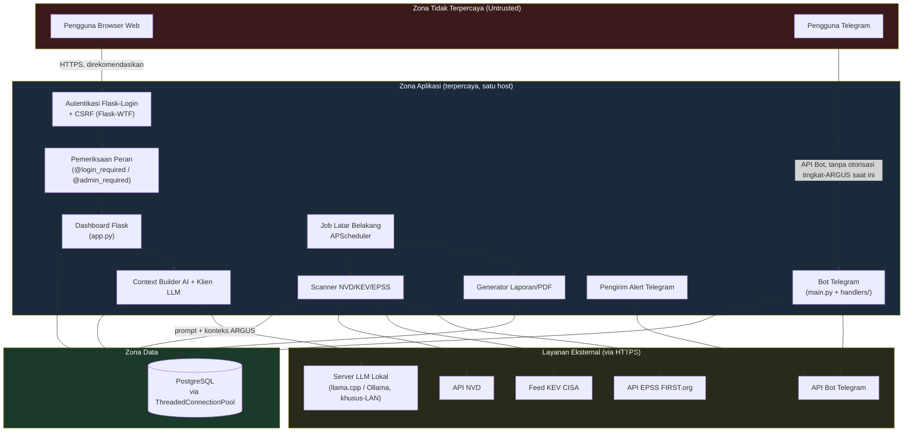
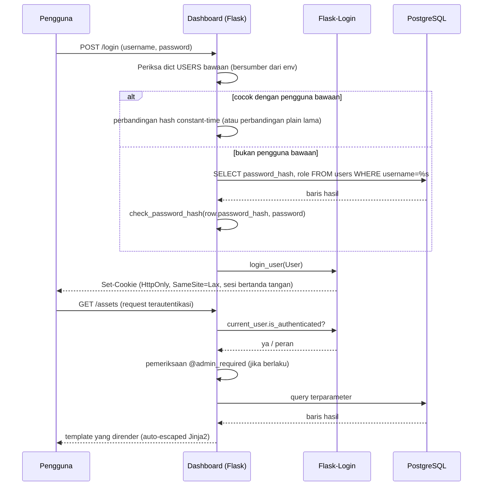
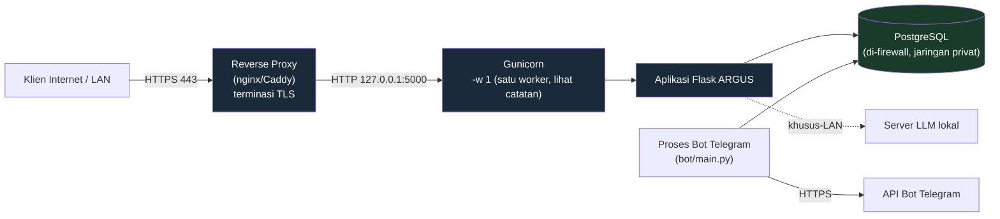

# Dokumentasi Keamanan ARGUS

🌐 [English](SECURITY.md) | [Indonesia](SECURITY.id.md)

> **Catatan akurasi.** Setiap kontrol yang dideskripsikan dalam dokumen ini telah diverifikasi secara langsung terhadap source code ARGUS (`bot/dashboard/app.py`, `bot/database/`, `bot/Ai/`, `bot/scanner/`, `bot/nvd/`, `bot/kev/`, `bot/jobs/`, `bot/main.py`, `bot/handlers/`, `bot/database/schema.sql`) per revisi ini. Kontrol yang sudah diimplementasikan, praktik yang direkomendasikan, dan peningkatan yang direncanakan/masa depan dibedakan secara eksplisit dan konsisten di seluruh dokumen. Tidak ada satu pun di bawah ini yang mengklaim perlindungan yang sebenarnya tidak ada dalam basis kode.

---

## Daftar Isi

1. [Pendahuluan](#1-pendahuluan)
2. [Filosofi Keamanan](#2-filosofi-keamanan)
3. [Arsitektur Keamanan](#3-arsitektur-keamanan)
4. [Model Ancaman](#4-model-ancaman)
5. [Autentikasi](#5-autentikasi)
6. [Otorisasi](#6-otorisasi)
7. [Keamanan Sesi](#7-keamanan-sesi)
8. [Validasi Input](#8-validasi-input)
9. [Keamanan AI](#9-keamanan-ai)
10. [Keamanan Basis Data](#10-keamanan-basis-data)
11. [Keamanan API Eksternal](#11-keamanan-api-eksternal)
12. [Keamanan Dashboard](#12-keamanan-dashboard)
13. [Keamanan Bot Telegram](#13-keamanan-bot-telegram)
14. [Keamanan Scanner](#14-keamanan-scanner)
15. [Keamanan Pelaporan](#15-keamanan-pelaporan)
16. [Keamanan Peringatan](#16-keamanan-peringatan)
17. [Keamanan Scheduler](#17-keamanan-scheduler)
18. [Manajemen Secrets](#18-manajemen-secrets)
19. [Logging & Audit](#19-logging--audit)
20. [Kriptografi](#20-kriptografi)
21. [Pengembangan Aman](#21-pengembangan-aman)
22. [Keamanan Infrastruktur](#22-keamanan-infrastruktur)
23. [Keamanan Backup & Recovery](#23-keamanan-backup--recovery)
24. [Respons Insiden](#24-respons-insiden)
25. [Manajemen Kerentanan (ARGUS Itu Sendiri)](#25-manajemen-kerentanan-argus-itu-sendiri)
26. [Pertimbangan Kepatuhan](#26-pertimbangan-kepatuhan)
27. [Praktik Terbaik Keamanan untuk Operator](#27-praktik-terbaik-keamanan-untuk-operator)
28. [Keterbatasan yang Diketahui](#28-keterbatasan-yang-diketahui)
29. [Roadmap Keamanan Masa Depan](#29-roadmap-keamanan-masa-depan)
30. [Pelaporan Keamanan](#30-pelaporan-keamanan)
31. [Referensi Silang](#31-referensi-silang)

---

## 1. Pendahuluan

### Tujuan

Dokumen ini adalah referensi keamanan otoritatif untuk ARGUS, platform manajemen kerentanan Flask/PostgreSQL dengan bot Telegram pendamping dan asisten LLM lokal. Dokumen ini ada agar operator, kontributor, auditor, dan peninjau enterprise dapat memahami postur keamanan ARGUS **tanpa membaca source code**.

### Cakupan

Dokumen ini mencakup dashboard Flask, lapisan data PostgreSQL, bot Telegram, subsistem AI lokal (chat berbasis llama.cpp/Ollama dengan injeksi konteks bergaya-RAG), scanner NVD/KEV/EPSS, mesin pelaporan dan peringatan, serta scheduler latar belakang, sebagaimana di-deploy oleh satu operator/organisasi pada satu host (arsitektur yang saat ini diimplementasikan ARGUS — lihat [§28](#28-keterbatasan-yang-diketahui)).

### Audiens yang Dituju

Analis keamanan dan tim SOC yang mengoperasikan ARGUS, administrator sistem yang men-deploy-nya, kontributor yang mengembangkannya, serta peninjau/auditor keamanan yang mengevaluasinya untuk adopsi.

### Hubungan dengan Dokumentasi Lain

Dokumen ini berfokus pada keamanan dan secara sengaja tidak mengulang langkah instalasi, panduan fitur, atau arsitektur umum yang sudah dibahas dalam `docs/INSTALL.md`, `docs/ARCHITECTURE.md`, dan `docs/README.md`. Di mana dokumen-dokumen tersebut memuat detail yang relevan dengan keamanan (misalnya, persyaratan variabel lingkungan, topologi deployment), dokumen ini merujuk dan membangun di atasnya alih-alih menduplikasinya.

### Keamanan adalah Proses Berkelanjutan

Postur keamanan ARGUS adalah fungsi baik dari kode yang dirilis maupun cara kode tersebut di-deploy dan dioperasikan. Dokumen ini mendeskripsikan apa yang **dilakukan** ARGUS per revisi ini; dokumen ini tidak menggantikan kedisiplinan patching, monitoring, dan konfigurasi operator sendiri yang dideskripsikan di [§27](#27-praktik-terbaik-keamanan-untuk-operator).

---

## 2. Filosofi Keamanan

| Prinsip | Cara penerapannya pada ARGUS |
|---|---|
| **Aman secara default (di mana ditegakkan)** | ARGUS menolak untuk berjalan tanpa `SECRET_KEY` atau `DB_PASSWORD` yang dikonfigurasi (`app.py`, `database/db.py`), alih-alih jatuh ke default yang tidak aman untuk kedua nilai tersebut. |
| **Least privilege (hak akses minimal)** | Perlindungan route berbasis peran (`@login_required`, `@admin_required`) membatasi tindakan destruktif dan administratif (pembuatan/pengeditan/penghapusan aset, penugasan patch-plan, pembuatan laporan) hanya untuk peran `admin`. |
| **Defense in depth (pertahanan berlapis)** | Autentikasi, pengerasan cookie sesi, perlindungan CSRF, SQL terparameter, dan output-encoding via auto-escaping Jinja2 dilapiskan alih-alih diandalkan secara individual. |
| **Fail secure (gagal secara aman)** | Autentikasi yang gagal mengembalikan error generik alih-alih membedakan "pengguna tidak ada" dari "kata sandi salah"; token CSRF yang hilang/tidak valid menolak request; error basis data ditangkap dan di-rollback alih-alih dibiarkan dalam state transaksi yang tidak menentu. |
| **Validasi input** | Allowlist sisi-server membatasi field tipe aset, exposure, function, dan kota/negara (`config/locations.py`, `database/assets.py`) apa pun yang dikirimkan klien. |
| **Least knowledge / need to know** | Asisten AI diinstruksikan untuk menjawab hanya dari data yang disediakan ARGUS untuk query saat ini, bukan dari state percakapan yang tidak terkait atau informasi yang dikarang (`Ai/prompts.py`, system prompt `/api/chat`). |
| **Privacy by design** | Data lokasi tingkat-kota yang digunakan untuk peta exposure dibatasi pada granularitas centroid-kota secara desain (`config/locations.py`) — tidak ada presisi GPS per-aset atau tingkat-bangunan di mana pun dalam skema. |
| **Keamanan AI** | Subsistem AI dibatasi pada system prompt tetap yang tidak dapat diedit, dibatasi hanya pada view basis data read-only, dan secara eksplisit diinstruksikan untuk tidak mengungkap system prompt-nya sendiri atau mengarang analisis yang telah selesai (lihat [§9](#9-keamanan-ai)). |
| **Keamanan operasional** | Secrets bersumber secara eksklusif dari variabel lingkungan (`.env`, di-git-ignore), tidak pernah di-hardcode dalam logika aplikasi. |

Prinsip-prinsip ini mendeskripsikan niat desain yang **secara substansial, tetapi tidak universal,** terwujud dalam basis kode saat ini — penyimpangan disebutkan secara eksplisit di [§28](#28-keterbatasan-yang-diketahui) alih-alih ditutupi.

---

## 3. Arsitektur Keamanan

### 3.1 Ikhtisar Komponen / Trust Boundary

**Catatan trust boundary:**

- **Batas pengguna-web** dimediasi oleh autentikasi Flask-Login, pemeriksaan peran, dan perlindungan CSRF.
- **Batas pengguna-Telegram** saat ini **tidak memiliki lapisan otorisasi tingkat-ARGUS** sendiri — lihat [§13](#13-keamanan-bot-telegram) dan [§28](#28-keterbatasan-yang-diketahui). Siapa pun yang dapat mengirim pesan ke bot dapat memanggil perintah terdaftar apa pun.
- **Batas basis data** hanya pernah dicapai melalui connection pool (`database/db.py`) dan query terparameter — kode aplikasi tidak pernah mengonstruksi connection string mentah dari input request.
- **Batas LLM** adalah endpoint HTTP polos yang tidak terautentikasi pada jaringan lokal (default `http://192.168.0.26:8080/v1/chat/completions`, dapat di-override via `LLM_URL`). Ini diperlakukan sebagai komponen internal yang terpercaya, bukan sebagai infrastruktur eksternal yang tidak terpercaya — lihat [§9](#9-keamanan-ai) untuk implikasinya.
- **Batas API eksternal** (NVD, KEV, EPSS, Telegram) hanya dicapai melalui HTTPS menggunakan objek `requests.Session` yang di-pool dengan verifikasi sertifikat TLS default (tidak pernah dinonaktifkan dalam basis kode).

### 3.2 Alur Autentikasi → Otorisasi → Data

---

## 4. Model Ancaman

### 4.1 Aset yang Dilindungi

- Kredensial pengguna (akun bawaan dan akun berbasis basis data)
- Inventaris aset (vendor/produk/versi, lokasi, kekritisan, kepemilikan)
- Data kerentanan dan risiko (kecocokan CVE/CVSS/KEV/EPSS, skor risiko, rencana patch)
- Riwayat percakapan AI (per-pengguna, disimpan di PostgreSQL)
- Laporan yang dihasilkan (file PDF di bawah `bot/dashboard/generated_reports/`)
- Secrets: `SECRET_KEY`, `DB_PASSWORD`, `TOKEN` Telegram, `NVD_API_KEY`, `ADMIN_PASSWORD`/`VIEWER_PASSWORD`
- Ketersediaan pipeline pemindaian, pelaporan, dan peringatan

### 4.2 Pelaku Ancaman

- Penyerang eksternal yang tidak terautentikasi yang menyelidiki dashboard melalui jaringan
- Pengguna berprivilese-rendah (`viewer`) yang terautentikasi yang mencoba eskalasi privilese
- Pengguna Telegram mana pun yang dapat menjangkau bot (tidak ada allowlist yang ditegakkan saat ini — lihat [§13](#13-keamanan-bot-telegram))
- Data upstream yang dikompromikan atau berbahaya (respons NVD/KEV/EPSS yang diracuni, atau jawaban adversarial dari LLM)
- Operator yang salah mengonfigurasi secrets atau mengekspos layanan langsung ke internet

### 4.3 Titik Masuk (Entry Points)

- `/login`, `/register` (publik, tidak terautentikasi)
- Semua route dashboard `@login_required` (assets, findings, reports, charts, AI chat, patch plans)
- Semua route `@admin_required` (CRUD aset, pembuatan laporan, digest "today" status, toggle status patch)
- Kumpulan perintah bot Telegram (`/add`, `/asset`, `/rm`, `/edit`, `/cve`, `/scan`, `/status`, `/findings`, `/report`, `/today`, `/help`, `/start`)
- Panggilan outbound ke NVD, CISA KEV, FIRST.org EPSS, API Bot Telegram, dan server LLM lokal

### 4.4 Ringkasan STRIDE

| Kategori Ancaman | Permukaan yang Relevan | Mitigasi yang Diimplementasikan |
|---|---|---|
| **Spoofing** | Form login | Hashing kata sandi (`werkzeug.security`), cookie sesi Flask-Login yang ditandatangani dengan `SECRET_KEY` |
| **Tampering** | Form, body AJAX, penulisan basis data | Token CSRF Flask-WTF pada request yang mengubah state; validasi allowlist sisi-server (tipe/exposure/function/lokasi aset); SQL terparameter 100% |
| **Repudiation** | Tindakan administratif | Logging aplikasi via modul `logging` Python mencatat kegagalan dan operasi kunci; **belum ada tabel jejak audit khusus yang dapat di-query saat ini** — lihat [§19](#19-logging--audit) dan [§28](#28-keterbatasan-yang-diketahui) |
| **Information Disclosure** | Unduhan laporan, endpoint API, halaman error | Pemeriksaan containment-path pada unduhan laporan; pemeriksaan peran pada route sensitif; respons error Flask generik menggantikan traceback mentah dalam produksi (direkomendasikan `debug=False`, lihat [§22](#22-keamanan-infrastruktur)) |
| **Denial of Service** | Panggilan NVD/KEV/EPSS, panggilan LLM, konkurensi scanner | Konkurensi scan dibatasi `asyncio.Semaphore`, retry/backoff HTTP yang menghormati `Retry-After`, timeout request pada setiap panggilan HTTP outbound, connection pooling basis data dengan ukuran maksimum terbatas |
| **Elevation of Privilege** | Tindakan `viewer` → `admin` | Setiap route destruktif/administratif dibungkus dalam `@admin_required`, diperiksa setelah `@login_required`; akun yang mendaftar sendiri default ke peran `viewer` di tingkat basis data (`role TEXT NOT NULL DEFAULT 'viewer'`) |

---

## 5. Autentikasi

### 5.1 Jenis Akun

ARGUS mendukung dua sumber autentikasi paralel, diperiksa dalam urutan ini pada `/login`:

1. **Akun bawaan** — akun `admin` dan `viewer` yang didefinisikan in-process dari variabel lingkungan (`ADMIN_PASSWORD`, `VIEWER_PASSWORD`). Ini mendukung baik kata sandi variabel-lingkungan biasa (jalur lama/legacy) atau nilai pra-hash berawalan `pbkdf2:`, dibandingkan dengan `werkzeug.security.check_password_hash`.
2. **Akun basis data** — baris dalam tabel `users` (`username`, `password_hash`, `role`), dibuat via `/register` swalayan. Kata sandi di-hash dengan `werkzeug.security.generate_password_hash` (PBKDF2) sebelum disimpan; kata sandi plaintext tidak pernah dipersistensikan.

### 5.2 Penyimpanan Kata Sandi

- Akun berbasis basis data: hashing kata sandi PBKDF2 via Werkzeug (`generate_password_hash` / `check_password_hash`), yang secara internal menerapkan salt per-kata-sandi.
- Akun bawaan: kata sandi bersumber dari variabel lingkungan dan dapat berupa string biasa atau ter-hash-PBKDF2; perbandingan menggunakan `check_password_hash` ketika nilai yang disimpan berawalan `pbkdf2:`, dan perbandingan string langsung selain itu.

**Detail yang signifikan secara operasional:** akun bawaan `admin` jatuh kembali (fallback) ke kata sandi literal `admin` jika `ADMIN_PASSWORD` tidak diset dalam lingkungan. Ini adalah default yang lemah dan **harus** di-override di setiap deployment nyata — lihat [§27](#27-praktik-terbaik-keamanan-untuk-operator) dan [§28](#28-keterbatasan-yang-diketahui). Akun bawaan `viewer` tidak memiliki fallback semacam itu; jika `VIEWER_PASSWORD` tidak diset, login sebagai `viewer` secara efektif tidak dapat digunakan (nilai yang disimpan adalah `None`, yang tidak dapat cocok dengan kata sandi yang dikirimkan).

### 5.3 Pembuatan & Siklus Hidup Sesi

- Sesi dibuat via `flask_login.login_user()` saat autentikasi berhasil dan ditandatangani menggunakan `SECRET_KEY` Flask.
- `PERMANENT_SESSION_LIFETIME` dikonfigurasi menjadi 8 jam.
- Sesi dihancurkan via route `/logout` yang eksplisit, khusus-`POST`, `@login_required` (melindungi logout itu sendiri dari forced-logout yang digerakkan CSRF, dan mencegah logout via tautan sederhana yang tidak terautentikasi).

### 5.4 Registrasi

- `/register` bersifat publik dan tidak terautentikasi (secara desain, untuk memungkinkan pembuatan akun `viewer` swalayan).
- Akun baru selalu dibuat dengan peran default skema yaitu `viewer`; tidak ada cara bagi akun yang mendaftar sendiri untuk mendapatkan `admin` melalui alur registrasi itu sendiri. Promosi ke `admin` memerlukan akses basis data langsung.
- Username duplikat ditolak dengan error generik.

### 5.5 Manajemen Mandiri Akun

- `/profile` memungkinkan pengguna yang login mengubah kata sandi atau username mereka, masing-masing dijaga oleh pengetikan ulang kata sandi saat ini.
- `/delete_account` mengizinkan penghapusan akun swalayan, juga dijaga oleh konfirmasi kata sandi.

### 5.6 Belum Diimplementasikan Saat Ini (Direncanakan)

- **Autentikasi Multi-Faktor (MFA)** — Direncanakan. Belum ada dalam basis kode saat ini.
- **Reset kata sandi swalayan (misalnya, berbasis email)** — Direncanakan. Belum ada alur email/reset-token.
- **Autentikasi enterprise (SSO/OAuth2/OIDC/LDAP/SAML)** — Direncanakan. Semua autentikasi saat ini bersifat lokal terhadap dict `USERS` dan tabel `users` milik ARGUS sendiri.
- **Penguncian akun / throttling brute-force pada `/login`** — Belum diimplementasikan. Lihat [§28](#28-keterbatasan-yang-diketahui).

---

## 6. Otorisasi

### 6.1 Model

ARGUS mengimplementasikan model RBAC dua-peran yang sederhana, ditegakkan melalui dua dekorator:

- `@login_required` (Flask-Login) — memerlukan sesi terautentikasi apa pun.
- `@admin_required` (dekorator kustom di `app.py`) — memerlukan `current_user.role == "admin"`, selalu diterapkan **setelah** `@login_required` pada route yang membutuhkannya, dan mengembalikan HTTP 403 jika tidak.

| Peran | Deskripsi |
|---|---|
| `admin` | Akses penuh: CRUD aset, penugasan patch-plan, pembuatan laporan, digest eksekutif `/today`, toggle status patched, ditambah semua yang dapat dilakukan `viewer`. |
| `viewer` | Akses baca/interaksi: dashboard, aset (baca), findings (baca), grafik, chat AI, pencarian, catatan patch-plan (lihat di bawah), manajemen mandiri profil. |

### 6.2 Matriks Izin (route sebagaimana diimplementasikan)

| Kapabilitas | Route | Peran yang Diperlukan |
|---|---|---|
| Lihat dashboard, findings, assets, charts, search | `/dashboard`, `/findings`, `/assets`, `/charts`, `/search`, `/asset/<id>`, `/finding/<cve_id>` | `login_required` (pengguna terautentikasi apa pun) |
| Chat AI, manajemen percakapan | `/api/chat`, `/api/conversations*` | `login_required` |
| Perbarui status finding | `/finding/update_status` | `login_required` |
| Perbarui penugasan finding (owner/team) | `/finding/update_assignment` | `login_required` + `admin_required` |
| Perbarui catatan/tanggal rencana patch | `/finding/update_patch_plan` | `login_required` **saja** (sengaja tidak dijaga-admin — lihat docstring route di `app.py`; analis diharapkan menjaga catatan patch-plan tanpa perlu hak admin) |
| Lihat halaman rencana patch | `/patch_plan` | `login_required` |
| Buat/edit/hapus aset | `/add_asset`, `/edit_asset/<id>`, `/delete_asset/<id>` | `login_required` + `admin_required` |
| Toggle status patched | `/toggle_patched/<asset_id>/<cve_id>` | `login_required` + `admin_required` |
| Buat laporan | `/generate_report/<type>` | `login_required` + `admin_required` |
| Digest eksekutif "today" (push Telegram) | `/today` | `login_required` + `admin_required` |
| Unduh laporan yang dihasilkan | `/download/<report_id>` | `login_required` (tidak dijaga-admin; pengguna terautentikasi mana pun dapat mengunduh laporan mana pun yang dihasilkan) |
| Manajemen mandiri profil | `/profile`, `/delete_account` | `login_required` (bertindak hanya pada `current_user`) |
| Login / Register / halaman landing | `/login`, `/register`, `/`, `/features`, `/basics`, `/docs` | Publik |
| Perintah bot Telegram | `/add`, `/asset`, `/rm`, `/edit`, `/cve`, `/scan`, `/status`, `/findings`, `/report`, `/today` | **Tanpa pemeriksaan peran saat ini** — lihat [§13](#13-keamanan-bot-telegram) |

### 6.3 Peran Kustom Masa Depan (Direncanakan)

Sistem izin yang lebih granular per-kapabilitas (melampaui `admin`/`viewer`) belum diimplementasikan saat ini dan merupakan peningkatan yang direncanakan — lihat [§29](#29-roadmap-keamanan-masa-depan).

---

## 7. Keamanan Sesi

| Kontrol | Status | Detail |
|---|---|---|
| `SESSION_COOKIE_HTTPONLY` | **Diimplementasikan** | `True` — cookie tidak dapat diakses oleh JavaScript, memitigasi pencurian sesi via XSS. |
| `SESSION_COOKIE_SAMESITE` | **Diimplementasikan** | `"Lax"` — memitigasi cross-site request forgery via navigasi lintas-origin tingkat-atas. |
| `SESSION_COOKIE_SECURE` | **Diimplementasikan, tetapi default mati** | Diset ke `False` dalam konfigurasi `app.py` yang dirilis, secara eksplisit dikomentari sebagai dimaksudkan hanya untuk pengujian HTTP lokal/LAN. **Operator harus mengeset ini ke `True`** begitu ARGUS disajikan melalui HTTPS — lihat [§22](#22-keamanan-infrastruktur) dan [§27](#27-praktik-terbaik-keamanan-untuk-operator). |
| Perlindungan CSRF | **Diimplementasikan** | `CSRFProtect` milik Flask-WTF diinisialisasi secara global terhadap app (`csrf = CSRFProtect(app)`), tanpa route yang dikecualikan dalam basis kode. |
| Kedaluwarsa sesi | **Diimplementasikan** | `PERMANENT_SESSION_LIFETIME = timedelta(hours=8)`. |
| Logout | **Diimplementasikan** | Route khusus-`POST`, `@login_required`; dilindungi-CSRF seperti endpoint pengubah-state lainnya. |
| Pencegahan session fixation | **Diimplementasikan (via framework)** | Flask-Login menerbitkan identifier sesi baru pada `login_user()`, yang merupakan mitigasi standar Flask/Flask-Login untuk session fixation. |
| Rotasi sesi saat perubahan privilese | Tidak berlaku saat ini | Peran tidak berubah di tengah sesi dalam desain saat ini (peran ditetapkan pada saat login dari dict `USERS` atau tabel `users`). |
| Idle timeout terpisah dari timeout absolut | Belum diimplementasikan | Hanya `PERMANENT_SESSION_LIFETIME` absolut 8-jam tunggal yang berlaku; tidak ada mekanisme idle-timeout terpisah yang lebih singkat. |
| Penyimpanan sesi terdistribusi/bersama (misalnya, Redis) | **Direncanakan** | Sesi saat ini adalah sesi cookie-bertanda-tangan default milik Flask; lihat [§29](#29-roadmap-keamanan-masa-depan). |

---

## 8. Validasi Input

ARGUS memvalidasi input pada beberapa lapisan alih-alih mengandalkan satu titik-pemeriksaan tunggal:

- **Enumerasi allowlist.** `type`, `exposure`, dan `function` aset diperiksa terhadap set valid eksplisit (`VALID_TYPES`, `VALID_EXPOSURES`, `VALID_FUNCTIONS` di `database/assets.py`); nilai apa pun di luar allowlist dipaksa (coerced) menjadi default yang aman (`"Unknown"`, `"Internal"`, atau `None`) alih-alih disimpan apa adanya.
- **Allowlisting lokasi.** `config/locations.py` menjaga frozenset pasangan `(country_code, city)` yang valid (`_VALID_COUNTRY_CITY_PAIRS`), dibangun sekali saat import-time dan digunakan oleh `is_valid_city()` pada setiap jalur request yang menerima input lokasi (`/assets`, `/findings`, `/add_asset`, `/edit_asset`). Kombinasi yang tidak valid diam-diam diset ulang ke `None` alih-alih disimpan.
- **SQL terparameter di mana-mana.** Setiap panggilan basis data dalam basis kode menggunakan placeholder `%s` dengan parameter binding psycopg2. Satu-satunya tempat string query dirakit secara dinamis (`UPDATE assets SET {...}` milik `database/assets.py`) hanya menyisipkan **nama kolom yang di-hardcode** yang dipilih oleh logika aplikasi, tidak pernah teks yang disediakan pengguna — nilai itu sendiri tetap sepenuhnya terparameter.
- **Parameter numerik/path.** Konverter route Flask (`<int:asset_id>`, `<int:report_id>`, `<int:conversation_id>`) menolak input non-numerik di tingkat routing sebelum fungsi view mana pun pernah dieksekusi.
- **Output encoding.** Semua template dashboard dirender melalui Jinja2, yang meng-HTML-escape variabel secara default, memitigasi XSS reflected/stored dari nama aset, catatan, dan field bebas-teks lain yang dirender kembali ke halaman.
- **Containment path laporan.** `/download/<report_id>` me-resolve path file yang disimpan dan memverifikasi bahwa path tersebut berada di bawah `REPORTS_DIR` aplikasi sebelum menyajikannya, menolak apa pun di luar direktori tersebut dengan HTTP 403.
- **Input perintah Telegram.** Handler mem-parsing argumen terstruktur (vendor/produk/versi, ID CVE) sebelum meneruskannya ke fungsi basis data tervalidasi yang sama yang digunakan dashboard — ada satu jalur validasi bersama yang konsisten (`database/assets.py`, `nvd/matching.py`) terlepas dari apakah request berasal dari dashboard atau bot.
- **Input prompt AI.** Pesan chat pengguna tidak dievaluasi sebagai kode atau perintah; pesan tersebut dimasukkan ke dalam struktur percakapan tetap yang dikirim ke LLM, dan konteks yang disuntikkan bersamanya dibangun secara eksklusif dari view basis data ARGUS sendiri (lihat [§9](#9-keamanan-ai)).

### Belum Diimplementasikan (Direncanakan)

- Validasi request terstruktur (misalnya, library validasi-skema seperti `pydantic` atau `marshmallow`) di batas API — validasi saat ini ditulis-tangan per field. Tidak ada celah fungsional yang teridentifikasi dari ini, tetapi pendekatan berbasis-skema adalah langkah pengerasan yang direncanakan.
- Penanganan unggahan file — ARGUS saat ini tidak menerima unggahan file pengguna di mana pun dalam dashboard (`MAX_CONTENT_LENGTH` 16 MB dikonfigurasi secara defensif, tetapi tidak ada route unggahan yang dapat dijangkau olehnya).

---

## 9. Keamanan AI

Asisten AI ARGUS (`/api/chat`) mengirim system prompt ditambah konteks bersumber-ARGUS ke LLM yang di-hosting secara lokal (endpoint kompatibel-OpenAI milik llama.cpp atau Ollama). Bagian ini mendokumentasikan apa yang dimitigasi dan tidak dimitigasi dalam pipeline tersebut.

### 9.1 Prompt Injection

- **Prompt injection langsung** (pengguna mengetik "abaikan instruksimu") sebagian dimitigasi oleh system prompt yang eksplisit dan diperkeras (`Ai/prompts.py` dan system prompt inline dalam `/api/chat` milik `app.py`) yang menginstruksikan model untuk tidak pernah mengungkap system prompt atau fungsi internalnya sendiri, untuk menjawab hanya dari data ARGUS yang disediakan, dan untuk menyatakan hal itu secara eksplisit ketika data tidak tersedia alih-alih mengarang jawaban. Ini adalah mitigasi tingkat-prompt, bukan kontrol teknis yang keras — pesan pengguna yang cukup adversarial masih dapat memengaruhi perilaku model, karena LLM yang mendasarinya tidak memiliki batas privilese terpisah antara teks "system" dan "user" di luar apa yang dihormati model itu sendiri.
- **Prompt injection tidak langsung** (konten berbahaya yang mencapai model melalui data tersimpan — misalnya, field `notes` bebas-teks aset, atau deskripsi CVE) adalah risiko residual: context builder mengambil dari data ARGUS nyata (findings terbuka, ringkasan aset, findings KEV/overdue) tanpa langkah sanitisasi khusus untuk payload prompt-injection yang tertanam dalam teks tersimpan tersebut. Operator mana pun yang mengizinkan pihak ketiga yang tidak dipercaya untuk menulis catatan aset, owner, atau field bebas-teks serupa sebaiknya menyadari bahwa context builder AI akan menyertakan teks tersebut secara verbatim dalam prompt yang dikirim ke LLM.
- **Postur mitigasi:** karena LLM bersifat lokal (bukan layanan pihak-ketiga yang dapat menyimpan atau menyalahgunakan data), radius ledakan (blast radius) dari injeksi yang berhasil dibatasi pada akurasi/kepercayaan jawaban chat AI itu sendiri dalam satu percakapan pengguna — ini bukan jalur menuju eksekusi kode sisi-server, karena output LLM dikembalikan ke browser sebagai teks chat dan dirender, bukan dieksekusi.

### 9.2 Kebocoran Prompt / Data

- System prompt secara eksplisit menginstruksikan model untuk tidak pernah mengungkap system prompt-nya sendiri atau nama fungsi internal.
- AI diinstruksikan untuk menjawab secara ketat dari data ARGUS yang disediakan untuk query spesifik tersebut dan untuk menyatakan "Informasi tidak tersedia dalam ARGUS" alih-alih mengisi celah dari pengetahuan pelatihan umumnya sendiri tentang suatu CVE — mengurangi risiko model menyajikan detail kerentanan yang tidak terverifikasi dan berhalusinasi sebagai temuan ARGUS yang otoritatif.
- Riwayat percakapan disimpan per-pengguna dalam PostgreSQL (`database/conversations.py`) dan hanya dapat diambil melalui route `@login_required` yang dibatasi pada `current_user.username` — satu pengguna tidak dapat membaca riwayat percakapan AI pengguna lain melalui endpoint `/api/conversations`.

### 9.3 Risiko Halusinasi

- Secara eksplisit ditangani dalam system prompt: model diberi tahu untuk tidak mengklaim bahwa suatu CVE "telah dianalisis oleh ARGUS AI" kecuali blok analisis yang selesai benar-benar ada dalam konteks yang disediakan, dan untuk menggunakan frasa pasti "ARGUS belum menyelesaikan dan menyimpan analisis AI latar belakang untuk CVE ini" ketika itulah kondisinya — mitigasi langsung terhadap model yang mengarang analisis selesai yang tidak ada.
- Meskipun ada lapisan instruksi ini, output LLM **tidak deterministik atau diverifikasi secara independen**; ARGUS saat ini tidak melakukan cross-check panduan remediasi atau penjelasan CVE yang dihasilkan AI terhadap sumber ground-truth sebelum menampilkannya ke pengguna. Analis sebaiknya memperlakukan jawaban chat AI sebagai bersifat membantu (assistive), bukan otoritatif — lihat [§27](#27-praktik-terbaik-keamanan-untuk-operator).

### 9.4 Jendela Konteks / Pembatasan Data

- Context builder (`Ai/context_builder.py`) mengambil dari sekumpulan kecil query SQL terparameter yang tetap (`Ai/queries.py`) — temuan terbuka teratas (dibatasi 20 baris), statistik agregat dashboard (1 baris), ringkasan aset spesifik (berdasarkan ID), aset teratas berdasarkan jumlah temuan (dibatasi 10), temuan KEV (dibatasi 20), dan temuan overdue (dibatasi 20). Klausa `LIMIT` ini membatasi berapa banyak data — dan karenanya seberapa besar prompt — yang dapat dihasilkan satu query mana pun, yang juga membatasi kemampuan AI untuk digunakan sebagai kanal eksfiltrasi data tabel-penuh tidak langsung melalui antarmuka chat.
- Caching respons (`database/chat_cache.py`) diberi kunci berdasarkan `(question, argus_context)`, sehingga jawaban yang di-cache tidak akan pernah disajikan setelah data ARGUS yang mendasarinya berubah — kebenaran cache terikat pada kesegaran data secara konstruksi.

### 9.5 Isolasi Percakapan

Setiap percakapan AI terikat pada `conversation_id` dan `current_user.username` yang terautentikasi; `get_conversation()` memverifikasi kepemilikan sebelum mengembalikan riwayat, dan ID percakapan yang usang/asing diperlakukan sebagai "mulai percakapan baru" alih-alih diam-diam dilampirkan ke thread pengguna lain.

### 9.6 Trust Boundary Model

Endpoint LLM (`LLM_URL`, default `http://192.168.0.26:8080/v1/chat/completions`) dipanggil melalui HTTP polos secara default, yang dapat diterima **hanya** karena dimaksudkan untuk berjalan pada LAN privat bersama host ARGUS. Operator yang memindahkan server LLM keluar dari jaringan lokal harus mengamankan kanal tersebut sendiri (segmentasi jaringan, TLS, atau reverse proxy yang terautentikasi) — klien LLM ARGUS tidak menambahkan autentikasi atau TLS ke panggilan tersebut.

### 9.7 Belum Diimplementasikan Saat Ini (Direncanakan)

- **Kontrol keamanan penyerapan dokumen RAG / pencarian vektor** — "RAG" ARGUS saat ini adalah injeksi konteks SQL terstruktur, bukan pengambilan dokumen tak terstruktur; jika penyerapan dokumen bebas-teks ditambahkan di masa depan, kontrol keamanan-konten dan provenance khusus akan diperlukan.
- **Tool-calling / eksekusi fungsi agentic oleh AI** — Belum diimplementasikan; AI hanya menjawab dengan teks berdasarkan konteks yang disediakan. Model keamanan tool-calling khusus direncanakan sebelum kapabilitas semacam itu dirilis (lihat [§29](#29-roadmap-keamanan-masa-depan)).
- **Keamanan multi-agen** — Tidak berlaku; ARGUS menjalankan satu persona asisten tunggal.
- **Firewall/classifier prompt-injection khusus** — Direncanakan; mitigasi saat ini hanya-instruksi-system-prompt, sebagaimana dideskripsikan di atas.

---

## 10. Keamanan Basis Data

- **SQL terparameter di seluruh sistem.** Setiap query dalam `database/*.py` dan route handler di `app.py` menggunakan placeholder `%s` dengan parameter binding psycopg2; tidak ada nilai bersumber-request yang pernah disisipkan ke dalam teks SQL. Injeksi SQL melalui input dashboard, API, atau Telegram mana pun belum teridentifikasi sebagai risiko mengingat pola ini.
- **Connection pooling.** `database/db.py` menggunakan `psycopg2.pool.ThreadedConnectionPool` (default 2–20 koneksi, dapat dikonfigurasi via `DB_POOL_MIN_CONN`/`DB_POOL_MAX_CONN`), menggantikan pola connect/disconnect per-query yang sebelumnya digunakan. Koneksi yang error atau ditinggalkan di tengah transaksi dibuang dari pool (`close=True`) alih-alih dikembalikan ke pool bersama dalam state buruk, mencegah satu transaksi gagal meracuni request berikutnya.
- **Penanganan kredensial.** `DB_PASSWORD` hanya dibaca dari lingkungan; tidak ada default hardcode, dan aplikasi mencatat peringatan (bukan nilainya sendiri) jika tidak diset.
- **Least privilege (tanggung jawab operator).** Kode ARGUS sendiri tidak membuat atau mengelola peran PostgreSQL; operator diharapkan menyediakan peran basis data khusus dan berprivilese-minimal untuk ARGUS alih-alih menggunakan akun superuser `postgres` PostgreSQL — lihat [§27](#27-praktik-terbaik-keamanan-untuk-operator).
- **Integritas referensial.** Foreign key (`matches.asset_id → assets.id ON DELETE CASCADE`, `matches.cve_id → cves.cve_id`) dan constraint `UNIQUE` ditegakkan di tingkat skema, mengurangi risiko data risiko yang yatim (orphan) atau terduplikasi.
- **Backup.** ARGUS tidak mengimplementasikan mekanisme backup-nya sendiri; ini adalah tanggung jawab operator menggunakan tooling PostgreSQL standar (`pg_dump`/pengarsipan WAL) — lihat [§23](#23-keamanan-backup--recovery).

### Belum Diimplementasikan Saat Ini (Direncanakan)

- **Row-Level Security (RLS)** — Tidak digunakan; semua pengguna terautentikasi berbagi tampilan data yang sama dari peran basis data yang sama (kontrol akses ditegakkan di tingkat aplikasi, bukan tingkat basis data).
- **Enkripsi saat disimpan (at rest)** — Belum diimplementasikan oleh ARGUS sendiri; bergantung pada konfigurasi enkripsi disk/deployment PostgreSQL yang mendasarinya, yang berada di luar kode ARGUS sendiri.
- **TLS koneksi basis data** — Tidak dikonfigurasi secara eksplisit dalam `DB_CONFIG`; jika basis data tidak berada pada host yang sama dengan aplikasi, operator sebaiknya mengonfigurasi `sslmode` sendiri via perilaku klien PostgreSQL/lingkungan atau jalur jaringan privat yang terpercaya.

---

## 11. Keamanan API Eksternal

| Integrasi | Status | Transport | Penanganan Kunci | Ketahanan (Resilience) |
|---|---|---|---|---|
| **NVD** | Diimplementasikan | HTTPS (`services.nvd.nist.gov`) | `NVD_API_KEY` opsional dari lingkungan; jatuh kembali ke request tidak terautentikasi (dibatasi laju lebih agresif) jika tidak diset | Exponential backoff pada HTTP 429/503, menghormati `Retry-After` (detik atau tanggal-HTTP), timeout request, jumlah retry terbatas |
| **CISA KEV** | Diimplementasikan | HTTPS (feed `cisa.gov`) | Tidak memerlukan kunci (feed publik) | Retry/backoff, cache lokal 24-jam dengan `invalidate_cache()`, timeout request |
| **FIRST.org EPSS** | Diimplementasikan | HTTPS (`api.first.org`) | Tidak memerlukan kunci (API publik) | Chunking batch, retry/backoff, timeout request |
| **API Bot Telegram** | Diimplementasikan | HTTPS (dikelola library, `python-telegram-bot`) | `TOKEN` bot dari lingkungan, diperlukan saat startup | Penanganan koneksi tingkat-library; error handler ARGUS sendiri menangkap dan melaporkan error basis data/tak terduga per update |
| **LLM Lokal (llama.cpp/Ollama)** | Diimplementasikan | HTTP polos secara default (asumsi desain khusus-LAN) | Tanpa kunci API secara default (self-hosted) | Timeout request tetap (120 detik), penanganan error-koneksi dengan pesan fallback "server AI sedang offline" yang ditampilkan ke pengguna |
| **OpenCVE** | **Belum diimplementasikan** | — | — | Dirujuk dalam dokumentasi proyek sebagai proyek ekosistem sumber-data, tetapi tidak ada klien, konfigurasi, atau jalur kode untuk itu di mana pun dalam basis kode. Rujukan apa pun terhadap OpenCVE sebagai integrasi ARGUS yang aktif mendeskripsikan aspirasi masa depan, bukan perilaku saat ini. |
| **Feed Threat Intelligence Masa Depan** | **Direncanakan** | — | — | Lihat [§29](#29-roadmap-keamanan-masa-depan). |

Semua klien HTTP yang diimplementasikan menggunakan objek `requests.Session` yang di-pool dengan verifikasi sertifikat TLS default (tidak pernah dinonaktifkan), timeout eksplisit pada setiap panggilan, dan hanya dipasang terhadap skema `https://` untuk feed data-CVE.

---

## 12. Keamanan Dashboard

| Kontrol | Status |
|---|---|
| Autentikasi (`flask-login`) | Diimplementasikan pada setiap route non-publik |
| Otorisasi (`@admin_required`) | Diimplementasikan pada route destruktif/administratif (lihat [§6](#6-otorisasi) untuk matriks lengkap) |
| Perlindungan CSRF | Diimplementasikan secara global via `CSRFProtect(app)` milik `Flask-WTF`, tanpa pengecualian tingkat-route dalam basis kode |
| Pencegahan XSS / escaping template | Diimplementasikan via auto-escaping default Jinja2 di seluruh template |
| `X-Content-Type-Options: nosniff` | Diimplementasikan (hook `after_request`) |
| `X-Frame-Options: DENY` | Diimplementasikan (hook `after_request`) — memitigasi clickjacking |
| `Referrer-Policy: strict-origin-when-cross-origin` | Diimplementasikan (hook `after_request`) |
| `Permissions-Policy` (kamera/mikrofon/geolokasi dinonaktifkan) | Diimplementasikan (hook `after_request`) |
| Content-Security-Policy (CSP) | **Belum diimplementasikan** — direncanakan, lihat [§29](#29-roadmap-keamanan-masa-depan) |
| `Strict-Transport-Security` (HSTS) | **Belum diimplementasikan dalam kode aplikasi** — diharapkan diset di lapisan reverse-proxy begitu di-deploy di belakang HTTPS (lihat [§22](#22-keamanan-infrastruktur)) |
| Halaman error kustom (menyembunyikan stack trace) | Bergantung pada `debug=False` dalam produksi (tanggung jawab operator/deployment — lihat [§22](#22-keamanan-infrastruktur)); perilaku default Flask dengan `debug=True` akan mengekspos traceback dan tidak boleh digunakan dalam produksi |
| Kontrol akses laporan | `/download/<report_id>` bersifat `@login_required` dan diperiksa containment-path (lihat [§8](#8-validasi-input)); ini **bukan** `@admin_required`, sehingga pengguna terautentikasi mana pun dapat mengunduh laporan mana pun yang dihasilkan |

---

## 13. Keamanan Bot Telegram

- **Perlindungan token bot.** `TOKEN` Telegram hanya dibaca dari lingkungan (`.env`, di-git-ignore) dan tidak pernah dicatat log atau di-hardcode; bot menolak untuk berjalan tanpanya.
- **Permukaan perintah.** Bot mendaftarkan sekumpulan perintah slash yang tetap (`/add`, `/asset`, `/rm`, `/edit`, `/cve`, `/scan`, `/status`, `/findings`, `/report`, `/today`, `/help`, `/start`) yang dipetakan langsung ke fungsi handler di `bot/handlers/`.
- **Otorisasi — celah saat ini.** Sebagaimana diimplementasikan, **tidak ada satu pun handler perintah Telegram yang memeriksa chat ID, user ID pengirim, atau allowlist apa pun sebelum dieksekusi.** Tidak ada pemeriksaan `is_admin`/`authorized` di mana pun dalam `bot/handlers/` atau `bot/main.py`. Ini berarti pengguna Telegram mana pun yang dapat mengirim pesan ke bot (atau yang ditambahkan ke grup tempat bot berada, bergantung pada pengaturan privasi bot) saat ini dapat mengeksekusi setiap perintah terdaftar, termasuk pembuatan/penghapusan aset (`/add`, `/rm`, `/edit`) dan memicu pemindaian (`/scan`). **Ini adalah celah paling signifikan yang terdokumentasi dalam file ini** dan diperlakukan sebagai keterbatasan yang diketahui alih-alih ditutupi — lihat [§28](#28-keterbatasan-yang-diketahui) dan [§27](#27-praktik-terbaik-keamanan-untuk-operator) untuk mitigasi tingkat-operator yang tersedia saat ini (membatasi siapa yang dapat menjangkau bot via pengaturan privasi/grup Telegram sendiri dan dengan tidak mempublikasikan username bot).
- **Penanganan error.** Error handler global (`main.py`) menangkap `psycopg2.OperationalError`, subclass `psycopg2.Error` lainnya, dan exception tak terduga per update, mencatat traceback lengkap di sisi server dan membalas pengguna dengan pesan error terbatas alih-alih meng-crash proses bot.
- **Rate limiting.** Tidak ada rate limiting khusus-ARGUS yang diterapkan pada perintah Telegram; bot bergantung pada perilaku polling `python-telegram-bot` sendiri dan batas laju tingkat-platform Telegram.

### Belum Diimplementasikan Saat Ini (Direncanakan)

- Pemeriksaan otorisasi peran/chat-ID per-perintah — **direncanakan dan direkomendasikan sebagai peningkatan keamanan prioritas-tertinggi untuk bot** (lihat [§29](#29-roadmap-keamanan-masa-depan)).
- Diferensiasi private-vs-group-chat untuk perintah sensitif.
- Audit logging siapa yang mengeluarkan perintah Telegram mana.

---

## 14. Keamanan Scanner

- **Konkurensi terbatas.** `scan_all_assets()` menggunakan `asyncio.Semaphore` untuk membatasi berapa banyak aset yang dipindai terhadap NVD secara bersamaan, mencegah scanner membanjiri baik API NVD maupun proses lokal dengan request paralel tak terbatas.
- **Batasan sumber daya.** Setiap panggilan HTTP outbound dalam jalur scanner memiliki timeout eksplisit; pencarian EPSS di-batch dalam beberapa chunk alih-alih dikeluarkan satu CVE dalam satu waktu.
- **Pencocokan aman.** Logika pencocokan CVE-ke-aset (`nvd/matching.py`) dibagikan antara dashboard, perintah Telegram `/cve`, dan scanner, sehingga ada satu implementasi pencocokan yang tervalidasi secara konsisten alih-alih logika yang berbeda per-entry-point.
- **Isolasi kegagalan.** Kegagalan pemindaian per-aset ditangkap secara individual (`_safe_scan`) sehingga kegagalan pemindaian satu aset tidak membatalkan seluruh batch scan.
- **Keamanan jaringan.** Semua panggilan HTTP scanner menargetkan hostname yang tetap dan diketahui baik (NVD, KEV, EPSS) — scanner tidak mengonstruksi URL dari data aset yang disediakan pengguna.

### Belum Diimplementasikan Saat Ini (Direncanakan)

- **Sandboxing proses scan itu sendiri** — scanner berjalan in-process bersama sisa aplikasi; scanner tidak melakukan pemindaian jaringan aktif terhadap infrastruktur aset (scanner mencocokkan string vendor/produk/versi yang diketahui terhadap data CVE publik, sehingga tidak memerlukan sandboxing seperti scanner jaringan aktif), tetapi model isolasi proses/sandbox khusus untuk eksekusi scan tercantum sebagai item pengerasan masa depan.

---

## 15. Keamanan Pelaporan

- **Pembuatan laporan dijaga-admin.** `/generate_report/<type>` memerlukan baik `@login_required` maupun `@admin_required`.
- **Penyimpanan laporan.** PDF ditulis ke direktori tetap yang dikontrol aplikasi (`bot/dashboard/generated_reports/`) yang dibuat saat startup (`REPORTS_DIR.mkdir(parents=True, exist_ok=True)`); nama file diturunkan dari tipe laporan dan tanggal, bukan dari input pengguna.
- **Unduhan aman.** `/download/<report_id>` me-resolve path laporan yang diminta dan memverifikasi bahwa path tersebut berada dalam `REPORTS_DIR` sebelum menyajikannya, menolak path apa pun di luar root tersebut dengan HTTP 403 — mitigasi path-traversal. Akses unduhan itu sendiri, bagaimanapun, tersedia untuk pengguna terautentikasi mana pun (`@login_required`, bukan `@admin_required`) — lihat [§12](#12-keamanan-dashboard).
- **Retensi.** ARGUS saat ini tidak mengimplementasikan kebijakan kedaluwarsa/retensi laporan otomatis; PDF yang dihasilkan tetap ada di disk sampai dihapus secara manual oleh operator.

### Belum Diimplementasikan Saat Ini (Direncanakan)

- Pembatasan unduhan per-laporan, per-peran melampaui "pengguna terautentikasi mana pun."
- Watermarking laporan.
- Tanda tangan digital pada laporan yang dihasilkan.

---

## 16. Keamanan Peringatan

- **Kanal pengiriman.** Peringatan (misalnya, push laporan mingguan/bulanan) dikirim via API Bot Telegram menggunakan `send_document()` milik `alerts/telegram_alert.py`, menggunakan kembali `TOKEN` bot yang sama dengan sisa bot.
- **Pengungkapan informasi.** Konten peringatan dibatasi pada caption laporan dan dokumen yang dihasilkan yang sudah dijaga oleh [§15](#15-keamanan-pelaporan); peringatan tidak menyertakan secrets atau kredensial mentah.
- **Deduplikasi.** Job terjadwal (pembuatan laporan mingguan/bulanan) berjalan pada jadwal tetap via APScheduler alih-alih dapat dipicu secara sembarangan oleh input eksternal, membatasi risiko peringatan-duplikat dari request flooding.

### Belum Diimplementasikan Saat Ini (Direncanakan)

- Peringatan berbasis email dan kontrol keamanan terkaitnya (pertimbangan SPF/DKIM/DMARC, penanganan kredensial untuk relay SMTP).
- Pengiriman webhook outbound (dan kontrol penandatanganan/verifikasi yang tersirat itu).
- Integrasi SIEM untuk forwarding peringatan.

---

## 17. Keamanan Scheduler

- **Implementasi.** `BackgroundScheduler` milik `APScheduler` (terjadwal-UTC) menjalankan pemindaian harian, snapshot risiko, pembuatan laporan mingguan/bulanan, dan pengurasan antrean-analisis-AI periodik (`bot/jobs/daily_scan.py`).
- **Privilese.** Job terjadwal berjalan dengan privilese proses yang sama dengan sisa proses aplikasi/bot — tidak ada konteks eksekusi terpisah yang lebih terbatas untuk job latar belakang.
- **Pemulihan kegagalan.** Setiap fungsi job membungkus tubuhnya dalam `try/except`, mencatat kegagalan dengan `exc_info=True` alih-alih membiarkan exception satu job meng-crash thread scheduler atau memblokir jalankan terjadwal berikutnya.
- **Batasan single-worker.** Karena `app.py` memulai scheduler pada waktu import modul, deployment produksi ARGUS yang terdokumentasi (`docs/INSTALL.md`) secara eksplisit mengharuskan menjalankan Gunicorn dengan tepat satu worker (`-w 1`) untuk menghindari duplikasi job terjadwal di beberapa proses worker — menjalankan beberapa worker tanpa menangani ini akan menyebabkan job pemindaian harian, laporan, dan analisis AI menyala satu kali per worker.

### Belum Diimplementasikan Saat Ini (Direncanakan)

- Scheduling job yang aman untuk terdistribusi/multi-worker (misalnya, tabel job-lock atau task queue khusus) yang akan menghilangkan batasan single-worker di atas.

---

## 18. Manajemen Secrets

| Secret | Sumber | Diperlukan? | Catatan |
|---|---|---|---|
| `SECRET_KEY` | Lingkungan (`.env`) | **Diperlukan** | Kunci penandatanganan sesi Flask; aplikasi memunculkan `RuntimeError` dan menolak berjalan jika tidak diset. Tidak ada default tidak aman untuk nilai ini. |
| `DB_PASSWORD` | Lingkungan (`.env`) | Diperlukan dalam praktik | Tidak ada default hardcode; peringatan dicatat (bukan nilainya) jika tidak diset. |
| `TOKEN` (bot Telegram) | Lingkungan (`.env`) | **Diperlukan** untuk proses bot | Bot memunculkan `RuntimeError` dan menolak berjalan jika tidak diset. |
| `NVD_API_KEY` | Lingkungan (`.env`) | Opsional | Meningkatkan batas laju NVD jika diset; scanner berfungsi dengan benar (dengan rate limiting lebih konservatif) jika tidak diset. |
| `ADMIN_PASSWORD` | Lingkungan (`.env`) | Efektifnya diperlukan | **Jatuh kembali ke string literal `"admin"` jika tidak diset** — lihat [§5](#5-autentikasi) dan [§28](#28-keterbatasan-yang-diketahui). Operator harus mengeset ini secara eksplisit. |
| `VIEWER_PASSWORD` | Lingkungan (`.env`) | Opsional | Tidak ada fallback; login sebagai akun bawaan `viewer` tidak dapat digunakan jika tidak diset. |
| `LLM_URL` | Lingkungan | Opsional | Default ke alamat LAN; override jika server LLM berjalan di tempat lain. |

- **Penyimpanan.** Semua secrets bersumber dari `.env` via `python-dotenv`; `.env` tercantum dalam `.gitignore` dan tidak pernah di-commit.
- **Penanganan.** Secrets dibaca sekali ke dalam konfigurasi tingkat-modul saat startup; basis kode tidak mencatat nilai secret (pernyataan log yang ditinjau merujuk detail error, bukan konten kredensial).
- **Rotasi.** ARGUS tidak memiliki mekanisme rotasi-secret bawaan; merotasi `SECRET_KEY` membatalkan semua sesi yang ada (diharapkan dan dapat diterima, karena sesi memang dimaksudkan untuk dibuat ulang), dan merotasi `DB_PASSWORD`/`TOKEN` memerlukan pembaruan yang sesuai di PostgreSQL/BotFather Telegram dan restart aplikasi.

### Belum Diimplementasikan Saat Ini (Direncanakan)

- Integrasi dengan secrets manager khusus (misalnya, Vault, AWS Secrets Manager, atau cloud KMS) — model saat ini adalah variabel lingkungan biasa, sesuai untuk deployment satu-host tetapi bukan untuk distribusi secret multi-host/enterprise.
- Tooling rotasi secret otomatis.

---

## 19. Logging & Audit

- **Mekanisme.** ARGUS menggunakan modul `logging` standar Python di seluruh sistem (`app.py`, `main.py`, `database/db.py`, klien scanner/NVD/KEV, job scheduler), dikonfigurasi untuk streaming ke stdout secara default.
- **Apa yang dicatat log.** Inisialisasi/kegagalan connection pool, event retry dan backoff NVD/KEV/EPSS, kegagalan job scheduler (dengan traceback), exception tak tertangani bot Telegram (dengan traceback), hasil backfill/cleanup analisis AI, dan error aplikasi umum.
- **Apa yang secara sengaja tidak dicatat log.** Kata sandi mentah dan konten `SECRET_KEY`/`TOKEN` tidak ditulis ke log berdasarkan lokasi pemanggilan yang ditinjau dalam revisi ini.
- **Event autentikasi/otorisasi.** Keberhasilan/kegagalan login saat ini tidak dicatat sebagai event keamanan terstruktur yang berbeda melampaui apa pun logging akses HTTP generik yang disediakan server WSGI (Gunicorn) atau reverse proxy. Tidak ada "log autentikasi" atau "log kegagalan otorisasi" khusus yang dijaga oleh kode ARGUS sendiri saat ini.
- **Jejak audit tindakan administratif.** Tidak ada tabel log-audit khusus yang dapat di-query yang mencatat "siapa melakukan apa, kapan" untuk tindakan administratif (edit aset, perubahan patch-plan, pembuatan laporan) melampaui detail insidental apa pun yang muncul dalam log aplikasi umum.

### Belum Diimplementasikan Saat Ini (Direncanakan)

- Tabel log-audit terstruktur dan dapat di-query untuk event autentikasi dan tindakan administratif.
- Agregasi/pengiriman log tersentralisasi (misalnya, ke SIEM) — saat ini, retensi log sepenuhnya bergantung pada process supervisor operator (systemd/journald) atau konfigurasi `logrotate` manual, karena ARGUS tidak mengelola file log atau rotasinya sendiri.
- Format ekspor/integrasi SIEM.

---

## 20. Kriptografi

- **Hashing kata sandi.** PBKDF2 via `generate_password_hash`/`check_password_hash` milik Werkzeug untuk semua akun berbasis basis data dan untuk kata sandi akun bawaan mana pun yang disimpan dalam bentuk pra-hash (berawalan `pbkdf2:`).
- **Penandatanganan sesi.** Mekanisme cookie sesi yang ditandatangani secara kriptografis default milik Flask (itsdangerous), diberi kunci oleh `SECRET_KEY`.
- **Enkripsi transport (TLS/HTTPS).** Klien HTTP outbound ARGUS sendiri (NVD, KEV, EPSS) menggunakan HTTPS dengan verifikasi sertifikat default. Terminasi TLS **inbound** untuk dashboard itu sendiri tidak diimplementasikan dalam kode aplikasi — ini adalah tanggung jawab reverse-proxy (lihat [§22](#22-keamanan-infrastruktur)); `SESSION_COOKIE_SECURE` harus diaktifkan begitu proxy tersebut ada.
- **Cookie aman.** `HttpOnly` dan `SameSite=Lax` ditegakkan saat ini; `Secure` ada sebagai flag konfigurasi tetapi defaultnya `False` (lihat [§7](#7-keamanan-sesi)).

### Belum Diimplementasikan Saat Ini (Direncanakan)

- **Enkripsi saat disimpan (at rest)** untuk basis data PostgreSQL atau file laporan yang dihasilkan — sepenuhnya bergantung pada infrastruktur yang mendasarinya (enkripsi disk/volume), bukan pada kode aplikasi ARGUS mana pun.
- **Tanda tangan digital** pada laporan atau konten yang dihasilkan AI.
- **Manajemen kunci formal** (jadwal rotasi, kunci berbasis HSM, dll.) melampaui perubahan nilai `.env` manual.

ARGUS tidak mengklaim mekanisme enkripsi apa pun melampaui yang secara eksplisit tercantum di atas.

---

## 21. Pengembangan Aman

- **Organisasi kode untuk peninjauan.** Basis kode diorganisasi ke dalam ranah yang terpisah dengan jelas (`dashboard/`, `database/`, `Ai/`, `scanner/`, `nvd/`, `kev/`, `reports/`, `alerts/`, `handlers/`, `jobs/`), yang menjaga logika relevan-keamanan (auth, RBAC, akses SQL) terkonsentrasi dalam sejumlah kecil modul yang dapat ditinjau alih-alih tersebar.
- **Dependency pinning.** `requirements.txt` mem-pin versi pasti untuk setiap dependensi (misalnya, `Flask==3.1.3`, `Flask-Login==0.6.3`, `Flask-WTF==1.3.0`, `psycopg2-binary==2.9.12`, `python-telegram-bot==22.7`), yang membuat build dapat direproduksi dan peninjauan pembaruan-dependensi dapat dikelola.
- **Validasi input dan output encoding** sebagaimana dideskripsikan di [§8](#8-validasi-input) dan [§12](#12-keamanan-dashboard).
- **Penanganan error.** Operasi basis data secara konsisten dibungkus dalam `try/finally` (untuk menjamin pengembalian koneksi ke pool) dan, di mana transaksi dapat gagal di tengah jalan, `try/except` dengan `conn.rollback()` eksplisit sebelum jatuh kembali ke jalur query yang lebih aman (lihat `asset_detail()` di `app.py`).
- **Penanganan secrets** sebagaimana dideskripsikan di [§18](#18-manajemen-secrets) — tidak ada secrets yang di-hardcode dalam source.

### Belum Diimplementasikan Saat Ini (Direncanakan)

- **Static Application Security Testing (SAST)** dalam CI — belum menjadi bagian dari tooling repositori saat ini.
- **Dynamic Application Security Testing (DAST)** — belum menjadi bagian dari tooling repositori saat ini.
- **Pemindaian kerentanan dependensi otomatis** (misalnya, `pip-audit`, Dependabot/Renovate) — belum dikonfigurasi dalam repositori ini saat ini; operator sebaiknya menjalankan tooling semacam itu secara manual terhadap `requirements.txt` sebagai bagian dari proses pembaruan mereka sendiri (lihat [§25](#25-manajemen-kerentanan-argus-itu-sendiri)).
- **Kebijakan code review wajib / branch protection** — konfigurasi repositori/proses, bukan sesuatu yang ditegakkan oleh kode aplikasi itu sendiri.

---

## 22. Keamanan Infrastruktur

Model deployment produksi ARGUS yang terdokumentasi (dan direkomendasikan), per `docs/INSTALL.md`, adalah:

- **Server WSGI.** `requirements.txt` secara sengaja **tidak** menyertakan Gunicorn atau server WSGI produksi apa pun — itu diperlakukan sebagai pilihan deployment, bukan dependensi aplikasi. `python app.py` (server pengembangan Flask) tidak boleh digunakan dalam produksi.
- **Persyaratan single-worker.** Karena `app.py` melakukan migrasi skema dan memulai scheduler latar belakang pada waktu import modul, deployment terdokumentasi mengharuskan tepat satu worker Gunicorn (`gunicorn -w 1 -b 127.0.0.1:5000 app:app`) untuk menghindari duplikasi job terjadwal; konkurensi penanganan-request tambahan sebaiknya berasal dari flag `--threads` milik Gunicorn alih-alih proses worker tambahan.
- **Reverse proxy.** nginx atau Caddy di depan Gunicorn, mengakhiri TLS dan meneruskan ke `127.0.0.1:5000`, adalah topologi yang terdokumentasi dan direkomendasikan — Flask/Gunicorn tidak boleh diekspos langsung ke jaringan yang tidak dipercaya.
- **Firewalling.** Panduan terdokumentasi membatasi akses inbound ke port PostgreSQL (5432) hanya untuk host ARGUS, dan membatasi akses inbound ke port dashboard hanya untuk reverse proxy, bukan langsung ke internet publik.
- **Pengawasan proses.** systemd adalah mekanisme terdokumentasi untuk menjalankan ARGUS sebagai layanan, dengan `journalctl` untuk pengambilan log.
- **Least privilege.** Akun layanan khusus dan non-root adalah rekomendasi terdokumentasi untuk menjalankan proses ARGUS.

### Belum Diimplementasikan Saat Ini (Direncanakan)

- **Pengemasan Docker/Compose** — secara eksplisit ditandai "Direncanakan" dalam `docs/INSTALL.md` itu sendiri; direktori `docker/` repositori (jika ada) adalah placeholder tanpa `Dockerfile`/`docker-compose.yml` yang berfungsi saat ini.
- **Model deployment Kubernetes** — belum diimplementasikan; ARGUS saat ini adalah aplikasi satu-host, satu-basis-data, tidak terdistribusi secara desain.
- **Segmentasi jaringan melampaui aturan firewall dasar** (misalnya, VLAN/security group khusus per komponen) — tanggung jawab operator/infrastruktur, bukan sesuatu yang ditegakkan kode ARGUS sendiri.

---

## 23. Keamanan Backup & Recovery

- ARGUS tidak mengimplementasikan subsistem backup-nya sendiri untuk basis data atau laporan yang dihasilkan; ini adalah tanggung jawab operator yang eksplisit menggunakan tooling PostgreSQL standar (`pg_dump`, pengarsipan WAL/PITR) dan backup filesystem rutin untuk `bot/dashboard/generated_reports/`.
- **Praktik yang direkomendasikan (tingkat-operator, tidak ditegakkan ARGUS):** simpan backup terenkripsi, di luar host, dengan prosedur restore yang teruji dan jendela retensi yang terdefinisi.
- **Backup konfigurasi.** `.env` dan `schema.sql` sebaiknya disertakan dalam strategi backup konfigurasi operator, dengan backup `.env` ditangani dengan kehati-hatian yang sama seperti secrets store lainnya (terenkripsi, akses-terbatas).
- **Verifikasi recovery.** Merestore backup PostgreSQL dan mengonfirmasi kompatibilitas `schema.sql`/`database/migrate.py` adalah langkah operator manual; ARGUS tidak secara otomatis memverifikasi integritas backup.

---

## 24. Respons Insiden

ARGUS tidak dirilis dengan sistem deteksi-insiden atau respons otomatis; panduan di bawah mendeskripsikan proses manual yang sebaiknya diikuti operator menggunakan logging dan kontrol akses yang sudah dideskripsikan dalam dokumen ini.

- **Deteksi.** Andalkan log aplikasi (stdout/journald), log PostgreSQL, dan log akses reverse-proxy, karena ARGUS tidak menyertakan deteksi anomali bawaan saat ini.
- **Pelaporan.** Operator sebaiknya menetapkan jalur eskalasi internal sebelum insiden terjadi; lihat [§30](#30-pelaporan-keamanan) untuk melaporkan kerentanan **dalam ARGUS itu sendiri**, sebagai hal yang berbeda dari merespons insiden **dalam sebuah deployment ARGUS**.
- **Containment.** Mengingat arsitektur satu-host, opsi containment sebagian besar bersifat tingkat-infrastruktur (mengisolasi host, mencabut/merotasi secret yang dikompromikan dari [§18](#18-manajemen-secrets), dan menggunakan reverse proxy untuk memblokir traffic) alih-alih apa pun yang diekspos kode ARGUS sendiri sebagai "mode lockdown."
- **Recovery.** Restore dari backup yang dideskripsikan di [§23](#23-keamanan-backup--recovery); rotasi semua secrets (`SECRET_KEY`, `DB_PASSWORD`, `TOKEN`, `NVD_API_KEY`) sebagai tindakan pencegahan setelah dugaan kompromi apa pun, karena rotasi `SECRET_KEY` saja membatalkan semua sesi yang ada.
- **Tinjauan pasca-insiden.** Tidak otomatis; proses manual untuk tim operator.

### Belum Diimplementasikan Saat Ini (Direncanakan)

- Proses advisory keamanan yang formal dan dipublikasikan — lihat [§30](#30-pelaporan-keamanan) untuk panduan placeholder saat ini.

---

## 25. Manajemen Kerentanan (ARGUS Itu Sendiri)

Berbeda dari fungsi ARGUS sebagai *platform* manajemen kerentanan, bagian ini mencakup menjaga stack ARGUS sendiri tetap ter-patch:

- **Dependensi Python.** `requirements.txt` mem-pin versi pasti; operator sebaiknya secara berkala memeriksa rilis terbaru paket yang relevan-keamanan (`Flask`, `Flask-Login`, `Flask-WTF`, `Werkzeug`, `psycopg2-binary`, `python-telegram-bot`, `requests`) dan menguji ulang sebelum meng-upgrade, karena tidak ada tool pemindaian-dependensi otomatis yang dikonfigurasi dalam repositori ini saat ini (lihat [§21](#21-pengembangan-aman)).
- **PostgreSQL.** Dijaga tetap terkini sesuai kadensi patch OS/package-manager operator sendiri; skema ARGUS (`schema.sql`) menggunakan SQL standar dan portabel-versi (`CREATE TABLE IF NOT EXISTS`, tipe/constraint standar) tanpa ketergantungan pada fitur khusus-versi-PostgreSQL yang akan memblokir pembaruan minor-version rutin.
- **Ollama / llama.cpp.** Runtime LLM lokal adalah komponen yang dikelola operator di luar siklus rilis ARGUS sendiri; operator sebaiknya melacak advisory keamanan upstream untuk runtime mana pun yang mereka deploy.
- **Sistem operasi.** Patching OS standar (`apt`/`yum`/Windows Update sesuai yang berlaku) adalah tanggung jawab operator, sesuai panduan deployment dalam `docs/INSTALL.md`.
- **Monitoring.** ARGUS sendiri tidak melakukan polling atau memberi peringatan tentang dependensi yang usang; ini adalah proses manual atau bertooling-eksternal saat ini.

---

## 26. Pertimbangan Kepatuhan

ARGUS **tidak tersertifikasi** terhadap kerangka kerja mana pun di bawah ini. Pemetaan di bawah hanya mendeskripsikan keselarasan konseptual, untuk membantu evaluator memetakan kontrol ARGUS yang diimplementasikan ke kerangka kerja yang sudah dikenal — ini bukan klaim kepatuhan.

| Kerangka Kerja | Relevansi |
|---|---|
| **OWASP Top 10** | SQL terparameter menangani injeksi (A03); RBAC dan pemeriksaan otorisasi tingkat-route menangani broken access control (A01); kontrol hashing-kata-sandi dan cookie-sesi di [§5](#5-autentikasi)–[§7](#7-keamanan-sesi) menangani kegagalan identifikasi/autentikasi (A07); ketiadaan CSP adalah celah relevan di bawah A05 (Security Misconfiguration) sampai ditangani. |
| **OWASP ASVS** | Kontrol autentikasi dan manajemen-sesi ARGUS terpetakan ke beberapa persyaratan ASVS Level 1 (hashing kata sandi, flag cookie sesi, perlindungan CSRF); persyaratan ASVS terkait MFA dan penguncian-akun belum terpenuhi (lihat [§28](#28-keterbatasan-yang-diketahui)). |
| **NIST Cybersecurity Framework** | Peran ARGUS sebagai platform manajemen-kerentanan mendukung fungsi "Identify" dan "Detect" milik organisasi sendiri; postur keamanan ARGUS *sendiri* (dokumen ini) paling relevan dengan fungsi "Protect" organisasi ketika ARGUS di-deploy sebagai satu komponen dalam lingkungan mereka. |
| **CIS Controls** | Relevan secara konseptual dengan CIS Control 4 (Secure Configuration), 5 (Account Management), dan 7 (Continuous Vulnerability Management) sebagaimana diterapkan pada deployment ARGUS itu sendiri. |
| **ISO/IEC 27001** | Praktik manajemen-secrets, backup, dan kontrol-akses yang terdokumentasi milik ARGUS dapat menjadi masukan bagi dokumentasi ISMS organisasi sendiri, tetapi ARGUS sendiri tidak tersertifikasi ISO 27001. |
| **MITRE ATT&CK** | Belum diintegrasikan saat ini sebagai sumber data atau pemetaan dalam mesin risiko ARGUS; peningkatan masa depan yang direncanakan (lihat [§29](#29-roadmap-keamanan-masa-depan)). |

---

## 27. Praktik Terbaik Keamanan untuk Operator

- **Set `ADMIN_PASSWORD` dan `VIEWER_PASSWORD` secara eksplisit.** Jangan mengandalkan fallback bawaan `admin`/`admin` — itu adalah default lemah yang dimaksudkan hanya agar aplikasi dapat berjalan, bukan untuk digunakan dalam deployment nyata mana pun.
- **Lindungi `.env`.** File ini berisi `SECRET_KEY`, `DB_PASSWORD`, `TOKEN`, dan `NVD_API_KEY`; batasi izin filesystem dan jangan pernah meng-commit-nya (sudah di-`.gitignore`).
- **Sajikan hanya melalui HTTPS**, dan set `SESSION_COOKIE_SECURE=True` begitu reverse proxy yang mengakhiri-TLS sudah ada — default `False` yang dirilis secara eksplisit dimaksudkan hanya untuk pengujian HTTP lokal/LAN.
- **Jalankan PostgreSQL dengan peran khusus dan berprivilese-minimal** untuk ARGUS alih-alih akun superuser, dan firewall port 5432 hanya untuk host ARGUS.
- **Batasi siapa yang dapat menjangkau bot Telegram.** Mengingat ketiadaan otorisasi per-perintah saat ini (lihat [§13](#13-keamanan-bot-telegram)), jangan tambahkan bot ke grup bersama/publik, dan perlakukan username/token-nya sebagai sensitif sampai otorisasi per-perintah dirilis.
- **Lakukan backup reguler, terenkripsi, dan teruji** baik untuk basis data PostgreSQL maupun konfigurasi `.env`/`schema.sql`.
- **Jaga dependensi tetap terkini**, memeriksa `requirements.txt` terhadap advisory keamanan upstream secara berkala, karena tidak ada scanner otomatis yang dikonfigurasi dalam repositori ini.
- **Batasi jumlah akun `admin`**, dan lebih sukai peran `viewer` untuk analis yang hanya memerlukan akses baca/catatan-patch-plan.
- **Rotasi `SECRET_KEY`, `DB_PASSWORD`, dan `TOKEN`** jika salah satunya mungkin telah terekspos, dengan memahami bahwa merotasi `SECRET_KEY` membatalkan semua sesi aktif.
- **Monitor log aplikasi** (stdout/journald) untuk kegagalan autentikasi berulang atau error koneksi basis data, karena ARGUS saat ini tidak menghasilkan peringatan keamanannya sendiri untuk event ini.
- **Perlakukan jawaban chat AI sebagai bersifat membantu, bukan otoritatif** — verifikasi panduan remediasi dan penjelasan CVE yang disarankan AI terhadap catatan CVE yang mendasarinya sebelum bertindak berdasarkannya, sesuai diskusi risiko-halusinasi di [§9](#9-keamanan-ai).
- **Gunakan server WSGI sesungguhnya (Gunicorn) dengan tepat satu worker** di belakang reverse proxy dalam lingkungan apa pun melampaui pengujian lokal — jangan pernah menjalankan `python app.py` langsung dalam produksi.

---

## 28. Keterbatasan yang Diketahui

Ini dinyatakan secara terus terang sehingga evaluator tidak perlu menyimpulkannya dari ketiadaan bagian di tempat lain dalam dokumen ini:

- **Tidak ada otorisasi perintah tingkat-Telegram.** Pengguna mana pun yang dapat mengirim pesan ke bot saat ini dapat mengeksekusi setiap perintah terdaftar. Ini adalah celah tunggal paling signifikan dalam postur keamanan ARGUS saat ini dan merupakan prioritas teratas dalam [§29](#29-roadmap-keamanan-masa-depan).
- **Kredensial admin default yang lemah.** Akun bawaan `admin` jatuh kembali ke kata sandi `admin` jika `ADMIN_PASSWORD` tidak diset.
- **Tidak ada penguncian akun / throttling brute-force** pada `/login` atau bot Telegram.
- **Tidak ada Autentikasi Multi-Faktor (MFA).**
- **Tidak ada SSO enterprise (OAuth2/OIDC/LDAP/SAML).**
- **Tidak ada header Content-Security-Policy atau HSTS** yang diset oleh aplikasi itu sendiri (HSTS diharapkan diterapkan di lapisan reverse-proxy begitu di-deploy di belakang HTTPS).
- **Tidak ada tabel log-audit khusus yang dapat di-query** untuk event autentikasi atau tindakan administratif.
- **`SESSION_COOKIE_SECURE` default ke `False`** dan harus diaktifkan secara manual untuk deployment HTTPS.
- **Hanya deployment single-node.** ARGUS saat ini adalah aplikasi single-process (satu worker Gunicorn), single-database, tidak terdistribusi; tidak ada clustering, session store terdistribusi, atau job queue terdistribusi.
- **Tidak ada Redis atau session/cache store bersama lainnya** — sesi adalah cookie bertanda-tangan default milik Flask; cache respons-AI dan pencarian-langsung berada di memori in-process, tidak dibagikan di seluruh worker atau host.
- **Tidak ada pengemasan Docker/Kubernetes** — secara eksplisit ditandai direncanakan dalam dokumentasi proyek; belum ada yang terkontainerisasi dirilis hari ini.
- **Tidak ada Row-Level Security atau enkripsi saat disimpan** yang diimplementasikan oleh kode ARGUS sendiri — keduanya bergantung pada infrastruktur yang disediakan operator secara terpisah.
- **Integrasi OpenCVE tidak ada** meskipun dirujuk sebagai bagian dari cakupan konseptual platform dalam sebagian dokumentasi proyek.
- **AI lokal tunduk pada keterbatasan umum model yang mendasarinya** (batas pengetahuan/knowledge cutoff model yang digunakan, potensi halusinasi) — dimitigasi tetapi tidak dihilangkan oleh kontrol system-prompt di [§9](#9-keamanan-ai).

Fitur yang direncanakan tidak pernah disajikan di tempat lain dalam dokumen ini seolah-olah sudah ada; jika suatu kontrol tidak tercantum sebagai "Diimplementasikan" dalam tabel di atas, sebaiknya diasumsikan tidak ada.

---

## 29. Roadmap Keamanan Masa Depan

Berikut ini adalah peningkatan yang direncanakan, bukan kapabilitas yang sudah ada:

- **Otorisasi perintah Telegram** — pemeriksaan peran/chat-ID/user-ID per-perintah (prioritas tertinggi mengingat [§28](#28-keterbatasan-yang-diketahui)).
- **Autentikasi Multi-Faktor (MFA).**
- **SSO Enterprise — OAuth2, OIDC, LDAP/SAML.**
- **Dukungan kunci keamanan hardware (WebAuthn/FIDO2).**
- **Integrasi secrets manager** (Vault, cloud KMS, atau setara) menggantikan file `.env` biasa.
- **Penyimpanan sesi berbasis-Redis** untuk deployment terdistribusi/multi-worker.
- **Dashboard log-audit administratif khusus**, didukung tabel audit terstruktur.
- **Deteksi anomali/ancaman** pada pola autentikasi dan tindakan-administratif.
- **Firewall/classifier prompt-injection** untuk pipeline chat AI, melampaui mitigasi hanya-system-prompt saat ini.
- **Guardrail AI tambahan**, termasuk sanitisasi field bebas-teks (catatan aset, owner) sebelum mencapai context builder AI.
- **Keamanan container** — `Dockerfile`/`docker-compose.yml` resmi, begitu dirilis, beserta praktik pemindaian-image.
- **Tooling keamanan supply-chain** — pembuatan SBOM, penandatanganan image Sigstore/Cosign, dan pemindaian kerentanan-dependensi otomatis dalam CI.
- **Perlindungan runtime** (misalnya, lapisan WAF atau RASP) untuk deployment yang menghadap-internet.
- **Row-Level Security dan enkripsi saat disimpan** untuk lapisan PostgreSQL.
- **Scheduling job yang aman untuk terdistribusi dan multi-worker**, menghilangkan batasan single-Gunicorn-worker saat ini.
- **Integrasi OpenCVE**, jika dikejar, beserta kontrol API-key/rate-limit/TLS yang sama yang sudah diterapkan pada NVD/KEV/EPSS.
- **Header Content-Security-Policy** untuk dashboard.

---

## 30. Pelaporan Keamanan

ARGUS saat ini tidak mempublikasikan kontak keamanan khusus, kunci PGP, atau proses GitHub Security Advisories formal dalam konten repositori yang ditinjau. Sampai hal-hal tersebut ditetapkan, operator dan peneliti yang mengidentifikasi masalah keamanan dalam ARGUS itu sendiri sebaiknya:

- **Kontak Keamanan:** _placeholder — akan dipublikasikan oleh maintainer proyek._
- **Kunci PGP:** _placeholder — akan dipublikasikan oleh maintainer proyek._
- **Proses Pengungkapan Privat:** _placeholder — direkomendasikan melaporkan secara privat (misalnya, via security advisory repositori privat) alih-alih issue publik, sampai kanal resmi dipublikasikan._
- **Linimasa Respons:** _placeholder — akan didefinisikan oleh maintainer proyek._
- **Klasifikasi Severity:** _placeholder — klasifikasi berbasis-CVSS direkomendasikan begitu proses formal ditetapkan, konsisten dengan model severity yang digunakan ARGUS sendiri untuk kerentanan yang dilacaknya._

Bagian ini sebaiknya diperbarui dengan detail kontak nyata sebelum ARGUS dipublikasikan atau diajukan untuk peninjauan keamanan eksternal mana pun.

---

## 31. Referensi Silang

- `docs/README.md` — ikhtisar proyek dan ringkasan fitur
- `docs/INSTALL.md` — instalasi, konfigurasi lingkungan, dan panduan deployment-produksi otoritatif (Gunicorn, nginx, systemd, firewalling) yang dirujuk di seluruh [§18](#18-manajemen-secrets), [§20](#20-kriptografi), dan [§22](#22-keamanan-infrastruktur)
- `docs/ARCHITECTURE.md` — arsitektur sistem lengkap, termasuk konvensi akurasi proyek sendiri untuk membedakan kapabilitas yang diimplementasikan vs. yang direncanakan, yang diikuti dokumen ini
- `docs/API.md` — referensi API/route, termasuk konfirmasi eksplisit bahwa OpenCVE belum diintegrasikan (§14.4)

*(Repositori proyek ini saat ini belum memiliki file `DATABASE.md`, `AI.md`, `DEPLOYMENT.md`, `ROADMAP.md`, `DEVELOPMENT.md`, atau `CONTRIBUTING.md` yang terpisah; di mana topik-topik tersebut dibahas, itu berada dalam `ARCHITECTURE.md` dan `INSTALL.md` sebagaimana dirujuk di atas.)*

---

*Dokumen ini mencerminkan basis kode ARGUS per revisi ini. Seiring platform berevolusi — khususnya seputar otorisasi bot Telegram, MFA, dan CSP, semuanya ditandai di atas sebagai celah prioritas — dokumen ini sebaiknya ditinjau dan diperbarui bersamaan dengan perubahan tersebut.*
