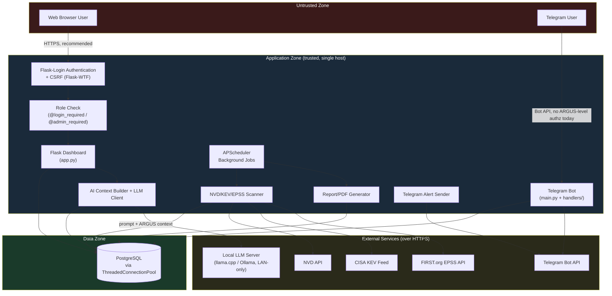
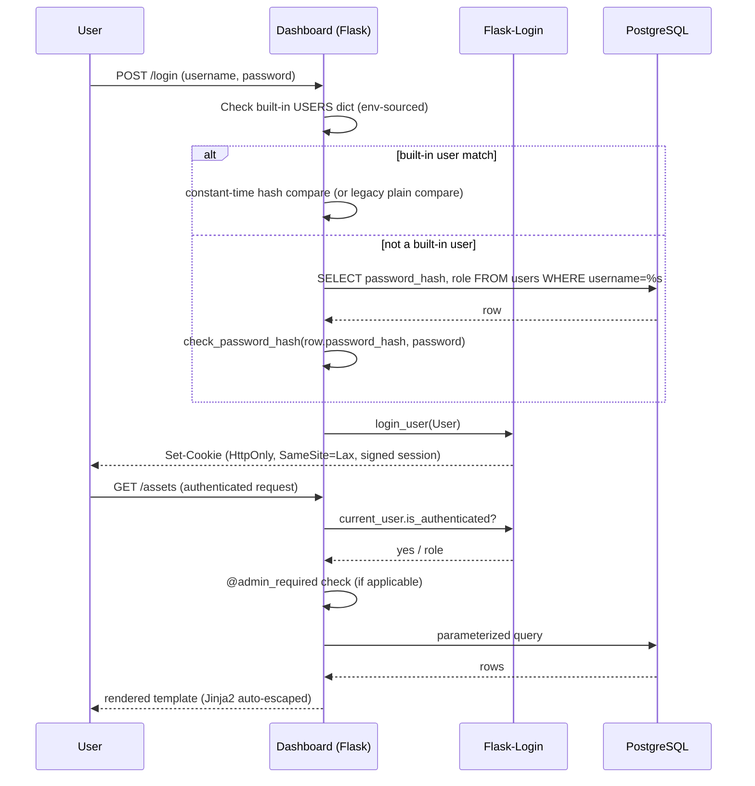
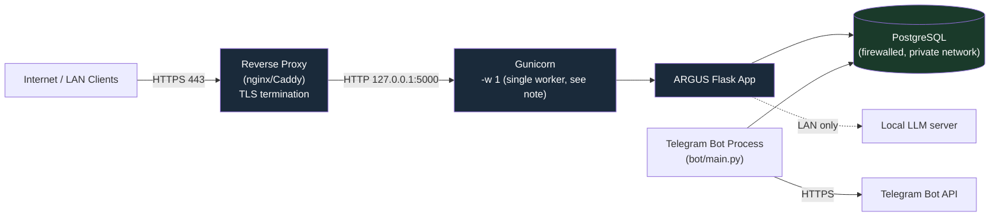

# ARGUS Security Documentation

> **Accuracy note.** Every control described in this document has been verified directly against the ARGUS source code (`bot/dashboard/app.py`, `bot/database/`, `bot/Ai/`, `bot/scanner/`, `bot/nvd/`, `bot/kev/`, `bot/jobs/`, `bot/main.py`, `bot/handlers/`, `bot/database/schema.sql`) as of this revision. Implemented controls, recommended practices, and planned/future enhancements are explicitly and consistently distinguished throughout. Nothing below claims a protection that is not actually present in the codebase.

---

## Table of Contents

1. [Introduction](#1-introduction)
2. [Security Philosophy](#2-security-philosophy)
3. [Security Architecture](#3-security-architecture)
4. [Threat Model](#4-threat-model)
5. [Authentication](#5-authentication)
6. [Authorization](#6-authorization)
7. [Session Security](#7-session-security)
8. [Input Validation](#8-input-validation)
9. [AI Security](#9-ai-security)
10. [Database Security](#10-database-security)
11. [External API Security](#11-external-api-security)
12. [Dashboard Security](#12-dashboard-security)
13. [Telegram Bot Security](#13-telegram-bot-security)
14. [Scanner Security](#14-scanner-security)
15. [Reporting Security](#15-reporting-security)
16. [Alert Security](#16-alert-security)
17. [Scheduler Security](#17-scheduler-security)
18. [Secrets Management](#18-secrets-management)
19. [Logging & Audit](#19-logging--audit)
20. [Cryptography](#20-cryptography)
21. [Secure Development](#21-secure-development)
22. [Infrastructure Security](#22-infrastructure-security)
23. [Backup & Recovery Security](#23-backup--recovery-security)
24. [Incident Response](#24-incident-response)
25. [Vulnerability Management (of ARGUS Itself)](#25-vulnerability-management-of-argus-itself)
26. [Compliance Considerations](#26-compliance-considerations)
27. [Security Best Practices for Operators](#27-security-best-practices-for-operators)
28. [Known Limitations](#28-known-limitations)
29. [Future Security Roadmap](#29-future-security-roadmap)
30. [Security Reporting](#30-security-reporting)
31. [Cross References](#31-cross-references)

---

## 1. Introduction

### Purpose

This document is the authoritative security reference for ARGUS, a Flask/PostgreSQL vulnerability management platform with an accompanying Telegram bot and local-LLM assistant. It exists so that operators, contributors, auditors, and enterprise reviewers can understand ARGUS's security posture **without reading the source code**.

### Scope

This document covers the Flask dashboard, the PostgreSQL data layer, the Telegram bot, the local AI subsystem (llama.cpp/Ollama-backed chat with RAG-style context injection), the NVD/KEV/EPSS scanner, the reporting and alerting engines, and the background scheduler, as deployed by a single operator/organization on a single host (the architecture ARGUS currently implements — see [§28](#28-known-limitations)).

### Intended Audience

Security analysts and SOC teams operating ARGUS, system administrators deploying it, contributors extending it, and security reviewers/auditors evaluating it for adoption.

### Relationship to Other Documentation

This document is security-focused and intentionally does not repeat installation steps, feature walkthroughs, or general architecture already covered in `docs/INSTALL.md`, `docs/ARCHITECTURE.md`, and `docs/README.md`. Where those documents contain security-relevant detail (e.g., environment variable requirements, deployment topology), this document cites and builds on them rather than duplicating them.

### Security Is a Continuous Process

ARGUS's security posture is a function of both the shipped code and how it is deployed and operated. This document describes what ARGUS **does** as of this revision; it does not substitute for the operator's own patching, monitoring, and configuration discipline described in [§27](#27-security-best-practices-for-operators).

---

## 2. Security Philosophy

| Principle | How it applies to ARGUS |
|---|---|
| **Secure by default (where enforced)** | ARGUS refuses to start without a `SECRET_KEY` or `DB_PASSWORD` configured (`app.py`, `database/db.py`), rather than falling back to an insecure default for those two values. |
| **Least privilege** | Role-based route protection (`@login_required`, `@admin_required`) restricts destructive and administrative actions (asset creation/edit/delete, patch-plan assignment, report generation) to the `admin` role. |
| **Defense in depth** | Authentication, session cookie hardening, CSRF protection, parameterized SQL, and output-encoding via Jinja2 auto-escaping are layered rather than relied on individually. |
| **Fail secure** | Failed authentication returns a generic error rather than distinguishing "user does not exist" from "wrong password"; a missing/invalid CSRF token rejects the request; database errors are caught and rolled back rather than left in an indeterminate transaction state. |
| **Input validation** | Server-side allowlists constrain asset type, exposure, function, and city/country fields (`config/locations.py`, `database/assets.py`) regardless of what a client submits. |
| **Least knowledge / need to know** | The AI assistant is instructed to answer only from data ARGUS supplies for the current query, not from unrelated conversation state or invented information (`Ai/prompts.py`, the `/api/chat` system prompt). |
| **Privacy by design** | City-level location data used for the exposure map is limited to city-centroid granularity by design (`config/locations.py`) — there is no per-asset GPS or building-level precision anywhere in the schema. |
| **AI safety** | The AI subsystem is scoped to a fixed, non-editable system prompt, is restricted to read-only database views, and is explicitly instructed not to reveal its own system prompt or invent completed analyses (see [§9](#9-ai-security)). |
| **Operational security** | Secrets are sourced exclusively from environment variables (`.env`, git-ignored), never hardcoded in application logic. |

These principles describe design intent that is **substantially, but not universally,** realized in the current codebase — deviations are called out explicitly in [§28](#28-known-limitations) rather than glossed over.

---

## 3. Security Architecture

### 3.1 Component / Trust Boundary Overview

**Trust boundary notes:**

- The **web-user boundary** is mediated by Flask-Login authentication, role checks, and CSRF protection.
- The **Telegram-user boundary** currently has **no ARGUS-level authorization layer** of its own — see [§13](#13-telegram-bot-security) and [§28](#28-known-limitations). Anyone who can message the bot can invoke any registered command.
- The **database boundary** is only ever reached through the connection pool (`database/db.py`) and parameterized queries — application code never constructs raw connection strings from request input.
- The **LLM boundary** is a plain, unauthenticated HTTP endpoint on the local network (default `http://192.168.0.26:8080/v1/chat/completions`, overridable via `LLM_URL`). It is treated as a trusted internal component, not as untrusted external infrastructure — see [§9](#9-ai-security) for the implications.
- The **external API boundary** (NVD, KEV, EPSS, Telegram) is reached exclusively over HTTPS using pooled `requests.Session` objects with default TLS certificate verification (never disabled in the codebase).

### 3.2 Authentication → Authorization → Data Flow

---

## 4. Threat Model

### 4.1 Assets to Protect

- User credentials (built-in and database-backed accounts)
- Asset inventory (vendor/product/version, location, criticality, ownership)
- Vulnerability and risk data (CVE/CVSS/KEV/EPSS matches, risk scores, patch plans)
- AI conversation history (per-user, stored in PostgreSQL)
- Generated reports (PDF files under `bot/dashboard/generated_reports/`)
- Secrets: `SECRET_KEY`, `DB_PASSWORD`, Telegram `TOKEN`, `NVD_API_KEY`, `ADMIN_PASSWORD`/`VIEWER_PASSWORD`
- Availability of the scanning, reporting, and alerting pipelines

### 4.2 Threat Actors

- Unauthenticated external attackers probing the dashboard over the network
- Authenticated low-privilege (`viewer`) users attempting privilege escalation
- Any Telegram user who can reach the bot (no allowlist currently enforced — see [§13](#13-telegram-bot-security))
- Compromised or malicious upstream data (a poisoned NVD/KEV/EPSS response, or an adversarial answer from the LLM)
- An operator misconfiguring secrets or exposing services directly to the internet

### 4.3 Entry Points

- `/login`, `/register` (public, unauthenticated)
- All `@login_required` dashboard routes (assets, findings, reports, charts, AI chat, patch plans)
- All `@admin_required` routes (asset CRUD, report generation, status "today" digest, patch toggling)
- The Telegram bot's command set (`/add`, `/asset`, `/rm`, `/edit`, `/cve`, `/scan`, `/status`, `/findings`, `/report`, `/today`, `/help`, `/start`)
- Outbound calls to NVD, CISA KEV, FIRST.org EPSS, Telegram Bot API, and the local LLM server

### 4.4 STRIDE Summary

| Threat Category | Relevant Surface | Implemented Mitigation |
|---|---|---|
| **Spoofing** | Login form | Password hashing (`werkzeug.security`), Flask-Login session cookies signed with `SECRET_KEY` |
| **Tampering** | Forms, AJAX bodies, DB writes | Flask-WTF CSRF tokens on state-changing requests; server-side allowlist validation (asset type/exposure/function/location); 100% parameterized SQL |
| **Repudiation** | Administrative actions | Application logging via Python's `logging` module records failures and key operations; **no dedicated, queryable audit trail table exists today** — see [§19](#19-logging--audit) and [§28](#28-known-limitations) |
| **Information Disclosure** | Report downloads, API endpoints, error pages | Path-containment check on report downloads; role checks on sensitive routes; generic Flask error responses in place of raw tracebacks in production (`debug=False` recommended, see [§22](#22-infrastructure-security)) |
| **Denial of Service** | NVD/KEV/EPSS calls, LLM calls, scanner concurrency | `asyncio.Semaphore`-bounded scan concurrency, HTTP retry/backoff honoring `Retry-After`, request timeouts on every outbound HTTP call, DB connection pooling with a bounded max size |
| **Elevation of Privilege** | `viewer` → `admin` actions | Every destructive/administrative route is wrapped in `@admin_required`, checked after `@login_required`; self-registered accounts default to the `viewer` role at the database level (`role TEXT NOT NULL DEFAULT 'viewer'`) |

---

## 5. Authentication

### 5.1 Account Types

ARGUS supports two parallel authentication sources, checked in this order on `/login`:

1. **Built-in accounts** — an `admin` and a `viewer` account defined in-process from environment variables (`ADMIN_PASSWORD`, `VIEWER_PASSWORD`). These support either a plain environment-variable password (legacy path) or a `pbkdf2:`-prefixed pre-hashed value, compared with `werkzeug.security.check_password_hash`.
2. **Database accounts** — rows in the `users` table (`username`, `password_hash`, `role`), created via self-service `/register`. Passwords are hashed with `werkzeug.security.generate_password_hash` (PBKDF2) before storage; plaintext passwords are never persisted.

### 5.2 Password Storage

- Database-backed accounts: PBKDF2 password hashing via Werkzeug (`generate_password_hash` / `check_password_hash`), which internally applies a per-password salt.
- Built-in accounts: passwords are sourced from environment variables and may be plain or PBKDF2-hashed strings; comparisons use `check_password_hash` when the stored value is prefixed `pbkdf2:`, and a direct string comparison otherwise.

**Operationally significant detail:** the `admin` built-in account falls back to the literal password `admin` if `ADMIN_PASSWORD` is not set in the environment. This is a weak default and **must** be overridden in every real deployment — see [§27](#27-security-best-practices-for-operators) and [§28](#28-known-limitations). The `viewer` built-in account has no such fallback; if `VIEWER_PASSWORD` is unset, login as `viewer` is effectively unusable (the stored value is `None`, which cannot match a submitted password).

### 5.3 Session Creation & Lifecycle

- Sessions are created via `flask_login.login_user()` on successful authentication and are signed using the Flask `SECRET_KEY`.
- `PERMANENT_SESSION_LIFETIME` is configured to 8 hours.
- Sessions are destroyed via an explicit, `POST`-only, `@login_required` `/logout` route (protecting logout itself from CSRF-driven forced-logout, and preventing logout via a simple unauthenticated link).

### 5.4 Registration

- `/register` is public and unauthenticated (by design, to allow self-service `viewer` account creation).
- New accounts are always created with the schema default role of `viewer`; there is no way for a self-registered account to obtain `admin` through the registration flow itself. Promotion to `admin` requires direct database access.
- Duplicate usernames are rejected with a generic error.

### 5.5 Account Self-Management

- `/profile` allows a logged-in user to change their password or username, each gated behind re-entry of the current password.
- `/delete_account` permits self-service account deletion, also gated behind password confirmation.

### 5.6 Not Currently Implemented (Planned)

- **Multi-Factor Authentication (MFA)** — Planned. Not present in the codebase today.
- **Self-service password reset (e.g., email-based)** — Planned. No email/reset-token flow exists.
- **Enterprise authentication (SSO/OAuth2/OIDC/LDAP/SAML)** — Planned. All authentication today is local to ARGUS's own `USERS` dict and `users` table.
- **Account lockout / brute-force throttling on `/login`** — Not implemented. See [§28](#28-known-limitations).

---

## 6. Authorization

### 6.1 Model

ARGUS implements a simple two-role RBAC model enforced via two decorators:

- `@login_required` (Flask-Login) — requires any authenticated session.
- `@admin_required` (custom decorator in `app.py`) — requires `current_user.role == "admin"`, always applied **after** `@login_required` on the routes that need it, and returns HTTP 403 otherwise.

| Role | Description |
|---|---|
| `admin` | Full access: asset CRUD, patch-plan assignment, report generation, the `/today` executive digest, patched-status toggling, in addition to everything a `viewer` can do. |
| `viewer` | Read/interact access: dashboard, assets (read), findings (read), charts, AI chat, search, patch-plan notes (see below), profile self-management. |

### 6.2 Permission Matrix (routes as implemented)

| Capability | Route(s) | Required Role |
|---|---|---|
| View dashboard, findings, assets, charts, search | `/dashboard`, `/findings`, `/assets`, `/charts`, `/search`, `/asset/<id>`, `/finding/<cve_id>` | `login_required` (any authenticated user) |
| AI chat, conversation management | `/api/chat`, `/api/conversations*` | `login_required` |
| Update finding status | `/finding/update_status` | `login_required` |
| Update finding assignment (owner/team) | `/finding/update_assignment` | `login_required` + `admin_required` |
| Update patch plan notes/date | `/finding/update_patch_plan` | `login_required` **only** (intentionally not admin-gated — see route docstring in `app.py`; analysts are expected to maintain patch-plan notes without needing admin rights) |
| View patch plan page | `/patch_plan` | `login_required` |
| Create/edit/delete assets | `/add_asset`, `/edit_asset/<id>`, `/delete_asset/<id>` | `login_required` + `admin_required` |
| Toggle patched status | `/toggle_patched/<asset_id>/<cve_id>` | `login_required` + `admin_required` |
| Generate reports | `/generate_report/<type>` | `login_required` + `admin_required` |
| Executive "today" digest (Telegram push) | `/today` | `login_required` + `admin_required` |
| Download generated report | `/download/<report_id>` | `login_required` (not admin-gated; any authenticated user can download any generated report) |
| Profile self-management | `/profile`, `/delete_account` | `login_required` (acts only on `current_user`) |
| Login / Register / Landing pages | `/login`, `/register`, `/`, `/features`, `/basics`, `/docs` | Public |
| Telegram bot commands | `/add`, `/asset`, `/rm`, `/edit`, `/cve`, `/scan`, `/status`, `/findings`, `/report`, `/today` | **No role check today** — see [§13](#13-telegram-bot-security) |

### 6.3 Future Custom Roles (Planned)

A more granular, per-capability permission system (beyond `admin`/`viewer`) is not implemented today and is a planned enhancement — see [§29](#29-future-security-roadmap).

---

## 7. Session Security

| Control | Status | Detail |
|---|---|---|
| `SESSION_COOKIE_HTTPONLY` | **Implemented** | `True` — cookie is inaccessible to JavaScript, mitigating session theft via XSS. |
| `SESSION_COOKIE_SAMESITE` | **Implemented** | `"Lax"` — mitigates cross-site request forgery via top-level cross-origin navigation. |
| `SESSION_COOKIE_SECURE` | **Implemented, but defaulted off** | Set to `False` in the shipped `app.py` configuration, explicitly commented as intended for local/LAN HTTP testing. **Operators must set this to `True`** once ARGUS is served over HTTPS — see [§22](#22-infrastructure-security) and [§27](#27-security-best-practices-for-operators). |
| CSRF protection | **Implemented** | Flask-WTF's `CSRFProtect` is initialized globally against the app (`csrf = CSRFProtect(app)`), with no routes exempted in the codebase. |
| Session expiration | **Implemented** | `PERMANENT_SESSION_LIFETIME = timedelta(hours=8)`. |
| Logout | **Implemented** | `POST`-only, `@login_required` route; CSRF-protected like any other state-changing endpoint. |
| Session fixation prevention | **Implemented (via framework)** | Flask-Login issues a new session identifier on `login_user()`, which is the standard Flask/Flask-Login mitigation for session fixation. |
| Session rotation on privilege change | Not applicable today | Roles do not change mid-session in the current design (role is fixed at login time from either the `USERS` dict or the `users` table). |
| Idle timeout distinct from absolute timeout | Not implemented | Only the single 8-hour absolute `PERMANENT_SESSION_LIFETIME` applies; there is no separate shorter idle-timeout mechanism. |
| Distributed / shared session store (e.g., Redis) | **Planned** | Sessions today are Flask's default signed-cookie sessions; see [§29](#29-future-security-roadmap). |

---

## 8. Input Validation

ARGUS validates input at several layers rather than relying on any single choke point:

- **Allowlisted enumerations.** Asset `type`, `exposure`, and `function` are checked against explicit valid sets (`VALID_TYPES`, `VALID_EXPOSURES`, `VALID_FUNCTIONS` in `database/assets.py`); any value outside the allowlist is coerced to a safe default (`"Unknown"`, `"Internal"`, or `None`) rather than stored as-is.
- **Location allowlisting.** `config/locations.py` maintains a frozenset of valid `(country_code, city)` pairs (`_VALID_COUNTRY_CITY_PAIRS`), built once at import time and used by `is_valid_city()` on every request path that accepts location input (`/assets`, `/findings`, `/add_asset`, `/edit_asset`). Invalid combinations are silently reset to `None` rather than stored.
- **Parameterized SQL everywhere.** Every database call in the codebase uses `%s` placeholders with psycopg2 parameter binding. The one place a query string is dynamically assembled (`database/assets.py`'s `UPDATE assets SET {...}`) interpolates only **hardcoded column names** selected by application logic, never user-supplied text — the values themselves remain fully parameterized.
- **Numeric/path parameters.** Flask route converters (`<int:asset_id>`, `<int:report_id>`, `<int:conversation_id>`) reject non-numeric input at the routing layer before a view function ever executes.
- **Output encoding.** All dashboard templates are rendered through Jinja2, which HTML-escapes variables by default, mitigating reflected/stored XSS from asset names, notes, and other free-text fields rendered back into pages.
- **Report path containment.** `/download/<report_id>` resolves the stored file path and verifies it falls under the application's `REPORTS_DIR` before serving it, rejecting anything outside that directory with HTTP 403.
- **Telegram command inputs.** Handlers parse structured arguments (vendor/product/version, CVE IDs) before passing them into the same validated database functions the dashboard uses — there is a single, shared validation path (`database/assets.py`, `nvd/matching.py`) regardless of whether the request originated from the dashboard or the bot.
- **AI prompt inputs.** User chat messages are not evaluated as code or commands; they are inserted into a fixed conversation structure sent to the LLM, and the context injected alongside them is built exclusively from ARGUS's own database views (see [§9](#9-ai-security)).

### Not Implemented (Planned)

- Structured request validation (e.g., a schema-validation library like `pydantic` or `marshmallow`) at the API boundary — current validation is hand-written per field. No functional gaps have been identified from this, but a schema-based approach is a planned hardening step.
- File upload handling — ARGUS does not currently accept user file uploads anywhere in the dashboard (a 16 MB `MAX_CONTENT_LENGTH` is configured defensively, but no upload route exists to be reached by it).

---

## 9. AI Security

ARGUS's AI assistant (`/api/chat`) sends a system prompt plus ARGUS-sourced context to a locally hosted LLM (llama.cpp or Ollama's OpenAI-compatible endpoint). This section documents what is and is not mitigated in that pipeline.

### 9.1 Prompt Injection

- **Direct prompt injection** (a user typing "ignore your instructions") is partially mitigated by an explicit, hardened system prompt (`Ai/prompts.py` and the inline system prompt in `app.py`'s `/api/chat`) that instructs the model to never reveal its own system prompt or internal functions, to answer only from supplied ARGUS data, and to say so explicitly when data is unavailable rather than fabricating an answer. This is a prompt-level mitigation, not a hard technical control — a sufficiently adversarial user message can still influence model behavior, since the underlying LLM has no separate privilege boundary between "system" and "user" text beyond what the model itself respects.
- **Indirect prompt injection** (malicious content reaching the model via stored data — e.g., an asset's free-text `notes` field, or a CVE description) is a residual risk: the context builder pulls from real ARGUS data (open findings, asset summaries, KEV/overdue findings) without a dedicated sanitization pass specifically for prompt-injection payloads embedded in that stored text. Any operator who allows untrusted third parties to write asset notes, owners, or similar free-text fields should be aware the AI context builder will include that text verbatim in the prompt sent to the LLM.
- **Mitigation posture:** because the LLM is local (not a third-party service that could retain or misuse data), the blast radius of a successful injection is scoped to the accuracy/trustworthiness of the AI's own chat answers within a single user's conversation — it is not a route to server-side code execution, since the LLM's output is returned to the browser as chat text and rendered, not executed.

### 9.2 Prompt / Data Leakage

- The system prompt explicitly instructs the model never to reveal its own system prompt or internal function names.
- The AI is instructed to answer strictly from the ARGUS data supplied for that specific query and to say "Information not available in ARGUS" rather than filling gaps from its own general training knowledge of a CVE — reducing the risk of the model presenting unverified, hallucinated vulnerability detail as authoritative ARGUS findings.
- Conversation history is stored per-user in PostgreSQL (`database/conversations.py`) and is only retrievable through `@login_required` routes scoped to `current_user.username` — one user cannot read another user's AI conversation history through the `/api/conversations` endpoints.

### 9.3 Hallucination Risk

- Explicitly addressed in the system prompt: the model is told not to claim a CVE "has been analyzed by ARGUS AI" unless a completed analysis block is actually present in the supplied context, and to use the exact phrase "ARGUS has not completed and saved a background AI analysis for this CVE yet" when that is the case — a direct mitigation against the model inventing completed analysis that doesn't exist.
- Despite this instruction layer, LLM outputs are **not deterministic or independently verified**; ARGUS does not currently cross-check AI-generated remediation guidance or CVE explanations against a ground-truth source before displaying them to the user. Analysts should treat AI chat answers as assistive, not authoritative — see [§27](#27-security-best-practices-for-operators).

### 9.4 Context Window / Data Scoping

- The context builder (`Ai/context_builder.py`) draws from a fixed, small set of parameterized SQL queries (`Ai/queries.py`) — top open findings (limited to 20 rows), dashboard aggregate stats (1 row), a specific asset summary (by ID), top assets by finding count (limited to 10), KEV findings (limited to 20), and overdue findings (limited to 20). These `LIMIT` clauses bound how much data — and therefore how large a prompt — any single query can generate, which also bounds the AI's ability to be used as an indirect full-table data exfiltration channel through the chat interface.
- Response caching (`database/chat_cache.py`) is keyed on `(question, argus_context)`, so a cached answer can never be served after the underlying ARGUS data has changed — cache correctness is coupled to data freshness by construction.

### 9.5 Conversation Isolation

Each AI conversation is tied to a `conversation_id` and the authenticated `current_user.username`; `get_conversation()` verifies ownership before returning history, and stale/foreign conversation IDs are treated as "start a new conversation" rather than silently attached to another user's thread.

### 9.6 Model Trust Boundary

The LLM endpoint (`LLM_URL`, default `http://192.168.0.26:8080/v1/chat/completions`) is called over plain HTTP by default, which is acceptable **only** because it is intended to run on a private LAN alongside the ARGUS host. Operators who relocate the LLM server off the local network must secure that channel themselves (network segmentation, TLS, or an authenticated reverse proxy) — ARGUS's LLM client does not add authentication or TLS to that call.

### 9.7 Not Currently Implemented (Planned)

- **RAG document ingestion / vector search safety controls** — ARGUS's "RAG" today is structured SQL context injection, not unstructured document retrieval; if free-text document ingestion is added in the future, dedicated content-safety and provenance controls will be needed.
- **Tool-calling / agentic function execution by the AI** — Not implemented; the AI only answers with text based on supplied context. A dedicated tool-calling security model is planned before any such capability ships (see [§29](#29-future-security-roadmap)).
- **Multi-agent security** — Not applicable; ARGUS runs a single assistant persona.
- **A dedicated prompt-injection firewall/classifier** — Planned; today's mitigation is system-prompt instruction only, as described above.

---

## 10. Database Security

- **Parameterized queries throughout.** Every query in `database/*.py` and route handlers in `app.py` uses `%s` placeholders with psycopg2's parameter binding; no request-derived value is ever interpolated into SQL text. SQL injection via any dashboard, API, or Telegram input has not been identified as a risk given this pattern.
- **Connection pooling.** `database/db.py` uses `psycopg2.pool.ThreadedConnectionPool` (default 2–20 connections, configurable via `DB_POOL_MIN_CONN`/`DB_POOL_MAX_CONN`), replacing what was previously a per-query connect/disconnect pattern. A connection that errors out or is left mid-transaction is discarded from the pool (`close=True`) rather than being returned to a shared pool in a bad state, preventing one failed transaction from poisoning subsequent requests.
- **Credential handling.** `DB_PASSWORD` is read only from the environment; there is no hardcoded default, and the application logs a warning (not the value itself) if it is unset.
- **Least privilege (operator responsibility).** ARGUS's own code does not create or manage PostgreSQL roles; operators are expected to provision a dedicated, least-privileged database role for ARGUS rather than using PostgreSQL's `postgres` superuser account — see [§27](#27-security-best-practices-for-operators).
- **Referential integrity.** Foreign keys (`matches.asset_id → assets.id ON DELETE CASCADE`, `matches.cve_id → cves.cve_id`) and `UNIQUE` constraints are enforced at the schema level, reducing the risk of orphaned or duplicated risk data.
- **Backups.** ARGUS does not implement its own backup mechanism; this is an operator responsibility using standard PostgreSQL tooling (`pg_dump`/WAL archiving) — see [§23](#23-backup--recovery-security).

### Not Currently Implemented (Planned)

- **Row-Level Security (RLS)** — Not used; all authenticated users share the same database role's view of the data (access control is enforced at the application layer, not the database layer).
- **Encryption at rest** — Not implemented by ARGUS itself; depends on the underlying PostgreSQL deployment/disk encryption configuration, which is outside ARGUS's own code.
- **Database connection TLS** — Not explicitly configured in `DB_CONFIG`; if the database is not on the same host as the application, operators should configure `sslmode` via PostgreSQL client behavior/environment or a trusted private network path themselves.

---

## 11. External API Security

| Integration | Status | Transport | Key Handling | Resilience |
|---|---|---|---|---|
| **NVD** | Implemented | HTTPS (`services.nvd.nist.gov`) | Optional `NVD_API_KEY` from environment; falls back to (more aggressively rate-limited) unauthenticated requests if unset | Exponential backoff on HTTP 429/503, honors `Retry-After` (seconds or HTTP-date), request timeouts, capped retry count |
| **CISA KEV** | Implemented | HTTPS (`cisa.gov` feed) | No key required (public feed) | Retry/backoff, 24-hour local cache with `invalidate_cache()`, request timeout |
| **FIRST.org EPSS** | Implemented | HTTPS (`api.first.org`) | No key required (public API) | Batch chunking, retry/backoff, request timeout |
| **Telegram Bot API** | Implemented | HTTPS (library-managed, `python-telegram-bot`) | Bot `TOKEN` from environment, required at startup | Library-level connection handling; ARGUS's own error handler catches and reports database/unexpected errors per update |
| **Local LLM (llama.cpp/Ollama)** | Implemented | Plain HTTP by default (LAN-only design assumption) | No API key by default (self-hosted) | Fixed request timeout (120s), connection-error handling with a user-facing "AI server is offline" fallback message |
| **OpenCVE** | **Not implemented** | — | — | Referenced in project documentation as a data-source ecosystem project, but there is no client, configuration, or code path for it anywhere in the codebase. Any reference to OpenCVE as an active ARGUS integration describes a future aspiration, not current behavior. |
| **Future Threat Intelligence feeds** | **Planned** | — | — | See [§29](#29-future-security-roadmap). |

All implemented HTTP clients use pooled `requests.Session` objects with default TLS certificate verification (never disabled), explicit timeouts on every call, and are mounted only against `https://` schemes for the CVE-data feeds.

---

## 12. Dashboard Security

| Control | Status |
|---|---|
| Authentication (`flask-login`) | Implemented on every non-public route |
| Authorization (`@admin_required`) | Implemented on destructive/administrative routes (see [§6](#6-authorization) for the full matrix) |
| CSRF protection | Implemented globally via `Flask-WTF`'s `CSRFProtect(app)`, no route-level exemptions in the codebase |
| XSS prevention / template escaping | Implemented via Jinja2's default auto-escaping across all templates |
| `X-Content-Type-Options: nosniff` | Implemented (`after_request` hook) |
| `X-Frame-Options: DENY` | Implemented (`after_request` hook) — mitigates clickjacking |
| `Referrer-Policy: strict-origin-when-cross-origin` | Implemented (`after_request` hook) |
| `Permissions-Policy` (camera/mic/geolocation disabled) | Implemented (`after_request` hook) |
| Content-Security-Policy (CSP) | **Not implemented** — planned, see [§29](#29-future-security-roadmap) |
| `Strict-Transport-Security` (HSTS) | **Not implemented in application code** — expected to be set at the reverse-proxy layer once deployed behind HTTPS (see [§22](#22-infrastructure-security)) |
| Custom error pages (hiding stack traces) | Dependent on `debug=False` in production (operator/deployment responsibility — see [§22](#22-infrastructure-security)); Flask's default behavior with `debug=True` would expose tracebacks and must not be used in production |
| Report access control | `/download/<report_id>` is `@login_required` and path-containment checked (see [§8](#8-input-validation)); it is **not** `@admin_required`, so any authenticated user can download any generated report |

---

## 13. Telegram Bot Security

- **Bot token protection.** The Telegram `TOKEN` is read exclusively from the environment (`.env`, git-ignored) and never logged or hardcoded; the bot refuses to start without it.
- **Command surface.** The bot registers a fixed set of slash commands (`/add`, `/asset`, `/rm`, `/edit`, `/cve`, `/scan`, `/status`, `/findings`, `/report`, `/today`, `/help`, `/start`) mapped directly to handler functions in `bot/handlers/`.
- **Authorization — current gap.** As implemented, **none of the Telegram command handlers check the sender's chat ID, user ID, or any allowlist before executing.** There is no `is_admin`/`authorized` check anywhere in `bot/handlers/` or `bot/main.py`. This means any Telegram user who can message the bot (or who is added to a group the bot is in, depending on the bot's privacy settings) can currently execute every registered command, including asset creation/removal (`/add`, `/rm`, `/edit`) and triggering scans (`/scan`). **This is the most significant gap documented in this file** and is treated as a known limitation rather than glossed over — see [§28](#28-known-limitations) and [§27](#27-security-best-practices-for-operators) for the operator-level mitigation available today (restricting who can reach the bot via Telegram's own privacy/group settings and by not publicizing the bot's username).
- **Error handling.** A global error handler (`main.py`) catches `psycopg2.OperationalError`, other `psycopg2.Error` subclasses, and unexpected exceptions per update, logging the full traceback server-side and replying to the user with a bounded error message rather than crashing the bot process.
- **Rate limiting.** No ARGUS-specific rate limiting is applied to Telegram commands; the bot relies on `python-telegram-bot`'s own polling behavior and Telegram's platform-level rate limits.

### Not Currently Implemented (Planned)

- Per-command role/chat-ID authorization checks — **planned and recommended as the highest-priority security enhancement for the bot** (see [§29](#29-future-security-roadmap)).
- Private-vs-group-chat differentiation for sensitive commands.
- Audit logging of who issued which Telegram command.

---

## 14. Scanner Security

- **Bounded concurrency.** `scan_all_assets()` uses an `asyncio.Semaphore` to cap how many assets are scanned against NVD concurrently, preventing the scanner from overwhelming either the NVD API or the local process with unbounded parallel requests.
- **Resource limits.** Every outbound HTTP call in the scanner path has an explicit timeout; EPSS lookups are batched in chunks rather than issued one CVE at a time.
- **Safe matching.** CVE-to-asset matching logic (`nvd/matching.py`) is shared between the dashboard, the Telegram `/cve` command, and the scanner, so there is a single, consistently validated matching implementation rather than divergent per-entry-point logic.
- **Failure isolation.** Per-asset scan failures are caught individually (`_safe_scan`) so that one asset's scan failure does not abort the entire batch scan.
- **Network safety.** All scanner HTTP calls target fixed, known-good hostnames (NVD, KEV, EPSS) — the scanner does not construct URLs from user-supplied asset data.

### Not Currently Implemented (Planned)

- **Sandboxing of the scan process itself** — the scanner runs in-process with the rest of the application; it does not perform active network scanning of asset infrastructure (it matches known vendor/product/version strings against public CVE data, so it does not require sandboxing in the way an active network scanner would), but a dedicated process/sandbox isolation model for scan execution is listed as a future hardening item.

---

## 15. Reporting Security

- **Report generation is admin-gated.** `/generate_report/<type>` requires both `@login_required` and `@admin_required`.
- **Report storage.** PDFs are written to a fixed application-controlled directory (`bot/dashboard/generated_reports/`) created at startup (`REPORTS_DIR.mkdir(parents=True, exist_ok=True)`); filenames are derived from the report type and date, not from user input.
- **Secure downloads.** `/download/<report_id>` resolves the requested report's path and verifies it lies within `REPORTS_DIR` before serving it, rejecting any path outside that root with HTTP 403 — a path-traversal mitigation. Download access itself, however, is available to any authenticated user (`@login_required`, not `@admin_required`) — see [§12](#12-dashboard-security).
- **Retention.** ARGUS does not currently implement automatic report expiry/retention policies; generated PDFs persist on disk until manually removed by an operator.

### Not Currently Implemented (Planned)

- Per-report, per-role download restrictions beyond "any authenticated user."
- Report watermarking.
- Digital signatures on generated reports.

---

## 16. Alert Security

- **Delivery channel.** Alerts (e.g., weekly/monthly report pushes) are sent via the Telegram Bot API using `alerts/telegram_alert.py`'s `send_document()`, reusing the same bot `TOKEN` as the rest of the bot.
- **Information disclosure.** Alert content is limited to report captions and generated documents already gated by [§15](#15-reporting-security); alerts do not include raw secrets or credentials.
- **Deduplication.** Scheduled jobs (weekly/monthly report generation) run on fixed schedules via APScheduler rather than being triggerable arbitrarily by external input, limiting duplicate-alert risk from request flooding.

### Not Currently Implemented (Planned)

- Email-based alerting and its associated security controls (SPF/DKIM/DMARC considerations, credential handling for an SMTP relay).
- Outbound webhook delivery (and the signing/verification controls that implies).
- SIEM integration for alert forwarding.

---

## 17. Scheduler Security

- **Implementation.** `APScheduler`'s `BackgroundScheduler` (UTC-scheduled) drives the daily scan, risk snapshot, weekly/monthly report generation, and periodic AI-analysis-queue draining (`bot/jobs/daily_scan.py`).
- **Privilege.** Scheduled jobs run with the same process privileges as the rest of the application/bot process — there is no separate, more-restricted execution context for background jobs.
- **Failure recovery.** Each job function wraps its body in a `try/except`, logging failures with `exc_info=True` rather than allowing one job's exception to crash the scheduler thread or block subsequent scheduled runs.
- **Single-worker constraint.** Because `app.py` starts the scheduler at module import time, ARGUS's documented production deployment (`docs/INSTALL.md`) explicitly requires running Gunicorn with exactly one worker (`-w 1`) to avoid duplicating scheduled jobs across multiple worker processes — running multiple workers without addressing this would cause the daily scan, reports, and AI analysis jobs to fire once per worker.

### Not Currently Implemented (Planned)

- Distributed/multi-worker-safe job scheduling (e.g., a job-lock table or a dedicated task queue) that would remove the single-worker constraint above.

---

## 18. Secrets Management

| Secret | Source | Required? | Notes |
|---|---|---|---|
| `SECRET_KEY` | Environment (`.env`) | **Required** | Flask session-signing key; app raises `RuntimeError` and refuses to start if unset. No insecure default exists for this value. |
| `DB_PASSWORD` | Environment (`.env`) | Required in practice | No hardcoded default; a warning is logged (not the value) if unset. |
| `TOKEN` (Telegram bot) | Environment (`.env`) | **Required** for the bot process | Bot raises `RuntimeError` and refuses to start if unset. |
| `NVD_API_KEY` | Environment (`.env`) | Optional | Improves NVD rate limits when set; scanner functions correctly (with more conservative rate limiting) if unset. |
| `ADMIN_PASSWORD` | Environment (`.env`) | Effectively required | **Falls back to the literal string `"admin"` if unset** — see [§5](#5-authentication) and [§28](#28-known-limitations). Operators must set this explicitly. |
| `VIEWER_PASSWORD` | Environment (`.env`) | Optional | No fallback; login as the built-in `viewer` account is unusable if unset. |
| `LLM_URL` | Environment | Optional | Defaults to a LAN address; override if the LLM server runs elsewhere. |

- **Storage.** All secrets are sourced from `.env` via `python-dotenv`; `.env` is listed in `.gitignore` and is never committed.
- **Handling.** Secrets are read once into module-level configuration at startup; the codebase does not log secret values (log statements reviewed reference error details, not credential contents).
- **Rotation.** ARGUS has no built-in secret-rotation mechanism; rotating `SECRET_KEY` invalidates all existing sessions (expected and acceptable, since sessions are meant to be re-established), and rotating `DB_PASSWORD`/`TOKEN` requires a corresponding update in PostgreSQL/Telegram's BotFather and an application restart.

### Not Currently Implemented (Planned)

- Integration with a dedicated secrets manager (e.g., Vault, AWS Secrets Manager, or a cloud KMS) — today's model is plain environment variables, appropriate for a single-host deployment but not for multi-host/enterprise secret distribution.
- Automated secret rotation tooling.

---

## 19. Logging & Audit

- **Mechanism.** ARGUS uses Python's standard `logging` module throughout (`app.py`, `main.py`, `database/db.py`, scanner/NVD/KEV clients, scheduler jobs), configured to stream to stdout by default.
- **What is logged.** Connection pool initialization/failures, NVD/KEV/EPSS retry and backoff events, scheduler job failures (with tracebacks), Telegram bot unhandled exceptions (with tracebacks), AI analysis backfill/cleanup results, and general application errors.
- **What is deliberately not logged.** Raw passwords and the contents of `SECRET_KEY`/`TOKEN` are not written to logs based on the call sites reviewed in this revision.
- **Authentication/authorization events.** Login success/failure is not currently logged as a distinct, structured security event beyond whatever generic HTTP access logging the WSGI server (Gunicorn) or reverse proxy provides. There is no dedicated "authentication log" or "authorization failure log" maintained by ARGUS's own code today.
- **Administrative action audit trail.** There is no dedicated, queryable audit-log table recording "who did what, when" for administrative actions (asset edits, patch-plan changes, report generation) beyond whatever incidental detail appears in general application logs.

### Not Currently Implemented (Planned)

- A structured, queryable audit-log table for authentication events and administrative actions.
- Centralized log aggregation/shipping (e.g., to a SIEM) — today, log retention is entirely dependent on the operator's process supervisor (systemd/journald) or manual `logrotate` configuration, since ARGUS does not manage its own log files or rotation.
- SIEM export format/integration.

---

## 20. Cryptography

- **Password hashing.** PBKDF2 via Werkzeug's `generate_password_hash`/`check_password_hash` for all database-backed accounts and for any built-in account password stored in its pre-hashed (`pbkdf2:`-prefixed) form.
- **Session signing.** Flask's default cryptographically signed session cookie mechanism (itsdangerous), keyed by `SECRET_KEY`.
- **Transport encryption (TLS/HTTPS).** ARGUS's own outbound HTTP clients (NVD, KEV, EPSS) use HTTPS with default certificate verification. **Inbound** TLS termination for the dashboard itself is not implemented in application code — it is a reverse-proxy responsibility (see [§22](#22-infrastructure-security)); `SESSION_COOKIE_SECURE` must be enabled once that proxy is in place.
- **Secure cookies.** `HttpOnly` and `SameSite=Lax` are enforced today; `Secure` is present as a configuration flag but defaulted to `False` (see [§7](#7-session-security)).

### Not Currently Implemented (Planned)

- **Encryption at rest** for the PostgreSQL database or generated report files — depends entirely on the underlying infrastructure (disk/volume encryption), not on any ARGUS application code.
- **Digital signatures** on reports or AI-generated content.
- **Formal key management** (rotation schedules, HSM-backed keys, etc.) beyond manual `.env` value changes.

ARGUS does not claim any encryption mechanism beyond those explicitly listed above.

---

## 21. Secure Development

- **Code organization for review.** The codebase is organized into clearly separated concerns (`dashboard/`, `database/`, `Ai/`, `scanner/`, `nvd/`, `kev/`, `reports/`, `alerts/`, `handlers/`, `jobs/`), which keeps security-relevant logic (auth, RBAC, SQL access) concentrated in a small number of reviewable modules rather than scattered.
- **Dependency pinning.** `requirements.txt` pins exact versions for every dependency (e.g., `Flask==3.1.3`, `Flask-Login==0.6.3`, `Flask-WTF==1.3.0`, `psycopg2-binary==2.9.12`, `python-telegram-bot==22.7`), which makes builds reproducible and dependency-update review tractable.
- **Input validation and output encoding** as described in [§8](#8-input-validation) and [§12](#12-dashboard-security).
- **Error handling.** Database operations are consistently wrapped in `try/finally` (to guarantee connection return to the pool) and, where transactions can fail mid-way, `try/except` with explicit `conn.rollback()` before falling back to a safer query path (see `asset_detail()` in `app.py`).
- **Secrets handling** as described in [§18](#18-secrets-management) — no secrets are hardcoded in source.

### Not Currently Implemented (Planned)

- **Static Application Security Testing (SAST)** in CI — not currently part of the repository's tooling.
- **Dynamic Application Security Testing (DAST)** — not currently part of the repository's tooling.
- **Automated dependency vulnerability scanning** (e.g., `pip-audit`, Dependabot/Renovate) — not currently configured in this repository; operators should run such tooling manually against `requirements.txt` as part of their own update process (see [§25](#25-vulnerability-management-of-argus-itself)).
- **Mandatory code review policy / branch protection** — a repository/process configuration, not something enforced by the application code itself.

---

## 22. Infrastructure Security

ARGUS's documented (and recommended) production deployment model, per `docs/INSTALL.md`, is:

- **WSGI server.** `requirements.txt` deliberately does **not** include Gunicorn or any production WSGI server — that is treated as a deployment choice, not an application dependency. `python app.py` (Flask's development server) must not be used in production.
- **Single-worker requirement.** Because `app.py` performs schema migration and starts the background scheduler at module import time, the documented deployment requires exactly one Gunicorn worker (`gunicorn -w 1 -b 127.0.0.1:5000 app:app`) to avoid duplicating scheduled jobs; additional request-handling concurrency should come from Gunicorn's `--threads` flag rather than additional worker processes.
- **Reverse proxy.** nginx or Caddy in front of Gunicorn, terminating TLS and forwarding to `127.0.0.1:5000`, is the documented and recommended topology — Flask/Gunicorn should not be exposed directly to an untrusted network.
- **Firewalling.** Documented guidance restricts inbound access to PostgreSQL's port (5432) to only the ARGUS host(s), and restricts inbound access to the dashboard's port to the reverse proxy rather than the public internet directly.
- **Process supervision.** systemd is the documented mechanism for running ARGUS as a service, with `journalctl` for log retrieval.
- **Least privilege.** A dedicated, non-root service account is the documented recommendation for running the ARGUS processes.

### Not Currently Implemented (Planned)

- **Docker/Compose packaging** — explicitly marked "Planned" in `docs/INSTALL.md` itself; the repository's `docker/` directory (if present) is a placeholder with no working `Dockerfile`/`docker-compose.yml` today.
- **Kubernetes deployment model** — not implemented; ARGUS today is a single-host, single-database, non-distributed application by design.
- **Network segmentation beyond basic firewall rules** (e.g., dedicated VLANs/security groups per component) — an operator/infrastructure responsibility, not something ARGUS's own code enforces.

---

## 23. Backup & Recovery Security

- ARGUS does not implement its own backup subsystem for the database or generated reports; this is an explicit operator responsibility using standard PostgreSQL tooling (`pg_dump`, WAL archiving/PITR) and routine filesystem backups of `bot/dashboard/generated_reports/`.
- **Recommended practice (operator-level, not enforced by ARGUS):** store backups encrypted, off-host, with tested restore procedures and a defined retention window.
- **Configuration backups.** `.env` and `schema.sql` should be included in an operator's configuration backup strategy, with `.env` backups handled with the same care as any other secrets store (encrypted, access-restricted).
- **Recovery verification.** Restoring a PostgreSQL backup and confirming `schema.sql`/`database/migrate.py` compatibility is a manual operator step; ARGUS does not automatically verify backup integrity.

---

## 24. Incident Response

ARGUS does not ship an automated incident-detection or response system; the guidance below describes the manual process an operator should follow using the logging and access controls already described in this document.

- **Detection.** Rely on application logs (stdout/journald), PostgreSQL logs, and reverse-proxy access logs, since ARGUS does not include built-in anomaly detection today.
- **Reporting.** Operators should establish an internal escalation path before an incident occurs; see [§30](#30-security-reporting) for reporting a vulnerability **in ARGUS itself**, as distinct from responding to an incident **within an ARGUS deployment**.
- **Containment.** Given the single-host architecture, containment options are largely infrastructure-level (isolating the host, revoking/rotating the compromised secret from [§18](#18-secrets-management), and using the reverse proxy to block traffic) rather than anything ARGUS's own code exposes as a "lockdown mode."
- **Recovery.** Restore from the backups described in [§23](#23-backup--recovery-security); rotate all secrets (`SECRET_KEY`, `DB_PASSWORD`, `TOKEN`, `NVD_API_KEY`) as a precaution after any suspected compromise, since `SECRET_KEY` rotation alone invalidates all existing sessions.
- **Post-incident review.** Not automated; a manual process for the operator's team.

### Not Currently Implemented (Planned)

- Formal, published security advisories process — see [§30](#30-security-reporting) for the current placeholder guidance.

---

## 25. Vulnerability Management (of ARGUS Itself)

Distinct from ARGUS's function as a vulnerability-management *platform*, this section covers keeping ARGUS's own stack patched:

- **Python dependencies.** `requirements.txt` pins exact versions; operators should periodically check for updated releases of security-relevant packages (`Flask`, `Flask-Login`, `Flask-WTF`, `Werkzeug`, `psycopg2-binary`, `python-telegram-bot`, `requests`) and re-test before upgrading, since no automated dependency-scanning tool is configured in this repository today (see [§21](#21-secure-development)).
- **PostgreSQL.** Kept up to date per the operator's own OS/package-manager patch cadence; ARGUS's schema (`schema.sql`) uses standard, version-portable SQL (`CREATE TABLE IF NOT EXISTS`, standard types/constraints) with no dependency on PostgreSQL-version-specific features that would block routine minor-version updates.
- **Ollama / llama.cpp.** The local LLM runtime is an operator-managed component outside ARGUS's own release cycle; operators should track upstream security advisories for whichever runtime they deploy.
- **Operating system.** Standard OS patching (`apt`/`yum`/Windows Update as applicable) is an operator responsibility, per the deployment guidance in `docs/INSTALL.md`.
- **Monitoring.** ARGUS itself does not poll for or alert on outdated dependencies; this is a manual or externally-tooled process today.

---

## 26. Compliance Considerations

ARGUS is **not certified** against any of the following frameworks. The mappings below describe conceptual alignment only, to help evaluators map ARGUS's implemented controls onto familiar frameworks — they are not compliance claims.

| Framework | Relevance |
|---|---|
| **OWASP Top 10** | Parameterized SQL addresses injection (A03); RBAC and route-level authorization checks address broken access control (A01); the password-hashing and session-cookie controls in [§5](#5-authentication)–[§7](#7-session-security) address identification/authentication failures (A07); the lack of CSP is a relevant gap under A05 (Security Misconfiguration) until addressed. |
| **OWASP ASVS** | ARGUS's authentication and session-management controls map to several Level 1 ASVS requirements (password hashing, session cookie flags, CSRF protection); MFA and account-lockout related ASVS requirements are not yet met (see [§28](#28-known-limitations)). |
| **NIST Cybersecurity Framework** | ARGUS's role as a vulnerability-management platform supports an organization's own "Identify" and "Detect" functions; ARGUS's *own* security posture (this document) is most relevant to an organization's "Protect" function when ARGUS is deployed as one component of their environment. |
| **CIS Controls** | Relevant conceptually to CIS Control 4 (Secure Configuration), 5 (Account Management), and 7 (Continuous Vulnerability Management) as applied to the ARGUS deployment itself. |
| **ISO/IEC 27001** | ARGUS's documented secrets-management, backup, and access-control practices can inform an organization's own ISMS documentation, but ARGUS is not itself ISO 27001 certified. |
| **MITRE ATT&CK** | Not currently integrated as a data source or mapping within ARGUS's risk engine; a planned future enhancement (see [§29](#29-future-security-roadmap)). |

---

## 27. Security Best Practices for Operators

- **Set `ADMIN_PASSWORD` and `VIEWER_PASSWORD` explicitly.** Do not rely on the built-in `admin`/`admin` fallback — it is a weak default intended only to let the application start, not to be used in any real deployment.
- **Protect `.env`.** It contains `SECRET_KEY`, `DB_PASSWORD`, `TOKEN`, and `NVD_API_KEY`; restrict filesystem permissions and never commit it (it is already `.gitignore`d).
- **Serve over HTTPS only**, and set `SESSION_COOKIE_SECURE=True` once a TLS-terminating reverse proxy is in place — the shipped default of `False` is explicitly intended for local/LAN HTTP testing only.
- **Run PostgreSQL with a dedicated, least-privileged role** for ARGUS rather than a superuser account, and firewall port 5432 to only the ARGUS host(s).
- **Restrict who can reach the Telegram bot.** Given the current lack of per-command authorization (see [§13](#13-telegram-bot-security)), do not add the bot to shared/public groups, and treat its username/token as sensitive until per-command authorization ships.
- **Take regular, encrypted, tested backups** of both the PostgreSQL database and the `.env`/`schema.sql` configuration.
- **Keep dependencies updated**, checking `requirements.txt` against upstream security advisories periodically, since no automated scanner is configured in this repository.
- **Limit the number of `admin` accounts**, and prefer the `viewer` role for analysts who only need read/patch-plan-note access.
- **Rotate `SECRET_KEY`, `DB_PASSWORD`, and `TOKEN`** if any of them may have been exposed, understanding that rotating `SECRET_KEY` invalidates all active sessions.
- **Monitor application logs** (stdout/journald) for repeated authentication failures or database connection errors, since ARGUS does not currently generate its own security alerts for these events.
- **Treat AI chat answers as assistive, not authoritative** — verify AI-suggested remediation guidance and CVE explanations against the underlying CVE record before acting on them, per the hallucination-risk discussion in [§9](#9-ai-security).
- **Use a real WSGI server (Gunicorn) with exactly one worker** behind a reverse proxy in any environment beyond local testing — never run `python app.py` directly in production.

---

## 28. Known Limitations

These are stated plainly so evaluators do not have to infer them from the absence of a section elsewhere in this document:

- **No Telegram-level command authorization.** Any user who can message the bot can currently execute every registered command. This is the single most significant gap in ARGUS's current security posture and is the top priority in [§29](#29-future-security-roadmap).
- **Weak default admin credential.** The built-in `admin` account falls back to the password `admin` if `ADMIN_PASSWORD` is unset.
- **No account lockout / brute-force throttling** on `/login` or the Telegram bot.
- **No Multi-Factor Authentication (MFA).**
- **No enterprise SSO (OAuth2/OIDC/LDAP/SAML).**
- **No Content-Security-Policy or HSTS header** set by the application itself (HSTS is expected to be applied at the reverse-proxy layer once deployed behind HTTPS).
- **No dedicated, queryable audit-log table** for authentication events or administrative actions.
- **`SESSION_COOKIE_SECURE` defaults to `False`** and must be manually enabled for HTTPS deployments.
- **Single-node deployment only.** ARGUS is currently a single-process (single Gunicorn worker), single-database, non-distributed application; there is no clustering, distributed session store, or distributed job queue.
- **No Redis or other shared session/cache store** — sessions are Flask's default signed cookies; the AI response and live-search caches are in-process memory, not shared across workers or hosts.
- **No Docker/Kubernetes packaging** — explicitly marked planned in project documentation; nothing containerized ships today.
- **No Row-Level Security or encryption at rest** implemented by ARGUS's own code — both depend on infrastructure the operator provisions separately.
- **OpenCVE integration does not exist** despite being referenced as part of the platform's conceptual scope in some project documentation.
- **Local AI is subject to the underlying model's general limitations** (knowledge cutoff of the model in use, potential hallucination) — mitigated but not eliminated by the system-prompt controls in [§9](#9-ai-security).

Planned features are never presented elsewhere in this document as already existing; if a control is not listed as "Implemented" in a table above, it should be assumed absent.

---

## 29. Future Security Roadmap

The following are planned enhancements, not existing capabilities:

- **Telegram command authorization** — per-command role/chat-ID/user-ID checks (highest priority given [§28](#28-known-limitations)).
- **Multi-Factor Authentication (MFA).**
- **Enterprise SSO — OAuth2, OIDC, LDAP/SAML.**
- **Hardware security key support (WebAuthn/FIDO2).**
- **Secrets manager integration** (Vault, cloud KMS, or equivalent) in place of plain `.env` files.
- **Redis-backed session storage** for distributed/multi-worker deployments.
- **A dedicated administrative audit-log dashboard**, backed by a structured audit table.
- **Anomaly / threat detection** on authentication and administrative-action patterns.
- **A prompt-injection firewall/classifier** for the AI chat pipeline, beyond today's system-prompt-only mitigation.
- **Additional AI guardrails**, including sanitization of free-text fields (asset notes, owners) before they reach the AI context builder.
- **Container security** — an official `Dockerfile`/`docker-compose.yml`, once shipped, along with image-scanning practices.
- **Supply-chain security tooling** — SBOM generation, Sigstore/Cosign image signing, and automated dependency-vulnerability scanning in CI.
- **Runtime protection** (e.g., a WAF or RASP layer) for internet-facing deployments.
- **Row-Level Security and encryption at rest** for the PostgreSQL layer.
- **Distributed, multi-worker-safe job scheduling**, removing the current single-Gunicorn-worker constraint.
- **OpenCVE integration**, if pursued, along with the same API-key/rate-limit/TLS controls already applied to NVD/KEV/EPSS.
- **Content-Security-Policy header** for the dashboard.

---

## 30. Security Reporting

ARGUS does not currently publish a dedicated security contact, PGP key, or formal GitHub Security Advisories process in the reviewed repository contents. Until those are established, operators and researchers who identify a security issue in ARGUS itself should:

- **Security Contact:** _placeholder — to be published by the project maintainer._
- **PGP Key:** _placeholder — to be published by the project maintainer._
- **Private Disclosure Process:** _placeholder — recommend reporting privately (e.g., via a private repository security advisory) rather than a public issue, until an official channel is published._
- **Response Timeline:** _placeholder — to be defined by the project maintainer._
- **Severity Classification:** _placeholder — a CVSS-based classification is recommended once a formal process is established, consistent with the severity model ARGUS itself uses for the vulnerabilities it tracks._

This section should be updated with real contact details before ARGUS is published or submitted for any external security review.

---

## 31. Cross References

- `docs/README.md` — project overview and feature summary
- `docs/INSTALL.md` — installation, environment configuration, and the authoritative production-deployment guidance (Gunicorn, nginx, systemd, firewalling) referenced throughout [§18](#18-secrets-management), [§20](#20-cryptography), and [§22](#22-infrastructure-security)
- `docs/ARCHITECTURE.md` — full system architecture, including the project's own accuracy conventions for distinguishing implemented vs. planned capabilities, which this document follows
- `docs/API.md` — API/route reference, including the explicit confirmation that OpenCVE is not integrated (§14.4)

*(This project's repository does not currently contain separate `DATABASE.md`, `AI.md`, `DEPLOYMENT.md`, `ROADMAP.md`, `DEVELOPMENT.md`, or `CONTRIBUTING.md` files; where those topics are covered, it is within `ARCHITECTURE.md` and `INSTALL.md` as referenced above.)*

---

*This document reflects the ARGUS codebase as of this revision. As the platform evolves — particularly around Telegram bot authorization, MFA, and CSP, all flagged above as priority gaps — this document should be reviewed and updated alongside those changes.*
